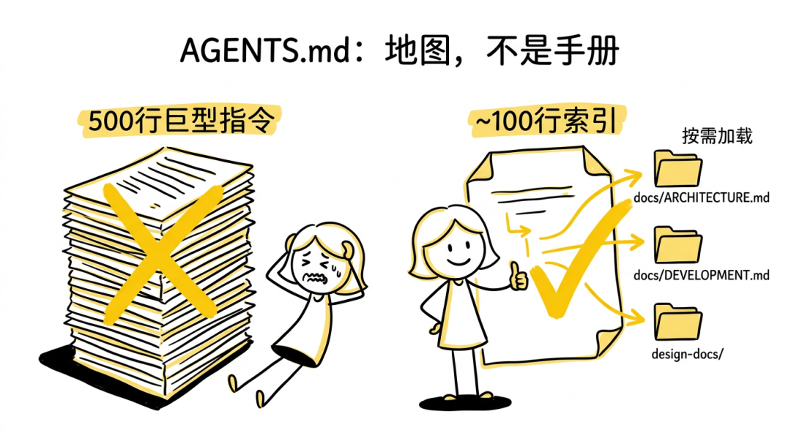
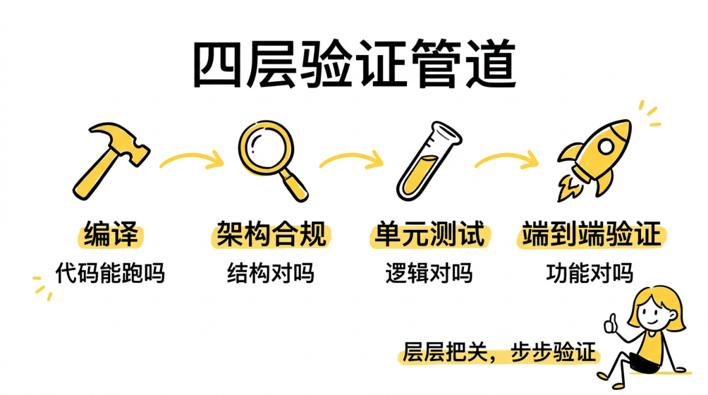
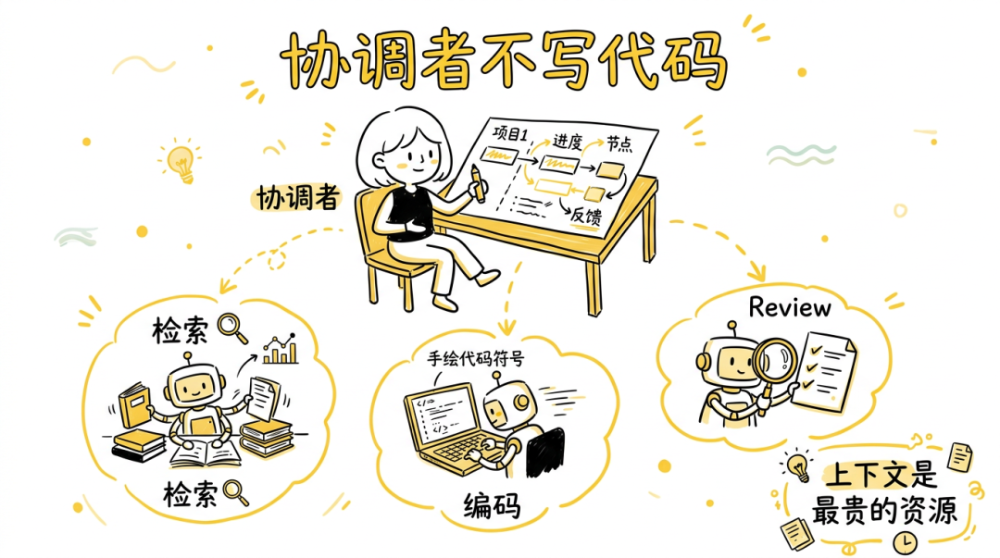
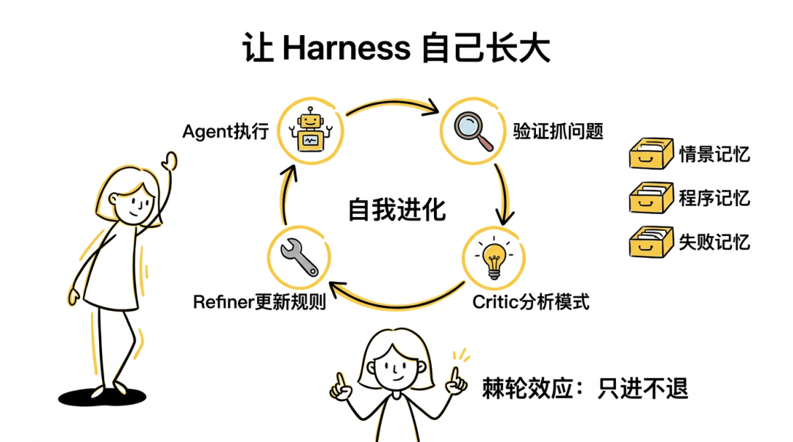

# Qoder 工程实践：Harness Engineering 指南

公众号：泮圣伟

发布时间：2026-04-03 17:00


当我们让 AI Agent 实现一个功能，它思考了一下，开始写代码。200 行写完，运行 lint 直接失败。我们发现类型定义文件 import 了配置包，但是违反了我们期望的架构分层约束，因为 Agent 不知道这个规则，当然我们也没告诉它。

于是它开始修复：移动代码、调整依赖、重新组织。再跑 lint——又一个新问题。循环三次后，上下文窗口被错误日志和 diff 塞满，Agent 开始"忘记"最初的任务目标。

这不是 Agent 不够聪明。这是 Agent 看不见 。

你可能也遇到过类似的事情：同一个项目，昨天的 AI 还记得你们的架构约定，今天开个新会话又全忘了。每次协作都要重新解释一遍背景、分层规则、命名规范。AI 生成的代码能跑，但完全不符合团队规范，code review 时才发现一堆问题。让它修 bug，结果引入了新 bug——没有自动验证，全靠人肉检查。

如果换成一个新入职的工程师，他可能也不熟悉代码库，但至少会问一句："这个文件应该放在哪个目录？""这样 import 可以吗？"他在行动前寻求验证。AI Agent 不会。它直接干。

问题出在哪？Prompt 写得再好，也没法穷尽代码库的所有隐式规则。上下文窗口再大，也装不下整个仓库的架构决策。"教得更好"这条路有天花板——写更详细的 system prompt，提供更多示例，规则会随代码演进变化，你永远追不上。规范文档放在 钉钉 或 Notion 上，AI 读不到；依赖 AI 的"常识"，不同模型表现差异大，不可靠。

Harness 工程的思路不一样：与其教 Agent 怎么做，不如让它自己验证做得对不对。靠代码、linter、测试来保证正确性，而不是靠 LLM 的"直觉"。这些机械化检查不会出错，不会遗忘，也不会被上下文压缩掉。就像 CI/CD 对人类开发者的作用——自动拦截问题。只不过这次拦截的时机更早，不是合并前，而是写代码前。

## 仓库是 Agent 的操作系统

CPU 很强大，但没有操作系统它就是一块高速却无方向的芯片——不知道硬盘在哪、网络协议是什么、哪些内存地址可以写。LLM 也一样。它推理能力很强，但它不知道你的 internal/types/ 不能 import internal/config/ ，不知道新文件该放哪个目录。Harness 就是给它装的"操作系统"。

这个类比背后有几条关键原则。

1. 首先，仓库是唯一的事实来源。Aone里的讨论、钉钉会议上的口头约定、架构师脑子里的蓝图，这些对 Agent 来说都不存在。不在仓库里，Agent 就看不见；看不见就会违反。所以第一步是把一切编码到仓库中：架构决策、层级约束、命名规范。不是写在 Wiki 里，不是发在群里，而是作为版本化的文件提交到 Git。这样知识跟着代码一起走，新人 clone 仓库就能拿到全部上下文，Agent 打开项目就能读到一切。

2. 但编码到仓库不意味着把所有东西塞进一个文件。很多团队的第一反应是写一份巨大的 AGENTS.md，500 行，什么都有。问题是：当一切都重要时，什么都不重要。500 行的指令文件挤占了 Agent 宝贵的上下文窗口，留给实际任务的空间反而少了。AGENTS.md 应该是地图，不是手册——控制在 ~100 行，只做索引和指路，详细内容放在 docs/ 目录里按需加载。要改 auth 模块？先读 AGENTS.md 找到路，再读 docs/design-docs/auth.md 拿细节。用不上的文档根本不加载。保持短小精悍还有一个好处：不容易腐烂，巨大的指令文件会迅速过时。



3. 然后是约束的粒度。Harness 不规定"你必须用这个设计模式"或"函数必须这样写"，它只管架构边界。大多数代码库的包和模块之间存在自然的依赖方向：类型定义被所有人 import、业务逻辑依赖类型但不依赖 HTTP 层、HTTP handler 依赖业务逻辑。Harness 把这种自然方向编码为层级编号——Layer 0 是类型定义（不 import 任何内部包），Layer 1-2 是工具函数和配置（只依赖更低层），Layer 3 是业务逻辑，Layer 4+ 是 HTTP handler 和 CLI 命令。规则就一条：高层可以 import 低层，反过来不行。在这个边界之内怎么实现，随便。跟管理大型平台团队一样：中心化约束，本地自治。

4. 最后一条原则关乎人的角色。以前是人写代码、AI 辅助补全；现在反过来了——人设计系统（架构、约束、验证规则），Agent 在系统内执行。人的价值从"写出正确的代码"变成了"设计出让 Agent 能可靠产出正确代码的环境"。你不再需要自己拧每一颗螺丝，但你得确保流水线是对的。

## 落地：从搭建到执行

说了这么多理念，具体怎么落地？Harness 靠两个引擎协作：harness-creator 负责分析代码库、生成基础设施（文档、lint 脚本、目录结构）；harness-executor 在这套基础设施中执行开发任务。它们的关系很简单——executor 启动时先看 AGENTS.md 在不在，不在就自动喊 creator 来搭，搭完再继续干活。所以任何项目都能直接用 executor 起步。

creator 首次运行时会审计项目现状，按文档覆盖率、lint 规则覆盖率等维度打出 0-100 分。0-20 分基本是裸奔状态，从零搭建全套；21-70 分说明有基础但有缺口，针对性补充；71 分以上已经比较健康，微调就行。

executor 的工作流是：检测环境 → 加载上下文 → 制定计划 → 人类批准 → 执行 → 验证 → 完成。注意"人类批准"这一步不是走过场——对于非简单任务，executor 会创建一个执行计划文件，包含任务目标、影响范围、分阶段步骤、验证方式和回退策略。你扫一眼就知道 Agent 打算怎么干，觉得不对可以直接改方向。

一个装备了 Harness 的项目，大致长这样：

```text
my-project/
├── AGENTS.md ← 导航地图（~100行）
├── docs/
│ ├── ARCHITECTURE.md ← 架构、层级、依赖规则
│ ├── DEVELOPMENT.md ← 构建/测试/lint 命令
│ ├── PRODUCT_SENSE.md ← 业务上下文
│ ├── design-docs/ ← 组件设计文档
│ └── exec-plans/ ← 执行计划（active / completed）
├── scripts/
│ ├── lint-deps.* ← 层级依赖检查
│ ├── lint-quality.* ← 代码质量规则
│ ├── verify/ ← 端到端功能验证
│ └── validate.py ← 统一验证管道
├── harness/
│ ├── tasks/ ← 任务状态和检查点
│ ├── trace/ ← 执行轨迹和失败记录
│ └── memory/ ← 经验教训存储
└── [业务代码...]
```

每一部分在执行过程中都有用：文档提供知识，脚本提供验证，harness/ 提供状态管理和学习能力。其中 scripts/ 下面的机械执法层是核心——它把团队约定从"希望被遵守"变成"不遵守就报错"。

## 在动手之前先问"能不能做"

接下来聊验证，这是最实操的部分。

Harness 里的验证分几类。最核心的是依赖方向检查（lint-deps）—— core/ 不能 import ui/ ， api/ 和 cli/ 不能互相引用。对应的就是前面说的层级规则，靠扫描源码里的 import 语句来检查。其次是质量规则检查（lint-quality），强制一些编码规范：单文件不超过 500 行，禁止 console.log / print() （要求用结构化日志），禁止硬编码品牌字符串。这些规则说起来都是常识，但 Agent 不提醒就不会遵守。lint 脚本有 Go、TypeScript、Python 三个版本，creator 会根据你的项目类型自动生成。

但重点不是事后检查，而是事前预防。Agent 通常的工作流是写代码、跑测试、发现错误、修复、再跑测试。当一个层级违反在 50 行代码写完后才被 linter 抓到，修复代价很大——撤销改动、重新设计，差不多要消耗 10 次 tool call。而如果在写代码前先问一句"这样做合法吗"，两次交互就够了：

```bash
python3 scripts/verify_action.py --action "create file internal/types/user.go"
# ✓ VALID: internal/types/ is Layer 0, user.go follows naming convention
python3 scripts/verify_action.py --action "import internal/core from internal/handler"
# ✗ INVALID: internal/handler (L4) cannot import internal/core (L3)
#   Fix: handler should depend on core through interfaces
```

不是每个操作都需要预验证。改个函数体不需要，加个测试文件不需要。但只要涉及"在新位置创建文件"或"添加跨包 import"，就该先验证。层级违反是 Agent 翻车的头号原因。

这里有一个容易被忽视但影响很大的细节：linter 的错误信息质量直接决定了 Agent 能不能自愈。一条 Forbidden import in core/types/user.go 看完不知道怎么办；但如果改成 core/types/user.go imports core/config (Layer 0 → Layer 2). Layer 0 packages must have NO internal dependencies. Fix: Move config-dependent logic to a higher layer, or pass the config value as a parameter. ——什么规则违反了、为什么是问题、怎么修，全在里面。一条好的报错本身就是一次教学。

Harness 不鼓励 Agent 直接跑 go build 或 go test ，而是提供统一验证入口 validate.py ，因为"验证通过"在每个项目里含义不同。验证顺序有讲究：先 build（编译都不过就别往下了），再 lint-arch（架构约束），然后 test（功能正确性），最后还有一步容易被漏掉——verify。

build + lint + test 能覆盖大部分问题，但有一类问题它们抓不到：功能层面的正确性。测试通过了不代表功能是对的——测试本身可能覆盖不全，或者 Agent 写的测试恰好绕过了关键路径。verify 步骤是项目级别的端到端功能验证——不是"函数返回值对不对"，而是"用户执行这个操作，最终结果对不对"。比如一个 CLI 工具，verify 会实际运行几个典型命令检查输出；一个 Web API，会发几个真实请求验证响应。

```text
build → lint-arch →
test
→ verify
│        │         │       │
│        │         │       └─ 端到端功能验证
│        │         └─ 单元/集成测试
│        └─ 架构和质量合规
└─ 代码能否编译
```

很多项目一开始并不具备端到端 verify 的能力。这时候 Harness 会引导你创建 verify skill——一组针对项目的可复用验证脚本。思路是先识别核心用户路径（比如"创建用户→登录→查看资料"），然后把每条路径编码成可执行的验证脚本。creator 分析项目时会自动生成骨架放在 scripts/verify/ 下面，你填充具体的断言逻辑就行。这让验证闭环从"代码能跑"提升到了"功能正确"。



验证挂了怎么办？executor 会自动进入修复循环——分析错误、改代码、重新跑验证，一般 1-3 轮就收敛。如果同一个错误转了 3 圈还没过，就别让 Agent 继续挣扎了，停下来交给人。不是它一定修不好，而是再转下去上下文窗口就要爆了。

几条踩过坑之后的经验：故意引入违规来测试 lint，加一个跨层 import 确认能被检测到，如果 lint 没报错说明护栏是纸糊的；永远不要禁用 lint 规则来"解决"问题，Agent 有时候会想绕过规则（比如注释掉 lint 配置），应该改代码而不是改规则；测试不需要每次跑全量，executor 支持只跑受影响的包，速度快很多。

## 上下文是最贵的资源

如果这篇文章你只记住一件事，记这个：中等复杂度以上的任务，协调者绝不写代码。

为什么？因为 LLM 的上下文窗口是有限的。Agent 执行长任务时，窗口里慢慢堆起来的是代码 diff、编译错误、测试输出、lint 报告、重试记录……到第 40 次 tool call，早期的关键信息已经被压缩或丢弃了。Agent 开始"忘记"最初的架构决策，做出跟前面矛盾的改动。任务越复杂，消耗的上下文越多，关键信息被压缩，决策质量下降，又产生更多错误，需要更多修复，又消耗更多上下文……一旦进去就很难出来。到第 60 次 tool call，Agent 可能已经忘了最初的任务目标是什么了。你让它加个用户认证功能，它却在那儿纠结一个完全不相关的 import 路径问题。



解法是把 Agent 拆成两层。协调者（Coordinator）只管规划、委派、汇总，一行代码都不碰；执行者（子代理）每次从干净的上下文开始，拿到精确的 prompt，干完就释放。子代理不知道之前发生了什么，但它拿到的 prompt 里包含了它需要知道的一切。任务完成后，详细上下文被丢掉，协调者只保留一段摘要。信息经过了压缩和筛选，而不是无差别地堆在上下文里。

破坏这个原则最常见的方式是"只是快速改一下"。协调者发现一个小问题，心想"这么简单的东西不用启子代理，我直接改了"。一次编辑变成了五次（因为牵扯出其他地方），五次变成二十次，上下文就被消耗殆尽了。这个陷阱看起来很合理——"就改一行而已嘛"——但你低估了代码的牵连性。如果你发现协调者正在用 Edit 或 Write 工具修改源代码，立刻停下来，启动子代理。没有例外。

复杂度不同，执行方式也不同。改个 typo、加行日志这种小事可以直接做；多文件一致性修改就该委派给子代理；到了重构、新模块这种结构性变更，子代理还得在 Git Worktree 里隔离执行——相当于仓库的临时副本，成功了合并，失败了丢掉，不污染主分支。快速判断方法：能用一句话描述且不包含"和"字的，直接做；需要清单来跟踪改了哪些地方的，委派；需要做设计决策和权衡的，委派加隔离。

委派子代理时还有一个容易被忽略的杠杆：不是所有任务都需要用最强的模型。一个"重命名变量"的任务和一个"重构认证模块"的任务，对模型能力的要求完全不同。前者要的是快和便宜，后者要的是深度推理。如果所有子代理都用同一个顶级模型，既浪费钱又浪费时间。

协调者在委派时可以根据任务性质指定模型。快速执行类（改 typo、简单重命名）用轻量模型如 Claude Haiku，响应快、成本低；深度推理类（复杂重构、架构级变更）用 GPT-5.3 Codex 或 Claude Opus，质量远比速度重要；代码检索类（在大型代码库中定位相关文件）用 Gemini 3 Flash，速度第一。

```python
Agent(
    description="Execute: rename-user-field",
    model="haiku",
    # 简单任务，轻量模型
    prompt="..."
)

Agent(
    description="Execute: refactor-auth-module",
    model="opus",
    # 复杂任务，重量级模型
    isolation="worktree",
    prompt="..."
)
```

一个中等复杂度的功能开发，可能会同时调度三四个不同模型的子代理：一个用 Flash 检索相关代码，一个用 Opus 做核心实现，完成后再用 Codex 做交叉 review。协调者本身用中等模型就行——它不写代码，只做调度。总成本可以降低 60-70%，复杂任务的质量不打折扣。

说到交叉 review，这是整个流程中一个很值得展开的环节。机械化验证（lint、test、verify）能抓到规则层面的问题，但抓不到逻辑合理性——代码编译通过、测试全绿、架构合规，但实现思路可能有隐患：竞态条件、边界遗漏、不必要的复杂度、命名让人看不懂。这些东西只有"另一双眼睛"才能发现。

关键词是"不同模型"。如果用同一个模型既写代码又 review，它容易对自己的产出"视而不见"——类似于人写完文章自己检查总觉得没问题。换一个架构和训练数据都不同的模型来 review，思维盲区的重叠就小得多。

实际操作中，交叉 review 嵌入在子代理完成编码、机械验证通过之后，协调者接受结果之前。Review 子代理拿到变更的文件 diff、任务描述和架构文档，检查逻辑正确性、边界条件、命名清晰度、潜在性能问题，输出"通过"或"需修改"（附具体建议）。需要修改就回到编码子代理修复，再过一轮 review。

```python
# 编码完成后，用不同模型做交叉 review
review_result = Agent(
    description="Review: rate-limiter implementation",
    model="codex",
    # 不同模型做 review
    prompt=f"""
Review the following changes for:
1. Logic correctness and edge cases
2. Consistency with architecture (see ARCHITECTURE.md)
3. Naming clarity and code readability
4. Performance implications
Changes: {coding_result.diff}
Task context: {task_description}
"""
)
```

不是所有任务都需要交叉 review。简单修改直接过机械验证就够了。但涉及核心业务逻辑、安全相关代码、或者影响面较广的重构，加一轮是值得的。成本上，review 子代理只需要读 diff 和文档，一次 review 的成本大约是编码成本的 10-20%。

这样做还有一个副作用：review 中发现的问题会被记录到 harness/trace/ 里。如果某类问题反复出现，说明应该把它编码成新的 lint 规则——把 review 中的"软知识"逐渐转化成验证管道中的"硬规则"。这也是 Harness 自我进化的一部分，后面会讲到。

中等以上的任务还会设检查点。每完成一个阶段、跑过验证就存档，包括已有的架构决策。任务中断了，下一个 Agent 能从检查点恢复，不会做出跟前面矛盾的选择。检查点携带架构决策这一点很重要——没有它，新 Agent 可能走一条完全不同的路，引入微妙的不一致。

## 让 Harness 自己长大

前面讲的 Harness 还是静态的——人定规则，Agent 遵守。但真正有意思的地方在于，Harness 能从 Agent 的失败里学东西。



想想看：每次 Agent 犯错都是一个信号。如果同一类错误反复出现，说明 Harness 本身有缺口——要么某个包没被 linter 覆盖，要么某条规则的错误信息写得不够清楚，要么某个场景缺少文档。与其靠人去发现这些缺口，不如让系统自己分析。

每次验证失败都被结构化地保存到 harness/trace/failures/ 。Critic 脚本定期分析这些记录，找出模式和根因——比如发现 internal/cache 被 7 次违规 import，根因是它没被加入层级映射表，建议修复是把它加入 Layer 1。然后 Refiner 根据建议去更新 Harness：把遗漏的包加入 linter 规则，改写含糊的错误信息，补上缺失的文档。整个循环跑起来就是：Agent 执行 → 验证抓到问题 → Critic 分析模式 → Refiner 更新规则 → 下一个 Agent 受益。

Harness 还维护着三种"记忆"。情景记忆记录具体事件和教训，比如"macOS 下 /var 是 /private/var 的符号链接，会导致工作区路径比较失败"——这类教训可能只要 10 秒加载，却能省下一整个重试循环。程序记忆记录成功的操作步骤，比如"添加 API 端点的标准五步流程，成功率 90%"，新的子代理执行同类任务时会先查这里。失败记忆专门供 Critic 分析用。每次任务开始时，executor 会查询相关记忆，这些记忆的价值随着项目演进不断累积。

这套闭环走到极致会出现一个很有意思的东西：轨迹编译。当同一类任务被成功执行了三次以上，而且步骤高度一致——比如"添加 API 端点"每次都是创建类型文件、写服务方法、加 handler、注册路由、写测试——这个模式就可以被"编译"成一个确定性脚本，像 make add-endpoint NAME=foo 这样。以后再做同类任务直接跑脚本，LLM 都省了。脚本失败了再回退到 Agent 模式就好。

这是个棘轮效应：每一个被编译的成功模式都变成了永久基础设施，Agent 被释放去处理真正需要创造力的新问题。整个系统的运行成本越来越低，能力越来越强。

## 从今天开始实践

理论讲完了。好在 Harness 不是全有或全无的——哪怕不搭完整的六层基础设施，一个 AGENTS.md 就能让 AI 协作体验好一截。这套方法适用于任何能跑 shell 命令的 coding agent（Qodercli、Claude Code、Codex 等都行）。多人协作、有明确分层的中大型项目收益最明显；个人项目或原型阶段，一个 AGENTS.md 加个简单的 lint 脚本就够了。

新项目最简单——告诉 creator 你要做什么，它会问几个基本问题，然后直接生成全套基础设施。老项目也不难，creator 会扫描代码库、分析 import 关系、推断层级映射，生成反映代码现状的文档。随着项目演进，定期跑一次 Improve 模式做体检：creator 输出审计报告，指出哪些包没被 linter 覆盖、哪些文档没跟上代码变化，然后 executor 来实施修复。

不管哪种情况，最小起步都一样——在项目根目录创建 AGENTS.md：

```markdown
# [项目名] Agent Guide

## 快速链接
- `docs/ARCHITECTURE.md` — 分层规则、数据流
- `docs/DEVELOPMENT.md` — 构建、测试、lint 命令

## 构建命令
```bash
make build
# 构建项目
make test
# 运行测试
make lint-arch
# 运行架构 lint
```

## 分层规则
- Layer 0: types/ → 纯类型定义，无内部依赖
- Layer 1: utils/ → 工具函数，仅依赖 Layer 0
- Layer 2: config/ → 配置，依赖 Layer 0-1
- Layer 3: core/services/ → 业务逻辑，依赖 Layer 0-2
- Layer 4: api/ cli/ ui/ → 接口层，依赖 Layer 0-3，彼此不互相引用

## 质量标准
- 结构化日志，禁止 `console.log` / `print()`
- 单文件不超过 500 行
- PascalCase（类型）、camelCase（函数）、kebab-case（文件名）
```

为什么叫 AGENTS.md？这个文件名业界的标准（ https://agents.md/ ），Agent 打开项目时会自动查找并读取它，作为了解项目的起点。类似于 README.md 是给人看的，AGENTS.md 是给 Agent 看的。建议的节奏：今天先把 AGENTS.md 建出来；这周加一个 lint-deps 脚本把层级规则定下来；这个月搭完整的验证管道；之后开启 Critic → Refiner 反馈循环，让 Harness 跟着代码一起长。最佳实践是先用 creator 把 Harness 建到 70 分以上，再开始用 executor 日常开发。

回到开头那个场景。装了 Harness 之后，同样的任务会变成这样：Agent 启动，读 AGENTS.md 找到相关文档；列出执行计划，你扫一眼批准；子代理开始写代码，每个结构性操作前先跑预验证；层级违反在写代码前就被拦住了；完成后另一个模型的子代理做交叉 review，抓出机械验证发现不了的逻辑问题；每个阶段存检查点、跑验证；任务做完，经验教训记下来，下一个 Agent 接着用。

Agent 不需要更聪明——它只是能看见更多了。

说到底，环境设计的投入回报远高于 prompt 调优。一套好的 Harness 能让普通模型产出可靠的代码，而没有 Harness 的顶级模型照样会在同样的坑里反复栽。搭建的前期成本不高——一个下午就能建好基本的 AGENTS.md 和 lint 脚本。但它的价值会随着时间复利式增长：记忆越来越丰富，lint 规则越来越完善，越来越多的操作模式被编译成确定性脚本。半年后回头看，你的仓库已经变成了一个高度适配你们团队工作方式的 Agent 运行环境，任何新加入的人（或新会话的 Agent）都能立刻进入状态。

竞争优势不再是 Prompt，而是 Trajectory。这些积累，换个模型复制不来。
