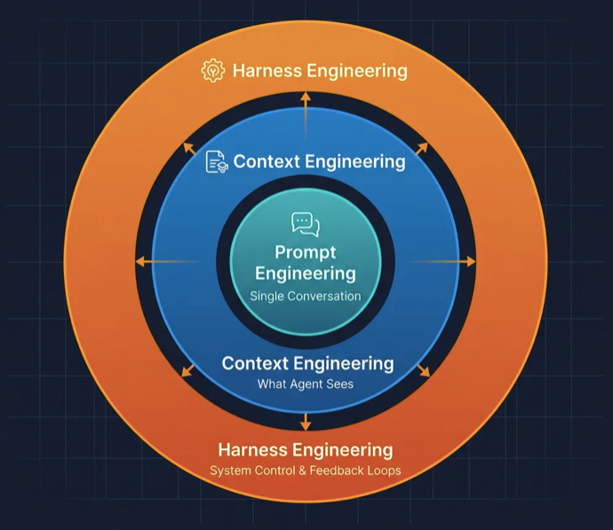
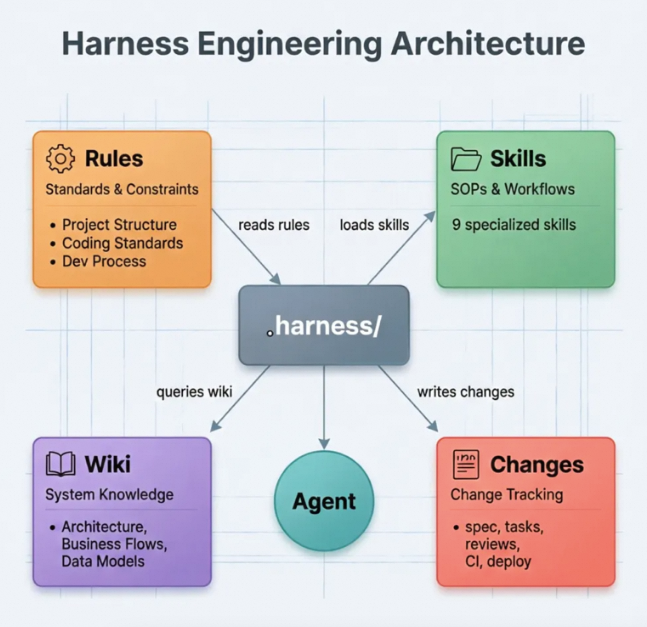
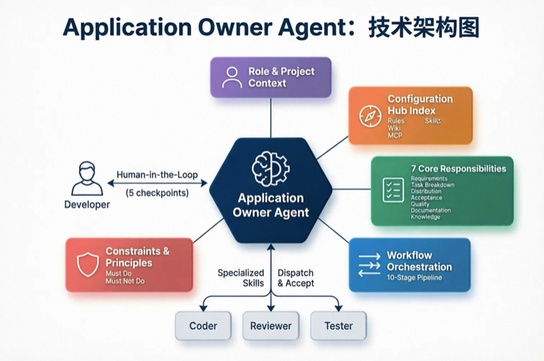
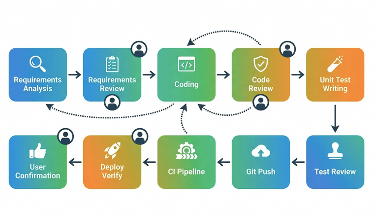
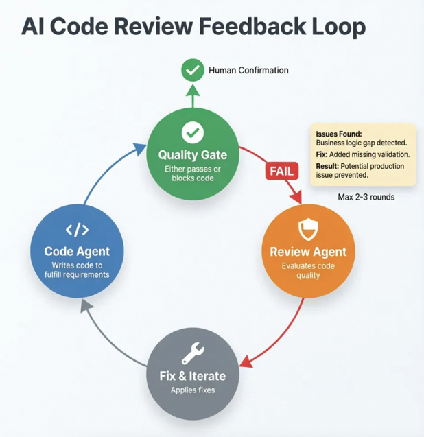
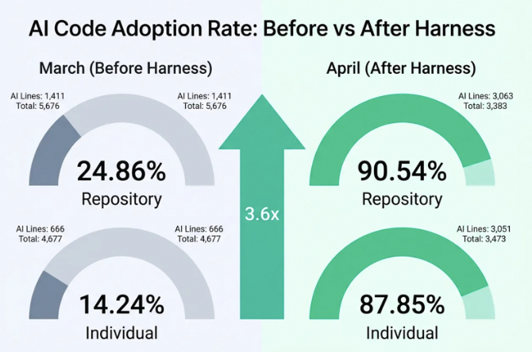

# Harness Engineering：耗时一周，我是如何将应用的AI Coding率提升至90%的


阿里妹导读

文章内容基于作者个人技术实践与独立思考，旨在分享经验，仅代表个人观点。

### 从 Prompt Engineering 到 Context Engineering 再到 Harness Engineering，AI Coding 正在经历第三次范式跃迁。本文结合 Anthropic、OpenAI 的最新方法论与真实项目实践，系统分享如何为存量 Java 应用构建完整的 Harness 体系，将 AI 代码率从不到 25% 提升至 90%。

一、为什么要聊 Harness Engineering

2025 年是 AI Coding Agent 全面爆发的一年。Cursor、Claude Code、Copilot Workspace、Windsurf 等产品让开发者第一次真切感受到 Agentic Coding 的力量——Agent 不再只是补全几行代码，而是能理解需求、规划方案、跨文件编辑、运行测试，甚至发起 Pull Request。

Anthropic 在其《2026 Agentic Coding Trends Report》中指出，开发者在日常工作中已有约 60% 的时间在使用 AI 辅助，但能够"完全委托"给 Agent 的任务比例仅为 0-20%。这个巨大的落差揭示了一个核心矛盾：**模型的原始能力已经足够强，但从"能力"到"可信赖的工程产出"之间，还横亘着一道系统性鸿沟。**

当我们把 Agent 放进一个真实的企业级代码库——十几万行代码、多条业务链路交织、技术栈涉及 RPC 框架、流程编排引擎、配置中心、分布式缓存等中间件——很快就会遇到一个普遍的困境：Agent 写出来的代码往往"语法正确、风格统一，但业务语义上存在微妙的错误"。它不知道某个配置项在全项目有 85 处引用，不知道某个链路是高频变更区，不知道价格字段必须用 `long` 类型且单位为分。这些散落在团队经验中的隐性知识，从未被系统化地记录下来。

**Harness Engineering 就是用来弥合这道鸿沟的。** 这篇文章会从概念出发，讲清楚它是什么、行业头部团队在怎么做，然后重点分享我在真实项目中从零构建 Harness 体系、将 AI 代码率从 24.86% 提升至 90.54% 的完整实践。

二、Harness Engineering 是什么

**2.1 从 Prompt 到 Context 到 Harness：**

**三次范式跃迁**

AI 工程实践正在经历三个清晰的演化阶段：

**Prompt Engineering（2022-2024）** 关注的是单次交互的优化——如何通过 Few-shot Learning、Chain-of-Thought、角色设定等技巧，让模型在一次对话中给出更好的回答。它的核心隐喻是"写好一封邮件"。

**Context Engineering（2025）** 向前迈了一步，关注的是"给 Agent 看什么"——动态构建的上下文窗口中应该填充哪些文档、对话历史、工具定义和 RAG 检索结果。Shopify CEO Tobi Lutke 将其类比为"给邮件附上所有正确的附件"。这一阶段的核心突破是认识到：模型的表现上限取决于上下文的质量，而非 prompt 的措辞。

**Harness Engineering（2026）** 则站在更高的抽象层次，它不再只关注"一次对话"或"一次上下文窗口"，而是设计**跨越多个会话、多个 Agent 角色、多个执行阶段的完整系统架构**。正如 OpenAI 工程师 Ryan Lopopolo 在其团队用 Agent 构建百万行代码产品后总结的那样："Agents aren't hard; the Harness is hard."

Mitchell Hashimoto（HashiCorp 创始人）对 Harness Engineering 给出了一个精准的操作性定义："Every time you discover an agent has made a mistake, you take the time to engineer a solution so that it can never make that mistake again." 它不是一次性的 prompt 优化，而是一个持续演进的系统工程闭环。


> 用一句话概括：**Harness Engineering 是围绕 AI Coding Agent 设计和构建约束机制（Constraints）、反馈回路（Feedback Loops）、工作流控制（Workflow Orchestration）与持续改进循环（Continuous Improvement）的系统工程实践。**

**2.2 为什么不能只靠模型本身**

Anthropic 在其 Harness 工程博客中系统总结了 Agent 在复杂项目中的四种典型失败模式（Failure Modes）：

**Failure Mode 1: One-shot Syndrome（试图一步到位）。** Agent 拿到复杂需求后，倾向于在单个上下文窗口内完成全部工作。当实现进行到一半，上下文已被消耗大半，模型开始出现 Hallucination、循环输出、格式错误的 Tool Call。Anthropic 的经验数据表明，上下文窗口的 Sweet Spot 在 **40% 以下**的填充率；超过此阈值，输出质量快速衰退。

**Failure Mode 2: Premature Victory Declaration（过早宣布胜利）。** Agent 完成部分工作就宣布任务结束，核心功能尚未实现或验证。这在实践中极为常见——Agent 输出"编码完成"，但实际上编译都无法通过。

**Failure Mode 3: Premature Feature Completion（过早标记功能完成）。** Agent 认为功能已实现但未做端到端测试验证，部署后才发现关键路径不通。Anthropic 的解决方案是引入 Browser Automation（Puppeteer MCP）进行自动化的端到端验证截图。

**Failure Mode 4: Cold Start Problem（环境启动困难）。** 多次会话间缺乏持久化记忆，每次新会话需花大量 Token 重新理解项目结构，真正用于编码的 Token Budget 被严重挤压。

这四种失败模式的共同根源是：**Agent 缺乏外部的结构化约束（Structured Constraints）和反馈机制（Feedback Mechanisms）。** Anthropic 进一步指出，Agent 存在一个根本性的能力缺陷——"Agents are incapable of accurately evaluating their own work"——它们无法准确评估自身产出的质量。Harness 的作用，就是通过外部化的控制系统来弥补这一缺陷。

**2.3 四根支柱**

综合 Anthropic 的长时间运行 Agent 工程实践和 OpenAI 团队用 Codex 构建百万行代码产品的经验（3→7 人团队，产出 ~1M LOC，1,500 PRs，人均 3.5 PRs/天，效率提升约 10 倍），Harness Engineering 可以归纳为四根支柱：

**支柱一：上下文架构（Context Architecture）。** Agent 应当恰好获得当前任务所需的上下文——不多不少。OpenAI 团队早期犯过一个典型错误：将 AGENTS.md 写成了百科全书，结果"所有内容都重要 = 没有内容重要"。后来他们改为将 AGENTS.md 控制在 ~100 行，作为索引和地图（Index & Map），指向更深层的 Design Docs、Architecture Specs 和 Quality Criteria。上下文分层加载、按需获取，是 Harness 性能的基石。

**支柱二：Agent 专业化（Agent Specialization）。** 拥有受限工具集（Constrained Toolset）的专业 Agent，优于拥有全部权限的通用 Agent。Anthropic 在其 Harness 设计中明确分离了三种角色：Planner 负责规划、Generator 负责实现、Evaluator 负责验证。他们的核心发现是："将做事的 Agent 和评判的 Agent 分开，是一个强有力的杠杆（Powerful Lever）。"

**支柱三：持久化记忆（Persistent Memory）。** 进度持久化在文件系统上，而非上下文窗口中。Anthropic 的标准化启动序列是：检查当前工作目录 → 读取 Git Log 和进度文件（如 `progress.md`）→ 定位优先级最高的未完成任务 → 开始工作。这使得跨越数十个会话的长时间任务成为可能。

**支柱四：结构化执行（Structured Execution）。** 永远不让 Agent 在未经审查和批准书面计划之前写代码。理想的执行流应是：理解 → 规划 → 执行 → 验证，每个阶段之间有明确的质量门禁（Quality Gates）。OpenAI 团队的经验是：用 Custom Linter + Structure Tests + Taste Invariants 构建机械化约束，完全替代文档层面的"建议"和"最佳实践"。他们的原则是："Waiting is expensive, fixing is cheap"——宁可让 Agent 多跑一轮验证，也不要在人工 Review 时才发现问题。

三、AI Coding 的现状与挑战

在进入实践之前，有必要正视当前 AI Coding 在企业级项目中面临的核心挑战。这些挑战不是某个特定项目的个案，而是所有试图将 Agent 引入存量代码库的团队都会遇到的系统性问题。

**3.1 大型存量代码库的认知负担**

**（Cognitive Load）**

企业级 Java 应用通常具备以下特征：代码量在十万行以上，技术栈涉及 RPC 框架（HSF/Dubbo/gRPC）、流程编排引擎（LiteFlow/Temporal）、配置中心（Diamond/Apollo/Nacos）、分布式缓存（Tair/Redis）、数据库中间件（TDDL/ShardingSphere）等。业务链路层层嵌套，模块间的依赖关系错综复杂。

对于 Agent 来说，这种认知负担是灾难性的。它不知道某条链路是高频变更区（过去一年有数十次 XML 改动），不知道某个全局配置类在项目中有近百处引用，不知道某些字段有隐含的类型和单位约束——这些"隐性知识"（Tacit Knowledge）散落在团队成员的经验中、群聊的历史消息中、未入库的会议纪要中。

正如 OpenAI 团队在百万行代码实践中总结的：**Agent 的知识边界等于代码库的文件边界（The agent's knowledge boundary equals the repository's file boundary）。** 如果某条架构约定不在代码库中以机器可读的形式存在，对 Agent 来说它就不存在。

**3.2 质量控制的系统性缺失**

**（Systematic Quality Gap）**

裸用 Agent 写代码时，质量控制几乎完全依赖人工 Code Review。但当 Agent 的产出速度远超人工审查速度时，质量瓶颈就从"写代码"转移到了"看代码"。更麻烦的是，Agent 生成的代码通常语法正确、风格统一，但在业务语义层面可能存在微妙的错误——比如忘了在国际化链路上做同样的修改，或者没有考虑到配置中心某个动态参数的影响。

Anthropic 的研究证实了这一判断："Agents are incapable of accurately evaluating their own work"。这意味着，**我们不能依赖 Agent 自我审查，必须构建外部化的、自动化的质量验证体系。**

**3.3 熵的累积（Entropy Accumulation）**

这是 OpenAI 在百万行代码实践中提出的一个重要概念。Agent 写代码时会模仿代码库中已有的 Pattern，包括那些 Suboptimal 的 Pattern。每次 Agent 生成代码，都可能引入少量的风格不一致、冗余逻辑或次优实现。单次看起来无关痛痒，累积起来却会让代码库逐渐腐化（Code Rot）。

OpenAI 早期尝试每周五手动清理"AI 产物"，但很快发现这种方式无法持续。他们最终的解决方案是将"Golden Principles"编码化——例如"优先使用共享工具包而非手写辅助函数"、"结构化日志格式统一"等——让后台 Agent 自动扫描违规并提交修复 PR，形成自动化的"Entropy Garbage Collection"机制。

**3.4 开发者角色的范式转移**

**（Paradigm Shift）**

引入 Agent 后，开发者的核心工作正在发生本质变化。传统模式下，日常工作是写代码、调 Bug、做 Code Review。在 Agent-First 模式下，核心工作变成了：**设计 Agent 的工作环境（Working Environment Design）、编写规范文档（Specification Authoring）、管理任务拆分与验收（Task Orchestration & Acceptance）。**

文档从"给人看的参考资料"变成了"Agent 认识世界的唯一窗口"。架构约束不再只是"大团队才需要"的奢侈品，而是 Agent 能够高效工作的前置条件。发现 Bug 不再只是修代码，而是修 Harness——从根源上防止同类问题再次出现。这与 Mitchell Hashimoto 的定义完全一致：**每发现一个错误，就工程化地消除它再次发生的可能性。**

四、Harness Engineering 实战

下面进入最核心的部分——我在一个真实的企业级 Java 应用（代码量 10 万+行，技术栈：Java 1.8 / Spring Boot / LiteFlow / HSF / Diamond / Tair）中，如何从零构建起完整的 Harness 体系。

**4.1 整体设计：四要素架构**

基于前文总结的四根支柱，我将 Harness 的落地设计拆解为四个核心要素：

**规则体系（Rules）** — 告诉 Agent"标准是什么"。工程结构约束、编码规范、分层架构约定，这些是不随需求变化的稳定约束（Invariant Constraints）。

**技能体系（Skills）** — 告诉 Agent"应该怎么做"。需求分析的 SOP、编码的分层规范、评审的检查清单、单元测试的编写方法，这些是可复用的标准化工作流程（Reusable Workflows）。

**知识库（Wiki）** — 告诉 Agent"系统是什么样的"。链路梳理、数据模型、核心业务流程的文档化描述，这些是 Agent 理解业务上下文的素材（Domain Context）。

**变更管理（Changes）** — 记录 Agent"做了什么"。每个需求从分析到部署的全过程文档，构成完整的追溯链（Audit Trail）。

这四个要素组合起来，以项目根目录下的 `.harness/` 目录作为物理载体：




```powershell
.harness/
├── agents/          # Agent 角色定义
├── rules/           # 规则体系
│   ├── 工程结构.md
│   ├── 开发流程规范.md
│   └── 项目编码规范.md
├── skills/          # 技能体系（9 个 Skill）
│   ├── request-analysis/      # 需求分析
│   ├── coding-skill/          # 编码实现
│   ├── expert-reviewer/       # 专家评审
│   ├── unit-test-write/       # 单元测试编写
│   ├── unit-test-ci/          # CI 流水线验证
│   ├── deploy-verify/         # 部署验证
│   ├── code-review/           # 代码检查
│   ├── project-analysis/      # 项目分析
│   └── aone-ci-generate/      # CI 配置生成
├── changes/         # 变更管理目录
├── mcp/             # 外部工具集成配置（MCP Servers）
└── (wiki/ 位于项目根目录)
```


**4.2 Agent 角色定义：应用 Owner 的诞生**

在四要素架构的基础上，Harness 体系需要一个"大脑"来串联一切——这就是 **Application Owner Agent**（应用 Owner）。它是整套体系的编排中枢，直接与开发者交互，负责从需求接收到交付验收的全流程调度。

Agent 定义文件存放在 `.harness/agents/` 目录下，是整个 Harness 体系中信息密度最高的文件，通常在 400 行左右，承担着 Anthropic 所说的"Index & Map"职责——它不是百科全书，而是一张精心设计的地图，告诉 Agent 在什么阶段该去哪里找到什么知识。



一个完整的 Application Owner Agent 定义包含以下五个核心模块：

**模块一：角色与项目背景（Role & Project Context）。** 开篇明确 Agent 的身份定位："你是某某应用的 Owner，是整个项目的第一负责人。"紧接着是项目的核心背景信息——模块结构、技术栈、关键中间件、核心业务约束（如价格字段类型、时间格式规范等）。这段信息控制在 20-30 行以内，提供"刚好够用"的项目视野，避免信息过载。

**模块二：配置中枢索引（Configuration Hub Index）。** 这是"地图"的核心部分。用结构化的表格列出 `.harness/` 下 Rules、Skills、Wiki、MCP 四大组件的路径、职责、触发场景和更新频率。Agent 通过这张索引表，能在任意阶段快速定位到需要加载的知识。例如 Skill 索引：

| 技能 | 路径 | 触发场景 |
| --- | --- | --- |
| request-analysis | `.harness/skills/request-analysis/` | 需求分析阶段 |
| coding-skill | `.harness/skills/coding-skill/` | 编码实现阶段 |
| expert-reviewer | `.harness/skills/expert-reviewer/` | 评审循环阶段 |
| unit-test-write | `.harness/skills/unit-test-write/` | 单元测试编写 |
| unit-test-ci | `.harness/skills/unit-test-ci/` | CI 流水线验证 |
| deploy-verify | `.harness/skills/deploy-verify/` | 部署验证阶段 |

索引中还包含 Wiki 知识库的推荐阅读路径（快速上手、业务开发、数据对接、部署运维），以及 MCP 外部工具的集成配置。这种结构确保 Agent 不需要"全局扫描"来寻找知识——它始终知道该去哪里找。

**模块三：七项核心职责（Core Responsibilities）。** Owner Agent 的职责被精确定义为七个维度——需求理解与澄清、任务拆解、任务分发与协调、任务验收、质量把关、文档管理与知识库维护、知识问答与团队支持。每项职责都附带具体的行为准则。例如"任务拆解"要求明确每个子任务的目标、范围、输入输出、验收标准和依赖关系；"质量把关"要求关注变更对线上稳定性的影响，必要时主动要求补充单元测试或集成验证。

**模块四：工作流程调度指令（Workflow Orchestration Instructions）。** 这是 Agent 定义文件中最核心也最长的部分，定义了 10 阶段流程中每个阶段的完整调度逻辑。以阶段 2（需求评审）为例：


```markdown
加载 expert-reviewer Skill。
1. 对 spec.md 和 tasks.md 进行评审
2. 产出 review/spec_review_v1.md 和 review/tasks_review_v1.md
3. APPROVED → 向用户展示计划摘要，确认后进入阶段 3
4. REVISION REQUIRED → 返回阶段 1 修改
```


每个阶段都有明确的：触发条件、Skill 加载指令、产出物路径、质量门禁条件、失败回退路径。通过这些精确的指令，Owner Agent 能够自主驱动整个开发流程，只在 5 个 Human-in-the-Loop 确认点暂停等待人工决策。Agent 定义文件还包含 `summary.md` 维护规范——每个阶段完成后必须立即更新流程摘要，记录执行状态、评审轮次、CI 测试用例数等关键信息，确保全流程可追溯。

**模块五：沟通原则与硬性约束（Communication Principles & Constraints）。** 最后部分用"必须做到"和"禁止做的"两张清单定义 Agent 的行为边界。"必须做到"包括：任何工作开始前必须优先读取规则文件、每次变更前先理解现有代码逻辑、任务验收必须有可验证的证据、代码变更必须同步文档。"禁止做的"包括：不在未理解需求的情况下直接动手、不跳过验收直接交付、不隐瞒执行过程中发现的问题、不做超出需求范围的过度重构。

这种 Agent 定义方式的本质是**将一个资深开发者的工作习惯和决策逻辑编码化**。它不需要 Agent "学习"如何成为一个好的项目 Owner——它只需要严格执行定义文件中的每一条指令。这正是 Harness Engineering 的核心理念：用外部化的结构约束替代对模型内在能力的依赖。

**4.3 上下文架构：分层加载，按需获取**

上下文管理是整个体系的地基。我将项目知识按加载时机分为三个层次：

**L1 — 会话常驻层（Always Loaded）。** 包括 Agent 定义文件（约 420 行，承担 Index & Map 职责）和三份 Rules 文件。提供全局视野和基本约束，但总量严格控制——遵循 Anthropic 的经验，避免上下文窗口填充率超过 40%。

**L2 — 阶段触发层（Phase-triggered）。** 进入需求分析阶段时加载 `request-analysis` Skill；编码阶段加载 `coding-skill` 和 8 份分层编码 Spec（覆盖 Controller → Service → Domain → DAO → Adapter 全链路）；评审阶段加载 `expert-reviewer`。每个阶段只加载当前需要的知识。

**L3 — 按需查询层（On-demand）。** Wiki 知识库中的业务文档不会主动加载，Agent 根据任务需要自主查阅。这保证了上下文的"新鲜度"和针对性。

这种分层策略的核心考量是：**让 Agent 在任何时刻都拥有"刚好够用"的上下文（Just-enough Context）。** 对于中间件繁多的企业级应用尤其关键——如果把 RPC 规范、流程引擎组件写法、配置中心规范全部一次性塞给 Agent，信息过载反而会导致注意力分散和幻觉。

**4.4 十阶段开发流程：结构化执行的核心**

这是整套 Harness 体系中最重要的设计。我将一个完整的开发需求从接收到交付划分为 **10 个严格有序的阶段（10-Stage Pipeline）**：




```
需求分析 → 需求评审 → 编码实现 → 编码评审 → 单元测试编写
    → 单元测试评审 → 代码推送 → CI 验证 → 部署验证 → 用户确认
```


每个阶段都有明确的三要素：**触发条件（Entry Criteria）** — 什么时候可以进入；**Skill 加载（Skill Injection）** — 需要加载哪个技能包；**质量门禁（Quality Gate）** — 产出必须满足什么条件才能通过。

阶段之间的流转有精确的**回退路径（Rollback Routes）**：CI 失败时，测试为 0/0 回退到阶段 5（测试编写）；编译错误回退到阶段 3（编码实现）；需求不符回退到阶段 1（需求分析）。这种精确的失败路由避免了"出了问题只能从头来"的低效。

评审环节设置了**循环上限（Iteration Cap）**：需求评审最多 3 轮，编码/测试评审最多 2 轮，超出后升级到人工决策。这个设计防止了 Agent 陷入无限的自我修改循环（Infinite Self-correction Loop）。

流程中还嵌入了 **5 个 Human-in-the-Loop 确认点**：需求待决议确认、计划评审后确认、编码评审后确认、部署环境参数确认、最终交付确认。确保人始终掌握关键决策权。

**4.5 Skill 体系：将隐性知识显性化**

Skill 是这套体系中最花精力打造的部分。每个 Skill 本质上是一份结构化的 SOP（Standard Operating Procedure），将资深开发者脑中的隐性知识固化为 Agent 可执行的流程指令。

以 `coding-skill` 为例，内含 8 份分层编码规范（Layered Coding Specs）：

| 层级 | 规范文件 | 核心内容 |
| --- | --- | --- |
| 表现层 | Controller 实现 Spec | RPC Provider 实现模式、参数校验、异常处理 |
| 应用层 | 接口定义 / 接口实现 Spec | RPC 接口定义规范、DTO 设计原则 |
| 业务层 | 业务逻辑 Spec | 核心业务逻辑封装、流程编排组件写法 |
| 数据层 | 建表 / 持久化 Spec | DDL 设计规范、Mapper 编写方式 |
| 适配层 | 服务依赖 Spec | 外部 RPC 调用超时设置、降级方案 |
| 文档层 | 接口文档生成 Spec | 对外接口的协议文档模板 |

这意味着 Agent 在编码时不是"凭感觉"写，而是按照明确的规范一层一层地实现。编码规范中的硬性约束包括：价格字段必须用 `long` 类型（单位为分），禁止 `double`/`float`；外部服务调用必须设置超时和降级；流程编排组件必须委托 Service 处理，组件内不写大段业务逻辑。

`expert-reviewer` 是质量保障的核心 Skill。它定义了两种评审循环：**计划评审（Plan Review）** 审查 spec.md + tasks.md 的合理性和完整性；**执行评审（Execution Review）** 审查编码实现是否满足计划和需求。每条评审意见必须包含问题描述、修改建议和优先级分级（MUST FIX / LOW / INFO），确保评审意见的可操作性。

`unit-test-write` 体现了"改动驱动测试（Change-driven Testing）"原则：改了哪个接口就测哪个接口，而非一刀切测最上层。它还要求优先通过 MCP 工具查询被改动接口的线上真实请求出入参来构造测试数据，让 AI 生成的测试具备真实的业务价值。

**4.6 变更管理：完整的 Audit Trail**

每个需求在 `.harness/changes/` 下创建独立的变更目录，结构标准化：


```bash
{变更类型}-{需求名称}-{YYYYMMDD}/
├── summary.md                    # 全流程追溯摘要（一页纸总结）
├── request_analysis/
│   ├── spec.md                   # 需求分析文档
│   ├── tasks.md                  # 任务拆分清单
│   └── review/                   # 需求评审记录（版本递增保留）
├── coding/
│   ├── coding_report_v1.md       # 编码报告（版本递增）
│   └── review/
│       └── code_review_v1.md     # 代码评审报告
├── unit_test/                    # 单元测试报告及评审
├── ci_result/                    # CI 验证结果
└── deployment/                   # 部署验证报告
```


其中 `summary.md` 是最关键的文件——整个变更的 Single Source of Truth，记录每个阶段的执行状态、评审结论和例外情况。评审文件采用版本递增策略（v1, v2, v3...），旧版本永远不删，确保完整的 Audit Trail。

五、关键经验

经过多个需求的实战打磨，以下是对 Harness 体系构建最有指导价值的通用经验。

**5.1 Harness 本身需要 Dry Run**

在拿真实需求使用 Harness 之前，应当用一个虚拟需求完整走一遍全流程——这就是软件测试中的 Dry Run 概念。我在空跑中发现了四个关键缺陷：CI 门禁只检查状态码而忽略测试用例数为 0 的异常；评审报告在简单需求下不生成文件；摘要文件因 Agent 的"追加"倾向出现重复行；部署参数被 Agent 错误推测。这些问题如果在真实需求中才暴露，每一个都可能导致严重的返工。

**核心启示：不要期望第一版 Harness 就是完美的，用低成本的方式快速验证、快速修复。**

**5.2 质量门禁必须可程序化验证**

"If it can't be mechanically enforced, the agent will drift."（如果它不能被机械化地执行，Agent 就会偏离。）这是 OpenAI 百万行代码项目的核心经验之一，也是我实践中最深刻的体会。

"检查 CI 是否通过"这种自然语言描述是不够的——Agent 可能认为状态 SUCCESS 即通过，却忽略测试用例数为 0 的异常。将门禁改为三个可程序化验证的条件（`status == SUCCESS && total_tests > 0 && passed == total`）后，问题彻底消除。

同样，"生成评审报告"不够具体，必须校验"目标路径下文件存在且包含必填章节"。**一切不可被机器验证的约束，在 Agent 执行中都是无效约束。**

**5.3 分离执行与评判是关键杠杆**

Anthropic 在其工程博客中反复强调："将做事的 Agent 和评判的 Agent 分开，是一个强有力的杠杆。"在我的实践中，编码 Agent 和评审 Agent 的分离确实带来了显著的质量收益——评审 Agent 发现了编码 Agent 遗漏的渠道判断逻辑（一个潜在的线上故障），还在另一个需求中检测到 Agent 试图跳过评审阶段并强制回退。



评审 Agent 不需要"更聪明"，它只需要用一套不同于编码 Agent 的检查视角来审视产出物。这种 Agent-to-Agent Review 的模式，本质上是将传统的 Code Review 自动化，将质量发现前移到 Human Review 之前。

**5.4 流程一致性优先于流程效率**

在一个仅涉及 2 个文件、6 行代码的小需求中，我依然走完了完整的 10 阶段流程——1 轮评审即通过，过程非常流畅。这验证了一个重要假设：**好的流程不应该给简单任务增加显著负担。** 当需求足够简单时，每个阶段的执行时间自然缩短。但流程的一致性保证了不会因为"这次改动很小"就跳过关键环节。

在企业级系统中，"小改动大事故"的案例不胜枚举。保持流程一致性是一种廉价的保险。

**5.5 规范是活文档，需要持续迭代**

我的开发流程规范经历了多次版本更新，每次实战发现新问题都会立即 Patch 到 Harness 中。这与 Mitchell Hashimoto 的 Harness Engineering 核心定义完全一致：每发现一个错误，就工程化地消除它再次发生的可能性。

**规范的每一行都对应一个历史失败案例。** 当你觉得某条规则"多余"或"啰嗦"时，那往往是因为它背后有一个真实踩过的坑。

六、效果与数据

**6.1 质量维度对比**

| 维度 | 无 Harness | 有 Harness |
| --- | --- | --- |
| 需求理解偏差 | Agent 经常误解需求意图，编码方向跑偏 | 通过 spec.md + 用户确认点，偏差在评审阶段前被拦截 |
| 编码质量 | 语法正确但业务逻辑有隐患 | 评审环节拦截了渠道判断缺失等潜在线上问题 |
| 测试覆盖 | Agent 往往跳过测试或写形式化测试 | 实际需求产出 18 个有业务价值的测试用例，CI 全通过 |
| 过程可追溯性 | 无记录，改了什么全靠记忆 | 每个需求有完整的变更文档链，任何人可随时回溯 |
| 流程一致性 | 因人而异，因需求而异 | 10 阶段流程无论需求大小一致执行 |

**6.2 AI 代码率：从 25% 到 90% 的跃迁**

下面这组数据来自内部 AI 代码度量平台，分别取 Harness 体系引入前（3 月）和体系运转成熟后（4 月）的周度统计，形成了清晰的前后对比：



**3 月基线（Harness 引入前）：**

| 维度 | AI 采纳行数 | 提交代码行数 | AI 行占比 |
| --- | --- | --- | --- |
| 项目维度（price-center） | 1,411 | 5,676 | **24.86%** |
| 个人维度 | 666 | 4,677 | **14.24%** |

**4 月实测（Harness 运转成熟后，4/6-4/12 周度）：**

| 维度 | AI 采纳行数 | 提交代码行数 | AI 行占比 |
| --- | --- | --- | --- |
| 项目维度（price-center） | 3,063 | 3,383 | **90.54%** |
| 个人维度 | 3,051 | 3,473 | **87.85%** |

项目维度的 AI 代码率从 24.86% 跃升至 90.54%，个人维度从 14.24% 跃升至 87.85%。这不是某个特殊需求的偶发峰值——4 月这一周内包含了多个不同复杂度的需求，涵盖新增过滤规则、接口字段扩展等多种变更类型，代表了 Harness 体系支撑下的常态化产出水平。

需要强调的是，高 AI 代码率本身不是目标——**在质量可控前提下的高 AI 代码率才有意义**。这 90% 的 AI 代码经过了完整的需求分析、编码评审、单元测试和 CI 验证流程，每一行都通过了 Harness 体系的质量门禁。

**6.3 更深层的收益**

Harness 体系最显著的效率收益不是来自"Agent 写代码更快了"，而是来自"返工大幅减少"和"交付质量可预期"。以往 Agent 裸写代码后人工 Review 发现问题、要求返工的循环可能迭代 3-5 轮；有了 Harness 后，Agent-to-Agent 的评审闭环在内部就完成了大部分质量纠偏，到人工确认时通常只需要 1 轮。

一个意料之外的副产品是**知识沉淀**。`.harness/` 目录下积累的规范文档、编码 Spec、评审记录和变更历史，实际上构成了一份活的"项目开发手册"。新人加入团队时不再需要靠口头传授来理解项目的编码习惯和业务逻辑——无论是 Agent 还是新人，都可以通过相同的阅读路径快速理解项目全貌。

七、总结与反思

**7.1 Harness 的本质：外部化的质量保障体系**

经过一轮完整实践，我最核心的体会是：**Harness 的价值不在于让 Agent 变得更聪明，而在于让 Agent 的错误变得可控、可发现、可修复。**

这和传统的软件质量保障思路一脉相承——我们不指望程序员写出零缺陷的代码，而是通过 Code Review、Unit Testing、CI/CD、灰度发布等机制来确保缺陷被层层拦截。Harness 做的事情本质上完全一样，只不过拦截对象从"程序员"变成了"AI Agent"。正如 Anthropic 所指出的，Agent 存在一个根本性限制——它们无法准确评估自身产出的质量。因此，**外部化的约束和反馈不是可选的增强，而是 Agent 可靠运行的必要条件。**

**7.2 投入产出比：一次性投入与复利效应**

构建 Harness 体系的前期投入不小——Rules 定义、Skill 编写、评审规范、模板设计等，整体耗时约一周。但这是一次性投入（加上持续的小幅迭代），一旦体系建立起来，每个后续需求都能在框架内高效运转。

更重要的是，这些文档资产具有**复利效应（Compounding Returns）**。它们不仅服务于 AI Agent，也为团队知识管理提供了结构化的基础设施——编码规范不再是"大家心里都知道"的潜规则，而是以 Agent 可执行的 Spec 形式存在；架构约束不再依赖"口头传承"，而是作为 Quality Gate 被机械化地执行。

**7.3 对未来的展望**

Harness Engineering 仍处于快速演进的早期阶段。以下方向值得持续探索：

**Harness 的自我进化（Self-evolving Harness）。** 当前 Harness 的优化依赖人工发现问题和手动修改规范。未来可以让 Agent 自动分析历史失败案例并提出规范改进建议，形成 Closed-loop 的自我进化能力。

**跨项目的 Harness 模板化（Cross-project Harness Templates）。** 当前 Harness 是针对特定项目定制的，但其中大部分设计（10-Stage Pipeline、Review Loop、Change Management）具有通用性。将其抽象为可参数化的"Harness Template"，能够让新项目快速复用。

**更精细的 Agent 角色矩阵（Agent Role Matrix）。** 随着模型能力和 Harness 的成熟，可以引入更多专业化角色——Performance Auditor、Security Scanner、Documentation Sync Agent 等——形成 Multi-agent 协作体系。

**存量代码库的渐进式 Harness 引入（Incremental Harness Adoption）。** 如何为有着十年历史的遗留代码库引入 Harness 而不被海量技术债告警淹没，是行业公认的开放问题。渐进式、模块化的引入策略值得深入研究。

**7.4 结语**

AI 编码的兴起并没有取代软件工程的工艺——**它抬高了工艺的门槛**。当模型能力越强、所能触达的复杂度越高时，对 Harness 的要求也越严格。正如 Anthropic《2026 Agentic Coding Trends Report》所预判的：未来的工程竞争力将不再取决于谁的 Prompt 写得更好，而是取决于**谁的 Harness 设计得更精密、更可靠、更具可演化性**。

作为开发者，我们的核心竞争力正在从"写代码"转向"设计 Agent 的工作环境"。这个转型才刚刚开始，但方向已经清晰。

**参考资料：**

- Anthropic. Effective harnesses for long-running agents：https://www.anthropic.com/engineering/effective-harnesses-for-long-running-agents
- Anthropic. Harness design for long-running application development：https://www.anthropic.com/engineering/harness-design-long-running-apps
- Anthropic. 2026 Agentic Coding Trends Report：https://resources.anthropic.com/2026-agentic-coding-trends-report
- OpenAI. Harness engineering: leveraging Codex in an agent-first world：https://openai.com/index/harness-engineering/


