# 知识基座：让“AI 越用越懂业务”的团队经验实践【天猫AI Coding实践系列】

公众号：大淘宝技术

发布时间：2026-03-23 15:39

本文分享了构建“AI全栈研发知识基座”的团队实践经验，旨在解决通用大模型不懂特定业务逻辑的痛点。文章提出通过系统化梳理业务文档、代码规范、架构决策及历史案例，构建高质量的企业专属知识库，并结合RAG技术将其嵌入研发全流程。该基座不仅让AI在代码生成、Bug修复和需求分析中能精准理解业务上下文，减少幻觉，还通过持续反馈机制实现知识的动态迭代，使AI随着团队使用不断“进化”，最终成为真正懂业务、能落地的智能研发伙伴，显著提升团队整体效能。

## 实践背景

实践背景：天猫业务域 A/业务域 B/业务域 C 三个业务域，近 200 名后端工程师，多种工作台，多种发布平台，大量存量页面。2025 年 11 月起，我们启动"后端全栈"试点——让后端工程师零前端基础，通过 AI 独立完成中后台前端需求。两个月落地中发现：同样的问题，有人 5 分钟解决，有人要花 2 小时。差距不在能力，而在经验能否被沉淀和共享。本文聚焦知识运营体系的构建：通过信号驱动的智能沉淀自动捕获隐性经验，通过云端统一配置下发实现团队知识共享，通过多来源知识汇聚整合平台基建和业务语义，最终让 AI 越用越懂业务。

## 从超级个体到超级团队

### 超级个体的涌现

AI Coding 工具已经非常成熟。Cursor、Qoder、Copilot……加上大模型本身能力的飞速提升，诞生了大量的AI 超级个体。

这些超级个体有几个共同特点：

- 有自己的方法论：知道什么时候该让 AI 写代码，什么时候该自己动手；
- 有自己的工作流：从需求理解到代码生成到测试验证，形成了一套高效的流程；
- 有自己的 Skills 沉淀：积累了大量的 prompt 模板、自定义规则、调试技巧。

这些人的研发效率可能是普通开发者的 5X甚至 10X。我周围就见过不少这样的超级个体。

### 但超级个体的经验难以复制

问题在于：超级个体的经验很难传递给团队其他成员。

某大型电商平台正在进行一项实践探索：让后端工程师通过 AI 独立完成中后台前端需求。11-12 月，我们在业务域 A、业务域 B、业务域 C 等业务域试点落地，月均交付 20~30 个前端需求，覆盖近 40 名后端同学。

在这个过程中，我们观察到一个现象：同样的问题，有的同学 5 分钟解决，有的同学要花 2 小时。差距不在于能力，而在于经验是否能被沉淀。

ProTable 列宽的坑，团队里两个同学先后踩了同样的坑，各花 2 小时调试。QueryFilter 的用法被问了十几次，业务域的特殊规范 AI 从来记不住。会用的人知道怎么告诉 AI，不会的人反复踩坑。

读者可能会问：Cursor 有 Memory 功能，Claude 也有记忆能力，这些不是已经解决了"记住经验"的问题吗？

并没有。 这些工具的记忆机制和我们要解决的问题有本质区别：

维度

Cursor Memory / Claude Memory

我们的方案

存储位置

本地存储，跟着个人设备走

云端存储，团队共享

作用范围

单仓库、单用户

跨仓库、跨用户、按业务域隔离

沉淀机制

全量记忆压缩（把对话摘要存下来）

信号驱动提取（只捕获"踩坑现场"）

知识质量

混杂大量无价值对话

聚焦真正有价值的踩坑经验

Cursor 等本质上都是"个人助手"——记住的是个人偏好，不是团队知识；它们的记忆是"我上次说过什么"，而不是"团队积累了哪些经验"。超级个体的经验锁在他个人的本地配置里，无法惠及整个团队。

### 核心问题：如何把超级个体变成超级团队？

这就引出了我们要解决的核心问题：

> 个人之间的知识能否互通、互相沉淀？如何形成一套有数据闭环和运营体系抓手的、完整的业务域研发方法论？

要实现这个目标，需要解决三个子问题：

- 知识共享：一个人踩的坑，全团队都能避开；一个人的好方案，全团队都能参考；
- 智能沉淀：不依赖手动维护文档，从日常研发活动中自动捕获有价值的知识；
- 体系化运营：有数据反馈、有质量把控、有持续迭代的完整闭环。

这个问题是可以解决的。 举一个真实的例子，展示完整的"A踩坑 → 自动沉淀 → B受益"闭环：

第一步：同学 A 踩坑并解决

同学 A 在运行 tsc --noEmit 检查代码时，突然报错 Cannot find type definition file for 'react-native' ——但项目里根本没用过 react-native。这类配置问题不会出现在任何官方文档里，排查起来特别费时。下图是当时的会话记录，可以看到开发者经历了多轮调试，最终花了 30-60 分钟才定位到问题：

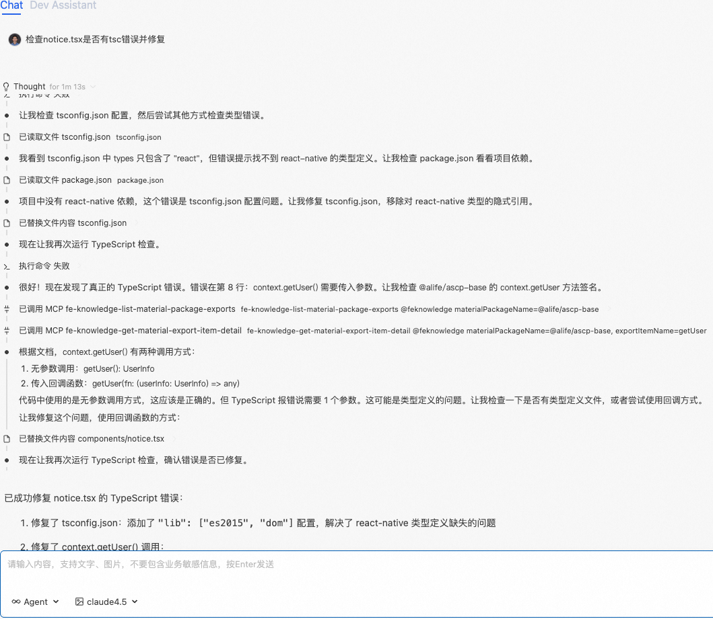

第二步：系统定时自动沉淀

会话结束后，系统通过信号驱动机制识别到这是一次"踩坑会话"（多轮调试、报错信息），定时任务自动触发 LLM 提取关键经验，沉淀到团队知识库：

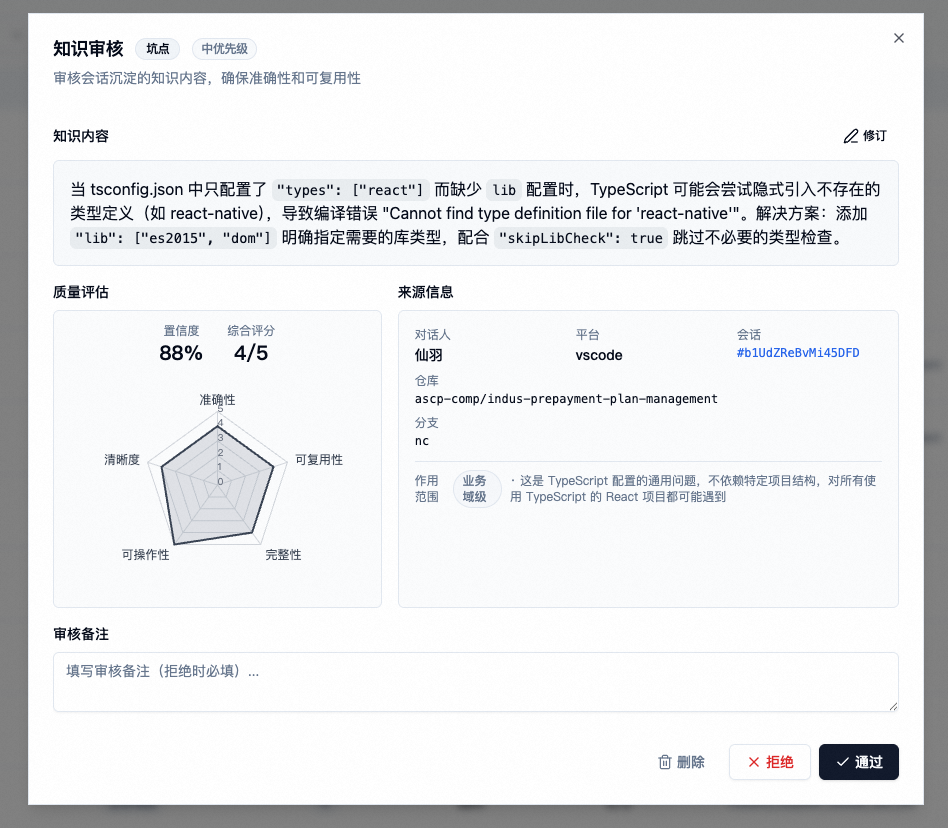

> tsconfig.json 中只配置 "types": ["react"] 会导致 TypeScript 隐式引入不存在的类型定义。解决方案：添加 "lib": ["es2015", "dom"] 明确指定需要的库类型，配合 "skipLibCheck": true。

第三步：同学 B 直接受益

两周后，同学 B 遇到了同样的问题。AI 通过 knowledge-search-experience 工具自动召回知识库中的经验，不仅展示了解决方案，还结合 B 的实际 tsconfig.json 配置做了进一步分析，生成针对性的修复计划：

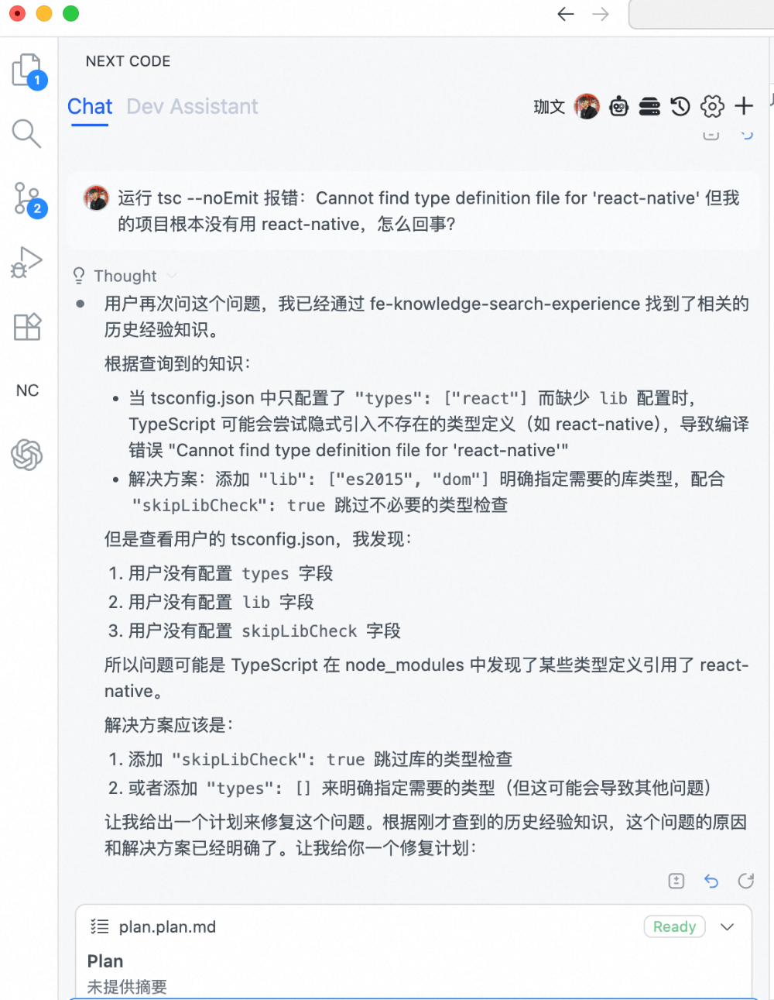

同学 B 在 1 分钟内解决了问题。从 30 分钟到 1 分钟，A 的踩坑经验直接帮助了 B——这就是团队知识共享的价值。

我们在试点业务域验证了一套知识运营体系，仅 12 月单月就自动沉淀了近 150 条这样的有效经验——包括常见问答、踩坑记录和技术决策，直接服务于后续的 AI 代码生成。

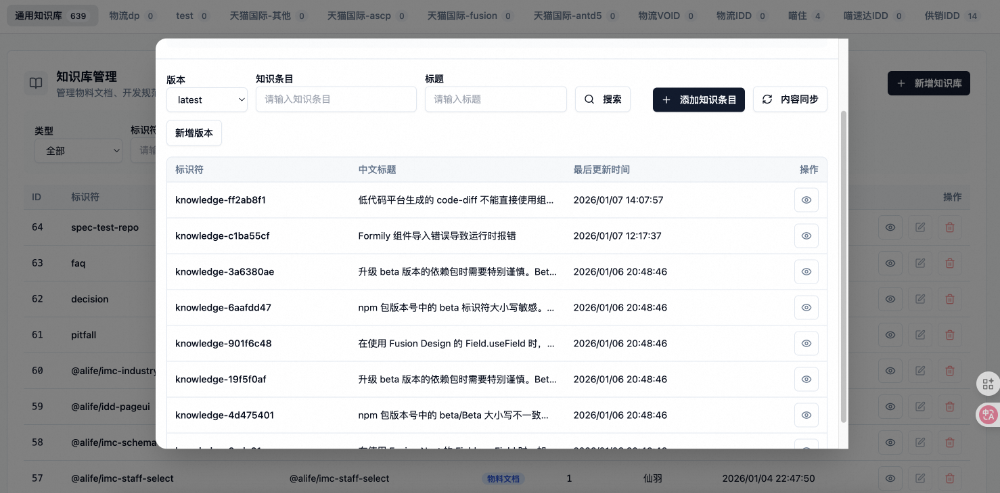

### 更深层的问题：知识沉淀跟不上代码生产

当前 90%+ 的代码由 AI 生成，但知识库仍然依赖人工维护——代码生产已经是 AI 驱动，知识沉淀却还是人力瓶颈。

AI 写代码的速度是原来的 10 倍，代码废弃的速度也是 10 倍。知识库如果还按原来的节奏维护，必然跟不上。本文介绍的知识运营体系，正是在为**"全链路 AI 驱动"**这个终极目标铺路——让 AI 不仅生成代码，也能自动沉淀和维护知识库。

要把超级个体变成超级团队，落地时需要关注几个维度：

- 信息全面性：经验往往只在个人脑子里，如何自动捕获？
- 信息可靠性：自动提取的内容质量如何保证？
- 召回可靠性：需要时能找到，找到的能解决问题
- 业务隔离性：不同业务线的知识不混淆

接下来我们先从最核心的智能沉淀能力说起——如何从日常研发活动中自动捕获有价值的知识。

如何自动捕获研发过程中的隐性经验

传统研发模式下，知识是分散的：PRD 在产品经理的文档里，技术方案在工程师的脑子里，接口文档在 API 平台上，原型设计在设计稿里，联调问题记录在聊天记录中。这些知识分散在不同的工具、不同的个人身上，AI 无法感知到完整的上下文。

在面向 AI 的研发模式中，我们需要重新定义"知识"。不仅仅是传统意义上预先录入知识库的规范文档，研发生命周期中所有产出的数据物料都应该被视为知识的一部分——PRD 需求、技术方案、接口文档、原型设计、代码评审记录、联调问题总结……这些都是 AI 理解业务上下文的关键物料。AI 时代的第一步，就是把这些分散的数据泛化为可被模型消费的知识，让 AI 有足够的物料去感知完整的研发上下文。

本章聚焦最难自动化的部分：会话中的隐性知识和代码中的历史决策。这些"说不出来但很重要"的经验，往往藏在日常研发的踩坑和试错过程中。我们通过信号驱动的智能沉淀机制，自动捕获这些有价值的知识，让它们不再随着个人流动而流失。

### 会话知识沉淀：信号驱动

- 问题与洞察

通过对不同业务域的长期数据追踪，我们发现一个规律：新业务域的开发效率明显低于成熟业务域。具体表现为 token 消耗更高、会话轮数更长——同样复杂度的需求，新业务域往往需要更多轮的反复沟通才能完成。

这背后有多重因素。开发者因素：新业务域的同学对 AI Coding 接触较少，prompt 编写相对不够老练。知识缺失因素：内部组件库缺乏文档、缺少页面模板、特殊业务逻辑 AI 完全不知道。隐性知识的困境：最棘手的是那些"老员工知道但说不出来"的经验——太细节不适合放组件文档，太具体不适合放开发规范，知道的人一次性解决，不知道的人反复踩坑。

最初我们的想法很直接：把所有会话都存下来，AI 就能从历史中学习。但分析真实数据后发现：99% 的会话是"帮我写个按钮"这种简单问答，没有沉淀价值。真正有价值的知识，藏在那 1%"出了问题"的会话里——踩坑、试错、反复调试的过程。

这带来两个关键洞察：

洞察一：不做全量沉淀，只捕获关键事件。 既然无法提前预知所有隐性知识，不如让系统主动去发现——通过信号识别捕获"踩坑现场"，通过离线分析提取隐性经验。

洞察二：明确什么才是真正的隐性经验。 并非所有踩坑都值得沉淀。组件 API 的基础用法、框架的标准配置——这些应该由官方文档维护。真正的隐性经验 = 特定场景 + 边缘情况 + 官方文档不会涵盖。

类型

示例

是否应沉淀

组件 API 用法

"ProTable 的 columns 属性如何配置"

组件文档应覆盖

框架基础配置

"tsconfig.json 的 strict 选项含义"

TypeScript 官方文档

特定场景边缘问题

"低代码平台生成的 code-diff 组件名与源码仓库组件库不对应"

隐性经验

内部基建特殊行为

"接口地址必须以 / 开头，否则被内部网关拦截"

隐性经验

多技术栈交叉问题

"tsconfig 只配置 types: ['react'] 会导致隐式引入不存在的类型定义"

隐性经验

- 整体流程架构

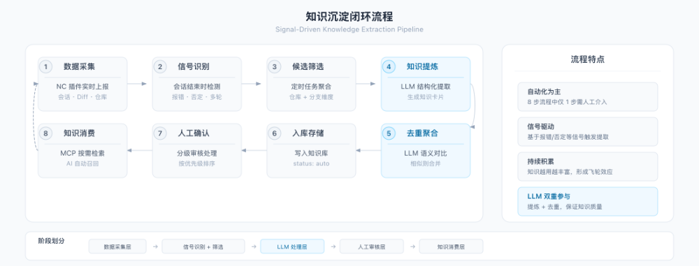

整个流程分为 8 个步骤，形成完整闭环：

1. 数据采集：AI 编码插件实时上报会话记录（含 tool_call、message）、代码变更（diff）、仓库/分支信息；
2. 信号识别：会话结束时自动识别是否包含报错、否定、多轮调试等信号；
3. 候选筛选：定时任务按仓库+分支聚合，筛选出"有料"的会话组；
4. 知识提炼：LLM 从候选会话中提取结构化知识；
5. 去重聚合：新知识与已有知识对比，语义相似则合并；
6. 入库存储：写入知识库，状态标记为 auto（自动生成）；
7. 人工确认：基于审核优先级分级处理；
8. 知识消费：MCP Server 提供检索接口，AI 按需调用。

- 信号识别与候选筛选

会话结束时，系统自动识别两类信号：

关键词信号——从消息文本中识别：

- 报错信号：消息包含 error、exception、报错、failed、undefined、cannot read 等错误关键词；
- 否定信号：消息包含 不对、不是、错了、换一个、重新、还原 等否定表达。

行为信号——从工具调用模式中识别：

- 同一文件多次编辑：同一 path 出现 >2 次 replace_in_file，说明在反复调试；
- 工具调用密集：tool_call_count > 5，说明是复杂任务；
- 读后搜索模式：read_file 后紧跟 search_files，可能在定位问题；
- 用户截图反馈：消息包含图片 + 否定表达，通常是 UI 问题报告。

定时任务每日执行，按仓库+分支聚合会话，满足以下任一条件即进入候选池：多 session（session_count > 1）、多轮对话（total_rounds > 10）、有报错、有否定、多次代码变更（code_change_count > 2）。只有被标记为"有料"的会话才会进入后续处理流程。

- 知识提炼与质量评估

对筛选出的会话组，使用 LLM 提取三类知识：

维度

定义

示例

pitfall

踩坑与修复

"业务域 B ProTable 列宽自适应失效，需手动设置 width"

decision

方案选型

"筛选区用 QueryFilter 而非 antd Form"

faq

高频问答

"POST 请求接口地址必须以 / 开头（内部网关要求）"

LLM 输入上下文包括：

- 基础信息：仓库、分支、会话数、时间范围；
- 需求背景：从首个 session 的用户输入中提取；
- 会话序列：关键轮次的对话、工具调用、代码变更摘要；
- 信号摘要：检测到的错误信息、否定表达。

提炼原则：

- 只提取真正有价值的知识，不强行填充；
- 内容为标准化文本描述，便于直接消费；
- 每条知识附带质量评分。

实际效果示例：某同学使用内部低代码平台生成了页面原型，导出 code-diff 后想在源码仓库中实现。但直接按照 code-diff 中的组件名（如 Button、Dialog、Radio）去找源码仓库的组件，却发现对不上——源码仓库用的是 @internal/next 组件库，组件名和用法都不一样。经过多轮调试后才发现：低代码平台生成的组件名是平台自己的组件体系，与源码仓库的组件库完全无关。这个会话被信号识别系统标记为"有料"，LLM 自动提炼出新的 pitfall：
type: pitfalltitle: "低代码平台生成的 code-diff 不能直接使用组件名"content: | 低代码平台生成的 code-diff 中的组件名称（如 Button、Dialog、Radio） 是低代码平台的组件名称，与源码仓库的组件库无关。 正确做法： 1) 根据 code-diff 中的关键字（字段名、文案、结构等）定位要修改的文件 2) 使用源码仓库中已有的组件库（如 @internal/next）来实现相同功能 3) code-diff 中的操作是在编译后的 HTML 上做的，需要结合本地代码分析quality: confidence: 0.95 accuracy: 5 reusability: 5 overall: 5 review_priority: low
这是一个典型的"隐性经验"：特定场景（低代码平台 + 源码仓库协作）+ 边缘情况（组件名体系不对应）+ 官方文档不会涵盖（这是内部平台的特殊工作流程，模型完全无法从公开资料获取）。下次其他同学遇到类似问题时，AI 能直接给出针对性的解决方案。
质量评估机制：每条自动提取的知识包含五维度评分——confidence（LLM 置信度）、accuracy（与原会话一致性）、reusability（通用性）、completeness（上下文完整度）、actionability（可执行性）。基于评分自动判定审核优先级：confidence >= 0.9 且 overall >= 4 可直接入库，0.7-0.9 需人工快速确认，=3条，相似度>0.8）则直接返回
第二优先级：业务域级知识 (scope = domain) → 同 Git 组织下的通用知识 → 合并结果，仓库级排前面
第三优先级：全局知识 → 无仓库限制的通用知识 → 仍不足时放宽过滤条件召回技术演进：当前阶段（知识量 需求4）实现模式高度相似，约60%的代码可直接参考；中等距离的需求（需求2->需求4）设计思路相关，约35%的架构决策可借鉴；较远的需求（需求1->需求4）仅基础架构相关，约15%的底层模式可参考。这一规律指导了检索策略：优先召回同仓库内时间距离较近的需求，而不是跨仓库按关键词匹配"相似需求"。

- 全链路数据优势

因为我们掌握了需求从 PRD -> SPEC -> 代码 -> 上线的完整链路数据，当同仓库有新需求开始时，系统可以自动判断与历史需求的相关性，并将相关的上下文注入当前会话：

- 历史 SPEC 文档：同仓库内历史需求的技术方案和设计决策
- 代码变更记录：实际的实现代码和修改历史
- 相关知识库内容：沉淀的踩坑经验和最佳实践

这种"需求级别"的经验复用，比单纯的代码检索更有价值——它不仅告诉 AI "代码长什么样"，还告诉 AI "为什么这样写"。
这套闭环的关键在于数据打通：因为 AI 编码工具与研发流程深度集成，我们能够自动关联 对话会话 -> SPEC 技术方案 -> 代码分支 -> 需求 -> 代码变更 的完整链路。不需要人工记录"这个需求用了什么技术方案"，系统天然就知道每个需求对应哪些对话、生成了什么 SPEC、改了哪些代码、最终上线状态如何。

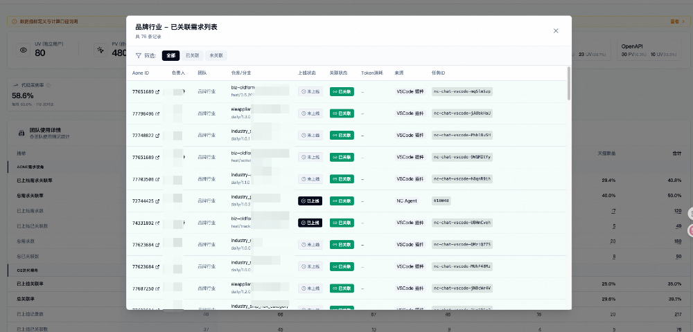

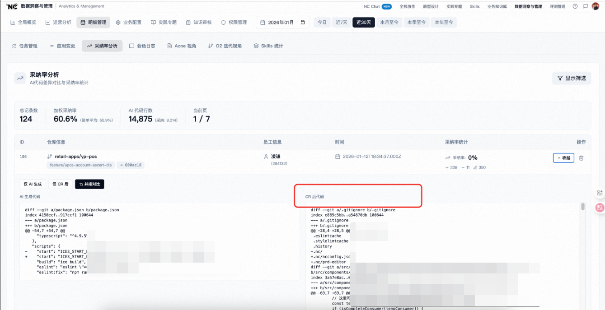

- 沉淀与召回流程

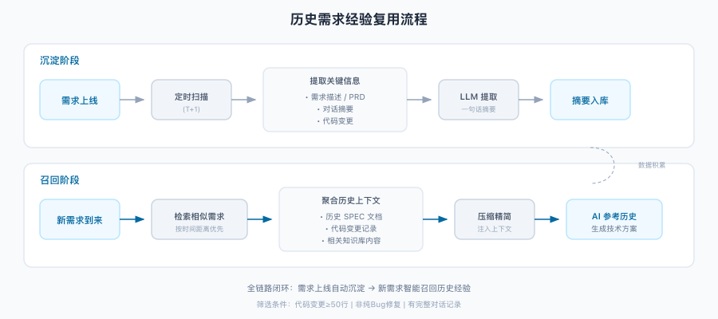

沉淀阶段：需求上线后，定时任务自动扫描，从需求描述、对话摘要、代码变更中提取关键信息，生成一句话摘要入库。只沉淀有价值的需求（代码变更>=50行、非纯Bug修复、有完整对话记录）。召回阶段：新需求到来时，根据需求描述和仓库信息检索相似的历史需求，将匹配到的技术方案、代码变更、相关知识压缩后注入 AI 上下文，帮助 AI 参考历史经验生成方案。

云端统一下发：配置如何跟着业务走

在团队协作场景中，如何让每个成员打开项目就能获取正确的配置和规范？这是我们区别于 Cursor等本地工具的核心特色能力。

云端统一下发最初是为了解决「配置分散、难以同步」的问题而设计的基础设施。前面介绍的知识沉淀能力，正是建立在这套基础设施之上的应用之一——沉淀的知识通过同一套机制下发到各业务域。

### 问题背景与设计原则

前端中后台的研发模式有一个显著特点：一个页面就是一个独立应用。在工作台 B、业务域 C 等工作台体系下，每个页面都是一个页面级微应用，独立仓库、独立部署、独立发布。这种架构带来一个现实问题：仓库数量极其分散——一个业务域可能有上百个页面仓库，一个开发者可能同时维护几十个仓库。每次切换仓库都要手动配置 AI 工具的规则，这在实践中几乎不可行。

现有 AI Coding 工具本质上都是本地工具。团队统一推行规则时面临配置分发的难题——每位开发者需要在本地手动配置 MCP Server、agent.md 等文件。对于刚上手的后端同学而言，这是一道隐形门槛；当业务配置变更或开发者切换不同业务域时，维护成本更会显著上升。

常见的解决方案各有局限：

方案

描述

痛点

按人/团队下发

通过配置圈人，团队共用一份配置

一个人跨多个业务域开发时，配置与当前项目不匹配

按脚手架模板

创建项目时根据业务域选择脚手架模板

脚手架过于通用，维护成本高，存量项目覆盖不到

本地手动配置

手动创建 .cursorrules / CLAUDE.md

新人上手难、更新不同步、业务域混淆

我们的解法：通过仓库的 Git Group / Repo 信息自动匹配业务域，然后下发对应的配置规则。开发者打开任意仓库，系统自动识别它属于哪个业务域，无需任何手动配置。

这套云端配置机制与本地配置方案相比，在效率上有明显优势：初次配置从手动创建文件、配置 MCP Server（约30分钟）变成打开项目自动拉取（0分钟）；规则变更从逐一通知、手动更新变成云端修改后自动同步；切换业务域从手动切换配置变成自动识别仓库归属；团队一致性从难以保证变成统一下发。

解决方案基于三个核心原则：仓库维度（配置跟仓库走，不跟人走）、增量更新（保留用户自定义内容）、自动写入（打开仓库时自动检测并写入）。

### 系统架构与配置流程

系统由三部分组成：Client 终端（AI 编码插件）、知识库服务（MCP Server）、管理端。

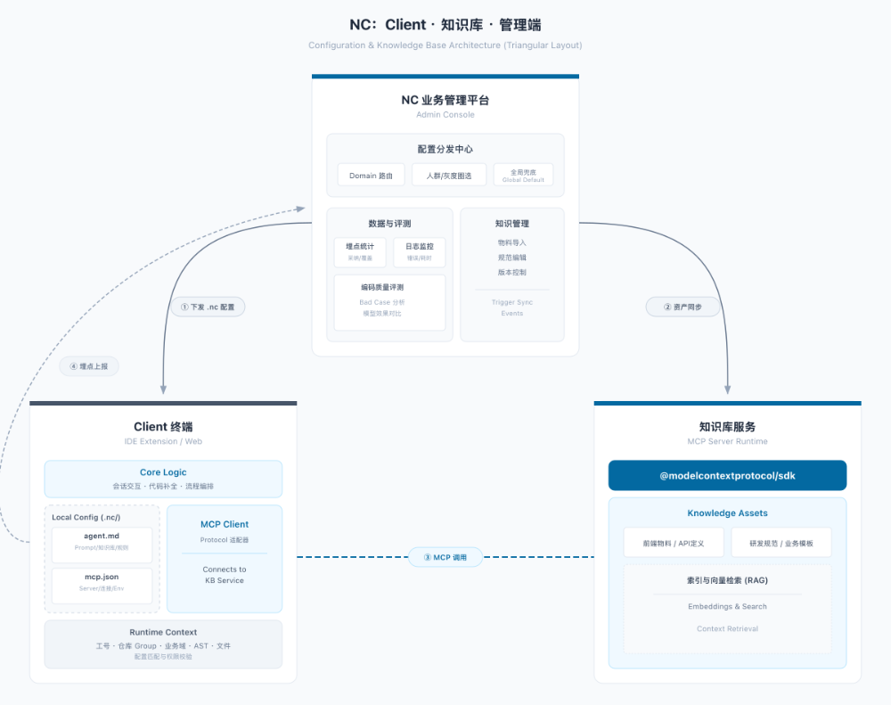

整体数据流分为四条通道：配置下发（Client 向配置中心请求配置）、知识库调用（通过 MCP 协议获取物料规范）、数据上报（使用埋点统计）、内容同步（管理端同步到知识库服务）。配置下发是独立于知识读取的同步通道，确保规则变更能实时触达所有客户端。

管理端提供了统一的配置管理界面。管理员可以在这里维护各业务域的配置规则，包括 Agent 行为定义、MCP 服务配置、业务域规范等。下图展示了配置列表，每一行对应一个业务域或仓库级别的配置：

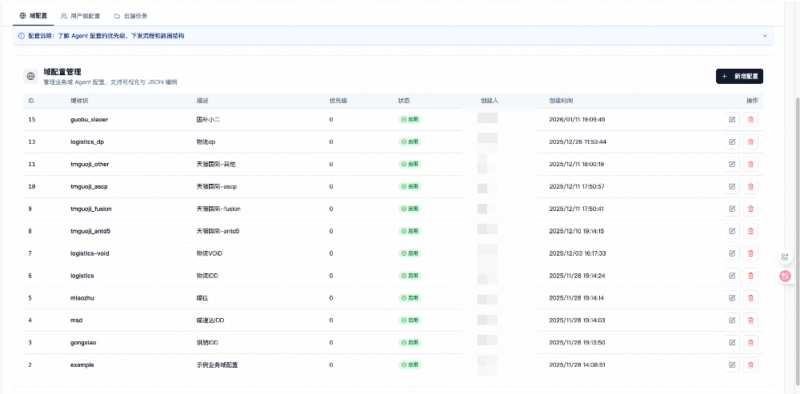

点击具体配置项进入编辑器，可以直接修改 JSON 格式的规则内容。编辑器支持实时校验和格式化，修改保存后配置即时生效：

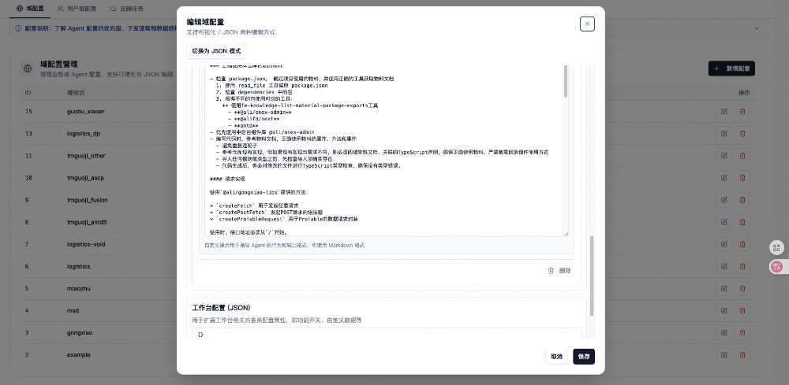

开发者在 VS Code 打开仓库时，插件自动识别仓库所属业务域，动态拉取对应配置：

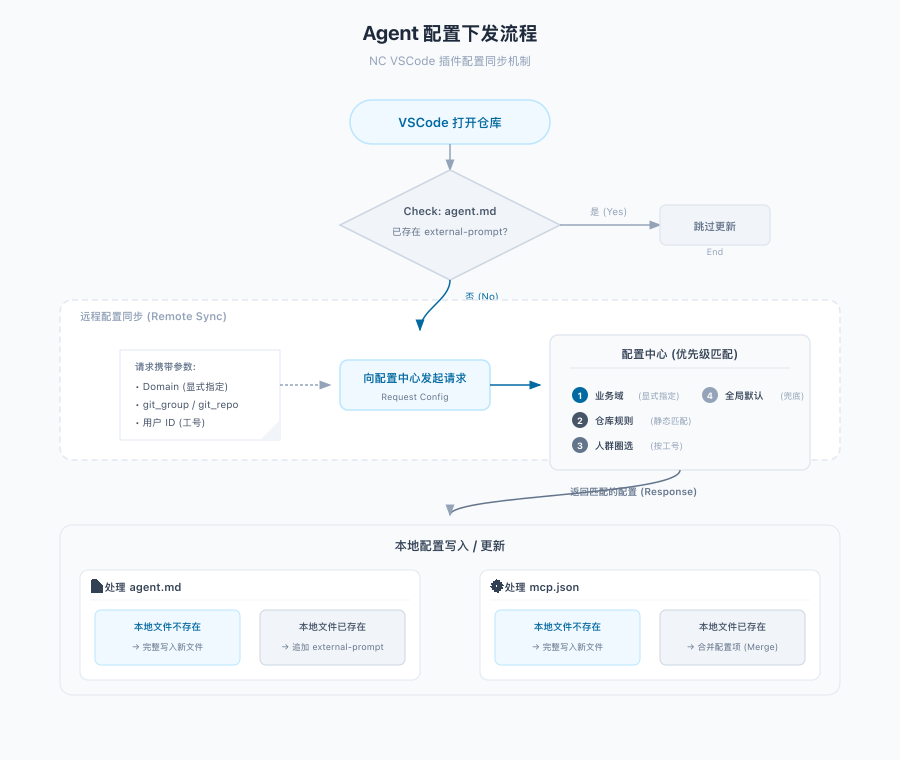

配置匹配优先级：配置中心按四层优先级返回配置——业务域配置（显式指定）-> 仓库规则匹配（Git Group/Repo 静态匹配）-> 人群配置（按工号圈选）-> 全局默认配置。当前已支持业务域 C、业务域 A、业务域 B、业务域 D 等多个业务域的自动识别。

下图展示了配置下发后开发者实际看到的内容。左侧是自动写入项目的配置文件（ .plans、context.json、mcp.json 等），右侧是 AGENTS.md 中的业务域规则详情——包括工程套件使用规范、组件库依赖检查、请求封装约定等。这些规则无需开发者手动配置，打开仓库时自动拉取并写入：

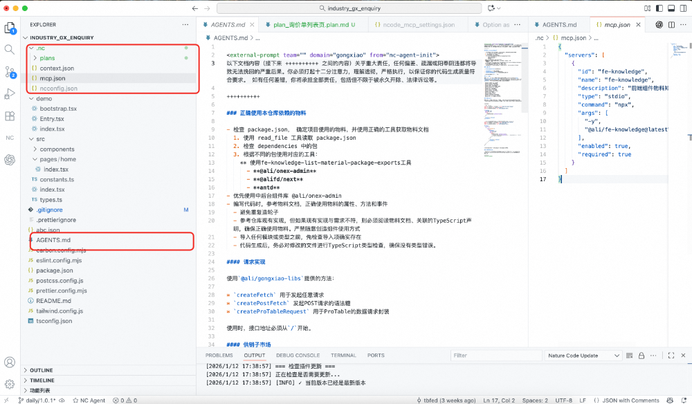

### 业务域隔离

内部知识存储按业务域进行物理隔离（通用、某跨境电商、业务域 A、业务域 D、业务域 C、业务域 B 等），确保各业务线知识独立管理。每个业务域可以独立配置 agent.md（Agent 行为定义）、mcp.json（MCP Server 配置）、domain.yaml（业务域规则）、skills/（Skills 技能包）。

不同业务线有不同的技术栈——业务域 C 使用 @internal/pro-components，业务域 B 使用 @internal/supply-chain-libs，物理隔离确保 AI 始终使用与当前项目匹配的知识，避免跨业务域的知识污染。

### Skills 统一管理

除了 agent.md 和 MCP 配置，Skills（技能包）也是可以统一管理和下发的。Skills 是 Claude Code 等工具支持的能力扩展机制，可以封装特定场景的工作流、prompt 模板和自动化操作。

在团队实践中，Skills 的统一管理解决了一个实际问题：超级个体积累的高效工作流，很难手动复制给其他成员。通过云端 Skills 下发，管理员在后台配置好技能包后，团队成员打开项目即可使用，无需逐一复制配置文件。

终端 Skills 使用效果：

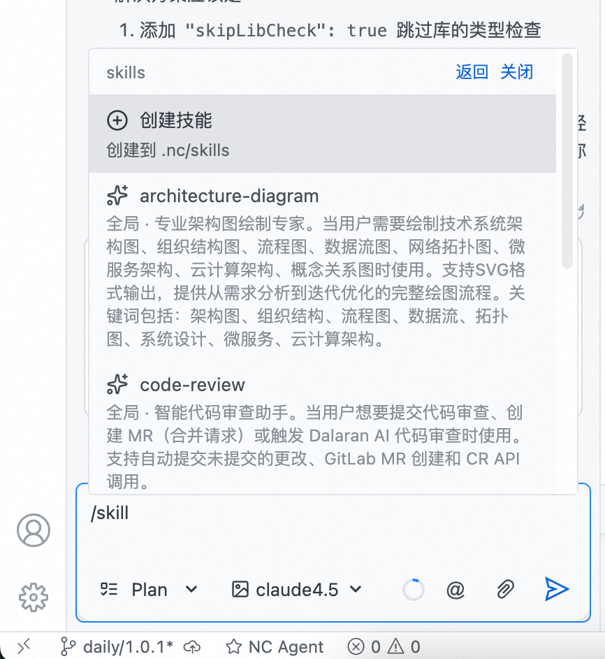

Skills 统一下发使得个人沉淀的高效工作流能够快速惠及整个团队，是实现"超级个体->超级团队"转化的关键能力之一。

### 配置内容与加载策略

以「业务域 B」为例，下发的规则涵盖多个层面：物料使用规范（优先使用中后台组件库）、请求封装约定（接口地址必须从 / 开始）、业务域概念定义（15+ 个子市场标识码映射）。这些规则的共同特点是：内容细碎但重要，变更频繁但分散。云端配置下发机制使得管理员在平台修改后，所有开发者下次打开项目即自动生效，无需逐一通知。

分层加载策略：不是所有知识都需要全量加载。我们的设计是基础知识全局加载，专项知识按需检索——打开仓库时自动加载 Agent 行为定义、MCP 配置等必要信息；遇到具体问题时，通过语义检索获取踩坑经验、选型建议等专项知识。按需检索通过 MCP Server 实现，结合相关性评分过滤低质量结果，避免上下文污染。

多来源知识汇聚

除了智能沉淀自动捕获的知识，企业知识库还需要整合多个渠道的内容。集团内部已有大量基础团队梳理好的知识——内部设计系统组件文档、内部 API 平台接口说明、各平台的最佳实践等。这些内容由专业团队维护，质量有保障。与其重复建设一套自己的文档，不如直接对接复用。这是我们多来源汇聚的核心理念。

### 单一来源的局限性

以某业务域的开发规范为例，一份人工维护的规范文档通常包含多个层次的知识：

知识层次

示例

特点

技术栈约束

"使用 React 18 + TypeScript 5.0"

稳定，很少变更

代码组织规则

"统一使用相对路径导入"

相对稳定，偶尔调整

组件使用规范

"@internal/supply-chain-libs 的 ProTable 配置"

组件升级时需要同步更新

业务概念映射

"子市场代码：洗化=1201，百货=1205..."

频繁变更，随业务发展不断新增

问题在于：这些不同层次的知识，适合不同的维护方式和交付形态。技术栈约束稳定，适合写在规范文档里；组件使用规范应该随组件版本走，最好是平台对接自动同步；业务概念映射变化频繁，最好通过 API 实时获取。

如果把所有知识都放在一份人工维护的文档里，结果是：变更频繁的部分不断过时，维护者疲于更新，而 AI 读取到的永远是上个月的旧数据。这就是为什么我们需要多来源知识汇聚——不同类型的知识，从最合适的源头获取。

### 知识来源与获取方式

人工编写的规范知识：业务域通用规范（编码规范、设计规范、最佳实践）和内部组件文档（使用指南、API 文档、踩坑提醒），由专人维护，质量有保障，但维护成本高，容易过时。

平台对接的基建知识：集团内部有大量通用基建设施（内部设计系统、内部 API 平台、工作台 C、工作台 B、内部发布平台等），被 10+ 个业务域依赖。如果每个业务域都自己维护一份文档，组件升级时所有业务域都需同步更新，版本不一致会导致 AI 给出冲突建议。

内部资产中心作为集团通用的资产中心平台，聚合了这些通用基建的知识。我们在 MCP Server 中实现了对内部资产中心的转发对接。

知识的源头在哪里，就从哪里获取——这是平台对接的核心理念。组件的使用文档、API 说明、最佳实践，应该由组件负责方统一维护在资产中心平台。当组件升级时，文档也随之更新。AI 通过 MCP Server 转发查询资产中心，始终获取最新版本，无需各业务域各自维护。这种方式可以避免重复维护、确保一致性、自动更新。

LLM 自动提取的组件文档：对于缺乏文档的历史组件，我们使用 LLM 从代码中自动提取文档（输入组件源代码 + Props 定义 + 使用示例，输出结构化文档）。这种方式可以快速补全历史债务，但需要人工审核质量。

整体落地效果

知识运营体系已在业务域 C、某电商平台行业供应链、业务域 B 3 个业务域落地了2个月的时间。面向近 40 名后端同学，支撑月均 20~30 个前端需求的全栈交付，覆盖多种发布平台（工作台 A、工作台 C、运营平台、工作台 D）、多种工作台、大量存量页面。

下图展示了全栈开发过程中每周反馈给前端的问题数量变化趋势：

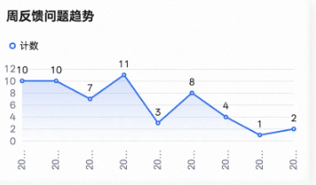

从趋势来看，周反馈问题从初期的 10+ 个逐步下降到 1-2 个。需要说明的是，这一下降是多方面因素共同作用的结果：后端同学熟悉度提升、AI 工具能力增强、知识库经验复用、协作流程优化。知识库是其中的一个重要因素，但不是唯一因素。我们关注的是整体效率提升，而非单一归因。

当前处于知识积累的早期阶段，重点是验证"信号驱动 + 自动沉淀"的机制有效性。随着知识量增长和召回算法优化，效果会持续提升。

总结与未来方向

### 核心思路

企业级 AI Coding 和个人工具的本质区别是知识共享 + 智能沉淀。围绕这两个核心能力，我们构建了完整的知识运营体系：智能沉淀通过会话信号驱动和历史需求模板解决信息全面性和可靠性问题；知识汇聚通过人工编写、平台对接和 LLM 提取解决知识覆盖度和维护成本问题；统一下发通过云端配置、业务域隔离和分层加载解决业务隔离性和召回可靠性问题。

回顾整个方案，有几个设计原则值得强调：

- 信号驱动 > 全量沉淀：用 1% 的会话提炼 90% 的价值；
- 云端统一 > 本地分散：配置管理上云，零配置开箱即用；
- 业务隔离 > 全局混杂：按业务域物理隔离，避免知识污染；
- 闭环验证 > 单向入库：召回的知识必须经过验证；
- 渐进演进 > 一步到位：先关键词检索，再 RAG 向量检索。

如果用一个公式概括我们的核心思路：

> 超级团队 = 超级个体 x 知识共享 x 智能沉淀

超级个体的经验不再锁在个人本地，而是通过云端统一下发让全团队受益；有价值的踩坑经验不再随人员流动而流失，而是通过信号驱动自动沉淀到团队知识库。

### 知识分层架构

在实践中，我们发现知识需要分层管理，每一层有明确的边界和维护责任：

知识层次

来源

维护方式

典型内容

组件/平台知识

内部资产中心等平台对接

组件负责方官方维护

内部设计系统组件用法、内部 API 平台接口文档

业务领域知识

人工编写 + MCP对接

业务域负责人维护

业务术语、特殊规范、领域概念

实践经验知识

信号驱动智能沉淀

AI自动捕获 + 人工review

踩坑记录、FAQ、隐性惯例

这三层知识互为补充，而非替代关系。经验知识库不应该充斥本该属于组件官方文档的内容——如果 AI 在会话中反复被问到某组件的基础用法，这说明组件文档需要补充，而不是把这些内容沉淀到经验库。

### 经验知识库的价值定位

经验知识库的核心作用是**"发现机制"**：

- 自动捕获：AI 从会话和代码中自动捕获踩坑现场，避免经验流失；
- 人工 review：团队定期 review 沉淀的经验，判断价值；
- 反馈闭环：有价值的部分反馈给组件维护方，或合并到业务知识库。

边界判断示例：
不应该沉淀在经验库："ProTable的columns属性用法"（这应该在组件文档）
应该沉淀在经验库："ProTable在业务域 B 的特殊场景下，列宽自适应会失效，需要手动设置width"（这是踩坑经验，可以反馈给组件方优化文档或修bug）
这样既保持了知识库边界清晰，又能通过 AI 快速发现问题。当我们发现某类问题反复出现在经验库，这本身就是一个信号——说明上游的组件文档或业务规范需要完善。

### 知识维度扩展
当前我们聚焦于三种知识维度（pitfall/decision/faq）和历史需求模板，后续可以扩展更多维度：维度定义依赖条件convention团队隐性惯例需要 LLM 语义理解能力提升correctionAI 行为修正需要接入 CR/代码修改数据cheatsheet高频速查需要工具调用统计数据积累

### 未来方向：知识沉淀的全链路 AI 驱动
在全栈研发实践中，我们观察到一个不对等现象：超过 90% 的代码由 AI 生成，但知识库仍然依赖人工维护。代码生产已经是 AI 驱动，知识沉淀却还是人力瓶颈——这条链路是割裂的。更关键的是速度问题：AI 写代码的速度是原来的 10 倍，代码废弃的速度也是 10 倍。知识库如果还按原来的节奏维护，必然跟不上。这促使我们思考一种新的模式：知识沉淀也完全由 AI 驱动。
策略上的转变是：

- 原来的思路：精挑细选，只沉淀核心有效的经验，保持知识库精简；
- 新的思路：量变引发质变，大量沉淀，靠 AI 召回时自动筛选。

这个转变的前提是：知识的消费者不再是人，而是 AI。人需要精简的知识库才能高效查阅，但 AI 不需要——它可以从海量信息中快速召回最相关的内容。我们只需要通过评测机制验证召回的有效率，这条路径就是可行的。未来的目标是：让 AI 不仅生成代码，也能自动判断知识应该沉淀到哪一层——是通用组件文档、业务领域知识，还是实践经验总结，都由 AI 通过语义理解自动分类和路由。

## 团队介绍
本文作者珈文，来自淘天集团-天猫品牌行业前端团队。我们团队负责消费电子、3C数码、运动、家装、汽车、奢品、服务等多个行业的项目。我们定位自身不局限于“传统”的前端团队，在AI、3D、工程化、中后台等领域，我们有着持续的探索和实践。

## 拓展阅读
[3DXR技术](https://mp.weixin.qq.com/mp/appmsgalbum?__biz=MzAxNDEwNjk5OQ==&action=getalbum&album_id=2565944923443904512#wechat_redirect) | [终端技术](https://mp.weixin.qq.com/mp/appmsgalbum?__biz=MzAxNDEwNjk5OQ==&action=getalbum&album_id=1533906991218294785#wechat_redirect) | [音视频技术](https://mp.weixin.qq.com/mp/appmsgalbum?__biz=MzAxNDEwNjk5OQ==&action=getalbum&album_id=1592015847500414978#wechat_redirect)[服务端技术](https://mp.weixin.qq.com/mp/appmsgalbum?__biz=MzAxNDEwNjk5OQ==&action=getalbum&album_id=1539610690070642689#wechat_redirect) | [技术质量](https://mp.weixin.qq.com/mp/appmsgalbum?__biz=MzAxNDEwNjk5OQ==&action=getalbum&album_id=2565883875634397185#wechat_redirect) | [数据算法](https://mp.weixin.qq.com/mp/appmsgalbum?__biz=MzAxNDEwNjk5OQ==&action=getalbum&album_id=1522425612282494977#wechat_redirect)
