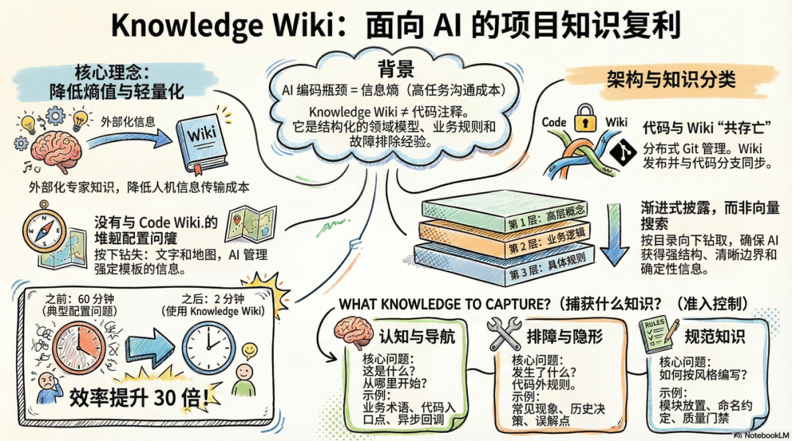
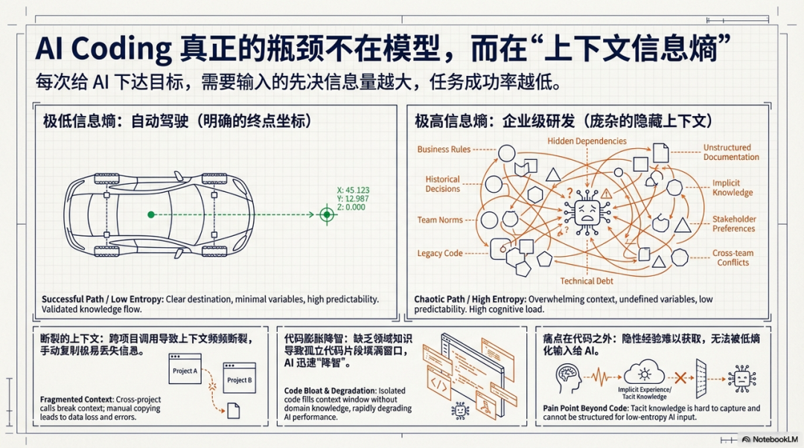
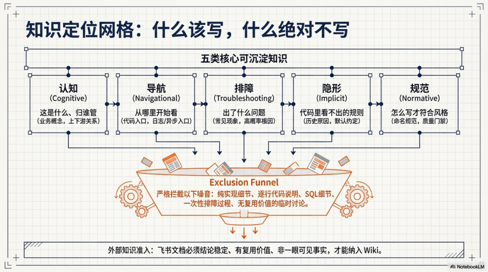
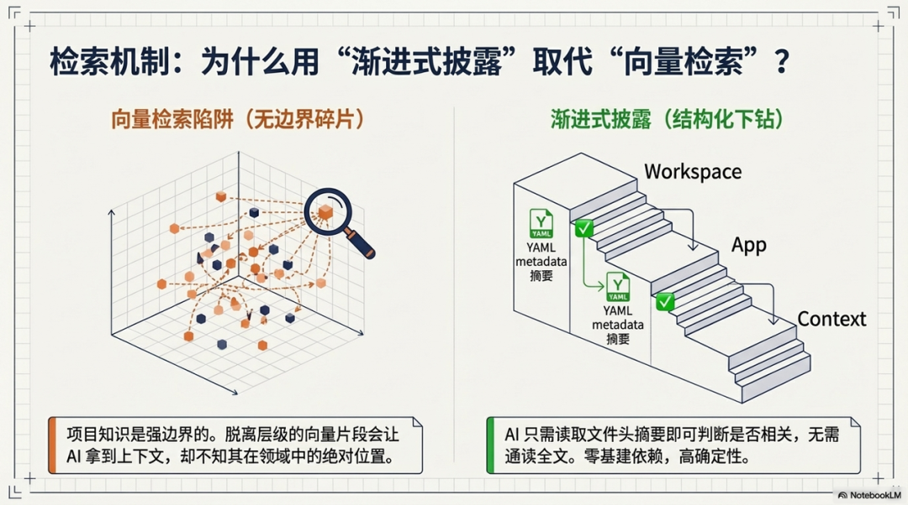
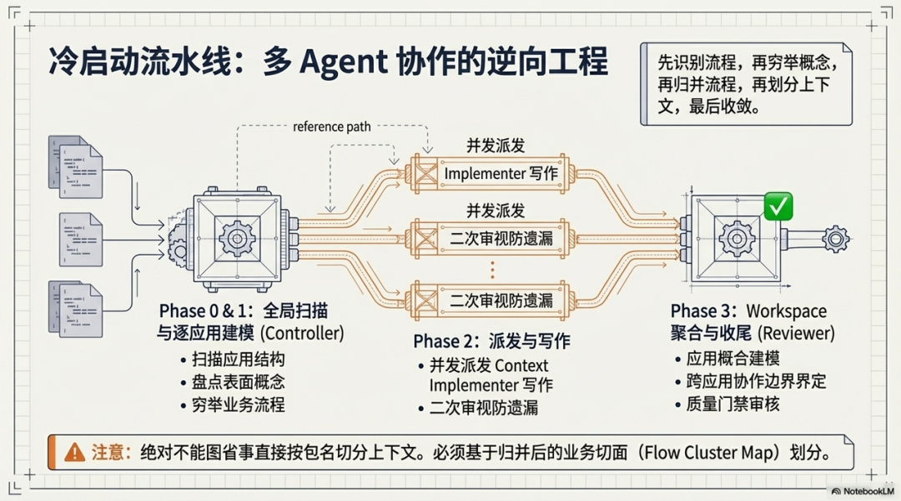
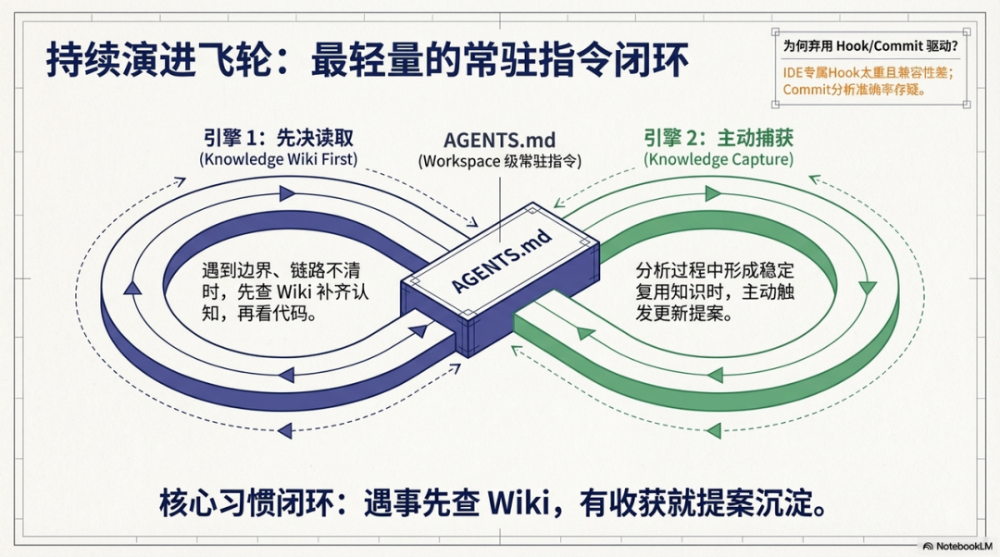
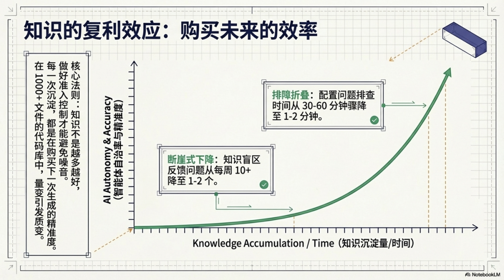
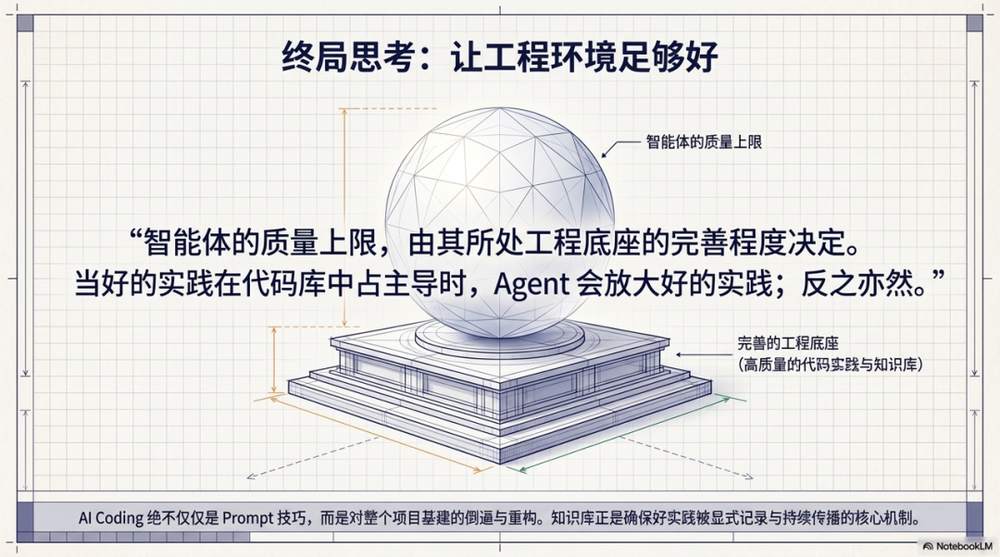

# Knowledge Wiki：面向 AI 的项目知识层建设实践

公众号：有赞共享技术

发布时间：2026-04-07 18:31

> 每一次使用都是对知识库的投资，每一次沉淀都让下一次生成更精准。这不是线性增长，而是用得越多，效果越好；效果越好，用得越多的复利效应。

---



## 一、为什么要做知识库？

### 1.1 AI Coding 真正缺的不是模型能力



过去一年密集使用 AI Coding 下来，我越来越觉得：**当前最大的瓶颈不是 AI 能不能写好代码，而是我们能不能把任务目标准确地传达给它**。

套用信息论的概念来理解这件事——向 AI 传达一个任务目标，需要输入的信息量越大，任务成功的概率就越低。对比自动驾驶，人类给 AI 的输入极简（一个终点坐标），信息熵几乎为 0。但企业级软件研发呢？一个需求背后是领域模型、业务规则、技术约束、团队规范、历史决策……这些知识如果不被体系化沉淀，每一次与 AI 的交互都在重复"人肉手艺"式的上下文搭建。

所以本质上，知识库要做的事情就是**降熵**——把人脑中的专家知识提前结构化、外化，降低每次人机协作的信息传递成本。

### 1.2 Workspace 模式下的现实困境

在推进新的产研协作流程——将前端、后端、多个关联项目打包为一个 workspace，产研基于 workspace 进行协作。但实际用下来，遇到了两个很现实的问题。

第一个是**跨项目的上下文断裂**。业务域内的项目相互关联，很多功能需要跨项目调用。传统做法是在项目 A 中生成设计方案，再手动复制到项目 B 作为上下文——低效、易丢信息、体验很差。

第二个是**代码膨胀导致 AI "降智"**。当 workspace 内项目和代码量增多后，AI 不理解领域知识，只能靠关键字搜索代码。搜回来的片段往往彼此孤立、缺乏系统语义，上下文被低质量信息填满，AI 的输出质量肉眼可见地下降。更麻烦的是，上下文窗口会随着工作推进逐渐"腐烂"——前面的无效信息越积越多，后面即使是简单任务也开始出错。

### 1.3 真正的痛点藏在代码之外

实践中一个很深的感受是——**关键知识不在代码里，而在飞书文档中、在人的大脑中**。

同样一个线上问题，有人 5 分钟定位到根因，有人要折腾 2 小时。差距不在能力，在于经验能不能被沉淀和共享。那些"老员工知道但说不出来"的东西——太细节不适合放组件文档，太具体不适合放开发规范，知道的人一次性解决，不知道的人反复踩坑。这类知识的缺失，直接导致 AI 在排查问题、方案设计、代码实现时容易走偏。

说到底，**上下文工程的核心挑战不在于怎么写提示词，而在于 Agent 在正确的时刻能拿到正确的信息。**

---

## 二、Wiki 的内容定位：不做代码讲解稿

### 2.1 为什么不做 Code Wiki？

最初我们想做的是 Code Wiki——把代码翻译成文档。参考了一些业界方案，包括自动生成架构设计、功能模块说明的 RepoWiki 类工具，以及 deepwiki 等开源项目。

评估下来，觉得**全量 Code Wiki 现阶段太重了**：

- 基模能力在快速增强，AI 理解代码的能力已经很强了。把代码再翻译一遍成文档，投入产出比不高
- 代码变更频繁，wiki 与代码的同步本身就是个难题。AI 写代码的速度是以前的 10 倍，废弃的速度也是 10 倍，知识库按原来的节奏维护，必然跟不上
- 过时的 wiki 比没有 wiki 更危险——AI 会把错误描述当作"先例"系统性地复用

所以我们走了一条更轻量的路：**提炼代码中的关键概念、关键流程、关键逻辑，提供代码导航指引——帮 AI 快速理解领域知识、快速定位上下文和关键代码入口，具体实现细节交给代码本身。**

### 2.2 五类知识

想清楚"什么该写进 wiki"比"怎么写"更重要。我们定义了五类允许沉淀的知识，核心标准是：**AI 从代码中难以自动发现的信息**。



反过来，以下内容**不沉淀**：纯实现细节、逐行代码说明、SQL 细节、一次性排查过程、没有复用价值的临时讨论、证据不足的猜测。

一句话概括：**wiki 只提供认知、导航与稳定经验；具体分支、条件、异常、SQL、配置值这些，回到代码、日志或数据里去找。**

### 2.3 外部知识怎么筛选

飞书文档、设计方案这些外部知识也值得沉淀，但要筛选。有些文档已经过时，有些和代码重复，直接搬进来反而是噪音。筛选标准四条：

1. 结论稳定，不是一次性现象或临时猜测
2. 后续理解、排障、变更时仍有复用价值
3. 不是代码、日志、数据里一眼可见的事实
4. 能明确对应到某段代码逻辑、链路职责或现有 wiki 缺口

---

## 三、我们是如何做的？

### 3.1 架构：知识库跟着 Workspace + Git 走

知识库放哪里，大致两条路：集中式管理，或者分布式跟着代码走。我们选了后者。

IDE 的 workspace 是个管理目录，本身不具备文件管理能力，所以引入了 **git submodule**——workspace 是一个独立的 git 工程，下面每个项目作为 submodule 引用。wiki 以 `.wiki/` 目录存在于每个层级：

```text
<workspace>/
├── AGENTS.md                        # workspace 级 AI 指令，默认维护在这里，优先借助 knowledge-wiki 理解问题
├── .wiki/                           # workspace 级 wiki（领域级）
│   ├── README.md                    # 总入口：应用清单 + 专题文件索引
│   ├── cross-app-overview.md        # 固定：跨应用概念映射 + 应用协作边界
│   ├── flows/                       # 跨应用业务流程（按业务域聚合，每个文件覆盖一个域的完整跨应用链路）
│   │   └── <domain>.md              # 某业务域跨应用流程
│   ├── global-conventions.md        # 固定：全局规范 / 默认约定
│   ├── 90-tasks.md                  # 初始化临时任务清单（仅 init 过程存在，完成后删除）
│   └── pending-confirmations.md  # 待确认事项汇总（阶段性持续更新）
│
├── <app-a>/
│   ├── .wiki/
│   │   ├── README.md                # 应用总览：定位 + 汇总核心概念 + 上下文清单
│   │   ├── <context-1>.md           # 上下文完整信息（定位 + 流程 + 异步链路 + 导航 + 排障/规范）
│   │   └── <context-2>.md
│   └── src/...
│
└── <app-b>/
    └── .wiki/
        └── ...
```

为什么选这个方案？几个实际考量：

- **知识和代码"近"**。需求涉及知识变更时，wiki 和代码在同一分支一起提交，天然同步。当体系的核心资产从代码变成知识文本后，git 就是天然的升级机制，pull 完成升级，diff 看到每一行变化
- **天然的业务隔离**。"商品"在零售和教育里含义完全不同，workspace 级别的隔离避免了知识"串台"
- **workspace 级承载跨应用知识**。概念映射、协作边界、跨应用主流程统一维护，AI 能快速掌握领域全貌
- **开发者能直接看到**。方便管理维护，也帮新人快速理解领域

> 分布式方案也有不足——各域知识无法交叉检索、难以全局统计。这是个取舍，没有绝对正确的答案，我们也在持续评估。

### 3.2 渐进式披露，而非向量检索



知识库怎么让 AI 找到需要的内容？很多团队的第一反应是向量检索。我们没选这条路，而是用了**渐进式披露（Progressive Disclosure）**——wiki 的目录结构本身就是检索路径，AI 按 workspace → app → context 逐层下钻，每层只拿刚好够判断方向的信息。

**为什么不用向量？** 项目知识是强结构、强边界的——"订单创建"和"订单复制"在向量空间里很近，但排障路径完全不同。向量检索返回的是脱离层级的碎片，AI 拿到一段 context 级的排障知识，却不知道它属于哪个 app、在领域里处于什么位置。而且对于跟着 git 走的轻量方案，额外部署 embedding 服务和向量库，架构上也不匹配。

**渐进式披露的核心**：每个 wiki 文件开头都有 YAML metadata 的 `description` 字段，AI 读到摘要就能判断是否相关，不需要读完全文。一个只涉及单个 context 的问题，可能只需要读 3 个文件就够了——上下文占用最小，层级关系天然保留，确定性强，零基建依赖。

### 3.3 初始化：多 Agent 协作的逆向工程



初始化是最关键也最难的一步——要基于代码逆向工程提炼有价值的知识，而每个项目的代码量动辄数十万行。

我们设计了 **Controller → Implementer → Reviewer** 的多 Agent 协作模式。核心思想是化整为零——先按应用拆 Agent，再按上下文拆，知识层层收敛、层层汇聚。

整个初始化严格遵循一个原则：**先识别流程，再穷举概念，再归并流程，再划分上下文，最后收敛概念并写 wiki。** 不是拿到代码就开始写，而是通过多轮扫描-穷举-归并-审视，确保不遗漏、不失真。

```text
Phase 0   全局扫描 ──→ 发现所有应用，提取全局规范候选
Phase 1   逐应用建模
  ├── 扫描应用结构 ──→ 入口、消息、服务、实体、包结构
  ├── 应用表面盘点 ──→ 服务簇 / 消息簇 / 实体簇 / 概念锚点
  ├── 候选流程穷举 ──→ 所有可能的业务流程
  ├── 候选概念穷举 ──→ 所有可能的业务概念
  ├── 流程归并去重 ──→ 合并同类，拆分异类
  ├── 划分上下文   ──→ 基于流程簇，不是按 Maven 模块切
  ├── 上下文写作   ──→ 派发 Context Implementer（可并行）
  ├── 二次审视     ──→ 覆盖关系复核，防止遗漏
  └── 应用 README  ──→ 汇总核心概念与入口索引
Phase 2   Workspace 聚合 ──→ 跨应用概念映射 + 协作边界 + 全局规范
Phase 3   审查收尾 ──→ 质量门禁 + 清理过程产物
```

这里有几个关键的设计决策，值得展开说：

**上下文 ≠ Maven 模块。** 上下文是业务切面，不是技术分层。只能基于流程归并后的 Flow Cluster Map 来划分上下文，不能图省事直接按包名切。

**一个 SubAgent 只拿最小上下文。** 每个 Context Implementer 只接收一个 context 的最小信息包，避免上下文过载。这本质上是一种"上下文防火墙"——Harness 思想在 Agent 编排层面的应用。就像驾驭一匹马，你不能把所有缰绳都交给它，而是要通过约束和引导让它走在正确的路上。

**异步链路是最高优先级。** Producer 和 Consumer 之间没有直接调用关系，AI 从代码里根本串不起来。这恰恰是 wiki 最大的价值——把 AI 看不到的"暗线"显式记录下来。以及 TSP 回调等异步链路。

**所有候选都必须有去向。** 候选流程和概念不能"无声消失"，每一项最终必须是保留、并入、排除三选一，且排除要有原因。这也是 Harness 思想——对过程的每一步施加可审计的约束，不允许不可解释的丢失。

> 推荐在 claude code， codex, cursor 等支持 subAgent 的环境中执行。初始化过程比较耗时。

### 3.4 持续更新：轻量级方案



初始化只是起点，持续更新才是知识库的生命力。

我们调研了几种方向：

- **Hook 驱动**：基于 IDE 的 Hook 能力，知识层层累积，从观察到候选到提案到确认补丁。完整度很高，但依赖特定 IDE 能力
- **Commit 驱动**：Git Commit 时自动分析增量代码语义，同步沉淀到 Wiki。自动化程度高，但准确率存疑

考虑到团队使用的 AI IDE 多样（Cursor、Windsurf、Claude Code 等），存在兼容性问题，且上面几种方案实现都偏重，我们最终选了**最轻量的方案——AGENTS.md + Skill 触达**。

**AGENTS.md** 是 IDE 级别的"常驻指令"，在 workspace 级配置两个指令块：

- `Knowledge Wiki First`：引导 AI 优先读取 wiki 补齐认知，遇到术语、边界、链路不清时，先查 wiki 再查代码
- `Knowledge Capture & Update`：当分析过程中形成稳定、可复用的知识时，主动触发更新提案

只依赖 skill 的 description 做触发，匹配率不够理想。AGENTS.md 是"始终在场"的指令，能确保 AI 在日常工作中始终保持两个习惯：遇事先查 wiki，有收获就提案沉淀。

这里还有一个很重要的落点：**最终交付的结果产物不是一篇方法说明，也不只是一套目录规范，而是一个可以被安装、复用、传播的 skill。** 只有把方法论固化成 skill，它才不依赖某个人记得流程、记得提示词，才能真正进入团队的日常工作流。

**Skill** 则定义了三种核心模式：

- `read`：按 workspace → app → context 逐层下钻读取，命中后立即切回代码分析
- `init`：执行上面说的多 Agent 初始化
- `update`：生成更新提案，用户确认后写回

这三种模式基本覆盖了知识库落地最常见的几个场景：**首次建设、日常补齐认知、持续沉淀更新。** 对使用者来说，不需要先完整理解底层设计，只需要在对应场景下触发 skill，就能获得相对一致的行为。

这也是它更容易推广的关键。相比“先讲一遍理念，再要求大家按规范手工执行”，skill 把方法论封装成了可执行能力：团队可以直接安装、直接试用、直接复用；不同 IDE、不同项目组也更容易以统一方式接入。知识库因此不再只是一个局部实践，而更像一个**可复制的工程组件**。

update 的闭环很短：

```text
判断是否值得沉淀 → 提炼候选 → 回看已有 wiki 确定落点
→ 当前回复输出提案 → 用户确认 → 写回 wiki
```

每条提案必须说清"为什么写、写到哪里、依据什么、为什么不是别处"。遵循**最小作用域原则**——能写 context 不写 app，能写 app 不写 workspace。

---

### 3.5 它实际带来了什么

如果把这套机制放回日常研发场景里看，价值主要体现在四个层面。

**第一，AI 建立业务认知更快了。** 过去每次开启一个新任务，都要先花很多轮对话给 AI “补课”；现在有了 wiki，AI 先读摘要和结构，再进入代码，建立基本认知的成本明显下降。

**第二，跨应用协作和异步链路第一次有了可复用的“地图”。** 应用之间的职责边界、概念映射、上下游关系，以及 NSQ、TSP 这类代码中天然不连续的异步链路，都能被显式记录下来。没有这层知识时，AI 往往一到应用边界就停住，或者在异步链路上直接断线。

**第三，上下文利用效率更高了。** 分层披露让 AI 只读取当前判断所需的那一层信息，减少噪音和无效上下文占用。不是把更多信息塞给 AI，而是把更合适的信息，在更合适的时刻给它。

**第四，它开始从“文档工程”变成研发基础设施。** 一次沉淀，不只服务某一次对话。方案设计、代码审查、线上排障、需求分析，都会反复复用这层知识；而 skill 化之后，这套能力也更容易被复制到不同团队、不同项目、不同 IDE 中。知识被放进工程流程后，才会真正开始产生复利。

---

## 四、走过的弯路和一些思考

### 4.1 知识不是越多越好

做知识库很容易陷入一个误区：觉得写得越全越好、覆盖得越细越安心。但实际用下来会发现，**知识写多了反而是噪音，把真正重要的东西淹掉了。**

传统代码写了就确定性运行，但 Agent 的行为取决于上下文——它消费知识的方式和人不一样，需要的是精准的导航线索和清晰的边界声明，而不是面面俱到的"知识大全"。这个认知和 DDD 里的一个道理很像：限界上下文的价值不在于描述了什么，而在于明确了边界在哪里。知识库也是一样，边界比内容更重要。

这也是 Harness Engineering 给我最大的启发。Harness 的核心不是给 Agent 更多能力，而是通过**约束、反馈回路、可审计的过程控制**，让 Agent 在正确的轨道上运行。知识库不是往里塞越多越好，而是要做好"准入控制"——每一条知识都必须有明确的价值和边界，否则就是在给 Agent 制造干扰。

### 4.2 多用、多沉淀，复利才会来

知识库最怕的不是写得不好，而是没人用、没人更新。结构可以迭代，内容可以修正，但如果团队没有形成"遇事先查 wiki、有收获就沉淀"的习惯，知识库就是个摆设。

我们的经验是，前期一定要主动推——每次 AI 因为缺失知识走偏了，就是一次沉淀的信号。不要等"空下来再整理"，那一天永远不会来。当场提炼、当场写回，哪怕只是一句话的排障线索，累积起来价值巨大。

工程体系必须从自己的土壤里长出来，不存在一个"最佳配置"直接套用。别人的方案可以参考，但最终要适配自己的技术栈和团队习惯。**每次沉淀不是在增加维护负担，而是在购买未来的效率。**

### 4.3 复利效应是真实存在的



实践下来最直观的感受就是复利效应。一个典型的例子：某类配置问题的排查时间从 30-60 分钟降到 1-2 分钟。一开始团队对知识库的反馈问题每周能有 10 多个，坚持沉淀一段时间后，降到了 1-2 个。

早期投入确实枯燥——花时间构建结构、沉淀知识、打磨模板。但随着模型能力增强和 Agent 框架成熟，前期积累的知识资产产生了疯狂的复合回报。在 1000 个文件以上的代码库中，效果尤其明显。

这印证了一个判断：**知识沉淀的价值随规模增长加速释放。** 量变引发质变，不是空话。

### 4.4 关于 Harness：驾驭 Agent，而不是放任它



最近 Harness Engineering 的讨论很多。我理解它的本质是——在 AI 编程中，除了模型能力本身，更重要的是构建一个完整的"驾驭系统"：约束、反馈、验证、治理。

knowledge-wiki 其实就是 Harness 思想在知识层面的落地：

- **约束**：wiki 有明确的准入规则，不是什么都往里写
- **反馈**：AI 读取 wiki 后的行为质量，反过来验证知识的有效性
- **验证**：update 提案必须人工确认，不允许自动写入
- **治理**：最小作用域原则、分层结构、覆盖完整性审查

有一句话总结得很到位：**智能体的质量上限，由其所处工程底座的完善程度决定。** 文档是否准确、架构约束是否可执行、知识库是否随代码同步演进——这些"基础设施"的质量，直接决定了 AI 能否持续、稳定地完成工程任务。

当好的实践在代码库中占主导时，Agent 会放大好的实践；反之亦然。知识库就是确保"好实践"被显式记录、持续传播的机制。

---

## 五、实践结论

回过头来看，knowledge-wiki 做对了两件事。

### 5.1 分层知识体系与知识工程应用

knowledge-wiki 的本质不是"给项目写文档"，而是把**知识工程的方法论**落地到了 AI Coding 场景。

传统做法是把所有信息平铺给 AI——代码、文档、注释混在一起，靠模型自己理解。我们做的是在代码和 AI 之间建了一层**结构化的知识层**：定义了五类知识的准入边界（认知、导航、排障、隐形、规范），建立了 workspace → app → context 的三层披露结构，每层只回答那一层该回答的问题。

这不是信息的简单搬运，而是**知识的工程化治理**——什么该写、写在哪里、谁来维护、何时淘汰，都有明确的规则。AI 不再需要从海量代码中"猜"上下文，而是沿着知识层的结构"走"到正确的位置。分层披露把每次交互的信息传递成本压到了最低，同时保留了完整的层级语义。

### 5.2 子仓库构建领域级知识库，自底向上提炼

传统的知识管理是自顶向下——先定义全局分类体系，再往里填内容。我们反过来走了一条**自底向上**的路径。

每个子仓库（git submodule）独立构建自己的 `.wiki/`，这是最贴近代码、最具体的领域知识。app 级 wiki 记录的是"这个应用内部的概念、流程、排障路径"——这些是团队日常开发中最高频使用、最容易验证的知识，也是整个体系的**基石层**。

workspace 级的跨应用知识——概念映射、协作边界、全局规范——不是凭空设计的，而是从各 app 的 wiki 中**提炼、归并、收敛**出来的。初始化过程中"先穷举再归并"的多轮扫描，本质上就是从具体到抽象的知识蒸馏。

这条路径的价值在于：**基础层的知识越扎实，上层的抽象就越准确；上层的抽象越清晰，AI 在跨应用场景下的导航就越高效。** 而且因为每层知识都由最了解那个领域的团队维护，知识的新鲜度和准确性有天然保障。子仓库不只是代码的容器，更是领域知识的载体——代码和知识在同一个 git 分支里共同演进，这是比任何外部知识库都更短的反馈回路。

---

## 六、后面要做什么

### 6.1 近期：接入飞书，打通问答和排查

我们在探索把 wiki 能力延伸到飞书。思路是：

```text
飞书咨询/问题 → 查公司业务知识库 + .wiki/ → 理解问题域
→ 查代码、查日志、查 RDS → 交叉验证
→ 输出结构化分析结果
```

本质上是把 AI IDE 内的 `wiki 读取 → 代码分析 → 日志/数据排查` 闭环搬到飞书场景，让知识库的价值覆盖更多协作场景。

### 6.2 中期：服务端统一管理

wiki 在更多业务域落地后，会考虑服务端部署：

- 统一管理各域知识库，支持跨域检索
- 飞书流程自动化——工单→排查→沉淀全闭环
- 引入向量检索，支持语义匹配而非只靠关键字

当知识量足够大时，向量检索能发现关键字匹配不到的语义关联。量变带来质变。

### 6.3 长期：从工具到范式

说远一点，我觉得 knowledge-wiki 不只是一个工具，它代表了一种新的工程实践方向——**AI Coding 场景下，研发团队的长远重点应当在专家知识的体系化沉淀上。**

方向是清晰的：记忆、学习、验证、复利。

> 让工程环境足够好，智能体自然会足够好。这可能是推动未来研发效率持续提升最务实的路径。
