# 拒绝“感觉有效”：用数据证明 AI Coding 的真实团队价值【天猫AI Coding实践系列】

公众号：大淘宝技术

发布时间：2026-03-25 15:45

本文基于天猫团队的真实实践，提出一套三层AI Coding度量体系：
**质量指标**（离线评测）——用垂直化业务用例+复杂度矩阵（业务复杂度×组件成熟度）+结果分/行为分双评分，定位模型能力短板；
**链路指标**（在线埋点）——追踪上下文“调用→命中→采纳”漏斗，通过四象限分析识别高频低效知识，驱动知识库、SPEC、Skills等优化；
**结果指标**（真实交付）——以需求为单位，计算AI参与覆盖率、代码上线采纳率（Diff级比对）、Token成本，验证实际价值。
核心目标：将“感觉有效”转化为可诊断、可调优、可共识的数据闭环，推动AI从工具升级为团队知识治理基础设施。

## 实践背景

某大型电商平台多个业务域，2025 年 11 月起，我们启动"后端全栈"试点——让后端工程师零前端基础，通过 AI 独立完成中后台前端需求。当 AI Coding 从个人尝鲜走向团队落地，"感觉有效"无法回答老板的灵魂拷问。我们通过 离线评测快速定位 AI 能力短板，通过链路指标诊断过程瓶颈，通过结果指标验证调优效果——三层数据形成"发现问题→定位原因→验证效果"的闭环。本文介绍的度量体系不是要定义"AI Coding 标准"，而是业务团队用来指导自身调优的工具，具体标准需要结合业务上下文判断。

"感觉有效"为什么靠不住

团队一直在用两个主力模型，日常能感觉到它们有差异，但每次对比都是零散的、凭感觉的——拿几个需求跑一跑，谁顺手用谁。

直到我们用 60 个真实历史需求跑了一轮系统评测：模型 A 总分 84.9，模型 B 总分 57.0，差距近 28 分。更关键的是，热力图清晰显示了差距主要体现在哪些场景——从"感觉模型 A 更好"变成了"模型 B 在组件文档不完善的场景下明显吃力"。

这就是"感觉"变成"数据"的价值：模糊的判断变成了可操作的结论。

但这只是开始。当 AI Coding 从个人尝鲜走向团队落地，老板会问：「投入这么多资源，效果到底怎么样？」这个问题用「感觉挺好的」是回答不了的。团队里经常听到"AI 挺好用的"，但仔细追问，这种"感觉"往往经不起推敲：

- 幸存者偏差：成功案例被反复提起，失败尝试无人统计；
- 归因错误：需求交付快了，是 AI 帮忙还是需求本身简单？没有基线数据，无法准确归因；
- 个体差异：少数高手拉高团队均值，平均效率提升 30% 可能意味着 3 个人提升 100%、7 个人几乎没变化。

### 团队落地真正关心什么

效果证明 —— AI 参与了多少需求、贡献了多少最终上线的代码？需要把追踪终点从「IDE 内」延伸到「代码合并上线」。

能力边界 —— 哪些场景适合用 AI、哪些不适合？更关键的是，「能跑通」不等于「能力可靠」——结果碰巧正确但过程漏洞百出的 Agent，比完全不工作的更危险。

问题诊断 —— 采纳率只有 40%，是模型能力不行、知识库内容不够、还是 Prompt 写得不好？只有一个结果数字，就只能盲调。

### 案例一：调优决策不再靠"感觉"

回到开头提到的模型对比案例，我们来看评测的具体结果：

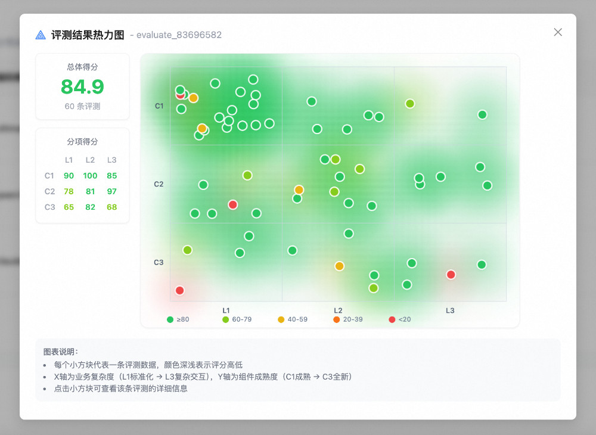

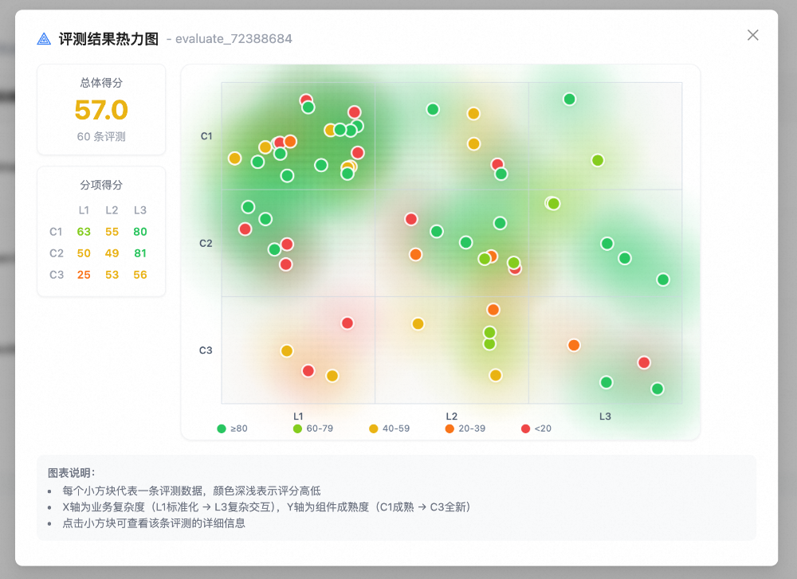

下钻到具体用例，可以看到得分差异背后的原因：

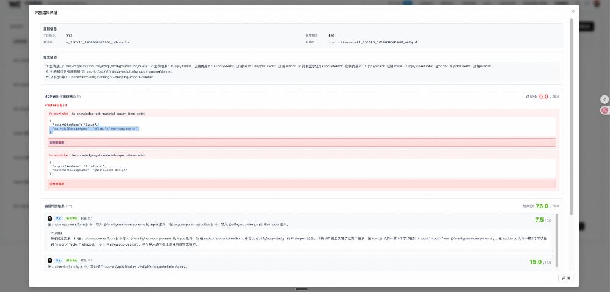

评测结果让模糊的"感觉"变成了清晰的数据：模型 A 总分 84.9，模型 B 总分 57.0，热力图直观呈现差距主要在文档不完善的场景。

这就是体系化评测的价值——从"感觉模型 A 更好"到"差距主要体现在哪类场景"。换模型、改 Prompt、补知识库，任何拿不准的调优都可以跑一轮评测验证效果。（详见第 3 章）

### 案例二：哪些知识"用了但没用"

团队曾遇到一个困惑：知识库的调用率看起来不错，但代码采纳率一直徘徊在 50% 左右。问题出在哪？

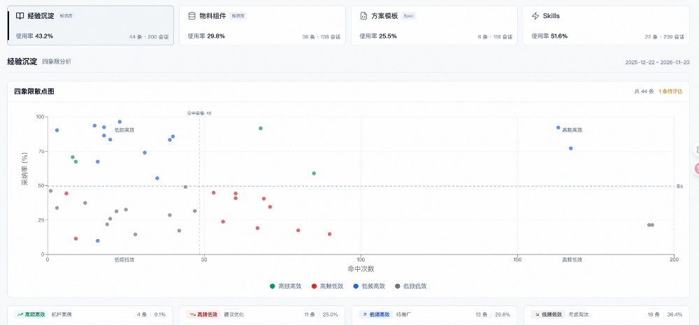

图中横轴是"命中次数"，纵轴是"采纳率"。知识库的调用率稳定在 43.2%，命中率也正常——从这两个指标看，知识库运转良好。

但四象限分布揭示了隐藏的问题——下半部分的点（采纳率低于中位数）就是需要关注的低效知识：

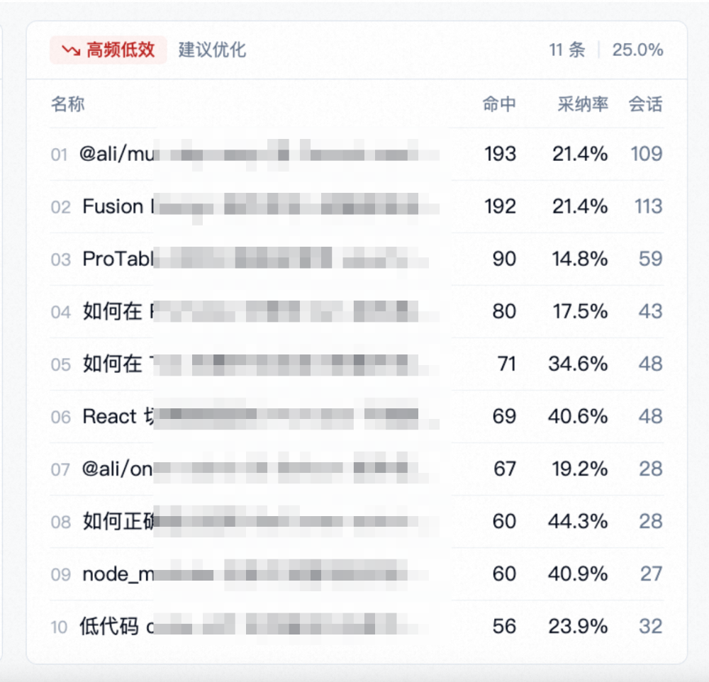

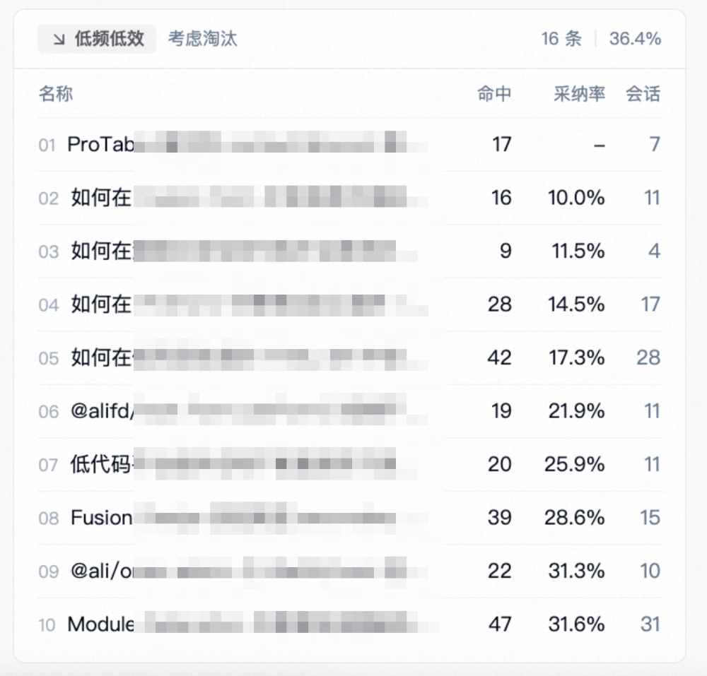

高频低效的知识是优化重点：被频繁召回但采纳率只有 20%~30%。这类问题很隐蔽——知识被"用"了，但没有真正"有用"。针对这批知识逐一优化后，关联采纳率从 18% 提升到 35%。（详见第 3 章）

### 度量体系设计

业界方案各有侧重但都不完整：Copilot Metrics 止于"接受补全"，无法验证上线；SWE-bench 只评结果，不适配前端场景。我们需要取长补短——离线评测快速验证调优方向，在线埋点追踪真实效果，并把终点从"IDE 内接受"延伸到"代码合并上线"。

基于这个思路，我们设计了三层相互验证的度量体系：

- 质量指标（能力边界）：离线评测，知道什么场景得分高、什么场景得分低；
- 链路指标（问题诊断）：在线埋点，效果不好时能定位是哪个环节出了问题；
- 结果指标（效果证明）：在线埋点，追踪到需求维度，计算 AI 对最终上线代码的贡献。

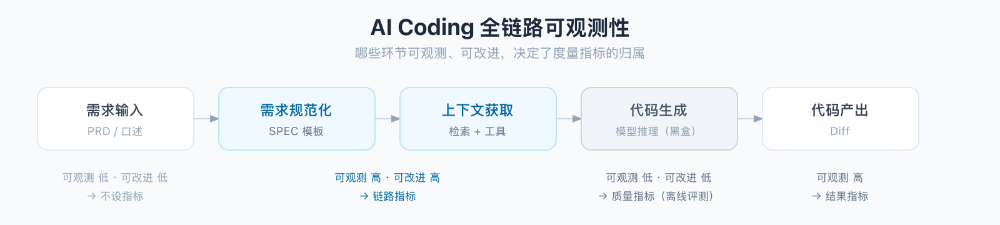

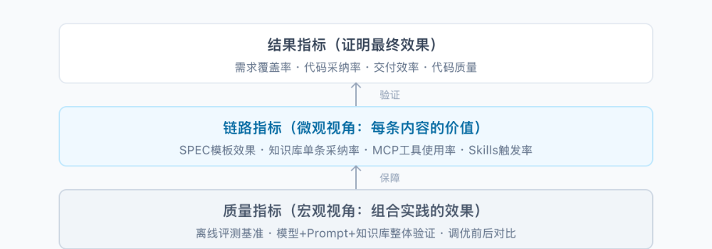

三层指标相互校验，只有各层都健康，才能证明 AI 实践是真实有效的。接下来分章节展开介绍。

质量指标：用离线评测快速定位能力短板

### 为什么需要垂直化的离线评测基准

离线评测基准的核心目标只有一个：真实有效地反映特定业务场景的 AI 生码能力。

业界有通用的评测基准（如 SWE-bench），但通用基准解决不了具体团队的问题——以我们的中后台前端场景为例，存在多解性（同一需求有多种等价实现）、测试成本高（交互类需求难以自动化验证）、过程盲区（只看结果不看 Agent 是否查阅了正确资料）等核心差异。我们需要知道的是：在我们的组件库、我们的业务场景、我们的代码规范下，AI 表现如何？哪些需求类型可以放心用、哪些要谨慎？

所以离线评测基准的设计思路是：垂直化、定制化的业务评测集，评测数据全部来自真实的历史需求，评测维度针对具体场景设计。借鉴 SWE-bench 的整体结构（评测数据集 + 评测方法 + 排行榜），但针对业务场景做了定制：

组成部分

SWE-bench

垂直化评测基准

评测数据集

2294 个 GitHub Issue（Python 后端）

真实历史需求（针对特定业务场景）

评测方法

测试通过即正确（二元判定）

复杂度矩阵 + 量化评分（结果分 + 行为分）

评测工具

测试执行框架

LLM as Judge + 代码采纳率计算

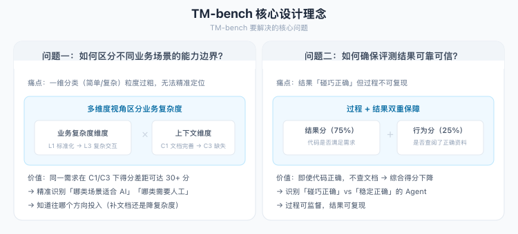

下图是评测数据集的部分用例：

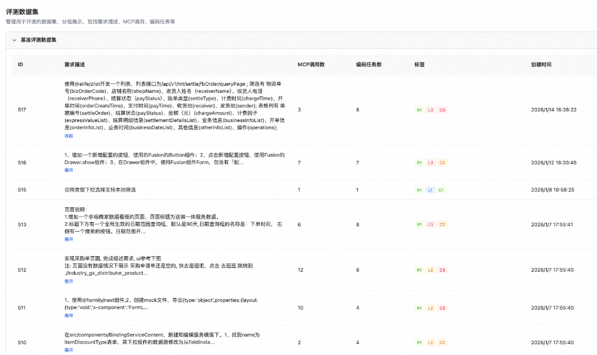

这套设计思路具备可迁移性：明确评测目标 → 选择核心维度 → 构建数据集 → 设计评分模型 → 建立对比基线。无论你的场景是什么，按这个框架思考就能设计出适合自己的评测基准。

### 复杂度矩阵：精准定位 AI 能力边界

复杂度矩阵是我们设计评测基准的核心工具。不同技术栈可能需要不同的维度组合，关键是找到对 AI 表现影响最显著的关键因素：

技术栈

可能的维度一

可能的维度二

中后台前端

业务复杂度（CRUD/联动/复杂交互）

组件成熟度（文档完善/部分/缺失）

后端服务开发

框架熟悉度（主流框架/小众框架/自研框架）

业务逻辑复杂度（单表/多表关联/分布式事务）

数据开发

数据规模（小数据量/中等/大规模）

处理逻辑复杂度（简单ETL/多源聚合/实时流处理）

配置生成

配置类型（标准配置/业务定制/平台特有）

依赖复杂度（无依赖/少量依赖/复杂依赖链）

以下我们以中后台前端场景为例，详细说明复杂度矩阵的设计思路。

在设计离线评测之前，我们已有一套基础评测方案，采用一维的 pageType 分类：简单列表页、简单表单页、详情页、配置页等。但实践中发现，这种分类粒度过粗，无法精细区分不同场景下的 AI 生码能力边界。

典型案例：同样是「简单表单页」，在组件库完善时 AI 表现良好（直接使用 Form、Input、Select 等标准组件），但在需要自定义组件时表现会显著下降（需要理解组件封装模式、处理复杂状态）。这种差异在一维分类中无法体现。

这促使我们引入第二个维度——组件成熟度，形成复杂度评测矩阵。为什么选择这两个维度？实践中我们发现「业务复杂度」和「组件成熟度」对 AI 表现影响最显著，其他维度（如代码规范要求、上下文依赖程度）则作为 refAnswers 的评分点体现。

- 维度一：业务复杂度（Complexity Level）

基于对中后台前端需求的长期观察，我们将业务复杂度抽象为以下层级：

层级

代号

典型场景

特征

标准化

L1

CRUD 列表、简单表单（≤15 字段）、详情展示页、简单配置页

直接使用组件库，逻辑简单，无复杂状态管理

有联动

L2

表单联动、多级筛选（省市区/类目树）、复杂表格（合并单元格、行内编辑）、审批流转

组件间有依赖关系，需要处理状态联动和数据转换

复杂交互

L3

拖拽排序、画布类、虚拟滚动、富文本定制、微前端集成

超出常规组件库覆盖范围，需要深度定制或架构级改造

划分依据：L1 场景的核心特征是「组件库即答案」——需求可以直接映射到标准组件的组合；L2 场景引入了组件间的交互逻辑，需要 AI 理解状态流转；L3 场景则超出了组件库的覆盖范围，需要架构级的设计能力。

- 维度二：组件成熟度（Component Maturity）

评估 AI 生码时可用的组件库支持程度：

层级

代号

定义

判断标准

完善

C1

组件存在且文档完善

组件在物料库中存在，有完整的 API 文档、使用示例、最佳实践

部分

C2

组件存在但文档不完善

组件存在但缺少使用示例，或文档过时，或缺少特定场景的指导

缺失

C3

需要自定义组件

物料库中无对应组件，需要从零开发或深度改造现有组件

为什么组件成熟度重要：AI 生码的质量高度依赖于上下文供给。当组件文档完善时，AI 可以通过 MCP 调用获取准确的 API 信息；当文档缺失时，AI 只能基于通用知识「猜测」用法，出错概率显著上升。

- 九象限矩阵与预期成功率

将业务复杂度和组件成熟度组合，形成能力评估矩阵：

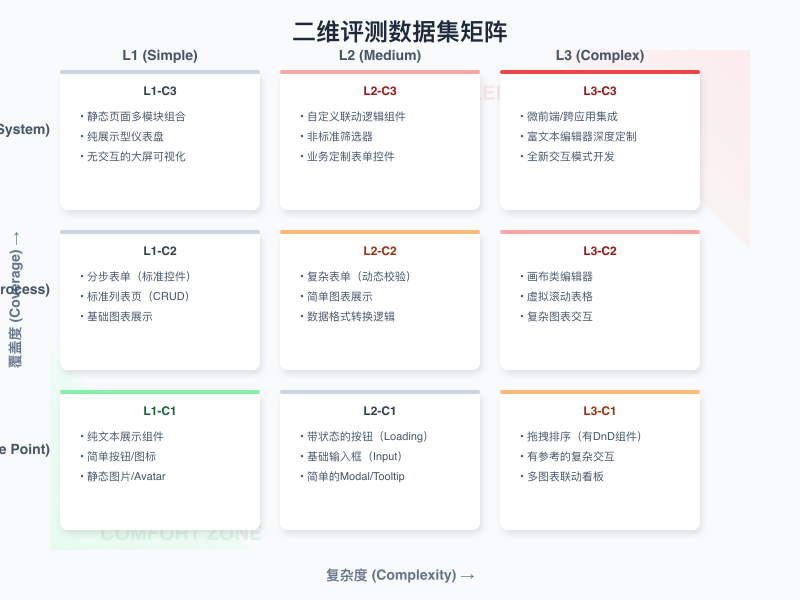

- 绿色（推荐区）：L1-C1、L1-C2、L2-C1 —— 预期高成功率，适合 AI 独立完成
- 黄色（调试区）：L1-C3、L2-C2、L3-C1 —— 需要多轮调试，建议人机协作
- 红色（挑战区）：L2-C3、L3-C2、L3-C3 —— 超出 AI 有效辅助边界，不推荐

矩阵的应用价值：

- 需求分流：接到新需求时，快速判断是否适合 AI 辅助；
- 能力提升：通过完善组件文档，将 C2/C3 场景转化为 C1，扩大绿色区域；
- 预期管理：向业务方清晰传达 AI 的能力边界，避免过高期望。

### 可量化的评分模型：不仅看结果，还看过程

与 SWE-bench 采用单一测试验证不同，我们的离线评测采用「结果 + 过程」双视角的量化评分模型。

市面上的主流 Benchmark 几乎都只关注结果：SWE-bench 测「测试通过了没有」，HumanEval 测「代码能跑不能跑」，Aider 榜单测「功能实现了没有」。但有些让人浑身难受的事儿却鲜有人关注：Agent 写代码时有没有按 AGENTS.md 里的命名规范来？用户说「先备份再删」时有没有真的先备份？System Prompt 要求「不要用 emoji」时有没有忍住？

这些「过程合规」问题在企业场景下尤其重要。一个 Agent 如果能写出正确的代码，但从不查阅组件文档、从不调用知识库，那它的「正确」可能只是碰巧——换一个稍微复杂的场景就会出错。

「过程监督」的价值已被学术研究证实。OpenAI 在 2023 年 5 月发表了 Let's Verify Step by Step 论文（作者之一是 Ilya Sutskever），核心发现是：对推理过程的每一步给反馈（Process Reward Model），比只对最终答案给反馈（Outcome Reward Model）效果好得多。在 MATH 数据集上，PRM 得分 78.2%，ORM 得分 72.4%，差距显著。不过这篇论文主要聚焦数学推理领域，我们的离线评测可以看作是把「过程监督」思路迁移到软件工程领域的尝试。

我们把这称为「开卷考试」理念：不仅看答案对不对，还看有没有翻对书、查对资料。

视角

评判内容

权重

结果分

代码是否满足业务需求（refAnswers + testCases）

75%

行为分

Agent 是否遵循合理工作流程（知识库调用 + 文档查阅）

25%

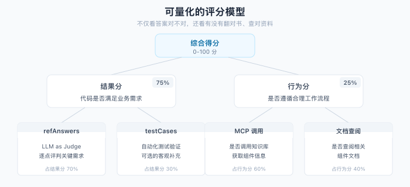

- 结果分（Result Score）

结果分评估代码是否满足业务需求，采用 LLM as Judge 主导评判。每个评测用例包含若干 refAnswers（参考答案点），LLM 逐一评判代码是否满足每个关键点，输出 0/0.5/1 三档评分。前端需求的「多解性」决定了无法用简单的字符串匹配来判定正确性，LLM 具备语义理解能力，能够判断不同实现是否在功能上等价。

对于有测试覆盖的场景（如数据处理逻辑、API 调用验证），可配置 testCases 作为客观验证补充，与 LLM 评分加权融合。

LLM as Judge 的适用场景：这种评判方式不仅适用于前端代码，任何存在"多种正确实现"或"正确性需要语义理解"的场景都可以采用——后端业务逻辑代码、数据处理管道、配置文件生成、文档注释等。共同特征是：无法用简单的字符串匹配或单元测试覆盖所有正确答案。

- 行为分（Behavior Score）

行为分评估 Agent 是否遵循了合理的工作流程：是否调用了知识库 MCP 获取组件信息、是否查阅了相关文档。

一个典型案例说明行为分的意义：

用例

结果分

行为分

综合得分

分析

eval-001

1.0

1.0

0.94

理想情况：代码正确，且查阅了文档

eval-002

1.0

0.0

0.75

碰巧正确：代码正确，但没查任何资料

eval-003

0.5

1.0

0.63

认真但有误：查了资料，但实现有问题

eval-002 的情况值得警惕：代码完美满足需求，但 Agent 完全没有查阅知识库——这反映了其工作方式存在隐患，在更复杂的场景下可能会出错。

### 综合评分与权重设计

综合得分 = 结果分 × 0.75 + 行为分 × 0.25。

关于权重的几点说明：

首先，这个权重是我们在特定业务场景下通过实验校准得出的，不是放之四海皆准的「最佳配置」。不同团队应该根据自己的业务特点调整——如果你的场景更看重「稳定可复现」（比如金融、医疗），行为分权重可以提高到 30-40%；如果场景更看重「快速出结果」且容错空间大，可以降到 15-20%。

其次，为什么我们选择 25% 而不是更高或更低？我们测试了 80/20、70/30、75/25 三种配置，观察了两个指标：区分度（能否有效区分「碰巧正确」和「稳定正确」的 Agent）和一致性（多次评测结果是否稳定）。75/25 在我们的数据集上达到了最佳平衡——行为分太低则「碰巧正确」的用例无法被识别，太高则会过度惩罚「结果正确但路径不同」的合理实现。

最后，行为分的核心价值不在于「惩罚』，而在于预测稳定性。一个不查资料却答对的 Agent，在简单场景下可能表现良好，但复杂场景下出错概率会显著上升。行为分本质上是对「工作方式健康度」的量化评估——它不是要说「不查资料就是错」，而是要说「查资料的 Agent 在复杂场景下更可靠」。这个逻辑类似于招聘时看候选人的解题思路，而不只是看最终答案。

### 评测实践与调优应用

有了复杂度矩阵和量化评分模型，接下来展示离线评测的实际应用。

- 数据集与评测流程

当前数据集包含 60 个用例，覆盖 9 个象限的典型类型，每个用例都经过人工审核，质量优先于数量。

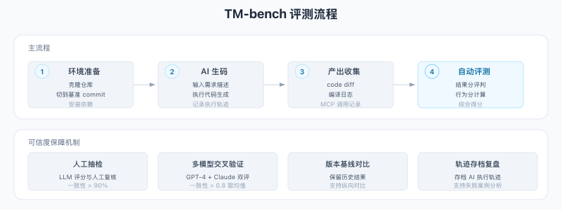

可信度保障：人工抽检（LLM 评分与人工复核一致性 > 90%）、多模型交叉验证、版本基线对比、轨迹存档复盘。

- 热力图与调优闭环

评测结果按复杂度矩阵聚合，形成能力热力图：

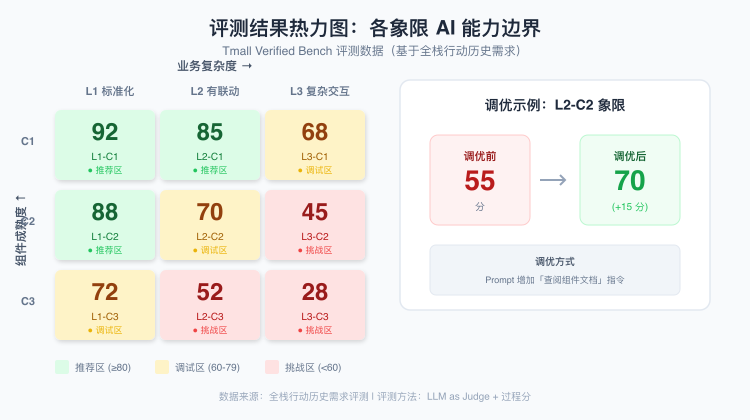

热力图揭示 AI 的能力边界：绿色推荐区得分 85+ 分，适合 AI 独立完成；黄色调试区需要多轮调整；红色挑战区超出 AI 有效辅助边界。

调优案例：早期 L2-C2 象限（有联动 + 组件文档不完善）只有 55 分。分析失败用例发现问题集中在"表单联动"类需求。针对性优化 SPEC 模板（增加联动规则表、联动流程图）+ Prompt 优化 + 知识库补充后，L2-C2 从 55 分提升到 70 分。

这就是离线评测的典型闭环：热力图定位短板 → 分析失败用例 → 针对性调优 → 评测验证效果。

但离线评测有天然局限：评测环境不等于生产环境。所以还需要在线数据验证实际表现——这就是下一章的链路指标。

链路指标：定位过程瓶颈

> 核心洞察：知识库被频繁召回但采纳率低？这条知识可能需要优化。四象限分析让我们从「有没有用」进化到「哪条好用、哪条该淘汰」。

离线评测建立了能力基线，但生产环境中的实际表现需要在线数据来验证。链路指标通过埋点采集真实用户的使用行为，追踪 AI Coding 各环节的转化情况。

### 核心问题上下文有没有起作用

链路指标要回答的问题很简单：我们费心准备的上下文（知识库、组件文档、SPEC 规范），在 AI 生成代码的过程中，有没有按预期起到正向作用？

如果知识库被频繁调用但最终代码采纳率很低，说明知识库内容可能有问题；如果 Agent 根本没去查知识库就开始写代码，说明 Prompt 引导有问题。链路指标就是要把这些「中间环节」的问题暴露出来。

### 为什么不追踪单条数据的"采纳"

在设计链路指标时，我们最初考虑了一个理想化方案：追踪每条知识/组件是否被 Agent 采纳。经过深入讨论，发现这个方案存在多个工程化难题：

追踪单条知识的"采纳"存在工程难题：知识库返回的是"软内容"，Agent 不一定显式标注引用了哪条；强制标注会影响 Agent 自然输出；也没有对照组做 A/B 测试。

解决思路：既然追踪"采纳"不可行，我们采用关联分析——分析使用了某能力的会话，其采纳率表现如何。具体方法见 4.3 节。

### 整体转化率：调用→命中→采纳

上下文的价值可以用一个简单的漏斗来衡量：

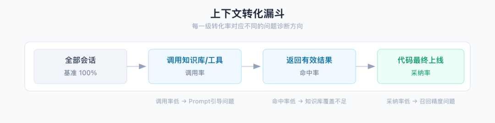

每一级对应不同的问题：

- 调用率低 → Agent 不知道要查资料，Prompt 引导有问题
- 命中率低 → 知识库内容覆盖不足，或者索引质量差
- 采纳率低 → 查到了但不是 Agent 需要的，召回精度有问题

### 定位具体哪条数据有问题

整体转化率只能告诉你"知识库效果不好"，但无法定位具体哪条知识有问题。我们按「使用频率」和「关联采纳率」两个维度，把每条数据分布到散点图上：

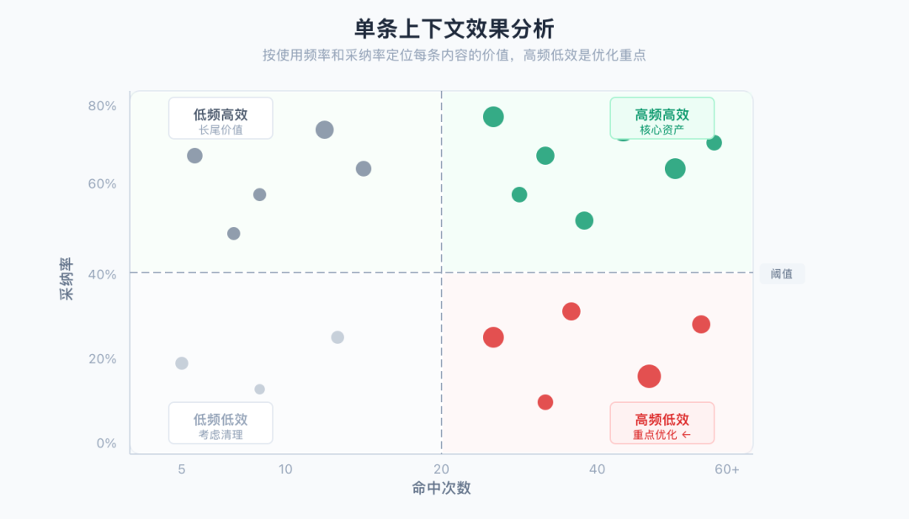

高频低效是重点：被频繁召回但采纳率低，优化后影响面最大。阈值用动态中位数，确保随着整体质量提升，仍能识别出相对最需要关注的条目。

### 各类上下文的效果追踪

AI 生成代码的质量高度依赖上下文供给。我们从四个视角追踪上下文的效果：SPEC 需求规格关注需求描述是否足够清晰，经验沉淀知识库关注踩坑经验有没有被复用，物料组件知识库关注组件用法查到了没有，Skills 工作流关注最佳实践有没有被触发。

### SPEC：技术方案模板规范

SPEC（技术规格说明）是我们预置的技术方案模板。不同类型的需求使用不同的模板：列表页模板适用于标准 CRUD 列表，表单模板适用于配置编辑页，多场景模板适用于复杂业务流程，基础模板适用于通用简单页面。模板的结构化程度直接影响 AI 生成代码的准确度——结构化越强，AI 理解需求越准确。

我们通过最终采纳率反推模板质量：追踪每个模板关联的代码采纳率，识别哪些模板效果好、哪些需要优化。

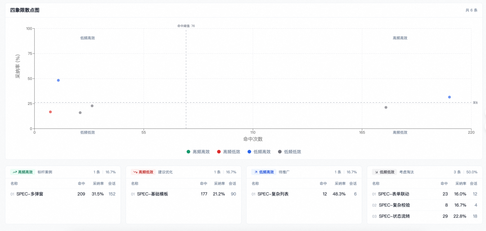

图中展示了各 SPEC 模板的使用频率和关联采纳率。高频高效的模板（如多场景模板）说明模板设计合理，可以作为标杆推广；高频低效的模板需要针对性优化。

以「基础模板」为例，最初只包含简单的功能描述框架，采纳率明显偏低。分析发现 AI 经常遗漏接口字段映射和状态管理逻辑。我们补充了「数据流转说明」和「状态变更规则」两个必填项后，采纳率显著提升。这说明模板的结构化约束越强，AI 的输出质量越稳定。

### 经验沉淀：团队经验

经验沉淀知识库存储团队积累的踩坑经验、最佳实践、业务规则等——这些是模型无法从公开资料获取的业务独特知识。按内容类型可分为三类：

- 踩坑记录：具体的问题和解决方案（如 tsconfig 配置问题、接口兼容性问题）
- 编码规范：团队约定的代码风格和模式（如状态管理方式、错误处理规范）
- 业务规则：领域特定的逻辑约束（如价格计算规则、权限校验逻辑）

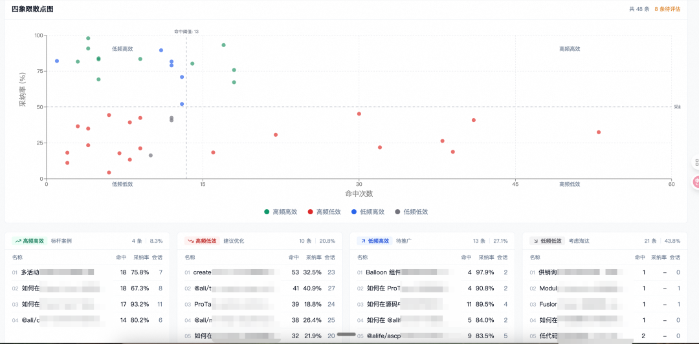

我们通过关联分析评估知识的有效性：命中某条知识后，该会话的代码采纳率如何？用 4.1.3 介绍的散点图分析定位问题。

判断知识质量的核心维度是可操作性——AI 看了能直接用，而不是"知道有这回事但不知道怎么做"。例如：一条「tsconfig 配置」知识召回率高但采纳率偏低。分析发现原文只说「配置 baseUrl 可简化导入』，没说明项目的具体配置方式。补充 paths 映射规则和示例代码后，采纳率显著提升。

零结果查询是知识库缺口的直接信号。我们每周汇总 Top 20 零结果查询，按「出现频次 × 业务影响」优先级排序，作为知识补充的输入——用户在问什么、我们没覆盖什么，一目了然。

### 物料组件：技术文档

物料组件知识库通过 MCP 工具提供三类能力：

- 组件查询：按名称或功能描述检索组件
- API 文档：组件的 Props、事件、插槽说明
- 使用示例：典型场景的代码片段

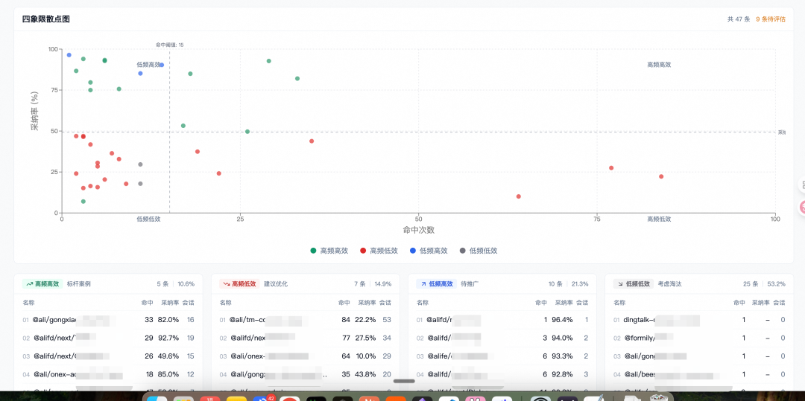

使用率反映 Agent 是否"知道要查组件文档"。使用率低需要区分两种情况：

- Agent 没调用 MCP：检查 System Prompt 的工具使用引导，或者在离线评测中加入"必须查询组件文档"的行为分要求
- 调用了但命中率低：检查组件命名是否与 Agent 理解一致（例如「日期选择器」在组件库中叫 DatePicker 还是 Calendar），或者组件文档覆盖不足

当前组件库文档的主要缺口在业务组件和近期新增组件。我们定期扫描"调用了 MCP 但返回空结果"的查询日志，作为文档补充的优先级输入。

### Skills：标准流程

Skills 是预置的工作流能力，封装了标准化任务的最佳实践。

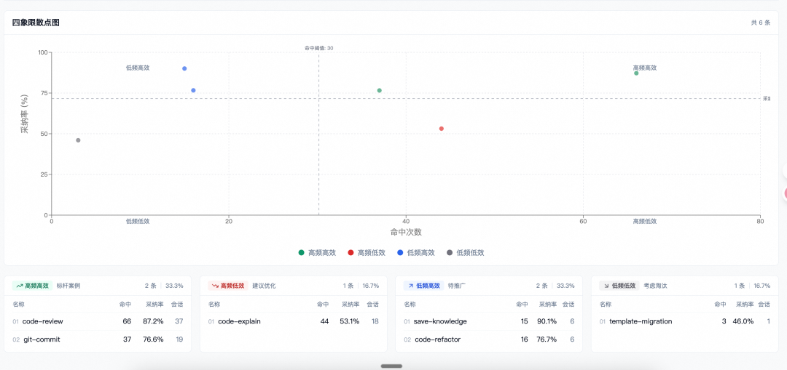

当前追踪使用率和采纳率。数据显示，使用 Skills 的会话平均采纳率明显高于普通会话，说明标准化工作流确实能提升生成质量——Skills 本质上是把"专家经验"固化成可复用的流程。

更理想的指标是触发率（符合条件的场景中 Skills 是否被触发）和完成率（触发后是否成功完成）。触发率低说明场景识别不足，完成率低说明工作流设计有问题。这需要单独定制埋点，计划下一版本实现。

### 链路指标的运营实践

链路指标的核心运营场景是定位上下文供给的薄弱环节。

每周拉取各能力的三级漏斗数据（调用率→命中率→采纳率），重点关注两类异常：

- 调用率低：说明 Agent 不知道要用这个能力。检查 System Prompt 中的工具使用引导是否清晰，或者该能力的触发条件是否过于苛刻。
- 命中率高但采纳率低：说明召回了但不好用。用四象限分析定位具体是哪些知识条目拖了后腿，优先优化"高频低效"象限的内容。

零结果查询的 Top 20 列表是知识库扩展的直接输入——用户在问什么、我们没覆盖什么，一目了然。

链路指标告诉我们"各环节有没有被用好"，但老板最关心的问题是"最终效果怎么样"。下一章我们将介绍结果指标——用需求覆盖率和代码采纳率来直接回答这个问题。

结果指标：验证调优效果

> 核心洞察：「接受补全」不等于「代码有用」——我们把追踪终点从 IDE 延伸到代码合并，用「最终上线的代码中有多少来自 AI」来衡量真实价值。

链路指标告诉我们"各环节有没有被用好"，但老板最关心的是"最终效果怎么样"。结果指标直接回答这个问题——需要将 AI 生成任务与业务需求进行跨系统关联。

### 数据关联基础

结果指标的计算依赖于跨系统数据关联：将 AI 生成任务与业务需求进行匹配。

核心设计是以 ( repo_project, branch ) 作为关联键，将 AI 编码平台的任务数据与内部迭代/需求系统打通。数据流程：AI 出码完成后实时上报 Diff → 发布记录 T+1 同步 → 定时任务匹配计算采纳率。

有了这套关联机制，就可以计算各项结果指标了。

### 需求覆盖率

定义：AI 参与的需求占总需求的比例。
需求覆盖率 = 关联 AI 任务的需求数 / 总需求数我们的数据：下图展示了各业务域的需求覆盖情况，按业务域聚合显示总需求数、AI 参与需求数和覆盖率。

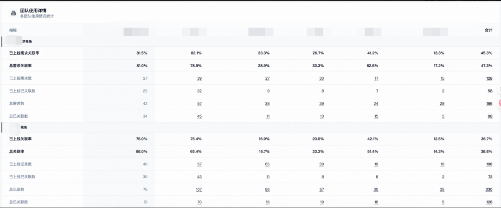

支持下钻到具体需求列表，查看每个需求的上线状态、关联的 AI 任务实例、会话数和 Token 成本消耗：

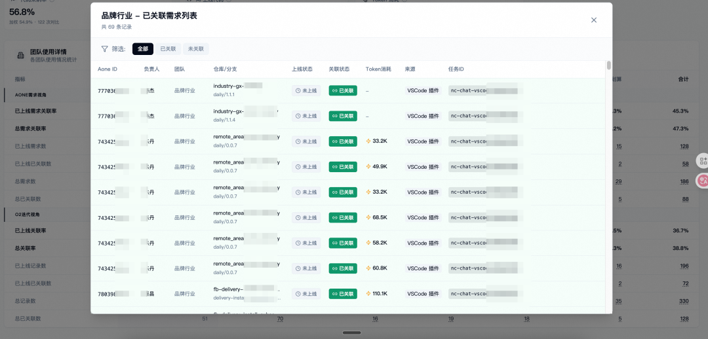

为什么重要：覆盖率反映 AI 工具的渗透程度。如果只有 10% 的需求用了 AI，说明大多数场景还没被覆盖，可能是工具不好用、或者适用场景有限。

### 代码采纳率

定义：AI 生成的代码最终被上线的比例。
代码采纳率 = AI 生成代码被上线的行数 / AI 生成代码总行数我们的数据：下图展示了采纳率分析面板。上半部分是汇总统计（任务数、整体采纳率、代码行数），下半部分是任务明细列表，可以下钻到每个任务查看 AI 生成代码与最终上线代码的 Diff 对比。

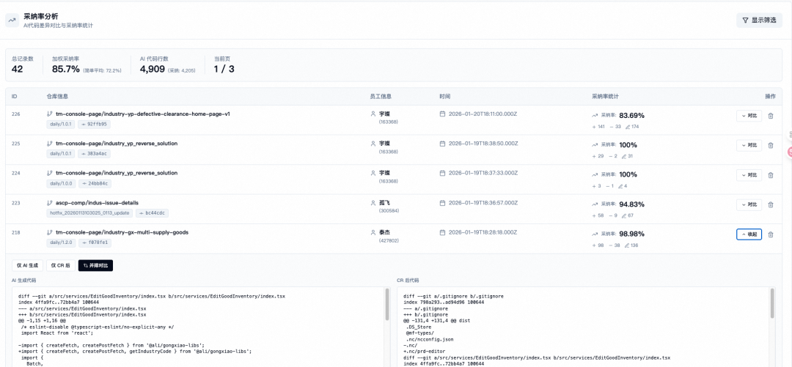

为什么重要：采纳率是 AI 产出质量的核心指标。生成了一堆代码但都被删掉重写，说明 AI 没帮上忙。

计算难点：AI 生成的代码和最终上线的代码存在格式差异（空格、引号、分号），直接比对会误判。我们采用规范化比对算法——先对两边代码做预处理（去除注释、合并空白、统一引号和分号风格），再进行逐行比对。这是纯工程化实现，不依赖 AI，计算速度在毫秒级。

Merge Commit 识别机制：用户的发布记录中保存的 repo_commit_id 通常是最后一次提交的 commit。要获取完整的代码变更，需要找到该 commit 之后的 Merge Commit——它包含了从功能分支合并到主分支的所有变更。系统通过 GitLab API 获取 commit 历史，定位用户的 commit 后，向后查找第一个标题包含"Merge commit"的提交。

多次出码场景处理：用户可能在同一分支多次使用 AI 生成代码。例如：
第1次出码（10:00）：+ console.log('step1');第2次出码（11:00）：+ function test() {}最终发布（14:00）： + console.log('step1'); // 来自第1次 AI + function test() {} // 来自第2次 AI + const x = 1; // 用户手写计算采纳率时，系统会将同一 (repo_project, branch) 下的所有 AI Diff 记录合并后再与 Merge Commit Diff 比对，确保不遗漏任何一次出码的贡献。上例中：AI 新增行 2 行，CR 新增行 3 行，被采纳 2 行，采纳率 = 66.67%。

### Token 成本追踪

定义：单需求关联的 Token 消耗总量。

为什么重要：Token 成本是 AI Coding 的主要投入，追踪成本可以评估 AI 投入的 ROI，验证 Prompt 优化、知识库完善等运营策略的实际效果。

多维度聚合统计：基于统一网关的底层调用，我们实现了 Token 消耗的多维度聚合统计，支持从 Task、迭代、需求等层级查看成本分布：

聚合维度

数据来源

应用场景

Task 维度

单次 AI 对话的 Token 消耗

分析单次对话的效率

迭代维度

关联到该迭代的所有 Task Token 总和

评估迭代级的 AI 投入

需求维度

关联到该需求的所有 Task Token 总和

评估需求级的 AI 成本

聚合策略采用「允许重复计算」模式：每个迭代或需求独立聚合其关联 Task 的 Token 总和。由于存在多对多关系（一个 Task 可能关联多个需求），各维度的汇总值不等于实际总消耗，但这种设计更符合业务分析的需要——产品经理关心的是「这个需求花了多少 Token」，而不是「这个 Token 被几个需求共享」。

应用价值：

- 趋势分析：观察单需求成本是否呈下降趋势，验证运营策略效果；
- 异常识别：结合采纳率数据，识别「高消耗低采纳」的异常模式，针对性改进；
- ROI 评估：计算 Token 成本与需求交付价值的比值，评估 AI 投入产出比。

下图展示了按需求维度聚合的 Token 消耗明细。每行代表一个需求，显示关联的仓库、需求描述、负责人和 Token 消耗量，支持按消耗量排序快速定位高成本需求。

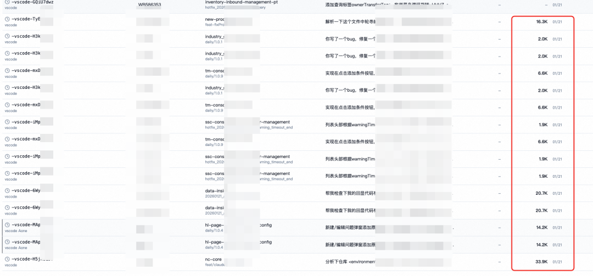

### 其他辅助指标

除了核心的覆盖率、采纳率和 Token 成本，我们还追踪一些辅助指标：

交付效率：单需求平均交付时间，可通过迭代系统的时间戳粗略推算。由于影响因素较多（需求复杂度、开发者经验等），不作为核心追踪指标。

代码质量：上线后的 bug 率、返工率。全栈模式下，后端工程师完成前端需求后会进行完整的自测验证，质量通常优于前后端分离交付的模式。作为滞后指标，需要较长时间积累数据。

总结与展望

从"我觉得有效"到"数据证明有效"，是 AI Coding 从个人工具走向团队基础设施的关键一步。

做这套体系的过程中，有几个认知转变让我印象深刻：

从"证明有效"到"定位问题"。最初我们只想回答老板的问题："效果怎么样？"但做着做着发现，真正的价值不是那个最终的采纳率数字，而是当采纳率不理想时，能够快速定位是知识库没召回、是 Agent 没查资料、还是生成的代码本身有问题。能诊断，比能证明更重要。

从"评结果"到"评过程"。业界的评测基准几乎都只看最终代码对不对，但我们发现一个反直觉的现象：有些 Agent 代码写对了，但完全没查文档——这种"碰巧正确"比"稳定正确"更危险。所以我们的离线评测加入了行为分，不仅评代码，还评 Agent 有没有"查对资料"。

从"个人感知"到"团队共识"。个人用 AI 写代码，改了 Prompt 感觉顺畅一点，这种"感觉"无法在团队层面形成共识。但当你有了评测基线，"换个模型效果如何""加条知识提升多少"就变成了可讨论、可决策的问题。数据让团队能够对齐认知。

当然，这套体系还有明显的局限：LLM 评分存在主观性，数据集规模有限，行为追踪维度不够丰富。但我们相信方向是对的——未来会探索自动化用例生成、更丰富的链路指标、以及将这套评测方法开放为可复用的通用框架。

回到开头的问题：如何证明 AI Coding 的真实价值？

数据不会说谎。当你能用数据清晰地回答"效果到底怎么样"时，你就有了持续投入的底气，也有了推广复制的基础。

但这套度量体系真正揭示的，是一个更深层的认知：AI Coding 的本质不是"买个工具提效"，而是一场知识资产的治理革命。

当你开始追踪知识库的召回率和采纳率，你就开始认真对待每一条文档的质量；当你开始评估 SPEC 的转化效果，你就开始把需求规范当作可运营的资产；当你开始分析 Prompt 的行为得分，你就开始把最佳实践沉淀为可复用的团队能力。

文档、SPEC、Prompt——这些曾经散落在各处的"软资产"，在度量体系的照射下，都成为可度量、可迭代、可复用的团队资产。这才是 AI Coding 带来的真正变革：不是 AI 替代了谁，而是团队的知识终于有了积累和复利的可能。

度量不是为了考核工程师，而是为了赋能。通过这套体系，我们将工程师从重复劳动中解放出来的过程可视化了——这才是 AI Coding 最大的价值。

## 团队介绍

本文作者珈文，来自淘天集团-天猫品牌行业前端团队。我们团队负责消费电子、3C数码、运动、家装、汽车、奢品、服务等多个行业的项目。我们定位自身不局限于“传统”的前端团队，在AI、3D、工程化、中后台等领域，我们有着持续的探索和实践。

## 拓展阅读

[3DXR技术](https://mp.weixin.qq.com/mp/appmsgalbum?__biz=MzAxNDEwNjk5OQ==&action=getalbum&album_id=2565944923443904512#wechat_redirect) | [终端技术](https://mp.weixin.qq.com/mp/appmsgalbum?__biz=MzAxNDEwNjk5OQ==&action=getalbum&album_id=1533906991218294785#wechat_redirect) | [音视频技术](https://mp.weixin.qq.com/mp/appmsgalbum?__biz=MzAxNDEwNjk5OQ==&action=getalbum&album_id=1592015847500414978#wechat_redirect)

[服务端技术](https://mp.weixin.qq.com/mp/appmsgalbum?__biz=MzAxNDEwNjk5OQ==&action=getalbum&album_id=1539610690070642689#wechat_redirect) | [技术质量](https://mp.weixin.qq.com/mp/appmsgalbum?__biz=MzAxNDEwNjk5OQ==&action=getalbum&album_id=2565883875634397185#wechat_redirect) | [数据算法](https://mp.weixin.qq.com/mp/appmsgalbum?__biz=MzAxNDEwNjk5OQ==&action=getalbum&album_id=1522425612282494977#wechat_redirect)
