# 从 Vibe Coding 到范式编程：用 Spec 打造淘系交易的 AI 领域专家
公众号：大淘宝技术

发布时间：2026-03-30 15:37


本文介绍了从“Vibe Coding”向“范式编程”演进的技术路径，核心是通过结构化**规范（Spec）**驱动AI生成符合企业级标准的代码。文章以淘系交易系统为背景，指出当前AI编程工具因缺乏领域知识、上下文缺失和规范约束，导致生成代码不可靠、难维护；为此提出“范式编程”——将规范置于开发中心，结合知识库、知识点、疑问点机制与AI Agent，构建可沉淀、可复用、可演进的AI领域专家体系，实现从“人写代码”到“人机协同”的范式升级。


## 前言

凌晨两点，⼩丫同学盯着屏幕上Cursor⽣成的代码，第三次按下了删除键......

"这AI是不是傻？"他刚让AI帮他写⼀个订单状态流转的逻辑。AI确实写出来了：语法正确，逻辑清晰，甚⾄还贴⼼地加了注释。但问题是：这代码完全不能⽤。

⼩丫叹了⼝⽓。他知道问题出在哪：AI不懂这个项⽬，不懂这个团队，不懂交易这个领域。它就像⼀个刚⼊职的聪明实习⽣：能写出漂亮、⾼效的代码，但对 我们这⾥的规矩 ⼀⽆所知。于是，⼩丫开始了他的⽇常操作：把团队的编码规范、相关的历史代码、踩过的坑写成注意事项找出来复制⼀遍，粘贴到提示词⾥，经过反复调试，直到AI终于"理解"了他的意图，等他终于让AI⽣成出⼀段可⽤的代码时，已经是凌晨四点。

这效率，还不如我自己写。

⼩丫的故事并⾮个例，根据 Stack Overflow年度报告 显示：


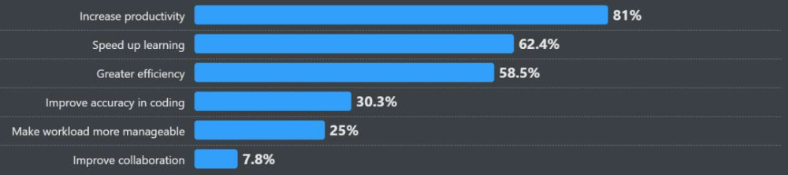

- 有 81% 的开发者认为 AI ⼯具的最⼤好处在于提⾼⽣产⼒。
- 其次加快学习速度（62.4%）和更⾼的效率（58.5%）也是开发者使⽤ AI ⼯具的⽬的之⼀。
- 但同时也有 25% 的⼈认为 AI ⼯具在处理复杂、⼯程任务⽅⾯的很差或⾮常差。

处理复杂、⼯程任务很差的问题本质是什么？不是AI不够聪明——GPT-4、Qwen、Claude都已经⾜够强⼤。问题在于：当前的AI编程⼯具是⽆状态⽆规矩的。每次对话它对你的项⽬、团队、领域知识都是从零开始。这就像每天换⼀个新实习⽣：你需要反复培训，反复解释，反复纠错。
有没有一种可能，让AI"记住"这些知识？让它成为一个真正懂业务的团队成员？这就是我们要探讨的⽅向：范式编程

## 范式编程的由来
### 技术演进路径
在软件开发的漫⻓历史中，⼈与机器的协作⽅式始终在演进。从最初的打孔纸带，到命令⾏编辑器vi，再到集成开发环境IDE——每⼀次变⾰，都在回答同⼀个问题：如何让开发者更⾼效地将思想转化为代码？2020年代，这个问题有了⼀个全新的答案：让AI成为编程的协作者。
### 演进的四个阶段
阶段⼀：智能代码补全时代（2018-2020）
2018年：Kite公司推出基于机器学习的代码补全工具，首次将深度学习应用于代码提示 。2019年：TabNine发布，采⽤GPT-2模型进⾏代码预测，开创了LLM辅助编程的先河。2020年：微软的IntelliCode升级⾄2.0版本，引⼊上下⽂感知的智能补全。这⼀阶段的核⼼特征是局部优化——AI只关注当前光标位置，提供单⾏或单词级别的补全建议。它解决的是"敲键盘太累"的问题，但本质上仍是⼀个⾼级版的⾃动补全。想⼀想：当时的开发者会说"AI帮我补全了⼀⾏代码"，⽽不是"AI帮我实现了⼀个功能"。这种差异，恰恰揭示了技术演进的⽅向。Python 之⽗ Guido van Rossum ⽤Copilot后，也发出了「really love」感叹。
阶段⼆：辅助编程时代（2021-2023）
2021年6⽉：GitHubCopilot技术预览版发布，基于OpenAICodex模型2021年10⽉：GitHub Copilot正式版上线，被称为"AI pair programmer"2022年11⽉：ChatGPT发布，证明了LLM在⾃然语⾔理解上的突破2023年3⽉：GPT-4发布，代码⽣成能⼒显著提升GitHubCopilot的出现是⼀个分⽔岭。它不再只是补全单词，⽽是能够：根据注释⽣成整个函数理解上下⽂并推断开发者意图提供多个候选⽅案供选择
到2024年，超过82%的开发者已经在使⽤某种形式的AI编程助⼿，GitHub报告显示Copilot贡献了公司超过40%的营收增⻓。但问题也随之⽽来：Copilot⽣成的代码缺乏对项⽬整体架构的理解，它更像⼀个聪明但缺乏全局视野的实习⽣——能完成具体任务，却不懂为什么这么做。
阶段三：Vibe Coding时代（2025年初）
2025年2⽉：Andrej Karpathy（前OpenAI联合创始⼈）在社交媒体上提出 Vibe Coding概念。2025年："Vibe Coding"被柯林斯词典评为年度词汇。
什么是Vibe Coding？Karpathy的原话是："YoujustvibewiththeAI,describingwhatyouwantinnatural language,anditgeneratesthecode."（你只需要与AI共鸣，⽤⾃然语⾔描述你想要的，它就会⽣成代码。）这代表了⼀种全新的编程范式：开发者⽤⾃然语⾔描述意图开发者通过运⾏结果⽽⾮代码审查来验证不断迭代对话，直到达成⽬标实际上，在企业级场景中，开发者很快意识到纯粹的VibeCoding难以满⾜⼯程化需求，开始⾃发地在Prompt中添加各种约束：编码规范、命名⻛格、架构要求、异常处理模式……这种Prompt约束式编程可以看作是从Vibe Coding到范式编程的过渡形态。开发者通过不断丰富Prompt中的规则，试图让AI⽣成更符合团队规范的代码。
阶段四：范式编程时代（2025年⾄今）

Vibe Coding的出现，让⾮专业程序员也能构建应⽤程序，极⼤降低了软件开发的⻔槛。对于新项⽬、个⼈项⽬，Vibe Coding是效率神器。但对于交易系统这样的核⼼业务领域——每⼀⾏代码都关系到资⾦安全、业务合规、系统稳定——"随性⽽为"显然不够。它⾯临了⼀个根本性问题：缺乏规范和约束的代码，如何保证在企业级场景中的可靠性、可维护性和合规性？
这就引出了我们的核⼼命题：规范驱动编程（Spec-Driven Development， SDD） 也叫范式编程，如果说Vibe Coding是⽤对话⽣成代码，那么范式编程就是在领域规范指导下，⽤对话⽣成符合企业标准的代码。它颠覆了传统「代码先⾏」的模式，将规范（Spec）置于开发流程的核⼼。其核⼼理念是，在编写或⽣成代码之前，⾸先构建⼀份结构化的规范⽂档，并由AI编码代理（Agent）根据这份规范来⽣成、验证和迭代代码。范式编程开发者的重⼼:从逐行实现代码，到更高层次的设计与指导。

### 技术演进的必然性

 为什么会有这样的演进路径？这不是偶然，而是由三个核心驱动力决定的：驱动⼒从代码补全到Vibe Coding从Vibe Coding到范式编程上下⽂窗⼝4K→128K tokens128K→1M tokens模型能⼒MCP，⼯具调⽤Skills、RAG、Spec、Agent能⼒成熟交互⽅式从被动补全到主动对话从⾃由对话到结构化⼯作流⼯程诉求效率优先质量与效率并重
2024年11⽉，Anthropic发布的MCP（Model Context Protocol）协议，为Vibe Coding提供了关键的技术基础——它标准化了AI与外部⼯具、知识库的交互⽅式，使得"感知环境的AI编程"成为可能。2025年9⽉，Anthropic 发布 Claude Sonnet 4.5，将编码能⼒和推理能⼒⼜往前推了⼀⼤步：在约 20 万 token 的上下⽂窗⼝下，它可以⻓时间、稳定地“挂住”整个代码仓库、技术⽅案和运⾏⽇志，⽀持连续数⼗⼩时的⾃动编码与调试。同年 10 ⽉上线的 Agent Skills 功能，则允许我们把团队的 SOP、编码规范、领域约束打包成可版本化、可测试、可复⽤的技能包，由模型在需要时按需加载。这就是我们所处的时代：AI编程能力已经足够强大，现在的问题是如何让它在企业场景中发挥得更好。

## 什么是范式编程
规范驱动开发是指在编写代码之前，先编写一份“规范”，然后再使用人工智能进行开发。
规范驱动开发（Spec-Driven Development， SDD） 在写任何⼀⾏代码之前，先让“要做什么、为什么这样做、做到什么程度算完成”以规范⽂档的形式沉淀下来，并且这份⽂档既能给⼈看，也能直接喂给 AI 作为执⾏依据。
SDD的核⼼理念：规格是唯⼀真理源所有的代码、测试、⽂档都从规格⽣成，规格即⽂档，⽂档永不过期设计先于实现先⽤⾃然语⾔描述"做什么"（规格），再让AI⽣成"怎么做"（代码）可测试性内建规格中明确定义测试⽤例，⾃动⽣成完整的单元测试规范驱动开发（SDD）的核⼼思想，可以⽤⼀句话来概括：实现⼀次“权力的反转”。

在SDD 范式中，不再是⽂档服务于代码，⽽是代码服务于规范。那份结构化的、⽆歧义的、可被机器理解的规范，取代了代码，成为了项⽬唯⼀的、⾄⾼⽆上的“真理之源”。代码，则降级为这份“真理之源”在某个特定技术栈（⽐如 Java or Python）下的⼀个⾃动渲染产物或编译结果。范式编程不是对Vibe Coding的否定，而是继承与升华。

## 范式编程的价值
### 我们在解决什么问题？
在深⼊讨论价值之前，我们需要先正视⼀个现实：当前AI编程⾯临的⼯程痛点。
痛点⼀：上下⽂缺失当开发者使⽤ Copilot 时，AI 能看到的只是当前应⽤的有限内容。它不知道团队有哪些编码规范，历史上需求是怎么实现的，也不知道哪些坑已经被踩过、应该避免。⽣成的代码可能语法正确，但与项⽬⻛格格格不⼊，甚⾄重复犯已知错误。痛点⼆：知识碎⽚化每个研发⼈员的脑海中都沉淀了⼤量的领域知识——交易链路的核⼼逻辑、⻛控规则的边界条件、历史故障的处理经验。但这些知识是零散的、私有的、难以传递的。痛点三：重复造轮⼦想象这样⼀个场景：团队中10个⼈分别⽤AI⽣成了10段处理订单状态的代码。由于缺乏统⼀规范，这10段代码的实现⽅式各不相同——有的⽤switch，有的⽤diamond，有的直接硬编码。代码库⽇益混乱，维护成本指数级上升。
### Spec 平台的价值定位
基于以上痛点，我们构建了Spec平台，它的核⼼价值可以⽤⼀句话概括：通过提案、技术方案、代码生成的全链路规范化，培养适合交易场景的AI专家。这⾥有⼏个关键内容需要展开：
全链路规范化

传统的AI编程只关注"代码⽣成"这⼀环节，⽽Spec平台覆盖了完整的研发链路：阶段传统⽅式Spec平台⽅式PRD分析⼈⼯阅读、理解AI辅助解析、结构化提取任务拆解⼈⼯分解AI基于应⽤/模块⾃动拆分技术⽅案⼈⼯设计AI召回知识库，⽣成初版⽅案代码实现Copilot/Cursor基于规范化⽅案⽣成
这意味着什么？虽然⽣成提案或技术⽅案也需要等待时间，但这个等待带来的不仅是⼀份⽂档，更是：知识的显性化：AI召回的知识点会被记录⽅案的可追溯：每次⽣成都有版本控制规范的强制执⾏：⽣成过程受领域约束指导
打造不断成⻓的知识体系
Spec 平台的核⼼机制是⼀个正向循环的知识体系：第⼀圈：需求开发阶段当研发⼈员接到⼀个新需求，Spec平台会⾃动检索知识库，召回与当前需求相关的历史⽅案、编码规范、踩坑记录。AI 基于这些上下⽂⽣成初版技术⽅案，研发⼈员在此基础上补充修正完善。第⼆圈：知识沉淀阶段需求开发完成后，研发⼈员回顾整个过程：哪些决策是关键的？哪些问题是之前没遇到过的？哪些解法值得复⽤？这些思考被抽象成结构化的知识点，沉淀进知识库。第三圈：知识库进化阶段新沉淀的知识点经过分类（个⼈级/项⽬级/全局级）、打标（最佳实践/约束规则/领域知识）后，纳⼊检索范围。下⼀次有⼈遇到类似场景时，这些新知识就能被⾃动召回。第四圈：⽅案质量提升阶段随着知识库的丰富，AI ⽣成的⽅案越来越贴合团队实际。曾经需要研发⼈员反复修改的地⽅，现在⼀次就能⽣成到位。曾经容易遗漏的⻛险点，现在会被主动识别。
每⼀次使⽤都是对知识库的投资，每⼀次沉淀都让下⼀次⽣成更精准。这不是线性增⻓，⽽是用得越多，效果越好，效果越好，用得越多的复利效应。但是过去，领域知识是怎么传递的？⽼员⼯带新员⼯，⼝⽿相传。技术⽂档写了⼀堆，但更新滞后、散落各处，没⼈愿意翻。每个研发都有⾃⼰的"提示词库"，但这些经验随着⼈员流动⽽流失。
Spec 平台改变了这个局⾯。我们把知识沉淀变成了开发流程的⼀部分，⽽不是额外的负担。知识点有统⼀的结构、明确的分类、可追溯的版本。更重要的是，这些知识不再是躺在某个⻆落的静态⽂档，⽽是活的、能被 AI 理解和调⽤的组织资产。维度传统⽅式Spec 平台⽅式知识载体个⼈笔记、零散⽂档结构化知识库传递⽅式⼈带⼈、⼝⽿相传AI ⾃动召回更新频率滞后、被动随开发流程同步可⽤性需要知道在哪、主动去找需要时⾃动推送人员流动影响知识随⼈走知识留在组织
领域专家的培养
这是 Spec 平台最独特的价值主张。我们不是在训练⼀个通⽤的代码⽣成 AI，⽽是在通过持续的知识沉淀，培养⼀个懂交易业务的 AI 专家。
AI 作为团队的"第 N+1 号成员"与其把 AI 当作⼀个外部⼯具，不如把它看作团队的新成员。这个成员有点特殊：它不会疲惫，可以同时服务所有⼈；它不会遗忘，所有历史经验都能随时调⽤；它不会离职，知识不会因为⼈员变动⽽流失。但它也需要"培养"。刚开始，它只懂通⽤编程；随着知识库的积累，它开始理解业务；经过⼏个⽉的沉淀，它成为真正的领域专家。这就是我们说的培养——不是调参数、不是微调模型，⽽是持续地喂给它这个领域的知识，让它在实战中成⻓。
最终，当⼀个新⼈⼊职时，他不再需要花三个⽉熟悉业务、摸索规范、踩遍前⼈踩过的坑。他有⼀个 AI 搭档，这个搭档已经吸收了整个团队多年的经验积累，能在他写下第⼀⾏代码之前就告诉他：这⾥应该怎么做，那⾥需要注意什么。这，就是领域专家的价值。
### 主流 Spec 调研
OpenSpec定位：轻量级、变更驱动的规范管理系统双文件夹模型：openspec/specs/（当前规范）与 openspec/changes/（变更提案）分离；变更追踪：每个变更包含 proposal.md、tasks.md、design.md（可选）和 delta 规范；归档机制：完成后的变更归档到 archive/，并自动合并到主规范；广泛兼容性：支持 20+ AI 工具（ SOTA模型、Cursor、GitHub Copilot 等）。
SpecKit定位：完整的规范驱动开发⽣命周期⼯具结构化⼯作流：7 个阶段（Constitution → Specify → Plan → Tasks →Implement）。
项⽬宪法：通过 constitution.md 强制执⾏开发原则。模板驱动：提供完整的模板体系（spec-template.md、plan-template.md、tasks-template.md）。
Git 集成：基于分⽀的规范管理（如 001-feature-name ）。
BMAD它把软件⼯程拆成多个专业⻆⾊：需求分析Agent | 架构设计Agent | 开发AgentQA/测试Agent | Reviewer Agent | ⽂档Agent需求 → 规划 → 设计 → 编码 → 测试 → ⽂档 → 部署完整的交付流过程中，多个Agent之间的协作
企业级应⽤如何选择
痛点问题⼯具适⽤场景适合规模Al⽼忘事、⽼跑偏、根让Al更"稳重”OpenSpec企业级应⽤，团队协作，复杂重构企业级应⽤迭代，规范完整全⾯需求不清晰、⽂档混乱、团队说话统⼀SpecKit从0到1构建复杂单体项⽬初创团队，⻆⾊协作，⻛格⼀致需要完整交付链条、让AI像公司⼀样运作BMAD完整交付，不仅仅是需求到编码⼤型项⽬全流程
⼀句话总结：SpecKit适合⽤⼀套成熟通⽤的规范从零到⼀构建项⽬，可以尽量少⾛弯路，OpenSpec通过构建规范体系，适合成熟稳定的项⽬的迭代更新，BMAD适合协作不同Agent⻆⾊，构建完整的交付流程。整体来说OpenSpec更适合企业级应⽤的团队研发，但是可以结合SpecKit的部分特性。
维度OpenSpecSpec-Kit推荐场景项⽬类型现有项⽬迭代新项⽬开发OpenSpec 适合迭代更新变更管理Delta 格式，⾃动合并Git 分⽀，⼿动合并OpenSpec 变更管理更⾃动化规范组织按 capability按功能编号OpenSpec 更适合模块化项⽬⼯作流程三阶段（提案→实现→归档）七阶段OpenSpec 更轻量，Spec-Kit更完整质量保证格式验证 + ⼀致性检查Constitution + ChecklistSpec-Kit 原则执⾏更严格⼯具集成20+ ⼯具，统⼀指令16+ ⼯具，脚本集成OpenSpec ⼯具⽀持更⼴泛学习曲线中等（Delta 格式）较⾼（完整⽣命周期）OpenSpec 更容易上⼿适⽤团队中⼩型团队，快速迭代⼤型团队，企业级项⽬OpenSpec 更适合敏捷团队
### Code Agent 选型
编程⼯具选择
在我们深⼊具体的CodeAgent之前，必须先回答⼀个根本问题：为什么不是功能强⼤的内置AI的IDE或IDE 插件，也不是便捷的 WebUI，偏偏是看起来有些复古的远程 CodeAgent，成为了承载 AI 原⽣开发范式的最佳选择？这个问题答案在于Spec编程所追求的：执行深度和集成自由度，我们可以通过下⾯这张表格，清晰地看到不同 AI 交互形态的能⼒边界：

像 Cursor 和 Qoder 这样的 L2 ⼯具也在快速进化，并推出了⾃⼰的“Agent 模式”。在 IDE 内部提供了更强的上下⽂感知和⾃动化能⼒。然⽽，与 SOTA模型 Agent 这类真正的命令⾏原⽣智能体相⽐，它们最核⼼的区别依然在于执⾏环境的受限：它们的“⾏动”被绑定在了运⾏ IDE 的本地开发环境⾥。⽽⼀个真正的命令⾏ Agent，则是⼀个可以被部署到任何⽬标环境（服务器、CI Runner、Docker 容器）中独⽴执⾏的沙箱环境。
命令⾏ AI Agent，沙箱Agent (L3/L4 成熟度)：它是⼀个真正的“原⽣⼯作流智能体”。它与开发者共享着同⼀⽚宇宙——终端（Terminal）。在这个宇宙⾥，⼀切皆⽂件，⼀切皆可由命令驱动。这赋予了它⽆与伦⽐的集成⾃由度和执⾏深度，正是这种生于终端，能力无界的特性，决定了命令⾏ AI 智能体是实践我们上⼀讲所学的规范驱动开发（SDD）、实现真正 AI 原⽣⼯作流的唯⼀正确路径。
编程Agent选择
同样是L3级别Agent，业界有SOTA模型，Google 的 Gemini CLI，国产的有阿⾥对外的 QoderQuest，公司内有AoneAgent，他们在适配场景上有什么区别？
SOTA模型：为“⾃治”⽽⽣的⼯作流引擎，它的设计核⼼是“Agentic Autonomy”（智能体⾃治）。它并⾮被设计成⼀个简单的问答⼯具，⽽是被构建⽤来深刻理解项⽬上下⽂，并具备前瞻性地规划和执⾏复杂任务。QoderQuest：为"交付"⽽⽣的任务委托引擎，它的设计核⼼是"Spec-Driven Autonomy"（规范驱动⾃治）。它并⾮被设计成⼀个需要持续交互的协作⼯具，⽽是被构建⽤来理解开发者意图，并端到端⾃主交付⽣产级代码。AoneAgent：为"协作"⽽⽣的多智能体编排引擎，它的设计核⼼是异步多智能体协作。⽤户通过⾃然语⾔下发指令，由Agent Leader进⾏任务拆解与编排，调度多个领域Agent并⾏协作完成设计、编码、测试、部署的全链路DevOps任务。

我们最终选择"SOTA模型 + Aone Agent"双通道进⾏链路上的打通，是基于淘系技术场景特殊性的深度思考。SOTA模型代表了⾏业智能体⾃治能⼒的天花板——极⾼的⾃主规划与多步推理、最繁荣的MCP⽣态与⾃定义指令体系，这让我们能够第⼀时间将业务实施标准落地为SOTA模型.md规则，快速验证和迭代Agent驱动的研发范式。然⽽，淘系作为集团核⼼业务域，⾯临着C3级别代码安全合规的硬约束、与Aone流⽔线深度集成的刚性需求、以及⼤规模研发团队需要完善⽀撑答疑的现实诉求——这些恰恰是Aone Agent的核⼼优势：内部模型可选、安全红线合规、OpenAPI深度集成、知识库与模板沉淀。双通道并⾮简单的"两条腿⾛路"，⽽是用SOTA模型触及能力边界、用Aone Agent守住安全底线，在拥抱⾏业最前沿⽣态的同时，确保淘系复杂技术场景下的可控落地。
Spec平台的⼯程实现
### 当前所处于的场景
在项⽬⽴项之前，我们需要弄清楚当前阶段所⾯临的问题，SPEC编程在交易领域的特殊价值，为什么交易领域尤其需要范式编程？
第⼀，合规要求⾼。交易系统涉及资⾦流转，任何代码变更都需要符合监管和内部⻛控要求。第⼆，历史包袱重。交易系统往往有多年的历史，技术栈复杂，约定俗成的规则众多。第三，容错空间⼩。⼀个交易bug可能导致资损，这与普通应⽤的容错空间完全不同。规范化⽣成是必要的防线。第四，领域知识密集。交易涉及⼤量的业务概念、流程规则、异常处理逻辑。
但是范式编程不是银弹，在交易领域庞⼤的知识体系和领域复杂性⾯前，对于星环架构的理解，交易多仓库相互之间的依赖，资⾦链路的叠加优惠等复杂场景的需求，使⽤范式编程依然具有很⾼的难度和挑战，但是交易场景频繁迭代的零碎需求快速迭代上线的背景下，它是⽬前我们能找到的、最适合企业级中⼩需求场景适配的AI编程⽅法论。
目前从交易的需求场景的颗粒度来看，每个月的小需求占到一半以上，从需求实现的复杂度来说，中等需求在知识依赖、需求关注点、逻辑复杂度上在目前的大模型能力适配上都会需要做出成倍的适配优化成本。对于大需求来说，更多的是涉及到底层能力优化、全局链路改造以及更加全面的质量检查体系。我们认为当前阶段更应应该考虑的是如何准确、高效的消化的小需求，结合模型的发展方向，更好的规划中等需求的能力建设蓝图。以及未来如何将大型需求进行拆分，结合MultiAgent框架，在各自领域通过SubAgent进行分治，由于AI生码对于研发者来说整体的掌控性不如传统编码，在最为棘手涉及资金安全性的大型需求上，大模型更多的充当的是辅助的角色。

第一阶段的核心目标是把小需求跑通跑顺**，重点做三件事：交易领域知识库的建设、高频场景知识点的沉淀、以及Spec规约建设以及完整的质量评估反馈体系。

第二阶段的难点在于中等需求，这类需求一般会跨仓库，二方库的依赖更多、逻辑链路更长、常常需要多系统协作，用现有模型能力硬做的话，适配成本会成倍增加。**重点是构建跨系统领域知识和需求拆解**Agent，把复杂需求结构化地拆成可执行的子任务。

第三阶段面对的是大需求，这类需求通常涉及底层能力优化、全链路改造，而且交易场景对资金安全要求极高，比如一些优惠叠加的复杂场景。我们的思路是通过Multi-Agent框架做领域分治，由各个SubAgent负责各自的专属领域，但在这一阶段，AI更多是辅助角色，**关键的决策和质量把关还是需要人来主导**。

### Spec 平台整体设计

- 流程设计

针对第⼀阶段，我们需要构建知识点知识库及Spec规约体系，既能在当前阶段快速满⾜需求迭代上线，同时也可以为第⼆阶段知识图谱的搭建建⽴良好的基础。


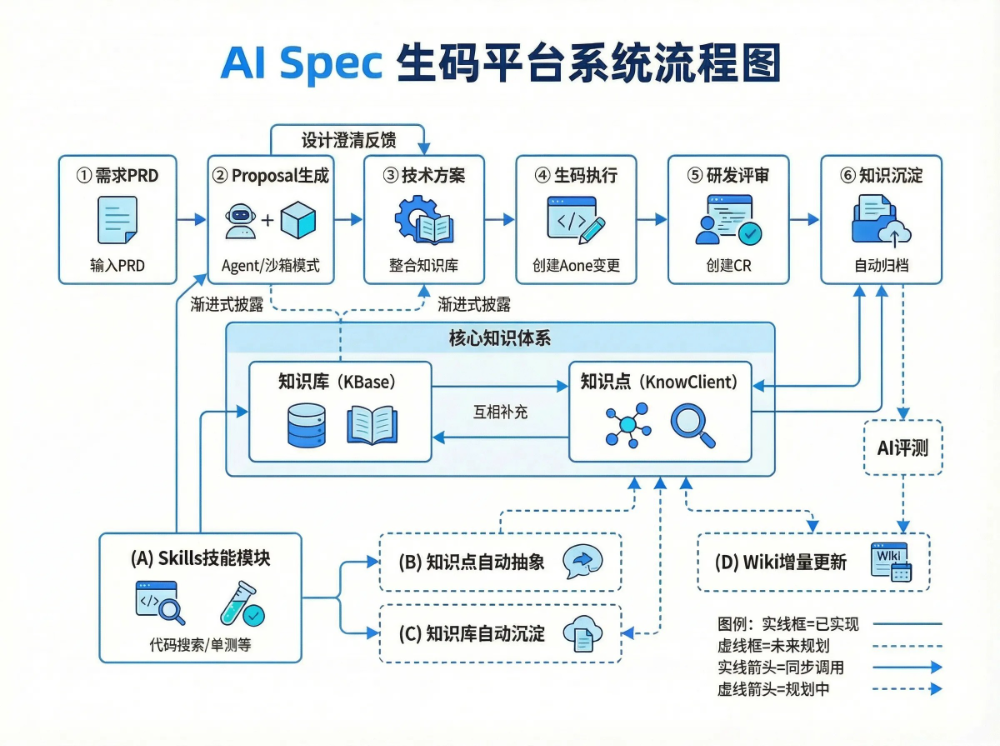

当前已实现从需求到评审的完整研发链路：需求PRD输⼊ → Proposal整合→ 技术⽅案⽣成 → ⽣码执⾏ → 研发评审 → 流⽔线集成 代码研发上线完整流程已实现，⽀撑端到端的 AI辅助研发流程。未来规划聚焦于核⼼知识体系的构建：通过 知识库与知识点的双向交互，实现研发资产的持续沉淀与复⽤。规划中的能⼒包括：

- 知识点⾃动抽象提炼研发经验
- 知识库⾃动沉淀积累领域知识
- Wiki增量更新保证⽂档即代码

结合Skills技能模块扩展代码搜索 / 单测等原⼦能⼒，最终通过第六阶段"知识沉淀"实现研发过程的⾃动归档，形成"⽣产-沉淀-复⽤"的知识⻜轮。

### Spec 平台落地过程

如何选择合适的AIAgent进⾏落地？⼯程上⾯临着效率和收益的平衡。

Java服务器上⾃建Agent框架虽然和现有技术栈⼀致，但Agent⽣态在Java侧相对薄弱。Python服务器的Agent⽣态确实更成熟，LangChain、AutoGen、CrewAI这些框架开箱即⽤的能⼒更强，但问题在于⾃建Agent的调优成本同样不低，Prompt⼯程、⼯具编排、多轮对话的状态管理都需要反复迭代。

在前⾯的AI Agent选型上，我们最终采⽤了 "SOTA模型 + Aone Agent" 双通道的⽅式进⾏代码的⽣成，AoneAgent是公司内部的编程Agent，有丰富的API⽂档⽀撑，可以快速将编码的任务落地并按要求返回的结果。但是对于SOTA模型的Agent落地来说，使用Java服务器上自建Agent框架虽然和现有技术栈一致，但Agent生态在Java侧相对薄弱，虽然可以快速落地，但是未来面临大量适配工作，交付周期不可控，Python服务器虽然初期有建设和学习成本，但生态丰富且扩展性更好，保障未来风险更加可控。

- 沙箱MVP部署

Agent⼯程落地的技术选型核⼼在于MVP的交付速度和效果确定性。

SOTA模型本身已经是⼀个经过⼤量⼯程优化的成熟Agent，具备代码检索、⽂件操作、多步推理、⾃我纠错等能⼒，Anthropic官⽅提供的SOTA模型 SDK可以直接通过 Python控制CLI执⾏任务，相当于跳过了Agent框架搭建这⼀步，直接复⽤Anthropic的⼯程成果。从MVP⻆度看，SOTA模型 Agent的路径最短、效果最确定，所以决定先⽤SOTA模型跑通场景验证价值，后续再根据实际需要决定是否⾃建或切换⽅案。

Step1：链路打通

⽤PythonSDK验证公司ideaTalk相关的ACK信息对外部商业模型的联通性

Demo

async def main(): options = ClaudeAgentOptions( system_prompt="You are an expert Python developer",permission_mode='bypassPermissions',cwd="/Users/sanglonglong/PycharmProjects/pythonProject4/claude", env={ "DISABLE_PROMPT_CACHING": "0", "ANTHROPIC_BASE_URL": "https://idealab.alibaba-inc.com/api/code", "ANTHROPIC_AUTH_TOKEN": "xxxx", "ANTHROPIC_MODEL": "claude_sonnet4_5", "ANTHROPIC_SMALL_FAST_MODEL": "claude-haiku-4_5" } ) async for message in query( prompt="现在几点了", options=options ): print(message)asyncio.run(main())结果

AssistantMessage(content=[ToolUseBlock(id='toolu_bdrk_01RTW4VmupjWgnNVAK17P3dC', name='Bash', input={'command': 'date', 'description': '获取当前系统时间'})], model='claude-sonnet-4-5-20250929', parent_tool_use_id=None, error=None)UserMessage(content=[ToolResultBlock(tool_use_id='toolu_bdrk_01RTW4VmupjWgnNVAK17P3dC', content='Sat Jan 17 15:05:00 CST 2026', is_error=False)], uuid='8a0e9ba9-c562-456b-b525-31540799a23d', parent_tool_use_id=None)AssistantMessage(content=[TextBlock(text='现在的时间是：**2026年1月17日，星期六，下午3点05分**（中国标准时间 CST）')], model='claude-sonnet-4-5-20250929', parent_tool_use_id=None, error=None)ResultMessage(subtype='success', duration_ms=9708, duration_api_ms=21371, is_error=False, num_turns=2, session_id='02b6851a-ad35-4996-bc37-0d21fa455d76', total_cost_usd=0.0790026, usage={'input_tokens': 9, 'cache_creation_input_tokens': 15257, 'cache_read_input_tokens': 15097, 'output_tokens': 175, 'server_tool_use': {'web_search_requests': 0, 'web_fetch_requests': 0}, 'service_tier': 'standard', 'cache_creation': {'ephemeral_1h_input_tokens': 0, 'ephemeral_5m_input_tokens': 15257}}, result='现在的时间是：**2026年1月17日，星期六，下午3点05分**（中国标准时间 CST）', structured_output=None)

Step2：可视化调优

使⽤⽹⻚格式化查看⼤模型返回结果，验证⼆次交互，通过构建简单的⻚⾯，通过 SOTA模型_agent_sdk封装的CLI接⼝来调⽤SOTA模型 Agent执⾏任务，验证沙箱环境各个底层⼯具的使⽤。


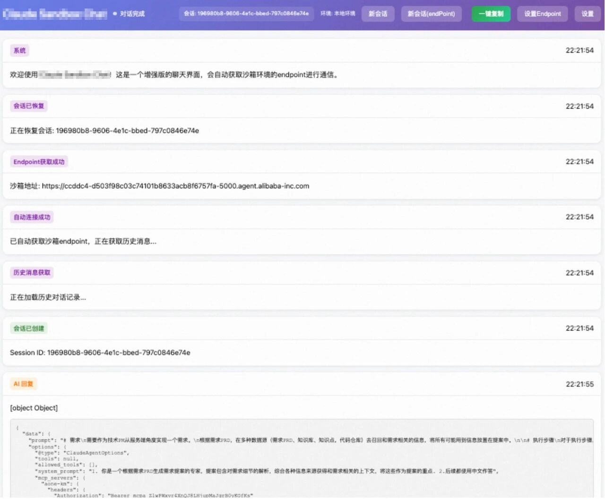

Step3：MVP实现

沙箱底层最后选了AoneSandbox承载，沙箱的使⽤需要部署python适配层以完成任务的提交和拉取仓库以及回调的操作。项⽬使⽤Sandbox承载的核⼼原因是安全隔离与⽹络互通的平衡。


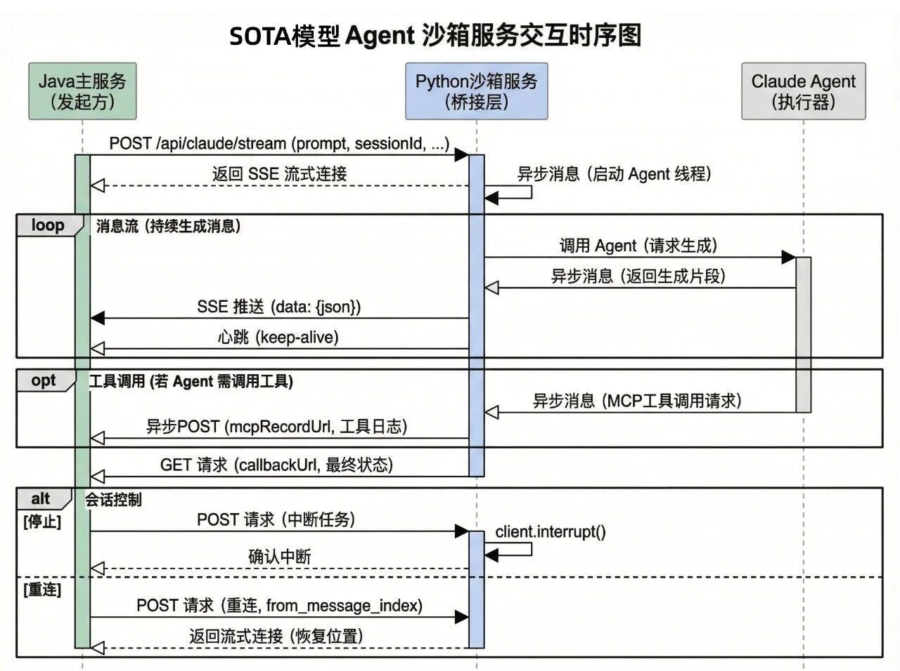

SOTA模型作为AI Agent会动态执⾏代码，这类操作存在安全⻛险，集团⽣产⽹明确禁⽌运⾏沙箱类服务。⽽项⽬的实际需求是：⼀⽅⾯需要访问公⽹调⽤API，另⼀⽅⾯⼜需要访问弹内测试⽹的代码平台（git仓库拉取、分⽀操作）和内部MCP服务（变更创建、代码评审等）。Sandbox的弹内测试⽹模式刚好满⾜这两点——既⽀持安全外联访问互联⽹，⼜与集团测试⽹互通可以访问内部产研平台。

- 领域知识构建

为了解决模型在⽣成提案时由于上下⽂不⾜导致的编程幻觉问题，我们引⼊了领域知识的概念，它当前阶段主要包含以下两个层次，知识点和知识库，知识点是⼀种细粒度、轻量化的知识单元，通常以⼀句话或简短描述的形式存在，⽤于在Agent推理过程中提供概念澄清和认知校正，知识库是组织化的知识存储体系，⽤以解决通⽤⼤模型⽆法覆盖的专有知识的召回问题，他们的主要区别和关系是：


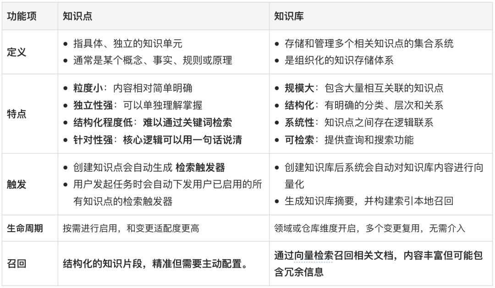

知识库双路召回

知识库的核⼼价值是将通⽤⼤模型⽆法覆盖的专有知识注⼊到Agent的推理上下⽂中。通⽤模型只知道标准的Spring Boot或MyBatis⽤法，但不知道集团内部的Pandora Boot启动流程、HSF服务调⽤⽅式这些专有技术栈，也不了解交易域的订单状态机流转规则、优惠计算的业务约束这些领域知识。

知识库的搭建我们利⽤的仓库wiki的⽣成能⼒，可以围绕某个代码仓库⾃动⽣成并持续更新的“知识底座”，依赖现有的⼤模型能⼒，我们可以将仓库源码、配置中抽取信息，把分散在代码⾥的关键知识结构化沉淀为更结构化、可检索的⽂档。对⽐常⻅⼏种wiki的⽣成⽅式：

对⽐维度

⼿⼯编写⽂档

DeepWiki⾃动⽣成

SOTA模型+subAgent

时间成本

⾼（需⼈⼯编写和维护）

低（⾃动化）

低（⾃动化）

覆盖范围

范围有限

全量覆盖

可指定覆盖核⼼⼊⼝

⼀致性

因⼈⽽异

格式统⼀

格式统⼀

可定制性

⽆

稍低

较⾼

跨仓库知识

⽀持

不⽀持

⽀持

选择 SOTA模型 + subAgent 来⽣成仓库 Wiki，核⼼原因是它在⾃动化效率和⼯程可控性之间取得了更适合研发场景的平衡：

- 相⽐⼿⼯编写，时间成本显著降低且输出格式更统⼀；
- 相⽐ DeepWiki 这类全量⾃动⽣成⽅案
- ⽀持跨仓库知识的聚合，只需要在⽂件⽬录下 clone 多个代码仓库后再进⾏仓库wiki的⽣成

当然，Agent⽣成的⽂档可能不够精准，但它提供了⼀个起点。研发⼈员可以在此基础上补充关键细节，逐步迭代完善。但是我们在实践过程中，对于知识库的RAG召回使⽤的 MCP的chunk召回能⼒。


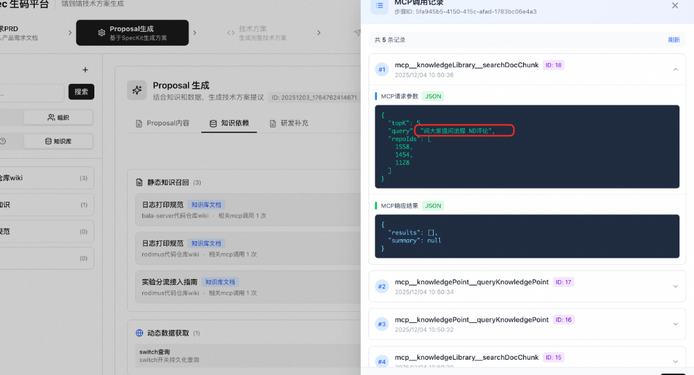

但是单纯的chunk召回有两个问题：

1. 盲检索，Agent 对知识库的内容全貌无感知，只能凭借用户模糊的自然语言 query 去碰运气匹配，召回率高度依赖 query 质量，而实际场景中 query 往往缺乏精确的领域术语，导致关键 chunk 漏召；

2. 断语义，chunk 切片天然割裂了文档的上下文连贯性，召回的片段丧失了前后因果和全局结构，Agent 拿到的是"碎片"而非"知识"，极易产生误解或幻觉。


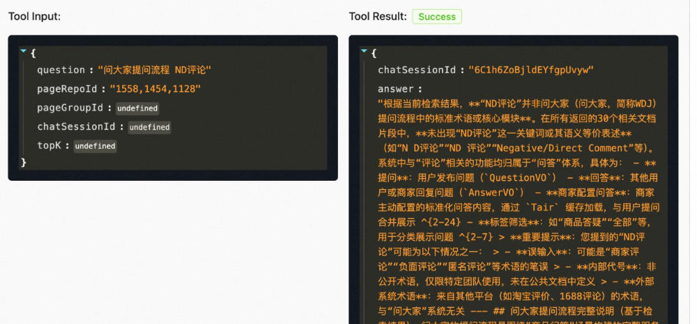

基于以上现实中遇到的问题，Spec 平台构建了两条互补的知识召回链路：⼀条偏 KBase 的语义检索服务，⼀条偏索引摘要导航与精确定位。两者组合使⽤，既保证召回覆盖⾯与效 率，也提升可控性与可追溯性。

KBase语义召回是通过向量检索找"语义相关"的内容，适合处理模糊需求场景，⽐如"商家如何表达订单⾦额及优惠"，KBase能从⼤量⽂档中召回所有提到订单、⾦额、优惠的相关⽚段，覆盖⾯⼴但可能包含噪⾳，⽽且召回结果依赖KBase内部的排序策略，平台侧不可。

索引导航式召回是"先筛⽂档、再精确搜"，Agent先看索引⽂档判断哪些库可能相关（⽐如看到"OrderPriceService处理订单⾦额"的摘要），然后下载这些⽂档到本地，⽤传统的关键词搜索到具体的类名、⽅法名，这种⽅式的优势是每⼀步都可追溯、可解释。


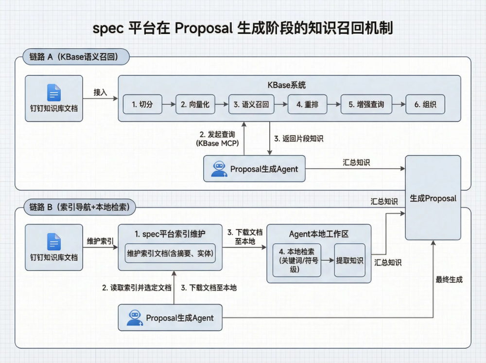

两者配合使⽤的效果是：KBase负责迅速找到候选知识⽚段提供参考思路，索引召回负责精确定位到代码⼊⼝和技术规范⽂档，前者解决"不知道该看什么"的⼴度问题，后者解 决"如何准确找到代码位置"的精度问题，双通道保证既不会漏掉关键信息，也不会因为召回太泛⽽让Agent陷⼊信息过载。

## 知识点的补充

知识点和知识库在使⽤上是互相补充的，知识点更适合处理那些"频繁被误解但难以通过向量检索准确召回"的概念澄清场景。⽐如"Aone变更和代码仓库分⽀的关系"、"Diamond配置和Tair缓存的使⽤场景区分"这类容易混淆的运维概念，写成完整⽂档放知识库可能因为周边描述性⽂字过多导致召回不精准，但⽤⼀句话的知识点形式能让Agent快速建⽴正确的认知映射，避免⽣成错误的技术⽅案。


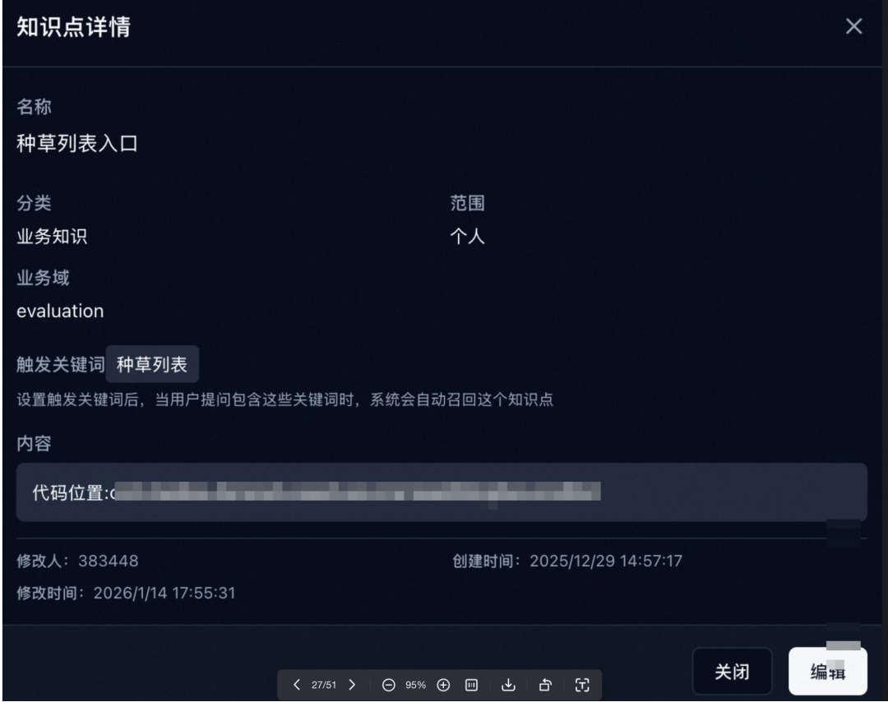

在实现机制上，我们也经历了⼀次迭代：最初的设计是将⽤户开启的所有知识点内容全量注⼊到Prompt中，让模型⾃⾏判断采⽤哪些，但随着知识点数量增⻓，⼤量内容占⽤了过多上下⽂窗⼝，反⽽导致模型出现幻觉和注意⼒分散。为了解决这个问题，我们为每个知识点增加了触发关键词字段，Agent在处理需求时会先根据关键词匹配相关知识点，匹配命中后再召回对应的内容部分，可以保证知识点的精准触发，同时避免上下⽂膨胀带来的副作用。

当你想改⼀段代码时，如何让模型理解你的描述呢 ？⽐如我对模型说要修改种草列表：如果没有任何信息补充，并且项⽬错综复杂时，很⼤概率会找错代码位置。那么后续的逻辑修改就没有意义了，为了避免这种情况，可以增加⼀条知识点，告诉模型种草列表的具体代码位置，这样模型可以快速定位到代码并且根据输⼊的prd内容做出理解，随着需求积累，这类"业务术语→代码位置"的知识点越来越多，模型对业务语义的理解会越来越精准，代码修改的准确率也会显著提升。

- 提示词优化

## 技术⽅案模版

⼀个最通⽤的Spec包含proposal.md、design.md、tasks.md，通过这三个⽂件结构化的格式强制将开发思维进⾏分离，使AI和⼈类能专注于各⾃的阶段性任务。


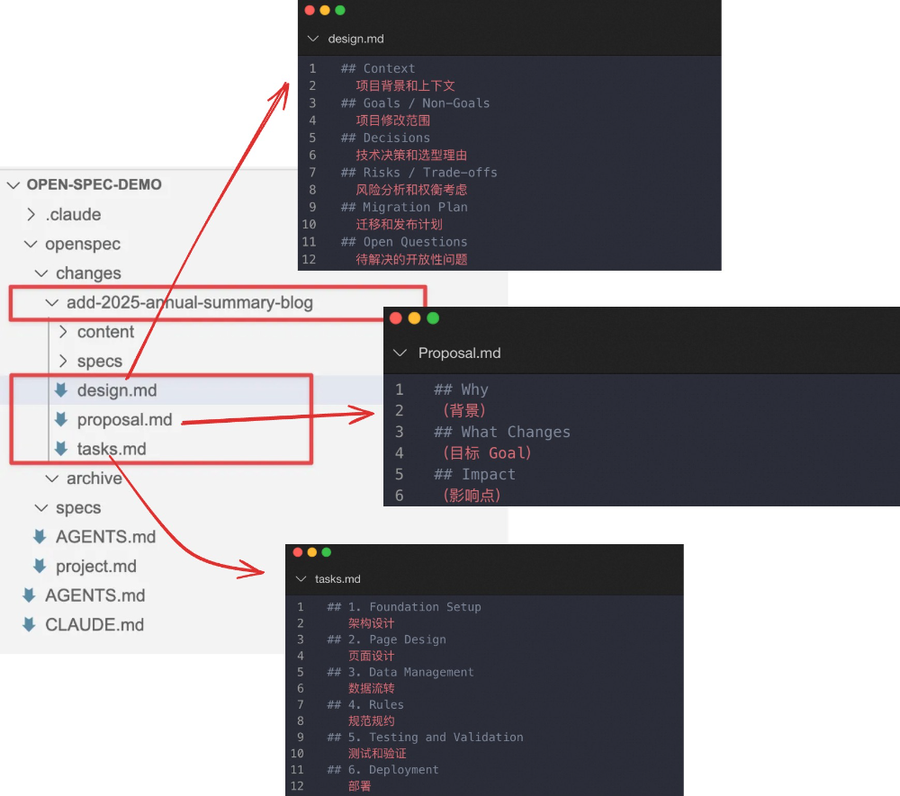

- proposal.md：定义变更的⽬的和范围（Why & What），它确保⼈类与 AI 对业务价值达成⼀致，
- design.md：定义技术设计图。描述了系统结构、关键决策以及数据模型或API接⼝的变更，
- tasks.md：详细的实施任务清单，AI 将按照这份清单，⼀步步具体地消化任务并推进实现。

在提案的实际落地的过程中，不仅要考虑背景和⽬标及影响，同时也需要针对⼯程化场景进⾏特殊的定制，如提前预置的仓库⽬录、接⼝、wiki等信息，提案⽣成的过程中都需要按需进⾏召回。Spec规约设计的核⼼就是制定⼀套可落地的技术⽅案模版，并使⽤⼯程化的⼿段进⾏组装。


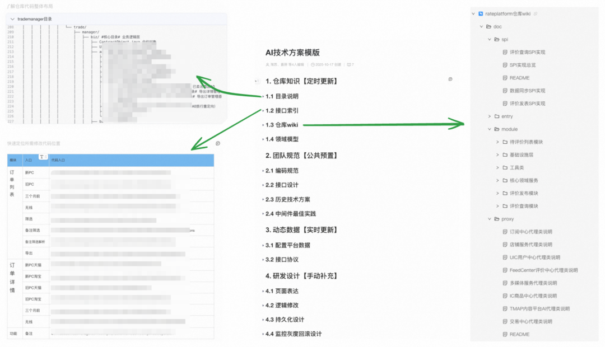

技术模版组装的过程中，我们将复杂的技术方案生成任务拆分为proposal（提案生成）和design（设计生成）两个独立任务，工程上采用两阶段流水线架构，形成上下游依赖关系。


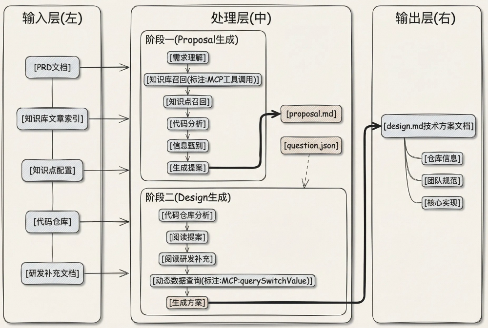

## Spec渐进式披露
由于需要召回的信息会在提案阶段不断叠加，⼯程实践的过程中，发现如果⼀次性加载全部的提示词，模型会由于提示词膨胀导致关注点不够集中，会出现忙完最后⼀步⼯作时，忘记类似提交代码的要求，往往优化提示词的同学，遇到模型指令跟随的问题都会头⽪发麻，那如何通过⼯程化的⽅法解决这⼀实际问题呢？

我们采⽤Hooks + 渐进式披露的⽅式。

Hooks 是“事件驱动”的系统事件。当 AI ⽣命周期中的某个事件（⽐如“AI 刚刚完成了⽣码的总结”）发⽣时，对应的 Hook 会⾃动被触发，执⾏你预设好的响应动作（命令⾏提交代码），能够保证关键动作⼀定被触发。和上⽂Sandbox⽣码结束后执⾏Hooks回调我们服务端的原理⼀样。


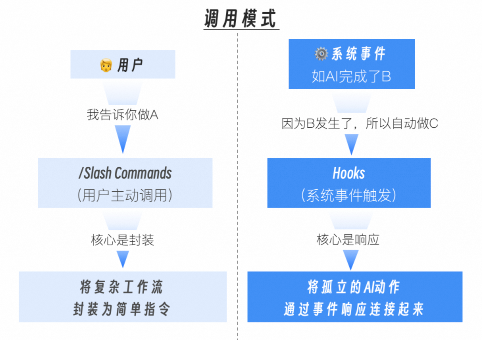

所谓的渐进式披露，是我们希望模型在每个阶段都有自己的关注点，就和浏览商品页面的懒加载效果一样，并不希望它在刚开始的时候就被过多的提示词干扰，渐进式披露有很多的实现方式，最新比较流行是是使用SOTA模型的Skills能力进行提示词的懒加载。相比原提示词方案将技术方案模内容全部堆砌在一个300多行的提示词中导致模型注意力被大量格式信息稀释、指令跟随不稳定的问题，Skills方案通过将核心指令与assets资源分离，使模型只需关注精简后的50行核心指令，模板和示例按需加载，显著提升了注意力集中度：


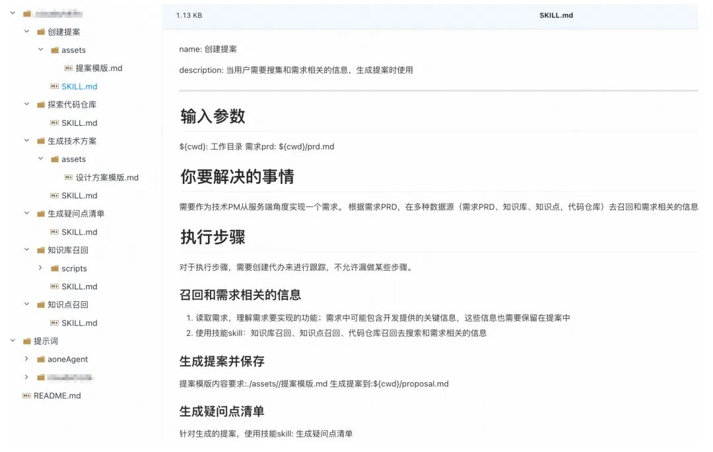

同时针对原方案中知识库召回需要分别理解文件读取、摘要匹配、MCP下载三个离散操作的编排问题，Skills将多工具组合封装为语义明确的"知识库召回"技能，模型只需理解输入输出而无需关心内部工具调用顺序和参数格式，任务理解成本随之降低，如下图所示，一次提案生成的知识召回任务中，5个Skills被渐进式披露：


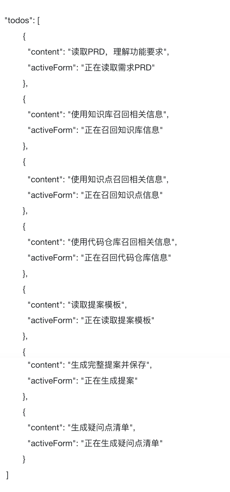


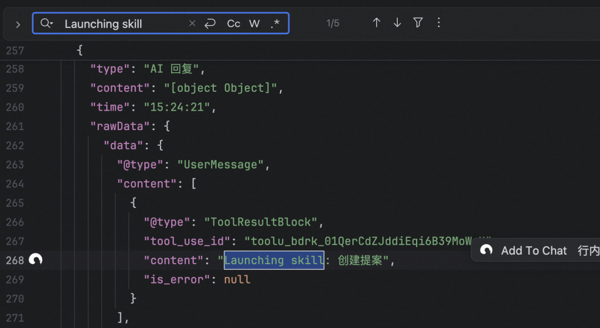


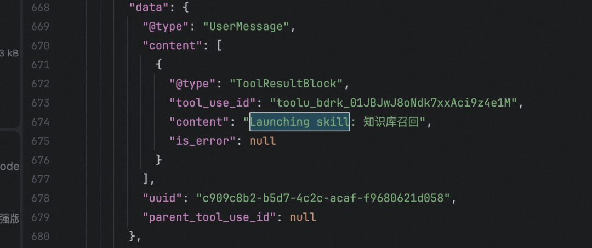


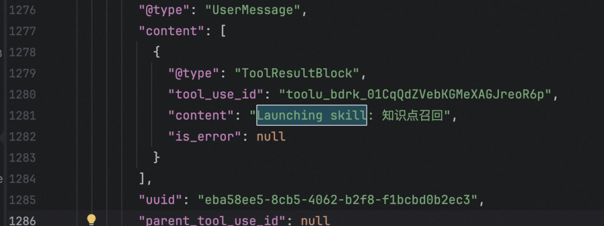


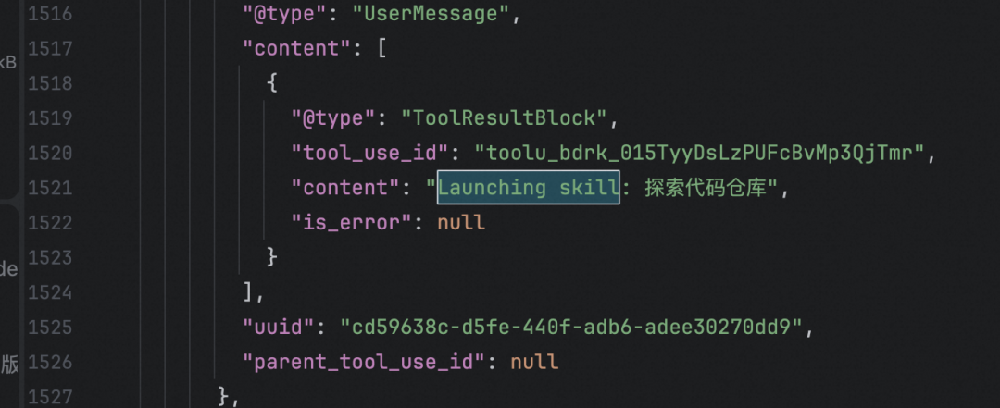


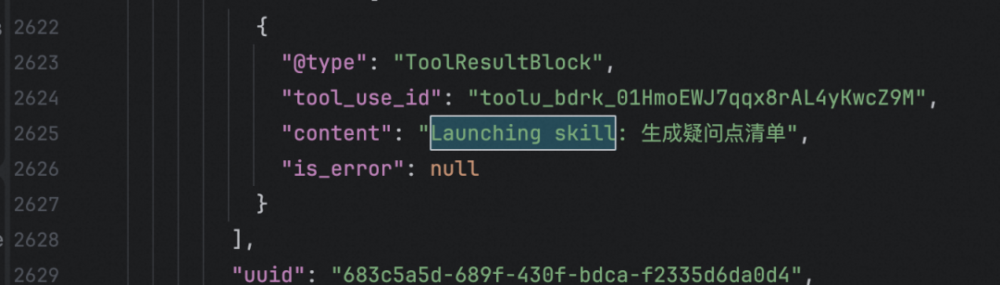

此外Skills方案还带来了可维护性和复用性的提升，模板修改无需改动核心指令，同一个skill可被proposal和design阶段共同调用，调试时也能分skill单独验证快速定位问题，整体形成了一套更符合工程化实践、更适配大模型特性的提示词组织架构。

### 疑问点设计

Spec平台采用异步任务提交模式，Agent在沙箱中独立执行无法与用户实时交互，这意味着遇到需求不明确时无法暂停等待澄清，只能基于假设继续生成，一旦假设偏离用户真实意图，整个方案需要重新生成，造成时间浪费和信任下降。疑问点机制通过在提案阶段要求Agent主动识别并输出不确定因素（如需求改动范围模糊、功能入口代码位置不明等），将原本隐藏在生成过程中的假设显性化，用户在方案生成前即可看到Agent的困惑点并补充澄清，从而将"生成后返工"前置为"生成前对齐"，在不改变异步架构的前提下实现了类交互式的需求确认效果。以下展示的是疑问点的生成过程。


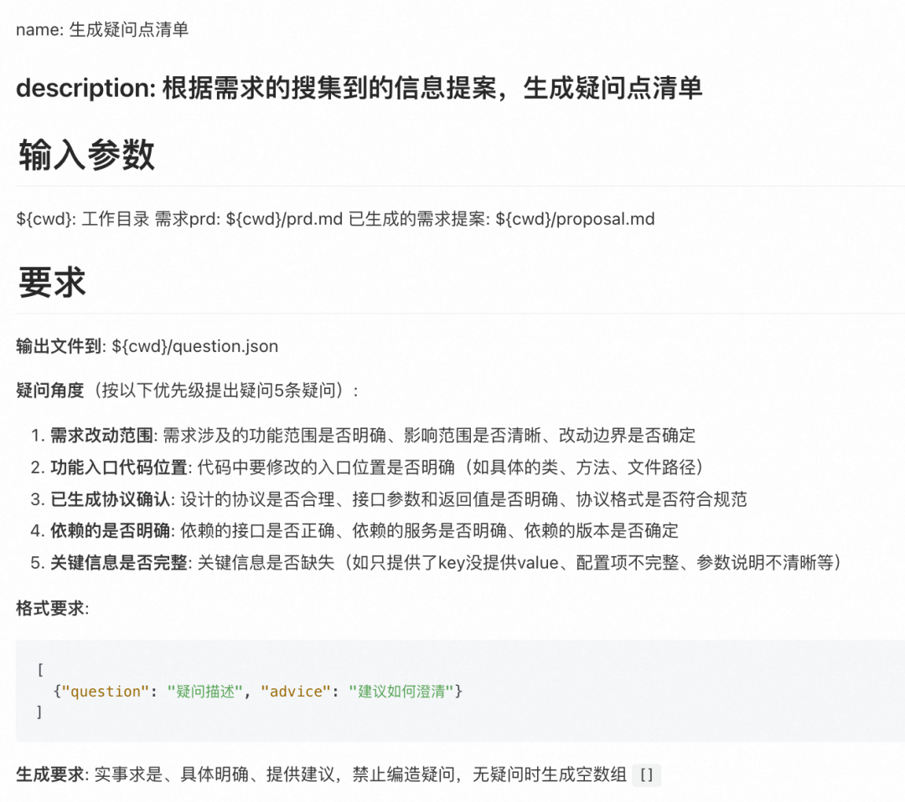

疑问点由问题描述和澄清建议两部分组成，以JSON格式输出便于系统解析和前端渲染。以下是疑问点从生成到消费的完整设计流程：


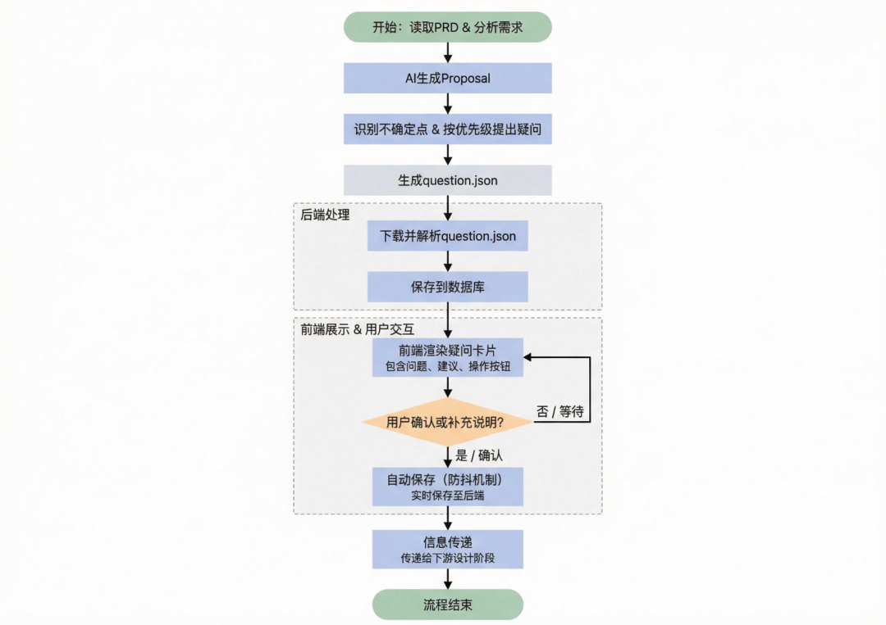

在proposal生成后疑问点展示在研发补充页面 用户可以决定对哪些疑问点进行补充，用户补充 的信息作为增强上下文，传递给后续的设计（Design）和开发（Code）阶段，在实际操作时，我们可以对疑问点进行说明或者忽略：


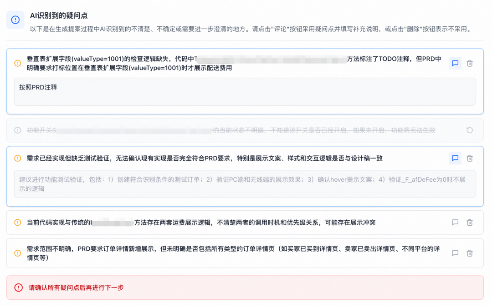

## Spec平台效果展示


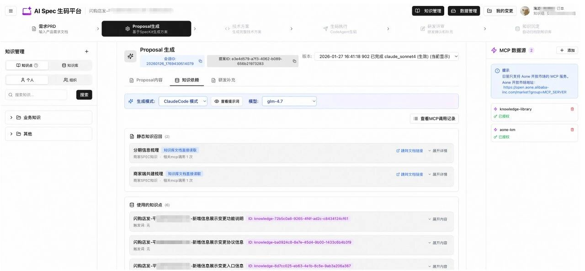

系统界面主要包含以下功能区域：

- 变更列表区：展示当前用户创建的所有变更记录，支持按状态筛选和快速定位
- PRD输入区：支持直接粘贴Markdown文本或输入钉钉文档链接，一键导入需求内容
- 提案展示区：实时显示AI生成的开发提案，包含功能拆解、技术要点和疑问列表
- 技术方案区：展示整合知识后的详细设计文档，支持在线编辑和确认
- 知识库配置区：管理已启用的知识库，配置召回策略和优先级
- 执行状态区：实时追踪生码进度，展示Aone变更链接和CR评审入口

回望摸过的石头和踩过的坑，揉着被风暴洗礼后的脑壳，在无数次设计被反复推翻重来的实践后，Spec平台终于完成了从0到1的建设。

但这只是起点——平台真正的价值在于知识的 持续迭代。


## 评测体系与效果

任何工程实践都离不开可量化的评估标准。为系统化衡量 Spec 平台的能力表现，本章从 质量、效率、使用度 三个核心维度构建评测体系，并配套标准化的数据收集模板，确保评估结果 可衡量、可归因、可优化。

## 评测目标

### 生成质量评测

我们从方案、代码两个维度评估生成内容的质量，并用F1-score【1】作为核心指标：


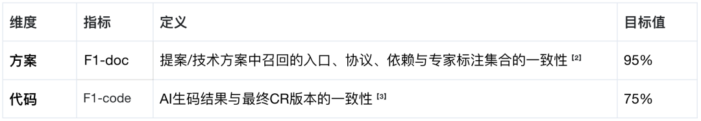

📌 当前基线（2026年1月）：F1-方案 94.44%｜F1-代码 62.66%

```python
#!/usr/bin/env python3
import os
import re
import subprocess
import sys

print("当前目录:", os.getcwd())
print("Git 根目录:", subprocess.check_output(["git", "rev-parse", "--show-toplevel"], text=True).strip())

FIRST_COMMIT = "848a9aca3a884d0968ad064f1f620aebe2cb36d2"  # AI 生成的 commit
FINAL_COMMIT = "247c73cd8fb179cbc7f0451a6ad17758fefc4076"  # 研发最后一次 commit


def run(cmd):
    result = subprocess.run(cmd, shell=True, capture_output=True)
    if result.returncode != 0:
        stderr = result.stderr.decode("utf-8", errors="ignore")
        if "not a git repository" in stderr:
            print("❌ 当前目录不是 Git 仓库，请在 rp-client 目录下运行")
            sys.exit(1)
        return result.stdout.decode("utf-8", errors="ignore")
    return result.stdout.decode("utf-8", errors="ignore")


def is_meaningful(line):
    s = line.strip()
    if not s or s.startswith(("#", "//", "/*", "*", '"""', "'''", "--")):
        return False
    if s in {"{", "}", "(", ")", ";", ","}:
        return False
    if any(s.lower().startswith(k) for k in ["import ", "from ", "package "]):
        return False
    return any(c.isalpha() for c in s)


def get_parent(commit):
    p = run(f"git log --pretty=%P -n 1 {commit}").strip()
    return p.split()[0] if p else None


def get_added_lines(a, b):
    diff = run(f"git diff --no-color {a} {b}")
    lines = set()
    file = None
    for line in diff.splitlines():
        if line.startswith("diff --git"):
            file = line.split()[-1][2:]
        elif line.startswith("+") and not line.startswith("+++"):
            content = line[1:]
            if file and file.endswith((".py", ".js", ".java", ".go", ".ts")) and is_meaningful(content):
                lines.add(re.sub(r"\s+", "", content.strip()).lower())
    return lines


# === 计算 ===
BASE = get_parent(FIRST_COMMIT)
if not BASE:
    print("❌ FIRST_COMMIT 必须有父 commit")
    sys.exit(1)

run(f"git checkout {FINAL_COMMIT}")
ai_lines = get_added_lines(BASE, FIRST_COMMIT)
final_lines = get_added_lines(BASE, FINAL_COMMIT)
retained = ai_lines & final_lines
precision = len(retained) / len(final_lines) if final_lines else 0  # 有效率
recall = len(retained) / len(ai_lines) if ai_lines else 0  # 保留率

# F1-score
if precision + recall == 0:
    f1 = 0
else:
    f1 = 2 * (precision * recall) / (precision + recall)

print("\n" + "=" * 50)
print("AI 采纳核心指标（含 F1-score）")
print("=" * 50)
print(f"有效率 (Precision) : {precision:.2%} → 最终成果中来自 AI 的比例")
print(f"保留率 (Recall) : {recall:.2%} → AI 写的被保留的比例")
print(f"F1-score : {f1:.2%} → 综合效能（调和平均）")
print("=" * 50)
```

### 研发效率评测

指标

定义

目标值

分阶段耗时

提案、技术方案、生码耗时

提案 ≤ 8 分钟; 方案 ≤ 3 分钟; 生码 ≤ 10 分钟

端到端生成时长

从提交请求到返回可用结果的总耗时

≤ 3h

研发效率提升比

(传统耗时 - 使用平台耗时) / 传统耗时 × 100%

≥ 50%

📌 当前基线（2026年1月）：提案 8 分钟｜方案 4 分钟｜生码 15 分钟｜端到端生成时长 30 分钟｜研发效率提升比 40%

### 平台易用度评测

指标名称

定义

目标值

覆盖领域数

接入平台的领域数量

交易后链路全覆盖

周活跃用户数

每周至少使用1次的独立用户数

持续增长

人均使用频次

平均每用户每周使用次数

≥ 3次

用户满意度（NPS）

定期问卷调研得分（5 分制）

≥ 4/5分

📌 当前基线（2026年1月）：覆盖领域数 2 个｜周活跃用户数 8 人 ｜人均使用频次 2 次 |用户满意度（NPS）4.5

- F1-doc计算正确召回数(TP)：4｜漏召数(FN)：0｜误召数(FP)：1，F1-doc : 4*2/4*2+0+1= 88.9%
- F1-code计算执行脚本，F1-code = 47.13%


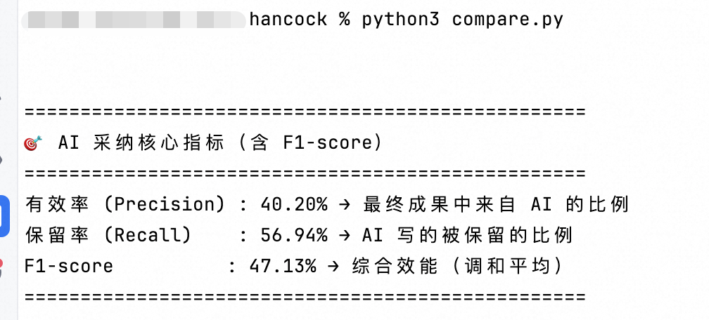

结果分析

本次生码变更中，F1-doc（88.9%）得分较高，但F1-code（47.13%）较低。F1-doc说明了关键代码（入口、协议、依赖）的正确性，F1-code低分可能是受细节影响，PRD不够清晰，或知识库不够完善，都是潜在原因。

## 评分体系优化

当前基于行级diff的F1-code评测存在局限性——它衡量的是字符级一致性而非语义正确性，研发对AI代码的等价重构、变量重命名、顺序调整都会拉低得分，这并不能真实反映AI生码的有效性。

下一阶段将引入语义级评测能力，通过AST解析提取函数签名、调用关系、控制流结构等语义特征，计算AI版本与最终版本的结构相似度，剥离格式差异对评分的干扰。同时建立意图对齐评测机制，以PRD描述的功能点为锚点，由大模型判定AI代码与最终代码是否实现了相同意图，输出逐条功能的覆盖率报告。

在自动化层面，将在CI流程中埋点识别trade spec生成的commit，CR合并时自动触发评测流水线，结果回写至平台形成任务级评测档案，支撑按领域、按复杂度、按研发的多维分析。最终目标是构建 评测-归因-优化 的闭环：每次低分case自动触发归因分析，定位问题是知识库缺失、PRD模糊还是模型理解偏差，归因结果反哺知识库补全与prompt调优，使平台能力随使用持续进化。


规划与展望

## 构建 AI-Friendly 的编程环境

当前的开发环境是为人类开发者设计的——IDE、文档、流程都假设使用者是人。但随着AI成为编程的核心参与者，我们需要思考：如何让AI更高效地工作？这就是AI-Friendly编程环境的理念。关键问题是如何创建既便于人类协作，又能被AI高效理解、分析、生成和持续演进的代码资产与系统环境。我们参考了业界AI-Friendly架构的设计理念，梳理出一套从知识沉淀、任务规划、工具辅助到执行落地的完整工作流（如下图所示），明确了平台下一阶段的能力建设方向。


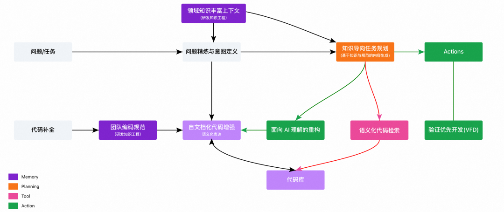

Trade Spec目前已完成知识库召回、知识点配置、疑问点机制和SOTA模型 Agent集成等核心基建，在此基础上，我们的下一阶段规划将聚焦三个方向来构建真正的AI-friendly编程环境。

第一是自文档化代码增强，参考业界契约式编程实践，通过AI辅助为交易域核心代码补充语义化命名和结构化注释（如@requires、@ensures约束声明），使代码本身成为最准确的上下文来源，从根本上提升AI生成质量——正如AutoDev所说"好的代码让AI生成更好的代码"。

第二是领域语言标准化，构建Trade Spec术语表将业务概念、代码命名、API路径三者显性映射，解决交易场景中"0秒退款"、"闪电退货"等术语理解不一致的问题，让AI与研发使用同一套领域语言。

第三是语义化代码检索升级，引入代码向量化索引和知识摘要，突破当前grep检索对意图理解的局限。

最终目标是实现从"需求输入 → 意图理解 → 知识召回 → 任务规划 → 代码生成 → 自动验证"的全链路闭环，让研发同学提交需求后，平台能产出可直接合入主干的高质量代码，完成从"人写代码"到"人机协同"的范式升级。

### 阶段性目标

阶段

时间

目标

核心交付

近期

2个月内

跑通核心闭环

提案/方案生成可用，知识库初步建立，生码准确性保证，覆盖小需求

中期

6个月内

规模化应用

覆盖主要业务及项目，评测体系成熟，覆盖中等需求

远期

未来

AI-Friendly环境

Skills集成，知识自动沉淀，挑战大型需求完成

### 长期愿景**

如果用一句话描述Spec平台的长期愿景，那就是：让每一位研发人员，都拥有一个懂业务、有经验、不断成长的AI领域专家搭档。这个搭档理解交易领域的专业知识，熟悉团队的编码规范，记得所有历史的经验教训，能在方案设计阶段就提供有价值的建议，生成的代码符合企业级标准。实现这个愿景，需要的不只是技术，更是持续的投入和迭代。但我们相信这个方向是正确的——当AI编程能力越来越强时，差异化竞争力来自于谁的知识库更丰富、谁的规范更完善、谁的反馈闭环更高效。交易Spec平台，正是在积累这些竞争力。


## 结语

从Vibe Coding到范式编程，本质上是从 让AI随意发挥 到 让AI按规范输出 的转变。Vibe Coding依赖开发者与AI的即兴互动，产出质量不稳定、难以复用；范式编程则通过知识库、知识点、编码规范等基础设施，将团队的领域经验结构化沉淀，让AI的每一次生成都站在前人积累的基础上。

打造淘系交易的AI领域专家，路径其实很清晰：先通过知识库让AI理解交易业务是什么，再通过编码规范让AI知道代码该怎么写，然后通过疑问点机制让AI学会在不确定时主动询问，最后通过反馈闭环让AI从每次生成中持续学习。这不是一蹴而就的事情，但每沉淀一条知识、每完善一项规范、每积累一次反馈，这个AI专家就会成长一点。

技术会迭代，模型会更新，但领域知识是永恒的竞争壁垒——这正是我们Spec平台培养出专属交易领域的AI专家核心的竞争力


注释

[1] ：


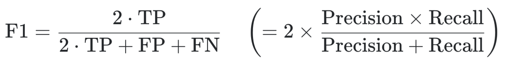

其中 TP、FP、FN 分别为正确召回、误召、漏召项数；Precision = TP/(TP+FP) 表征准确性，Recall = TP/(TP+FN) 表征完整性。

[2] ：提案/技术方案中召回的入口、协议、依赖是当前需求生码的关键信息。漏召（假阴性）可能导致模型“自由发挥”，而误召（假阳性）则可能污染生成结果。F1-doc越高，表明系统在“召全”与“召准”之间取得了更优的平衡。

[3] ：对比CR中第一次commit（AI生码结果）和最后一次commit（最终CR版本），计算生码F1-score。其中，有效率 (Precision) : 最终成果中来自 AI 的比例；保留率 (Recall) : 56.94% → AI 写的被保留的比例。


## 团队介绍

本文作者淘苏，来自淘天集团-交易业务技术团队，本团队专注于下单、支付、物流、服务、逆向退款等核心交易链路的技术团队，我们面向亿万用户致力于打造极致流畅、安全稳定的购物体验，为用户和商家的每一次交易行为保驾护航。同时我们也在持续推进交易平台架构演进，全程保障每一次大促的平稳运行，在流量洪峰的考验下确保交易链路的丝滑体验。

**¤**** 拓展阅读 ****¤**

[3DXR技术](https://mp.weixin.qq.com/mp/appmsgalbum?__biz=MzAxNDEwNjk5OQ==&action=getalbum&album_id=2565944923443904512#wechat_redirect) | [终端技术](https://mp.weixin.qq.com/mp/appmsgalbum?__biz=MzAxNDEwNjk5OQ==&action=getalbum&album_id=1533906991218294785#wechat_redirect) | [音视频技术](https://mp.weixin.qq.com/mp/appmsgalbum?__biz=MzAxNDEwNjk5OQ==&action=getalbum&album_id=1592015847500414978#wechat_redirect)

[服务端技术](https://mp.weixin.qq.com/mp/appmsgalbum?__biz=MzAxNDEwNjk5OQ==&action=getalbum&album_id=1539610690070642689#wechat_redirect) | [技术质量](https://mp.weixin.qq.com/mp/appmsgalbum?__biz=MzAxNDEwNjk5OQ==&action=getalbum&album_id=2565883875634397185#wechat_redirect) | [数据算法](https://mp.weixin.qq.com/mp/appmsgalbum?__biz=MzAxNDEwNjk5OQ==&action=getalbum&album_id=1522425612282494977#wechat_redirect)
