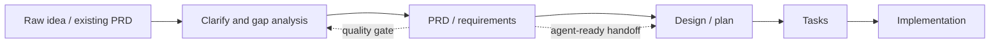

# PRD Skill 竞品分析

## Owner 结论

新增 PRD 完善输出 skill 的差异化不应是“再写一套更长的 PRD 模板”。竞品已经普遍覆盖 goals、user stories、acceptance criteria、risks、dependencies、success metrics 和 task handoff。`spec-first` 真正可赢的点是：**在没有历史需求知识库时，用 GitNexus 和 bounded source reads 抽取 current-state context，把现有代码、业务流程、页面/API/权限/状态约束变成 PRD 的证据输入**。

这也修正了一个重要判断：当前 `spec-brainstorm` 只做轻量 topic scan 和 repo orientation，不是正式的业务流程/代码现状分析输入层。它能生成 right-sized requirements，但不会系统性地产出 current system snapshot、change delta、affected surfaces、existing invariants 和端类型审查 lens。因此 PRD skill 应补的是 **Codebase -> Graph -> Spec** 之间缺失的 PRD-grade current-state layer。

首版建议做一个公开 workflow：`spec-prd`。不要拆成 `prd-create`、`prd-refine`、`prd-review`、`prd-current-state` 多个公开入口。用一个 workflow 内的三种 intent 承载：

- `create`: 从一句话或想法生成 PRD-grade requirements。
- `refine`: 完善、优化、补充已有 PRD/requirements。
- `validate`: 对已有 PRD 做 gap / ambiguity / codebase fit 检查并输出修订建议或 addendum。

这样既吸收 BMAD 的 create/update/validate 生命周期，又保持 spec-first 的 light contract 和入口清晰度。

## 范围与证据边界

本报告执行 `competitive-analysis` skill 的多品深度对比范围，分析对象是拟新增的 `spec-prd` / PRD 完善输出 skill。外部竞品资料只作为产品形态和能力趋势参考，不是 spec-first 的 source of truth。最终判断仍以 `docs/10-prompt/结构化项目角色契约.md`、当前 source workflow 和 graph evidence policy 为准。

GitNexus 当前可用于 query/context orientation，但 `.spec-first/graph/graph-facts.json` 显示 `freshness_state=dirty-advisory` 且 `impact_context=false`。因此本报告只把 GitNexus 作为能力设计依据和 session-local orientation，不声明当前仓库有新鲜 graph-backed impact evidence。

## 竞品矩阵

| 竞品 | 关键机制 | 可吸收经验 | 不应照搬 |
| --- | --- | --- | --- |
| GitHub Spec Kit | `specify -> clarify -> plan -> tasks -> implement` 链路，强调 constitution、spec、task、implementation 连续性 | PRD 不能停在文档，应明确 handoff 给 plan/tasks；clarify/analyze 是质量门，不是可选润色 | 不复制完整 command suite，不引入第二套 spec store |
| Kiro Specs | feature specs 分为 requirements/design/tasks；支持 requirements analysis 和 EARS 风格验收 | 用 acceptance examples 固化条件行为；把 ambiguity analysis 前置到 PRD 完成前 | 不把 design/tasks 合并进 PRD skill，HOW 仍归 `spec-plan` |
| BMAD Method | Analyst/PM/Architect 生命周期，PRD 有 create/update/validate，多角色协作 | `create/refine/validate` 可作为 `spec-prd` 内部 intent；PRD 可升级已有文档而非只从零生成 | 不引入重型角色状态机，不把 PM/Architect workflow 全搬进核心路径 |
| Task Master AI | 推荐从 PRD 解析任务，`parse-prd` 进入 task management | PRD 要足够 agent-ready，后续可派生 tasks；验收和依赖要稳定 | 不让 PRD skill 写 task DB 或执行任务；task 派生仍归 `spec-write-tasks` |
| Nimbalyst `/prd` | 本地 Markdown PRD，包含 goals、user stories、acceptance criteria、technical considerations、success metrics | 直接文件产物、PM 字段完整、迭代修订体验好 | 不把 technical considerations 写成 implementation plan；需要证据等级和 source reads |
| Agentman `prd-generator` | 交互问答、PRD 模板、模块 review、流程图和异常场景 | 模块化引导和“每节 review”适合 PRD 完善；异常场景表值得吸收 | 缺少 repo-aware 证据模型，不能把模板完整度当差异化 |
| ChatPRD / Productboard Spark / Aha / Beam | 从 strategy、customer feedback、personas、notes、integrations 生成 PRD/brief | 证据来源分层、customer/strategy context 和 gap analysis 是 PM 侧强项 | spec-first 没有 SaaS 产品上下文库，不能假装有客户反馈或路线图数据 |
| Keeborg | 面向 AI coding agents 的 PRD/spec suite，覆盖 edge cases、dependencies、agent workflow | AI-ready PRD 应显式写边界、edge cases、dependencies、verification | 不扩成多文档 suite，避免 PRD、spec、plan、task 多真相源 |

## 行业趋势

成熟竞品的共同方向不是“更会写文档”，而是把 PRD 变成后续 agent workflow 的稳定输入。Spec Kit、Kiro、Task Master 都把 requirements 与 plan/tasks 绑定；PM SaaS 则把 PRD 与 strategy、feedback、personas 绑定。`spec-first` 的路线应选择前者：强化工程闭环和代码现状证据，而不是追求 PM SaaS 的组织上下文整合。

## 对 spec-first 的定位判断

`spec-brainstorm` 已承担 WHAT shaping，但它不是 PRD writer 的完整替代。它的 current context scan 是轻量的：读相关 docs/solutions、相似 artifact、必要时用 GitNexus `query/context` 指向源文件，并要求重要 claim 直接读源码确认。它不会系统输出：

- 当前业务流程、页面/API/角色/权限/状态机的现状图；
- PRD 与现有系统的差异清单；
- 端类型专用审查 lens；
- 已有 PRD 的结构化 gap report；
- PRD-grade metrics、risks、dependencies、launch/rollout 和 stakeholder sections。

因此 `spec-prd` 应被定位成 “PRD-grade requirements workflow”，比 `spec-brainstorm` 更重，但仍只负责 Spec 节点，不进入 Plan/Tasks/Code。

## 可吸收能力

| 优先级 | 能力 | 来源启发 | spec-first 落地方式 |
| --- | --- | --- | --- |
| P0 | Current-state analysis | Spec Kit / Kiro 的 codebase-aware spec 趋势、本项目 GitNexus 能力 | PRD 生成前输出 `Current System Snapshot`，证据分 `confirmed source read` / `GitNexus pointer` / `assumption` |
| P0 | PRD gap / quality gate | Kiro requirements analysis、Spec Kit clarify/analyze、ChatPRD coaching | 内置 `PRD Readiness Gate`：ambiguity、testability、codebase fit、unknowns、planning invention risk |
| P0 | Existing PRD refinement | BMAD update/validate PRD，Agentman module review | 支持从已有 PRD/requirements 生成 patch-style refinement 或 addendum |
| P1 | Domain lens | App audit、PM PRD 模板和 SaaS 竞品 | 根据 `app/pc/h5/admin/backend/java/cli` 条件加载关注点，不拆公开 skill |
| P1 | Agent-ready handoff | Task Master PRD-to-task，Spec Kit tasks | PRD 输出保留 R/A/F/AE IDs、scope boundaries、acceptance examples 和 `spec_id` |
| P1 | PM fields with provenance | Nimbalyst、Beam、Aha、Productboard | goals、success metrics、risks、dependencies 有证据就写；无证据进 Open Questions |
| P2 | Competitor/research section | PRD generator、PM SaaS | 作为 opt-in section；默认不联网做市场研究，除非用户要求 |

## 关键反模式

- 不要把 `spec-prd` 做成 `spec-brainstorm` 的换名版。
- 不要为了“PRD 完整”生成无证据的 metrics、customer feedback、market data。
- 不要让 current-state analysis 反向决定产品范围；代码现状只能约束和提示，不能自动扩 scope。
- 不要把 GitNexus query 结果当 confirmed truth；写入 PRD 前必须区分 source read / pointer / assumption。
- 不要拆出多个公开 PRD skill；首版用一个 workflow 和内部 references 控制复杂度。
- 不要新建长期 PRD 状态机或需求数据库；artifact 仍应融入现有 Spec -> Plan -> Tasks 链路。

## 机会图谱

| 维度 | 通用 PRD 生成器 | Spec Kit / Kiro | spec-first `spec-prd` 机会 |
| --- | --- | --- | --- |
| 从想法到文档 | 强 | 中 | 强，但必须一次一问和 right-sized |
| 已有 PRD 完善 | 中 | 中 | 强，结合 codebase fit 和 gap pass |
| 代码/业务现状输入 | 弱 | 中 | 最强差异化，依赖 GitNexus + direct reads |
| 下游执行衔接 | 弱 | 强 | 强，沿用 `spec-plan` / task-pack / work |
| PM SaaS 上下文 | 强 | 弱 | 不做默认能力，只接收用户提供证据 |
| 端类型模板 | 中 | 弱 | 强，按工程端形态加载 lens |

## 行动建议

P0：新增 `spec-prd` workflow，首版聚焦三件事：已有 PRD refinement、一句话/想法到 PRD、current-state snapshot。输出仍落在 `docs/brainstorms/*-requirements.md`，让 `spec-plan` 能直接消费，不创建第二个 PRD 真相源。

P1：补 `references/current-state-analysis.md`、`references/domain-lenses.md`、`references/prd-template.md` 和 `references/prd-readiness-gate.md`。这些是 skill 内部 references，不是独立公开入口。

P1：更新 `using-spec-first` 路由：用户明确说 PRD、完善需求文档、已有需求补充、业务流程现状辅助需求时，优先推荐 `spec-prd`；用户只是想开放探索方向时仍走 `spec-brainstorm`。

P2：后续再考虑 deterministic helper，把文件发现、route/API inventory、test/docs candidates、GitNexus session evidence envelope 固化为脚本事实。首版可先由 LLM 使用 GitNexus 和 bounded source reads，避免过早 schema 化。

## 来源

- GitHub Spec Kit: https://github.com/github/spec-kit
- Kiro Specs: https://kiro.dev/docs/specs/
- BMAD Method docs: https://docs.bmad-method.org/reference/workflow-map/
- Task Master AI: https://github.com/eyaltoledano/claude-task-master
- Nimbalyst `/prd`: https://nimbalyst.com/skills/prd/
- Agentman `prd-generator`: https://agentman.ai/agentskills/skill/prd-generator
- ChatPRD: https://www.chatprd.ai/
- Productboard Spark: https://www.productboard.com/product/spark/
- Aha PRD AI agent: https://support.aha.io/aha-software/ai-assistant/ai-prompt-library/ai-agents/product-requirements-document~7546331120057563101
- Beam PRD Generator: https://beam.ai/skills/product-requirements-document
- Keeborg PRD Generator: https://www.keeborg.com/generate/prd
