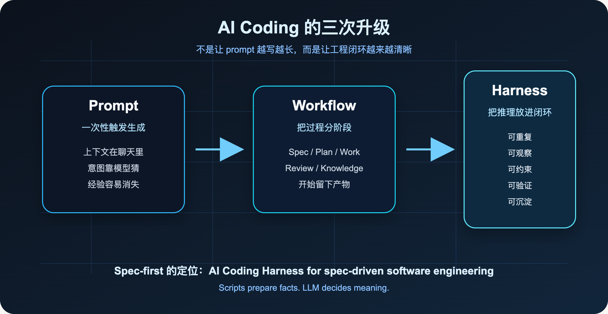
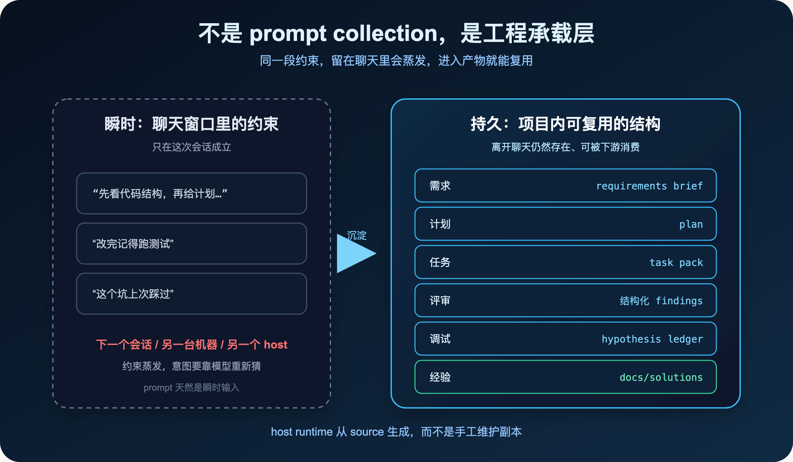
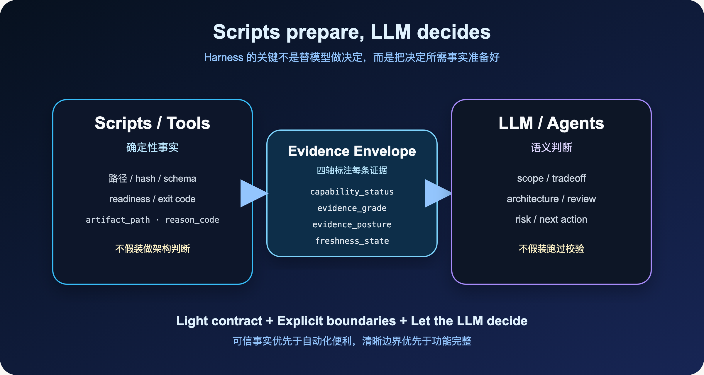
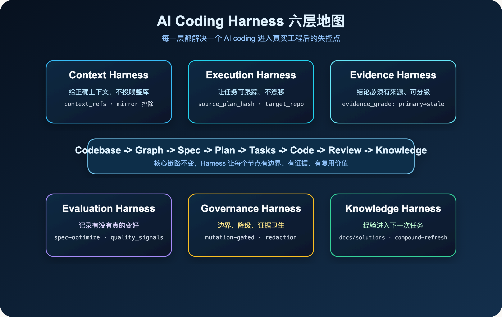
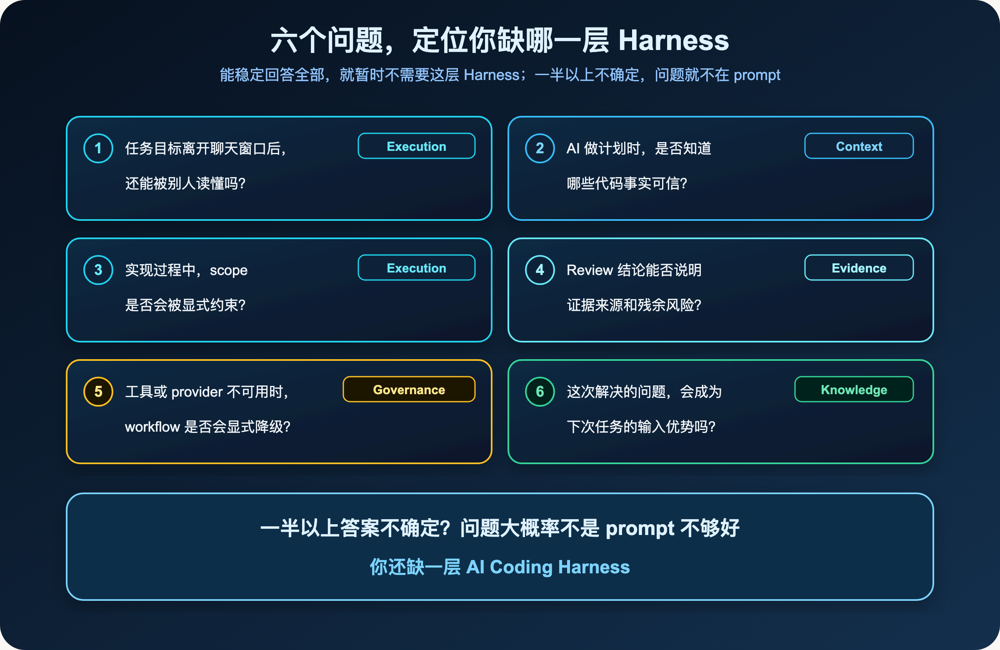

**把不稳定的 AI 推理，放进可重复、可观察、可约束、可验证的工程闭环。**

> **导读**
> 这一篇只回答一个问题：`spec-first` 到底是什么。
> 我的最新答案是：它不是 prompt pack，也不是 agent collection，而是一层面向真实软件工程的 **AI Coding Harness**。

上一篇我写的是：

> **AI Coding 不是 Prompt 问题，而是 Workflow 问题。**

这句话仍然成立。

但如果继续往工程落地看，`Workflow` 还不够完整。

Workflow 说明了“有一条流程”。真实工程里更难的事情，是让 AI 的每一次判断都发生在更稳定的条件下：上下文可信、边界清楚、执行可追踪、结论有证据、失败能降级、经验能沉淀。

这就是我现在更愿意用 **Harness** 描述 `spec-first` 的原因。

---

## 01 先给结论：Harness 是工程承载层

如果只用一句话定义：

> **AI Coding Harness 是把模型能力接入真实工程闭环的承载层。**

它不负责替模型思考，也不负责把所有步骤写死。

它负责让模型工作时具备更好的工程条件：

- 输入更可信
- 执行可追踪
- 结论有证据
- 结果可度量
- 边界可治理
- 经验能沉淀

这也是 `spec-first` 的定位升级。

它不是“再写一套 prompt”，也不是“收集更多 agent”。它要做的是把 AI coding 从一次性对话，放进一个可治理、可验证、可复用、可沉淀的工程系统里。

---

## 02 Prompt、Workflow、Harness 的边界

如果把 AI coding 的问题理解成“模型还不够聪明”，我们自然会走向两个方向：找更强模型，写更长 prompt。

这两件事当然有价值，但它们只能解决一部分问题。

一个模型再强，如果它不知道当前代码库的真实结构，它还是会猜。

一个 prompt 再长，如果里面混着过期文档、生成产物、未验证的 provider 结果，它还是会被污染。

一个 agent 再能执行，如果计划没有边界、review 没有证据、失败没有记录，它还是会把任务做成一段不可复盘的临时对话。

所以真实工程里的关键问题不是继续追问：

> 怎么让模型更会写代码？

而是追问：

> 怎么让模型的每一次判断，都在可治理的工程环境里发生？

这就是 Harness。

可以把三者的边界拆开看：

- **Prompt** 让模型知道你想要什么。
- **Workflow** 让任务有一条可跟随的路径。
- **Harness** 让模型在可验证的工程条件下完成判断和执行。

先用一张图定位这个变化：



---

## 03 Harness 到底承载什么

我对 Harness 的理解很简单：

> Harness 不是再套一层流程，也不是写一堆更复杂的 prompt。它是在 AI 和真实工程之间放一层承载结构，让模型可以在更稳定的工程条件下工作。

这层结构至少要负责六件事：

- 给 AI 正确上下文，而不是无限上下文
- 让任务执行可追踪、不漂移
- 让结论有证据来源，并能分级
- 让结果可度量，而不只是“感觉有效”
- 让边界、降级和安全可治理
- 让经验能沉淀到下一次任务里

注意这里的重点不是“替模型思考”。

`spec-first` 不想把所有判断写死，也不想让脚本模拟架构师。它想做的是把模型放到更好的工程输入、执行边界和验证环境里。

换句话说：

> Harness 的目标不是替模型思考，而是让模型在更好的工程条件下思考。

---

## 04 为什么不是 Prompt Collection

Prompt 很重要。

但 prompt 很容易变成瞬时输入。

今天你在一个会话里写了一段很好的约束：

```text
你要先看代码结构，再给计划，再改文件，最后跑测试。
```

这当然有用。

但下一次呢？下一个会话呢？另一个 teammate 的机器上呢？Claude Code 和 Codex 同时使用时呢？

如果这些约束只存在于聊天窗口里，它们很难成为工程系统的一部分。

`spec-first` 想做的事情，是把关键约束变成项目内可复用的结构。

需求进入 requirements brief，计划进入 plan，任务进入 task pack，review 形成结构化 findings，debug 留下 hypothesis ledger，经验沉淀进 `docs/solutions/`。

host runtime 也应该从 source 生成，而不是手工维护副本。

这不是 prompt 技巧。

这是工程承载层。



同一段约束，留在聊天里会随会话蒸发，进入产物就能跨会话、跨机器、跨 host 复用。

所以我现在更愿意这样定义 `spec-first`：

> **spec-first = AI Coding Harness for spec-driven software engineering**

它不是要替代模型，也不是要替工程师做所有决定。

它只是把 AI coding 从一次性对话，放进一个更可治理的工程闭环。

---

## 05 为什么不是复杂状态机

另一种误解是：既然要治理 AI，是不是应该把所有步骤都写死？

例如：

```text
第一步必须读 A
第二步必须读 B
第三步必须输出 C
第四步必须调用 D
```

我不这么看。

真实软件工程里，很多关键判断都是语义判断。

比如这次改动到底算 bug fix，还是行为变更？一个 review finding 是否真的成立？Graph 结果只是 pointer，还是已经足够影响计划？

一个旧 learning 现在还适用吗？当前任务应该继续做，还是回到 brainstorm 澄清 scope？

这些问题不适合交给脚本硬编码。

真正需要被写死的，不是判断本身，而是判断前后的边界。



### 05.1 脚本只准备可复验事实

脚本擅长做这些事情：

- 文件发现
- 路径解析
- git 状态读取
- schema 校验
- hash 计算
- readiness 检查
- runtime asset 同步
- reason code 输出
- artifact path 输出

这些事实应该可复验、可追踪、可失败。

而且它们不是抽象口号。在 `spec-first` 里，脚本会用结构化的 reason code 把“它做了什么、为什么这么做”留成可追踪的事实，比如 `generated_runtime_mirror_excluded`（这块上下文是生成镜像，已按规则排除）、`canonical_artifact_missing`（该读的产物不存在）、`context_budget_exceeded`（上下文超预算）。

脚本不应该假装自己是架构师。

### 05.2 LLM 负责语义判断

LLM 和 agent 擅长做的是另一类事情：需求理解、架构取舍、计划拆分、review 判断、风险解释、fallback 决策和下一步建议。

所以 `spec-first` 里有一个非常重要的原则：

> **Scripts prepare, LLM decides.**

脚本准备事实，LLM 做判断。

这不是一句口号。它决定了整个系统的边界。

如果反过来，让脚本模拟架构判断，系统会变成脆弱的规则引擎。

如果让 LLM 假装自己跑过确定性校验，系统会变成不可验证的幻觉。

Harness 的价值，是把这两边接起来：事实来自可复验的工具和脚本，判断来自 LLM，中间用 evidence、artifact、reason code、limitations 连接。

这一层的关键不是“自动化越多越好”，而是边界必须显式。

---

## 06 spec-first 的六层 Harness

如果把 `spec-first` 拆开看，它大致有六层。

这六层不是六个功能菜单，而是六个工程问题：输入是否可信，执行是否可追踪，结论是否有证据，结果是否真的变好，边界是否可治理，经验是否能沉淀。



### 06.1 Context Harness：上下文要正确，不要无限

AI coding 最常见的问题之一，是模型拿到的上下文不稳定。

很多人会自然想到一个解法：那就多给点上下文，把整个仓库都塞进去。

但真正重要的不是更多上下文，而是正确上下文。无限上下文里混着过期文档、生成产物和未验证的 provider 结果，模型只会被噪声拖着走。

在 `spec-first` 里，Context Harness 不是一句口号，它落在几个很具体的约束上。

第一，它区分什么该读、什么默认不该读。`docs/contracts/context-governance.md` 明确规定：普通 workflow 的上下文默认排除 `.spec-first/audits/**` 和生成镜像（`.claude/**`、`.codex/**`、`.agents/skills/**`）。这些目录是从 source 生成出来的运行时副本，把它们当 source-of-truth 去读，模型会基于一份“影子真相”做判断。只有在明确处理 setup、update、runtime drift 时才按需读取。

第二，它要求引用是“有界指针”，而不是“整仓投喂”。任务里的 `context_refs` 必须指向最小有用的那个 section、文件、测试或 contract，而不是整份 plan、整个目录。它们是 bounded reading pointers，不是 scope authority——给方向，不给越权扩张范围的借口。

第三，当上下文真的超预算时，系统不是默默截断，而是显式记录。比如 reason code `context_budget_exceeded`、`generated_runtime_mirror_excluded`，让“为什么少读了这块”变成可追踪的事实，而不是一个看不见的黑洞。

这一层解决的是：

> 给模型正确上下文，而不是无限上下文。

下一篇我会专门写这个主题：**正确上下文不是无限上下文。**

### 06.2 Execution Harness：任务执行不能漂移

很多 AI coding 的失败，不是第一步就错了，而是执行中慢慢漂移。

一开始任务说的是“修复登录错误提示”。做着做着，模型可能开始重构认证模块、改 UI 组件、顺手调整样式，最后变成另一个任务。

Execution Harness 的作用，是让任务在 plan、task、work、review 之间能稳定传递 scope、task identity、repo scope 和 handoff evidence。

它不是状态机。它不规定每个任务必须走同样路线。但它要求关键边界留下来，并且可被校验。

举一个 `spec-first` 里的具体设计：`spec-write-tasks` 把一份已经定稿的 plan 编译成 task pack 时，规定 task pack **只能重排执行切片，不能修改 scope、验收标准或 non-goals**。而且能交给 `spec-work` 执行的 task pack，必须带上 `spec_id`、可验证的 `source_plan` 和 `source_plan_hash`。

这几个字段不是形式主义。它们的作用是：当 plan 已经变了、task 却还停在旧版本时，执行环节能立刻发现“链路对不上”，而不是拿着一份过期任务静默地把代码改错。

多仓场景下还有一条更硬的边界：任何可能产生编辑、测试、changelog 或 commit 的工作，都必须先有明确的 `target_repo` 或 per-unit repo scope。scope 不清楚时，正确动作是回到 plan，而不是让模型自己“猜”该改哪个仓库。

这一层解决的是：

> 任务可以交给 AI 执行，但 scope 和 handoff 不能丢。

### 06.3 Evidence Harness：结论必须带来源

这是 AI coding 走向工程化时最重要的一层。

很多时候，AI 的回答听起来很合理。但你继续追问“这个结论从哪里来”，就会发现它只是“看起来像”。

Evidence Harness 要求结论必须带来源，而且来源本身要被分级。

在 `spec-first` 里，证据不是一个模糊词。以 plan 阶段消费图谱证据为例，它会沿四个轴去标注每一条证据：能力是否可用（`capability_status`）、证据可信到什么程度（`evidence_grade`）、用的是图谱还是直接读源码（`evidence_posture`）、事实是否还新鲜（`freshness_state`）。

其中最关键的是可信等级，它只有四个取值：

- `primary`：已确认的证据，由源码、测试、schema 或命令结果支撑
- `session-local`：只在本次会话里成立，没有被持久确认
- `advisory`：只是线索，比如 provider 给的一个 pointer
- `stale`：已经过期，不能再当真

而且系统锁死了一张“非法组合表”：比如能力 `unavailable` 却声称证据 `primary`，或者 `freshness_state=stale` 却标 `primary`，都不允许出现。这就堵住了“工具没用上，却假装拿到了确认证据”这种最常见的幻觉。

举个真实的例子。就在写这篇文章的此刻，这个仓库的 `graph-facts.json` 里 `freshness_state` 是 `dirty-advisory`——意思是工作区有未提交改动，图谱事实当前只能当参考、不能当确认证据；同时它的能力是 definitions-only，明确写着“没有 process graph、没有 impact 证据、没有关联测试”。

这意味着：GitNexus、ast-grep、MCP provider、session history 都很有价值，但它们不会自动变成真相。Provider evidence 提供线索；最终 finding、root cause、scope change 仍然要由源码、测试、日志、schema、contract 或用户确认来支撑。

这一层解决的是：

> AI 的结论必须能回答：证据从哪里来，可信到什么程度？

### 06.4 Evaluation Harness：记录是否真的变好

很多 AI 工具会告诉你用了多少次、节省了多少时间、自动生成了多少代码。

这些指标有用，但不够。它们衡量的是“用得多不多”，不是“做得好不好”。

`spec-first` 更关心后者，而且尽量让它落到可度量的信号上，而不是停留在“感觉有效”。

一个具体的载体是 `spec-optimize`：它不接受“把它优化好一点”这种模糊请求，而是要求先定义一个可度量的目标和一个度量命令，然后跑多组实验，用硬性 gate 或 LLM-as-judge 打分，保留更好的版本，向更优解收敛。没有可度量指标、没有度量手段，它会直接拒绝运行。

另一个载体是 graph-bootstrap 产出的质量信号。比如 `process_results_rate`（图谱进程结果是否充分）、`dirty_advisory_child_rate`（多仓里有多少子仓处于 dirty-advisory）、`build_target_coverage_ratio`（构建目标的图谱覆盖率）、`host_instruction_drift_rate`（宿主指令是否已经和 source 漂移）。

这些信号的用法很克制：它们是基线诊断，不是默认优化目标。举个例子，当 `host_instruction_drift_rate` 等于 1.0 时，正确动作不是急着优化 workflow，而是先 `spec-first init` 把宿主里的图谱指令刷新到与 source 一致——否则你优化的是一份已经漂移的环境。

Evaluation Harness 不只是统计使用量。它要回答的是：

> 这套 AI coding workflow，有没有真的让工程质量变好？

这件事很难。但如果不开始记录可度量信号，AI coding 就很容易永远停在“感觉有效”。

### 06.5 Governance Harness：守住 source 和 runtime 边界

这层保护的是系统长期可用。它在 demo 里不显眼，但在真实项目里非常重要。

先看 source 和 runtime 的边界。一个例子：如果 `.agents/skills/` 里的运行时副本过期了，最容易的修法是直接改它。

但这就是错的。

正确做法是回到 `skills/`、`agents/`、`templates/` 这些 source-of-truth 修源头，再通过 `spec-first init` 或生成链刷新 runtime。否则系统会开始漂移：source 说一套，runtime 跑一套，review 看另一套，下次 init 又把你的手改覆盖回去。

再看 mutation 边界。像 GitNexus 的 `rename`、`group_sync` 这类会真正改动代码或图谱的能力，在 `spec-first` 里被标成 `mutation-gated`、`requires explicit user action`，必须 preview-first——先预览、用户确认、再执行，绝不能变成 plan 或 work 里的自动步骤。如果 setup 报告 `mutation_boundary: policy-blocked`，workflow 连“要不要执行”都不会问，直接记录限制、改走只读路径。

还有证据卫生。review 预备事实里有一套 redaction 状态：`none-required`、`redacted`、`redaction-degraded`，用来标注敏感内容有没有被妥善处理。原则很简单：raw provider output、原始 diff hunk、未确认的 session-local 图谱证据，连同 secret 和 credential，都不能进入 `docs/solutions/` 这类持久产物。

Governance Harness 不是为了让流程变重。

它是为了让系统不因为一次“临时修一下”，就失去可信边界。

### 06.6 Knowledge Harness：让经验进入下一次任务

AI coding 最大的浪费之一，是每次任务都从零开始。

同一个坑，今天踩一次。下周换个会话，再踩一次。再过一周换个模型，又踩一次。如果一次 bugfix、一次 review failure、一次 release 踩坑，最后只留在聊天记录里，它就没有进入工程系统。

在 `spec-first` 里，这层经验有一个明确的归宿：`docs/solutions/`。

`spec-compound` 会在问题刚解决、上下文还新鲜时，把它写成一份带 YAML frontmatter 的结构化文档，按类别归档——比如 `workflow-issues/`、`architecture-patterns/`、`tooling-decisions/`、`developer-experience/`，文件名遵循 `[问题-slug]-[日期].md` 的模式。这样它才可被搜索、可被后续 workflow 发现。

它也不是无脑堆文档。写之前会沿五个维度（问题陈述、根因、解决方案、涉及文件、预防规则）评估和已有文档的重叠度：高度重叠就更新旧文档而不是制造重复，中度重叠才新建并标记待合并。需要时再由 `spec-compound-refresh` 用一个很窄的 scope（某个文件、某个模块、某个类别）去刷新、合并或废弃过期的 learning——它是**有选择的维护动作，不是每次都跑的默认尾巴**。

这也回答了一个常见担心：“是不是每次 workflow 都要全量读知识库？”不是。下游的 `spec-plan`、`spec-work`、`spec-code-review` 通过有界的 `context_refs` 按需引用相关 learning，而不是每次启动都把整个 `docs/solutions/` 拉进上下文。知识要可发现，但不能变成新的上下文负担。

所以 `docs/solutions/` 对我来说不是文档堆。

它是团队和 AI 共同积累出来的工程记忆。

这一层解决的是：

> 每次任务都让下一次任务更容易一点。

---

## 07 Harness 不是让人退出流程

很多人讲 AI agent，会自然走向一个方向：人越少介入越好。

我不完全认同。

在真实工程里，人不应该退出。人的角色应该变化。

以前，人的主要价值是亲手写每一行代码。现在，人的价值越来越多地体现在：定义目标，明确边界，判断 tradeoff，审查证据，接受或拒绝风险，把经验沉淀成下一次输入。

Harness 不是为了把人赶走。

Harness 是为了让人不用盯着每一行生成过程，而是可以站在更高层审查：目标对不对，输入够不够，计划稳不稳，证据可信不可信，结果能不能交付，经验有没有留下来。

写代码只是其中一环。

决定该写什么、为什么这样写、怎么证明写对了、下次怎么少踩坑，才是更大的系统问题。

---

## 08 spec-first 想成为哪一层

回到 `spec-first`。

它不是模型，不是 IDE，不是一个 agent 平台，也不是一个“万能自动开发系统”。

我现在更愿意把它放在这个位置：

```text
Codebase
  -> Graph
  -> Spec
  -> Plan
  -> Tasks
  -> Code
  -> Review
  -> Knowledge
```

`spec-first` 做的是这条链路上的 Harness。

在 Codebase 和 Graph 之间，它帮助 AI 拿到更可靠的代码事实。

在 Spec 和 Plan 之间，它把模糊意图变成可审查的工程输入。

在 Work 和 Review 之间，它让实现、验证和风险都有记录。

在 Review 和 Knowledge 之间，它把一次经验沉淀成下一次优势。

这也是为什么它要同时关心 CLI、skills、agents、contracts、generated runtime、changelog、`docs/solutions/`、graph readiness 和 review evidence。

这些东西单独看都不性感。

但合在一起，它们回答的是同一个问题：

> 怎样让 AI coding 从一次性对话，变成可治理、可验证、可复用、可沉淀的工程闭环？

这就是 AI Coding Harness。

---

## 09 一个简单自测

最后，给一个很简单的自测。

如果你现在的 AI coding 过程里，已经能稳定回答下面这些问题，那你可能暂时不需要 `spec-first` 这种 Harness：

- 当前任务的目标离开聊天窗口后，还能被别人读懂吗？
- AI 做计划时，是否知道哪些代码事实可信？
- 实现过程中，scope 是否会被显式约束？
- Review 结论是否能说明证据来源和残余风险？
- 工具或 provider 不可用时，workflow 是否会显式降级？
- 这次解决的问题，是否会成为下次任务的输入优势？

如果这些问题里，有一半以上答案是不确定的，那么问题大概率不是 prompt 不够好。

问题是：

> **你还缺一层 AI Coding Harness。**



每个问题背后，都对应着前面讲过的某一层 Harness。

这也是 `spec-first` 接下来想持续做下去的事情。

下一篇，我想写：

> **为什么你不敢把任务真正交给 AI**

你不是不想委派。

你只是不知道该如何相信它。

而 Harness 要解决的，正是这个信任问题。

---

## 10 本篇小结

如果只用一句话总结：

> **AI Coding Harness 的价值，不是让模型替你做所有决定，而是让模型的每一次决定都发生在更好的工程条件里。**

这也是我理解的 `spec-first`：

不是 prompt pack。

不是 agent collection。

不是复杂状态机。

而是一层让 AI coding 可治理、可验证、可复用、可沉淀的工程 Harness。

更具体地说，它想守住三件事：

- **输入可信**：模型看到的上下文、证据和边界尽量可靠
- **过程可查**：计划、执行、验证、review 不只留在聊天窗口
- **经验可复用**：这次解决过的问题，能降低下一次的成本

如果 Prompt 解决的是“怎么让模型听懂我”。

那 Harness 解决的是：

> **怎么让模型的判断进入真正的工程闭环。**

---

`spec-first` 是开源项目，欢迎试用、提 issue、提建议。

**GitHub：** http://github.com/sunrain520/spec-first

**官网：** http://spec-first.cn/
