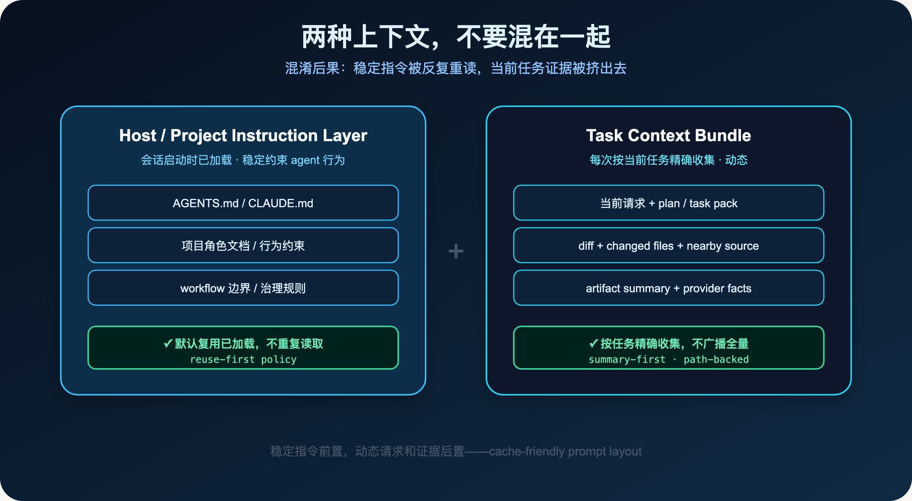
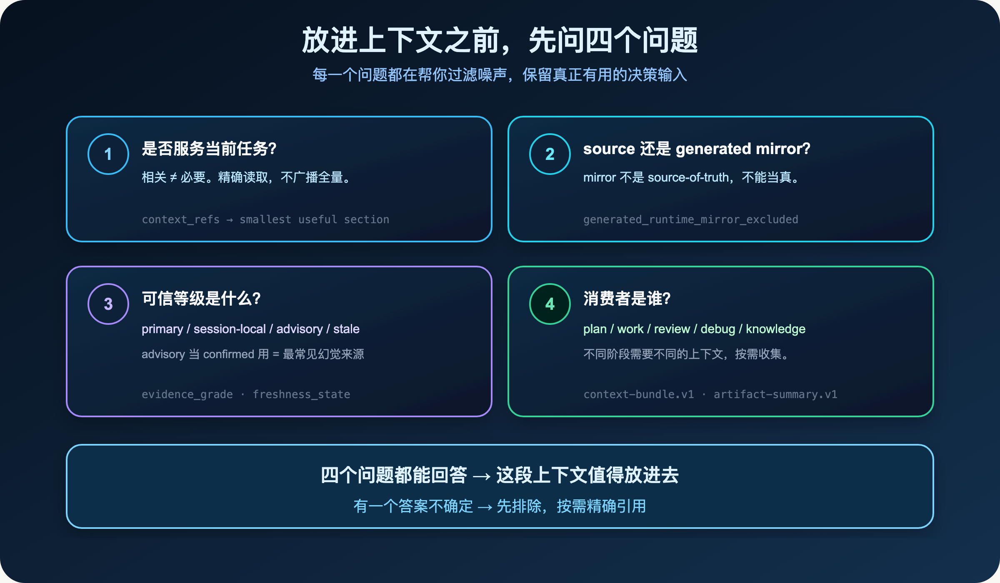

**Context engineering 的核心不是把仓库塞进窗口，而是让模型知道当前任务最该相信什么。**

> **导读**
> 这篇文章讨论一个反直觉的问题：为什么给 AI 更多上下文，有时候反而让它表现更差？
> 我的答案是：AI 需要的不是无限上下文，而是有边界、相关、可追溯的决策输入。

上一篇我们讨论了为什么开发者不敢真正委派 AI。

五个信任缺口里，第二个就是**上下文缺口**：

> 模型不知道哪些代码事实可信。

这篇专门展开这一层。

---

## 01 "多给点上下文"为什么经常适得其反

很多开发者遇到 AI 表现不稳定时，第一反应是：

> 是不是上下文给少了？

于是开始往 prompt 里塞更多东西：

- 把 `AGENTS.md`、`CLAUDE.md`、`README` 全部附上
- 把相关的历史对话记录一起发过去
- 把 provider 工具的原始输出直接粘进来
- 把整个 `docs/` 目录的内容都让 AI 先读一遍

这种做法的出发点是好的。

但它忽略了一个关键问题：

> **上下文窗口是有限的。你塞进去的每一段内容，都在和当前任务真正需要的证据竞争空间。**

当 `AGENTS.md` 占了 3000 token，历史对话占了 5000 token，provider dump 占了 2000 token，留给当前任务的 source、diff、test 的空间就被挤压了。

模型读了很多，但读的不是它最需要的。

这就是无限上下文的陷阱。

更隐蔽的问题是：当你把 `.claude/`、`.codex/`、`.agents/skills/` 这类目录也塞进去时，模型读到的是从 source 生成出来的运行时副本，而不是真正的 source-of-truth。它的判断建立在一份可能已经过期的"影子真相"上。

这时候你当然不敢委派。

因为你不知道它到底站在哪个事实上做的判断。

---

## 02 两种上下文不要混在一起

要理解 Context Harness，先要区分两种性质完全不同的上下文。

### 02.1 Host/Project Instruction Layer：稳定约束层

这是会话启动时已经加载的稳定约束层。

当你在一个项目里打开 Claude Code 或 Codex，宿主会把 `AGENTS.md`、`CLAUDE.md`、项目角色文档这类入口指令注入到当前会话。

这些内容的作用是：稳定约束 agent 的行为边界。

它们已经在了。

`spec-first` 的 `context-governance.md` 合同明确写道：

> 普通 workflow 的 context orientation 应优先使用这些已加载的 host/project instructions，而不是因为 prompt 提到 instruction files 就重新读取根 `AGENTS.md` / `CLAUDE.md`。

这条规则有一个专门的名字：**Host Instruction Reuse Policy**。

它的核心是：默认复用已加载的，只有触发明确例外时才读 source。

### 02.2 Task Context Bundle：动态精确收集层

这是围绕当前任务精确收集的动态上下文。

每次 workflow 运行时，真正需要的是：

- 当前用户请求
- 相关的 plan / task pack
- 当前 diff 和 changed files
- 附近的 source 和 test
- artifact summary 和 provider facts

这些内容每次都不一样，需要按任务精确收集。

`spec-first` 为这一层定义了一个可审查的 envelope：`context-bundle.v1`。

它的结构很简单：

```json
{
  "related_paths": [...],
  "artifact_summaries": [...],
  "evidence_paths": [...],
  "excluded_context": [
    {
      "path": ".spec-first/audits/example",
      "reason_code": "runtime_audit_artifact_excluded"
    }
  ],
  "budget_used": { "files": 3, "estimated_tokens": 0 },
  "degraded": false
}
```

注意 `excluded_context` 字段。

它不是静默截断，而是显式记录：哪些路径被排除了，为什么被排除。

这让"为什么少读了这块"变成可追踪的事实，而不是一个看不见的黑洞。

### 02.3 混淆的代价

如果把这两层混在一起，会发生什么？

每个 workflow 都重新读根 `AGENTS.md` / `CLAUDE.md`，把它们当作普通背景材料广播给 reviewer 和 worker。

`spec-first` 的 `workflow-host-instruction-reuse-policy` 这份 solution doc 里记录了这个问题的真实退化路径：

> 每个 plan/work/debug/review 都重新加载根 `AGENTS.md` / `CLAUDE.md`。
> `docs/contracts/`、角色文档和入口文件被当作普通背景材料广播给 reviewer/worker。
> workflow prompt 变成治理内容堆叠，新增规则靠复制进每个 `SKILL.md` 传播。
> source/runtime drift 问题被误判为"多读几份入口文档"即可解决。

这四条退化，每一条都在真实项目里发生过。

修复的方向不是"少读一点"，而是把两层分开：稳定指令层复用，动态任务层精确收集。



稳定指令前置，动态请求和证据后置——这是 Context Harness 的基本布局。

---

## 03 Context Harness 的四条原则

`spec-first` 的 `context-governance.md` 合同固化了四条原则。

### 03.1 先复用已加载指令，不重复读取

`spec-work` 和 `spec-plan` 的 Context Orientation Anchor 都明确写了这条规则：

```text
Orient execution from the current user request, the plan or task pack,
already-loaded host/project instructions, package manifests and command
registries, nearby implementation files, nearby tests, and git diff or
changed files when applicable.
```

注意关键词：`already-loaded host/project instructions`。

不是 `AGENTS.md`，不是 `CLAUDE.md`，而是"已加载的"。

这一个词的差别，决定了 workflow 是每次重读根文件，还是复用已有的会话上下文。

### 03.2 默认排除 generated runtime mirror

`.claude/`、`.codex/`、`.agents/skills/` 这些目录是从 source 生成出来的运行时副本。

`context-governance.md` 明确规定：

| path | reason_code | 说明 |
|---|---|---|
| `.claude/**` | `generated_runtime_mirror_excluded` | Claude generated runtime mirror |
| `.codex/**` | `generated_runtime_mirror_excluded` | Codex generated runtime mirror |
| `.agents/skills/**` | `generated_runtime_mirror_excluded` | Codex-facing generated skill mirror |
| `.spec-first/audits/**` | `runtime_audit_artifact_excluded` | 审计执行产物，体积大、可重建 |

这些路径被排除，不是因为它们没有价值，而是因为它们不是 source-of-truth。

如果模型读的是 mirror，它的判断就建立在一份可能已经过期的副本上。

正确做法是回到 `skills/`、`agents/`、`templates/`、`src/cli/` 这些 checked-in source truth。

### 03.3 对 provider facts 标注 freshness 和 limitations

GitNexus、ast-grep、MCP provider 的输出很有价值。

但它们不能自动变成真相。

`spec-first` 要求 provider facts 必须标注：

- `freshness_state`：是 fresh、stale，还是 dirty-advisory？
- `limitations`：是 definitions-only？还是有完整 process graph？
- `evidence_grade`：是 primary（已确认），还是 advisory（只是线索）？

`context-bundle.v1` 里的 `evidence_summaries` 字段专门承载这类 compact graph/session evidence refs：

```json
{
  "evidence_summaries": [
    {
      "schema_version": "gitnexus-session-evidence.v1",
      "summary_ref": "temp-artifact-or-workflow-summary",
      "reason": "bounded graph context; source reads still required"
    }
  ]
}
```

注意 `reason` 字段：`source reads still required`。

图谱证据提供线索，但最终判断仍然需要读 source。

这不是对工具的不信任，而是对证据分级的诚实。

### 03.4 超出预算时显式记录，不静默截断

当上下文真的超出预算时，正确做法不是静默截断。

而是记录 reason_code，比如 `context_budget_exceeded`，说明哪些内容被排除、为什么被排除。

`context-bundle.v1` 的 `excluded_context` 字段就是这个机制的落点：

```json
{
  "excluded_context": [
    {
      "path": ".spec-first/audits/example",
      "reason_code": "runtime_audit_artifact_excluded",
      "reason": "runtime audit artifacts are excluded from ordinary context"
    }
  ],
  "degraded": false,
  "reason_code": null
}
```

`degraded: true` 时，bundle 仍然有用，但最终判断必须说明 limitation。

这让"为什么少读了这块"变成可追踪的事实，而不是一个看不见的黑洞。

---

## 04 "正确上下文"的四个问题

在决定是否把某段内容放进上下文之前，可以问四个问题。

### 04.1 这个上下文是否服务当前任务？

不是所有相关内容都需要进入当前任务的上下文。

`docs/contracts/` 里有很多合同，但当前任务只需要其中一两个 section。

`docs/solutions/` 里有很多经验，但当前任务只需要与 changed files 相关的那几条。

`spec-first` 的 `context-bundle.v1` 里有一个字段叫 `context_refs`，它的定义是：

> bounded reading pointers，不是 scope authority。

这句话很重要。

`context_refs` 给的是方向，不是授权。

它告诉 workflow 从哪里开始读，但不允许 workflow 把整个目录都当作 scope 扩张的理由。

如果 `context_refs` 只指向整份 plan 或整个目录，`spec-work` 会把这个 handoff 标记为 low quality，并要求从 `source_unit` / `requirement_refs` 恢复更窄的锚点。

### 04.2 它是 source-of-truth，还是 generated/runtime mirror？

`skills/`、`agents/`、`templates/`、`src/cli/` 是 source。

`.claude/`、`.codex/`、`.agents/skills/` 是 generated runtime mirror。

如果模型读的是 mirror，它的判断就建立在一份可能已经过期的副本上。

一个真实的例子：如果 `.agents/skills/` 里的运行时副本过期了，最容易的修法是直接改它。

但这就是错的。

正确做法是回到 `skills/`、`agents/`、`templates/` 这些 source-of-truth 修源头，再通过 `spec-first init` 刷新 runtime。

否则系统会开始漂移：source 说一套，runtime 跑一套，review 看另一套，下次 init 又把你的手改覆盖回去。

### 04.3 它是 confirmed、session-local、advisory，还是 stale？

同一条证据，可信度差别很大：

- `primary`（confirmed）：由 source、test、schema 或命令结果支撑
- `session-local`：只在本次会话里成立，没有被持久确认
- `advisory`：只是线索，比如 provider 给的一个 pointer
- `stale`：已经过期，不能再当真

`spec-work` 的 Context Orientation Anchor 里有一条明确规定：

> For major implementation decisions, carry a lightweight decision note in the work summary or closeout: `question`, `recommended_answer`, `source_tag`, `chosen_answer`, `consequence`, and `deferred_reason` when unresolved. Use source tags such as `confirmed`, `advisory`, `session-local`, `stale`, or `user`.

这些 source tag 不是装饰。

它们是让"这个判断从哪里来"变成可追踪事实的机制。

把 advisory 当 confirmed 用，是 AI coding 里最常见的幻觉来源之一。

### 04.4 它的消费者是谁？

plan 需要的上下文，和 review 需要的上下文，不一样。

debug 需要的上下文，和 knowledge compound 需要的上下文，也不一样。

`context-request.v1` 里有一个 `stage` 字段，就是为了区分这个：

```json
{
  "schema_version": "spec-first.context-request.v1",
  "stage": "work",
  "intent": "execute_task_pack",
  "needs": ["plan_summary", "task_card", "diff", "tests"],
  "budget": {
    "max_files": 20,
    "max_tokens": 60000,
    "prefer_symbols": true,
    "allow_full_file": false
  }
}
```

`stage: work` 和 `stage: review` 的 `needs` 完全不同。

按消费者精确收集，而不是一次性全量投喂。



四个问题都能回答，这段上下文才值得放进去。

---

## 05 一个真实的对比

用一个具体例子说明两种做法的差别。

**做法 A：默认重读根指令（退化模式）**

```text
每次 spec-work 运行时：
  读 AGENTS.md（~3000 token）
  读 CLAUDE.md（~2000 token）
  读 project role docs（~1500 token）
  读 docs/contracts/ 相关合同（~4000 token）
  读 docs/solutions/ 相关经验（~2000 token）
  ——————————————————————
  已消耗：~12500 token
  剩余窗口：读当前 diff 和 source
```

**做法 B：reuse-first + 精确 source read（正确模式）**

```text
每次 spec-work 运行时：
  复用已加载 host/project instructions（0 额外 token）
  读当前 user request + plan/task summary（~500 token）
  读 changed files + nearby source/tests（~2000 token）
  读 artifact summary（~300 token）
  按需精确读取 contracts 的相关 section（~500 token）
  ——————————————————————
  已消耗：~3300 token
  剩余窗口：充足，可以读更多 source 证据
```

做法 B 把更多窗口留给了当前任务真正需要的证据。

模型读的更少，但读的更对。

`spec-work` 的 Context Orientation Anchor 里有一条专门描述这个顺序：

> Use this intake order for context economy: first read the plan/task summary and contract metadata, then deterministic inventory or validation facts, then current task/phase refs, then focused source-of-truth sections, and only then deeper references.

这个顺序不是随意的。

它把最确定、最相关的内容放在前面，把"可能需要"的内容放在后面，只有真正需要时才展开。

这就是 Context Harness 的核心：

> **不是给模型更多，而是给模型更好的决策输入。**

---

## 06 cache-friendly prompt layout

Context Harness 还有一个工程细节值得单独说：prompt 的布局。

`context-governance.md` 里有一张表：

| layer | 内容 | 规则 |
|---|---|---|
| stable instruction prefix | role contract、workflow contract summary、hard boundaries、reference index、source/runtime policy | 稳定排序、稳定措辞；不混入 git status、测试输出、MCP dump、raw log |
| dynamic suffix | 当前 user request、diff summary、changed files、tool summary、artifact summary、context bundle、temporary evidence paths | 每轮按需生成；大输出使用 summary + path |

这个布局的意义在于：

**稳定的内容放前面，变化的内容放后面。**

为什么这很重要？

因为 LLM 的 prompt cache 是按前缀匹配的。

如果你把 git status、测试输出、MCP dump 混进稳定指令层，每次运行时前缀都不一样，cache 就失效了。

把稳定指令前置、动态内容后置，可以让高频 workflow 的 prompt 前缀保持稳定，充分利用 cache，降低延迟和成本。

这不是优化技巧，而是 Context Harness 的一部分：让上下文的结构本身也变得可预测、可复用。

---

## 07 run-local context ledger

`spec-work` 里还有一个细节：run-local context ledger。

```text
Maintain a run-local context ledger for this workflow:
paths read, reason, phase, and compact summary.
Reuse loaded summaries within the same workflow run.
Re-read only when exact wording is needed, the file changed,
prior evidence is insufficient, or the user explicitly asks.
```

这个 ledger 解决的是一个很实际的问题：

同一个 workflow 里，如果多个 phase 都需要读同一份文件，应该读几次？

答案是：第一次读完之后，后续 phase 复用 compact summary，不重复读取全文。

只有四种情况才重新读：

1. 需要精确措辞（不能用 summary 代替）
2. 文件在这次 workflow 里被修改了
3. 之前的证据不够用
4. 用户明确要求重读

这个设计和 Host Instruction Reuse Policy 是同一个思路：

> **已经读过的，不重复读。需要精确证据时，按路径精确展开。**

---

## 08 Context 选择清单

在让 AI 开始工作之前，可以用这张清单检查一下上下文的质量。

### 08.1 必读（每次任务都需要）

- 当前任务目标和用户请求
- 相关的 plan / task pack summary
- 当前 diff 和 changed files
- 附近的 source 和 test

### 08.2 条件读取（按需精确引用）

- `AGENTS.md` / `CLAUDE.md` source：仅在修改、审查或诊断 instruction 时
- `docs/contracts/`：仅读取与当前任务相关的 section，不广播全量
- provider facts（GitNexus、ast-grep 等）：标注 freshness 和 limitations，不把 raw dump 塞进 prompt
- `docs/solutions/`：仅读取与 changed files 相关的 learning

### 08.3 默认不读（除非明确需要）

- `.claude/`、`.codex/`、`.agents/skills/`（generated runtime mirror）
- `.spec-first/audits/**`（runtime audit artifact）
- raw MCP dump 和完整 provider output
- 无关的历史对话和旧 audit snapshot

### 08.4 一个判断标准

如果你不确定某段内容该不该放进去，可以问一个问题：

> **如果把这段内容去掉，当前任务的判断质量会下降吗？**

如果答案是"不会"，那就不要放。

上下文的价值不在于多，而在于精准。

---

## 09 本篇小结

Context Harness 解决的不是"给多少"的问题。

它解决的是"给什么"的问题。

更多上下文不等于更好的判断。

有边界、相关、可追溯的决策输入，才能让模型在正确的事实上做判断。

`spec-first` 把这条原则落进了三个地方：

- `docs/contracts/context-governance.md`：固化 runtime exclusion policy 和 Host Instruction Reuse Policy
- `docs/contracts/context-bundle.md`：定义 `context-bundle.v1` envelope，让 included/excluded context 都有 reason_code
- 所有高频 workflow 的 Context Orientation Anchor：统一使用 `already-loaded host/project instructions`，而不是每次重读根文件

这三层加在一起，让"给模型什么上下文"从一个每次靠感觉决定的问题，变成了一个有合同、有边界、有可追踪记录的工程决策。

如果你在让 AI 工作之前，能先问一句：

> **我给的是"更多上下文"，还是"更好的决策输入"？**

那你已经在做 Context Harness 了。

下一篇，我想写：

> **别再让 AI 猜你的代码——Graph 如何改变决策输入**

代码图谱不是炫技。

它是让 AI 从"猜代码结构"变成"知道代码结构"的第一步。

---

`spec-first` 是开源项目，欢迎试用、提 issue、提建议。

**GitHub：** http://github.com/sunrain520/spec-first

**官网：** http://spec-first.cn/
