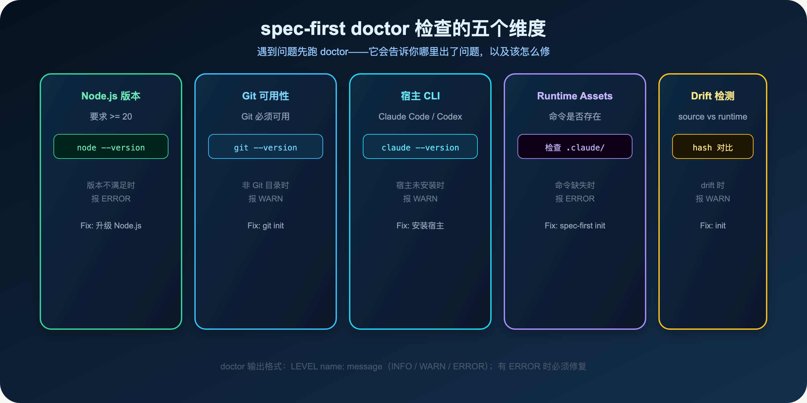
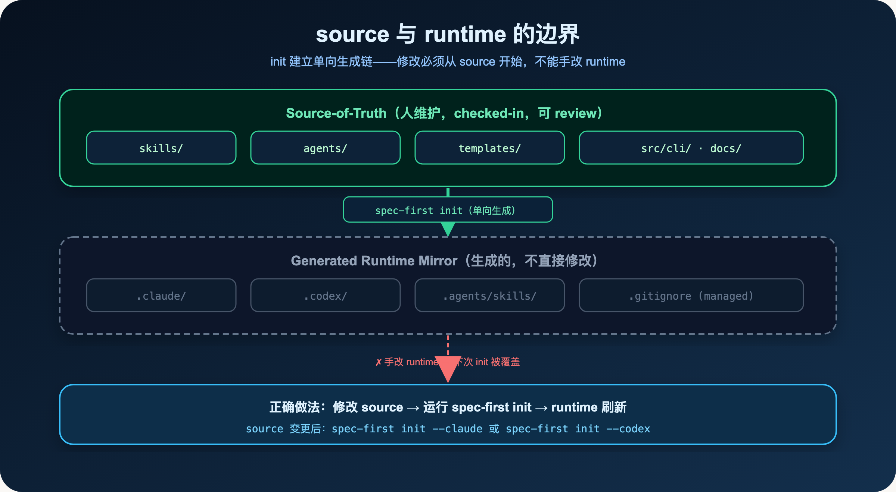
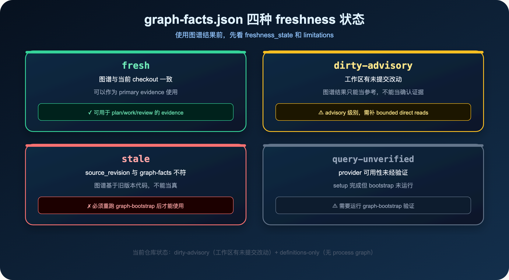
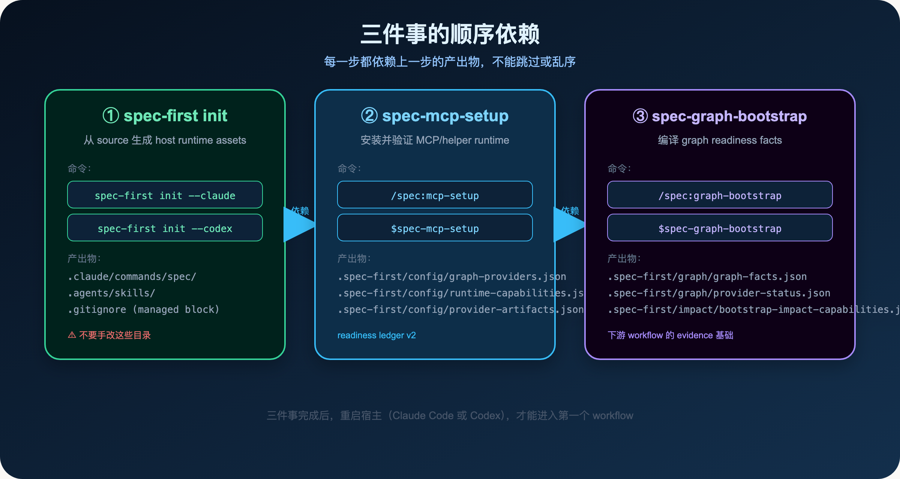
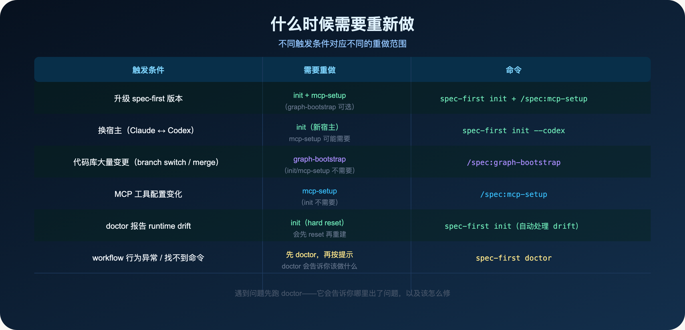
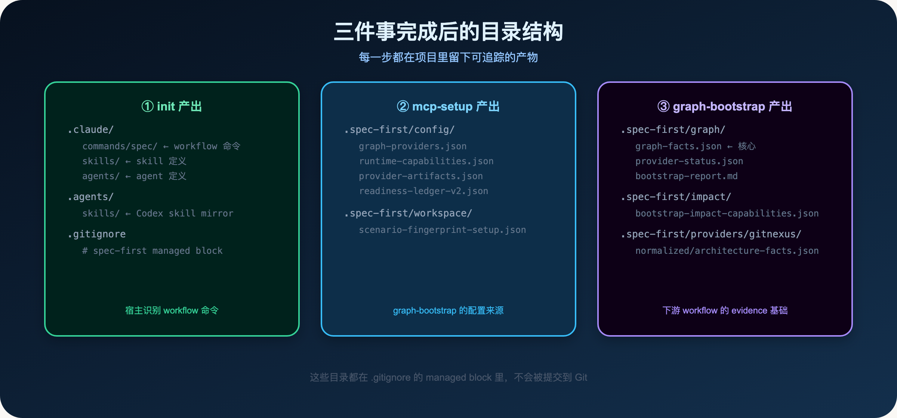

**装完就能用？三件事有顺序依赖，缺一不可。**

> **导读**
> 很多人安装完 spec-first 之后，直接打开 Claude Code 或 Codex 就开始用。
> 然后发现命令找不到、workflow 行为奇怪、AI 不知道代码库的结构。
> 这篇文章解释为什么会这样，以及正确的启动顺序是什么。

---

## 01 为什么"装完就能用"是个误解

`npm install -g spec-first` 只做了一件事：把 CLI 工具安装到你的机器上。

但 spec-first 真正工作，需要三层东西就绪：

**第一层：host runtime assets**

Claude Code 和 Codex 需要读取项目本地的 runtime assets 才能识别 spec-first 的 workflow 命令。这些 assets 不是 npm 安装时生成的，而是需要你在项目目录里运行 `spec-first init` 来生成。

**第二层：MCP/helper runtime**

spec-first 的 workflow 依赖一组 MCP servers、graph providers 和 helper tools。这些工具需要通过 `spec-mcp-setup` 安装、配置和验证，并把配置写入 `.spec-first/config/`。

**第三层：graph readiness facts**

AI 在做 plan、work、review 时，需要知道当前代码库的结构和可用的 graph 能力。这些 facts 需要通过 `spec-graph-bootstrap` 编译，写入 `.spec-first/graph/`。

三层缺一不可，而且有顺序依赖。

---

## 02 第一件事：doctor + init

### 02.1 先跑 doctor

在做任何事之前，先跑 `spec-first doctor`：

```bash
spec-first doctor
spec-first doctor --claude   # 检查 Claude Code 宿主
spec-first doctor --codex    # 检查 Codex 宿主
```

doctor 会检查五个维度：



1. **Node.js 版本**：是否满足 >= 20 的要求
2. **Git 可用性**：当前目录是否是 Git 仓库
3. **宿主 CLI**：Claude Code 或 Codex 是否已安装
4. **Runtime Assets**：宿主命令是否已生成（`.claude/commands/spec/` 等）
5. **Drift 检测**：source 和 runtime 是否一致

doctor 的输出格式是 `LEVEL name: message`，level 有三种：

- `INFO`：信息，不需要处理
- `WARN`：建议修复，不修复也能运行
- `ERROR`：必须修复，否则 workflow 无法正常工作

如果有 `ERROR`，按提示修复后再继续。doctor 会给出具体的 `Fix:` 建议。

### 02.2 运行 init

```bash
# Claude Code 项目
spec-first init --claude -u <name> --lang zh

# Codex 项目
spec-first init --codex -u <name> --lang zh

# 同时支持两个宿主
spec-first init --claude -u <name> --lang zh
spec-first init --codex -u <name> --lang zh
```

init 做的事情是：**从 source 生成 host runtime assets**。

它会把 `skills/`、`agents/`、`templates/` 里的 source 文件，按照宿主的格式生成到对应的 runtime 目录：

- Claude Code：`.claude/commands/spec/`、`.claude/skills/`、`.claude/agents/`
- Codex：`.agents/skills/`、`.codex/agents/`

同时，它会在 `.gitignore` 里添加一个 managed block，把这些 runtime 目录排除在 Git 之外。

**init 完成后，必须重启宿主（Claude Code 或 Codex）。** 宿主在启动时读取 runtime assets，不重启就看不到新生成的命令。

### 02.3 source 与 runtime 的边界

这里有一个非常重要的原则：

> **不要手改 `.claude/`、`.codex/`、`.agents/skills/` 里的文件。**



这些目录是从 source 生成出来的 runtime mirror。

如果你直接修改它们，下次运行 `spec-first init` 时，你的修改会被覆盖。

正确做法是：修改 `skills/`、`agents/`、`templates/` 里的 source 文件，然后重新运行 `spec-first init`。

这就是 spec-first 的单向生成链：source → runtime，不能反向。

### 02.4 什么是 runtime drift

如果 source 和 runtime 不一致，就叫 runtime drift。

常见的 drift 场景：

- 升级了 spec-first 版本，但没有重新 init
- 手改了 runtime 目录里的文件
- 切换了 Git 分支，source 变了但 runtime 没有更新

doctor 会检测 drift，并提示你运行 init 修复。

init 在检测到 drift 时，会先执行一次 managed hard reset（清除旧的 runtime），再重新生成。这是唯一支持的升级路径。

---

## 03 第二件事：mcp-setup

init 完成后，在宿主里运行 mcp-setup：

```text
/spec:mcp-setup      # Claude Code
$spec-mcp-setup      # Codex
```

### 03.1 mcp-setup 做什么

mcp-setup 是 spec-first 的单一 setup 入口。它有两个层次：

**Project Preflight / Local Setup：**
- 检查 required developer helpers（Node.js、Git、宿主 CLI）
- 引导 project-local config bootstrap
- 处理 legacy Compound Engineering 残留

**Required Harness Runtime：**
- 安装并验证 required MCP servers
- 配置 required graph providers（GitNexus 等）
- 验证 required baseline helper tools
- 写入 readiness ledger v2

### 03.2 mcp-setup 的产出物

mcp-setup 把配置写入 `.spec-first/config/`：

```
.spec-first/config/
  graph-providers.json       # graph provider 配置（GitNexus 等）
  runtime-capabilities.json  # host 能力和 fallback 配置
  provider-artifacts.json    # provider artifact path contract
```

这些配置文件是 `spec-graph-bootstrap` 的输入。没有这些文件，graph-bootstrap 不知道该连接哪个 provider、用什么配置。

**重要：** mcp-setup 不运行 graph bootstrap，也不写 `.spec-first/graph/*` 里的 canonical graph facts。它只负责配置，不负责编译 graph。

mcp-setup 还会写入 readiness ledger v2，记录每个 required component 的状态：

```
.spec-first/config/
  readiness-ledger-v2.json   # 各组件就绪状态
```

下游 workflow 读取这个 ledger，知道当前环境的能力边界。

### 03.3 mcp-setup 的 baseline_ready

mcp-setup 完成后，会输出一个 `baseline_ready` 状态。

`baseline_ready: true` 意味着所有 required MCP servers 和 helper tools 都已就绪，可以进入 graph bootstrap。

如果 `baseline_ready: false`，说明有必须修复的问题，需要按提示处理后重新运行。

### 03.4 mcp-setup 和 init 的分工

这里有一个容易混淆的地方：

- `spec-first init`：生成 host runtime assets（`.claude/`、`.agents/skills/` 等），让宿主识别 workflow 命令
- `spec-mcp-setup`：安装并验证 MCP/helper runtime，写入 provider 配置（`.spec-first/config/`）

两者的职责完全不同。init 是 CLI 命令，在终端里运行；mcp-setup 是 workflow，在宿主里运行。

**init 不会写 `.spec-first/config/`，mcp-setup 不会写 `.claude/` 或 `.agents/skills/`。**

### 03.5 provider 配置失败怎么办

mcp-setup 在配置 graph provider（如 GitNexus）时，可能会遇到：

- provider 未安装：按提示安装对应的 provider
- provider 配置不正确：检查 provider 的 API key 或连接配置
- provider 可用但 query 失败：可能是 provider 版本不兼容，按提示升级

mcp-setup 会把 provider 的可用性写入 readiness ledger。即使 provider 不可用，mcp-setup 也会完成，只是 `baseline_ready` 可能是 `false`，或者 graph bootstrap 后 `freshness_state` 会是 `query-unverified`。

**重要：** mcp-setup 不运行 GitNexus analyze/status/query/build/index refresh，也不运行 provider repair。这些操作属于 graph-bootstrap 的职责。

---

## 04 第三件事：graph-bootstrap

mcp-setup 完成后，运行 graph-bootstrap：

```text
/spec:graph-bootstrap      # Claude Code
$spec-graph-bootstrap      # Codex
```

### 04.1 graph-bootstrap 产出什么

graph-bootstrap 不是生成"代码地图"，而是编译一组 **readiness facts**：

```
.spec-first/graph/
  graph-facts.json                    # canonical graph facts
  provider-status.json                # 所有 provider 的聚合状态
  bootstrap-report.md                 # human-readable 报告

.spec-first/providers/gitnexus/
  normalized/architecture-facts.json  # 规范化架构事实
  normalized/reuse-candidates.json    # 规范化复用候选

.spec-first/impact/
  bootstrap-impact-capabilities.json  # impact capability envelope
```

这些 facts 告诉下游 workflow：当前图谱能用到什么程度，哪些能力可用，哪些不可用。

### 04.2 graph-facts.json 的关键字段

`graph-facts.json` 是下游 workflow 最常读取的文件。它的关键字段：

```json
{
  "freshness_state": "dirty-advisory",
  "limitations": [
    "Definitions-only GitNexus evidence: supports query/context/architecture
     orientation only; no process graph or GitNexus impact/review evidence."
  ],
  "capabilities": {
    "query_global_graph": true,
    "impact_context": false,
    "impact_context_limitations": [
      "definitions_only_no_process_graph",
      "definitions_only_no_impact_evidence",
      "definitions_only_no_related_tests"
    ]
  },
  "confidence": "high"
}
```

这是这个仓库此刻的真实状态：`dirty-advisory`（工作区有未提交改动）+ `definitions-only`（只有 symbol/file 定位，没有 process graph）。

### 04.3 四种 freshness 状态



**`fresh`**：图谱与当前 checkout 一致，可以作为 primary evidence 使用。

**`dirty-advisory`**：工作区有未提交改动，图谱结果只能当参考（advisory），不能当确认证据。需要补 bounded direct repo reads。

**`stale`**：`source_revision` 与 graph-facts 记录不符，图谱基于旧版本代码。必须重跑 graph-bootstrap 后才能使用。

**`query-unverified`**：setup 完成但 bootstrap 未运行，provider 可用性未经验证。需要运行 graph-bootstrap 验证。

### 04.4 definitions-only 是什么意思

`definitions-only` 是 graph 能力的一种限制状态。

它意味着：图谱只支持 symbol/file 定位（query/context/architecture orientation），但没有 process graph，所以无法提供：

- 影响面分析（impact）
- 相关测试（related tests）
- 执行流程（process graph）

当 `limitations` 里出现 `definitions_only_no_process_graph` 时，下游 workflow 会自动降级：

- 可以用图谱做 symbol 定位和文件关系查询
- 不能用图谱做影响面分析，需要直接读源码

这不是图谱坏了，而是图谱在诚实地说明自己的能力边界。

### 04.5 图谱不可用时如何降级

当 graph facts unavailable、stale 或 degraded 时，下游 workflow 不会静默失败，而是明确降级：

- 说明当前 graph 状态和限制
- 回退到 bounded direct repo reads（直接读源码）
- 在 plan/work/review 的输出里标注 evidence 来源和可信度

这就是 Evidence Harness 的核心：不假装拿到了确认证据，而是如实标注证据的可信等级。

### 04.6 下游 workflow 如何消费 graph facts

graph-bootstrap 产出的 facts 被不同的 workflow 以不同方式消费：

| Workflow | 读取方式 |
|---|---|
| `spec-plan` | 读取 `graph-facts.json` 和 `bootstrap-impact-capabilities.json`，用于文件边界、影响面和上下文选择 |
| `spec-work` | Graph facts 可作为 orientation evidence；stale/degraded 时必须补 bounded direct repo reads |
| `spec-code-review` | 使用 provider status、impact capabilities 和 direct diff 证据辅助 reviewer dispatch 与 findings 校准 |

**关键原则：** 下游 workflow 只应依赖 canonical artifacts（`graph-facts.json`、`provider-status.json`、`bootstrap-impact-capabilities.json`）。Provider 自己可能在 `.gitnexus/` 或其他目录写本地缓存，这些不是 spec-first 的下游契约。

### 04.7 graph-bootstrap 的执行逻辑

graph-bootstrap 的执行逻辑是：

```
读取 .spec-first/config/graph-providers.json
  ↓
检查 provider 是否 configured / reachable / fresh
  ↓
  ├── provider 不可用 → 写入 degraded status，说明后续必须 bounded direct reads
  └── provider 可用 → 运行 provider analyze/build/status/query probe
                        ↓
                      写入 .spec-first/providers/* 和 .spec-first/graph/*
                        ↓
                      编译 .spec-first/impact/* capability envelope
```

注意：graph-bootstrap 不运行 GitNexus `rename`、`group_sync`、provider repair 等 mutation 操作。这些属于 mutation-gated maintenance，需要用户显式确认。

---

## 05 三件事的顺序依赖



三件事必须按顺序执行：

```
spec-first init
  ↓（生成 runtime assets，宿主才能识别 workflow 命令）
spec-mcp-setup
  ↓（写入 .spec-first/config/，graph-bootstrap 才有配置可读）
spec-graph-bootstrap
  ↓（写入 .spec-first/graph/，下游 workflow 才有 evidence 可用）
```

**为什么不能乱序？**

- 如果先跑 mcp-setup 再跑 init：mcp-setup 在宿主里运行，但宿主还没有 runtime assets，找不到 `/spec:mcp-setup` 命令
- 如果先跑 graph-bootstrap 再跑 mcp-setup：graph-bootstrap 读取 `.spec-first/config/graph-providers.json`，但这个文件还没有被 mcp-setup 写入

**多仓工作区的顺序：**

```bash
# 先在父 workspace 批量初始化所有 child repos
spec-first init --all-repos --claude

# 再批量运行 mcp-setup
/spec:mcp-setup --all-repos

# 再批量运行 graph-bootstrap
/spec:graph-bootstrap --all-repos
```

---

## 06 什么时候需要重新做

三件事不是只做一次就永久有效的。



**升级 spec-first 版本后：** 重新运行 init + mcp-setup。新版本可能有新的 runtime assets 或新的 MCP 配置。

**换宿主（Claude Code ↔ Codex）：** 重新运行对应宿主的 init。两个宿主的 runtime 目录不同，需要分别初始化。

**代码库大量变更（branch switch / merge / rebase）：** 重新运行 graph-bootstrap。代码变了，图谱需要重新编译。

**MCP 工具配置变化：** 重新运行 mcp-setup。provider 配置变了，需要重新验证。

**doctor 报告 runtime drift：** 重新运行 init。init 会自动处理 drift，先 reset 再重建。

**workflow 行为异常 / 找不到命令：** 先跑 doctor，再按提示处理。doctor 会告诉你哪里出了问题。

---

## 07 一个完整的初始化流程

把三件事串起来，完整的初始化流程是：

```bash
# 1. 安装 CLI
npm install -g spec-first

# 2. 检查环境
spec-first doctor

# 3. 在项目目录里初始化（选择你的宿主）
cd /path/to/your-project
spec-first init --claude -u leokuang --lang zh
# 或
spec-first init --codex -u leokuang --lang zh

# 4. 重启宿主（Claude Code 或 Codex）
# 这一步必须手动完成

# 5. 在宿主里运行 mcp-setup
# Claude Code: /spec:mcp-setup
# Codex: $spec-mcp-setup

# 6. 在宿主里运行 graph-bootstrap
# Claude Code: /spec:graph-bootstrap
# Codex: $spec-graph-bootstrap

# 7. 检查 graph-facts.json 确认就绪
cat .spec-first/graph/graph-facts.json | grep freshness_state
```

如果 `freshness_state` 是 `fresh`，说明三件事都完成了，可以开始第一个 workflow。

三件事完成后，项目目录里会有这些文件：



这些目录都在 `.gitignore` 的 managed block 里，不会被提交到 Git。它们是 runtime 产物，不是 source。

---

## 08 常见问题

### 08.1 找不到 `/spec:brainstorm` 命令

**原因：** init 没有运行，或者运行后没有重启宿主。

**修复：** 运行 `spec-first init --claude`，然后重启 Claude Code。

### 08.2 mcp-setup 报 provider 配置失败

**原因：** GitNexus 或其他 graph provider 没有安装，或者配置不正确。

**修复：** 按 mcp-setup 的提示安装对应的 provider，然后重新运行 mcp-setup。

### 08.3 graph-bootstrap 后 freshness_state 是 dirty-advisory

**原因：** 工作区有未提交的改动。这是正常状态，不是错误。

**含义：** 图谱结果只能当参考（advisory），不能当确认证据。下游 workflow 会自动降级。

**如果需要 fresh 状态：** 提交或 stash 当前改动，然后重新运行 graph-bootstrap。

### 08.4 doctor 报告 legacy managed state

**原因：** 旧版本的 spec-first 留下了不兼容的 runtime state。

**修复：** 直接重新运行 init，它会先执行 managed hard reset，再重建 runtime。这是唯一支持的升级路径。

---

## 09 本篇小结

三件事，三个层次，一个顺序：

1. **`spec-first init`**：从 source 生成 host runtime assets，让宿主识别 workflow 命令
2. **`spec-mcp-setup`**：安装并验证 MCP/helper runtime，写入 provider 配置
3. **`spec-graph-bootstrap`**：编译 graph readiness facts，让 AI 知道代码库的结构和能力边界

三件事有顺序依赖，缺一不可。

遇到问题，先跑 `spec-first doctor`——它会告诉你哪里出了问题，以及该怎么修。

下一篇：

> **Spec-First：为什么你的需求说清楚了，AI 还是做错了**

需求收敛是 AI coding 里最容易被忽视的一步。brainstorm 不是头脑风暴，而是把模糊意图变成可审查的工程边界。

---

`spec-first` 是开源项目，欢迎试用、提 issue、提建议。

**GitHub：** http://github.com/sunrain520/spec-first

**官网：** http://spec-first.cn/
