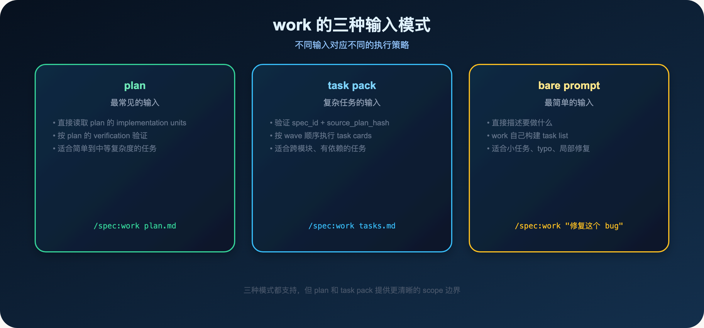
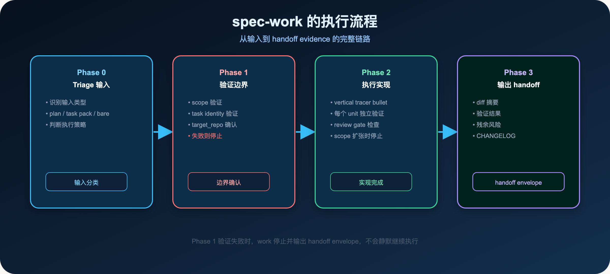
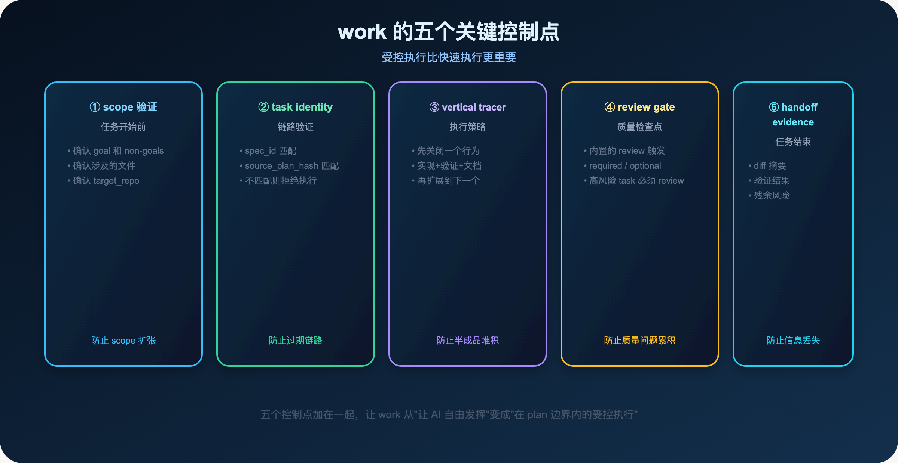
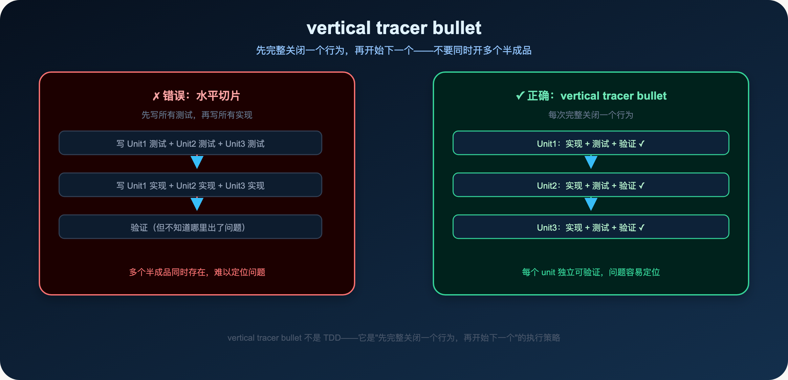
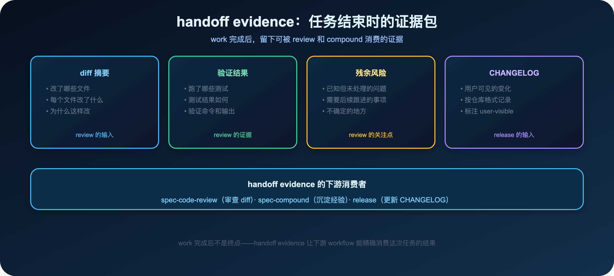
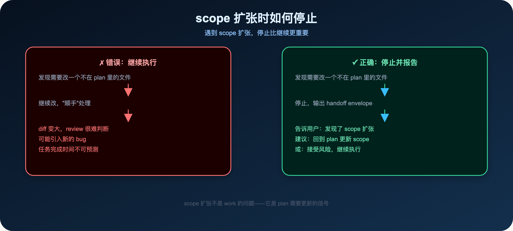

**work 不是"让 AI 自由发挥"，而是在 plan 边界内的受控执行。**

> **导读**
> 你有没有遇到过这种情况：任务开始时很清楚，但做着做着，AI 开始改一些你没有要求的东西，最后 diff 变大，review 很难判断。
> 这篇文章解释五个控制点如何让 work 保持在 plan 边界内。

---

## 01 为什么 AI 做着做着就偏了

这是一个很常见的场景：

你给 AI 一个任务：修复登录错误提示。

AI 开始工作。

它改了错误提示文案，然后发现认证模块的代码有点乱，顺手重构了一下。

重构的时候发现 UI 组件也有问题，顺手改了。

改 UI 的时候发现样式不一致，顺手调整了。

最后 diff 变大，review 很难判断哪些是必要修改，哪些是"顺手"做的。

这就是 scope 扩张。

**为什么会发生 scope 扩张？**

因为 AI 的训练数据里有大量的"最佳实践"和"顺手改进"的例子。当它看到一段代码有问题，它的自然反应是"顺手修一下"。

这种反应在某些场景下是有价值的——它帮你发现了你没有注意到的问题。

但在真实工程里，这种反应很危险：

- 它让 diff 变大，review 变难
- 它可能引入新的 bug（"顺手"改的地方没有经过充分测试）
- 它让任务的完成时间变得不可预测

**work 的核心原则：**

> **在 plan 边界内执行，不做 plan 之外的事。**

这不是限制 AI 的能力，而是让 AI 的能力用在正确的地方。

---

## 02 work 的三种输入模式



work 支持三种输入模式：

### 02.1 plan（最常见）

直接读取 plan 的 implementation units，按 plan 的 verification 验证。

```text
/spec:work docs/plans/2026-06-01-001-cli-health-check-plan.md
$spec-work docs/plans/2026-06-01-001-cli-health-check-plan.md
```

适合简单到中等复杂度的任务。

### 02.2 task pack（复杂任务）

验证 spec_id + source_plan_hash，按 wave 顺序执行 task cards。

```text
/spec:work docs/tasks/2026-06-01-001-cli-health-check-tasks.md
$spec-work docs/tasks/2026-06-01-001-cli-health-check-tasks.md
```

适合跨模块、有依赖的复杂任务。

### 02.3 bare prompt（最简单）

直接描述要做什么，work 自己构建 task list。

```text
/spec:work "修复 CLI 的错误提示文案"
$spec-work "修复 CLI 的错误提示文案"
```

适合小任务、typo、局部修复。

**注意：** bare prompt 没有 plan 的 scope 约束，AI 更容易扩张 scope。对于重要任务，建议先写 plan，再用 plan 作为输入。

---

## 03 spec-work 的执行流程



spec-work 有四个阶段：

**Phase 0：Triage 输入**——识别输入类型（plan / task pack / bare prompt），判断执行策略。

**Phase 1：验证边界**——scope 验证、task identity 验证、target_repo 确认。任何验证失败，work 停止并输出 handoff envelope，不会静默继续执行。

**Phase 2：执行实现**——按 vertical tracer bullet 策略执行，每个 unit 独立验证，review gate 检查，scope 扩张时停止。

**Phase 3：输出 handoff**——生成 diff 摘要、验证结果、残余风险、CHANGELOG，交接给 review 和 compound。

---

## 04 五个关键控制点



### 03.1 控制点一：scope 验证

任务开始前，work 会验证 scope：

- 确认 goal 和 non-goals
- 确认涉及的文件
- 确认 target_repo（多仓工作区）

如果 scope 不清楚，work 会停下来问用户，而不是自己猜。

**为什么 scope 验证很重要？**

因为 scope 是 work 的边界。

没有明确的 scope，AI 不知道该在哪里停下来。

有了明确的 scope，AI 知道：这个文件在 scope 内，可以改；那个文件不在 scope 内，不能改。

### 03.2 控制点二：task identity

如果输入是 task pack，work 会验证 task identity：

- spec_id 是否和 source plan 一致
- source_plan_hash 是否匹配

如果不匹配，work 会拒绝执行，要求重新编译 task pack。

这防止了"plan 变了但 task pack 没更新"的静默错误。

### 04.3 控制点三：vertical tracer bullet



vertical tracer bullet 是 work 的执行策略：

> **先完整关闭一个行为（实现+验证+文档），再开始下一个。**

不要同时开多个半成品。

**为什么 vertical tracer bullet 更好？**

水平切片（先写所有测试，再写所有实现）的问题：

- 多个半成品同时存在，难以定位问题
- 如果中途发现问题，需要回头修改多个地方
- 验证时不知道哪个 unit 出了问题

vertical tracer bullet 的优势：

- 每个 unit 独立可验证
- 问题容易定位（只有一个 unit 在进行中）
- 可以在任何时候停下来，已完成的 unit 是可交付的

**vertical tracer bullet 不是 TDD：**

TDD 是"先写测试，再写实现"。

vertical tracer bullet 是"先完整关闭一个行为，再开始下一个"。

两者不冲突，但 vertical tracer bullet 更关注执行顺序，而不是测试优先。

**一个例子：**

有三个 implementation units：

- Unit 1：实现 GET /health 端点
- Unit 2：添加数据库连接检查
- Unit 3：添加依赖服务检查

vertical tracer bullet 的执行顺序：

1. Unit 1：实现 + 测试 + 验证 ✓
2. Unit 2：实现 + 测试 + 验证 ✓
3. Unit 3：实现 + 测试 + 验证 ✓

每个 unit 完整关闭后，才开始下一个。

### 04.4 控制点四：review gate

review gate 是内置的质量检查点。

当 task card 的 `review_gate: required` 时，work 完成这个 task 后，会触发 review，等待 review 通过后才继续下一个 task。

这防止了质量问题在多个 task 之间累积。

**什么时候设置 review_gate: required？**

- 高风险的 task（涉及认证、数据库 schema、核心业务逻辑）
- 有依赖关系的 task（后续 task 依赖这个 task 的正确性）
- 不确定的 task（有多种实现方式，需要确认方向）

**review gate 和 code-review 的区别：**

review gate 是 task 级别的检查点，在 task 完成后立即触发。

code-review 是整个 work 完成后的全面审查。

两者互补：review gate 防止质量问题累积，code-review 确保整体质量。

### 04.5 控制点五：handoff evidence

任务结束时，work 会生成 handoff evidence：



handoff evidence 包含：

- **diff 摘要**：改了哪些文件，每个文件改了什么，为什么这样改
- **验证结果**：跑了哪些测试，测试结果如何
- **残余风险**：已知但未处理的问题，需要后续跟进的事项
- **CHANGELOG**：用户可见的变化，按仓库格式记录

这些证据让下游 workflow（review、compound）能精确消费这次任务的结果，不需要重新理解整个任务。

**handoff evidence 的格式：**

work 会生成一个 compact summary，包含上述信息。

review 读取这个 summary，知道：

- 改了什么（diff 摘要）
- 验证了什么（验证结果）
- 还有什么风险（残余风险）

compound 读取这个 summary，知道：

- 这次任务解决了什么问题
- 有哪些值得沉淀的经验

---

## 04 scope 扩张时如何停止



当 work 发现需要改一个不在 plan 里的文件时，正确的处理方式是：

**停止，输出 handoff envelope，告诉用户发现了 scope 扩张。**

不要继续执行，不要"顺手"处理。

**为什么停止比继续更重要？**

继续执行的问题：

- diff 变大，review 很难判断
- 可能引入新的 bug
- 任务完成时间不可预测

停止的好处：

- 让用户决定是否扩张 scope
- 如果需要扩张，回到 plan 更新 scope，再重新执行
- 如果不需要扩张，继续执行原来的 scope

**scope 扩张不是 work 的问题——它是 plan 需要更新的信号。**

---

## 05 work 的 context orientation

work 在执行时，会按照特定的顺序读取上下文：

1. 当前用户请求
2. plan 或 task pack
3. 已加载的 host/project instructions
4. package manifests 和 command registries
5. 附近的 implementation files 和 tests
6. git diff 或 changed files

这个顺序确保了：

- 最重要的信息（plan、用户请求）优先读取
- 不重复读取已加载的 host instructions
- 只读取和当前任务相关的源码

**work 不会读取的内容：**

- `.claude/`、`.codex/`、`.agents/skills/`（generated runtime mirror）
- `.spec-first/audits/**`（runtime audit artifact）

这些内容默认排除，防止 work 基于过期的 runtime 做判断。

**intake order 的价值：**

spec-work 的 Context Orientation Anchor 明确规定了 intake order：

> Use this intake order for context economy: first read the plan/task summary and contract metadata, then deterministic inventory or validation facts, then current task/phase refs, then focused source-of-truth sections, and only then deeper references.

这个顺序不是随意的。

它把最确定、最相关的内容放在前面，把"可能需要"的内容放在后面，只有真正需要时才展开。

这就是 Context Harness 的原则：给模型正确上下文，而不是无限上下文。

---

## 06 graph evidence 在 work 中的角色

work 在执行时，可以使用 graph evidence（GitNexus 等）作为 orientation evidence。

但 graph evidence 有可信度之分：

- **fresh**：可以作为 primary evidence 使用
- **dirty-advisory**：只能当参考，需要补 bounded direct reads
- **stale**：不能当真，需要先刷新图谱

**关键原则：**

> graph evidence 不定义 scope authority。scope 由 plan/task pack 和 concrete diff 决定，不由 graph 结果决定。

即使 graph 显示某个文件和当前任务相关，如果它不在 plan 的 scope 里，work 也不会修改它。

**graph evidence 的正确使用方式：**

- 用 graph 做 orientation（找到相关文件）
- 用 source 做 confirmation（确认文件内容）
- 用 plan 做 scope authority（决定是否修改）

这三步缺一不可。

**stale graph 时如何处理：**

当 graph 是 stale 时，work 会根据任务的复杂度决定：

- 轻量任务（单文件、typo、局部修复）：继续执行，用 bounded direct reads 代替 graph
- 重量任务（跨模块、核心 workflow、高风险）：建议先运行 graph-bootstrap，再执行

---

## 07 多仓工作区的 work

在多仓工作区里，work 有额外的约束：

- 不能从 cwd 推断写入目标
- 必须有明确的 target_repo 才能写入
- 写入前验证文件路径属于 target_repo

如果 target_repo 缺失或模糊，work 会停止，要求回到 plan 明确 repo scope。

**为什么这个约束这么严格？**

在多仓工作区里，AI 很容易犯一个错误：基于当前工作目录（cwd）或 graph 结果，自动选择一个 child repo 进行写入。

这种"自动选择"很危险：

- cwd 可能是父 workspace，不是任何 child repo
- graph 结果可能指向多个候选 repo，AI 不知道该选哪个
- 一旦写入了错误的 repo，可能造成难以追踪的问题

明确的 target_repo，让每个写入操作的边界清晰可见，防止意外写入错误的 repo。

**多仓工作区的 work 流程：**

```
父 workspace 发现候选 repo（workspace-graph-targets.v1）
  ↓
进入 child repo
  ↓
确认 target_repo
  ↓
执行 work（只写入 target_repo 里的文件）
  ↓
验证 git status 里的改动属于 target_repo
```

---

## 08 一个真实的 work 执行示例

让我们看一个真实的例子：修复 spec-first CLI 的错误提示。

**输入：**

```
/spec:work docs/plans/2026-06-01-001-cli-error-prompt-plan.md
```

**Phase 0：Triage 输入**

work 识别输入是 plan，读取 plan 的 implementation units：

- Unit 1：改进 doctor 命令的错误提示
- Unit 2：改进 init 命令的错误提示

**Phase 1：验证边界**

- scope：只改 `src/cli/commands/doctor.js` 和 `src/cli/commands/init.js`
- non-goals：不改错误处理架构，不改其他命令
- target_repo：当前 repo（单仓）

**Phase 2：执行实现**

按 vertical tracer bullet 策略：

1. Unit 1：改 doctor.js → 跑 tests/unit/doctor.test.js → 验证通过 ✓
2. Unit 2：改 init.js → 跑 tests/unit/init.test.js → 验证通过 ✓

执行中发现 `src/cli/commands/clean.js` 也有类似的错误提示问题，但它不在 scope 里，跳过。

**Phase 3：输出 handoff**

```
diff 摘要：
  - src/cli/commands/doctor.js：改进了 ERROR/WARN/INFO 标签格式
  - src/cli/commands/init.js：添加了"下一步"提示

验证结果：
  - tests/unit/doctor.test.js：8/8 通过
  - tests/unit/init.test.js：12/12 通过

残余风险：
  - src/cli/commands/clean.js 也有类似问题，建议后续处理

CHANGELOG：
  - fix(cli): 改进 doctor 和 init 命令的错误提示格式 (user-visible)
```

这个 handoff evidence 让 review 知道：改了什么，验证了什么，还有什么风险。

---

## 09 本篇小结

work 的五个关键控制点：

1. **scope 验证**：任务开始前确认边界，防止 scope 扩张
2. **task identity**：spec_id + source_plan_hash 防止过期链路
3. **vertical tracer bullet**：先关闭一个行为，再扩展
4. **review gate**：内置的质量检查点
5. **handoff evidence**：任务结束时留下可被下游消费的证据

**核心原则：**

> **受控执行比快速执行更重要。**

work 开始前先问：scope 清楚吗？task identity 可验证吗？完成信号是什么？

这三个问题，是 work 最常见的缺陷来源。

**一个简单的自测：**

如果你的 work 执行后，不知道 AI 改了什么，也不知道它验证了什么，说明 handoff evidence 不够完整。

如果你的 work 执行后，diff 里有很多你没有要求的改动，说明 scope 验证没有生效。

如果你的 work 执行后，发现 task pack 和 plan 不一致，说明 task identity 验证没有生效。

**work 和 plan 的关系：**

work 不是 plan 的替代品，而是 plan 的执行者。

plan 决定 WHAT，work 决定 HOW TO EXECUTE。

work 的质量，取决于 plan 的质量。

好的 plan + 受控的 work = 可预测的交付。

下一篇：

> **Spec-First：反复问 AI 你再看看，只会让 bug 越来越多**

debug 不是反复问 AI，而是用 hypothesis ledger 把失败变成可追踪的证据。

---

`spec-first` 是开源项目，欢迎试用、提 issue、提建议。

**GitHub：** http://github.com/sunrain520/spec-first

**官网：** http://spec-first.cn/
