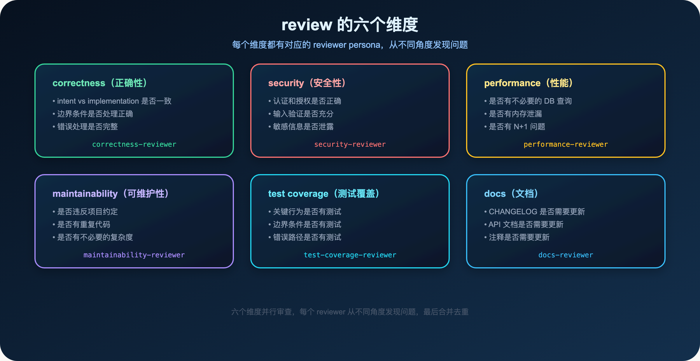
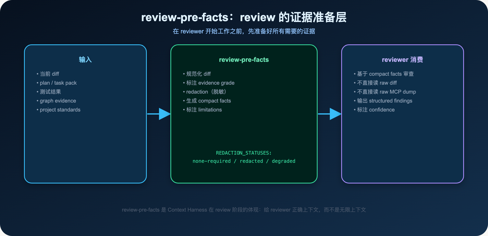
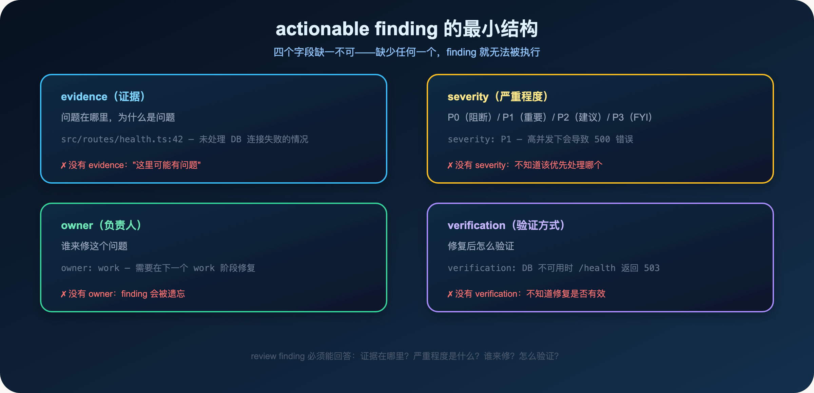
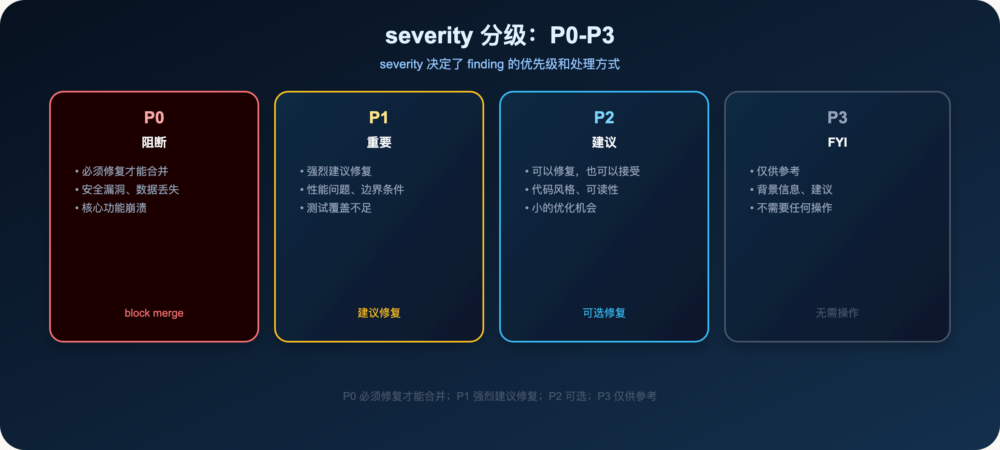
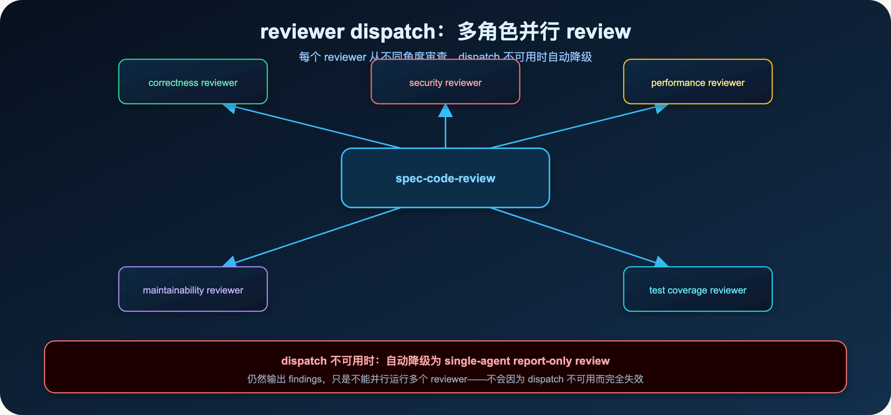
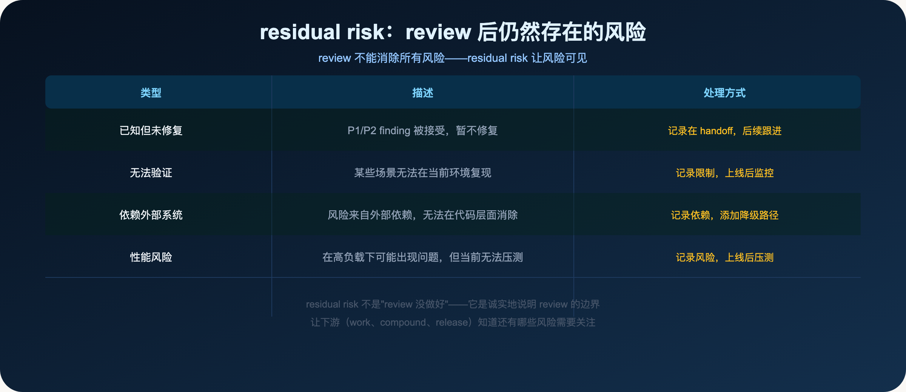

**review 是证据，不是建议。**

> **导读**
> 你有没有遇到过这种情况：AI review 了代码，说"看起来没问题"，但上线后还是出了问题。
> 这篇文章解释为什么会这样，以及一个 actionable finding 应该包含什么。

---

## 01 为什么 AI review 经常没有用

这是一个很常见的场景：

你让 AI review 代码，AI 说："代码看起来没有明显问题，逻辑清晰，测试覆盖也不错。"

你合并了代码，上线后出了问题。

这不是 AI 不够聪明，而是你给它的 review 任务太模糊了。

"你再检查一下"不是 review contract。

它没有：

- **severity**：不知道哪些问题是必须修复的，哪些是可以接受的
- **evidence**：不知道问题在哪里，为什么是问题
- **owner**：不知道谁来修这个问题
- **verification**：不知道修复后怎么验证

没有这四个字段，review 只是一段对话，不是可执行的 finding。

**为什么 AI review 经常没有用？**

因为大多数人给 AI 的 review 任务是这样的：

> "帮我 review 一下这段代码"

这个任务太模糊了。

AI 不知道：

- 应该从哪些角度审查
- 哪些问题是必须修复的，哪些是可以接受的
- 发现问题后应该怎么报告

结果是：AI 给出一段模糊的评价，"代码看起来不错，但有几个地方可以改进"。

这不是 review，这是建议。

**spec-code-review 的核心原则：**

> **review 是证据，不是建议。**

每个 finding 都必须有证据支撑，有明确的 severity，有 owner，有 verification。

**使用方式：**

```text
/spec:code-review
$spec-code-review
```

也可以指定 base：

```text
/spec:code-review base:main
$spec-code-review base:main
```

**spec-code-review 和 spec-doc-review 的区别：**

- `spec-code-review`：审查代码 diff，关注 HOW 是否正确
- `spec-doc-review`：审查需求/计划/文档，关注 WHAT/WHY 是否正确

两者互补，不能互相替代。

---

## 02 review 的六个维度



spec-code-review 从六个维度审查代码：

### 02.1 correctness（正确性）

代码是否按照预期工作？

- intent vs implementation 是否一致
- 边界条件是否处理正确
- 错误处理是否完整

**一个常见的 correctness 问题：**

你写了一个健康检查接口，检查数据库连接。

但你只检查了"能连接"，没有检查"连接后能执行查询"。

这是 intent vs implementation 不一致：你的意图是"数据库可用"，但实现只检查了"能连接"。

### 02.2 security（安全性）

代码是否引入了安全风险？

- 认证和授权是否正确
- 输入验证是否充分
- 敏感信息是否泄露

### 02.3 performance（性能）

代码是否有性能问题？

- 是否有不必要的数据库查询
- 是否有内存泄漏
- 是否有 N+1 问题

### 02.4 maintainability（可维护性）

代码是否容易维护？

- 是否违反项目约定
- 是否有重复代码
- 是否有不必要的复杂度

### 02.5 test coverage（测试覆盖）

测试是否充分？

- 关键行为是否有测试
- 边界条件是否有测试
- 错误路径是否有测试

### 02.6 docs（文档）

文档是否需要更新？

- CHANGELOG 是否需要更新
- API 文档是否需要更新
- 注释是否需要更新

---

## 03 review-pre-facts：review 的证据准备层



在 reviewer 开始工作之前，spec-code-review 会先运行 review-pre-facts，准备好所有需要的证据：

- **规范化 diff**：把 diff 整理成 reviewer 可以精确消费的格式
- **标注 evidence grade**：标注每条证据的可信度（confirmed / session-local / advisory / stale）
- **redaction（脱敏）**：确保敏感信息不进入 reviewer prompt
- **生成 compact facts**：把大量信息压缩成 reviewer 需要的关键事实
- **标注 limitations**：说明哪些证据不可用，哪些需要降级

**redaction 的三种状态：**

- `none-required`：没有需要脱敏的内容
- `redacted`：已经脱敏
- `redaction-degraded`：脱敏失败，需要人工处理

**为什么需要 review-pre-facts？**

因为 reviewer 不应该直接读 raw diff 或 raw MCP dump。

raw diff 可能包含敏感信息，raw MCP dump 可能包含大量无关内容。

review-pre-facts 是 Context Harness 在 review 阶段的体现：给 reviewer 正确上下文，而不是无限上下文。

---

## 04 actionable finding 的最小结构



一个 actionable finding 必须包含四个字段：

### 04.1 evidence（证据）

问题在哪里，为什么是问题。

**好的 evidence：**

```
src/routes/health.ts:42 — 未处理 DB 连接失败的情况
当 DB 不可用时，这行代码会抛出未捕获的异常，导致 500 错误
```

**差的 evidence：**

```
这里可能有问题
```

### 04.2 severity（严重程度）

P0（阻断）/ P1（重要）/ P2（建议）/ P3（FYI）

severity 决定了 finding 的优先级和处理方式。

### 04.3 owner（负责人）

谁来修这个问题。

通常是 `work`（需要在下一个 work 阶段修复）或 `deferred`（暂时接受，后续跟进）。

### 04.4 verification（验证方式）

修复后怎么验证。

**好的 verification：**

```
DB 不可用时，GET /health 应该返回 503，而不是 500
```

**差的 verification：**

```
测试一下
```

**为什么 verification 很重要？**

没有 verification，修复后不知道是否真的修复了。

有了 verification，修复后可以立即验证：

1. 按照 verification 的描述，运行测试或检查
2. 如果通过，finding 已修复
3. 如果不通过，修复不完整，需要继续

**一个完整的 actionable finding 示例：**

```yaml
finding:
  id: F001
  severity: P1
  confidence: 75
  evidence: "src/routes/health.ts:42 — 未处理 DB 连接失败的情况"
  description: "当 DB 不可用时，这行代码会抛出未捕获的异常，导致 500 错误"
  owner: work
  verification: "DB 不可用时，GET /health 应该返回 503，而不是 500"
  autofix_class: manual
```

这个 finding 包含了所有必要的信息：

- 证据在哪里（evidence）
- 为什么是问题（description）
- 严重程度（severity: P1）
- 置信度（confidence: 75）
- 谁来修（owner: work）
- 怎么验证（verification）
- 是否可以自动修复（autofix_class: manual）

---

## 05 severity 分级



spec-code-review 使用 P0-P3 四个 severity 级别：

**P0（阻断）：** 必须修复才能合并。安全漏洞、数据丢失、核心功能崩溃。

**P1（重要）：** 强烈建议修复。性能问题、边界条件、测试覆盖不足。

**P2（建议）：** 可以修复，也可以接受。代码风格、可读性、小的优化机会。

**P3（FYI）：** 仅供参考。背景信息、建议，不需要任何操作。

**confidence 分级：**

除了 severity，每个 finding 还有 confidence（置信度）：

- 100：非常确定，有直接的 source 证据
- 75：比较确定，有间接证据
- 50：不确定，需要进一步验证
- 25：猜测，可能是问题
- 0：不确定，仅供参考

confidence 低的 finding，reviewer 会明确说明不确定性，让用户决定是否需要进一步调查。

---

## 06 reviewer dispatch：多角色并行 review



spec-code-review 会根据 diff 的内容，动态选择合适的 reviewer persona，并行审查：

- **correctness reviewer**：检查代码正确性
- **security reviewer**：检查安全风险
- **performance reviewer**：检查性能问题
- **maintainability reviewer**：检查可维护性
- **test coverage reviewer**：检查测试覆盖

每个 reviewer 从不同角度审查，然后 spec-code-review 合并和去重 findings，生成最终报告。

**dispatch 不可用时的降级：**

当 reviewer dispatch 不可用时（比如 Codex 的某些模式），spec-code-review 会自动降级为 single-agent report-only review。

它仍然会输出 findings，只是不能并行运行多个 reviewer。

这确保了 spec-code-review 在任何环境下都能工作，不会因为 dispatch 不可用而完全失效。

**scale-aware reviewer 选择：**

spec-code-review 会根据 diff 的大小和复杂度，选择合适的 reviewer 数量：

- 小 diff（< 50 行）：最小 reviewer 集（correctness + security）
- 中等 diff（50-200 行）：标准 reviewer 集
- 大 diff（> 200 行）：完整 reviewer 集

这防止了对小改动进行过度 review，也确保了对大改动进行充分 review。

**findings 的合并和去重：**

多个 reviewer 可能发现同一个问题。

spec-code-review 会合并和去重 findings，确保最终报告里每个问题只出现一次。

合并时，会保留最高的 severity 和最详细的 evidence。

**autofix_class：**

每个 finding 都有 `autofix_class`，说明是否可以自动修复：

- `safe_auto`：可以自动修复，风险低
- `gated_auto`：可以自动修复，但需要用户确认
- `manual`：需要手动修复
- `deferred`：暂时接受，后续跟进

---

## 07 residual risk：review 后仍然存在的风险



review 不能消除所有风险。

residual risk 是 review 完成后仍然存在的已知风险。

**为什么需要 residual risk？**

因为诚实地说明 review 的边界，比假装 review 消除了所有风险更重要。

residual risk 让下游（work、compound、release）知道还有哪些风险需要关注。

**常见的 residual risk 类型：**

- **已知但未修复**：P1/P2 finding 被接受，暂不修复
- **无法验证**：某些场景无法在当前环境复现
- **依赖外部系统**：风险来自外部依赖，无法在代码层面消除
- **性能风险**：在高负载下可能出现问题，但当前无法压测

**residual risk 的格式：**

```
residual_risk:
  - type: unverified
    description: "高并发下的行为未经压测验证"
    mitigation: "上线后监控 /health 接口的响应时间"
```

---

## 08 review findings 如何交接给 work 和 compound

review 完成后，findings 会交接给下游：

**交接给 work：**

P0 和 P1 findings 需要在下一个 work 阶段修复。

work 读取 review findings，知道：

- 哪些问题需要修复（P0/P1）
- 修复后怎么验证（verification）
- 还有哪些风险（residual risk）

**交接给 compound：**

review 完成后，可以用 compound 沉淀经验：

- 这次 review 发现了什么类型的问题
- 哪些问题是这个项目特有的
- 哪些 review 模式值得复用

但不要把每条 review comment 都变成永久知识，只沉淀真实、可复用、不会快速过期的经验。

**review 的 handoff envelope：**

review 完成后，会生成一个 handoff envelope，包含：

- findings 列表（按 severity 排序）
- residual risk 列表
- Coverage（说明 review 的范围和限制）
- 建议的下一步操作

这个 handoff envelope 让下游 workflow 能精确消费 review 的结果，不需要重新理解整个 review 过程。

**Coverage 的作用：**

Coverage 是 review 的元信息，说明：

- review 覆盖了哪些文件
- 哪些证据不可用（graph stale、provider degraded）
- 哪些限制影响了 review 的质量

Coverage 让用户知道 review 的边界，防止对 review 结果过度信任。

---

## 09 本篇小结

review 的核心原则：

1. **review 是证据，不是建议**：每个 finding 都必须有证据支撑
2. **actionable finding 的四个字段**：evidence + severity + owner + verification
3. **severity 分级**：P0 阻断、P1 重要、P2 建议、P3 FYI
4. **reviewer dispatch**：多角色并行 review，dispatch 不可用时自动降级
5. **residual risk**：诚实说明 review 的边界

**核心判断：**

> review finding 必须能回答：证据在哪里？严重程度是什么？谁来修？怎么验证？

**一个简单的自测：**

如果你的 review 结果里，没有具体的文件路径和行号，那是没有 evidence 的 review。

如果你的 review 结果里，没有 severity 分级，那不知道该优先处理哪个问题。

如果你的 review 结果里，没有 verification，那不知道修复是否有效。

**review 和 work 的关系：**

review 完成后，P0 和 P1 findings 需要在下一个 work 阶段修复。

work 读取 review findings，知道：

- 哪些问题需要修复（P0/P1）
- 修复后怎么验证（verification）
- 还有哪些风险（residual risk）

**review 和 compound 的关系：**

review 完成后，可以用 compound 沉淀经验：

- 这次 review 发现了什么类型的问题
- 哪些问题是这个项目特有的
- 哪些 review 模式值得复用

但不要把每条 review comment 都变成永久知识，只沉淀真实、可复用、不会快速过期的经验。

**一个完整的 review 流程：**

```
work 完成
  ↓
spec-code-review（审查 diff）
  ↓
P0 findings → 必须修复
P1 findings → 建议修复
P2/P3 findings → 可选
residual risk → 记录，上线后监控
  ↓
修复 P0/P1 findings
  ↓
spec-compound（沉淀经验）
  ↓
合并代码
```

这个流程确保了：

- 每个 finding 都有证据支撑
- 每个 finding 都有明确的处理方式
- review 后仍然存在的风险被明确记录

**review 的质量标准：**

一次好的 review，应该让 work 不需要问任何关于 finding 的问题。

如果 work 在修复时需要问"这个 finding 是什么意思"，说明 evidence 不够清晰。

如果 work 在修复时需要问"这个 finding 严重吗"，说明 severity 不够明确。

如果 work 在修复时需要问"修复后怎么验证"，说明 verification 不够具体。

**一个简单的判断：**

如果你的 review 结果里，每个 finding 都能回答"证据在哪里？严重程度是什么？谁来修？怎么验证？"，那是一次好的 review。

如果不能，那是一段对话，不是 review。

**review 不是终点：**

review 完成后，还有两件事要做：

1. 修复 P0/P1 findings（work 阶段）
2. 沉淀经验（compound 阶段）

review 是整个工程闭环的一部分，不是终点。

下一篇：

> **Spec-First：你解决过的问题，为什么下次还要重新解决一遍**

compound 不是写文档，而是在上下文最新鲜时把可复用经验固化下来。

---

`spec-first` 是开源项目，欢迎试用、提 issue、提建议。

**GitHub：** http://github.com/sunrain520/spec-first

**官网：** http://spec-first.cn/
