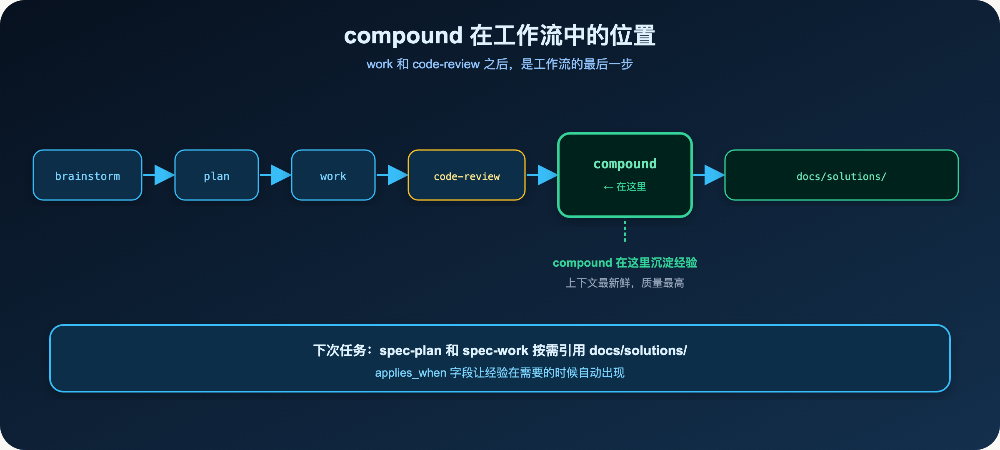
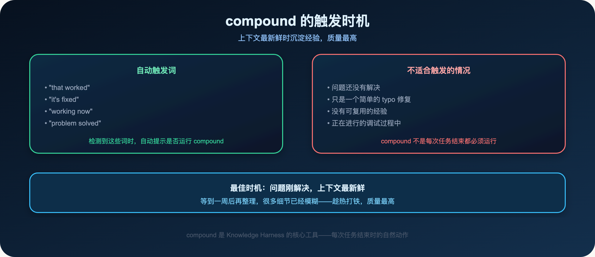
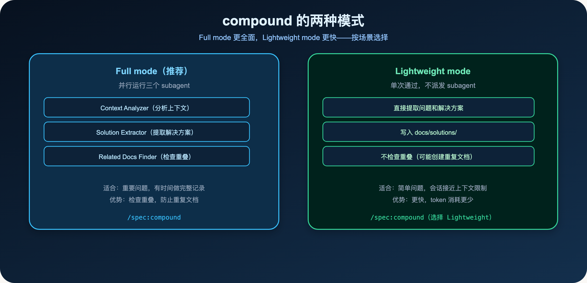
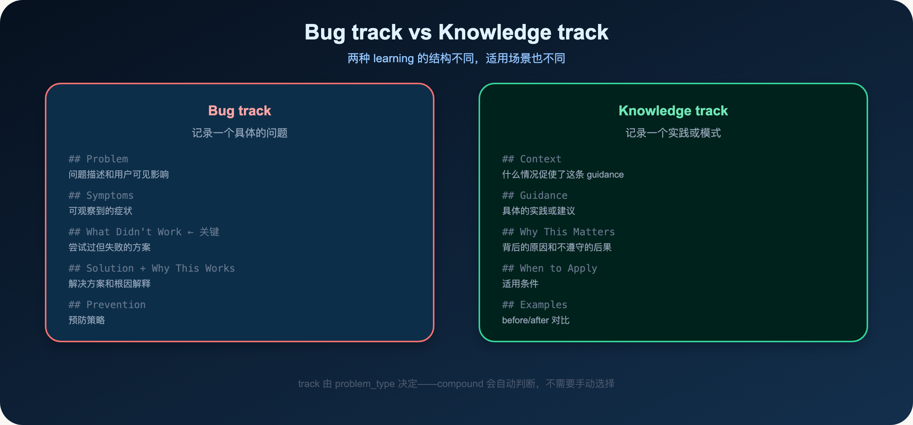
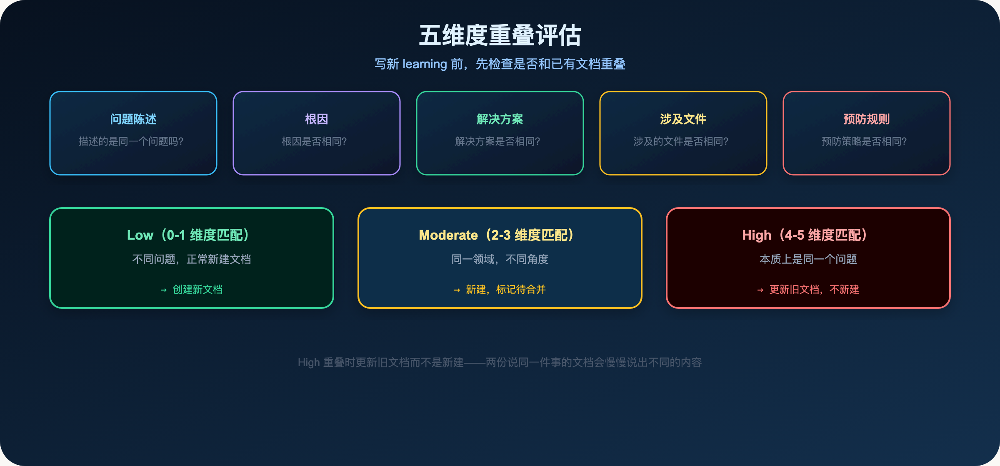
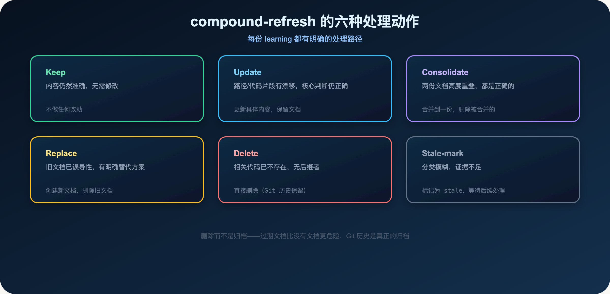

**compound 不是写文档，而是在上下文最新鲜时把可复用经验固化下来。**

> **导读**
> 同一个坑，今天踩，下周换个会话再踩，下个月换个模型又踩。
> 这篇文章解释 compound 如何把每次解决过的问题，变成下次任务的输入优势。

---

## 01 为什么同一个坑会反复踩

这是一个很常见的场景：

你花了两个小时，定位了一个很隐蔽的 bug。

找到根因，修好了，验证通过，关掉窗口。

下周遇到了类似的问题。

你打开新会话，AI 不知道上周发生了什么，又开始从头分析。

又花了一个小时。

这不是 AI 不够聪明，而是经验没有进入系统。

**三种常见的经验浪费：**

1. **重复踩坑**：同一个问题，今天踩，下周再踩，下个月又踩
2. **重复调查**：每次遇到类似问题，都要重新走一遍调查过程
3. **重复发现**：团队里不同的人，各自发现了同一个问题，但彼此不知道

这三种浪费，都可以用 compound 解决。

**compound 的核心价值：**

> **在问题刚解决、上下文还新鲜的时候，把可复用的经验沉淀下来。**

不是事后整理，不是定期回顾，而是任务结束时的自然动作。

**compound 在工作流中的位置：**



compound 在 work 和 code-review 之后运行，是工作流的最后一步。

它把这次任务的经验沉淀到 docs/solutions/，让下次任务的 spec-plan 和 spec-work 能按需引用。

**使用方式：**

```text
/spec:compound
$spec-compound
```

compound 会先问你选择 Full mode 还是 Lightweight mode，然后按你的选择执行。

---

## 02 compound 的触发时机



compound 有自动触发机制：

当 AI 检测到这些词时，会自动提示是否运行 compound：

- "that worked"
- "it's fixed"
- "working now"
- "problem solved"

**为什么要在这个时机触发？**

因为这时候上下文最新鲜：

- 问题刚刚解决，细节还清晰
- 根因刚刚确认，解释还准确
- 失败的尝试还记得，What Didn't Work 还能写清楚

等到一周后再回来整理，很多细节已经模糊了，根因也不那么确定了。

**什么时候不应该触发：**

- 问题还没有解决
- 只是一个简单的 typo 修复
- 没有可复用的经验
- 正在进行的调试过程中

compound 不是每次任务结束都必须运行，而是在有值得沉淀的经验时运行。

---

## 03 Full mode vs Lightweight mode



compound 有两种模式：

### 03.1 Full mode（推荐）

并行运行三个 subagent：

- **Context Analyzer**：分析上下文，确定 track（Bug 还是 Knowledge），建议文件名
- **Solution Extractor**：提取解决方案，按 track 生成文档结构
- **Related Docs Finder**：检查与已有文档的重叠，防止重复

Full mode 的优势：

- 检查重叠，防止创建重复文档
- 更全面的上下文分析
- 更高质量的文档

**适合：** 重要问题，有时间做完整记录。

### 03.2 Lightweight mode

单次通过，不派发 subagent：

- 直接提取问题和解决方案
- 写入 docs/solutions/
- 不检查重叠（可能创建重复文档）

Lightweight mode 的优势：

- 更快，token 消耗更少
- 适合会话接近上下文限制时

**适合：** 简单问题，或会话接近上下文限制时。

**如何选择：**

compound 会先问你选择哪种模式，然后按你的选择执行。

如果不确定，选 Full mode——它的质量更高，而且会检查重叠，防止重复文档。

---

## 04 Bug track vs Knowledge track



compound 把 learning 分成两个 track：

### 04.1 Bug track

记录一个具体的问题是怎么发生的、怎么解决的。

结构包含：

- **Problem**：问题描述和用户可见影响
- **Symptoms**：可观察到的症状
- **What Didn't Work**：尝试过但失败的方案（关键！）
- **Solution**：解决方案，包含代码示例
- **Why This Works**：根因解释
- **Prevention**：预防策略

**What Didn't Work section 的价值：**

很多文档只记录"怎么解决"，不记录"哪些方法没有用"。

但"哪些方法没有用"往往是最有价值的信息：

- 下次遇到类似问题，可以直接跳过这些方法
- 节省大量的调查时间

**一个真实的例子：**

在 spec-first 的开发过程中，有一次 `spec-doc-review` 在高并发下偶发失败。

Bug track 记录了：

- Symptoms：并发下偶发 500 错误
- What Didn't Work：加锁（H1 否定）、清空缓存（H2 否定）
- Solution：调整数据库连接池配置（max_connections=50）
- Why This Works：连接池耗尽是根因
- Prevention：压测时监控连接池状态

下次遇到类似问题，可以直接跳过 H1 和 H2，从连接池开始检查。

### 04.2 Knowledge track

记录一个实践、模式或决策。

结构包含：

- **Context**：什么情况促使了这条 guidance
- **Guidance**：具体的实践或建议
- **Why This Matters**：背后的原因和不遵守的后果
- **When to Apply**：适用条件
- **Examples**：before/after 对比

**一个真实的例子：**

在 spec-first 的开发过程中，有一条 Knowledge track 记录了：

- Context：workflow prompt 曾把 AGENTS.md 写成普通 context source
- Guidance：使用 `already-loaded host/project instructions`，而不是 `AGENTS.md / CLAUDE.md`
- Why This Matters：重复读取会浪费 token，把当前任务需要的 source/test/diff evidence 挤出去
- When to Apply：修改 workflow 的 context orientation 时
- Examples：`Orient from AGENTS.md` → `Orient from already-loaded host/project instructions`

**track 由 problem_type 决定：**

compound 会根据问题的类型，自动判断应该用 Bug track 还是 Knowledge track。

你不需要手动选择，compound 会问你确认。

---

## 05 五维度重叠评估



在 Full mode 里，compound 会在写新 learning 之前，评估它和已有文档的重叠程度。

评估从五个维度进行：

1. **问题陈述**：描述的是同一个问题吗？
2. **根因**：根因是否相同？
3. **解决方案**：解决方案是否相同？
4. **涉及文件**：涉及的文件是否相同？
5. **预防规则**：预防策略是否相同？

**三种重叠程度：**

- **Low（0-1 维度匹配）**：不同问题，正常新建文档
- **Moderate（2-3 维度匹配）**：同一领域，不同角度，新建文档并标记待合并
- **High（4-5 维度匹配）**：本质上是同一个问题，更新旧文档而不是新建

**为什么 High 重叠时要更新旧文档？**

因为两份说同一件事的文档，会慢慢说出不同的内容。

新的上下文更新鲜，更可靠。

把新的上下文折叠进旧文档，比创建一个新的重复文档更好。

**一个真实的例子：**

在 spec-first 的开发过程中，有两份文档都记录了"不要手改 generated runtime mirror"这个原则。

一份是 2026-04-13 写的，一份是 2026-05-25 写的。

两份文档的核心判断相同，但 2026-05-25 的版本有更多的细节和更新的代码示例。

compound-refresh 把两份文档合并，保留了 2026-05-25 的版本，删除了 2026-04-13 的版本。

这样，docs/solutions/ 里只有一份关于这个主题的文档，而且是最新的。

---

## 06 compound-refresh 的六种处理动作



随着时间推移，docs/solutions/ 里的 learning 会过期。

compound-refresh 用六种处理动作维护知识质量：

### 06.1 Keep

内容仍然准确，无需修改。

不做任何改动。

### 06.2 Update

路径、模块名、代码片段有漂移，但核心判断仍然正确。

更新具体内容，保留文档。

**适合：** 代码重构后，文件路径变了，但解决方案的核心逻辑没变。

### 06.3 Consolidate

两份文档高度重叠，但都是正确的。

合并到一份，删除被合并的那份。

**适合：** 两个人各自记录了同一个问题的解决方案，内容基本相同。

### 06.4 Replace

旧文档已经误导性，但有明确的替代方案。

创建新文档，删除旧文档。

**适合：** 旧的解决方案已经不再适用，有了更好的方案。

### 06.5 Delete

相关代码已不存在，且没有后继者。

直接删除。

**关键原则：** 删除而不是归档。

Git 历史会保留每一份被删除的文档。如果有人需要找回，`git log --diff-filter=D -- docs/solutions/` 就能找到。

**为什么不归档？**

归档目录会积累，污染搜索结果，没有人会去读。

过期的文档比没有文档更危险，因为它会误导 AI 基于错误的历史经验做判断。

**Delete 的触发条件：**

- 相关代码已不存在（文件被删除、功能被移除）
- 没有后继者（没有新的代码替代了旧的代码）
- 没有实质性的引用（没有其他文档依赖这份文档的核心内容）

**Delete 前的检查：**

compound-refresh 在 Delete 之前，会检查是否有其他文档引用了这份文档。

如果有实质性引用（其他文档的核心内容依赖这份文档），会建议 Replace 而不是 Delete。

### 06.6 Stale-mark

分类模糊，证据不足以做出明确判断。

标记为 stale，等待后续处理。

**什么时候用 Stale-mark？**

- 不确定是 Update 还是 Replace
- 证据不足以确认文档是否过期
- 需要更多信息才能做出判断

Stale-mark 是一个保守的选择：宁可标记为 stale，也不要误删有价值的文档。

**Stale-mark 的格式：**

```yaml
status: stale
stale_reason: "相关代码已重构，但不确定新的实现是否改变了核心行为"
stale_date: 2026-06-01
```

标记为 stale 后，下次运行 compound-refresh 时，会重新评估这份文档。

---

## 07 compound-refresh 的触发条件

compound-refresh 不是定期全量扫描，而是有选择地维护：

**触发条件一：新 learning 和旧 learning 高度重叠**

当 compound 写完一份新 learning，发现它和某份旧 learning 在五个维度上有高度重叠时，会建议运行 compound-refresh。

**触发条件二：重构或迁移让某些 learning 过期**

当一次重构明显改变了某个模块的行为，相关的 learning 可能已经不准确了。

**触发条件三：用户明确指出某份 learning 已经过期**

当有人说"这份文档说的不对了"，触发 refresh，更新或删除过期内容。

**使用方式：**

```text
/spec:compound-refresh payments
$spec-compound-refresh workflow-issues
```

传入一个 scope hint，compound-refresh 会只检查这个范围内的文档。

**为什么不做全量扫描？**

全量扫描成本高，而且很多时候是在维护没有变化的内容。

有触发条件的维护，把精力集中在真正需要更新的地方。

这和 Context Harness 的原则是一致的：

> **按需精确，不广播全量。**

**compound-refresh 的保守原则：**

compound-refresh 在处理文档时，会保守地判断：

- 如果分类模糊，标记为 stale，而不是直接删除
- 如果证据不足，记录为 recommendation，而不是自动执行
- 只有在证据充分、分类明确时，才自动执行 Delete 或 Replace

这防止了 compound-refresh 误删有价值的文档。

---

## 08 Discoverability Check：让 agent 能找到知识库

compound 完成后，会运行一个 Discoverability Check：

检查项目的 instruction files（AGENTS.md、CLAUDE.md）是否会引导 agent 发现 docs/solutions/。

如果没有，compound 会建议添加一行说明，让未来的 agent 知道：

- docs/solutions/ 存在
- 它的结构是什么（按类别分类，有 YAML frontmatter）
- 什么时候应该查阅它

**为什么需要这个检查？**

因为 docs/solutions/ 只有在 agent 知道它存在的情况下，才能发挥价值。

如果 agent 不知道有这个知识库，它就不会去查阅，经验就白沉淀了。

**一个典型的 Discoverability 说明：**

```
docs/solutions/  # documented solutions to past problems (bugs, best practices,
                 # workflow patterns), organized by category with YAML frontmatter
                 # (module, tags, problem_type). Relevant when implementing or
                 # debugging in documented areas.
```

这一行说明，让所有未来的 agent 都知道：有一个知识库，在实现或调试时应该查阅。

---

## 09 本篇小结

compound 的核心原则：

1. **触发时机**：问题刚解决，上下文最新鲜时
2. **两种模式**：Full mode 更全面，Lightweight mode 更快
3. **两种 track**：Bug track 记录具体问题，Knowledge track 记录实践
4. **What Didn't Work**：失败经验和成功经验同样重要
5. **五维度重叠评估**：防止重复文档
6. **compound-refresh**：六种处理动作维护知识质量
7. **删除而不是归档**：过期文档比没有文档更危险

**核心判断：**

> 任务结束时先问：这次解决的问题，值得让下一个 agent 直接知道吗？

**一个简单的自测：**

如果你的团队里，同一个问题被不同的人重复解决了多次，说明 Knowledge Harness 还没有建立起来。

如果你的 docs/solutions/ 里，有很多过期的文档，说明 compound-refresh 还没有定期运行。

如果你的 AGENTS.md 里，没有提到 docs/solutions/，说明 agent 找不到知识库。

**compound 和整个工作流的关系：**

compound 是工作流的最后一步，但也是下一次工作流的第一步。

每次 compound 沉淀的经验，都会成为下次 spec-plan 和 spec-work 的输入。

这就是知识复利：每次任务都让下一次任务更容易一点。

**一个完整的知识复利循环：**

```
解决问题
  → compound 沉淀 learning（docs/solutions/）
  → 下次任务：spec-plan 按 component/tags 检索相关 learning
  → spec-work 按 context_refs 精确引用
  → 少踩同样的坑，任务更快完成
  → 再次解决问题时，更新或补充 learning
  → 知识复利
```

每次任务都让下一次任务更容易一点——这就是 Knowledge Harness 的核心价值。

下一篇：

> **Spec-First：把它优化好一点——这句话为什么会让 AI 失控**

optimize 要求先定义 metric 和 measurement scaffold，再跑实验。没有指标就拒绝运行。

---

`spec-first` 是开源项目，欢迎试用、提 issue、提建议。

**GitHub：** http://github.com/sunrain520/spec-first

**官网：** http://spec-first.cn/
