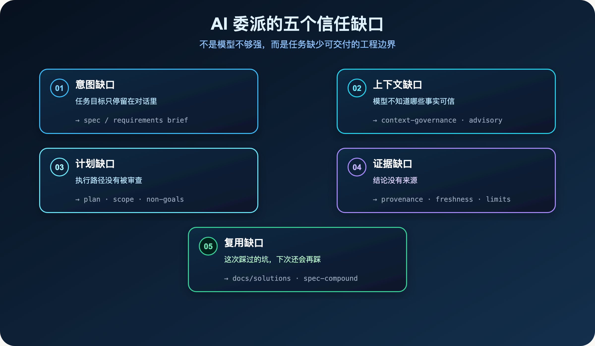
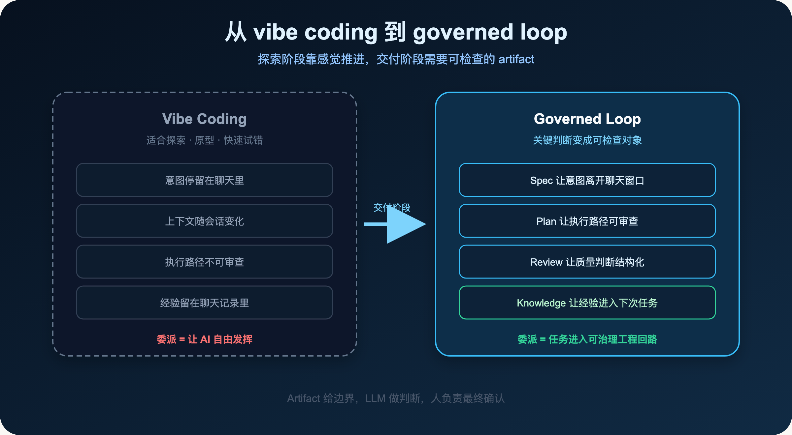
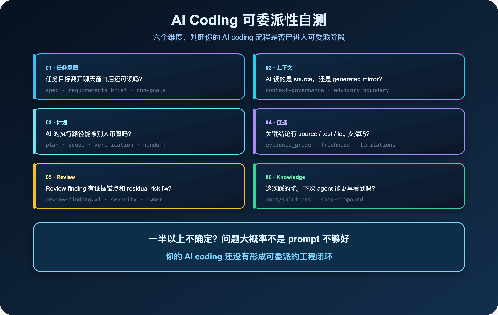

**你不敢委派 AI，不一定是模型不够强。更可能是任务还没有进入一个可治理的工程闭环。**

> **导读**
> 这篇文章讨论一个很具体的问题：为什么很多开发者已经天天用 AI coding，却仍然不敢把一个真实任务交给 AI 独立做完。
> 我的答案是：问题不只是模型能力，而是任务缺少可交付的工程边界。

上一篇我把 `spec-first` 定义为一层 **AI Coding Harness**。

它不是 prompt pack，也不是 agent collection。

它要做的，是把不稳定的 AI 推理，放进可重复、可观察、可约束、可验证的工程闭环。

这篇继续往下走一步。

如果 Harness 的目标是让 AI coding 变得可治理，那么它首先要回答一个问题：

> 为什么你现在还不敢真正把任务交给 AI？

---

## 01 你真的敢让 AI 独立做完一个任务吗？

很多人已经离不开 AI coding。

写一个函数，可以让 AI 先起草。

解释一段报错，可以让 AI 先分析。

补一个测试，可以让 AI 先生成。

这些场景很自然。

但换成一个真实需求，情况就变了。

比如：

- 修复一个跨模块 bug
- 重构一段历史逻辑
- 调整一个 workflow 行为
- 根据 review finding 修一组问题
- 把一次踩坑沉淀成团队以后能复用的经验

这时候，大多数开发者不会真的“交给 AI”。

你会盯着它。

你会不断打断它。

你会问它为什么改这个文件。

你会担心它读错上下文、扩张 scope、遗漏测试、修错 source、把一个局部问题变成一片无关重构。

这不是不信任 AI 会不会写代码。

这是不信任它能不能在真实工程边界里完成交付。

换句话说：

> **你不是不敢让 AI 写代码。你是不敢让 AI 承担任务。**

代码生成只是其中一步。

任务交付还包括理解意图、选择上下文、拆分路径、保留证据、接受 review、沉淀经验。

这些东西如果都停留在聊天窗口里，委派就不会发生。

---

## 02 AI coding 的信任缺口在哪里

我把这个问题拆成五个缺口。

它们不是抽象概念。

它们每天都发生在真实项目里。

### 02.1 意图缺口：任务目标只停留在对话里

很多任务开始时，看起来已经说清楚了。

例如：

```text
帮我把这个 workflow 调整一下，让它更稳。
```

人能理解这句话背后的很多东西。

但模型只能看到当前对话里的文字。

什么叫“更稳”？

哪些行为不能改？

哪些用户可见变化需要写 changelog？

哪些 generated runtime 不能手改？

哪些只是历史参考，哪些是 source-of-truth？

如果这些边界没有离开聊天窗口，就很难被复查，也很难被别人接手。

`spec-first` 里为什么会有 requirements、plan、task pack 这类 artifact？

不是因为我喜欢写文档。

而是因为真实任务需要一个能被再次读取的意图载体。

没有这个载体，AI 只能在临时对话里猜。

### 02.2 上下文缺口：模型不知道哪些事实可信

AI 很容易“看起来读了很多”。

但真实工程里，更关键的问题不是读得多。

是读得对。

`spec-first` 的 `context-governance` 合同里有一个很重要的边界：普通 workflow 默认不把 `.claude/`、`.codex/`、`.agents/skills/` 这类 generated runtime mirror 当作 source context。

原因很简单。

这些目录可能是生成物、运行时副本、本机状态。

它们不是长期 source-of-truth。

如果模型把 runtime mirror 当 source 修，短期看可能“修好了”。

长期看，下一次 `spec-first init` 或 source regeneration 就会把它覆盖掉。

所以问题不是“模型有没有上下文”。

问题是：

> **模型拿到的上下文有没有 authority、freshness 和边界。**

没有这个区分，AI 很容易把过期文档、生成产物、provider 输出和真实源码混在一起。

这时你当然不敢委派。

因为你不知道它的判断到底站在哪个事实上。

### 02.3 计划缺口：执行路径没有被审查

很多 AI coding 的失败，不是第一步就错。

而是做着做着偏了。

一开始只是改一个小 bug。

后来它开始顺手改结构。

再后来它补了一个“看起来更通用”的抽象。

最后 diff 变大，测试变慢，review 也很难判断到底哪些是必要修改。

这就是计划缺口。

不是每个任务都需要厚重计划。

但真实任务至少需要说清楚：

- 目标是什么
- 不做什么
- 会碰哪些边界
- 怎么验证
- 失败时怎么降级

在 `spec-first` 里，`spec-work` 不应该把 plan 当作微观指令逐字执行。

Plan 是决策 artifact。

它约束 scope、风险、验证和 handoff。

实现细节仍然由 LLM 判断。

这就是 Harness 里的一个基本分工：

> **Artifact 给边界，LLM 做判断。**

没有计划边界，委派就会变成“让 AI 自由发挥”。

这当然很难放心。

### 02.4 证据缺口：结论没有来源

当 AI 说：

```text
这个改动不会影响其他模块。
```

你真正想问的是：

> 你凭什么这么说？

它读了哪些文件？

有没有跑测试？

Graph evidence 是 fresh 还是 stale？

Provider 结果是 confirmed truth，还是 advisory pointer？

有没有 limitations？

在 `spec-first` 的 Harness 合同里，Evidence Harness 明确要保留 `provenance`、`freshness`、`source reads`、`limitations` 和 `redaction`。

这些词看起来有点工程化。

但它们解决的是一个很朴素的问题：

> **AI 的判断能不能被质疑。**

不能被质疑的判断，就不能进入真实交付。

它最多是建议。

它不是证据。

### 02.5 复用缺口：这次踩过的坑，下次还会再踩

很多团队用 AI coding 的方式，是一次性对话。

今天修完一个问题，聊天窗口关掉。

明天遇到类似问题，重新解释一遍。

后天换一个 agent，再踩一次同样的坑。

这就是复用缺口。

`spec-first` 为什么强调 `docs/solutions/`、`spec-compound`、Knowledge Harness？

不是为了给项目增加文档负担。

而是为了让已经验证过的经验，能进入下一次任务的输入优势。

一次修复如果只停留在聊天记录里，它不会复利。

一次修复如果沉淀成可发现、可刷新、可引用的 learning，它才有机会变成团队能力。



五个缺口不是抽象概念，它们每天都发生在真实项目里。

---

## 03 更强模型为什么不能单独解决这个问题

我并不否认模型能力的重要性。

更强的模型当然有价值。

它能更好地理解代码，更稳定地写补丁，也更擅长解释复杂上下文。

但更强模型解决不了所有问题。

原因是：模型能力会放大当前工程系统的质量。

如果你的任务边界清楚、上下文可信、证据可验证、review 有结构，那么更强模型会把这些优势放大。

如果你的任务只是一段临时 prompt，上下文混乱，计划没有边界，review 没有证据，那么更强模型也会放大这些问题。

它会更快地做更多事。

也可能更快地把错误扩散到更多文件。

这就是 AI coding 从 demo 走向真实工程时的分水岭。

demo 里，你关心的是：

> 它能不能生成代码？

真实工程里，你关心的是：

> 它能不能被委派？

可委派性不是模型参数直接给你的。

它来自一整套工程条件：

- 意图是否显式
- 上下文是否有界
- 计划是否可审查
- 结论是否有证据
- review 是否结构化
- 经验是否能复用

这些条件缺失时，AI 仍然能写代码。

但你不敢把任务交给它。

---

## 04 从 vibe coding 到 governed loop

我不反对 vibe coding。

探索阶段，它非常有效。

你有一个想法，想快速试试。

你不确定需求，也不确定技术路线。

这时候让 AI 快速生成、快速改、快速丢掉，是合理的。

问题出在另一个地方：

很多团队把探索阶段的方法，带进了交付阶段。

探索阶段可以靠感觉推进。

交付阶段不能只靠感觉。

交付阶段需要 artifact。

不是为了流程感。

而是为了让关键判断变成可检查对象。

`spec-first` 里的核心链路是：

```text
Codebase -> Graph -> Spec -> Plan -> Tasks -> Code -> Review -> Knowledge
```

这条链路不是状态机。

它也不是要求所有任务都必须走完整仪式。

它表达的是一个治理方向：

- Codebase 和 Graph 提供代码事实
- Spec 让意图显式化
- Plan 让执行路径可审查
- Tasks 让工作边界可交接
- Code 是实际修改
- Review 让质量判断结构化
- Knowledge 让经验进入下一次任务

这就是 governed loop。

它不是多加审批。

它是把 AI coding 从一次性对话，放进一个能留下证据、能被复查、能持续改进的工程回路。



探索阶段靠感觉推进没问题，但交付阶段需要 artifact 把关键判断变成可检查对象。

---

## 05 spec-first 给信任补上的五个对象

如果只用一句话概括：

> **spec-first 不是让你“相信 AI”。它是让 AI 的工作可以被检查。**

信任不是凭感觉建立的。

信任来自可检查对象。

### 05.1 Spec：让意图离开聊天窗口

Spec 的价值，不是写一份漂亮文档。

它的价值是把任务目标、边界、非目标、验收条件变成可读对象。

这样下一轮 agent、reviewer、维护者，才不需要从聊天记录里猜你的真实意思。

对 AI 来说，Spec 是压缩后的意图输入。

对人来说，Spec 是委派前的边界确认。

### 05.2 Plan：让执行路径能被审查

Plan 不应该替模型写死每一步。

如果 plan 变成微观状态机，它会很快失去弹性。

但 plan 必须回答几个问题：

- 为什么这样做
- 哪些路径不做
- 影响面在哪里
- 验证怎么跑
- 风险怎么处理

这让 AI 的执行不再是“边做边猜”。

它有一条可审查的路径。

### 05.3 Graph / Context：让代码事实可追踪

在 `spec-first` 里，Graph 和 Context 不是为了炫技。

它们解决的是一个很实际的问题：

> AI 到底从哪些代码事实出发？

Graph provider 可以提供 query、context、impact、detect_changes 这类辅助事实。

但项目合同也明确说：provider evidence 在 source、test、log、schema、contract 或用户确认前，都是 advisory。

这句话很重要。

它防止我们把工具输出误当成真理。

工具准备事实。

LLM 做语义判断。

人和测试负责最终确认。

### 05.4 Review：让质量判断结构化

很多 AI review 失败，是因为问题太松。

“帮我检查一下”不是 review contract。

它没有 severity。

没有 evidence。

没有 owner。

没有 verification。

也没有 residual risk。

`spec-first` 的 `review-finding.v1` 合同要求一个 actionable finding 至少带有 evidence entry。

它要说明问题是什么、证据在哪里、影响是什么、建议怎么修、是否需要验证、是否需要 changelog。

这不是格式癖。

这是让 review 结果能被下游继续消费。

否则 review 只是另一段聊天。

### 05.5 Knowledge：让一次修复变成下次优势

Knowledge Harness 关心的是复利。

一次任务结束后，最有价值的东西不只是 diff。

还有：

- 哪个假设错了
- 哪个边界容易被误改
- 哪个测试最能证明行为
- 哪类 provider evidence 只能当 pointer
- 哪个 workflow 描述会误导下一次 agent

这些东西如果不沉淀，下一次还会重新付费。

`spec-first` 把 `docs/solutions/` 作为可复用经验的落点。

它不是要求每次都写长文。

它只是提醒我们：

> **解决过的问题，不应该只活在一次会话里。**

---

## 06 一个 AI Coding Workflow 自测清单

如果你想判断自己的 AI coding 流程能不能进入“可委派”阶段，可以问这几个问题。

### 06.1 任务意图

- 这个任务的目标，离开聊天窗口后还可读吗？
- 非目标写清楚了吗？
- 用户可见行为变化是否需要 changelog 或文档？

### 06.2 上下文

- AI 读的是 source-of-truth，还是 generated runtime mirror？
- 它知道哪些 provider evidence 只是 advisory 吗？
- 它是否说明了没读什么、为什么没读？

### 06.3 计划

- AI 的执行路径能被别人审查吗？
- Scope 是否明确？
- 如果任务变大，它会停下来，还是继续扩张？

### 06.4 证据

- 关键结论有没有 source、test、log、schema、contract 或用户确认？
- Graph / provider evidence 有没有 freshness 和 limitations？
- 测试没跑时，有没有明确说没跑？

### 06.5 Review

- Review finding 是否有证据锚点？
- 是否区分 bug、risk、residual risk 和 follow-up？
- 修完后是否重新验证？

### 06.6 Knowledge

- 这次踩过的坑，下次 agent 能不能更早看到？
- 是否有值得沉淀到 `docs/solutions/` 的经验？
- 这个 learning 以后能被刷新、合并或删除吗？

如果这些问题里，有一半以上答案是不确定的，那么问题大概率不是 prompt 不够好。

问题是：

> **你的 AI coding 还没有形成可委派的工程闭环。**



六个维度，每一个都对应着一层可以补上的工程边界。

---

## 07 本篇小结

开发者不敢把任务真正交给 AI，不是因为 AI 完全不会写代码。

恰恰相反。

现在的模型已经足够能干。

也正因为它足够能干，我们才更需要边界。

一个没有边界的 AI coding 流程，生成越快，风险越难控。

一个有边界的 AI coding 流程，模型越强，复利越明显。

所以我对“AI 委派”的判断是：

> **委派不是把人移出流程。委派是让任务进入一个可治理、可验证、可复用的工程回路。**

`spec-first` 想补的，就是这个回路。

Spec 让意图显式化。

Plan 让路径可审查。

Graph / Context 让事实可追踪。

Review 让质量判断结构化。

Knowledge 让经验进入下一次任务。

下一篇我会继续写 Context Harness：

> 正确上下文不是无限上下文。

这也是 AI coding 走向真实委派之前，必须先解决的第一层问题。

---

`spec-first` 是开源项目，欢迎试用、提 issue、提建议。

**GitHub：** http://github.com/sunrain520/spec-first

**官网：** http://spec-first.cn/
