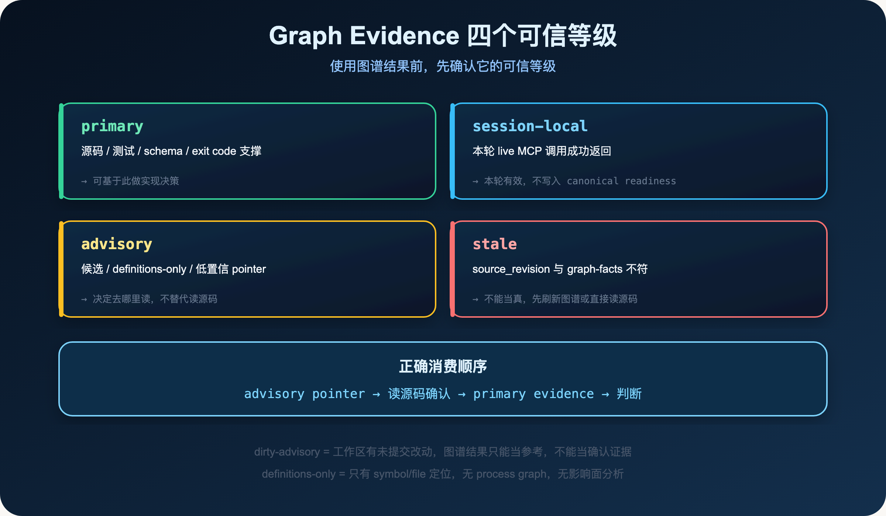
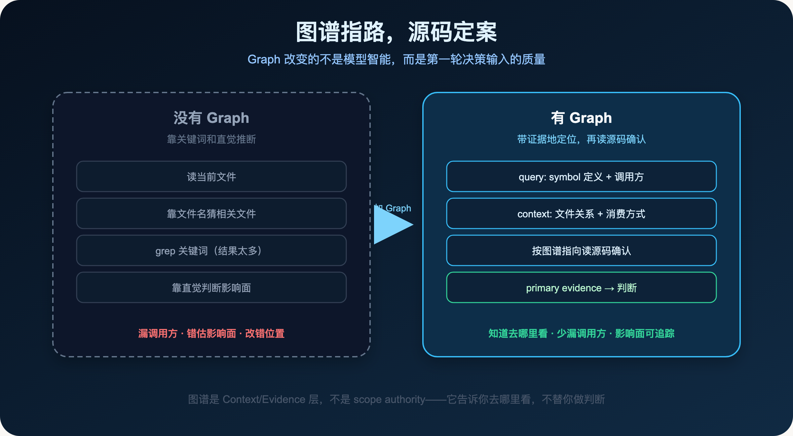

**好的代码图谱不是替代工程师判断，而是让工程师和 LLM 少从错误位置开始。**

> **导读**
> 这篇文章讨论一个很具体的问题：为什么 AI 总是在"看起来相关"的地方改代码，而不是在"真正相关"的地方？
> 我的答案是：没有结构化代码事实时，模型只能靠关键词和直觉猜。Graph 解决的不是智能，而是输入质量。

上一篇我们讨论了 Context Harness：给模型正确上下文，而不是无限上下文。

这篇继续往下走一层。

上下文的质量，很大程度上取决于模型对代码结构的理解。

而代码结构，是 Graph 要解决的问题。

---

## 01 AI 为什么总是在"看起来相关"的地方改代码

你有没有遇到过这种情况：

让 AI 修一个 bug，它改了一个文件，但漏掉了另外三个调用方。

让 AI 重构一个函数，它改了函数本身，但没有更新所有使用这个函数的地方。

让 AI 评估一个改动的影响面，它说"只影响这个模块"，但实际上还有一个 route handler 依赖了它。

这些问题有一个共同的根因：

> **模型在没有结构化代码事实的情况下，只能靠关键词、文件名、局部上下文来推断代码关系。**

这种推断对小任务够用。

一个函数、一个文件、一个明显的调用链——模型能看到，能处理。

但一旦涉及跨模块影响、隐式依赖、动态路由、接口消费者，这种推断就会开始出错。

不是因为模型不够聪明。

而是因为它拿到的输入，本来就不包含这些结构信息。

---

## 02 Graph 解决的不是智能，而是输入质量

代码图谱的价值，经常被误解为"让 AI 更聪明"。

这个理解是错的。

图谱解决的不是模型的推理能力，而是模型的**决策输入质量**。

没有图谱时，模型的工作流程大概是这样的：

```text
用户说"修复这个 bug"
→ 模型读当前文件
→ 靠关键词猜相关文件
→ 靠文件名猜调用关系
→ 靠局部上下文猜影响面
→ 开始修改
```

有图谱时，工作流程变成：

```text
用户说"修复这个 bug"
→ 图谱提供 symbol 定义、调用方、文件关系、route 映射
→ 模型知道"哪里可能相关"
→ 按图谱指向读源码确认
→ 开始修改
```

关键差别不是模型变聪明了，而是**第一轮决策输入的质量提高了**。

图谱是 Context/Evidence 层，不是 scope authority。

它告诉模型"去哪里看"，但不替模型做"该不该改"的判断。

---

## 03 spec-first 的 Graph evidence 边界

在 `spec-first` 里，Graph evidence 不是一个模糊词。

它有明确的可信等级，对应不同的使用方式。

### 03.1 四个可信等级

**`primary`（已确认）**

由源码、测试、schema、exit code 或 compiled readiness facts 支撑的证据。

这是最可信的等级。

模型可以基于 primary evidence 做实现决策。

**`session-local`（本轮可用）**

来自当前会话的 live MCP 调用结果。

比如这次 workflow 里刚刚成功调用了 GitNexus query，返回了一组 symbol 定位结果。

这些结果在本轮有效，但不会写入 canonical readiness，下次 workflow 不能直接复用。

**`advisory`（仅供参考）**

候选、fallback、definitions-only、低置信 pointer。

图谱给了一个方向，但还没有被源码或测试确认。

模型可以用 advisory evidence 来**决定去哪里读**，但不能用它来**替代读源码**。

**`stale`（已过期）**

当前 `source_revision` 或 `worktree_status_hash` 与 graph-facts 记录不符。

这意味着图谱是基于一个旧版本的代码库构建的。

stale evidence 不能当真，必须先刷新图谱或直接读源码。

### 03.2 一个真实的例子

就在写这篇文章的此刻，这个仓库的 `graph-facts.json` 里：

```json
{
  "freshness_state": "dirty-advisory",
  "dirty_classification": "graph-affecting-blocked",
  "limitations": [
    "Definitions-only GitNexus evidence: supports query/context/architecture
     orientation only; no process graph or GitNexus impact/review evidence
     is available."
  ],
  "capabilities": {
    "query_global_graph": true,
    "impact_context": false,
    "impact_context_limitations": [
      "definitions_only_no_process_graph",
      "definitions_only_no_impact_evidence",
      "definitions_only_no_related_tests"
    ]
  }
}
```

`freshness_state: dirty-advisory` 意味着工作区有未提交改动，图谱事实当前只能当参考。

`impact_context: false` 意味着这个图谱没有 process graph，无法提供影响面分析。

这不是图谱坏了，而是图谱在诚实地说明自己的能力边界。

这种诚实，正是 Evidence Harness 的核心：

> **不是假装拿到了确认证据，而是如实标注证据的可信等级和限制。**



四个等级决定了图谱结果能用到什么程度，以及下一步该做什么。

---

## 04 GitNexus 在 Harness 中的四条 lane

`spec-first` 把 GitNexus 的能力按使用场景分成四条 lane。

理解这四条 lane，能帮你判断什么时候用图谱、用哪种能力、用到什么程度。

### 04.1 deterministic-helper lane

包含：`query`、`context`、`impact`、`detect_changes`

这是最常用的 lane。

`query` 和 `context` 提供 symbol 定义、文件关系、架构定位。

`impact` 提供影响面分析（需要 process graph 支持，definitions-only 时不可用）。

`detect_changes` 检测当前 diff 涉及哪些 symbol 和文件。

这些能力的输出是确定性的：给定相同输入，输出相同结果。

它们适合作为 plan 和 work 阶段的 context 输入。

### 04.2 workflow-native session lane

包含：`route_map`、`api_impact`、`shape_check`、`tool_map`、`cypher`

这些能力更专业，适合特定场景：

- `route_map`：API route 和 handler 的映射关系
- `api_impact`：API 变更的影响面
- `shape_check`：response shape 的一致性检查
- `tool_map`：MCP/RPC tool surface 的映射
- `cypher`：直接查询图谱的 Cypher 语句（需要先做 schema/resource orientation）

这些能力的结果是 session-local 的：本轮 live MCP 调用成功返回，但不写入 canonical readiness。

### 04.3 workspace-resource lane

包含：`list_repos`、repo/group resources、group-aware `query/context/impact`

适合多仓 workspace 场景。

`list_repos` 列出 workspace 里的所有仓库。

group-aware 能力可以跨仓库查询 symbol 关系和影响面。

**重要边界：** 任何可能产生写入的工作（编辑、测试、changelog、commit），都必须先有明确的 `target_repo`。图谱发现的候选仓库只是参考，不是写入授权。

### 04.4 mutation-gated maintenance lane

包含：`group_sync`、`rename`、provider refresh/repair/analyze/build/index

这些能力会真正改动代码或图谱，必须 **preview-first**：先预览、用户确认、再执行。

它们不能进入普通 workflow 的自动执行路径。

`mutation-gated` 不等于 `unavailable`——能力可用，但必须经显式用户操作才能落地。

---

## 05 一个任务前后的对比

用一个具体例子说明图谱如何改变决策输入。

**场景：** 修改一个 CLI 命令的参数解析逻辑。

**没有 Graph 时：**

```text
1. 读当前文件（src/cli/commands/init.js）
2. 靠文件名猜相关文件（可能还有 src/cli/commands/doctor.js？）
3. 靠 grep 搜关键词（搜 "init"，结果太多）
4. 靠直觉判断影响面（"应该只影响 init 命令"）
5. 修改，祈祷没有漏掉什么
```

**有 Graph 时：**

```text
1. query: 查 init 命令的 symbol 定义和调用方
   → 返回：src/cli/commands/init.js 被 src/cli/plugin.js 调用
   → 返回：参数解析逻辑被 src/cli/bootstrap.js 引用
2. context: 查 bootstrap.js 里对 init 参数的消费方式
   → 返回：bootstrap.js 读取了 --lang 和 --user 参数
3. 读源码确认（这一步仍然必须做）
4. 修改，知道需要同时检查 plugin.js 和 bootstrap.js
```

图谱把"靠直觉猜"变成了"有方向地读"。

但注意：**图谱指路，源码定案。**

图谱告诉你去哪里看，但最终的判断必须基于你实际读到的源码。



两种工作流程的差别，不在于模型智能，而在于第一轮决策输入的质量。

---

## 06 Graph evidence 的正确消费方式

知道了图谱能做什么，还需要知道怎么正确消费它的输出。

### 06.1 先看 freshness 和 limitations

在使用任何图谱结果之前，先检查：

- `freshness_state` 是 fresh、dirty-advisory，还是 stale？
- `limitations` 里有没有 `definitions-only`、`no_process_graph`、`no_impact_evidence`？
- `capabilities.impact_context` 是 true 还是 false？

这些信息决定了图谱结果能用到什么程度。

`dirty-advisory` 时，图谱结果只能当参考，不能当确认证据。

`definitions-only` 时，图谱只能提供 symbol/file 定位，不能提供影响面分析。

### 06.2 图谱结果 → 源码确认 → 判断

正确的消费顺序是：

```text
图谱结果（advisory pointer）
→ 按图谱指向读源码（source read）
→ 源码确认后升级为 primary evidence
→ 基于 primary evidence 做判断
```

不能跳过中间的源码确认步骤。

`spec-first` 的 handoff summary 或上游 evidence summary 可以给出 `source_reads_required`，就是为了强制这个步骤。`context-bundle.v1` 本身只携带 summary/path 引用，不把这个字段做成 bundle 字段：

> 若 referenced summary 或上游 evidence summary 提供 `source_reads_required`，consumer 必须按其精确读取源码；不得把 summary 当 confirmed source fact。

### 06.3 provider 结果与源码冲突时，信源码

如果图谱说"A 调用了 B"，但你读源码发现 A 根本没有调用 B，信源码。

图谱可能是 stale 的，也可能是 definitions-only 的（只有 symbol 定义，没有 process graph）。

源码是当前真相，图谱是历史快照。

---

## 07 什么时候不要过度依赖 Graph

图谱很有价值，但不是所有场景都需要它。

**以下情况，直接读源码比依赖图谱更可靠：**

- `freshness_state: stale` 或 `dirty-advisory`，且任务对准确性要求高
- `limitations` 里有 `definitions-only`，但任务需要影响面分析
- provider 结果与源码或测试有明显冲突
- 任务本身是轻量修改：typo、注释、单文件局部修复、docs-only 变更

**以下情况，图谱能显著提升效率：**

- 跨模块影响面分析（需要 process graph 支持）
- 查找 symbol 的所有调用方
- API route 和 handler 的映射关系
- 多仓 workspace 的跨仓库依赖查询

判断标准很简单：

> **如果任务的正确性依赖于"找到所有相关位置"，图谱能帮你少漏。如果任务只涉及一个明确的文件，直接读源码更快。**

---

## 08 Graph evidence 解释卡

最后，给一张可以带走的参考卡。

**使用图谱结果前，先问三个问题：**

1. `freshness_state` 是什么？fresh / dirty-advisory / stale？
2. `limitations` 里有没有 definitions-only 或 no_process_graph？
3. 这个结果是 session-local（本轮 live 查询），还是 advisory（候选 pointer）？

**消费图谱结果的正确顺序：**

```text
图谱 pointer → 读源码确认 → primary evidence → 判断
```

**四条 lane 的使用场景：**

| Lane | 能力 | 适合场景 |
|---|---|---|
| deterministic-helper | query / context / impact / detect_changes | plan/work 阶段的 context 输入 |
| workflow-native-session | route_map / api_impact / shape_check / tool_map | API 变更、route 分析 |
| workspace-resource | list_repos / group-aware query | 多仓 workspace 定位 |
| mutation-gated | group_sync / rename | 仅限 preview-first 手动操作 |

**一句话总结：**

> 图谱指路，源码定案。Graph evidence 改善第一轮决策输入，但不替代源码确认。

---

## 09 本篇小结

代码图谱的价值，不是让 AI 看起来更高级。

它解决的是一个很朴素的问题：

> **在没有结构化代码事实的情况下，模型只能猜。有了图谱，它可以带证据地定位。**

`spec-first` 把 Graph 放在 Context/Evidence 层，而不是 scope authority 层。

图谱告诉模型去哪里看，但不替模型做"该不该改"的判断。

图谱结果必须标注 freshness 和 limitations，不能直接当 confirmed truth 用。

图谱 pointer 必须经过源码确认，才能升级为 primary evidence。

这就是 Evidence Harness 的核心：

> **AI 的结论必须能回答：证据从哪里来，可信到什么程度？**

---

`spec-first` 是开源项目，欢迎试用、提 issue、提建议。

**GitHub：** http://github.com/sunrain520/spec-first

**官网：** http://spec-first.cn/
