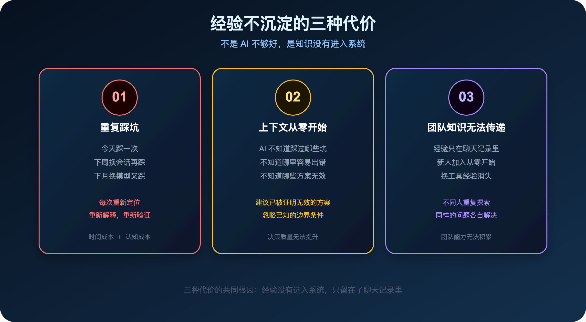
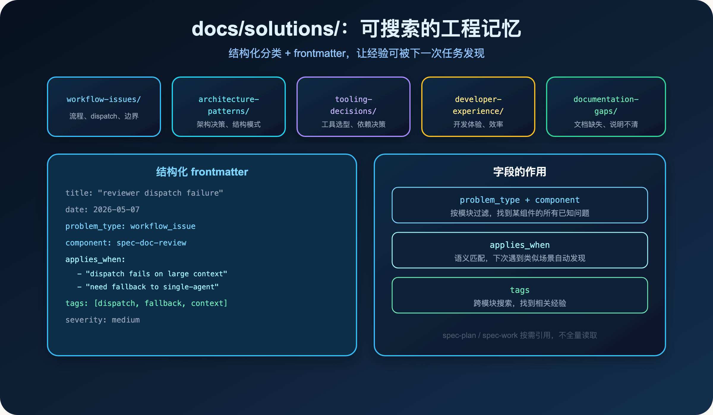
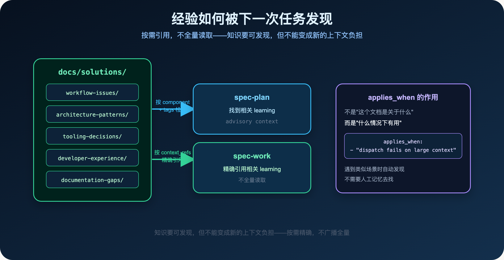
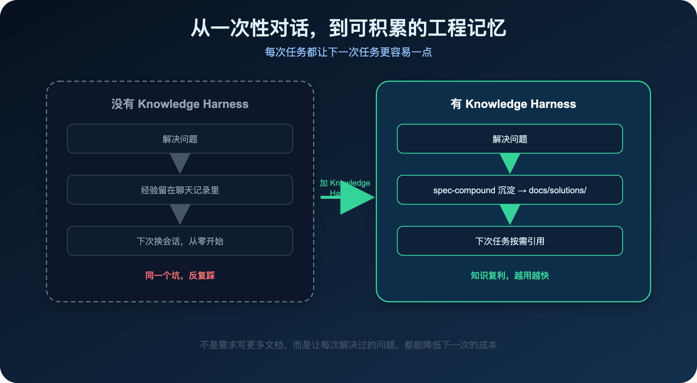
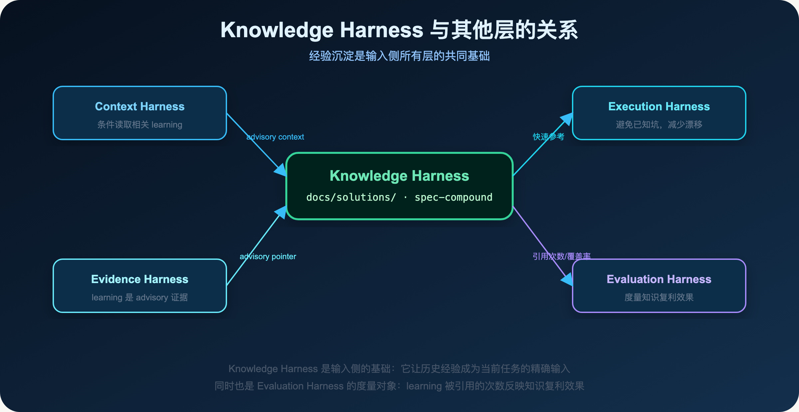
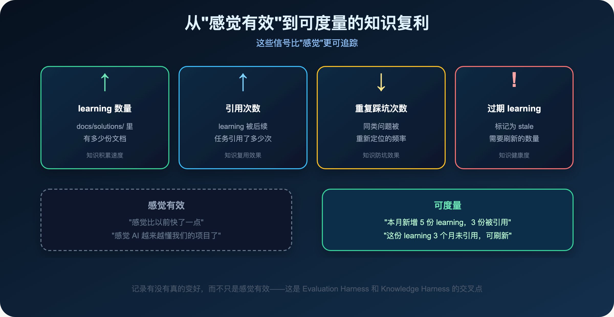

**AI coding 最大的浪费，不是单次任务的质量，而是每次任务的经验都消失了。**

> **导读**
> 前五篇我们讨论了怎么让 AI 在当前任务里做得更好：更好的上下文、更可信的代码事实、更清晰的边界。
> 这篇讨论另一个问题：任务做完之后，踩过的坑、解决过的问题，怎么让它变成下一次任务的输入优势？

---

## 01 一个让人沮丧的循环

你有没有遇到过这种情况：

上周花了两个小时，和 AI 一起定位了一个很隐蔽的 bug。

找到根因，修好了，验证通过，关掉窗口。

这周遇到了一个类似的问题。

你打开新会话，AI 不知道上周发生了什么，又开始从头分析。

你隐约记得上次的解法，但说不清楚细节，只能重新走一遍。

又花了一个小时。

这不是 AI 不够聪明。

这是一个工程系统问题：

> **每次任务的经验，都只留在了聊天记录里。**

聊天记录不是工程系统。

它不可搜索，不可引用，不可刷新，也不可被下一个 agent 发现。

它只是一段会话历史，随着上下文窗口滚动，慢慢消失。

更具体地说，这个循环是这样的：

第一次遇到问题 → 花时间定位 → 解决 → 关掉窗口。

第二次遇到类似问题 → 不记得上次的解法 → 重新定位 → 又花时间。

第三次 → 换了个 agent → 完全不知道之前发生过什么 → 再花一次时间。

每次都是从零开始。

每次都在重复同样的认知成本。

这就是 AI coding 里最隐蔽的效率损耗。

---

## 02 为什么 AI coding 的经验特别容易消失

传统软件工程里，经验的积累有很多载体：

- 代码注释里的 `// 这里有个坑，原因是...`
- 团队 wiki 里的故障复盘
- PR description 里的设计决策
- 口耳相传的"这块代码别乱动"
- 技术债务列表里的"已知问题"

这些载体不完美，但至少存在。

AI coding 里，这些载体大多消失了。

原因有三个：

**第一：AI 的工作方式是对话式的。**

你说，它做，做完关掉。

没有人会在 AI 帮你修完 bug 之后，再花时间把这次的经验写成文档。

这不是懒，而是对话式工作流的自然结果——任务完成就是终点，没有"任务完成后的沉淀"这个步骤。

**第二：AI 本身不会主动问。**

AI 不会在任务结束时问你：

> 这次解决的问题，值得记录下来吗？下次遇到类似情况，你希望 AI 能直接知道这个解法吗？

它只是完成了你交给它的任务，然后等待下一个指令。

**第三：会话上下文不是持久存储。**

即使你在这次会话里积累了很多有价值的上下文，下次打开新会话，这些都消失了。

AI 不记得上次的对话，不记得上次踩过的坑，不记得上次做过的决策。

每次都是一张白纸。

这三个原因加在一起，导致了一个结果：

> **AI coding 的经验积累速度，远低于传统软件工程。**

不是因为 AI 不够好，而是因为没有一个机制让经验进入系统。

---

## 03 经验不沉淀，代价是什么

很多团队用 AI coding 一段时间后，会发现一个奇怪的现象：

AI 的能力在进步，但团队的 AI coding 效率没有明显提升。

每次任务还是要花差不多的时间。

每次遇到类似问题，还是要重新解释一遍背景。

每次换一个 agent 或者换一个会话，之前积累的上下文就消失了。

这不是模型的问题。

这是**知识没有进入系统**的问题。

具体来说，有三种代价：



### 03.1 重复踩坑

同一个问题，今天踩一次，下周换个会话再踩一次，下个月换个模型又踩一次。

每次都要重新定位，重新解释，重新验证。

这种重复不只是时间成本，还有认知成本：

每次重新定位，你都要重新建立对这个问题的理解，重新判断影响面，重新验证解法。

即使你记得"上次好像是这个原因"，你也不确定这次是不是同样的情况，还是有什么变化。

### 03.2 上下文从零开始

每次新任务，AI 都不知道这个项目踩过哪些坑，有哪些已知的边界，哪些地方容易出错。

它只能靠当前会话里的信息做判断。

这意味着：

- 它可能建议一个你们已经试过、证明不可行的方案
- 它可能忽略一个你们已经知道的边界条件
- 它可能重复一个已经被记录为"不要这样做"的错误

不是因为它不够聪明，而是因为它没有这些背景知识。

### 03.3 团队知识无法传递

一个工程师积累了很多 AI coding 的经验，但这些经验只在他的聊天记录里。

新人加入，或者换一个工具，这些经验就消失了。

更隐蔽的情况是：同一个团队里，不同的人在用 AI 解决类似的问题，但彼此不知道对方已经解决过了。

每个人都在重复同样的探索过程。

这是一种很大的浪费。

---

## 04 Knowledge Harness 的核心思路

`spec-first` 的 Knowledge Harness 不是要求你写更多文档。

它的核心思路很简单：

> **在问题刚解决、上下文还新鲜的时候，把可复用的经验沉淀下来。**

不是事后整理，不是定期回顾，而是**任务结束时的自然动作**。

就像 git commit 是代码改动后的自然动作一样，`spec-compound` 是问题解决后的自然动作。

它会在合适的时机问你：

> 这次解决的问题，值得记录吗？

如果值得，它会帮你把经验写成一份结构化的文档，存入 `docs/solutions/`。

这个设计有几个关键点：

**第一：时机很重要。**

在问题刚解决的时候，上下文最新鲜，细节最清晰，根因最明确。

这时候写下来，质量最高，成本最低。

等到一周后再回来整理，很多细节已经模糊了，根因也不那么确定了。

**第二：结构化很重要。**

不是随便写一段文字，而是按照固定的结构：症状、根因、解决方案、预防策略。

这个结构让文档可以被精确检索，而不只是被人工阅读。

**第三：不强制，但有触发。**

`spec-compound` 不是每次任务结束都强制运行。

它有触发条件：当 AI 说"that worked"、"it's fixed"、"problem solved"时，会自动提示是否需要记录。

这样既不增加额外负担，又不会让有价值的经验悄悄消失。

---

## 05 docs/solutions/ 是什么

`docs/solutions/` 是 `spec-first` 里经验沉淀的落点。

它不是一个文档堆，而是一个**可搜索、可引用、可刷新的工程记忆**。

目录结构按问题类型分类：

```
docs/solutions/
├── workflow-issues/        # workflow 行为、dispatch、边界问题
├── architecture-patterns/  # 架构决策、结构模式
├── tooling-decisions/      # 工具选型、依赖决策
├── developer-experience/   # 开发体验、效率问题
└── documentation-gaps/     # 文档缺失、说明不清
```

每份文档都有结构化的 frontmatter：

```yaml
---
title: "reviewer dispatch failure during spec-doc-review fallback"
date: 2026-05-07
category: workflow-issues
problem_type: workflow_issue
component: spec-doc-review
severity: medium
applies_when:
  - "reviewer dispatch fails because the host gateway rejects large context"
  - "a doc-review workflow must fall back to single-agent review"
tags: ["dispatch", "fallback", "context-limit", "spec-doc-review"]
---
```

这些字段不是形式主义。

它们让文档可以被精确检索：

- 下次遇到类似问题，`spec-plan` 和 `spec-work` 可以按 `applies_when` 找到相关 learning
- 按 `component` 过滤，找到某个模块的所有已知问题
- 按 `tags` 搜索，找到跨模块的相关经验



结构化分类加上 frontmatter，让经验可以被下一次任务精确发现，而不是靠人工记忆。

---

## 06 两个 track：Bug 还是 Knowledge

`spec-first` 把 learning 分成两个 track，对应不同类型的经验。

### 06.1 Bug track：记录一个具体问题

Bug track 适合记录一个具体的问题是怎么发生的、怎么解决的。

结构包含：

- **症状**：可观察到的现象，比如错误信息、异常行为
- **根因**：为什么会发生这个问题
- **解决方案**：具体的修复步骤
- **预防策略**：下次怎么避免

一个真实的例子：

> **症状：** 并行 dispatch 6 个 reviewer agent，全部失败，返回 API Error 400 或 500
>
> **根因：** 一次性并行 dispatch 超出了宿主网关的上下文限制
>
> **解决方案：** 触发 fallback，切换到 single-agent report-only review
>
> **预防策略：** dispatch 前检查 capability gate，超出限制时自动降级

### 06.2 Knowledge track：记录一个实践或决策

Knowledge track 适合记录一个实践、模式或架构决策。

结构包含：

- **适用场景**：什么情况下这条 guidance 有效
- **指导原则**：具体的建议或做法
- **为什么这样做**：背后的原因和权衡
- **具体例子**：before/after 对比

一个真实的例子：

> **适用场景：** 修改 workflow 的 context orientation 时
>
> **指导原则：** 使用 `already-loaded host/project instructions`，而不是 `AGENTS.md / CLAUDE.md`
>
> **为什么：** 宿主进入仓库时通常已经把入口指令注入到会话，重复读取会浪费 token，并把当前任务需要的 source/test/diff evidence 挤出去
>
> **例子：** `Orient from already-loaded host/project instructions` vs `Orient from AGENTS.md / CLAUDE.md`

### 06.3 两个 track 的共同点

两个 track 都要说明"为什么"，不只是"怎么做"。

一份只记录"怎么做"的文档，很快就会过期。

代码变了，工具变了，具体步骤可能就不适用了。

但一份同时记录"为什么"的文档，即使具体步骤变了，核心判断仍然有价值。

比如"dispatch 前检查 capability gate"这条原则，即使具体的 gate 实现变了，这个原则本身仍然成立。

### 06.4 一份 learning 的完整结构

Bug track 的完整结构：

```markdown
## Problem
[1-2 句描述问题和用户可见的影响]

## Symptoms
- [可观察到的症状或错误信息]

## What Didn't Work
- [尝试过但失败的方案，以及为什么失败]

## Solution
[有效的修复方案，包含代码片段]

## Why This Works
[根因解释，以及为什么这个方案能解决它]

## Prevention
- [具体的实践、测试或防护措施]
```

Knowledge track 的完整结构：

```markdown
## Context
[什么情况、什么摩擦促使了这条 guidance]

## Guidance
[具体的实践或建议，包含代码示例]

## Why This Matters
[背后的原因和不遵守的后果]

## When to Apply
[适用条件]

## Examples
[before/after 对比或使用示例]
```

注意 `What Didn't Work` 这个 section。

它记录的是"尝试过但失败的方案"。

这是很多文档里缺失的部分，但它往往是最有价值的：

> **知道什么不管用，和知道什么管用，同样重要。**

下次遇到类似问题，AI 可以直接跳过那些已经被证明无效的方案，节省大量时间。

---

## 07 经验如何被下一次任务发现

沉淀下来的经验，如何被后续 workflow 发现？

`spec-first` 的做法是：**按需引用，不全量读取。**

### 07.1 spec-plan 的检索方式

`spec-plan` 在规划阶段，会按当前任务的 component 和 tags 检索 `docs/solutions/`，找到相关 learning，作为 advisory context 纳入计划。

比如，当你在规划一个涉及 `spec-doc-review` 的任务时，`spec-plan` 会找到所有 `component: spec-doc-review` 的 learning，把它们作为背景知识。

这样，AI 在规划时就已经知道这个组件有哪些已知问题，不会建议一个已经被证明不可行的方案。

### 07.2 spec-work 的引用方式

`spec-work` 在执行阶段，会按 `context_refs` 精确引用相关 learning，而不是把整个 `docs/solutions/` 都塞进上下文。

这和 Context Harness 的原则是一致的：

> **给模型正确上下文，而不是无限上下文。**

知识要可发现，但不能变成新的上下文负担。

### 07.3 applies_when 的语义匹配

`applies_when` 字段是 Knowledge Harness 里最重要的字段之一。

它描述的不是"这个文档是关于什么的"，而是"什么情况下这个文档有用"。

比如：

```yaml
applies_when:
  - "reviewer dispatch fails because the host gateway rejects large context"
  - "a doc-review workflow must fall back to single-agent review"
```

当 AI 在执行一个 doc-review 任务，遇到 dispatch 失败时，它可以通过 `applies_when` 找到这份 learning，而不需要人工告诉它"去看这个文档"。

这是 Knowledge Harness 的核心价值之一：

> **让经验在需要的时候自动出现，而不是靠人工记忆去找。**



按需精确引用，而不是全量广播——这让历史经验成为精确输入，而不是新的上下文负担。

---

## 08 经验会过期，需要维护

沉淀下来的经验不是永久有效的。

代码在变，工具在变，团队的做法也在变。

一份三个月前写的 learning，可能已经不适用了。

这是 Knowledge Harness 面临的一个真实挑战：

> **如何在不增加太多维护成本的情况下，保持 learning 的质量？**

`spec-first` 用 `spec-compound-refresh` 来处理这个问题。

### 08.1 有触发条件的维护

`spec-compound-refresh` 不是定期全量扫描，而是**有选择地维护**：

**触发条件一：新 learning 和旧 learning 高度重叠。**

当 `spec-compound` 写完一份新 learning，发现它和某份旧 learning 在五个维度（问题陈述、根因、解决方案、涉及文件、预防规则）上有高度重叠时，会建议更新旧文档而不是制造重复。

**触发条件二：重构或迁移让某些 learning 过期。**

当一次重构明显改变了某个模块的行为，相关的 learning 可能已经不准确了。这时候触发针对性的 refresh，而不是等到有人发现问题。

**触发条件三：用户明确指出某份 learning 已经过期。**

当有人说"这份文档说的不对了"，触发 refresh，更新或删除过期内容。

### 08.2 六种处理动作

`spec-compound-refresh` 对每份 learning 有六种处理动作：

| 动作 | 触发条件 | 结果 |
|---|---|---|
| **Keep** | 内容仍然准确，无需修改 | 不做任何改动 |
| **Update** | 路径、模块名、代码片段有漂移，但核心判断仍然正确 | 更新具体内容，保留文档 |
| **Consolidate** | 两份文档高度重叠，但都是正确的 | 合并到一份，删除被合并的那份 |
| **Replace** | 旧文档已经误导性，但有明确的替代方案 | 创建新文档，删除旧文档 |
| **Delete** | 相关代码已不存在，且没有后继者 | 直接删除 |
| **Stale-mark** | 分类模糊，证据不足以做出明确判断 | 标记为 stale，等待后续处理 |

这六种动作覆盖了 learning 生命周期的所有情况。

### 08.3 删除，而不是归档

`spec-compound-refresh` 有一条很有意思的设计原则：

> **删除，不要归档。**

很多团队会建一个 `_archived/` 目录，把过期的文档移进去。

这看起来很安全——文档没有消失，只是被归档了。

但实际上，归档目录会带来新的问题：

- 归档文档会积累，污染搜索结果
- 没有人会去读归档目录
- 两份说同一件事的文档（一份现行，一份归档）会慢慢说出不同的内容

`spec-compound-refresh` 的做法是：直接删除。

Git 历史会保留每一份被删除的文档。

如果有人需要找回一份旧文档，`git log --diff-filter=D -- docs/solutions/` 就能找到。

这个设计背后的哲学是：

> **知识库的价值在于质量，不在于数量。一份过期的文档，比没有文档更危险。**

因为过期的文档会误导 AI，让它基于错误的历史经验做判断。

### 08.4 维护的核心原则

> **知识维护应该是有触发条件的，而不是定期的全量扫描。**

全量扫描成本高，而且很多时候是在维护没有变化的内容。

有触发条件的维护，把精力集中在真正需要更新的地方。

这和 Context Harness 的原则也是一致的：

> **按需精确，不广播全量。**

---

## 09 一个完整的知识复利循环

把前面讲的内容串起来，Knowledge Harness 的完整循环是这样的：

```
解决问题
  ↓
spec-compound 沉淀 learning（docs/solutions/）
  ↓
下次任务：spec-plan 按 component/tags 检索相关 learning
  ↓
spec-work 按 context_refs 精确引用
  ↓
少踩同样的坑，任务更快完成
  ↓
再次解决问题时，更新或补充 learning
  ↓
知识复利
```



每次任务都让下一次任务更容易一点。

这就是 Knowledge Harness 的核心价值：

> **不是要求你写更多文档，而是让每次解决过的问题，都能降低下一次的成本。**

---

## 10 Knowledge Harness 和其他层的关系

Knowledge Harness 不是孤立的，它和前面讲过的几层 Harness 有密切的关系。



### 10.1 和 Context Harness 的关系

Context Harness 说：给模型正确上下文，而不是无限上下文。

Knowledge Harness 是 Context Harness 的一个重要输入来源。

`docs/solutions/` 里的 learning，是 Context Harness 里"条件读取"的一部分：

> 仅读取与 changed files 相关的 learning，不广播整个 `docs/solutions/`。

这两层加在一起，让"历史经验"成为当前任务的精确输入，而不是噪声。

### 10.2 和 Evidence Harness 的关系

Evidence Harness 说：结论必须有来源，而且来源要被分级。

Knowledge Harness 里的 learning，是 Evidence Harness 里 `advisory` 级别的证据。

它提供方向，但不替代当前任务的源码确认。

一份 learning 说"这个问题的根因是 X"，但当前任务遇到类似症状时，仍然需要读源码确认是不是同样的根因。

历史经验是线索，不是真相。

### 10.3 和 Execution Harness 的关系

Execution Harness 说：任务执行不能漂移，scope 和 handoff 不能丢。

Knowledge Harness 是 Execution Harness 的一个补充：

当任务执行中遇到已知问题，`docs/solutions/` 里的 learning 可以提供快速的参考，避免重新走一遍定位过程。

这让执行阶段更稳定，减少因为"不知道这个坑"而导致的 scope 扩张。

### 10.4 在完整工作流里的位置

`spec-first` 官网的最佳实践里，把 `spec-compound` 放在大需求拆分流程的最后一步：

```text
spec-brainstorm
  → spec-doc-review
  → spec-plan
  → spec-write-tasks
  → spec-work
  → spec-code-review
  → spec-compound   ← 经验沉淀在这里发生
```

这个位置不是偶然的。

`spec-compound` 在 `spec-code-review` 之后运行，意味着它能拿到最完整的上下文：

- 任务已经完成，解法已经验证
- review 已经完成，质量已经确认
- 所有的"什么没有用"和"什么有用"都已经清晰

这时候沉淀下来的经验，质量最高。

### 10.5 团队协作场景

`spec-first` 官网的最佳实践里，对团队协作有一条明确建议：

> 多人维护同一模块：用 `AGENTS.md` / `CLAUDE.md` / `docs/contracts/**` 固化项目规则，用 `compound` 沉淀稳定解法。

> 新成员接手：先读 `docs/plans/`、`docs/solutions/` 和最近 review findings。

这两条建议背后的逻辑是：

`docs/solutions/` 是团队共享的长期知识库，应该提交到 Git，让所有人都能访问。

它不是某个人的私有笔记，而是团队的工程记忆。

当新成员加入，他们不需要从零开始，也不需要靠口耳相传——直接读 `docs/solutions/`，就能了解这个项目踩过哪些坑，有哪些已知的边界。

---

## 11 从"感觉有效"到"可度量的改进"

很多团队用 AI coding 的方式，是靠感觉判断效果：

> "感觉比以前快了一点。"
> "感觉 AI 越来越懂我们的项目了。"

这种感觉很难量化，也很难持续改进。

Knowledge Harness 提供了一个更可度量的视角：

- `docs/solutions/` 里有多少份 learning？
- 这些 learning 被引用了多少次？
- 有多少次任务因为找到了相关 learning 而避免了重复踩坑？
- 有多少份 learning 已经过期，需要刷新？

这些不是完美的指标，但它们比"感觉"更可追踪。

当你能看到"这个月新增了 5 份 learning，其中 3 份在后续任务里被引用了"，你就知道 Knowledge Harness 在发挥作用。

当你看到"这份 learning 已经 3 个月没有被引用了，而且相关代码已经重构了"，你就知道该刷新或删除它了。

这就是 `spec-first` 里 Evaluation Harness 和 Knowledge Harness 的交叉点：

> **记录有没有真的变好，而不只是感觉有效。**



这些信号不是完美的指标，但它们比"感觉"更可追踪，也更容易发现问题。

---

## 12 本篇小结

AI coding 最大的浪费，不是单次任务的质量，而是每次任务的经验都消失了。

`spec-first` 的 Knowledge Harness 用三个机制来解决这个问题：

- **`docs/solutions/`**：结构化的经验落点，按类型分类，带 frontmatter，可搜索可引用
- **`spec-compound`**：在问题刚解决时，把可复用的经验沉淀下来
- **`spec-compound-refresh`**：有选择地维护过期的 learning，而不是全量扫描

这三个机制加在一起，让 AI coding 从"一次性对话"走向"可积累的工程记忆"。

如果你现在的 AI coding 流程里，每次任务结束后什么都没有留下，那么问题不是 AI 不够好。

问题是：

> **你还没有一个让经验进入系统的机制。**

Knowledge Harness 要做的，就是把这个机制建起来。

让每次踩过的坑，都变成下一次任务的输入优势。

让每次解决过的问题，都降低下一次的成本。

让 AI coding 的经验，真正开始复利。

下一篇，我想写：

> **Spec 不是文档负担，是给 Agent 的压缩上下文**

很多人觉得写 Spec 是额外负担。

但 Spec 的真正价值，是把任务目标、边界、非目标压缩成一个可被 Agent 精确消费的输入。

---

`spec-first` 是开源项目，欢迎试用、提 issue、提建议。

**GitHub：** http://github.com/sunrain520/spec-first

**官网：** http://spec-first.cn/
