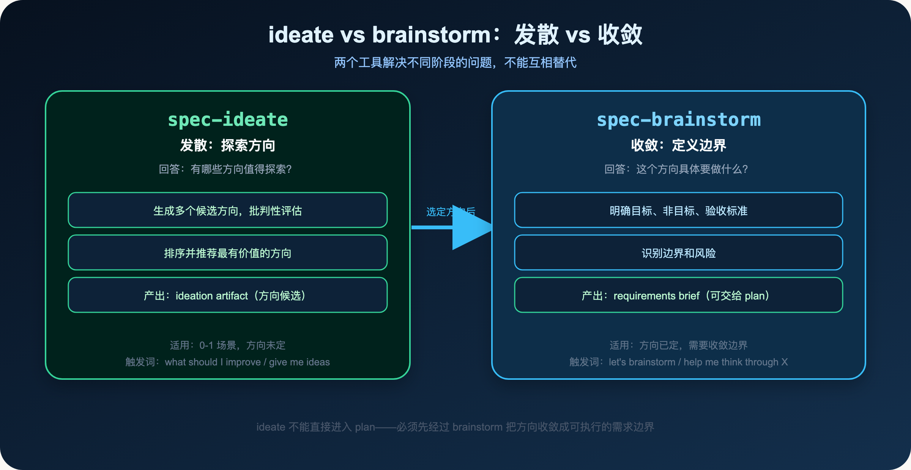
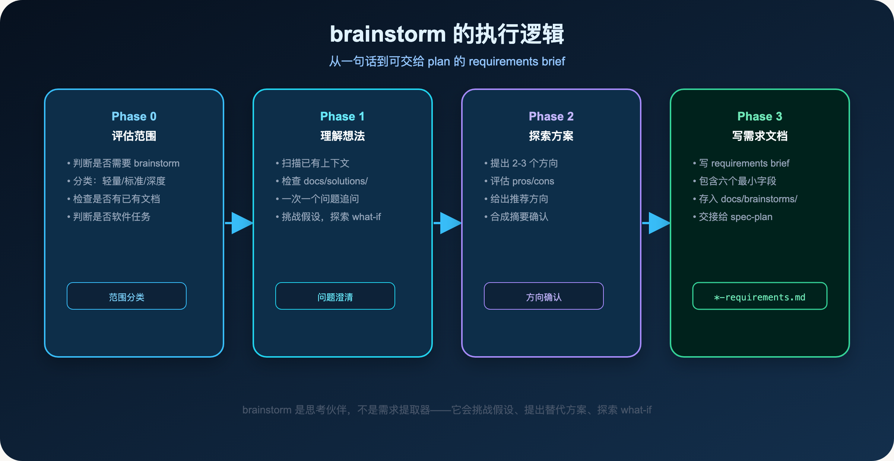
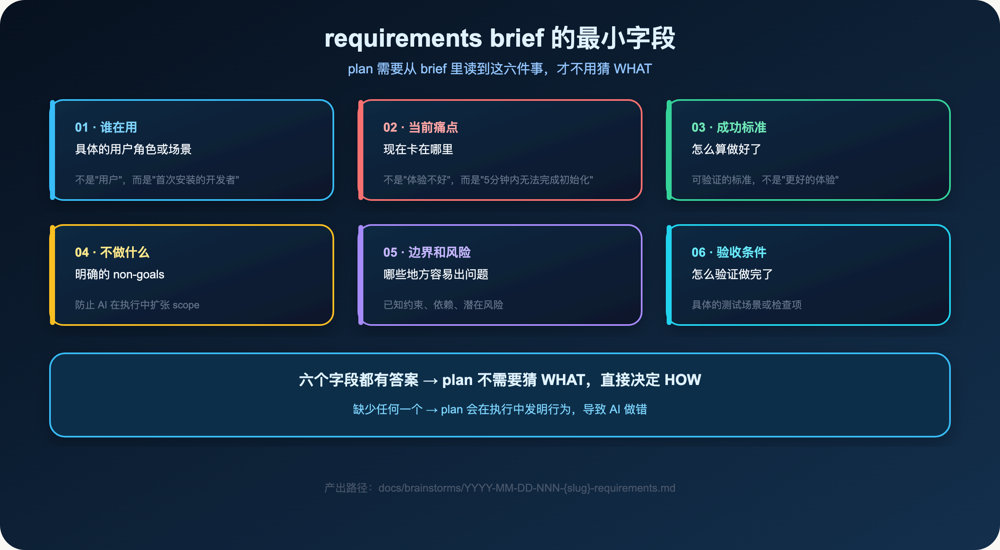
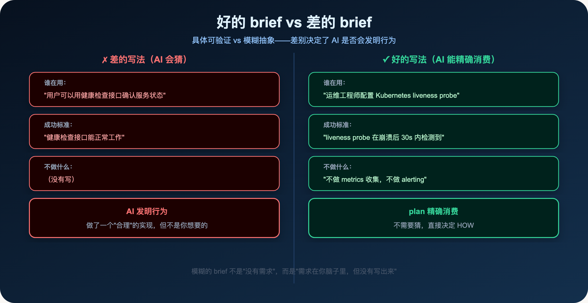
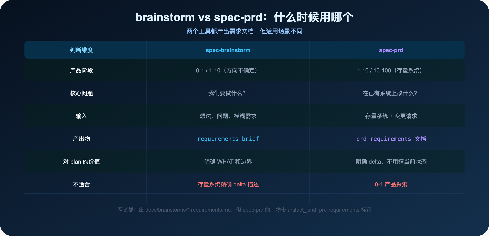
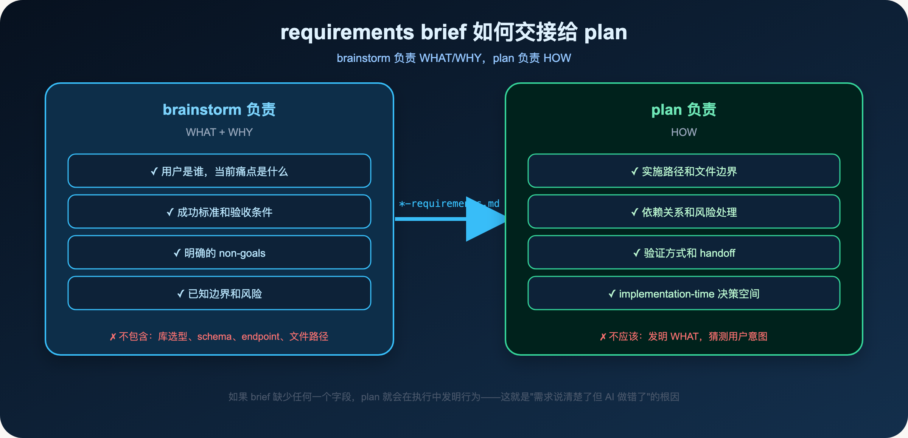

**说清楚了，不等于写清楚了。意图显式化是委派的前提。**

> **导读**
> 你跟 AI 说了很多，它也听懂了，但最后做出来的东西还是不对。
> 这篇文章解释为什么会这样，以及 brainstorm 如何把"说清楚"变成"写清楚"。

---

## 01 一个让人沮丧的场景

你跟 AI 说：

> "帮我给这个 CLI 工具加一个健康检查接口，用户可以用它来确认服务是否正常运行。"

AI 开始工作。

它读了代码，写了一个 `/health` 接口，返回 `{"status": "ok"}`。

你看了一眼，感觉不对。

你想要的是：检查数据库连接、检查依赖服务、返回详细的状态信息、支持 Kubernetes 的 liveness 和 readiness probe。

但你没有说这些。

你以为"健康检查接口"这个词已经说清楚了。

AI 也以为它理解了你的意思。

但你们理解的是不同的东西。

这就是 AI coding 里最常见的失败模式：

> **需求在你脑子里是清楚的，但没有被写成 AI 可以精确消费的格式。**

---

## 02 为什么"说清楚了"还是不够

人和人之间的沟通，有大量的隐含上下文。

当你说"健康检查接口"，你的同事可能立刻理解你的意思——因为他们知道你们的系统架构，知道你们的部署环境，知道你们之前讨论过的设计决策。

AI 没有这些上下文。

它只有你在这次会话里说的话。

更重要的是：AI 会在你没有说清楚的地方**发明行为**。

它不会停下来问你"你想要什么样的健康检查"，它会根据自己的理解做一个"合理"的实现。

这个"合理"的实现，可能和你想要的完全不同。

这就是为什么 spec-first 强调**意图显式化**：

> **不是让 AI 猜你的意图，而是把意图写成可审查的格式，让 AI 精确消费。**

---

## 03 ideate vs brainstorm：两个工具，两个阶段

在讨论 brainstorm 之前，先说清楚它和 ideate 的区别。



### 03.1 spec-ideate：发散，探索方向

`spec-ideate` 回答的问题是：**有哪些方向值得探索？**

它适合你连需求方向都不确定的时候。

比如：

- "我想改进这个 CLI 工具，但不知道从哪里入手"
- "我们的 API 性能有问题，有哪些优化方向"
- "这个功能有多种实现方式，哪种最值得做"

ideate 会生成多个候选方向，批判性地评估每个方向的价值，然后推荐最有价值的方向。

**触发词：** "what should I improve"、"give me ideas"、"ideate on X"、"surprise me"

### 03.2 spec-brainstorm：收敛，定义边界

`spec-brainstorm` 回答的问题是：**这个方向具体要做什么？**

它适合你已经知道大概要做什么，但边界还不清楚的时候。

比如：

- "我要给 CLI 加健康检查接口，但不确定要检查哪些东西"
- "我要改进首次使用体验，但不知道改到什么程度"
- "我要重构这个模块，但不确定哪些部分要改"

brainstorm 会通过对话，帮你明确目标、非目标、验收标准和边界。

**触发词：** "let's brainstorm"、"help me think through X"、"I want to build..."

### 03.3 两者的关系

ideate 在前，brainstorm 在后。

ideate 选方向，brainstorm 定边界。

**ideate 不能直接进入 plan。** 必须先经过 brainstorm，把方向收敛成可执行的需求边界，才能交给 plan。

---

## 04 brainstorm 的执行逻辑

brainstorm 不是一个简单的问答工具，它有完整的执行逻辑：



### 04.1 Phase 0：评估范围

brainstorm 首先会评估这个任务的范围：

- **轻量**：小、边界清晰、低歧义。直接确认理解，写简短的需求文档。
- **标准**：正常功能或有界重构，有一些决策要做。走完整的对话流程。
- **深度**：跨模块、战略性、高歧义。需要更深入的探索。

如果需求已经很清楚，brainstorm 会跳过大部分对话，直接写需求文档。

### 04.2 Phase 1：理解想法

brainstorm 会先扫描已有上下文：

- 检查 `docs/brainstorms/` 里是否有相关的已有文档
- 检查 `docs/solutions/` 里是否有相关的历史经验
- 读取已加载的 host/project instructions

然后通过对话理解你的想法。

**关键原则：一次只问一个问题。**

brainstorm 不会一次性抛出一堆问题，而是每次只问最重要的那一个。这样你的回答会更聚焦，对话质量更高。

它也会挑战你的假设，提出替代方案，探索 what-if——它是思考伙伴，不是需求提取器。

### 04.3 Phase 2：探索方案

如果有多个可行方向，brainstorm 会提出 2-3 个方案，评估每个方案的 pros/cons，然后给出推荐。

它会先展示所有方案，再给出推荐——不会一开始就锚定一个方向，让你看不到其他可能性。

### 04.4 Phase 3：写需求文档

对话结束后，brainstorm 会写一份 requirements brief，存入 `docs/brainstorms/`：

```
docs/brainstorms/2026-06-01-001-cli-health-check-requirements.md
```

这份文档是后续所有步骤的 WHAT 来源。

---

## 05 requirements brief 的最小字段

一份好的 requirements brief，必须让 plan 不需要猜 WHAT。



### 05.1 谁在用

不是"用户"，而是具体的用户角色或场景。

**差的写法：** "用户可以用健康检查接口确认服务状态"

**好的写法：** "运维工程师在 Kubernetes 部署时，需要配置 liveness 和 readiness probe"

具体的用户角色，让 plan 知道这个功能的使用场景，从而做出更合适的设计决策。

### 05.2 当前痛点

不是"体验不好"，而是具体的问题。

**差的写法：** "现在没有健康检查，不方便"

**好的写法：** "Kubernetes 无法判断服务是否真正就绪，导致流量在服务启动期间就被路由过来，出现 502 错误"

具体的痛点，让 plan 知道这个功能要解决什么问题，从而判断哪些实现细节是必要的。

### 05.3 成功标准

可验证的标准，不是"更好的体验"。

**差的写法：** "健康检查接口能正常工作"

**好的写法：** "Kubernetes liveness probe 在服务崩溃后 30 秒内检测到，readiness probe 在服务启动完成前返回 503"

可验证的成功标准，让 plan 知道怎么算做好了，也让 work 知道怎么验证。

### 05.4 不做什么（non-goals）

明确的 non-goals，防止 AI 在执行中扩张 scope。

**例子：**
- 不做 metrics 收集（那是 Prometheus 的职责）
- 不做 alerting（那是 PagerDuty 的职责）
- 不做 dashboard（那是 Grafana 的职责）

没有 non-goals，AI 很容易在执行中"顺手"做一些你没有要求的事情，导致 scope 扩张。

**为什么 non-goals 比 goals 更重要？**

goals 描述的是你想要什么，AI 会尽力实现。

non-goals 描述的是你不想要什么，AI 在没有明确说"不做"的地方，会做出"合理"的扩展。

一个没有 non-goals 的需求，就像一个没有边界的任务——AI 不知道该在哪里停下来。

### 05.5 边界和风险

已知约束、依赖、潜在风险。

**例子：**
- 依赖数据库连接，数据库不可用时接口应该返回什么？
- 健康检查本身的性能开销，不能影响正常请求
- 需要兼容现有的 `/api/v1/` 路由前缀

边界和风险，让 plan 知道哪些地方需要特别注意，哪些地方有已知的约束。

这些信息如果不写在 brief 里，plan 就要在执行中自己发现——而发现的时候，可能已经做了很多工作。

### 05.6 验收条件

具体的测试场景或检查项。

**例子：**
- `GET /health` 返回 200 时，所有依赖服务都正常
- `GET /health` 返回 503 时，至少有一个依赖服务不可用
- 响应时间 < 100ms（不包括依赖服务的响应时间）

验收条件，让 work 知道怎么验证，让 review 知道怎么检查。

没有验收条件，"做完了"就变成了一个主观判断——AI 认为做完了，但你可能认为还差很多。

### 05.7 实现细节不属于 brief

一个常见的误区是：在 brief 里写实现细节。

比如：

- "用 Express.js 实现健康检查接口"
- "在 `src/routes/health.ts` 里添加路由"
- "返回格式是 `{"status": "ok", "timestamp": "..."}`"

这些是 HOW，不是 WHAT。

把 HOW 写进 brief，会限制 plan 的决策空间，也会让 brief 很快过期（因为实现细节会变，但需求不会）。

**原则：brief 只写 WHAT 和 WHY，不写 HOW。**

---

## 06 一个真实的 requirements brief 长什么样

让我们看一个真实的例子。

这是 spec-first 项目里的一份 requirements brief（简化版）：

```markdown
---
title: "改进 CLI 首次使用体验"
date: 2026-06-01
artifact_kind: requirements
---

## 目标

让首次安装 spec-first 的开发者，在 5 分钟内完成初始化并进入第一个 workflow。

## 用户

首次安装 spec-first 的开发者，熟悉 Node.js 和 Git，但不了解 spec-first 的工作方式。

## 当前痛点

- `spec-first doctor` 的输出不够清晰，不知道哪些是必须修复的，哪些是可选的
- `spec-first init` 完成后没有明确提示"下一步做什么"
- 首次运行 mcp-setup 时，provider 配置失败的错误信息不够具体

## 成功标准

- 首次安装后，按照提示操作，5 分钟内完成 init + mcp-setup + graph-bootstrap
- doctor 的输出清晰区分 ERROR / WARN / INFO，每个 ERROR 都有具体的 Fix 建议
- init 完成后，输出"下一步：在宿主里运行 /spec:mcp-setup"

## 不做什么

- 不改 CLI 的核心功能
- 不改 workflow 的行为
- 不做 GUI 或 web 界面

## 验收条件

- 新用户按照 doctor 的提示，能独立完成初始化
- init 完成后的提示，包含具体的下一步命令
- mcp-setup 失败时，错误信息包含具体的修复步骤
```

注意这份文档的特点：

- 没有提到任何实现细节（不提库、不提文件路径、不提代码结构）
- 每个字段都有具体的、可验证的内容
- non-goals 明确排除了可能的 scope 扩张

这就是 plan 需要的输入。

好的 brief 和差的 brief，差别在于是否具体可验证：



模糊的 brief 不是"没有需求"，而是"需求在你脑子里，但没有写出来"。brainstorm 的价值，就是帮你把脑子里的需求写出来。

---

## 07 brainstorm 的三个关键问题

brainstorm 在对话中，会重点追问三个问题：

### 07.1 谁在用，当前卡在哪里

这是最重要的问题。

很多需求描述的是"我想要什么"，而不是"谁在什么场景下遇到了什么问题"。

前者容易导致 AI 做出一个"功能上正确"但"场景上不对"的实现。

后者让 AI 知道这个功能的真实使用场景，从而做出更合适的设计决策。

**一个具体的例子：**

"我想要一个健康检查接口"——这是"我想要什么"。

"运维工程师在 Kubernetes 部署时，需要配置 liveness 和 readiness probe，但现在没有接口可以用"——这是"谁在什么场景下遇到了什么问题"。

两种描述，会导致完全不同的实现。

前者可能只是一个返回 `{"status": "ok"}` 的简单接口。

后者会考虑 liveness 和 readiness 的区别、Kubernetes 的 probe 配置、服务启动期间的状态变化。

### 07.2 成功是什么，怎么验证

这是最容易被忽略的问题。

很多需求描述了"做什么"，但没有描述"做到什么程度算好了"。

没有成功标准，AI 会做一个"看起来完成了"的实现，但可能和你的预期差很远。

**成功标准的三个层次：**

- **功能层**：接口能正常工作（最基本，但不够）
- **行为层**：在特定场景下有特定的行为（更具体）
- **指标层**：可量化的性能或质量指标（最精确）

好的成功标准，至少要到行为层。

"健康检查接口能正常工作"——功能层，不够。

"liveness probe 在服务崩溃后 30 秒内检测到"——行为层，够了。

"响应时间 < 100ms，P99 < 200ms"——指标层，更精确。

### 07.3 不做什么

这是最有价值的问题。

明确的 non-goals，比模糊的 goals 更有价值。

因为 AI 在执行中，会在你没有明确说"不做"的地方，做出"合理"的扩展。

明确说"不做什么"，是防止 scope 扩张最有效的方式。

**一个真实的例子：**

在 spec-first 的开发过程中，有一次需求是"改进 CLI 的错误提示"。

没有写 non-goals。

AI 在改进错误提示的同时，"顺手"重构了错误处理的整体架构，改了十几个文件。

功能上是对的，但 scope 远超预期。

如果当时写了"不改错误处理的架构，只改提示文案"，就不会发生这种情况。

---

## 08 什么时候 brainstorm 就够了，什么时候需要 spec-prd



### 08.1 brainstorm 就够了的情况

- 0-1 场景：全新功能，方向不确定
- 1-10 场景：已有产品，增量功能，需求较清晰
- 需求边界相对简单，不需要精确描述存量系统的状态

### 08.2 需要 spec-prd 的情况

- 10-100 场景：存量系统，增量需求
- 需要精确描述"当前系统是什么样的"和"这次改动要改什么"
- plan 需要知道 current-state evidence 才能做出正确的设计决策

**关键区别：**

brainstorm 适合"我要做什么"，spec-prd 适合"在已有系统上改什么"。

两者都产出 `docs/brainstorms/*-requirements.md`，但 spec-prd 的产物带 `artifact_kind: prd-requirements` 标记，质量更高，plan 可以直接消费。

---

## 09 requirements brief 如何交接给 plan



brainstorm 和 plan 有明确的边界：

**brainstorm 负责 WHAT + WHY：**
- 用户是谁，当前痛点是什么
- 成功标准和验收条件
- 明确的 non-goals
- 已知边界和风险

**plan 负责 HOW：**
- 实施路径和文件边界
- 依赖关系和风险处理
- 验证方式和 handoff
- implementation-time 决策空间

**plan 不应该发明 WHAT。**

如果 requirements brief 缺少任何一个字段，plan 就会在执行中发明行为——这就是"需求说清楚了但 AI 做错了"的根因。

---

## 10 本篇小结

"需求说清楚了，AI 还是做错了"——这个问题的根因，不是 AI 不够聪明，而是需求没有被写成 AI 可以精确消费的格式。

spec-first 用两个工具解决这个问题：

- **`spec-ideate`**：发散，探索方向，适合 0-1 场景
- **`spec-brainstorm`**：收敛，定义边界，产出 requirements brief

一份好的 requirements brief 必须回答六个问题：谁在用、当前痛点、成功标准、不做什么、边界和风险、验收条件。

六个字段都有答案，plan 才不需要猜 WHAT，直接决定 HOW。

这就是意图显式化：

> **不是让 AI 猜你的意图，而是把意图写成可审查的格式，让 AI 精确消费。**

下一篇：

> **Spec-First：改老系统时，AI 最容易在哪里翻车**

存量系统的增量需求，有一个特殊的挑战：AI 不知道当前系统是什么样的。spec-prd 的 brownfield 逻辑，就是为了解决这个问题。

---

`spec-first` 是开源项目，欢迎试用、提 issue、提建议。

**GitHub：** http://github.com/sunrain520/spec-first

**官网：** http://spec-first.cn/
