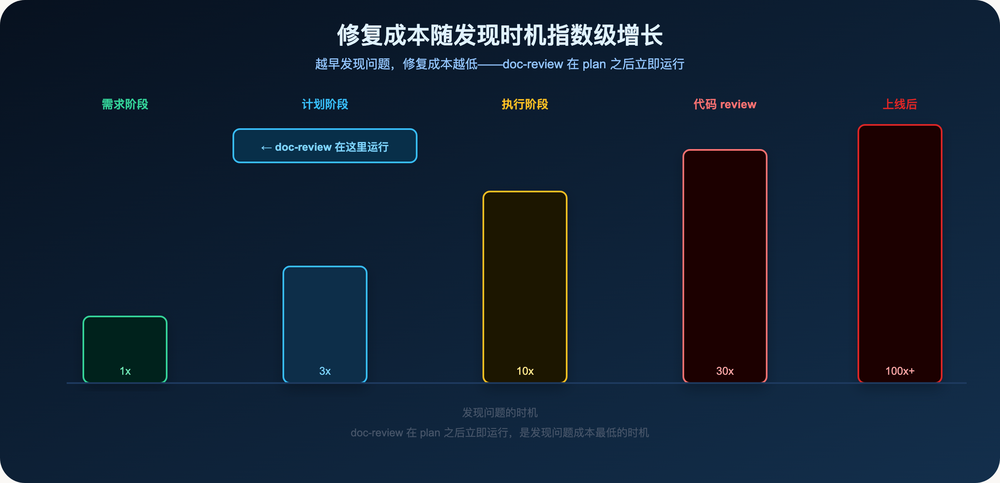
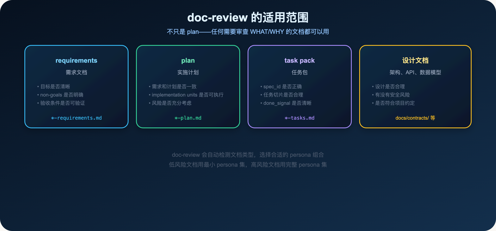
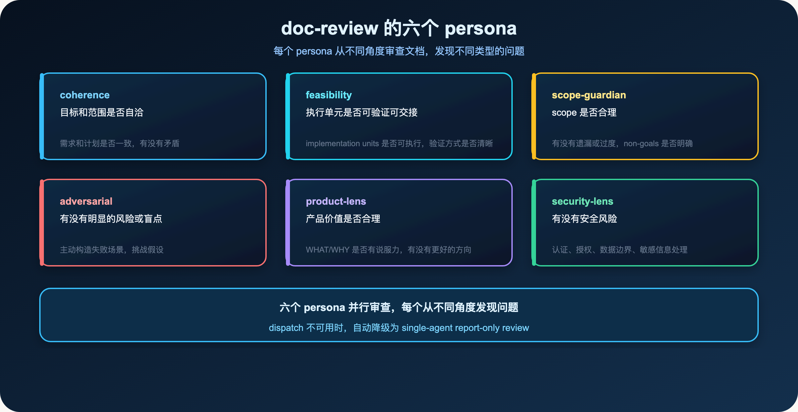
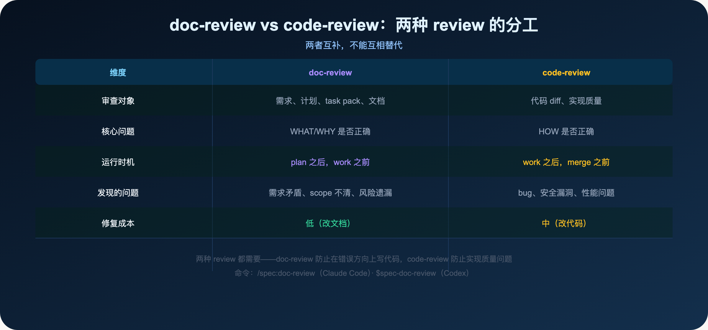
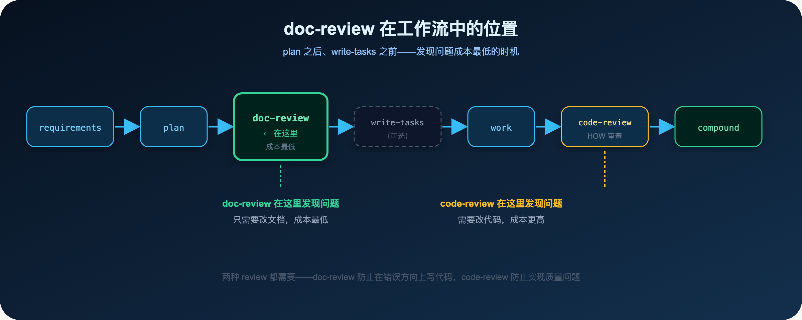
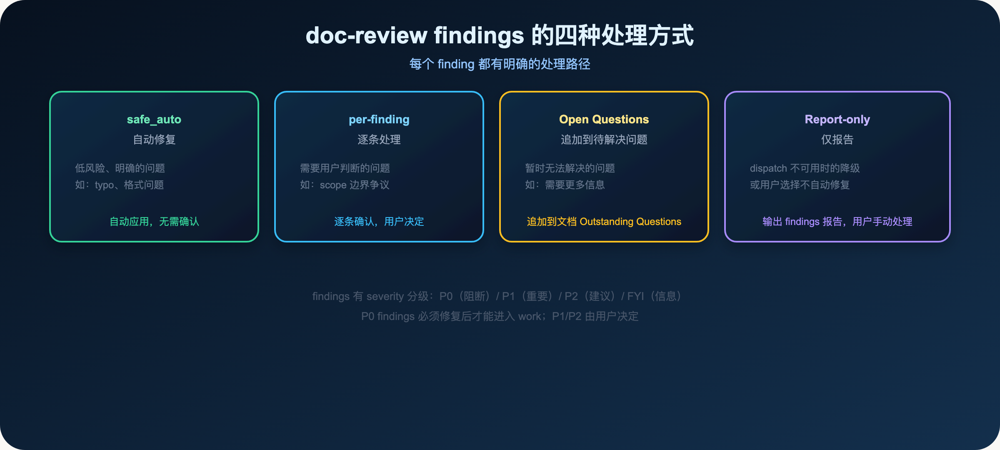

**代码 review 只是最后一道关——需求和计划的 review 更重要。**

> **导读**
> 你有没有遇到过这种情况：代码写完了，review 的时候才发现需求理解错了，或者计划里有一个关键的遗漏。
> 这篇文章解释为什么这种错误可以提前避免，以及 doc-review 如何在成本最低的时机发现问题。

---

## 01 为什么代码写完才发现需求理解错了

这是一个很常见的场景：

你拿到需求，写了 plan，开始执行。

代码写了一半，review 的时候发现：

- 需求里有一个关键的 edge case 没有考虑
- plan 里的某个 implementation unit 和需求有矛盾
- 有一个重要的 non-goal 没有写清楚，AI 做了你不想要的事情

这时候修复的成本很高：

- 已经写的代码可能需要推翻重来
- 已经做的设计决策可能需要重新评估
- 已经花的时间无法挽回

这不是 AI 的问题，也不是 review 的问题。

这是**发现问题的时机太晚**的问题。

**为什么会这么晚才发现？**

因为大多数人的 review 流程是：写代码 → review 代码。

这个流程只有一道关：代码 review。

但代码 review 只能发现"HOW 有没有问题"，不能发现"WHAT 有没有问题"。

如果 WHAT 本身就是错的，代码 review 发现不了。

**一个真实的例子：**

在 spec-first 的开发过程中，有一次任务是"改进 CLI 的错误提示"。

plan 写完后，直接进入了 work。

代码写完后，review 的时候发现：plan 里有一个 implementation unit 假设了一个不存在的 API，导致整个 unit 需要重新设计。

如果在 plan 之后立即运行 doc-review，这个问题会在代码还没写之前就被发现，修复成本只是改一行 plan。

---

## 02 修复成本随发现时机指数级增长



这张图说明了一个简单的道理：

- 需求阶段发现问题：改一行文字，成本 1x
- 计划阶段发现问题：改 plan，成本 3x
- 执行阶段发现问题：改代码，成本 10x
- 代码 review 发现问题：改代码 + 重新 review，成本 30x
- 上线后发现问题：hotfix + 回滚 + 用户影响，成本 100x+

**doc-review 在 plan 之后立即运行，是发现问题成本最低的时机。**

在代码还没有写之前，发现需求或计划的问题，只需要改文档。

这比在代码写完后发现问题，要便宜得多。

---

## 03 doc-review 是什么

doc-review 是 spec-first 里专门用于审查文档的 workflow。

它和 code-review 是两个不同的工具，解决不同的问题：

- **doc-review**：审查 WHAT/WHY——需求是否清晰，计划是否合理，scope 是否正确
- **code-review**：审查 HOW——实现是否正确，有没有 bug，安全性如何

两者互补，不能互相替代。

**doc-review 的核心价值：**

在代码还没有写之前，发现需求或计划的问题。

这是发现问题成本最低的时机。

**使用方式：**

```text
/spec:doc-review docs/plans/2026-06-01-001-cli-health-check-plan.md
$spec-doc-review docs/plans/2026-06-01-001-cli-health-check-plan.md
```

也可以不指定文档路径，doc-review 会自动找到最近的 plan 或 requirements 文档：

```text
/spec:doc-review
$spec-doc-review
```

**doc-review 的输入：**

- 需求文档（`docs/brainstorms/*-requirements.md`）
- 计划文档（`docs/plans/*-plan.md`）
- 任务包（`docs/tasks/*-tasks.md`）
- 设计文档（`docs/contracts/` 等）

**doc-review 的输出：**

- findings 列表，每个 finding 有 severity、confidence、recommended action
- 可选：自动应用 safe_auto 修复
- 可选：追加到 Outstanding Questions

---

## 04 doc-review 的适用范围



doc-review 不只是用于 plan，它可以审查任何需要审查 WHAT/WHY 的文档：

### 04.1 requirements（需求文档）

审查需求文档时，doc-review 关注：

- 目标是否清晰，有没有歧义
- non-goals 是否明确，防止 scope 扩张
- 验收条件是否可验证
- 有没有遗漏的 edge case

### 04.2 plan（实施计划）

审查 plan 时，doc-review 关注：

- 需求和计划是否一致（faithfulness）
- implementation units 是否可执行
- 验证方式是否清晰
- 风险是否充分考虑

**注意：** 审查 plan 时，doc-review 不会重新审查 requirements 里的 WHAT/WHY，而是关注 plan 的执行可行性和与 requirements 的一致性。

### 04.3 task pack（任务包）

审查 task pack 时，doc-review 关注：

- spec_id 和 source_plan_hash 是否正确
- 任务切片是否合理
- done_signal 是否清晰
- 有没有遗漏的依赖关系

### 04.4 设计文档

审查架构、API、数据模型等设计文档时，doc-review 关注：

- 设计是否合理
- 有没有安全风险
- 是否符合项目约定

---

## 05 doc-review 的六个 persona



doc-review 通过六个 persona 从不同角度审查文档：

### 05.1 coherence（一致性）

检查文档内部是否自洽：

- 目标和范围是否一致
- 需求和计划是否一致
- 有没有内部矛盾

### 05.2 feasibility（可行性）

检查执行单元是否可执行：

- implementation units 是否有清晰的验证方式
- done_signal 是否明确
- 依赖关系是否合理

### 05.3 scope-guardian（scope 守护）

检查 scope 是否合理：

- 有没有遗漏的重要功能
- 有没有过度设计
- non-goals 是否明确

### 05.4 adversarial（对抗性）

主动构造失败场景，挑战假设：

- 有没有明显的风险或盲点
- 假设是否成立
- 有没有被忽略的 edge case

**adversarial persona 的价值：**

其他 persona 是在"正常情况下"审查文档。adversarial persona 是在"最坏情况下"审查文档。

它会问：如果这个假设是错的，会发生什么？如果这个 edge case 出现了，系统会怎么处理？

这种对抗性思维，能发现其他 persona 发现不了的问题。

### 05.5 product-lens（产品视角）

从产品价值角度审查：

- WHAT/WHY 是否有说服力
- 有没有更好的方向
- 用户价值是否清晰

**product-lens 的触发条件：**

当文档包含可挑战的"要做什么和为什么"的声明，或者提议的工作有超出当前问题的战略意义时，product-lens 会被激活。

它不只是检查文档是否正确，而是检查文档是否在做正确的事情。

### 05.6 security-lens（安全视角）

检查安全相关的问题：

- 认证和授权是否正确
- 数据边界是否清晰
- 敏感信息处理是否安全

**security-lens 的触发条件：**

当文档涉及认证、授权、数据访问控制、敏感信息处理、外部 API 调用等安全相关内容时，security-lens 会被激活。

**persona 的选择：**

doc-review 会根据文档类型和风险级别，自动选择合适的 persona 组合：

- 低风险文档（typo、格式问题）：最小 persona 集（coherence + scope-guardian）
- 高风险文档（核心 workflow、安全相关）：完整 persona 集

这是"progressive disclosure"原则：不是每次都用所有 persona，而是根据风险级别选择合适的 persona 组合。

**dispatch 不可用时的降级：**

当 reviewer dispatch 不可用（比如 Codex 的某些模式），doc-review 会自动降级为 single-agent report-only review。

它仍然会输出 findings，只是不能并行运行多个 persona。

这确保了 doc-review 在任何环境下都能工作，不会因为 dispatch 不可用而完全失效。

---

## 06 doc-review 和 code-review 的分工



两种 review 解决不同阶段的问题：

**doc-review 在 plan 之后，work 之前运行：**

- 发现需求矛盾、scope 不清、风险遗漏
- 修复成本低（改文档）
- 防止在错误方向上写代码

**code-review 在 work 之后，merge 之前运行：**

- 发现 bug、安全漏洞、性能问题
- 修复成本中（改代码）
- 确保实现质量

**两者都需要。**

只做 code-review，可能在错误的方向上写出高质量的代码。

只做 doc-review，可能需求和计划都对，但实现有问题。

**两种 review 在工作流中的位置：**



doc-review 在 plan 之后立即运行，发现问题只需要改文档，成本最低。code-review 在 work 之后运行，发现问题需要改代码，成本更高。

---

## 07 doc-review findings 的处理方式



doc-review 完成后，会输出 findings。每个 finding 有四种处理方式：

### 07.1 safe_auto（自动修复）

低风险、明确的问题，如 typo、格式问题。

doc-review 会自动应用修复，无需用户确认。

### 07.2 per-finding（逐条处理）

需要用户判断的问题，如 scope 边界争议。

doc-review 会逐条展示 finding，用户决定如何处理。

### 07.3 Append-to-Open-Questions（追加到待解决问题）

暂时无法解决的问题，如需要更多信息。

doc-review 会把 finding 追加到文档的 `Outstanding Questions` 章节，留待后续解决。

### 07.4 Report-only（仅报告）

dispatch 不可用时的降级，或用户选择不自动修复。

doc-review 输出 findings 报告，用户手动处理。

**findings 的 severity 分级：**

- **P0（阻断）**：必须修复后才能进入 work
- **P1（重要）**：强烈建议修复
- **P2（建议）**：可以修复，也可以接受
- **FYI（信息）**：仅供参考

**P0 findings 的处理：**

P0 findings 是阻断性的——它们指出了如果不修复，work 阶段一定会出问题的地方。

比如：

- plan 里引用了一个不存在的 API
- implementation unit 的验证方式无法执行
- scope 和 requirements 有明显矛盾

P0 findings 必须修复后才能进入 work。

**P1/P2 findings 的处理：**

P1/P2 findings 是建议性的——它们指出了可以改进的地方，但不是必须修复的。

用户可以选择：

- 修复（推荐）
- 接受风险，继续进入 work
- 追加到 Outstanding Questions，在 work 阶段解决

**FYI findings 的处理：**

FYI findings 是信息性的——它们提供了一些背景信息或建议，但不需要任何操作。

比如：

- "这个 implementation unit 和 docs/solutions/ 里的某个 learning 相关，建议参考"
- "这个 API 在 graph evidence 里有 advisory 级别的调用方信息"

---

## 08 什么时候在 plan 之后 review，什么时候在 work 之后 review

**在 plan 之后立即 review（推荐）：**

- 大需求、跨模块、高风险
- plan 有多个 implementation units
- 需求或计划有不确定的地方

**在 work 之后 review（可选）：**

- 小需求、单文件、低风险
- plan 简单清晰，不需要额外确认

**一个简单的判断标准：**

> 如果 plan 里有任何你不确定的地方，先跑 doc-review。
> 发现问题的成本，在 plan 阶段是最低的。

**doc-review 在工作流中的位置：**

```
requirements → plan → doc-review → write-tasks（可选）→ work → code-review → compound
```

doc-review 在 plan 之后、write-tasks 之前运行。

这个位置是经过设计的：

- plan 已经写完，有足够的内容可以审查
- write-tasks 还没有运行，如果 plan 有问题，不需要重新编译 task pack
- work 还没有开始，如果 plan 有问题，不需要推翻已写的代码

**什么时候可以跳过 doc-review？**

- 小任务（单文件、typo、局部修复）
- plan 非常简单，只有 1 个 implementation unit
- 你对 plan 的质量非常有信心

但即使跳过，也建议在 work 之后运行一次 doc-review，确认 plan 和实现是否一致。

---

## 09 doc-review findings 如何影响 plan 的修订

doc-review 发现问题后，通常有三种处理路径：

**路径 1：修改 plan**

如果 finding 指出 plan 有问题（如 scope 不清、风险遗漏），修改 plan，然后重新运行 doc-review 确认。

**路径 2：修改 requirements**

如果 finding 指出需求有问题（如目标不清、验收条件缺失），回到 requirements，修改后重新 plan。

**路径 3：追加到 Outstanding Questions**

如果 finding 指出一个需要更多信息才能解决的问题，追加到 Outstanding Questions，在 work 阶段解决。

**一个真实的例子：**

在 spec-first 的开发过程中，有一次 doc-review 发现了一个 P1 finding：

> "plan 里的 Unit 3 假设了 `spec-graph-bootstrap` 已经运行，但 plan 里没有说明这个前置条件。如果用户没有运行 graph-bootstrap，Unit 3 会失败。"

处理方式：修改 plan，在 Unit 3 的前置条件里明确说明"需要先运行 spec-graph-bootstrap"。

这个修改只花了 5 分钟。

如果在 work 之后才发现这个问题，可能需要修改代码、更新测试、重新 review，花费的时间会多得多。

---

## 10 本篇小结

代码写完才发现需求理解错了，这个错误可以提前避免。

**doc-review 的核心价值：**

- 在 plan 之后立即运行，发现问题的成本最低
- 六个 persona 从不同角度审查文档
- findings 有明确的处理路径

**使用原则：**

- 大需求在 plan 之后先跑 doc-review
- 小需求可以在 work 之后合并 review
- P0 findings 必须修复后才能进入 work

**核心判断：**

> 越早发现问题，修复成本越低。doc-review 是发现问题成本最低的时机。

**一个简单的自测：**

如果你的 plan 里有任何你不确定的地方，先跑 doc-review。

如果你的 requirements 里有任何模糊的地方，先跑 doc-review。

如果你的 task pack 里有任何依赖关系不清楚的地方，先跑 doc-review。

发现问题的成本，在文档阶段是最低的。

**doc-review 和 code-review 的配合：**

最理想的 review 流程是：

1. plan 写完后，立即运行 doc-review
2. doc-review 发现的 P0 findings 修复后，进入 work
3. work 完成后，运行 code-review
4. code-review 发现的问题修复后，进入 compound

这个流程确保了：

- WHAT/WHY 在代码写之前就是正确的
- HOW 在代码写完后经过了充分的审查
- 每个阶段发现的问题，都在成本最低的时机被修复

两种 review 加在一起，才是完整的质量保障。

下一篇：

> **Spec-First：为什么大任务交给 AI 总是一团糟**

write-tasks 把 plan 编译成可执行切片，让大任务变得可管理。

---

`spec-first` 是开源项目，欢迎试用、提 issue、提建议。

**GitHub：** http://github.com/sunrain520/spec-first

**官网：** http://spec-first.cn/
