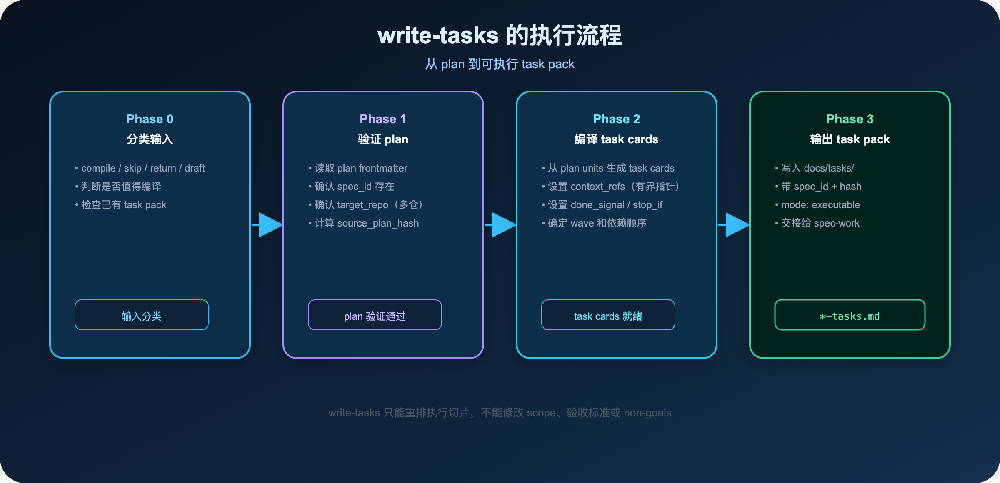
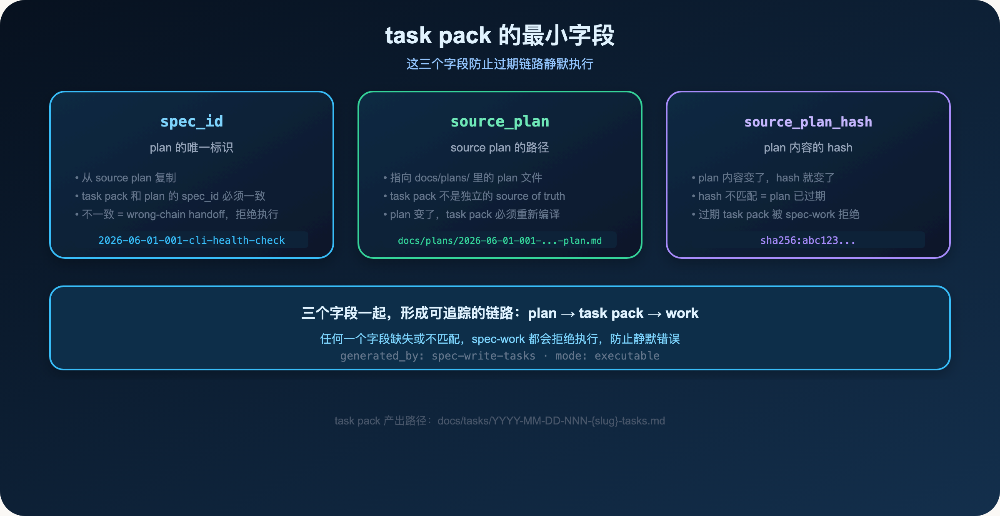
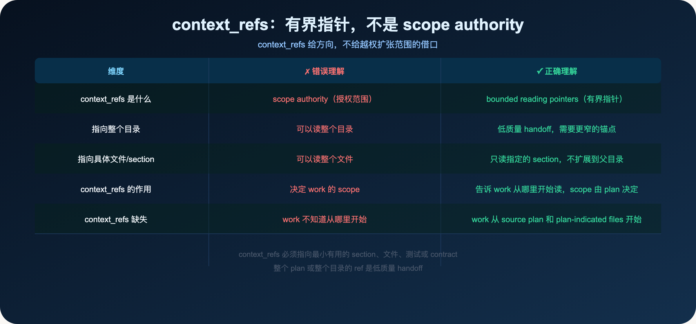
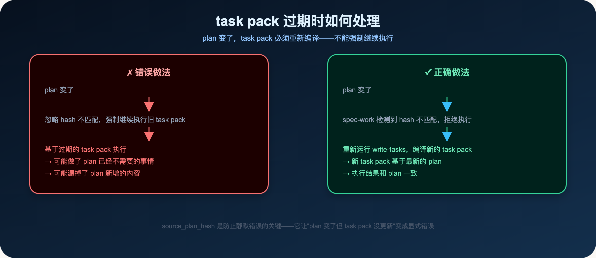
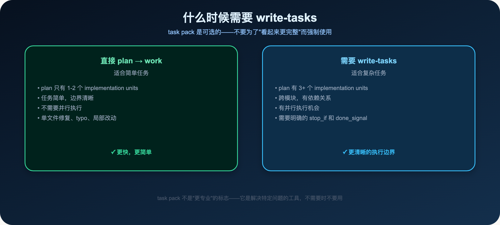
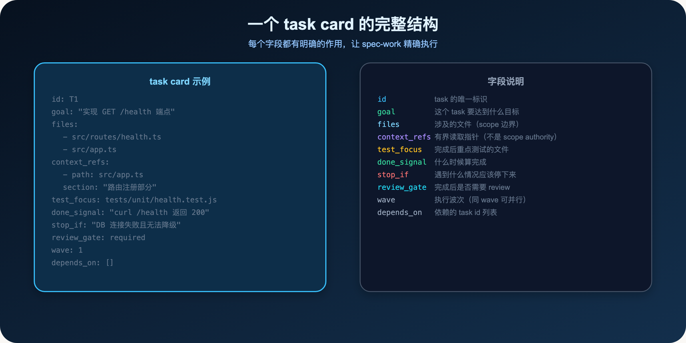

**task pack 是 plan 的派生产物，不是独立的 source of truth。**

> **导读**
> 你有没有遇到过这种情况：把一个大任务交给 AI，它做了一半，然后不知道该继续做什么，或者做了一些你没有要求的事情。
> 这篇文章解释为什么会这样，以及 write-tasks 如何把大任务变得可管理。

---

## 01 为什么大任务交给 AI 总是一团糟

大任务的问题，不是 AI 不够聪明，而是任务太大、边界太模糊。

当你把一个有 5 个 implementation units 的 plan 直接交给 AI 执行时，会发生什么？

- AI 不知道每个 unit 的优先级和依赖关系
- AI 不知道每个 unit 完成的信号是什么
- AI 不知道遇到问题时该停下来还是继续
- AI 不知道哪些 unit 可以并行，哪些必须串行

结果是：AI 做了一些事情，但你不知道它做了什么，也不知道它做到哪里了。

这就是大任务的混乱来源。

**一个真实的例子：**

在 spec-first 的开发过程中，有一次任务是"重构 CLI 的错误处理系统"。

plan 有 6 个 implementation units：

1. 统一错误类型定义
2. 重构 doctor 命令的错误处理
3. 重构 init 命令的错误处理
4. 重构 mcp-setup 的错误处理
5. 更新测试
6. 更新文档

直接把 plan 交给 AI 执行，结果是：

- AI 先做了 Unit 1，然后跳到了 Unit 5（因为它认为测试应该先写）
- Unit 2 和 Unit 3 有依赖关系，但 AI 没有意识到，并行执行导致冲突
- Unit 6 被遗漏了

用 write-tasks 编译 task pack 后：

- 明确了 Unit 1 必须先完成（wave 1）
- Unit 2、3、4 可以并行（wave 2，depends_on: [T1]）
- Unit 5 在 2、3、4 完成后执行（wave 3）
- Unit 6 最后执行（wave 4）

执行结果清晰，没有遗漏，没有冲突。

**write-tasks 解决的就是这个问题：**

把 plan 的 implementation units 编译成可执行的 task cards，每个 task card 有明确的：

- 目标（Goal）
- 涉及文件（Files）
- 验证方式（Test scenarios）
- 完成信号（done_signal）
- 停止条件（stop_if）
- 执行顺序（wave + depends_on）

这样 AI 在执行时，知道每一步该做什么，什么时候算完成，遇到什么情况该停下来，哪些可以并行。

---

## 02 write-tasks 做什么

write-tasks 是 spec-first 里的 task pack 编译器。

它的输入是 plan，输出是 task pack。

**使用方式：**

```text
/spec:write-tasks docs/plans/2026-06-01-001-cli-health-check-plan.md
$spec-write-tasks docs/plans/2026-06-01-001-cli-health-check-plan.md
```

**write-tasks 的核心约束：**

> task pack 只能重排执行切片，不能修改 scope、验收标准或 non-goals。

这个约束非常重要。

task pack 是 plan 的派生产物，不是独立的 source of truth。

如果 task pack 可以修改 scope，那 plan 就失去了作为 source of truth 的意义。

**什么时候 write-tasks 会拒绝编译？**

- source plan 没有 spec_id（legacy plan，需要先更新 plan frontmatter）
- source plan 的 target_repo 缺失（多仓工作区，需要先明确 repo scope）
- scope 问题需要回到 spec-plan 解决（write-tasks 不解决 WHAT 问题）

**write-tasks 和 spec-plan 的分工：**

- spec-plan 决定 WHAT（scope、non-goals、verification）
- write-tasks 决定 HOW TO EXECUTE（执行顺序、依赖关系、完成信号）

write-tasks 不能改变 plan 的 WHAT，只能优化 HOW TO EXECUTE。

---

## 03 write-tasks 的执行流程



write-tasks 有四个阶段：

**Phase 0：分类输入**——判断是否值得编译（compile / skip / return / draft），检查已有 task pack。

**Phase 1：验证 plan**——读取 plan frontmatter，确认 spec_id 存在，确认 target_repo（多仓），计算 source_plan_hash。

**Phase 2：编译 task cards**——从 plan units 生成 task cards，设置 context_refs（有界指针），设置 done_signal / stop_if，确定 wave 和依赖顺序。

**Phase 3：输出 task pack**——写入 docs/tasks/，带 spec_id + hash，mode: executable，交接给 spec-work。

---

## 04 task pack 的最小字段



一个可执行的 task pack 必须带三个关键字段：

### 04.1 spec_id

plan 的唯一标识，从 source plan 复制。

task pack 和 plan 的 spec_id 必须一致。

如果不一致，说明 task pack 是从另一份 plan 编译的（wrong-chain handoff），spec-work 会拒绝执行。

### 04.2 source_plan

source plan 的路径，指向 `docs/plans/` 里的 plan 文件。

这个字段明确了 task pack 的来源，让 spec-work 知道去哪里读取 plan 的完整内容。

### 04.3 source_plan_hash

plan 内容的 hash。

当 plan 内容变化时，hash 就变化。

spec-work 在执行前会验证 hash：

- hash 匹配：plan 没有变化，task pack 有效
- hash 不匹配：plan 已经变化，task pack 过期，拒绝执行

**为什么需要 hash？**

因为 plan 可能在 task pack 编译后被修改。

如果没有 hash 验证，spec-work 可能基于过期的 task pack 执行，做了 plan 已经不需要的事情，或者漏掉了 plan 新增的内容。

hash 让这种情况变成显式错误，而不是静默的错误执行。

**hash 的计算方式：**

write-tasks 在编译时，会计算 source plan 文件的 hash，写入 task pack 的 frontmatter。

spec-work 在执行前，会重新计算 source plan 的 hash，和 task pack 里的 hash 对比。

如果不一致，说明 plan 在 task pack 编译后被修改了，spec-work 会停止执行，要求重新编译 task pack。

**一个常见的误解：**

有人认为，如果 plan 只是改了一个小地方（比如修了一个 typo），task pack 应该还是有效的。

但 spec-first 的设计是：任何 plan 的变化都会导致 hash 不匹配，task pack 必须重新编译。

这是有意为之的：

- 即使是小改动，也可能影响 task 的执行
- 重新编译 task pack 的成本很低（通常只需要几秒钟）
- 强制重新编译，确保 task pack 始终和 plan 一致

---

## 05 context_refs 是什么



context_refs 是 task card 里的一个重要字段，但经常被误解。

**错误理解：** context_refs 是 scope authority，指向哪里就可以读哪里。

**正确理解：** context_refs 是 bounded reading pointers（有界指针），告诉 work 从哪里开始读，但不授权 work 扩张 scope。

**关键规则：**

- context_refs 必须指向最小有用的 section、文件、测试或 contract
- 整个 plan 或整个目录的 ref 是低质量 handoff
- context_refs 给方向，scope 由 plan 决定

**一个例子：**

```yaml
context_refs:
  - path: src/routes/health.ts
    reason: "新增健康检查路由的目标文件"
  - path: src/app.ts
    section: "路由注册部分"
    reason: "需要在这里注册新路由"
```

这两个 context_refs 告诉 work：从这两个地方开始读。

但它们不授权 work 读整个 `src/` 目录，也不授权 work 修改 `src/` 里的其他文件。

scope 仍然由 plan 的 non-goals 和 implementation units 决定。

---

## 06 task pack 过期时如何处理



当 plan 变化后，task pack 的 source_plan_hash 不匹配，spec-work 会拒绝执行。

**正确的处理方式：**

重新运行 write-tasks，编译新的 task pack：

```text
/spec:write-tasks docs/plans/2026-06-01-001-cli-health-check-plan.md
$spec-write-tasks docs/plans/2026-06-01-001-cli-health-check-plan.md
```

**不要强制继续执行旧 task pack。**

旧 task pack 基于过期的 plan，执行结果可能和当前 plan 不一致。

这就是 spec-first 的单向链路：

```
requirements → plan → task pack → work
```

每一步都依赖上一步，不能跳过，也不能反向修改。

---

## 07 什么时候需要 write-tasks，什么时候直接 work



task pack 是可选的。不要为了"看起来更完整"而强制使用。

**直接 plan → work 的情况：**

- plan 只有 1-2 个 implementation units
- 任务简单，边界清晰
- 不需要并行执行
- 单文件修复、typo、局部改动

**需要 write-tasks 的情况：**

- plan 有 3 个以上 implementation units
- 跨模块，有依赖关系
- 有并行执行机会
- 需要明确的 stop_if 和 done_signal

**一个判断标准：**

> 如果你能在脑子里清楚地描述每个 unit 的执行顺序和完成信号，直接 work。
> 如果你需要写下来才能说清楚，用 write-tasks。

---

## 08 task pack 的其他关键字段

除了 spec_id、source_plan、source_plan_hash，task card 还有几个重要字段：



### 08.1 done_signal

完成信号——什么时候算这个 task 完成了。

```yaml
done_signal: "curl /health 返回 200，DB 不可用时返回 503"
```

没有 done_signal，AI 不知道什么时候该停下来，可能会一直做下去，或者在"看起来完成了"的时候停下来。

**done_signal 的写法：**

- 具体的命令和期望输出（最好）
- 可验证的行为描述（次之）
- 模糊的"功能完成"（最差，不推荐）

### 08.2 stop_if

停止条件——遇到什么情况应该停下来，不继续执行。

```yaml
stop_if: "DB 连接失败且无法降级"
```

stop_if 让 AI 知道：遇到这种情况，不要继续，停下来告诉用户。

**stop_if 的价值：**

没有 stop_if，AI 遇到问题时可能会：

- 继续执行，忽略问题
- 尝试"修复"问题，但做了你不想要的事情
- 陷入循环，一直尝试不同的方法

有了 stop_if，AI 知道：这种情况超出了我的处理范围，停下来让用户决定。

### 08.3 test_focus

测试重点——这个 task 完成后，应该重点测试什么。

```yaml
test_focus: "tests/unit/health.test.js"
```

test_focus 让 AI 知道：完成这个 task 后，重点跑这些测试，确认行为正确。

### 08.4 review_gate

review 门控——这个 task 完成后，是否需要 review 才能继续下一个 task。

```yaml
review_gate: required  # 或 optional
```

`required` 意味着：这个 task 完成后，必须经过 review，才能继续执行下一个 task。

适合高风险的 task，比如涉及认证、数据库 schema 变更、核心业务逻辑的 task。

### 08.5 wave 和 depends_on

wave 和 depends_on 控制 task 的执行顺序：

```yaml
tasks:
  - id: T1
    wave: 1
    depends_on: []
  - id: T2
    wave: 1
    depends_on: []
  - id: T3
    wave: 2
    depends_on: [T1, T2]
```

同一个 wave 的 task 可以并行执行。

不同 wave 的 task 必须串行执行（前一个 wave 完成后，才能开始下一个 wave）。

depends_on 明确了 task 之间的依赖关系：T3 必须在 T1 和 T2 都完成后才能开始。

---

## 09 多仓工作区的 target_repo

在多仓工作区里，task pack 必须明确每个 task 的 target_repo：

```yaml
tasks:
  - id: T1
    target_repo: frontend
    goal: "在 frontend 里添加健康检查 UI"
  - id: T2
    target_repo: backend-api
    goal: "在 backend-api 里实现健康检查接口"
```

如果 target_repo 缺失或模糊，spec-work 会拒绝执行，要求回到 plan 明确 repo scope。

这就是多仓工作区的核心约束：

> **写入前必须有明确的 target_repo，不能让 cwd 或 graph 结果自动选择 child repo。**

**为什么这个约束这么严格？**

在多仓工作区里，AI 很容易犯一个错误：基于当前工作目录（cwd）或 graph 结果，自动选择一个 child repo 进行写入。

这种"自动选择"很危险：

- cwd 可能是父 workspace，不是任何 child repo
- graph 结果可能指向多个候选 repo，AI 不知道该选哪个
- 一旦写入了错误的 repo，可能造成难以追踪的问题

明确的 target_repo，让每个 task 的写入边界清晰可见，防止意外写入错误的 repo。

**如何在 plan 里指定 target_repo：**

```yaml
## Implementation Units

### Unit 1：前端健康检查 UI
target_repo: frontend
files:
  - src/components/HealthCheck.tsx

### Unit 2：后端健康检查接口
target_repo: backend-api
files:
  - src/routes/health.ts
```

write-tasks 会从 plan 的 implementation units 里读取 target_repo，写入对应的 task card。

如果 plan 里没有 target_repo，write-tasks 会停止编译，要求回到 spec-plan 明确 repo scope。

---

## 10 本篇小结

write-tasks 解决的是大任务的执行混乱问题：

- 把 plan 的 implementation units 编译成可执行的 task cards
- 每个 task card 有明确的 done_signal 和 stop_if
- spec_id + source_plan_hash 防止过期链路静默执行
- context_refs 是有界指针，不是 scope authority
- wave + depends_on 控制执行顺序和并行机会

**核心原则：**

> task pack 是 plan 的派生产物，不是独立的 source of truth。

plan 变了，task pack 必须重新编译。

task pack 只能重排执行切片，不能修改 scope、验收标准或 non-goals。

**使用原则：**

- plan 有 3+ 个 units、跨模块、有依赖时，用 write-tasks
- 简单任务直接 plan → work
- task pack 过期时，重新编译，不要强制继续

**一个完整的链路：**

```
requirements → plan → doc-review → write-tasks → work → code-review → compound
```

write-tasks 在 doc-review 之后、work 之前运行。

doc-review 确认 plan 的质量，write-tasks 把 plan 编译成可执行切片，work 按 task pack 执行。

这个链路确保了：

- WHAT 在代码写之前就是正确的（doc-review）
- HOW TO EXECUTE 在执行前就是清晰的（write-tasks）
- 执行结果和 plan 一致（spec_id + hash 验证）

**一个简单的自测：**

如果你的大任务执行后，不知道 AI 做了什么，也不知道它做到哪里了，说明你需要 write-tasks。

如果你的 task pack 和 plan 不一致，说明 task pack 已经过期，需要重新编译。

如果你的 context_refs 指向整个目录，说明它是低质量 handoff，需要更窄的锚点。

**write-tasks 不是必须的，但它让大任务变得可管理。**

当任务足够复杂，当你需要清晰的执行边界，当你需要并行执行，write-tasks 是最好的工具。

下一篇：

> **Spec-First：AI 做着做着就偏了？五个控制点让它回到正轨**

work 不是"让 AI 自由发挥"，而是在 plan 边界内的受控执行。

---

`spec-first` 是开源项目，欢迎试用、提 issue、提建议。

**GitHub：** http://github.com/sunrain520/spec-first

**官网：** http://spec-first.cn/
