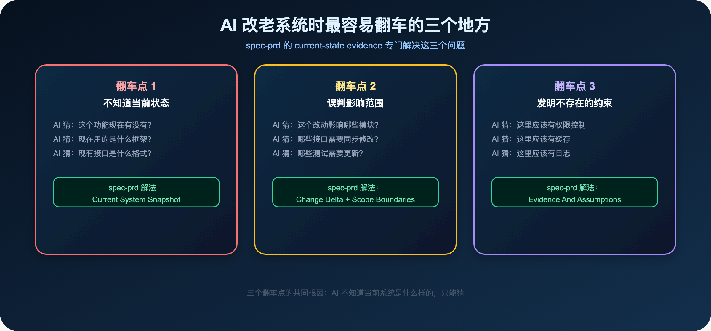
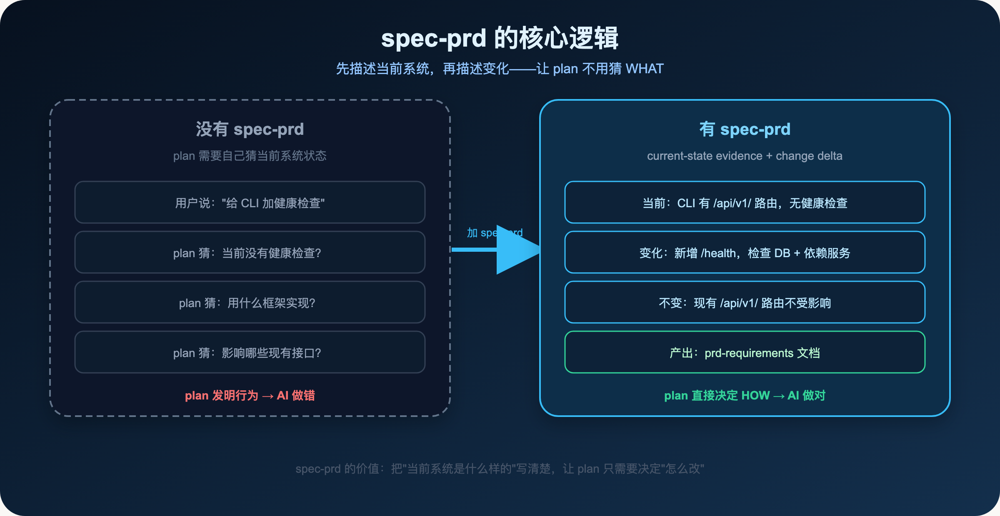
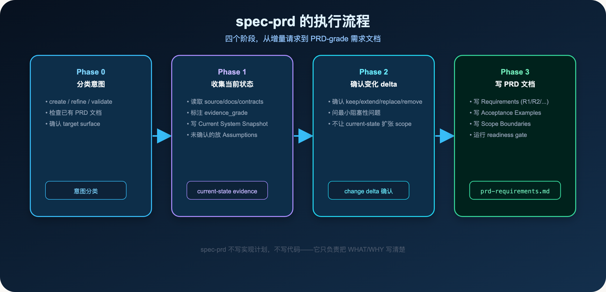
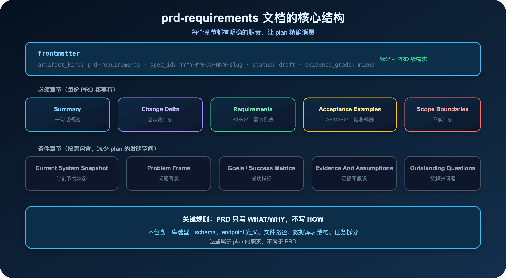
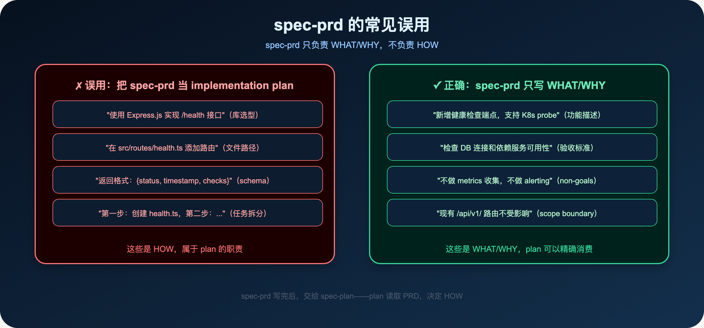
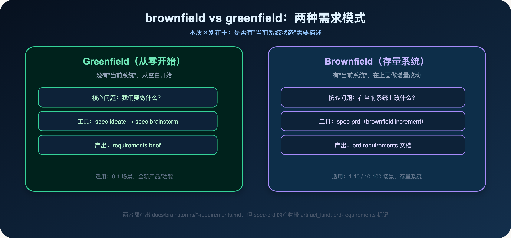

**AI 不知道当前系统是什么样的——spec-prd 解决这个问题。**

> **导读**
> 上一篇讲了 brainstorm 如何把模糊意图收敛成 requirements brief。
> 这篇讲一个更具体的场景：改老系统时，AI 为什么特别容易翻车，以及 spec-prd 的 brownfield 逻辑如何解决这个问题。

---

## 01 改老系统时，AI 最容易翻车的三个地方

你有一个运行了两年的系统。

你想给它加一个新功能，或者改进一个已有功能。

你跟 AI 说了需求，它开始工作。

然后翻车了。

不是因为 AI 不够聪明，而是因为它不知道当前系统是什么样的。



### 01.1 翻车点 1：不知道当前状态

AI 不知道：

- 这个功能现在有没有？
- 现在用的是什么框架？
- 现有接口是什么格式？

它只能猜。

猜对了，皆大欢喜。猜错了，做出来的东西和你想要的完全不同。

**真实案例：** 你说"给 CLI 加健康检查接口"。AI 猜现在没有健康检查，从零开始实现了一个。但实际上你们已经有一个简单的 `/ping` 接口，你只是想把它升级成符合 Kubernetes 规范的健康检查。

结果：AI 做了一个全新的实现，和现有的 `/ping` 接口冲突了。

### 01.2 翻车点 2：误判影响范围

AI 不知道：

- 这个改动影响哪些模块？
- 哪些接口需要同步修改？
- 哪些测试需要更新？

它只能根据代码结构猜。

猜的影响范围太小，漏掉了需要修改的地方。猜的影响范围太大，改了不该改的地方。

**真实案例：** 你说"把用户认证从 session 改成 JWT"。AI 改了认证模块，但漏掉了三个依赖 session 的中间件，导致部分接口认证失效。

### 01.3 翻车点 3：发明不存在的约束

AI 不知道：

- 这里有没有权限控制？
- 这里有没有缓存？
- 这里有没有日志？

它会根据"最佳实践"发明约束。

有时候这些约束是合理的，有时候和你们的系统设计完全不符。

**真实案例：** 你说"给 API 加速率限制"。AI 实现了速率限制，同时"顺手"加了 Redis 缓存（因为"最佳实践"是用 Redis 存速率限制状态）。但你们的系统根本没有 Redis，这个实现无法部署。

**为什么会发明约束？**

AI 的训练数据里有大量的"最佳实践"。当它看到一个功能需求，它会自动联想到这个功能通常需要哪些配套设施。

这种联想在 0-1 场景里是有价值的——它帮你想到了你可能没有考虑到的东西。

但在存量系统里，这种联想很危险——它会把"通常需要"变成"这里需要"，而不管你们的系统实际上有没有这些设施。

spec-prd 的 `Evidence And Assumptions` 章节，就是为了解决这个问题：

- 有证据支撑的 current-state 声明，放进 `Current System Snapshot`
- 没有证据支撑的假设，放进 `Evidence And Assumptions`，标注为 assumed

这样 plan 就知道：哪些是确认的事实，哪些是需要在执行前验证的假设。

---

## 02 为什么 brainstorm 不够用

上一篇讲的 brainstorm，适合 0-1 场景：方向不确定，需要探索。

但改老系统时，方向通常是确定的。

你知道要做什么，但你需要精确描述"在当前系统上改什么"。

brainstorm 的问题是：它不会主动收集当前系统的状态。

它会问你"谁在用"、"成功标准是什么"，但不会问"当前系统是什么样的"。

这就是 spec-prd 存在的原因：

> **spec-prd 专门为存量系统的增量需求设计，它的核心是 current-state evidence + change delta。**

---

## 03 spec-prd 的核心逻辑



spec-prd 的核心逻辑很简单：

**第一步：描述当前系统是什么样的（current-state evidence）**

- 这个功能现在有没有？
- 现在的实现是什么？
- 相关的接口、数据结构、约束是什么？

**第二步：描述这次改动要改什么（change delta）**

- 新增什么？
- 修改什么？
- 删除什么？
- 不变的是什么？

两步加在一起，plan 就不需要猜了。

它知道当前系统是什么样的，只需要决定怎么改。

---

## 04 spec-prd 的执行流程



spec-prd 有四个阶段：

### 04.1 Phase 0：分类意图

spec-prd 首先判断你的意图：

- **create**：把一个增量请求变成 PRD 级需求文档
- **refine**：改进一份已有的 PRD 草稿
- **validate**：验证一份 PRD 是否满足 plan 的需求

如果已经有相关的 PRD 文档，spec-prd 会先读取它，然后在它的基础上继续，而不是从头开始。

### 04.2 Phase 1：收集当前状态证据

这是 spec-prd 最重要的阶段。

它会读取 source、docs、contracts，收集当前系统的状态证据，并标注 evidence_grade：

- **confirmed**：有 source/test/schema 支撑的事实
- **advisory**：只是推断，需要用户确认
- **assumed**：假设，可能不准确

未确认的 current-state 声明，会放进 `Evidence And Assumptions` 章节，而不是直接写进需求。

**关键原则：** current-state 声明必须有证据支撑，不能凭空发明。

### 04.3 Phase 2：确认变化 delta

spec-prd 会确认每个变化的类型：

- **keep**：保持不变
- **extend**：在现有基础上扩展
- **replace**：替换现有实现
- **remove**：删除
- **unknown**：不确定，需要用户决定

这个确认过程，防止 current-state 的发现意外扩张 scope。

### 04.4 Phase 3：写 PRD 文档

最后，spec-prd 写出 PRD 文档，存入 `docs/brainstorms/`：

```
docs/brainstorms/2026-06-01-001-cli-health-check-requirements.md
```

frontmatter 里带 `artifact_kind: prd-requirements` 标记，告诉下游 workflow 这是 PRD 级需求文档。

---

## 05 prd-requirements 文档的结构



一份 prd-requirements 文档包含两类章节：

### 05.1 必须章节

**Summary**：一句话概述这次改动是什么。

**Change Delta**：这次改什么，不改什么。这是最核心的章节。

**Requirements**：具体的需求列表，用 R1/R2/... 编号。每个需求都是可验证的行为描述。

**Acceptance Examples**：验收样例，用 AE1/AE2/... 编号。具体的测试场景。

**Scope Boundaries**：明确的 non-goals，防止 scope 扩张。

### 05.2 条件章节

**Current System Snapshot**：当前系统状态，只写影响 PRD 的部分。

**Problem Frame**：问题背景，为什么要做这个改动。

**Goals / Success Metrics**：成功指标，如果有可量化的指标。

**Evidence And Assumptions**：证据和假设，未确认的 current-state 声明放这里。

**Outstanding Questions**：待解决的问题，需要用户决定的事项。

### 05.3 关键规则：只写 WHAT/WHY，不写 HOW

PRD 不包含：

- 库选型（"使用 Express.js"）
- 文件路径（"在 src/routes/health.ts"）
- Schema 定义（"返回格式是 {status, timestamp}"）
- 任务拆分（"第一步：创建文件，第二步：..."）

这些是 HOW，属于 plan 的职责。

---

## 06 一个真实的 prd-requirements 片段

这是 spec-first 项目里的一份真实 PRD（简化版）：

```markdown
---
spec_id: 2026-05-30-002-prd-iteration-skill
artifact_kind: prd-requirements
status: draft
evidence_grade: mixed
---

## Summary

新增 spec-prd workflow skill，负责把存量系统的增量需求整理成
可交给 spec-plan 的 PRD-grade requirements。

## Change Delta

- **新增**：spec-prd workflow skill（create/refine/validate 三种 intent）
- **不变**：spec-brainstorm 继续定位为 0-1 想法探索
- **不变**：spec-plan 的输入格式不变

## Requirements

R1：spec-prd 接受增量请求、已有 PRD 草稿或产品想法作为输入
R2：spec-prd 读取当前系统的 source/docs/contracts 作为 current-state evidence
R3：spec-prd 产出 artifact_kind: prd-requirements 的需求文档
R4：spec-prd 不写实现计划，不写代码

## Scope Boundaries

- 不新增多个 PRD skill
- 不新增独立 agent
- 不改 spec-brainstorm 的行为
```

注意这份文档的特点：

- 明确说明了"不变"的部分（Change Delta 里的 keep）
- Requirements 都是可验证的行为描述
- Scope Boundaries 明确排除了可能的 scope 扩张
- 没有任何实现细节

**evidence_grade 字段的含义：**

`evidence_grade: mixed` 意味着这份 PRD 里的 current-state 声明，有些是 confirmed（有 source 支撑），有些是 advisory（只是推断）。

这个字段让 plan 知道：哪些 current-state 声明可以直接信任，哪些需要在执行前再次确认。

**spec_id 的作用：**

`spec_id: 2026-05-30-002-prd-iteration-skill` 是这份 PRD 的唯一标识。

当 plan 引用这份 PRD 时，它会带上 spec_id，形成可追踪的链路：

```
PRD (spec_id: 2026-05-30-002) → plan → task pack → work → review
```

这样，当 review 发现问题时，可以追溯到原始的 PRD，确认是需求问题还是实现问题。

**superseded 状态：**

这份 PRD 的 status 是 `superseded`，意味着它已经被一份更新的 PRD 取代。

spec-prd 支持 PRD 的迭代：当需求发生变化时，可以创建新的 PRD，并在旧 PRD 里标注 `superseded_by`，形成清晰的版本历史。

这就是 spec-prd 的 refine 模式：在已有 PRD 的基础上继续，而不是从头开始。

---

## 07 常见误用：把 spec-prd 当 implementation plan 用



最常见的误用是：在 PRD 里写实现细节。

**误用的例子：**

- "使用 Express.js 实现 /health 接口"（库选型，属于 HOW）
- "在 src/routes/health.ts 添加路由"（文件路径，属于 HOW）
- "返回格式：{status, timestamp, checks}"（schema，属于 HOW）
- "第一步：创建 health.ts，第二步：..."（任务拆分，属于 HOW）

这些都是 HOW，属于 plan 的职责。

**为什么不能写 HOW？**

第一，HOW 会限制 plan 的决策空间。如果 PRD 已经指定了库和文件路径，plan 就没有机会做出更好的设计决策。

第二，HOW 会让 PRD 很快过期。实现细节会变，但需求不会。如果 PRD 里写了具体的实现，下次改动时 PRD 就需要同步更新，增加维护成本。

第三，HOW 会让 PRD 变成一份"假计划"。它看起来很详细，但实际上没有回答 plan 真正需要的问题：这个功能的边界是什么？验收标准是什么？不做什么？

**一个判断方法：**

如果你写的内容，在不同的技术栈下会有不同的答案，那它就是 HOW，不应该出现在 PRD 里。

比如"使用 Express.js"——如果换成 Fastify 或 Koa，这句话就不适用了。这是 HOW。

"新增健康检查端点，支持 Kubernetes liveness 和 readiness probe"——无论用什么框架实现，这个需求都是一样的。这是 WHAT。

**另一个常见误用：把 spec-prd 当 spec-brainstorm 用**

spec-prd 不适合 0-1 场景。

如果你还不确定要做什么，用 spec-brainstorm 先探索方向。

spec-prd 假设你已经知道要做什么，只是需要精确描述"在当前系统上改什么"。

如果你用 spec-prd 来探索方向，它会问你很多关于"当前系统状态"的问题，但你根本没有当前系统，这些问题就没有意义了。

---

## 08 什么时候用 spec-prd，什么时候用 brainstorm



两种需求模式的本质区别在于：是否有"当前系统状态"需要描述。

| 场景 | 推荐工具 | 原因 |
|---|---|---|
| 全新产品，方向未定 | spec-brainstorm | 需要探索方向，不是描述 delta |
| 已有产品，增量功能，需求较清晰 | spec-brainstorm 或 spec-prd | 两者都可以，看需求复杂度 |
| 存量系统，增量需求，需要精确描述 delta | spec-prd | 需要 current-state evidence |
| 已有 PRD 草稿，需要改进 | spec-prd（refine 模式） | 在已有基础上继续 |
| 需要验证 PRD 是否满足 plan 需求 | spec-prd（validate 模式） | 检查 PRD 质量 |

**一个简单的判断标准：**

> 如果你需要描述"在当前系统上改什么"，用 spec-prd。
> 如果你需要探索"要做什么"，用 brainstorm。

---

## 09 spec-prd 和 plan 的交接

spec-prd 完成后，产出 `docs/brainstorms/*-requirements.md`，交给 plan：

```text
/spec:plan
$spec-plan
```

plan 读取 PRD 文档，知道：

- 当前系统是什么样的（Current System Snapshot）
- 这次要改什么（Change Delta）
- 具体的需求是什么（Requirements）
- 验收标准是什么（Acceptance Examples）
- 不做什么（Scope Boundaries）

有了这些信息，plan 可以直接决定 HOW，不需要猜 WHAT。

**plan 读取 PRD 的方式：**

plan 不会把整份 PRD 都塞进上下文，而是按需读取：

- 先读 Summary 和 Change Delta，了解这次改动的全貌
- 再读 Requirements 和 Acceptance Examples，了解具体的需求
- 按需读取 Current System Snapshot，了解当前系统状态
- 读取 Scope Boundaries，确认不做什么

这就是 Context Harness 的原则：给模型正确上下文，而不是无限上下文。

**PRD 的 readiness gate：**

spec-prd 在写完 PRD 后，会运行一个 readiness gate，检查 PRD 是否满足 plan 的需求：

- 是否有 Change Delta？
- 是否有 Requirements？
- 是否有 Acceptance Examples？
- 是否有 Scope Boundaries？
- 是否有未解决的 Outstanding Questions？

如果有未解决的问题，spec-prd 会提示你先解决，再交给 plan。

这就是 spec-prd 的核心价值：

> **让 plan 不用猜 WHAT，直接决定 HOW。**

---

## 10 本篇小结

改老系统时，AI 最容易翻车的三个地方：

1. 不知道当前状态，只能猜
2. 误判影响范围，漏改或多改
3. 发明不存在的约束，做出无法部署的实现

spec-prd 用 current-state evidence + change delta 解决这三个问题：

- 先描述当前系统是什么样的
- 再描述这次改动要改什么
- 让 plan 不用猜，直接决定 HOW

**使用原则：**

- 0-1 场景：用 brainstorm，探索方向
- 存量系统增量需求：用 spec-prd，描述 delta
- PRD 只写 WHAT/WHY，不写 HOW
- 有已有 PRD 草稿时，用 spec-prd refine 模式继续

下一篇：

> **Spec-First：你给 AI 的计划，其实是在帮它跑偏**

plan 不是微观指令，而是约束 scope、验证方式、风险和 handoff 的边界文档。

---

`spec-first` 是开源项目，欢迎试用、提 issue、提建议。

**GitHub：** http://github.com/sunrain520/spec-first

**官网：** http://spec-first.cn/
