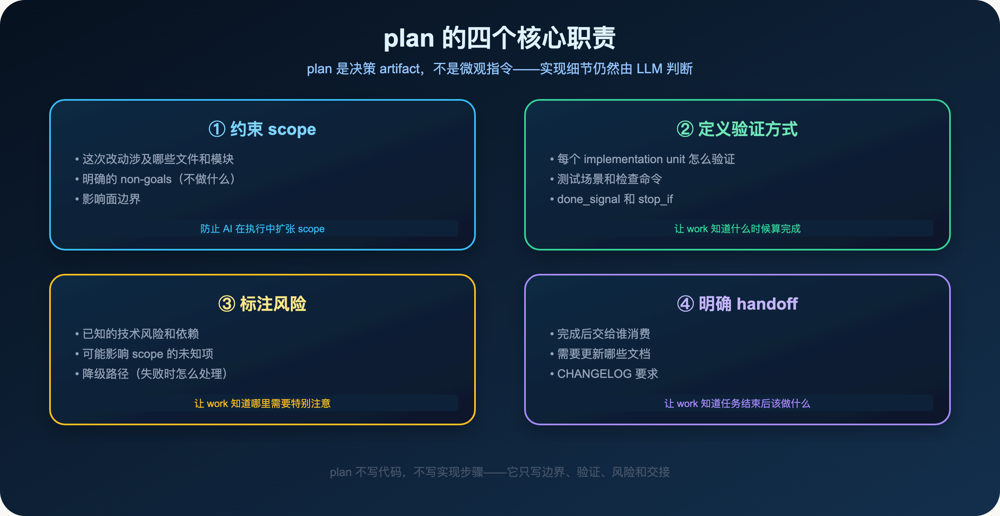
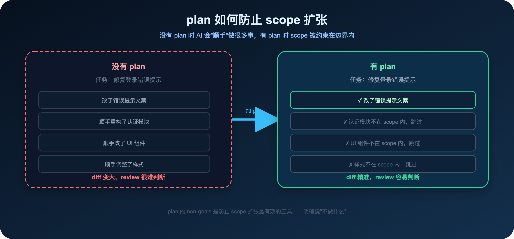
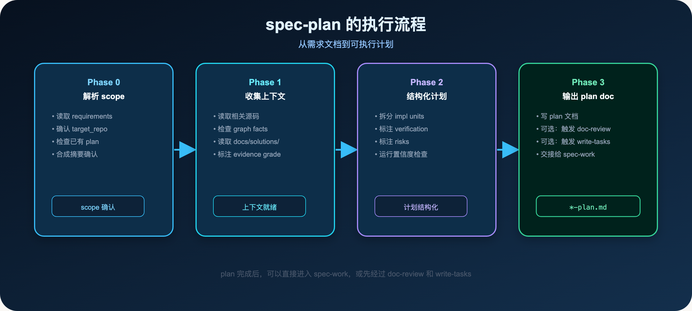
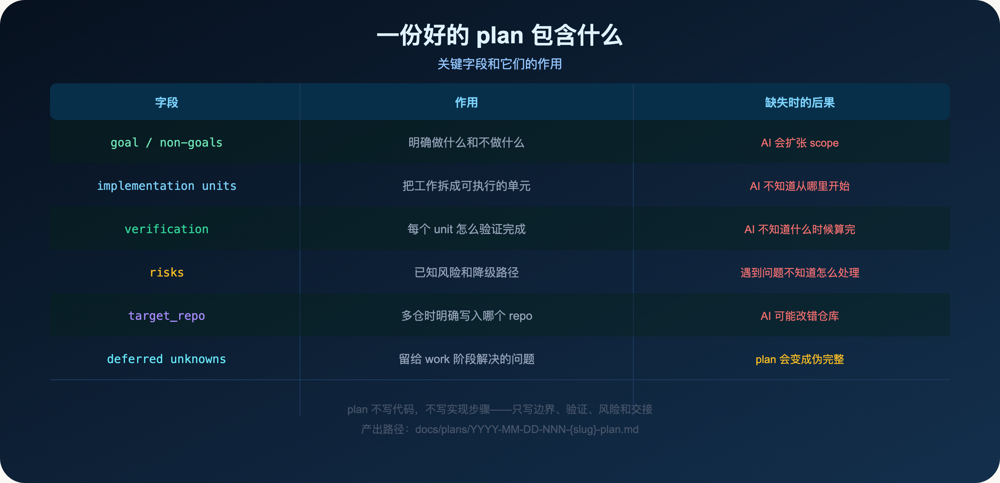
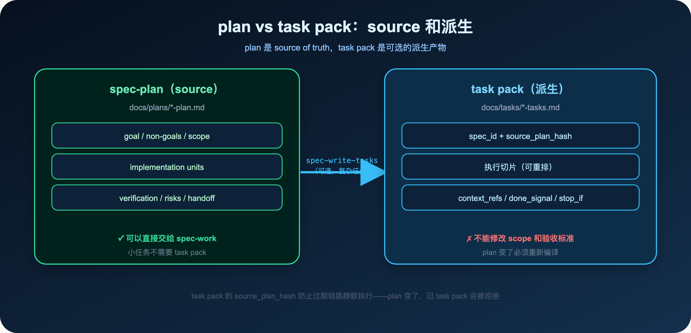
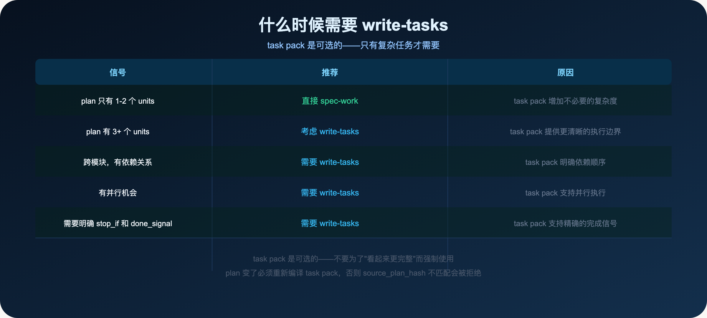

**plan 不是微观指令，而是约束 scope、验证、风险和 handoff 的边界文档。**

> **导读**
> 很多人给 AI 写计划，写的是"第一步做什么，第二步做什么"。
> 这种计划不是在帮 AI，而是在帮它跑偏——因为它没有告诉 AI 什么时候该停下来。
> 这篇文章解释 plan 真正应该包含什么。

---

## 01 为什么 AI 做着做着就偏了

你给 AI 一个任务：修复登录错误提示。

AI 开始工作。

它改了错误提示文案，然后发现认证模块的代码有点乱，顺手重构了一下。

重构的时候发现 UI 组件也有问题，顺手改了。

改 UI 的时候发现样式不一致，顺手调整了。

最后 diff 变大，review 很难判断哪些是必要修改，哪些是"顺手"做的。

这就是 scope 扩张。

不是 AI 不听话，而是你没有告诉它边界在哪里。

**为什么 AI 会扩张 scope？**

AI 的训练数据里有大量的"最佳实践"和"顺手改进"的例子。当它看到一段代码有问题，它的自然反应是"顺手修一下"。

这种反应在某些场景下是有价值的——它帮你发现了你没有注意到的问题。

但在真实工程里，这种反应很危险：

- 它让 diff 变大，review 变难
- 它可能引入新的 bug（"顺手"改的地方没有经过充分测试）
- 它让任务的完成时间变得不可预测

plan 的 non-goals 就是为了解决这个问题：明确告诉 AI 什么不做。

**一个更隐蔽的 scope 扩张：**

有时候 scope 扩张不是"顺手改了不该改的地方"，而是"对需求的理解比你想要的更宽泛"。

比如你说"改进 CLI 的错误提示"，AI 可能理解成"改进所有错误处理"，而不是"只改提示文案"。

这种扩张更难发现，因为 AI 做的每一件事看起来都是合理的。

plan 的 goal 和 non-goals 一起，才能精确定义 scope 的边界。

---

## 02 plan 是什么

plan 是 spec-first 里的决策 artifact。

它不是告诉 AI 每一步怎么做，而是告诉 AI：

- 这次改动的边界在哪里
- 怎么验证做完了
- 有哪些已知风险
- 完成后交给谁



### 02.1 约束 scope

plan 最重要的职责是约束 scope。

它要明确：

- 这次改动涉及哪些文件和模块
- 明确的 non-goals（不做什么）
- 影响面边界

**non-goals 比 goals 更重要。**

goals 描述的是"做什么"，AI 会尽力实现。

non-goals 描述的是"不做什么"，AI 在没有明确说"不做"的地方，会做出"合理"的扩展。

明确说"不做什么"，是防止 scope 扩张最有效的方式。

### 02.2 定义验证方式

plan 要明确每个 implementation unit 怎么验证：

- 测试场景和检查命令
- done_signal（什么时候算完成）
- stop_if（什么情况下应该停止）

没有验证方式，AI 不知道什么时候算完成，可能会一直做下去，或者在"看起来完成了"的时候停下来。

### 02.3 标注风险

plan 要标注已知的风险：

- 技术风险和依赖
- 可能影响 scope 的未知项
- 降级路径（失败时怎么处理）

这些信息让 work 知道哪里需要特别注意，遇到问题时有明确的处理方式。

### 02.4 明确 handoff

plan 要明确完成后的交接：

- 完成后交给谁消费（review、compound 等）
- 需要更新哪些文档
- CHANGELOG 要求

---

## 03 plan 不是什么

理解 plan 是什么，同样重要的是理解 plan 不是什么。

### 03.1 plan 不是微观指令

很多人写 plan 的方式是：

```
第一步：创建 src/routes/health.ts
第二步：实现 GET /health 接口
第三步：添加数据库连接检查
第四步：添加依赖服务检查
第五步：更新路由注册
```

这是微观指令，不是 plan。

微观指令的问题：

- 它限制了 AI 的决策空间。如果 AI 发现第二步和第三步可以合并，它不知道该不该合并。
- 它很快就会过期。代码结构变了，这些步骤就不适用了。
- 它没有回答 plan 真正需要回答的问题：边界是什么？怎么验证？有什么风险？

**plan 写的是决策，不是步骤。**

正确的写法是：

```
implementation unit 1：新增健康检查端点
  - 目标：实现 GET /health，检查 DB 和依赖服务
  - 涉及文件：src/routes/（新增）、src/app.ts（注册路由）
  - 验证：curl /health 返回 200，DB 不可用时返回 503
  - done_signal：所有验证通过
```

这个写法告诉 AI：目标是什么，涉及哪些文件，怎么验证。但不告诉 AI 具体怎么实现——那是 AI 的判断。

### 03.2 plan 不是状态机

plan 不是要把 AI 的每一步都写死。

真实工程里，很多关键判断都是语义判断：

- 这次改动到底算 bug fix，还是行为变更？
- 这个 review finding 是否真的成立？
- 这个 edge case 需要处理吗？

这些问题不适合交给 plan 硬编码。

plan 的职责是约束边界，实现细节仍然由 LLM 判断。

这就是 spec-first 的核心原则：

> **Artifact 给边界，LLM 做判断。**

**为什么不能把 plan 写成状态机？**

第一，状态机假设你能预见所有情况。但真实工程里，执行中总会遇到预料之外的情况。

第二，状态机让 AI 失去了判断空间。当遇到预料之外的情况，AI 不知道该怎么处理，只能停下来问你。

第三，状态机很快就会过期。代码变了，状态机就不适用了。

plan 应该是"足够约束，但不过度约束"——给 AI 足够的边界，但保留足够的判断空间。

### 03.3 plan 不写代码

plan 不包含：

- 具体的代码实现
- 文件路径（除非是 scope 边界的一部分）
- 库选型（除非是已经确定的约束）
- 数据库 schema

这些是 work 阶段的职责。

**一个判断方法：**

如果你写的内容，在不同的技术栈下会有不同的答案，那它就不应该出现在 plan 里。

比如"使用 Express.js 的 Router"——如果换成 Fastify，这句话就不适用了。这是 HOW，不应该在 plan 里。

"新增健康检查端点，支持 Kubernetes liveness 和 readiness probe"——无论用什么框架实现，这个需求都是一样的。这是 WHAT，应该在 plan 里。

---

## 04 plan 如何防止 scope 扩张



plan 防止 scope 扩张的核心机制是：**明确的 non-goals**。

当 AI 在执行中遇到"顺手可以做"的事情，它会检查 plan 的 non-goals：

- 如果在 non-goals 里，跳过
- 如果不在 non-goals 里，但也不在 goals 里，应该停下来问

这就是为什么 plan 里的 non-goals 比 goals 更重要。

**一个真实的例子：**

在 spec-first 的开发过程中，有一次任务是"改进 CLI 的错误提示"。

plan 里写了：

```
non-goals:
- 不改错误处理的架构
- 不改 CLI 的其他功能
- 只改提示文案
```

AI 在执行时，发现认证模块的错误处理可以改进，但 plan 里明确说"不改错误处理的架构"，所以它跳过了。

最终 diff 只包含了提示文案的修改，review 很容易判断。

---

## 05 spec-plan 的执行流程



spec-plan 有四个阶段：

**Phase 0：解析 scope**——读取 requirements，确认 target_repo，检查已有 plan，合成摘要确认。

**Phase 1：收集上下文**——读取相关源码，检查 graph facts，读取 docs/solutions/ 里的历史经验，标注 evidence grade。

**Phase 2：结构化计划**——拆分 implementation units，标注 verification 和 risks，运行置信度检查。

**Phase 3：输出 plan doc**——写 plan 文档，可选触发 doc-review 和 write-tasks，交接给 spec-work。

---

## 06 一份好的 plan 包含哪些字段



### 05.1 必须字段

**goal**：这次改动要达到什么目标。一句话概述。

**non-goals**：明确不做什么。这是最重要的字段。

**implementation units**：把工作拆成可执行的单元。每个 unit 有：
- 目标
- 涉及的文件
- 验证方式
- done_signal

**verification**：整体的验证方式。跑什么测试，检查什么。

**risks**：已知风险和降级路径。

### 05.2 条件字段

**target_repo**：多仓工作区时必须指定。

**deferred unknowns**：留给 work 阶段解决的问题。

**decision notes**：重要的设计决策和理由。

### 05.3 一个真实的 plan 片段

这是 spec-first 项目里的一份真实 plan（简化版）：

```markdown
## Goal

改进 spec-first CLI 的首次使用体验，让首次安装的开发者
在 5 分钟内完成初始化并进入第一个 workflow。

## Non-Goals

- 不改 CLI 的核心功能
- 不改 workflow 的行为
- 不改 spec-first 的架构

## Implementation Units

### Unit 1：改进 doctor 输出

目标：doctor 的输出清晰区分 ERROR / WARN / INFO，
      每个 ERROR 都有具体的 Fix 建议

涉及文件：src/cli/commands/doctor.js

验证：
- spec-first doctor 输出包含 ERROR/WARN/INFO 标签
- 每个 ERROR 都有 Fix: 建议
- 测试：tests/unit/doctor.test.js

done_signal：所有验证通过

### Unit 2：改进 init 完成提示

目标：init 完成后，输出"下一步：在宿主里运行 /spec:mcp-setup"

涉及文件：src/cli/commands/init.js

验证：
- init 完成后的输出包含下一步提示
- 提示包含具体的命令

done_signal：所有验证通过

## Risks

- doctor 的输出格式变化可能影响现有的 CI 脚本
  降级路径：保持旧格式，只在新格式后面追加

## Verification

npm run test:unit -- --testPathPattern=doctor
npm run test:smoke
```

注意这份 plan 的特点：

- goal 和 non-goals 明确定义了 scope
- implementation units 有具体的验证方式
- risks 有降级路径
- 没有任何实现细节（不写"用什么方法实现"）

### 06.4 plan 的产出路径

```
docs/plans/YYYY-MM-DD-NNN-{slug}-plan.md
```

### 06.5 plan 的质量标准

一份好的 plan，应该让 work 不需要问任何关于 scope 的问题。

如果 work 在执行中需要问"这个要不要改"，说明 plan 的 non-goals 不够清晰。

如果 work 在执行中不知道什么时候算完成，说明 plan 的 verification 不够具体。

如果 work 在执行中遇到风险不知道怎么处理，说明 plan 的 risks 不够完整。

**一个简单的自测：**

把 plan 给一个不了解这个任务的人看，他能不能独立执行？

如果不能，说明 plan 还不够清晰。

如果能，说明 plan 的质量足够好。

这个标准同样适用于 AI：plan 应该让 AI 不需要猜，直接执行。

plan 的质量，决定了 work 的质量。

---

## 06 plan 和 task pack 的分工



plan 是 source of truth，task pack 是可选的派生产物。

**plan 的职责：**
- 定义 goal、non-goals、scope
- 拆分 implementation units
- 标注 verification、risks、handoff

**task pack 的职责：**
- 把 plan 的 implementation units 编译成执行切片
- 记录 spec_id 和 source_plan_hash（防止过期链路）
- 支持并行执行和精确的完成信号

**关键约束：**

task pack 只能重排执行切片，不能修改 scope、验收标准或 non-goals。

如果 plan 变了，必须重新编译 task pack。旧的 task pack 的 source_plan_hash 不匹配，会被 spec-work 拒绝执行。

这就是 spec-first 的单向链路：

```
requirements → plan → task pack → work
```

每一步都依赖上一步，不能跳过，也不能反向修改。

---

## 07 什么时候 plan 就够了，什么时候需要 write-tasks



task pack 是可选的。不要为了"看起来更完整"而强制使用。

**直接 plan → work 的情况：**
- plan 只有 1-2 个 implementation units
- 任务简单，边界清晰
- 不需要并行执行

**需要 write-tasks 的情况：**
- plan 有 3 个以上 implementation units
- 跨模块，有依赖关系
- 有并行机会
- 需要明确的 stop_if 和 done_signal

---

## 09 plan 的 graph evidence posture

plan 在规划时，会消费 graph evidence（GitNexus 等）。

但 graph evidence 有可信度之分：

- **primary**：有 source/test/schema 支撑的事实
- **session-local**：本轮 live MCP 查询结果
- **advisory**：只是线索，需要 source 确认
- **stale**：已过期，不能当真

plan 会在 `Graph / GitNexus Evidence` 章节标注当前 graph 的可信度和限制。

当 graph 是 `dirty-advisory` 或 `definitions-only` 时，plan 会说明：

- 哪些结论是基于 graph evidence 的
- 哪些需要在 work 阶段通过直接读源码确认

这就是 Evidence Harness 的核心：不假装拿到了确认证据，而是如实标注证据的可信等级。

**为什么 plan 需要标注 evidence grade？**

因为 plan 是 work 的输入。如果 plan 里有基于 stale graph 的结论，work 可能会基于错误的事实做出错误的决策。

标注 evidence grade，让 work 知道哪些结论需要在执行前再次确认。

**一个真实的例子：**

plan 里写了："根据 graph evidence，这个函数只被 A 和 B 两个地方调用。"

但 graph 是 `dirty-advisory`，这个结论可能不准确。

plan 会标注：`evidence_grade: advisory`，并说明"需要在 work 阶段通过直接读源码确认调用方"。

work 在执行时，会先确认调用方，再做修改。

---

## 10 本篇小结

plan 的价值不是告诉 AI 每一步怎么做，而是约束 scope、验证方式、风险和 handoff。

**plan 是什么：**
- scope 边界（goal + non-goals）
- 验证方式（每个 unit 怎么验证）
- 风险标注（已知风险和降级路径）
- handoff 说明（完成后交给谁）

**plan 不是什么：**
- 微观指令（不写"第一步、第二步"）
- 状态机（不把每个判断都写死）
- 代码（不写实现细节）

**核心原则：**

> **Artifact 给边界，LLM 做判断。**

plan 写清楚"不做什么"和"怎么验证"，比写清楚"怎么做"更重要。

**一个简单的自测：**

如果你的 plan 里有"第一步、第二步"，那它是微观指令，不是 plan。

如果你的 plan 里没有 non-goals，那 AI 会扩张 scope。

如果你的 plan 里没有 verification，那 AI 不知道什么时候算完成。

这三个问题，是 plan 最常见的缺陷。

下一篇：

> **Spec-First：代码写完才发现需求理解错了，这个错误可以提前避免**

doc-review 在 plan 之后立即运行，发现问题的成本最低。

---

`spec-first` 是开源项目，欢迎试用、提 issue、提建议。

**GitHub：** http://github.com/sunrain520/spec-first

**官网：** http://spec-first.cn/
