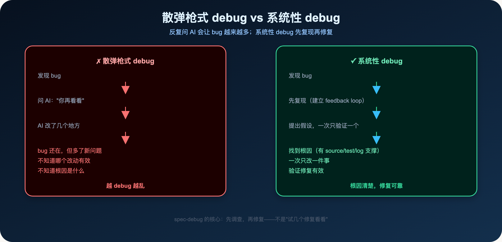
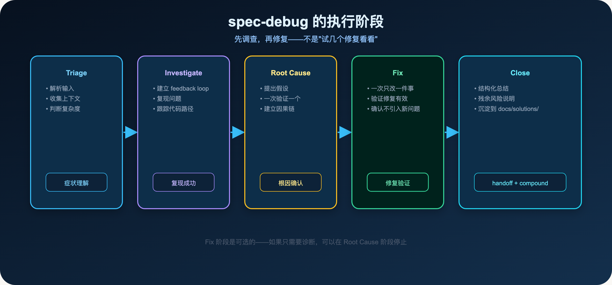
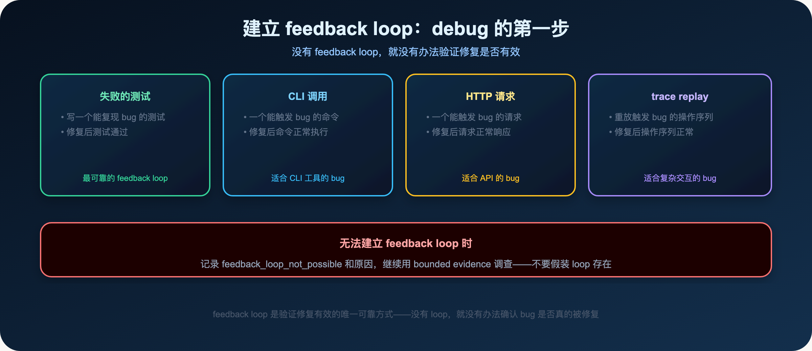
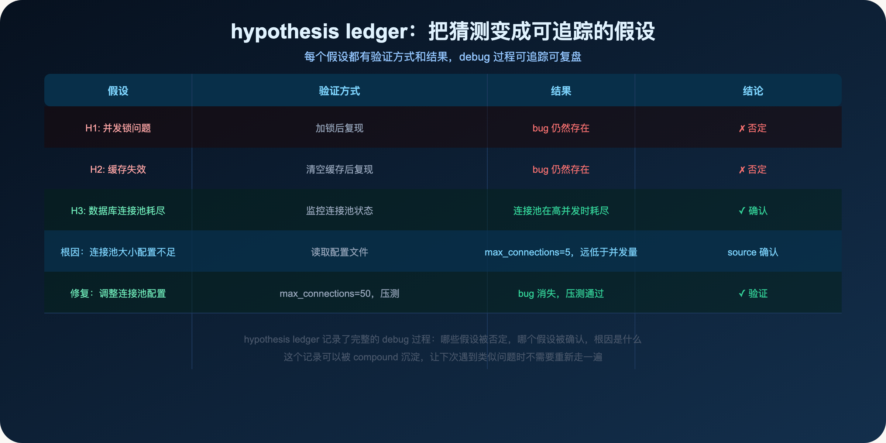
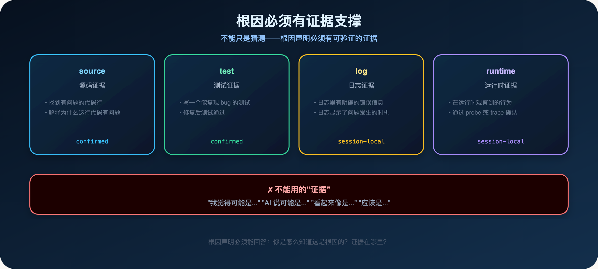
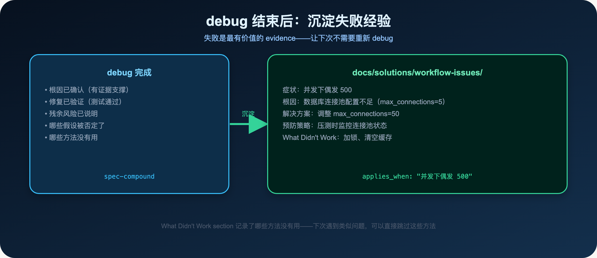

**debug 不是反复问 AI，而是用 hypothesis ledger 把失败变成可追踪的证据。**

> **导读**
> 你有没有遇到过这种情况：发现一个 bug，问 AI "你再看看"，AI 改了几个地方，bug 还在，但多了新问题。
> 这篇文章解释为什么这种做法会让 bug 越来越多，以及系统性 debug 的正确方式。

---

## 01 为什么"你再看看"会让 bug 越来越多

这是一个很常见的场景：

你发现一个 bug，告诉 AI："这里有问题，你再看看。"

AI 看了看，改了几个地方。

你测试，bug 还在。

你再说："还是有问题，你再看看。"

AI 又改了几个地方。

你测试，bug 还在，但多了一个新问题。

这就是散弹枪式 debug 的问题：

- 每次改多个地方，不知道哪个改动有效
- 没有复现步骤，不知道 bug 是否真的被修复
- 没有根因分析，下次遇到类似问题还会再踩

**为什么 AI 会这样做？**

因为你没有给它一个系统性的 debug 框架。

你说"你再看看"，AI 只能猜测可能的原因，然后尝试修复。

这种猜测式的修复，很容易引入新问题，也很难确认 bug 是否真的被修复。

**散弹枪式 debug 的三个问题：**

1. **不知道哪个改动有效**：同时改了多个地方，bug 消失了，但不知道是哪个改动修复了 bug
2. **容易引入新问题**：每次改动都可能引入新的 bug，而你不知道
3. **无法积累经验**：每次 debug 都是从零开始，没有学到任何东西

**spec-debug 的核心原则：**

> **先调查，再修复——不是"试几个修复看看"。**

**使用方式：**

```text
/spec:debug "登录接口在并发下偶发 500"
$spec-debug "tests/integration/auth.test.js"
```

也可以直接粘贴 stack trace 或错误信息：

```text
/spec:debug "TypeError: Cannot read property 'id' of undefined at line 42"
```

**spec-debug 和 spec-work 的区别：**

- `spec-debug`：先找根因，再决定是否修复。适合不确定根因的 bug。
- `spec-work`：已有明确计划，按计划执行实现。适合已知根因的修复。

如果你不确定 bug 的根因，先用 spec-debug。

如果你已经知道根因，可以直接用 spec-work 修复。

---

## 02 散弹枪式 debug vs 系统性 debug



两种 debug 方式的本质区别：

**散弹枪式 debug：**

- 发现 bug → 问 AI "你再看看" → AI 改了几个地方 → bug 还在，多了新问题
- 越 debug 越乱，不知道根因是什么

**系统性 debug：**

- 发现 bug → 先复现（建立 feedback loop）→ 提出假设，一次只验证一个 → 找到根因（有证据支撑）→ 一次只改一件事 → 验证修复有效
- 根因清楚，修复可靠

---

## 03 spec-debug 的执行阶段



spec-debug 有五个阶段：

### 03.1 Triage：解析输入

读取 bug 描述、错误日志、stack trace，理解症状。

判断 bug 的复杂度：

- **轻量 bug**（单文件 typo、missing import、null dereference）：走 trivial-bug fast-path，压缩调查过程
- **重量 bug**（跨模块、核心 workflow、高风险）：走完整的调查流程

### 03.2 Investigate：复现问题

**建立 feedback loop 是 debug 的第一步。**



feedback loop 是一个能观察到症状的最小环境：

- 一个失败的测试（最可靠）
- 一个 CLI 调用（适合 CLI 工具的 bug）
- 一个 HTTP 请求（适合 API 的 bug）
- 一个 trace replay（适合复杂交互的 bug）

没有 feedback loop，就没有办法验证修复是否有效。

如果无法建立 feedback loop，记录 `feedback_loop_not_possible` 和原因，继续用 bounded evidence 调查。不要假装 loop 存在。

**为什么 feedback loop 这么重要？**

因为 debug 的本质是：提出假设 → 验证假设 → 确认或否定。

没有 feedback loop，就没有办法验证假设。

你只能猜测，而猜测很容易出错。

有了 feedback loop，每次修改后都可以立即验证：bug 是否消失了？有没有引入新问题？

### 03.3 Root Cause：建立因果链

这是 debug 最重要的阶段。

**提出假设，一次只验证一个。**

每个假设都要有：

- 具体的预测（如果这个假设成立，会观察到什么）
- 验证方式（怎么验证这个预测）
- 结果（验证结果是什么）

如果假设被否定，记录下来，提出下一个假设。

如果假设被确认，继续追踪因果链，直到找到根因。

### 03.4 Fix：一次只改一件事

根因确认后，才开始修复。

**一次只改一件事。**

如果你在改多个地方"看看是否有效"，那是散弹枪式 debug，不是系统性 debug。

修复后，用 feedback loop 验证修复有效。

### 03.5 Close：结构化总结

debug 完成后，生成结构化总结：

- 根因解释
- 修复方案
- 验证结果
- 残余风险

然后用 spec-compound 把这次 debug 的经验沉淀到 `docs/solutions/`。

---

## 04 hypothesis ledger 是什么



hypothesis ledger 是 spec-debug 里记录假设和验证结果的机制。

它把"猜测"变成"可追踪的假设"：

- 每个假设都有具体的预测
- 每个假设都有验证方式
- 每个假设都有结果（确认或否定）

**hypothesis ledger 的价值：**

1. **防止重复验证**：已经否定的假设不需要再验证
2. **追踪 debug 进度**：知道已经验证了哪些假设，还有哪些没有验证
3. **沉淀经验**：debug 完成后，hypothesis ledger 可以被 compound 沉淀，让下次遇到类似问题时不需要重新走一遍

**hypothesis ledger 的格式：**

每个假设包含：

- **假设**：具体的预测（如果这个假设成立，会观察到什么）
- **验证方式**：怎么验证这个预测
- **结果**：验证结果是什么
- **结论**：确认（✓）或否定（✗）

**如何提出好的假设：**

好的假设是具体的、可验证的：

- ✓ "如果是并发锁问题，加锁后 bug 应该消失"
- ✓ "如果是连接池耗尽，监控连接池状态应该能看到耗尽"
- ✗ "可能是某个地方有问题"（太模糊，无法验证）
- ✗ "AI 说可能是缓存问题"（不是假设，是猜测）

**一个真实的例子：**

在 spec-first 的开发过程中，有一次 `spec-doc-review` 在高并发下偶发失败。

hypothesis ledger 记录了：

- H1：并发锁问题 → 加锁后复现 → bug 仍然存在 → 否定
- H2：缓存失效 → 清空缓存后复现 → bug 仍然存在 → 否定
- H3：数据库连接池耗尽 → 监控连接池状态 → 连接池在高并发时耗尽 → 确认
- 根因：连接池大小配置不足（max_connections=5）→ 读取配置文件确认 → source 确认
- 修复：调整 max_connections=50 → 压测通过 → 验证

这个 hypothesis ledger 记录了完整的 debug 过程，包括哪些假设被否定了。

下次遇到类似问题，可以直接跳过 H1 和 H2，从 H3 开始验证。

---

## 05 一次只改一件事

这是 spec-debug 最重要的原则之一：

> **Test one hypothesis, change one thing. If you're changing multiple things to "see if it helps," stop — that is shotgun debugging.**

**为什么一次只改一件事？**

如果你同时改了三个地方，然后 bug 消失了，你不知道是哪个改动修复了 bug。

下次遇到类似问题，你还是不知道该改哪里。

如果你一次只改一件事，然后 bug 消失了，你知道是这个改动修复了 bug。

这个知识可以被沉淀，让下次遇到类似问题时直接应用。

**一次只改一件事的执行方式：**

1. 提出一个假设
2. 只做一个最小的改动来验证这个假设
3. 运行 feedback loop，观察结果
4. 如果假设被确认，继续追踪因果链
5. 如果假设被否定，**恢复改动**，提出下一个假设

注意第 5 步：如果假设被否定，必须恢复改动。

不要让否定的改动留在代码里，否则下次验证时会受到干扰。

**一个常见的错误：**

很多人在 debug 时，会同时改多个地方，然后说"我改了 A、B、C，bug 消失了"。

但他们不知道是 A、B 还是 C 修复了 bug。

下次遇到类似问题，他们还是需要重新 debug。

系统性 debug 的目标是：每次 debug 都能学到东西，让下次 debug 更快。

**trivial-bug fast-path：**

对于简单的 bug（单文件 typo、missing import、null dereference），spec-debug 有一个 fast-path：

压缩调查过程，直接找到根因，提出修复方案。

但 fast-path 不跳过 Phase 2（Root Cause）：仍然需要说明根因，提出修复方案，让用户选择是否修复。

---

## 06 根因必须有证据支撑



根因声明必须有可验证的证据，不能只是猜测。

**四种有效的证据类型：**

- **source**：找到有问题的代码行，解释为什么这行代码有问题（confirmed 级别）
- **test**：写一个能复现 bug 的测试，修复后测试通过（confirmed 级别）
- **log**：日志里有明确的错误信息，显示了问题发生的时机（session-local 级别）
- **runtime**：在运行时观察到的行为，通过 probe 或 trace 确认（session-local 级别）

**不能用的"证据"：**

- "我觉得可能是..."
- "AI 说可能是..."
- "看起来像是..."
- "应该是..."

这些都是猜测，不是证据。

**根因声明必须能回答：**

> 你是怎么知道这是根因的？证据在哪里？

**source 证据的重要性：**

source 证据是最可靠的证据类型。

它不依赖于运行时状态，不依赖于日志，不依赖于 AI 的猜测。

它直接指向有问题的代码行，解释为什么这行代码有问题。

当你找到 source 证据时，你已经理解了 bug 的根因，修复方案也就清楚了。

---

## 07 graph evidence 在 debug 中的角色

graph evidence（GitNexus 等）在 debug 中可以提供 orientation，但不能替代 source/test/log 证据。

**graph evidence 的正确使用方式：**

- 用 graph 做 orientation（找到相关文件和调用方）
- 用 source/test/log 做 confirmation（确认根因）

**graph evidence 的限制：**

- `dirty-advisory`：只能当参考，需要补 bounded direct reads
- `definitions-only`：只有 symbol/file 定位，没有 process graph
- `stale`：不能当真，需要先刷新图谱

**关键原则：**

> graph evidence 可以帮你找到"去哪里看"，但根因必须由 source/test/log/runtime 确认。

**stale graph 时如何处理：**

- 轻量 bug（单文件、typo、null dereference）：继续执行，用 bounded direct reads 代替 graph
- 重量 bug（跨模块、核心 workflow、高风险）：建议先运行 graph-bootstrap，再 debug

---

## 08 debug 结束后：把失败经验沉淀



debug 完成后，用 spec-compound 把这次 debug 的经验沉淀到 `docs/solutions/`。

**为什么要沉淀 debug 经验？**

因为失败是最有价值的 evidence。

一次 debug 的经验，包含了：

- 哪些假设被否定了（What Didn't Work）
- 根因是什么
- 解决方案是什么
- 预防策略是什么

这些信息如果不沉淀，下次遇到类似问题还需要重新走一遍。

**What Didn't Work section 的价值：**

很多文档只记录"怎么解决"，不记录"哪些方法没有用"。

但"哪些方法没有用"往往是最有价值的信息：

- 下次遇到类似问题，可以直接跳过这些方法
- 节省大量的调查时间

spec-compound 的 Bug track 模板里有专门的 `What Didn't Work` section，就是为了记录这些信息。

**沉淀的时机：**

debug 完成后，上下文最新鲜，这时候沉淀经验质量最高。

不要等到一周后再回来整理，那时候很多细节已经模糊了。

---

## 09 本篇小结

debug 的核心原则：

1. **先复现，再修复**：建立 feedback loop，确认能复现 bug
2. **hypothesis ledger**：把猜测变成可追踪的假设，一次只验证一个
3. **一次只改一件事**：防止散弹枪式 debug
4. **根因必须有证据**：source / test / log / runtime 支撑
5. **沉淀失败经验**：把 debug 过程沉淀到 docs/solutions/

**核心判断：**

> debug 时先问：能复现吗？假设是什么？这次只改一件事。

**一个简单的自测：**

如果你的 debug 过程里，改了多个地方"看看是否有效"，那是散弹枪式 debug。

如果你的根因声明里，没有 source/test/log 支撑，那是猜测，不是根因。

如果你的 debug 完成后，没有沉淀到 docs/solutions/，那下次还会踩同样的坑。

**debug 和 work 的关系：**

debug 是 work 的前置步骤。

当你遇到一个 bug，不确定根因时，先用 debug 找到根因，再用 work 修复。

如果你直接用 work 修复，但根因不清楚，很容易修错地方，或者修了表面但没有修根因。

**debug 和 compound 的关系：**

debug 完成后，用 compound 沉淀经验。

这是 Knowledge Harness 的核心：每次 debug 都让下一次 debug 更快。

每次 debug 的经验，包含了：

- 哪些假设被否定了（What Didn't Work）
- 根因是什么
- 解决方案是什么
- 预防策略是什么

这些信息如果被沉淀，下次遇到类似问题时，可以直接跳过已经否定的假设，更快找到根因。

**失败是最有价值的 evidence：**

很多人觉得 debug 是浪费时间。

但系统性 debug 的每一次失败，都是有价值的信息：

- 否定了一个假设，缩小了根因的范围
- 发现了一个"哪些方法没有用"的经验
- 建立了一个可以复用的 feedback loop

这些信息如果被沉淀，下次遇到类似问题时，可以直接跳过已经否定的假设，更快找到根因。

**一个简单的判断：**

如果你的 debug 过程里，每次都是从零开始，没有利用到之前的经验，说明你的 Knowledge Harness 还没有建立起来。

spec-compound 是建立 Knowledge Harness 的工具——每次 debug 完成后，用它把经验沉淀下来。

这样，每次 debug 都不只是修复了一个 bug，而是让整个团队的 debug 能力提升了一点。

下一篇：

> **Spec-First：AI review 了半天，上线还是出了问题——为什么**

review 需要角色、证据、影响面、降级和 residual risk，不是一句"你再检查一下"。

---

`spec-first` 是开源项目，欢迎试用、提 issue、提建议。

**GitHub：** http://github.com/sunrain520/spec-first

**官网：** http://spec-first.cn/
