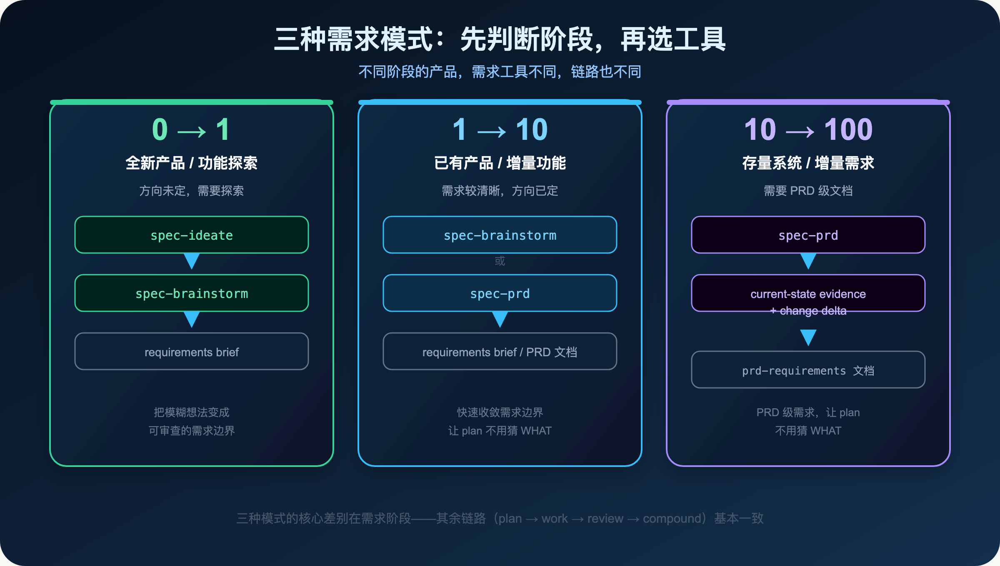
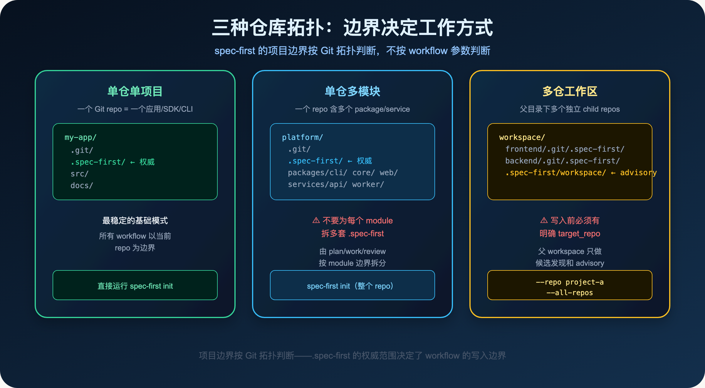
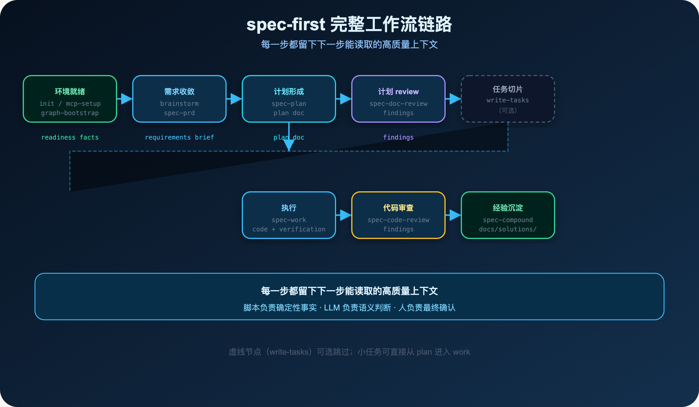
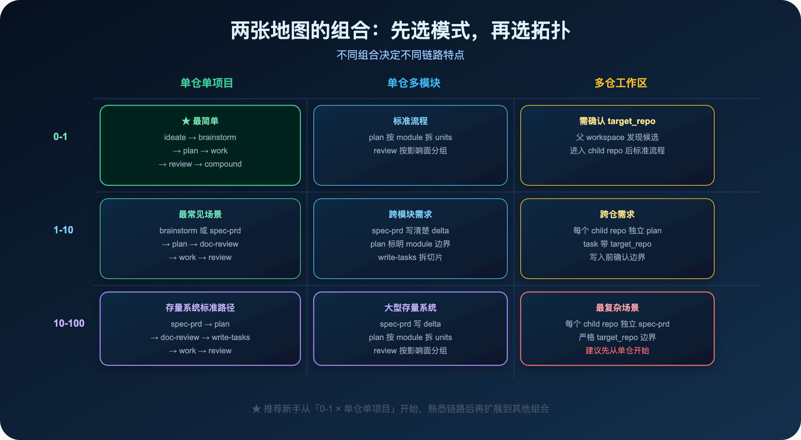
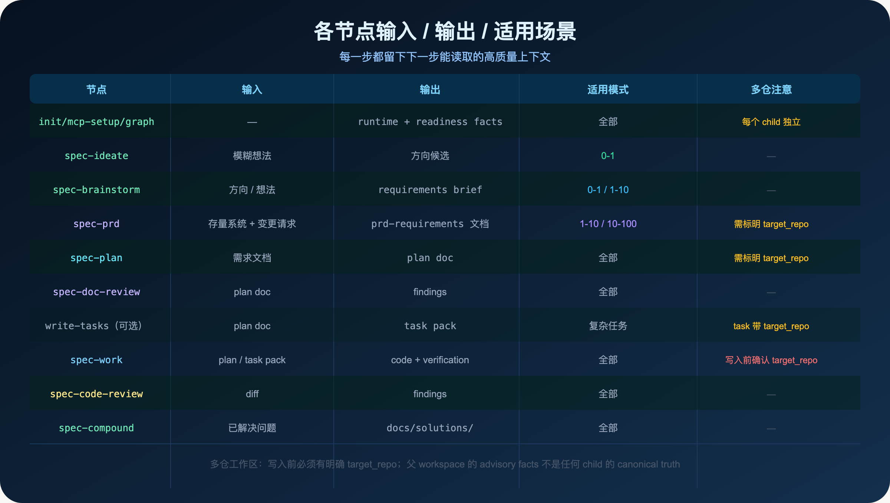
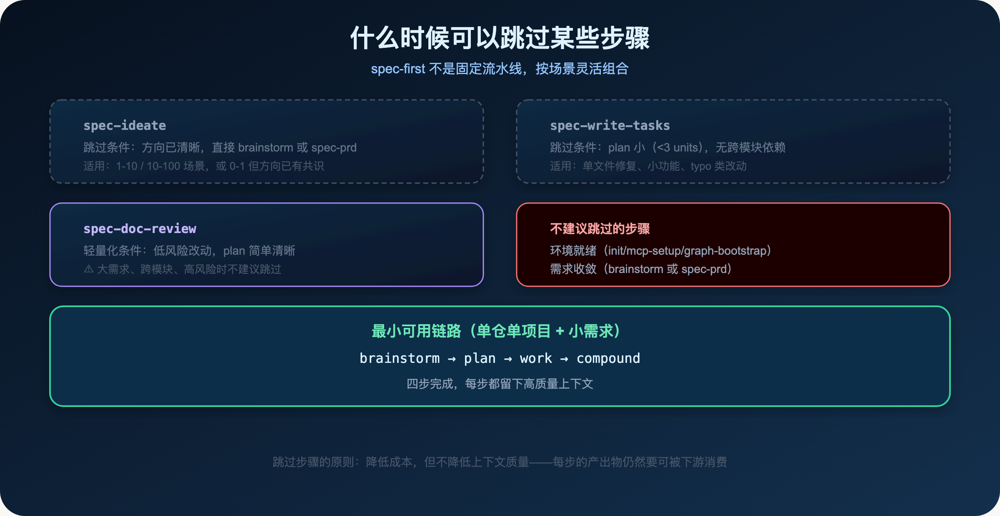

**先选地图，再走链路——不是所有人都走同一条路。**

> **导读**
> 第一季我们建立了 AI Coding Harness 的认知框架：为什么需要 Harness，每一层解决什么问题。
> 第二季从这里开始：怎么用。这篇文章建立两张地图，让你知道自己在哪里、该走哪条路。

---

## 01 为什么需要两张地图

第一季结束时，很多读者问了同一个问题：

> 我理解了 Harness 的价值，但我该从哪里开始？

这个问题的答案，取决于两件事：

**第一件事：你在做什么阶段的产品？**

全新产品、已有产品增量功能、存量系统增量需求——这三种场景的需求工具不同，链路也不同。

**第二件事：你的代码库是什么结构？**

单个 Git repo、一个 repo 里有多个模块、多个独立 repo 组成的工作区——这三种拓扑的边界规则不同，操作方式也不同。

这就是两张地图：**需求模式地图**和**仓库拓扑地图**。

两张地图决定了你该走哪条链路、用哪些工具。

不是所有人都走同一条路。

---

## 02 第一张地图：三种需求模式

spec-first 按产品阶段区分三种需求模式。

核心差别在需求阶段——其余链路（plan → work → review → compound）基本一致。



### 02.1 0-1：全新产品，方向未定

**场景：** 你有一个想法，但还不确定方向。需要先探索，再收敛。

**工具链：** `spec-ideate` → `spec-brainstorm`

`spec-ideate` 是更早的方向探索工具。它帮你生成和评估多个方向候选，适合连需求方向都不确定时。

`spec-brainstorm` 把模糊意图收敛成可审查的 requirements brief。它不是头脑风暴，而是一个结构化的对话过程：谁在用、当前卡在哪里、哪些需求必须解决、哪些不在本轮范围内、成功标准是什么。

**产出物：** `docs/brainstorms/YYYY-MM-DD-NNN-{slug}-requirements.md`

这份文档应该回答：用户是谁、当前痛点是什么、成功标准是什么、不做什么。

### 02.2 1-10：已有产品，增量功能

**场景：** 产品已经在跑，你要加一个新功能或改进一个已有功能。方向基本清楚，但需要把需求边界说清楚。

**工具链：** `spec-brainstorm` 或 `spec-prd`

这个阶段两个工具都可以用：

- 如果需求还有一些模糊，用 `spec-brainstorm` 先收敛
- 如果需求已经比较清晰，直接用 `spec-prd` 写 PRD 级文档

**产出物：** requirements brief 或 PRD 需求文档

### 02.3 10-100：存量系统，增量需求

**场景：** 你在维护一个已经运行了很长时间的系统，需要在上面做增量改动。系统有历史包袱，改动需要精确描述 delta。

**工具链：** `spec-prd`（brownfield increment）

`spec-prd` 是专门为存量系统设计的需求工具。

它的核心逻辑是：**current-state evidence + change delta**。

先描述当前系统是什么样的（current-state evidence），再描述这次改动要改什么（change delta）。

这样 plan 就不需要猜 WHAT——它知道当前系统的状态，只需要决定 HOW。

**产出物：** `docs/brainstorms/*-requirements.md`，frontmatter 里带 `artifact_kind: prd-requirements`

这个标记告诉下游 workflow：这是 PRD 级需求文档，质量更高，可以直接进入 plan。

### 02.4 三种模式的核心差别

三种模式的核心差别在需求阶段：

- 0-1：探索方向，把模糊变清晰
- 1-10：快速收敛，把清晰变可执行
- 10-100：描述 delta，让 plan 不用猜 WHAT

其余链路（plan → doc-review → work → code-review → compound）基本一致。

---

## 03 第二张地图：三种仓库拓扑

spec-first 的项目边界按 Git 拓扑判断，不按 workflow 参数判断。



### 03.1 单仓单项目

**形态：** 一个 Git repo = 一个应用、SDK、CLI 或服务

```
my-app/
  .git/
  .spec-first/   ← 权威边界
  src/
  docs/
```

这是最稳定的基础模式。

`.spec-first/` 的权威边界就是当前 repo root。所有 workflow（plan、work、review、compound）都以当前 repo 为边界。

`spec-mcp-setup` 写 `.spec-first/config/*`，`spec-graph-bootstrap` 写 `.spec-first/graph/*`、`.spec-first/providers/*` 和 `.spec-first/impact/*`。

**推荐新手从这里开始。**

### 03.2 单仓多模块

**形态：** 一个 Git repo 中包含多个 app、package、service 或 Android module

```
platform/
  .git/
  .spec-first/   ← 权威边界（整个 repo）
  packages/
    cli/
    core/
    web/
  services/
    api/
    worker/
```

这种模式仍然是一个 Git 工程。

**关键原则：不要为每个 module 拆多套 `.spec-first`。**

如果每个 module 都有自己的 `.spec-first`，需求、计划、graph facts 和 review evidence 会分裂，很难维护。

正确做法：

- graph providers 覆盖整个 repo，再由 plan/work/review 按 module 边界筛选上下文
- 大计划在 implementation units 或 task pack 中标清模块边界
- review 按变更文件和影响面分组，而不是按 `.spec-first` 目录拆分

### 03.3 多仓工作区

**形态：** 父目录下有多个独立 child Git repos

```
workspace/
  frontend/
    .git/
    .spec-first/   ← frontend 的权威边界
  backend-api/
    .git/
    .spec-first/   ← backend 的权威边界
  mobile-app/
    .git/
    .spec-first/   ← mobile 的权威边界
  .spec-first/
    workspace/     ← advisory facts，不是任何 child 的权威
```

这是最复杂的拓扑。

**关键规则：**

父目录的 `.spec-first/workspace/*summary.json` 是 advisory facts，不是任何 child repo 的 canonical truth。

操作单个 child repo：

```bash
/spec:mcp-setup --repo frontend
/spec:graph-bootstrap --repo backend-api
```

批量操作所有 child repos：

```bash
/spec:mcp-setup --all-repos
/spec:graph-bootstrap --all-repos
```

**最重要的约束：** 写文件、修复、测试、review autofix 或 commit 之前，必须有明确的 `target_repo`。

不能让 cwd、graph 结果或 workspace advisory 自动选择 child repo。

---

## 04 完整链路走查

两张地图建立之后，我们用一个真实需求走完完整链路。

**示例需求：** 改进 spec-first CLI 的首次使用体验

**模式选择：** 1-10（已有产品，增量功能）

**拓扑选择：** 单仓单项目



### 04.1 第零步：环境就绪（三件事有顺序依赖）

在开始任何 workflow 之前，需要确保三件事就绪。

**第一件事：从 source 生成 host runtime assets。**

```bash
npm install -g spec-first
spec-first doctor
spec-first init --claude -u leokuang --lang zh
```

用 Codex 的把 `--claude` 换成 `--codex`。初始化后重启宿主（Claude Code 或 Codex）。

**第二件事：安装并验证 MCP / helper runtime。**

```text
/spec:mcp-setup
$spec-mcp-setup
```

`mcp-setup` 负责安装和验证 required MCP servers、graph providers、helper tools 和 setup facts。它把配置写入 `.spec-first/config/`。

**第三件事：编译 graph readiness facts。**

```text
/spec:graph-bootstrap
$spec-graph-bootstrap
```

`graph-bootstrap` 基于 mcp-setup 产出的 provider 配置，写入 `.spec-first/graph/*`、`.spec-first/providers/*` 和 `.spec-first/impact/*`。

**三件事的顺序依赖：**

```
spec-first init
  → spec-mcp-setup（依赖 init 产出的 runtime）
  → spec-graph-bootstrap（依赖 mcp-setup 产出的 provider 配置）
```

如果 graph facts unavailable、stale 或 degraded，后续 workflow 会明确降级到 bounded direct repo reads，不会静默失败。

### 04.2 第一步：需求收敛

我们的示例需求是"改进 CLI 首次使用体验"，属于 1-10 模式，用 `spec-brainstorm`：

```text
/spec:brainstorm "改进 spec-first CLI 的首次使用体验"
$spec-brainstorm "改进 spec-first CLI 的首次使用体验"
```

brainstorm 会问你几个关键问题：

- 谁在用？（首次安装的开发者）
- 当前卡在哪里？（doctor 输出不够清晰，init 步骤不够引导）
- 成功标准是什么？（首次使用 5 分钟内完成初始化）
- 不做什么？（不改 CLI 的核心功能，只改引导体验）

产出物：

```
docs/brainstorms/2026-06-01-001-cli-onboarding-requirements.md
```

这份文档是后续所有步骤的 WHAT 来源。

**如果是 10-100 场景**，这里改用 `spec-prd`：

```text
/spec:prd "改进 CLI 首次使用体验"
$spec-prd "改进 CLI 首次使用体验"
```

spec-prd 会先读取当前系统的状态（current-state evidence），再描述这次改动的 delta。产出物同样是 `docs/brainstorms/*-requirements.md`，但带 `artifact_kind: prd-requirements` 标记。

### 04.3 第二步：计划形成

需求 brief 稳定后进入 plan：

```text
/spec:plan
$spec-plan
```

plan 读取 requirements brief，产出：

```
docs/plans/2026-06-01-001-feat-cli-onboarding-plan.md
```

plan 的职责是把 requirements 转成可评审、可执行的工程决策上下文：

- 实施目标和非目标
- 大致文件区域和依赖关系
- 风险点和验证方式
- implementation-time 决策空间

**plan 不是微观指令。** 它约束 scope、验证方式、风险和 handoff，实现细节仍然由 LLM 在 work 阶段判断。

### 04.4 第三步：计划 review

plan 写完后立即 review，发现问题成本最低：

```text
/spec:doc-review
$spec-doc-review
```

doc-review 会从多个角度审查 plan：

- **coherence**：需求和计划是否一致？
- **feasibility**：计划是否可行？
- **scope**：scope 是否合理，有没有遗漏或过度？
- **adversarial**：有没有明显的风险或盲点？

findings 会指出需要修改的地方。修改后再次确认，然后进入下一步。

### 04.5 第四步：任务切片（可选）

如果 plan 涉及多个模块或有明确的依赖关系，可以用 `spec-write-tasks` 把 plan 编译成 task pack：

```text
/spec:write-tasks
$spec-write-tasks
```

产出物：

```
docs/tasks/2026-06-01-001-feat-cli-onboarding-tasks.md
```

task pack 的价值是确定性 handoff：它记录 source plan、hash、task graph、wave 和验证信号。

**关键约束：** task pack 只能重排执行切片，不能修改 scope、验收标准或 non-goals。它带 `spec_id` / `source_plan_hash`，防止过期链路静默执行。

**如果 plan 很小（< 3 个 implementation units），可以跳过这步，直接进入 work。**

### 04.6 第五步：执行

```text
/spec:work
$spec-work
```

work 读取当前请求、plan/task pack、已加载的 host/project instructions、相关源码和测试，完成最小可验证改动。

work 有五个关键控制点：

1. **scope 验证**：任务开始前确认边界，不做 plan 之外的事
2. **task identity**：`spec_id` / `source_plan_hash` 确保链路没有过期
3. **vertical tracer bullet**：先关闭一个行为，再扩展到下一个
4. **review gate**：内置的质量检查点
5. **handoff evidence**：任务结束时留下可被下游消费的证据

结果通常包括：代码或文档 diff、测试或检查命令、验证记录、残余风险说明，以及 `CHANGELOG.md` 记录。

### 04.7 第六步：代码审查

```text
/spec:code-review
$spec-code-review
```

code-review 在 work 完成后运行，从六个维度审查代码：correctness、security、performance、maintainability、test、docs。

它会先运行 `review-pre-facts` 准备证据（diff、graph evidence、test results），再派发多个 reviewer agent 并行审查。

每个 actionable finding 都带有：

- **evidence**：证据在哪里
- **severity**：严重程度
- **owner**：谁来修
- **verification**：怎么验证

### 04.8 第七步：经验沉淀

```text
/spec:compound
$spec-compound
```

任务结束时，上下文最新鲜，这时候沉淀经验质量最高。

compound 会问你：这次解决的问题，值得记录吗？

如果值得，它会把经验写成结构化文档，存入 `docs/solutions/`：

```
docs/solutions/developer-experience/cli-onboarding-improvement-2026-06-01.md
```

这份文档带有 frontmatter（`applies_when`、`tags`、`component`），可以被后续 workflow 按需检索。

---

## 05 两张地图的组合

两张地图组合起来，决定了不同场景下的链路特点：



### 05.1 最简单：0-1 × 单仓单项目

```
ideate → brainstorm → plan → work → review → compound
```

新手推荐从这里开始。链路最短，边界最清晰。

### 05.2 最常见：1-10 × 单仓单项目

```
brainstorm/spec-prd → plan → doc-review → work → code-review → compound
```

这是大多数日常开发的场景。

### 05.3 存量系统：10-100 × 单仓多模块

```
spec-prd → plan（按 module 拆 units）→ doc-review → write-tasks → work → code-review → compound
```

spec-prd 写清楚 delta，plan 按 module 边界拆分，review 按影响面分组。

### 05.4 最复杂：多仓工作区

无论哪种需求模式，多仓工作区都有一个额外约束：

**每一步写入之前，必须有明确的 `target_repo`。**

父 workspace 只做候选发现和 advisory summary，不能替代 child repo 的 canonical facts。

---

## 06 每个节点的输入/输出



每个节点的输入、输出、适用模式和多仓注意事项一目了然。

几个关键点：

- **ideate** 只适用于 0-1 场景，方向已清晰时直接跳过
- **spec-prd** 适用于 1-10 / 10-100，产出 PRD 级需求文档
- **write-tasks** 是可选步骤，复杂任务才需要
- **多仓工作区**：plan、write-tasks、work 这三步都需要明确 `target_repo`，写入前必须确认边界

---

## 07 什么时候可以跳过某些步骤

spec-first 不是固定流水线，可以按场景灵活组合。



### 07.1 可以跳过的步骤

**`spec-ideate`**：方向已清晰时跳过，直接 brainstorm 或 spec-prd。

**`spec-write-tasks`**：plan 小（< 3 个 implementation units）、无跨模块依赖时跳过，直接 work。

**`spec-doc-review` 轻量化**：低风险改动、plan 简单清晰时可以轻量化。但大需求、跨模块、高风险时不建议跳过。

### 07.2 不建议跳过的步骤

**环境就绪（init/mcp-setup/graph-bootstrap）**：这三件事是所有 workflow 的前提。跳过会导致 runtime 不一致、graph facts 缺失，后续 workflow 行为不可预测。

**需求收敛（brainstorm 或 spec-prd）**：没有需求文档，plan 就要猜 WHAT。猜出来的 plan 很容易在执行中漂移。

### 07.3 最小可用链路

单仓单项目 + 小需求的最小链路：

```
brainstorm → plan → work → compound
```

四步完成，每步都留下高质量上下文。

---

## 08 一个真实的感受

我用 spec-first 开发 spec-first 本身已经超过半年。

最开始，我也觉得这些步骤有点繁琐。

但随着项目变大，我越来越感受到这套链路的价值：

**不是每次任务都要走完所有步骤，而是每次任务都留下了下一次任务能读取的上下文。**

当我三个月后回来修一个 bug，我不需要重新理解整个系统。

当我换了一个 AI agent，它不需要从零开始猜我的意图。

当团队里来了新人，他们不需要靠口耳相传了解历史决策。

这就是 spec-first 的核心价值：

> **不是让 AI 更聪明，而是让每次任务都让下一次任务更容易。**

---

## 09 本篇小结

这篇文章建立了两张地图：

**第一张：三种需求模式**

- 0-1：ideate → brainstorm，探索方向
- 1-10：brainstorm 或 spec-prd，快速收敛
- 10-100：spec-prd，描述 delta，让 plan 不用猜 WHAT

**第二张：三种仓库拓扑**

- 单仓单项目：最稳定，推荐新手从这里开始
- 单仓多模块：不拆多套 `.spec-first`，由 plan/work/review 按 module 边界拆分
- 多仓工作区：写入前必须有明确 `target_repo`，父 workspace 只做 advisory

两张地图决定链路，不是所有人都走同一条路。

接下来，我们用真实项目案例逐个场景把这条链路跑一遍：日常增量功能、从 0 到 1 新产品、存量系统改造、多仓与团队协作，再补上调试、接力、上线信心三个绕不开的切面。

下一篇：

> **Spec-First：给一个真实功能从头跑一遍，我才敢说它能用**

用最常见的日常增量需求——给一个待办应用加标签过滤——从环境就绪一路跑到经验沉淀，每步给命令、产物和判断。

---

`spec-first` 是开源项目，欢迎试用、提 issue、提建议。

**GitHub：** http://github.com/sunrain520/spec-first

**官网：** http://spec-first.cn/
