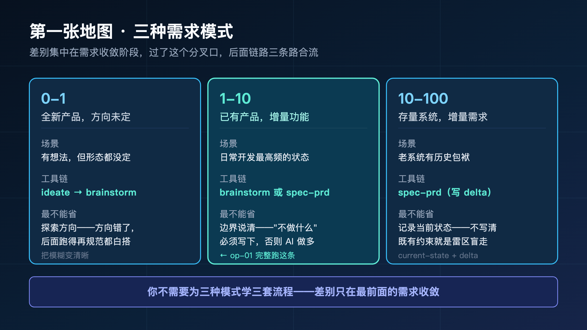
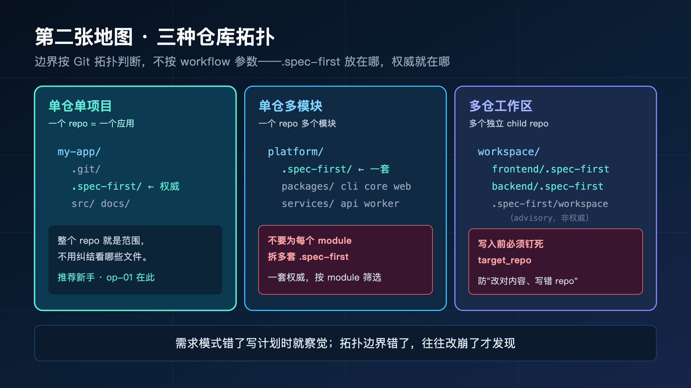
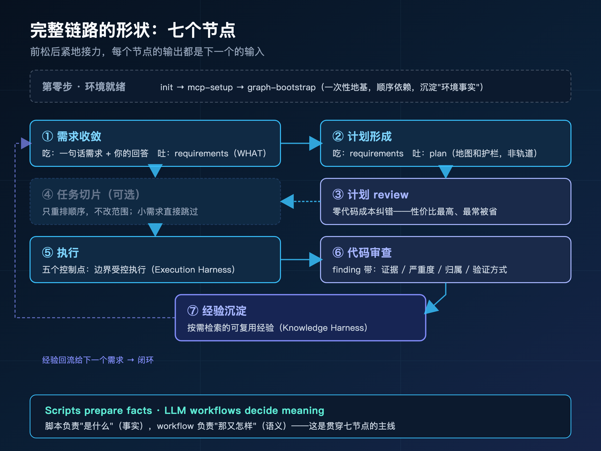
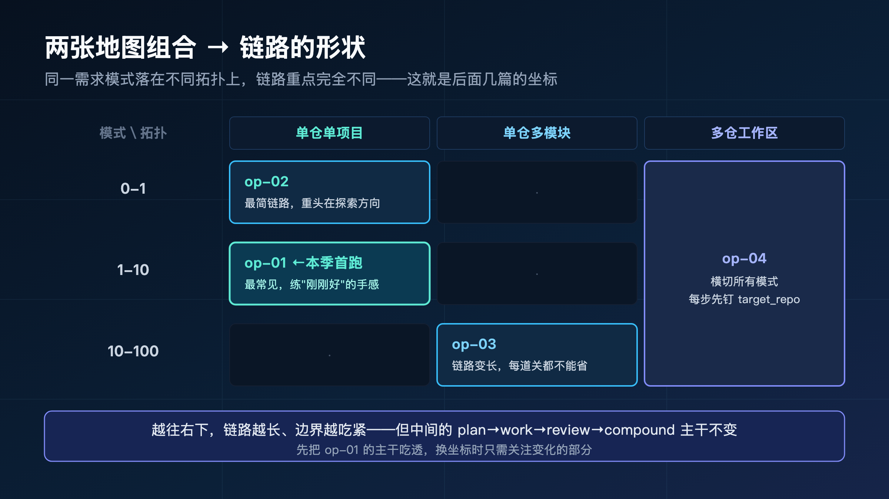
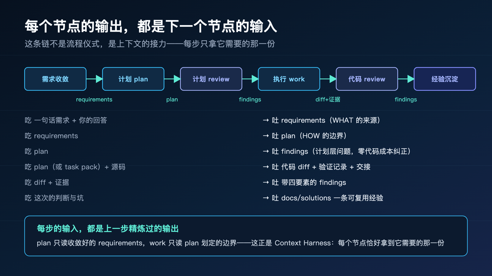
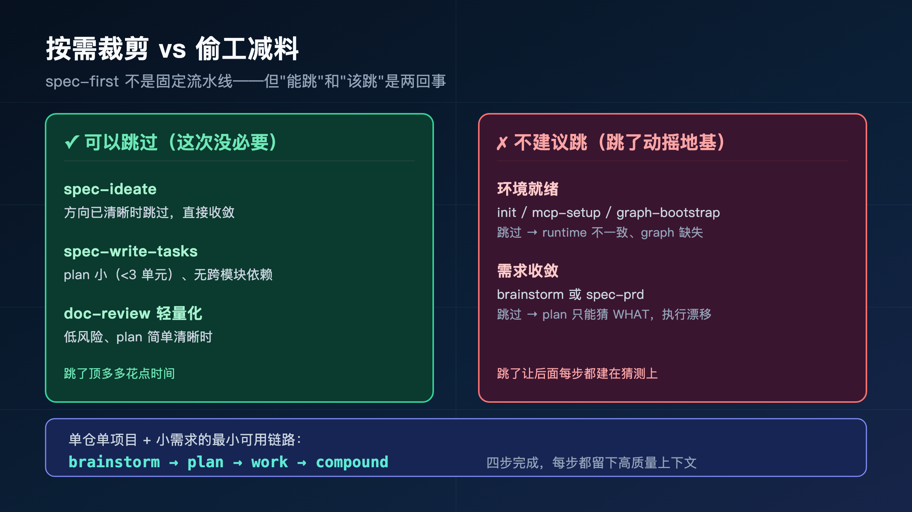

**先选地图，再走链路——不是所有人都走同一条路。**

> **导读**
> 第一季我们建立了 AI Coding Harness 的认知框架：为什么需要 Harness，每一层解决什么问题。
> 第二季从这里开始：怎么用。这篇文章建立两张地图，让你知道自己在哪里、该走哪条路。

---

## 01 为什么需要两张地图

第一季结束时，很多读者问了同一个问题：

> 我理解了 Harness 的价值，但我该从哪里开始？

这个问题比看起来更要命。我见过太多人，认同了方法论，一上手却卡在第一步——因为他们默认"所有需求都该用同一套流程跑"。

举两个真实的卡壳现场。

一个人想做个全新的小工具，方向还很模糊，但他直接上来就写详细计划——结果计划里全是"假设"，因为需求本身都没想清楚，计划只能建在沙子上，写完发现方向就是错的，整份计划作废。

另一个人在一个跑了三年的老系统上加功能，他像做新项目一样让 AI"自由发挥"，结果 AI 不知道这个系统的历史约束，改一处崩三处——因为存量系统最大的风险不是不会写，是不知道"原来这里不能动"。

**这两个人不是方法用错了，是一开始就站错了地图位置。** 全新产品和存量系统，本就该走不同的路。硬套同一套流程，要么是给小事配重型仪式，要么是给重活省掉关键防护——两个方向都会出问题。

所以在跑任何链路之前，先回答两个问题：

**第一件事：你在做什么阶段的产品？**

全新产品、已有产品增量功能、存量系统增量需求——这三种场景的需求工具不同，链路也不同。方向未定的，需要先探索；已经清晰的，需要快速收敛；有历史包袱的，需要精确描述改动。

**第二件事：你的代码库是什么结构？**

单个 Git repo、一个 repo 里有多个模块、多个独立 repo 组成的工作区——这三种拓扑的边界规则不同，操作方式也不同。最关键的是：边界划错了，AI 会把改动写到错误的地方。

这就是两张地图：**需求模式地图**和**仓库拓扑地图**。

两张地图决定了你该走哪条链路、用哪些工具、守哪些边界。

不是所有人都走同一条路。**先选地图，再走链路**——这是整个第二季所有实操案例的共同起点。

---

## 02 第一张地图：三种需求模式

先说清楚一件事：**0-1 / 1-10 / 10-100 是我为帮你快速选型提炼的助记说法，不是 spec-first 的官方术语。** spec-first 本身不按"规模"分类，它按需求所处的**阶段**提供不同入口工具——`spec-ideate`（要不要做、做哪个方向）、`spec-brainstorm`（讲清全新需求的 WHAT）、`spec-prd`（为存量系统的增量写 PRD 级需求）。我把这三类阶段对应到你最容易自我定位的三个规模区间，方便你一眼认出自己在哪。下面每种模式都会标出它对应的真实工具。

核心差别在需求阶段——其余链路（plan → work → review → compound）基本一致。



### 02.1 0-1：全新产品，方向未定

**场景：** 你有一个想法，但还不确定方向。需要先探索，再收敛。

想象你想做个"帮团队管理 AI coding 规范"的小工具。但具体做成什么样？一个 CLI？一个检查器？一个文档生成器？连形态都没定。这时候如果直接写计划，你会发现自己在为一个还不存在的方向写实现细节——纯属空想。

**工具链：** `spec-ideate` → `spec-brainstorm`

`spec-ideate` 是更早的方向探索工具。它帮你生成和评估多个方向候选，适合连需求方向都不确定时——它的产出不是"怎么做"，而是"值不值得做、做哪个方向"。

`spec-brainstorm` 接在后面，把选定的模糊意图收敛成可审查的 requirements brief。它不是头脑风暴，而是一个结构化的对话过程：谁在用、当前卡在哪里、哪些需求必须解决、哪些不在本轮范围内、成功标准是什么。

**产出物：** `docs/brainstorms/YYYY-MM-DD-NNN-{slug}-requirements.md`

这份文档应该回答：用户是谁、当前痛点是什么、成功标准是什么、不做什么。

**判断要点：** 0-1 最不能省的是"探索方向"这一步。方向错了，后面跑得再规范都是错的。

### 02.2 1-10：已有产品，增量功能

**场景：** 产品已经在跑，你要加一个新功能或改进一个已有功能。方向基本清楚，但需要把需求边界说清楚。

这是绝大多数人日常开发的状态——比如给一个待办应用加个标签过滤、给后台加个导出按钮。你知道要做什么，难点在"边界没说清 AI 就乱发挥"：单标签还是多标签？导出哪些字段？

**工具链：** `spec-brainstorm` 或 `spec-prd`

这个阶段两个工具都可以用：

- 如果需求还有一些模糊，用 `spec-brainstorm` 先收敛
- 如果需求已经比较清晰，直接用 `spec-prd` 写 PRD 级文档

**产出物：** requirements brief 或 PRD 需求文档

**判断要点：** 1-10 最不能省的是"边界说清"。方向不用探索，但"不做什么"必须写下来，否则 AI 会顺手做多。（这条路下一篇 op-01 会完整跑一遍。）

### 02.3 10-100：存量系统，增量需求

**场景：** 你在维护一个已经运行了很长时间的系统，需要在上面做增量改动。系统有历史包袱，改动需要精确描述 delta。

回到 §01 那个"改一处崩三处"的人——他的处境就是这个。老系统里藏着大量"看不见的约束"：这个字段别的模块在用、这段逻辑有历史原因、那个接口有外部依赖。新人和 AI 一样，不知道这些约束就动手，必崩。

**工具链：** `spec-prd`（brownfield increment）

`spec-prd` 是专门为存量系统设计的需求工具。

它的核心逻辑是：**current-state evidence + change delta**。

先描述当前系统是什么样的（current-state evidence），再描述这次改动要改什么（change delta）。

这样 plan 就不需要猜 WHAT——它知道当前系统的状态，只需要决定 HOW。

**产出物：** `docs/brainstorms/*-requirements.md`，frontmatter 里带 `artifact_kind: prd-requirements`

这个标记告诉下游 workflow：这是 PRD 级需求文档，质量更高，可以直接进入 plan。

**判断要点：** 10-100 最不能省的是"记录当前状态"。不先把既有约束写清楚，改动就是在雷区里盲走。

### 02.4 三种模式的核心差别

三种模式的核心差别只在需求阶段：

- 0-1：探索方向，把模糊变清晰
- 1-10：快速收敛，把清晰变可执行
- 10-100：描述 delta，让 plan 不用猜 WHAT

这是一个很重要的好消息：**你不需要为三种模式学三套完全不同的流程。** 差别集中在最前面的需求收敛——用什么工具、收敛到什么程度。一旦需求 brief 稳定下来，其余链路（plan → doc-review → work → code-review → compound）三种模式基本一致。

换句话说，需求阶段是三条路的分叉口，过了这个口，三条路就合流了。所以第二季的骨架案例（op-02/03/04）虽然坐标不同，重点也都落在"需求阶段怎么处理"上——后面的链路你跑一遍 op-01 就都会了。

---

## 03 第二张地图：三种仓库拓扑

第一张地图决定"需求怎么收敛"，第二张地图决定"边界划在哪、改动写到哪"。

这张地图常被忽略，但它管的是一个更隐蔽的风险：**AI 把改动写到了错误的位置**。需求模式错了，你写计划时就会察觉；拓扑边界错了，往往要到改崩了才发现。

一个核心原则先记住：

> **spec-first 的项目边界按 Git 拓扑判断，不按 workflow 参数判断。**

也就是说，"边界在哪"不是你在某个命令里传个参数说了算，而是由"这是几个 Git repo、`.spec-first/` 放在哪"这个物理事实决定的。这条原则是后面所有边界规则的根。



### 03.1 单仓单项目

**形态：** 一个 Git repo = 一个应用、SDK、CLI 或服务

```
my-app/
  .git/
  .spec-first/   ← 权威边界
  src/
  docs/
```

这是最稳定的基础模式，也是绝大多数项目的样子。

`.spec-first/` 的权威边界就是当前 repo root。所有 workflow（plan、work、review、compound）都以当前 repo 为边界——不用纠结"该看哪些文件"，整个 repo 就是范围。

`spec-mcp-setup` 写 `.spec-first/config/*`，并在同一步里完成 graph providers（CodeGraph / Graphify）的安装与首次生成——graph readiness 是 `spec-mcp-setup` 的一个环节，不是单独的命令。

**推荐新手从这里开始。** 边界最清晰、最不容易出错，下一篇 op-01 的标签过滤案例就落在这个拓扑上。绝大多数个人项目、独立服务、单个 SDK 都是这个形态——如果你不确定自己属于哪种拓扑，大概率就是这一种，按它走不会错。

### 03.2 单仓多模块

**形态：** 一个 Git repo 中包含多个 app、package、service 或 Android module

```
platform/
  .git/
  .spec-first/   ← 权威边界（整个 repo）
  packages/
    cli/
    core/
    web/
  services/
    api/
    worker/
```

这种模式仍然是**一个** Git 工程。这里有个最常见的错误判断，值得专门讲。

**关键原则：不要为每个 module 拆多套 `.spec-first`。**

很多人看到 monorepo 里有好几个模块，第一反应是"那每个模块各配一套 spec-first 不就独立了"。这恰恰是错的——如果每个 module 都有自己的 `.spec-first`，需求、计划、graph facts 和 review evidence 会**分裂**成好几份，互相看不见，跨模块的改动无从协调，维护成本爆炸。

一个 Git repo 就用一套 `.spec-first`。正确做法是：

- graph providers 覆盖整个 repo，再由 plan/work/review 按 module 边界**筛选**上下文（筛选，不是拆分）
- 大计划在 implementation units 或 task pack 中标清模块边界
- review 按变更文件和影响面分组，而不是按 `.spec-first` 目录拆分

**判断要点：** 边界跟着 Git repo 走，不跟着目录结构走。一个 repo，一套权威。判断很简单：跑 `git rev-parse --show-toplevel`，它指向哪，权威边界就在哪——哪怕这个 repo 里有十个模块，也还是一套 `.spec-first`。

### 03.3 多仓工作区

**形态：** 父目录下有多个独立 child Git repos

```
workspace/
  frontend/
    .git/
    .spec-first/   ← frontend 的权威边界
  backend-api/
    .git/
    .spec-first/   ← backend 的权威边界
  mobile-app/
    .git/
    .spec-first/   ← mobile 的权威边界
  .spec-first/
    workspace/     ← advisory facts，不是任何 child 的权威
```

这是最复杂、也最容易出事故的拓扑。

**关键规则：**

父目录的 `.spec-first/workspace/*summary.json` 是 advisory facts，不是任何 child repo 的 canonical truth。

换句话说，父目录不是一个"超级 repo"。它只是一个放了几个独立 repo 的文件夹，它能帮你做一些跨 repo 的概览（advisory），但每个 child repo 的权威边界仍然是它自己。

操作单个 child repo：

```bash
/spec:mcp-setup --repo frontend
```

批量操作所有 child repos：

```bash
/spec:mcp-setup --all-repos
```

**最重要的约束：** 写文件、修复、测试、review autofix 或 commit 之前，必须有明确的 `target_repo`。

为什么这条最关键？因为多仓场景下，最隐蔽的事故是**改对了内容、写错了 repo**。你想改 frontend 的一个组件，AI 因为当前 cwd 或某个 graph 结果的误导，把改动写进了 backend——代码本身没错，位置全错。

所以 spec-first 在这里立了一条硬规则：

**不能让 cwd、graph 结果或 workspace advisory 自动选择 child repo。** 每一次写入，都要有人（你）明确说清楚"写到哪个 repo"。

**判断要点：** 多仓的核心不是"功能怎么写"，是"边界怎么守"。op-04 会专门跑这个拓扑。

---

## 04 完整链路走查

两张地图建立之后，我们用一个真实需求，从地图高度俯瞰一遍完整链路。

强调一下这一节的视角：**我只带你看清每个节点是什么角色、吃什么、吐什么、什么时候能跳，不展开任何命令和踩坑。** 命令怎么敲、产物长什么样、每步会遇到哪些坑——那是下一篇 op-01 在"地面高度"做的事。这里你只需要把链路的形状记住：七个节点、一条主线。形状记牢了，下到地面跑才不会迷路。

在走之前，先点破一条贯穿整条链路的边界——它是整个系列最该记住的一句话：

> **Scripts prepare deterministic facts；LLM workflows decide semantic meaning.**
> 脚本只产确定性事实：路径、hash、新鲜度、readiness、退出码；
> LLM 只做语义判断：范围多大、取舍怎么定、finding 成不成立、根因是什么。

你会发现下面每一个节点，本质都是这条边界的具体兑现——graph 不可用时脚本如实报降级（这是事实），但"够不够用、要不要补源码读取"由 workflow 判断（这是语义）；任务切片的 hash 由脚本算（事实），但"链路算不算过期、要不要重来"由判断决定（语义）。脚本负责"是什么"，workflow 负责"那又怎样"。记住这条分工，整条链路就有了主线，每个节点都能对号入座。

为了让链路有具体的依托，我们设一个示例需求贯穿全程——但请注意，下面只讲这个需求在每个节点"会发生什么"，不讲"怎么操作"。选 1-10 这个最常见的坐标，也是为了让你下一篇读 op-01 时能把"形状"和"地面"对上号：同一个坐标，这里看骨架，下一篇看血肉。

**示例需求：** 改进 spec-first CLI 的首次使用体验。**模式：** 1-10（已有产品，增量功能）。**拓扑：** 单仓单项目。



### 04.1 第零步：环境就绪

任何 workflow 开始前，有三件一次性的准备，它们构成一条顺序依赖链：

```
生成 runtime assets  →  安装/验证 MCP 与 helper  →  编译 graph readiness facts
   （从 source 初始化）      （依赖上一步的 runtime）      （依赖上一步的 provider 配置）
```

形状上记住两点就够。第一，**它们有先后**——后一步依赖前一步的产物，跳着做会缺料。第二，**它们沉淀的是"环境事实"**：这台机器装了哪些能力、graph 可不可用、provider 是什么。这些事实写进 `.spec-first/config`，下游每个 workflow 都会读它来判断"我手里有哪些牌"。如果 graph facts 不可用、过期或降级，后续节点会明确退到有界的直接源码读取，而不是静默失败——这正是开篇那条边界的第一次兑现：脚本如实报告状态（事实），workflow 决定怎么应对（语义）。

具体怎么装、每条命令的参数、产物路径长什么样，op-01 会一步步演示。这里你只要知道：**这是地基，一个项目铺一次，之后所有需求共用。**

### 04.2 第一步：需求收敛

链路的第一个真正节点，是把"一句话需求"收敛成一份可审查的需求文档。

这一步用哪个工具，正是第一张地图决定的：0-1 先 ideate 探索再 brainstorm，1-10 用 brainstorm 或 spec-prd，10-100 用 spec-prd 写 delta。但不管用哪个，**这个节点的角色是固定的**：它吃的是"一句模糊的话 + 你对几个关键问题的回答"，吐的是一份回答了"谁在用、卡在哪、成功标准是什么、不做什么"的需求文档。

这份文档是整条链路的 WHAT 来源。后面每一步——计划、执行、审查——但凡要回答"我们到底要做什么"，答案都从这里取。需求收敛的质量，直接决定了下游所有节点是在"按图施工"还是在"替你猜"。

这个节点的具体提问、产出文档的结构、不同模式产物的细微差别，op-01 会在 1-10 这个坐标上完整演示一遍。

### 04.3 第二步：计划形成

需求稳定后，进入 plan。这个节点把"要做什么"翻译成"准备怎么做"——它吃需求文档，吐一份工程决策上下文：实施目标与非目标、大致的改动区域与依赖、风险点与验证方式。

形状上最该记住的，是 plan 的**边界感**：

**plan 不是微观指令，它给的是地图和护栏，不是轨道。** 很多人以为 plan 越详细越好，恨不得把每行代码都写进去——但那样 plan 就退化成"用自然语言把代码写一遍"，既僵硬又脆弱：实现时遇到任何一点现实阻力，整张"轨道"就断了。好的 plan 约束 scope、验证方式、风险和交接，但把实现细节留给执行阶段的 LLM 去判断。

这层"该约束到哪、该放手到哪"的分寸，是 plan 最难也最值得拿捏的，op-01 会用实际案例展开。

### 04.4 第三步：计划 review

plan 写完，先别急着写代码——这里插入一道审查，从一致性、可行性、范围、对抗性盲点几个角度审视计划本身。

这几个角度里，"对抗性"最值得留意：它不是检查"计划写得对不对"，而是主动追问"这个计划在什么情况下会崩"——边界条件漏了没、有没有想当然的前提、最坏情况考虑了吗。一致性和可行性是顺着计划看，对抗性是反着计划想，两个方向合起来才不容易留死角。

这个节点在链路里的位置极其关键，因为它卡在"还没写一行代码"的时间点上：

**需求和计划层面的错，永远比代码层面的错便宜得多。** 此刻计划里的错——范围划歪了、漏了一个边界、风险没看到——改起来成本几乎是零；等代码写完才发现需求理解错了，那就是整段返工。这是整条链路里性价比最高的一步，却也最常被省——因为它"看起来没产出代码"。形状上你只要记住：**这道关越早过，后面省得越多。**

### 04.5 第四步：任务切片（可选）

如果计划涉及多个模块、有明确的依赖或并行机会，可以多插一个节点：把 plan 编译成可执行的任务切片包。它的价值是确定性交接——记录源计划、hash、任务依赖图和验证信号，并且带着身份标记，防止"拿着一份已经过期的计划闷头执行"。

但请注意它头上的"可选"二字。**这个节点只重排执行顺序，不改变范围、验收标准或非目标。** 计划小、没有跨模块依赖时，直接跳过它进入执行就好。它是为复杂度服务的，不是每次都要走的仪式——这正好呼应两张地图的精神：链路的形状跟着需求大小走。

### 04.6 第五步：执行

到这里才真正开始写代码。执行节点吃的是计划（或任务切片）加上相关源码，吐的是最小可验证的改动。

它的形状里藏着五个控制点，每一个都在防一种具体的跑偏：

- 开工前**确认边界**，防"顺手做多"；
- 核对**任务身份**，防"拿着过期计划闷头跑"；
- **先打通一条最小竖切**再扩展，防"一次摊开全做、哪个都不扎实"；
- 内置**审查关卡**，防"错误攒到最后才爆"；
- 留下**交接证据**，防"下一步又得从零理解"。

这五点合起来，就是把"让 AI 自由发挥"变成"在边界内受控执行"的那道约束——这正是第一季讲的 Execution Harness 落在地面上的样子。具体每个控制点怎么触发、执行时产出哪些证据，op-01 会贴着真实改动展示。

### 04.7 第六步：代码审查

代码写完，审查节点登场。它从正确性、安全、性能、可维护性、测试、文档六个维度审视改动，吃的是改动差异加证据，吐的是一组可执行的 finding。

形状上最该记住的，是它和"让 AI 再看一眼"的根本区别——每个 finding 都带四样东西：

> **证据在哪、多严重、谁来修、怎么验证。**

你让 AI"再检查一下"，它回你一句"看起来没问题"——没有证据、没有严重度、没有归属、没法验证，等于没说。而带这四样的 finding，你拿到就能直接动手。更关键的是，它审的是**你仓库里已经写下的规则**（`AGENTS.md`、`CLAUDE.md`、`docs/contracts`），不是凭空的通用标准。这引出后面会反复强调的一句：**你今天沉淀的判断，就是明天 review 的标准。**

### 04.8 第七步：经验沉淀

链路的最后一个节点，在任务刚结束、上下文最新鲜时，问一个问题：这次解决的事，值得记下来吗？

值得的话，它把这次的判断和踩过的坑写成一条结构化经验，带上"什么情况下适用"的标记，让它**可被未来检索**。形状上有两个克制之处值得记住：

第一，**按需检索，而不是全量预读**。它不要求每个 workflow 启动时都把整个知识库读一遍（那会让上下文爆炸），而是靠标记精确命中，只在相关场景下读匹配的那几条。第二，**不是什么都记**——一次性的、查文档就能解决的不必记，只有"下次很可能再遇到、且解法不显而易见"的才值得沉淀。这一层就是第一季讲的 Knowledge Harness：让经验复利，但不让知识库变成负担。

到这里，一个需求从一句话走到了沉淀。下次相关需求进来，它会先读到这条经验——这就是闭环。整条链路的形状你已经看完了：七个节点，前松后紧地接力，每个节点的输出都是下一个的输入。下一节我们把这个"接力"关系单独拎出来看清楚。

---

## 05 两张地图的组合

两张地图不是各管各的——它们组合起来，决定了你这次具体该走哪条链路。同样一个需求模式，落在不同拓扑上，链路的重点完全不同。



下面挑四个有代表性的组合，看它们的链路各自长什么样、重点在哪。这正好对应第二季后面几篇骨架案例的坐标。

### 05.1 最简单：0-1 × 单仓单项目

```
ideate → brainstorm → plan → work → review → compound
```

新手推荐从这里开始。链路最短、边界最清晰，唯一的重头戏在最前面——用 ideate 探索方向。

为什么重头戏在前面？因为 0-1 的全部风险都集中在"方向对不对"上。方向一旦定错，后面计划写得再漂亮、代码写得再干净，做出来的也是一个没人要的东西——这是 0-1 最贵的错，而它恰恰发生在第一步。所以这条链路的资源要往前压：宁可在 ideate 和 brainstorm 上多花时间反复推敲，也别急着进 plan。反过来，方向一旦定了，0-1 后半段和普通增量开发几乎没区别——因为"全新"带来的不确定性已经在前面消化掉了。**这是 op-02 的坐标。**

### 05.2 最常见：1-10 × 单仓单项目

```
brainstorm/spec-prd → plan → doc-review → work → code-review → compound
```

这是大多数日常开发的场景，也是你跑得最频繁的一条。它的难点很微妙——不在哪一步特别重，而在"每步都别省、但每步都别过度"这个分寸上。

小需求最容易犯两个相反的错：一是嫌麻烦，把需求收敛和 review 全跳了，直接让 AI 开干，于是回到开篇那三种缺失；二是用力过猛，给一个改几行的小功能套上完整的 task pack 和重型 review，把十分钟的活拖成半天。正确的姿势是按需裁剪——doc-review 轻量化、write-tasks 直接跳过，但需求边界和一道轻量审查不能省。这种"刚刚好"的手感，是日常开发最值得练的。**这是 op-01 的坐标，下一篇完整跑它。**

### 05.3 存量系统：10-100 × 单仓多模块

```
spec-prd → plan（按 module 拆 units）→ doc-review → write-tasks → work → code-review → compound
```

注意这条链路明显变长了：write-tasks 不再可选、doc-review 不能轻量化。

为什么变长？因为存量 + 多模块叠加了两重风险。存量意味着系统里藏着大量"看不见的约束"，改动稍不留神就触发连锁反应；多模块意味着一处改动可能牵连好几个模块，影响面天然就大。这两重叠加，让每一道关都从"可选"变成"必需"——spec-prd 先把当前状态和改动 delta 写清楚，让 plan 不必猜；plan 按 module 边界把改动拆成可独立验证的单元；write-tasks 把这些单元的依赖顺序固化下来，防止漏改或乱序；review 按影响面分组，确保每个被牵连的模块都被看过。链路变长不是繁琐，是风险换来的必要防护——这正是"给重活省关键步骤"会出事的那一类。**这是 op-03 的坐标。**

### 05.4 最复杂：多仓工作区

无论哪种需求模式，多仓工作区都有一个额外约束：

**每一步写入之前，必须有明确的 `target_repo`。**

父 workspace 只做候选发现和 advisory summary，不能替代 child repo 的 canonical facts。

这条约束横切所有需求模式——不管你在多仓里做 0-1 还是改存量，"写到哪个 repo"这个问题都比"写什么内容"先要回答。多仓的难点从来不在功能本身，而在协调：多个 repo、可能多个人、可能多个端，任何一次写入位置的错误都可能悄无声息地埋下事故。最隐蔽的一种是"改对了内容、写错了 repo"——代码本身没毛病，位置全错，而且往往要到很久以后才暴露。所以这条链路的每一步都比别的拓扑多压一道"确认边界"，宁可啰嗦也不让 cwd 或某个中间结果替你默默选了 repo。**这是 op-04 的坐标，也是整季边界规则最吃紧的一篇。**

---

## 06 每个节点的输入/输出



每个节点的输入、输出、适用模式和多仓注意事项一目了然。

把整条链路当成一条流水线看，每个节点的"吃什么、吐什么"是这样的：

- **brainstorm / spec-prd**：吃"一句话需求 + 你的回答"，吐 `requirements`（WHAT 的来源）。
- **plan**：吃 `requirements`，吐 `plan`（HOW 的边界——目标、非目标、风险、验证）。
- **doc-review**：吃 `plan`，吐 `findings`（计划层的问题，零代码成本时纠正）。
- **write-tasks**：吃 `plan`，吐 `task pack`（带 `spec_id`/`hash` 的可执行切片，可选）。
- **work**：吃 `plan`（或 task pack）+ 源码，吐代码 diff + 验证记录 + handoff。
- **code-review**：吃 diff + 证据，吐带 severity/evidence/owner/verification 的 `findings`。
- **compound**：吃这次的判断与坑，吐 `docs/solutions` 里一条可复用、可失效的经验。

看清这条"输入→输出"链，你会发现一个规律：**每个节点的输出，都是下一个节点的输入。** 需求喂给计划，计划喂给执行，执行喂给审查，审查和经验又回流给下一个需求。这条链不是流程仪式，是上下文的接力。

这个"接力"视角，是理解整条链路最关键的一把钥匙，值得多说一句。传统开发里，"需求""设计""编码""测试"也是一串环节，但它们之间传递的常常是**人脑里的理解**——你跟 AI 说一句、它做一版、你再纠正一句，上下文全在那个随时会关掉的对话框里。spec-first 把每一次传递都**落成了文件**：需求是文件、计划是文件、findings 是文件、经验是文件。于是接力的不再是"我记得我们要做什么"，而是"白纸黑字写在 `docs/` 里、下一个节点（哪怕换个 AI、换个人、隔三个月）能直接读取的上下文"。

这恰好呼应第一季的 Context Harness：**正确的上下文不是把所有东西一股脑塞进去，而是让每个节点恰好拿到它需要的那一份。** plan 不需要重读你和 brainstorm 的全部对话，它只读那份收敛好的 requirements；work 不需要理解 review 的全部推理，它只读 plan 划定的边界。每个节点的输入都是上一个节点**精炼过**的输出——这条链省下的，正是"每一步都从头解释一遍"的巨大消耗。

几个关键点：

- **ideate** 只适用于 0-1 场景，方向已清晰时直接跳过
- **spec-prd** 适用于 1-10 / 10-100，产出 PRD 级需求文档
- **write-tasks** 是可选步骤，复杂任务才需要；注意它是独立安装的 standalone skill，调用方式和其他 `/spec:` 入口略有不同（按你宿主里 write-tasks skill 的安装说明触发）
- **多仓工作区**：plan、write-tasks、work 这三步都需要明确 `target_repo`，写入前必须确认边界

---

## 07 主链之外：三个绕不开的配套

前面七个节点是一条需求从"一句话"到"沉淀"的**主链**。但真实项目里，主链之外还有三件事你迟早会撞上——它们不是新的链路，而是主链跑顺之后必然出现的真实状况：代码会出错、会换会话回头查、攒下的经验会过期。spec-first 为这三件事各准备了一个工具，它们是主链的天然延伸，放在这里一并看清，你对 spec-first 能干什么才有完整的全局认识。

### 07.1 出错了：`spec-debug`

主链的 work 节点是"建"，`spec-debug` 是"修"。当代码改崩了、测试反复失败、或者从 issue 追一个线上 bug 时，它不是让你反复问 AI"你再看看"，而是把排错变成**可追踪的假设验证**：一次只改一件事、先复现再修复、根因必须有 source/test/log 支撑，每一步假设和证据都落下来。

**什么时候用：** work 跑出来的东西不对、bug 反复出现、卡在一个问题上多次尝试无果时。它和 work 是兄弟节点——一个负责按计划建，一个负责出问题时系统化地查。**op-05 会用一个真实 bug 完整跑一遍。**

### 07.2 回头查：`spec-sessions`

主链每一步都把上下文落成了文件，但还有一类上下文落在**过往的 agent 会话**里——"上次这个问题是怎么调查的""那个方案为什么被否了""最近几次都改了什么"。`spec-sessions` 让你检索和追问这些历史，把散落在多个会话里的经过重新接上。

**什么时候用：** 换了会话/换了 A/接手别人的活，需要回答"之前发生过什么"时。它和 compound 互补——compound 沉淀的是"提炼好的结论"，sessions 找回的是"当时的过程"。**op-06 会在跨会话接力的场景里用到它。**

### 07.3 经验会过期：`spec-compound-refresh`

compound 把经验写进 `docs/solutions/`，但代码在变，经验会**漂移**：当初记的解法可能已经不适用、两条经验可能该合并、有的甚至该删。`spec-compound-refresh` 拿这些沉淀对照当前代码库逐条复核，该更新的更新、该合并的合并、该退役的退役。

**什么时候用：** `docs/solutions/` 攒了一阵、怀疑里面有过时内容时，定期扫一遍。它是 compound 的维护配套——compound 负责"攒"，compound-refresh 负责让攒下的东西**保持可信**，否则知识库会从"资产"慢慢变成"误导"。

> 这三个配套加上前面七个节点，构成了 spec-first 日常开发会用到的核心能力。除此之外 spec-first 还有面向特定场景的专项能力（指标驱动优化 `spec-optimize`、浏览器 UI 打磨 `spec-polish-beta`、App 一致性与 skill 治理审计、组织上下文检索等），不在主链上、按需取用，本系列在第三季细节季再逐个展开。

---

## 08 什么时候可以跳过某些步骤

spec-first 不是固定流水线，可以按场景灵活组合。



### 08.1 可以跳过的步骤

**`spec-ideate`**：方向已清晰时跳过，直接 brainstorm 或 spec-prd。

**`spec-write-tasks`**：plan 小（< 3 个 implementation units）、无跨模块依赖时跳过，直接 work。

**`spec-doc-review` 轻量化**：低风险改动、plan 简单清晰时可以轻量化。但大需求、跨模块、高风险时不建议跳过。

### 08.2 不建议跳过的步骤

**环境就绪（init → mcp-setup，含 graph readiness）**：这是所有 workflow 的前提。`spec-first init` 生成 runtime assets，`spec-mcp-setup` 装 MCP/provider 并完成 graph 首次生成。跳过会导致 runtime 不一致、graph facts 缺失，后续 workflow 行为不可预测。

**需求收敛（brainstorm 或 spec-prd）**：没有需求文档，plan 就要猜 WHAT。猜出来的 plan 很容易在执行中漂移。

这里有个清晰的判断准绳：**可以跳过的，都是"这次没必要"的步骤（方向已清晰、改动够小）；不建议跳的，都是"跳了就动摇地基"的步骤（环境、需求）。** 前者是按需裁剪，后者是偷工减料——区别在于，跳过 ideate 顶多多花点时间，跳过需求收敛则会让后面每一步都建在猜测上。学会区分这两类，比记住"有哪些步骤"更重要。

### 08.3 最小可用链路

单仓单项目 + 小需求的最小链路：

```
brainstorm → plan → work → compound
```

四步完成，每步都留下高质量上下文。

---

## 09 上手前的三步自检

讲了两张地图，怎么真正用起来？给你一个可以直接套用的三步自检——任何需求动手前，先问这三个问题：

**第一步：定位需求模式。** 问自己"这个需求，方向定了吗、是新建还是改存量"。

- 方向没定 → 0-1，先 `ideate` 探索
- 方向清楚、改的是新功能 → 1-10，`brainstorm`/`spec-prd` 收敛边界
- 改的是有历史包袱的老系统 → 10-100，`spec-prd` 写 delta

**第二步：定位仓库拓扑。** 问自己"我要改的代码，在几个 Git repo 里"。

- 一个 repo 一个应用 → 单仓单项目，直接以 repo 为边界
- 一个 repo 多个模块 → 单仓多模块，一套 `.spec-first`，按 module 筛选
- 多个独立 repo → 多仓工作区，每步写入前钉死 `target_repo`

**第三步：据此裁剪链路。** 模式和拓扑定了，链路的形状就定了——小需求砍掉 write-tasks、轻量化 doc-review；存量多模块则一道关都不能省。

这三步花不了一分钟，但它替你避开了第二季开篇那两个卡壳现场：不会再"方向没定就写计划"，也不会再"把老系统当新项目改"。

为什么是这个顺序？因为这三步是层层收窄的：需求模式决定"前半段链路用什么工具"，仓库拓扑决定"全程边界划在哪"，两者定了，第三步的链路裁剪几乎是自动的——你不是在"设计流程"，而是在"读出"这个坐标对应的标准走法。熟练之后，这三步会变成你看到任何需求时的下意识反应，不再需要刻意自检。

> **先选地图，再走链路。** 这是后面每一篇实操案例都会重复的第一个动作。

---

## 10 一个真实的感受

我用 spec-first 开发 spec-first 本身已经超过半年。

最开始，我也觉得这些步骤有点繁琐。明明一句话能让 AI 开干的事，为什么要先 brainstorm 再 plan 再 review？

但随着项目变大，我越来越感受到这套链路的价值。讲一个具体的体感。

有一次我隔了快两个月回去改一个模块，完全忘了当初为什么那样设计。换作以前，我得花半天重新读代码、猜意图。但这次我打开 `docs/plans` 和 `docs/solutions`，当初的需求边界、计划取舍、踩过的坑，全在那里——十分钟我就回到了状态。那一刻我真正理解了这套链路在攒什么：**它攒的不是文档，是"未来的我"和"接手的人"能直接读取的上下文。**

还有一次，我把一个任务从 Claude Code 换到 Codex 继续做。因为需求、计划、约束都已经落在 `docs/` 里，新的 agent 不需要我重新解释一遍意图——它读文档就接上了。如果当初是"一句话甩给 AI"，这些上下文只存在于那个已经关掉的对话框里，换个 agent 就得从零开始。

把这些体感收敛成一句：

**不是每次任务都要走完所有步骤，而是每次任务都留下了下一次任务能读取的上下文。**

- 当我三个月后回来修一个 bug，我不需要重新理解整个系统。
- 当我换了一个 AI agent，它不需要从零开始猜我的意图。
- 当团队里来了新人，他们不需要靠口耳相传了解历史决策。

这就是 spec-first 的核心价值：

> **不是让 AI 更聪明，而是让每次任务都让下一次任务更容易。**

两张地图、完整链路、可跳过的步骤——所有这些机制，最终都服务于这一句。地图让你选对路，链路让每一步留下证据，而证据让下一次更容易。

这也是为什么第二季从这篇总览开始：不先建立"先选地图、再走链路"的全局视角，后面每一篇实操都会变成孤立的命令清单，你学会的是七个步骤，而不是一套能按场景自由组合的工程方法。看清地图，你才知道每一篇案例是站在整张图的哪个坐标上——这比记住任何单个命令都重要。

---

## 11 本篇小结

这篇文章建立了两张地图：

**第一张：三种需求模式**

- 0-1：ideate → brainstorm，探索方向
- 1-10：brainstorm 或 spec-prd，快速收敛
- 10-100：spec-prd，描述 delta，让 plan 不用猜 WHAT

**第二张：三种仓库拓扑**

- 单仓单项目：最稳定，推荐新手从这里开始
- 单仓多模块：不拆多套 `.spec-first`，由 plan/work/review 按 module 边界拆分
- 多仓工作区：写入前必须有明确 `target_repo`，父 workspace 只做 advisory

两张地图决定链路，不是所有人都走同一条路。

如果这篇只让你记住一件事，我希望是这个动作：**任何需求动手前，先在两张地图上定位自己——我在哪个需求模式、哪个仓库拓扑——再决定走哪条链路、守哪些边界。** 第二季后面的每一篇，本质都是带你站在某一个坐标上，把这条链路真实跑一遍：op-01 是 1-10×单仓（最常见），op-02 是 0-1（方向未定），op-03 是 10-100×多模块（存量），op-04 是多仓（边界最难守）；再用三个切面篇补上"出错了怎么办、换人怎么接、上线敢不敢信"。

这一篇给你地图，后面给你地形。

接下来，我们用真实项目案例逐个场景把这条链路跑一遍：日常增量功能、从 0 到 1 新产品、存量系统改造、多仓与团队协作，再补上调试、接力、上线信心三个绕不开的切面。

下一篇：

> **Spec-First：给一个真实功能从头跑一遍，我才敢说它能用**

用最常见的日常增量需求——给一个待办应用加标签过滤——从环境就绪一路跑到经验沉淀，每步给命令、产物和判断。

---

`spec-first` 是开源项目，欢迎试用、提 issue、提建议。

**GitHub：** http://github.com/sunrain520/spec-first

**官网：** http://spec-first.cn/
