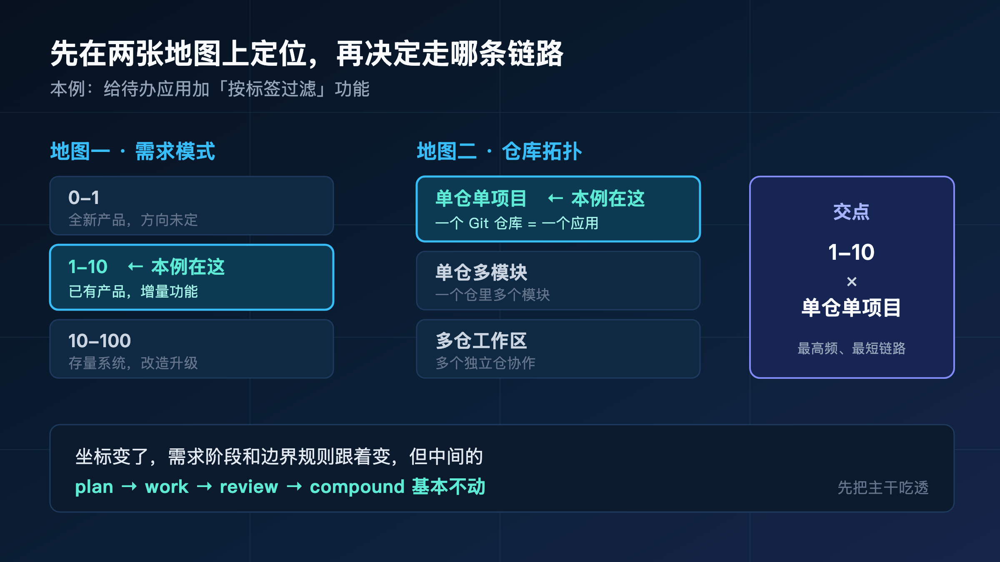
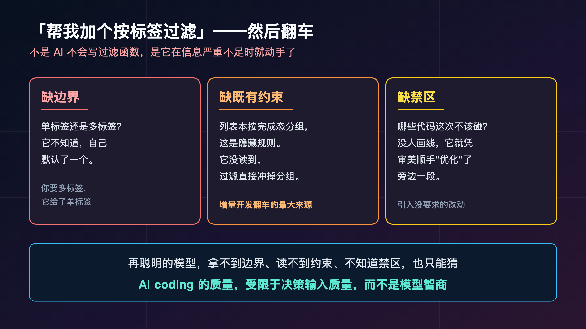
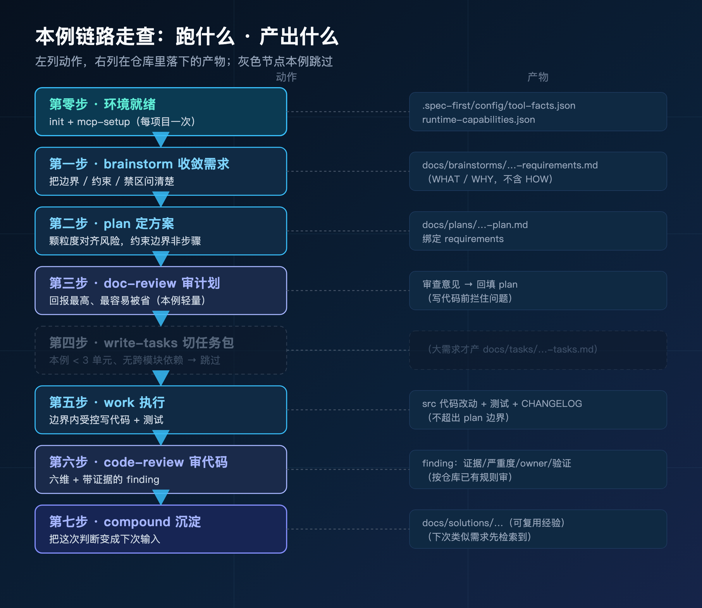
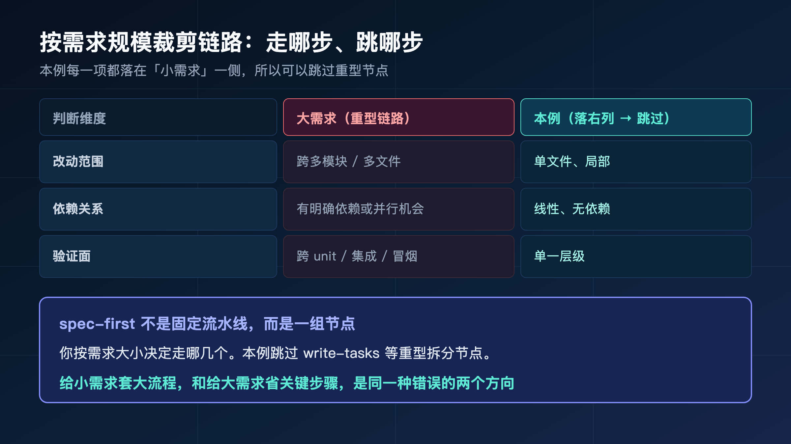
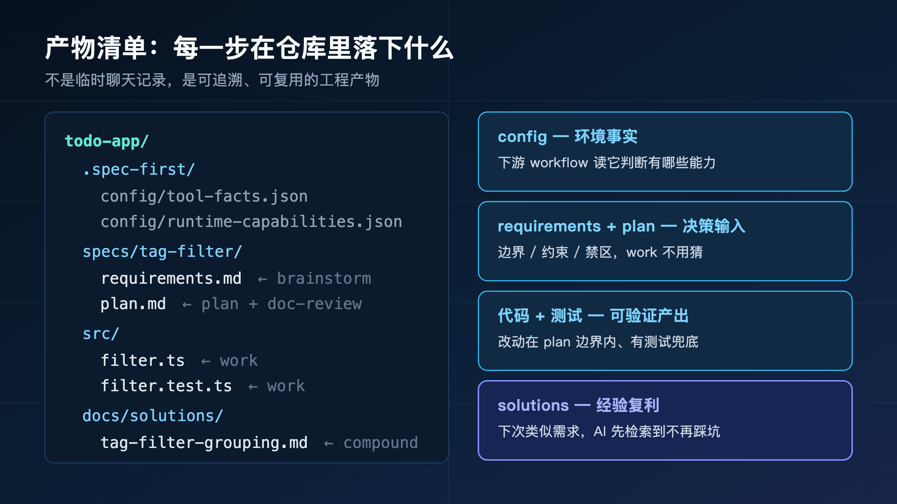
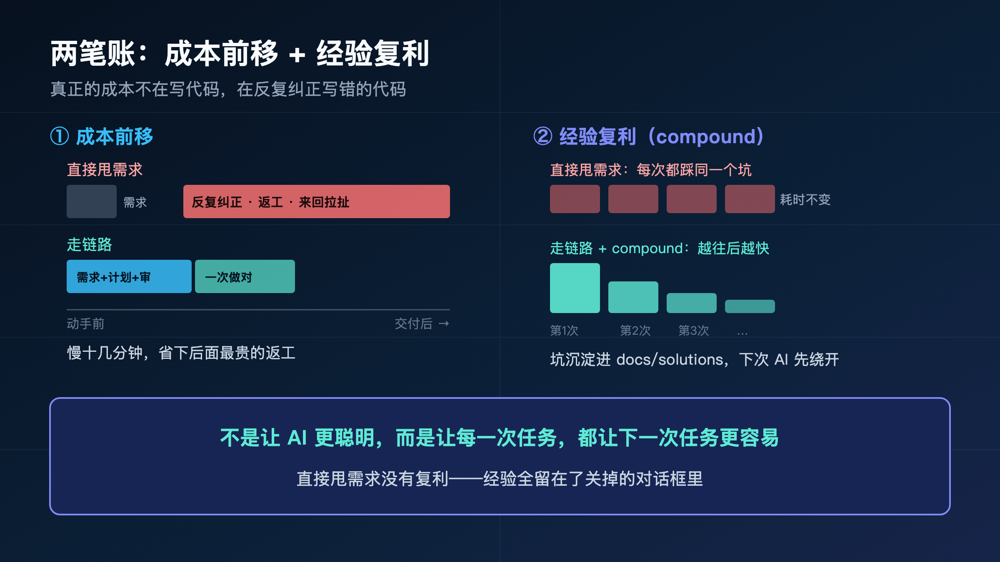

**第一季讲清了为什么需要 Harness。但"理解"和"敢用"之间，隔着一次真实的从头跑通。**

> **导读**
> 这篇文章解决一个很具体的问题：道理我都懂了，可一个真实需求摆在面前，spec-first 到底是怎么一步步跑下来的？
> 我的答案是：用一个谁都看得懂的小功能，从一句话需求，走到代码、审查、再到沉淀成下次能复用的经验。不跳步，不藏命令，让你看到每个节点接收什么、交出什么。

第一季我们建立了认知：AI coding 的瓶颈不在模型聪不聪明，而在你喂给它的决策输入质量。

第二季换个问法：那它在真实项目里，到底怎么用？

这一篇是第二季的起点。我不讲抽象流程，我挑一个最普通的日常需求，从头到尾跑一遍给你看。

说实话，第一季写完，后台问得最多的就是一句话：道理我认了，可具体怎么落到我手上的活？方法论讲得再漂亮，不亲眼看它在一个真实需求上从头跑到尾，你心里那道"它到底靠不靠谱"的坎，是过不去的。这一篇就是来过这道坎的——全程用一个待办应用的小功能，每一步都摊开给你看，包括哪一步我跳过了、为什么跳。

---

## 01 先说清楚：我们要做的是什么

我选的案例，普通到不能再普通。

**给一个已经在跑的待办应用（todo-app），加一个"按标签过滤任务"的功能。**

就这么一句话。任务多了找不着，想按标签筛一下——任何用过待办工具的人都懂这个需求。

我故意选它，因为它太典型了：

- 不是从零做新产品，是**给已有产品加增量功能**。
- 改动不大，但也不是改个文案那么简单——它要碰过滤逻辑、列表组件、状态管理。
- 它就是你每周都在做的那种活。

在 spec-first 里，这种需求有个坐标：**1-10 模式 × 单仓单项目**。

这两个词第二季会反复出现，先记住它的位置就行——已有产品（不是 0-1 全新）、增量功能（不是大重构）、一个 Git 仓库就是一个应用（不是多仓、不是多模块）。

如果你看过本季的总览篇（op-00），会记得那"两张地图"：一张是**需求模式**（0-1 全新 / 1-10 增量 / 10-100 存量改造），一张是**仓库拓扑**（单仓单项目 / 单仓多模块 / 多仓工作区）。任何一个需求，都先在这两张地图上定位，再决定走哪条链路。

我们这次落在两张地图最简单、也最高频的那个交点：**增量功能 × 单仓单项目**。我故意从这个交点开始，因为：

- 它是你日常开发里出现频率最高的场景，跑通它收益最大。
- 它的链路最短、最干净，适合第一次完整看清每个节点。
- 后面几篇会逐个换坐标——0-1 新产品、10-100 存量改造、多仓多端——你会看到，**坐标变了，需求阶段和边界规则跟着变，但中间的 plan → work → review → compound 基本不动。** 先把这条主干吃透，换坐标时你只需要关注变化的部分。

这是最常见的日常开发场景。把这条路跑通，你手上 80% 的活都能照着走。



下面我会用这个需求，走完 spec-first 的完整链路。每一步我都告诉你三件事：**跑什么、产出什么、什么时候能跳过。**

---

## 02 不用 spec-first，这个需求会怎么翻车

在跑链路之前，先看看不用任何方法、直接把需求甩给 AI 会发生什么。

你打开 AI 助手，敲下：

> "帮我给 todo-app 加一个按标签过滤任务的功能。"

然后呢？大概率是这样：

它很快给你写出了一个过滤函数，看起来挺像样。但你一跑就发现问题：

- 它改了过滤逻辑，**却漏了"已完成"任务的显示规则**——筛选之后，已完成和未完成混在一起了，因为它不知道你的列表本来按完成态分组。
- 它给了单标签过滤，**但你想要多标签**——它没问你，自己默认了一个。
- 它没写任何测试，你也不知道空结果、标签全选这些边界它考虑没有。
- 最要命的是，它顺手"优化"了旁边一段它觉得不好看的代码，引入了一个你没要求的改动。

问题出在哪？

**不是 AI 不会写过滤函数。过滤函数它写得很好。**

问题是它在**信息严重不足**的情况下就开始动手了。把上面四个问题归一下类，其实是三种缺失：

- **缺边界**：单标签还是多标签？它不知道，于是自己默认了一个。你要的是多标签，它给了单标签——不是能力问题，是它根本没拿到这个决策。
- **缺既有约束**：你的列表本来按完成态分组，这是历史代码里的隐藏规则。它没读到、也没人告诉它，于是过滤逻辑直接把分组冲掉了。这种"看不见的既有约束"，是增量开发翻车的最大来源。
- **缺禁区**：哪些代码这次不该碰？没人画线，它就凭审美顺手"优化"了旁边一段，引入了一个你没要求、也没人 review 的改动。

这三种缺失，没有一种是靠"换个更聪明的模型"能解决的。再聪明的模型，拿不到边界、读不到约束、不知道禁区，也只能猜。

它只能猜。猜错了，你再来回纠正，越纠越乱——而且每一轮纠正，你都在用自然语言描述一个本可以提前定义好的决策，效率极低。



第一季那句话，在这里又应验了一次：

> **AI coding 的质量，受限于你给它的决策输入质量，而不是模型的智商。**

spec-first 要做的，就是在动手之前，把这些决策输入一个个补齐。下面正式开始。

---

## 03 第零步：先让环境就绪（每个项目只做一次）

在跑任何东西之前，有三件事要先办好。它们是一次性的——一个项目装一次，之后所有需求都直接用。

我先把它单列出来，是因为它最容易被跳过，而跳过它后面全乱。

### 03.1 装好、初始化、重启

```bash
npm install -g spec-first
spec-first doctor
spec-first init --claude -u yourname --lang zh
```

`doctor` 是体检，告诉你环境缺什么。`init` 从源头生成宿主要用的 runtime assets——用 Codex 的把 `--claude` 换成 `--codex` 即可。

跑完 `init`，**重启你的宿主**（Claude Code 或 Codex），让生成的东西生效。这一步别省。

### 03.2 装好 runtime，写下项目事实

重启后，在宿主里跑：

```text
/spec:mcp-setup          # Claude Code
$spec-mcp-setup          # Codex
```

它负责装好并验证 required MCP servers、可选的 graph providers、helper tools，然后把这些事实写进 `.spec-first/config/`。

**产出：** `.spec-first/config/tool-facts.json`、`.spec-first/config/runtime-capabilities.json`。

这两个文件不是摆设——后面每个 workflow 都会读它们，来判断"当前环境有哪些能力可用"。举个例子：如果你装了代码图谱 provider，后面的 work 和 review 就能用图谱事实来定位影响面；如果没装，它们会诚实地降级到直接读源码，而不是假装有图谱然后乱猜。环境事实写下来，下游才知道自己手里有什么牌。

### 03.3 为什么这三件事有顺序

它们不是并列的，是依赖链：

```text
spec-first init            （先从 source 生成 host runtime）
  → spec-mcp-setup         （依赖 init 的产物，装 MCP / provider）
```

装反了，后面会报 runtime 不一致。这就像装修——先有水电（init 生成 runtime），才能装电器（mcp-setup 接 MCP/provider）。顺序错了，电器没处插。

> **这一步永远别跳。** 它是所有 workflow 的地基。地基没打好，上面跑的每一步行为都不可预测——graph 事实缺失、runtime 不一致，AI 的每一步判断都建立在流沙上。

环境就绪了。从这里开始，才真正进入"标签过滤"这个需求的循环。

---

## 04 第一步：把模糊的需求收敛清楚 —— brainstorm

回到我们那句话："给 todo-app 加一个按标签过滤任务的功能。"

它听起来很清楚，其实全是窟窿：单标签还是多标签？筛完了已完成任务怎么显示？要不要持久化筛选状态？

**这些窟窿，要么你现在填，要么 AI 待会儿替你猜着填。**

`brainstorm` 就是来填窟窿的。

```text
/spec:brainstorm "给 todo-app 加一个按标签过滤任务的功能"
$spec-brainstorm "给 todo-app 加一个按标签过滤任务的功能"
```

它不是陪你闲聊，它会逼你回答几个关键问题。

而且它问问题的方式是**一次只问一个**——不是甩给你一张表让你填，而是像一个有经验的同事坐在对面，问完一个、根据你的答案再问下一个。比如它可能先问"多标签的时候，是同时满足（交集）还是任一满足（并集）？"，你答交集，它接着问"那筛选之后，已完成的任务还按原来的分组显示吗？"——这一问正好戳中你原本没想到的那个隐藏约束。

这种一问一答的好处是：它不会让你一次面对十个问题然后随便糊弄过去，而是逼着你对每一个真正影响实现的决策，给一个明确的答案。

我们这个需求，收敛下来的答案大概是：

- **谁在用？** —— 用标签管理大量任务的重度用户。
- **当前卡在哪？** —— 任务一多就找不到，只能一条条往下滚。
- **成功长什么样？** —— 能按一个或多个标签筛选，结果实时更新。
- **这轮不做什么？** —— 不做标签的增删改管理，只做过滤。

注意最后一条——"不做什么"。这是 brainstorm 最值钱的产出之一。它把范围**钉死**了：这轮只做过滤，标签管理是另一个需求。有了这条边界，AI 待会儿就不会顺手去给你加一个标签管理面板。

**产出物：**

```text
docs/brainstorms/2026-06-14-001-tag-filter-requirements.md
```

这份文档回答的是 **WHAT**——做什么、为谁做、做到什么程度、不做什么。它是后面每一步的需求源头。

### 04.1 一份 requirements 文档大概长什么样

很多人对"需求文档"有阴影——以为又是那种几十页、写完没人看的重 PRD。spec-first 的 requirements 不是这个。它轻、它准、它只回答能落地必须知道的事。我们这个标签过滤，收敛出来的文档骨架大概是这样：

```text
【背景】
任务量大时无法快速定位，只能滚动翻找。

【用户与场景】
重度用户，用标签组织几十上百条任务。

【需求】
- 可按一个或多个标签筛选任务
- 多标签默认取交集（同时含这些标签）
- 筛选结果实时更新
- 保留既有的"按完成态分组"显示

【非目标（本轮不做）】
- 标签的增删改管理
- 筛选状态的持久化

【成功标准】
- 选中标签后列表立即只显示匹配任务
- 多标签组合、空结果、全部清空都有明确行为
```

看到没有？它没有一行代码，没有技术方案。它只把**产品行为的边界**钉死。"多标签取交集"这种决策——如果你不在这里定，AI 待会儿就会替你默认一个，可能正好和你想的相反。

### 04.2 "非目标"是这份文档最贵的部分

我想单独强调"非目标"。

新手写需求只写"要做什么"，老手一定会写"不做什么"。

因为 AI（和缺乏边界的人一样）最容易犯的错，不是没做到，而是**做多了**——你要一个过滤，它顺手给你一整套标签管理系统，美其名曰"更完整"。结果范围失控、风险变大、review 变难。

> **"非目标"是一道闸。** 它在需求阶段就告诉所有下游：这些东西这一轮不碰。有了这道闸，scope 才守得住。

什么时候能跳过 brainstorm？当需求真的已经清晰到没有窟窿——但你会发现，这种情况比你以为的少得多。"加个过滤"听起来清楚，拆开全是问号。

---

## 05 第二步：把需求翻译成可执行的计划 —— plan

需求稳定了，进入 `plan`。

需求回答 WHAT，计划回答 **HOW**——但要注意，是"怎么落地的工程决策"，不是"逐行写什么代码"。

```text
/spec:plan
$spec-plan
```

它读上一步的 requirements，产出：

```text
docs/plans/2026-06-14-001-feat-tag-filter-plan.md
```

我们这个需求，一份好的 plan 大概会写清楚：

- **目标和非目标**：实现多标签过滤；不碰标签管理、不改完成态分组逻辑。
- **大致改哪些地方**：过滤逻辑层、任务列表组件、筛选状态管理——以及它们之间的依赖关系。
- **风险点和怎么验证**：多标签组合、空结果、任务量大时的性能；每一项怎么测。
- **留给实现期的决策空间**：哪些细节交给写代码时再定。

具体一点，它落到纸面可能是这样：

```text
【目标】
在任务列表上层加一个标签筛选，支持多标签取交集，结果实时更新。

【非目标】
- 标签增删改
- 筛选状态持久化

【改动区域（大致）】
- 过滤逻辑层：新增按标签集合过滤的纯函数
- 状态管理：新增"当前选中标签"状态
- 列表组件：接入筛选状态，保留完成态分组
- 标签选择 UI：从现有任务的标签集合渲染可选项

【风险与验证】
- 多标签交集去重 → 单测覆盖
- 空结果 → 明确空状态 UI
- 完成态分组不能被筛选破坏 → 重点回归
- 任务量大时筛选性能 → 大数据量手测

【留给实现期】
- 筛选 UI 的具体交互形态（下拉 / 标签条）由 work 阶段定
```

注意最后一块——"留给实现期"。plan 没有把交互形态写死，它明确**把这个决策留给写代码的时候**。这不是偷懒，是设计。

### 05.1 plan 最容易被误解的一点

很多人以为 plan 是"把代码拆成一步步指令"。不是。

> **plan 约束的是边界——scope、验证方式、风险、交接——而不是步骤。** 具体怎么写，留给 work 阶段的判断。

为什么这么设计？因为如果 plan 把每行代码都写死，它就退化成了"你自己用自然语言把代码写了一遍"，AI 在执行时失去了在边界内灵活判断的空间，反而更僵。更糟的是，逐行写死的 plan 极其脆弱——实现时遇到任何一点现实阻力（某个 API 不如预期、某个边界没考虑到），整张"轨道"就断了，AI 要么硬扭要么停摆。

plan 给的是一张地图和一圈护栏，不是一条轨道。地图告诉你目的地和大致路线，护栏告诉你哪里不能越界，但具体每一步怎么走，由走的人根据脚下的实际情况判断。

### 05.2 这一步的判断：plan 要写多细

plan 的颗粒度，应该和需求的风险匹配：

- 改动小、风险低（像我们这个）：plan 短一点，把边界和验证点列清楚就够。
- 跨模块、高风险：plan 要详细到每个模块的接口契约、依赖顺序、回滚方式。

判断标准是：**plan 要让 doc-review 审得动、让 work 不用猜范围，但不必让 work 不用思考。** 过细和过粗都不好，对齐到风险。



---

## 06 第三步：在写代码之前，先审计划 —— doc-review

这是最容易被省、但回报最高的一步。

plan 写完，**立刻**审它。

```text
/spec:doc-review
$spec-doc-review
```

为什么是现在审，不是写完代码再审？

因为此刻**还没写一行代码**。计划里的错——范围划错了、漏了一个边界、风险没看到——现在改，成本几乎是零。等代码写完再发现需求理解错了，那已经返工了。

doc-review 会从几个角度查 plan：

- **coherence**：计划和需求一致吗？有没有跑偏？
- **feasibility**：这么做可行吗？
- **scope**：范围合理吗，有没有漏、有没有过度？
- **adversarial**：有没有明显的风险和盲点？

它给你一组 findings，指出要改的地方。改完确认，再往下走。

哪怕是我们这个简单需求，doc-review 也可能扫出一条值钱的 finding：

```text
[scope] 计划的"改动区域"列了标签选择 UI，
        但 requirements 的成功标准只定义了"筛选行为"，
        没定义"标签选项从哪来、怎么排序"。
建议：在 plan 补一句标签选项来源（取自现有任务的标签集合），
      否则 work 阶段会自己默认一种，可能和预期不符。
```

看出来了吗？这条 finding 抓的不是代码 bug——代码还没写。它抓的是**计划和需求之间的一条缝**：计划要做标签选择 UI，但需求没说清标签选项怎么来。这条缝如果留到 work 阶段，AI 就会自己填，又回到"猜"的老路。现在补一句话，几秒钟的事。

这就是 doc-review 的价值：**在最便宜的时候，把缝补上。**

### 06.1 我们这个需求要不要细审

老实说，"加个标签过滤"这种改动，plan 简单清晰，doc-review 可以轻量化——快速扫一眼，没硬伤就过。

但判断标准要记住：

> **改动小、计划简单时可以轻量化；大需求、跨模块、高风险时绝不要跳。** 需求和计划层面的错，比代码层面的错贵得多。

我们这个案例属于前者，所以这一步我走得很快。但我仍然走了——因为养成"写代码前先审计划"的习惯，比省这两分钟重要。

---

## 07 第四步：要不要切任务包 —— write-tasks（这次跳过）

这一步我要专门讲讲，因为它教你一个判断。

如果 plan 很大、跨多个模块、有明确的依赖和并行关系，你需要 `write-tasks` 把计划编译成一个"任务包"。注意 `write-tasks` 和其他 workflow 不太一样——它是一个**独立安装的 standalone skill**，不走 `/spec:` 或 `$spec-` 路由，按你宿主里这个 skill 的安装说明触发即可。

任务包会记录它从哪个 plan 来、plan 的 hash、任务图、执行波次和验证信号。它带着 `spec_id` 和 `source_plan_hash`——**这是用来防止"链路过期了还在闷头执行"的**。计划改了，hash 对不上，它就不会拿着旧任务往下跑。

这个 `source_plan_hash` 看起来是个小细节，其实解决一个很真实的痛点：大任务往往要做好几天，中途你可能回头改了 plan。如果任务包还在按旧 plan 执行，就会出现"代码做的是上一版需求"这种最难发现的错。hash 对不上就停，逼你重新对齐——它把"链路是否还新鲜"这件事变成了可检查的事实，而不是靠人记。

但是——

> **我们这个需求，跳过这一步。**

为什么？"标签过滤"拆开就是过滤逻辑、列表组件、状态管理，**不到 3 个实现单元，没有跨模块依赖**。给它套一个任务包，是凭空增加仪式感，没有收益。

判断标准很清晰：

| 信号 | 该用 write-tasks | 跳过 |
|---|---|---|
| 实现单元数 | ≥ 3 个 | < 3 个 |
| 模块范围 | 跨多个模块 | 单一区域 |
| 依赖关系 | 有明确依赖或并行机会 | 线性、无依赖 |
| 验证面 | 跨 unit / 集成 / 冒烟 | 单一层级 |

我们这个需求每一行都落在右列，所以跳过。

这正是 spec-first 不是固定流水线的体现——它是一组节点，你按需求大小决定走哪几个。**给小需求套大流程，和给大需求省关键步骤，是同一种错误的两个方向。**



---

## 08 第五步：在边界内受控地写代码 —— work

到这里，需求清楚了、计划审过了、范围钉死了。现在才动代码。

```text
/spec:work
$spec-work
```

work 会读：当前请求、plan、已经加载的项目规则、相关的源码和测试，然后完成一个最小可验证的改动。

它不是"让 AI 自由发挥"，它有五个控制点，专门防跑偏：

1. **scope 验证**：开工前先确认边界，不做 plan 之外的事——比如那个没人要的标签管理面板。
2. **task identity**：用 `spec_id` / `source_plan_hash` 确认链路没过期。
3. **vertical tracer bullet**：先打通一个完整行为——比如**先让单标签过滤端到端跑通**，再扩展到多标签。不是一次摊开所有代码。
4. **review gate**：内置的质量检查点。每完成一个可验证的行为，先自查一轮（测试过没过、有没有碰到非目标），过了再往下，而不是攒一大堆改动到最后才发现方向错了。
5. **handoff evidence**：结束时留下证据，给下一步用。

这五个控制点不是流程仪式，每一个都对应第 02 节的一种翻车：scope 验证防"做多了"，task identity 防"做的是旧需求"，tracer bullet 防"一次摊开全糊一起"，review gate 防"错误攒到最后"，handoff evidence 防"下一步又得重新理解"。它们合起来，就是把"自由发挥"变成"受控执行"的那道约束。

**典型产出：** 代码 diff、测试或检查命令、验证记录、残余风险说明，还有 `CHANGELOG.md` 的一条记录。

具体到我们这个需求，work 跑完一轮，留下的 handoff 大概是：

```text
改动：
- 新增 filterByTags(tasks, selectedTags) 纯函数 + 单测
- 状态层新增 selectedTags，列表组件接入
- 筛选保留完成态分组（重点回归点）

验证：
- 单测：单标签 / 多标签交集 / 空结果 / 全清空 全部通过
- 手测：50+ 任务量下筛选无明显延迟

残余风险：
- 标签极多（>100）时选择 UI 的可用性未优化，已记入下次
```

这份 handoff 不是给你看的总结，是给**下一步（code-review）和下一个需求**用的证据。它说清了改了什么、验证了什么、还剩什么没做。

### 08.1 "先打通一个，再扩展"为什么重要

回到第 02 节那个翻车现场——直接甩需求时，AI 一上来就想把多标签、边界、UI 全做了，结果哪个都没做扎实。

vertical tracer bullet 的思路相反：

> **先让"按单个标签过滤"这一条路从数据到界面完整跑通、能验证，再加多标签。**

一次只推进一个可验证的行为。具体到我们这个需求，它的推进顺序是：

1. 先写 `filterByTags`，只支持单个标签，写一个单测让它绿。
2. 把这个函数接进状态层和列表组件，让"点一个标签，列表只剩匹配项"端到端能跑。
3. 这条路通了、能验证了，再扩展到多标签交集，补对应的单测。
4. 最后处理空结果、全部清空这些边界。

每一步都站在上一步的稳固结果上。这样即使第 3 步出问题，你也清楚前两步是好的，问题被夹在一个很小的范围里。

对比一下："一次摊开所有代码"出了问题，你根本不知道是过滤逻辑错了、状态没接对、还是边界没考虑——所有可能性糊在一起。

### 08.2 scope 想扩张的时候，停下来

写着写着，你可能会发现"顺手把标签管理也做了挺好"。

work 的纪律是：**这时候停下来，回到 plan，而不是顺手做了。**

因为 plan 的非目标里写着"这轮不做标签管理"。顺手做了，就是 scope 漂移——这一轮的边界失守，下一轮的需求被提前污染，而且这部分代码没经过需求收敛和计划审查，质量和必要性都没人把关。

要做，就开一个新需求，重新走链路。这不是官僚，这是让每一行代码都能追溯到一个被审过的需求。

---

## 09 第六步：结构化地审代码 —— code-review

代码写完，审它。但这里的"审"，和你想的"你再检查一下"完全是两回事。

```text
/spec:code-review
$spec-code-review
```

它先跑 `review-pre-facts` 准备证据——diff、graph evidence、测试结果——然后派多个 reviewer 并行，从六个维度查：correctness、security、performance、maintainability、test、docs。

每一条可执行的 finding 都带四样东西：

- **evidence**：证据在哪。
- **severity**：多严重。
- **owner**：谁来修。
- **verification**：怎么验证修好了。

对我们这个需求，它可能会查出：多标签组合时的去重有没有问题、空结果状态 UI 处理了没、有没有测试覆盖、性能在任务量大时如何。

一条真实的 finding 长这样，而不是一句"这里好像有问题"：

```text
[major] correctness · filterByTags
evidence: filterByTags 在 selectedTags 为空数组时返回 []，
         导致"清空所有筛选"后列表变空，而非显示全部任务。
severity: major（核心交互被破坏）
owner: work 阶段实现者
verification: 补单测 filterByTags(tasks, []) === tasks，并手测清空筛选
```

看到区别了吗？它带证据（具体到哪个函数、什么输入触发）、带严重度、带谁修、带怎么验证修好了。你拿到这条，能直接动手；你拿到"这里好像有问题"，只能再猜一轮。

### 09.1 它按什么标准审

一个关键点：code-review 不是拿一套凭空的通用规范来套你。

> **它审的是你仓库里已经写下的规则**——`AGENTS.md`、`CLAUDE.md`、`docs/contracts`、测试、已沉淀的解法。规范从哪来，它就按哪审。

举个例子：如果你的 `CLAUDE.md` 写了"所有纯函数必须有单测"，那 review 就会盯着 `filterByTags` 有没有测试；如果你的 `docs/solutions` 里有一条"过滤类功能要处理空结果状态"，review 会拿它来对照这次的实现。

所以你的项目约定越清晰，review 就越有针对性，越不会跑出一堆无关的通用建议。这也是为什么下一步——把经验沉淀下来——这么重要：**你今天沉淀的判断，就是明天 review 的标准。**

---

## 10 第七步：把这次的经验变成下次的输入 —— compound

代码过了，需求闭环了。大多数人到这里就关掉编辑器了。

但 spec-first 多走一步，而这一步是整套方法复利的来源。

```text
/spec:compound
$spec-compound
```

任务刚结束，上下文最新鲜——这时候沉淀经验，质量最高。等过两天再回来写，你已经忘了当时为什么那样决策。

compound 会问你：这次解决的问题，值得记下来吗？

不是什么都值得记。改个文案、调个颜色，不用记。但这次我们踩到一个真问题：**过滤逻辑必须和"按完成态分组"协同，否则筛完就乱**——这种"看起来简单、实际有隐藏约束"的坑，正是值得记的。

一个简单的判断标准：**如果这个问题下次（或别人）很可能再遇到，而且当时的解法不显而易见，就值得记。** 反过来，一次性的、查文档就能解决的、或者纯属本次特殊情况的，不必占用知识库。compound 不是写日记，它是有选择地沉淀"可复用的判断"——记太多反而稀释了真正有价值的那几条。

如果值得，它把经验写成一份结构化文档：

```text
docs/solutions/frontend/tag-filter-state-management-2026-06-14.md
```

里面大概是：

```text
---
applies_when: 给已有列表加筛选，且列表本身有分组/排序规则
tags: [frontend, filter, state-management]
component: task-list
---

## 问题
给任务列表加标签过滤时，过滤逻辑独立实现会破坏既有的完成态分组。

## 解法
过滤作为分组的上游：先按标签筛出子集，再交给原分组逻辑，
不要在分组之后过滤。

## 验证
清空筛选 === 显示全部；筛选结果仍保持完成态分组。
```

下次你（或者团队里另一个人、甚至换一个 AI agent）再做类似的过滤功能，AI 会先检索到这条解法，**不用从零开始猜，更不会再踩同一个坑**。

> 这就是 spec-first 的内核：**不是让 AI 更聪明，而是让每一次任务，都让下一次任务更容易。**



---

## 11 这条链路，不是每次都要全走

跑完整条，你可能会担心：每个需求都这么走七步，会不会太重？

不会。因为 spec-first 不是固定流水线，是一组**按需组合**的节点。

单仓单项目 + 小需求，最小链路其实是四步：

```text
brainstorm → plan → work → compound
```

每一步都留下高质量的上下文，但中间该跳的就跳。

哪些能跳、哪些别跳，记住这张表：

| 步骤 | 能跳的情况 | 别跳的情况 |
|---|---|---|
| `ideate` | 方向已清楚 | 0-1 全新产品、方向未定 |
| `doc-review` | 改动小、计划简单 | 大需求、跨模块、高风险 |
| `write-tasks` | < 3 个实现单元、无跨模块依赖 | 多模块、有依赖或并行机会 |
| 环境就绪 | —— | **永远别跳** |
| 需求收敛 | —— | **别跳**，否则 plan 只能猜 WHAT |

我们这个标签过滤的案例，实际走的是：环境就绪（一次性）→ brainstorm → plan → 轻量 doc-review → 跳过 write-tasks → work → code-review → compound。

判断"这次走几步"的能力，比"会跑每一步"更重要。

---

## 12 你可能想问：这不是更慢了吗

走到这里，很多人心里有个反驳：直接甩给 AI 一句话，它马上就动手了；你这套又是 brainstorm 又是 plan 又是 review，是不是把简单事搞复杂、反而更慢？

我直接回答：**单看一个需求的"动手时刻"，是慢了几分钟；算总账，是快的，而且越往后越快。**

拆开算这笔账。

### 12.1 慢的是哪几分钟

慢的部分很诚实：brainstorm 填窟窿、plan 划边界、doc-review 扫一眼——这几步在"敲下第一行代码"之前，确实多花了你十几分钟。

但请注意，这十几分钟你不是白花的。你在做的是**把决策从"AI 猜"挪到"你定"**。这些决策迟早要做——区别只是现在显式做，还是等 AI 猜错了再回来返工式地做。

### 12.2 快的是哪几个地方

回到第 02 节的翻车现场，对比一下两条路最终的总耗时：

- **直接甩**：动手快，但改崩了完成态分组、漏了多标签、没测试、顺手加了没人要的东西。然后你进入"发现问题 → 描述问题 → AI 再改 → 又引入新问题"的循环。这个循环常常比从头想清楚还久，而且耗心力。
- **走链路**：动手前慢十几分钟，但 AI 一次就做在了正确的边界里，review 是带证据的精确制导，没有反复拉扯。

> **真正的成本不在"写代码"，在"反复纠正写错的代码"。** spec-first 把成本前移到最便宜的需求和计划阶段，省下的是后面最贵的返工。

### 12.3 复利：越往后越快

更关键的是第三笔账——**compound 让这套链路越用越快**。

第一次做标签过滤，你踩了"过滤要和分组协同"的坑，花了时间。但你把它沉淀进了 `docs/solutions`。

下次再做任何筛选类功能，AI 先读到这条解法，**直接绕过这个坑**。第二次、第三次……每一次都站在前面所有次的肩膀上。

直接甩需求的方式没有这个复利——你第十次踩的，还是第一次那个坑，因为经验全留在了关掉的对话框里。

这就是为什么我说："不是让 AI 更聪明，而是让每次任务都让下一次任务更容易。"它不是一句口号，它是这套链路省时间的真正来源。



---

## 13 跑完之后，仓库里多了什么

走一轮，仓库里会多出一批文件。搞清楚谁该进 Git，团队协作时不会乱：

| 产物 | 路径 | 要不要提交 |
|---|---|---|
| 需求 | `docs/brainstorms/*-requirements.md` | 通常提交 |
| 计划 | `docs/plans/*-plan.md` | 通常提交 |
| 任务包 | `docs/tasks/*-tasks.md` | 看协作需要 |
| 经验 | `docs/solutions/**` | 通常提交 |
| 变更记录 | `CHANGELOG.md` | 提交 |
| runtime 配置 | `.spec-first/` | 通常**不**提交 |
| 生成的宿主资产 | `.claude/` `.codex/` `.agents/skills/` | **不**提交、**不**手改 |

> 一个原则：`docs/` 下的是长期协作知识，提交它；`.claude/` 这些是生成物，不碰、不提交，要改去改源头再重新生成。

这些 `docs/` 下的文件不是负担，它们是你这个项目的"记忆"。下一个需求、下一个人、下一个 agent，都从这里读到上下文。一个用了半年的 spec-first 项目，`docs/` 下沉淀的需求、计划和解法，本身就是这个项目最值钱的资产之一——它让任何人（或任何 AI）接手时，都不必从零理解。

---

## 14 一个人用，和一个团队用

可能你会想：我就一个人写代码，搞这么多文档给谁看？

这是个好问题，值得说清楚——**个人和团队用这套链路，受益的侧重点不一样，但都受益。**

### 14.1 一个人用，最大的受益是"对抗遗忘"

单人开发最大的敌人不是别人，是三个月后的自己。

你现在对这个标签过滤的所有判断——为什么取交集、为什么要和分组协同、为什么没做持久化——三个月后回来修 bug 时，全忘光了。

走完这条链路，这些判断都落在了 `docs/brainstorms`、`docs/plans`、`docs/solutions` 里。三个月后你（或你指挥的 AI）回来，不用重新理解，直接读。**这套链路对单人的价值，是把"只存在你脑子里、会蒸发的上下文"固化成了仓库里读得到的事实。**

而且单人开发可以灵活——小需求走最小链路（brainstorm → plan → work → compound），文档轻量，几乎不增加负担。

### 14.2 一个团队用，最大的受益是"对齐"

团队场景，价值翻倍。

- 新人接手，先读 `docs/plans` 和 `docs/solutions`，不用靠老人口头讲历史。
- 两三个人协作，requirements、plan、review findings 提交进 Git，大家看的是同一份边界，不会各做各的。
- review 按你们 `CLAUDE.md` 里写下的团队规则来，而不是每个人凭自己的审美。

> **对个人，它对抗的是遗忘；对团队，它对抗的是失对齐。** 两者都是 AI coding 规模化之后，比"写得快"更致命的问题。

这也是为什么这套方法越往后越值——单次任务你感觉只是多花了十几分钟，但项目活得越久、人越多，它省下的"重新理解"和"对齐拉扯"就越多。

---

## 15 本篇小结

我用一个最普通的需求——给待办应用加标签过滤——把 spec-first 完整跑了一遍。

回头看，这条链路做的其实只有一件事：

**在 AI 动手之前，把它需要的决策输入一个个补齐；在它动手之后，把这次的判断沉淀成下次的输入。**

- brainstorm 补齐 WHAT 和边界，AI 不用猜需求。
- plan 补齐 HOW 的边界，AI 不用猜范围。
- doc-review 在零成本时纠错。
- work 在边界内受控执行，不跑偏。
- code-review 用契约审查，不靠"再看看"。
- compound 把经验变成下次的起点。

第 02 节那个翻车的现场，每一类问题，链路里都有一个节点正面接住了它：

| 翻车（第 02 节） | 被哪一步接住 |
|---|---|
| 缺边界：单标签还是多标签，AI 自己默认 | brainstorm 钉死"多标签取交集" |
| 缺既有约束：冲掉了完成态分组 | plan 标为重点回归 + compound 沉淀这个坑 |
| 缺禁区：顺手优化了不该碰的代码 | brainstorm 的非目标 + work 的 scope 验证 |
| 没测试、边界没覆盖 | plan 列验证点 + code-review 带证据查 |

不是某一步单独解决了所有问题，是**整条链路在不同位置，把"猜"换成了"定"**。

> **不是 spec-first 让 AI 变聪明了，是它让 AI 每一步都站在更好的决策输入上做判断。**

这就是"敢用"和"理解"之间那段距离——你得亲眼看它从一句话跑到沉淀，才会信。

如果这篇看完你只记住一件事，我希望是这个：**你给 AI 的，不该是一句"帮我加个过滤功能"，而该是一个有需求、有边界、有验证、能沉淀的工程任务。** 前者把所有决策留给它猜，后者让它在你定好的轨道里发挥。差别不在 AI，在你交给它什么。

下一篇，我们把场景换一换：如果不是给已有产品加功能，而是**从 0 到 1 做一个方向都还没定的新东西**，spec-first 又是怎么帮你从模糊想法收敛到能动手的？

---

`spec-first` 是开源项目，欢迎试用、提 issue、提建议。

**GitHub：** http://github.com/sunrain520/spec-first

**官网：** http://spec-first.cn/
