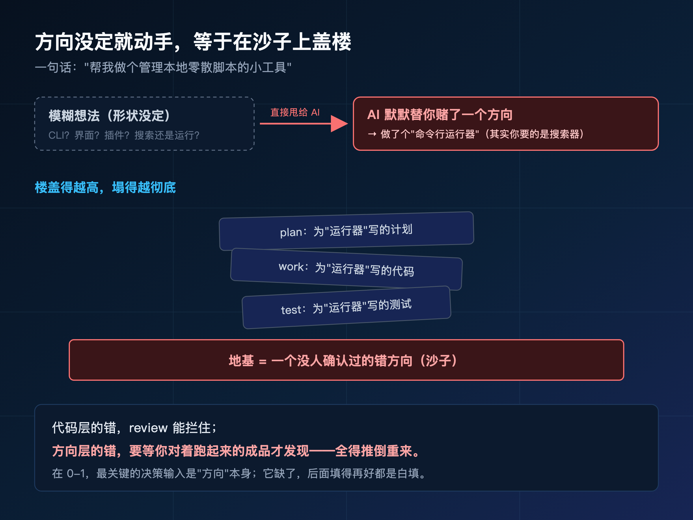
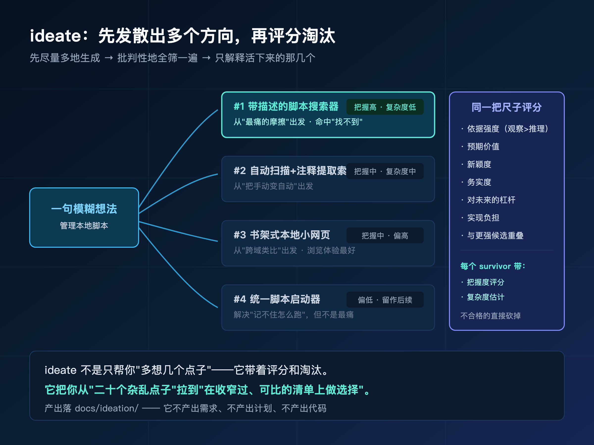
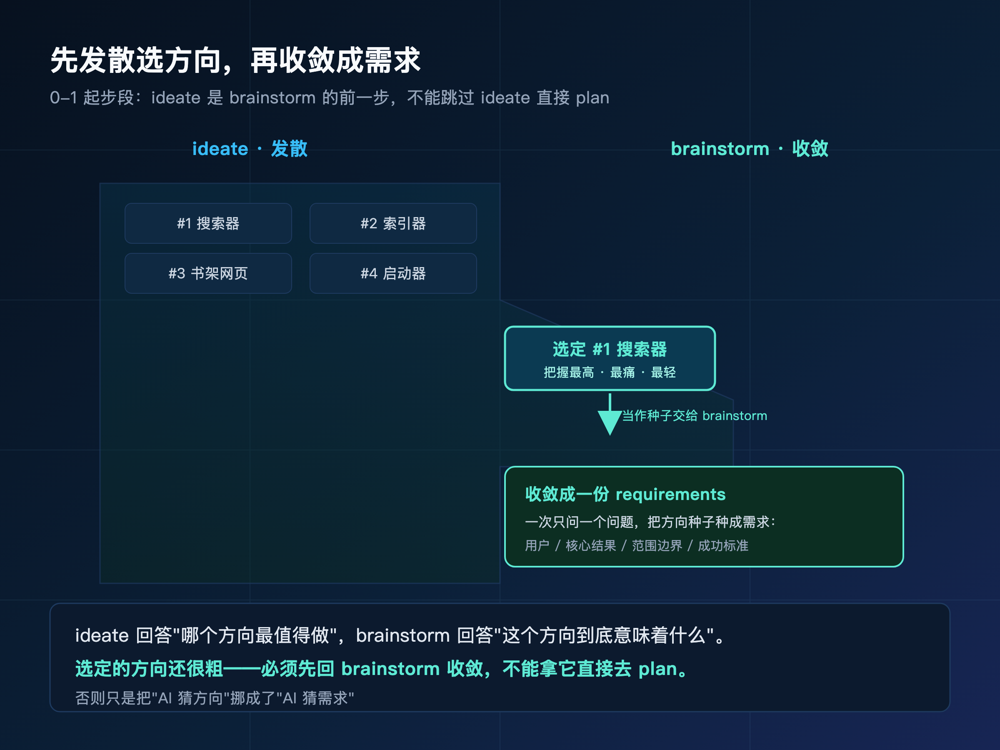
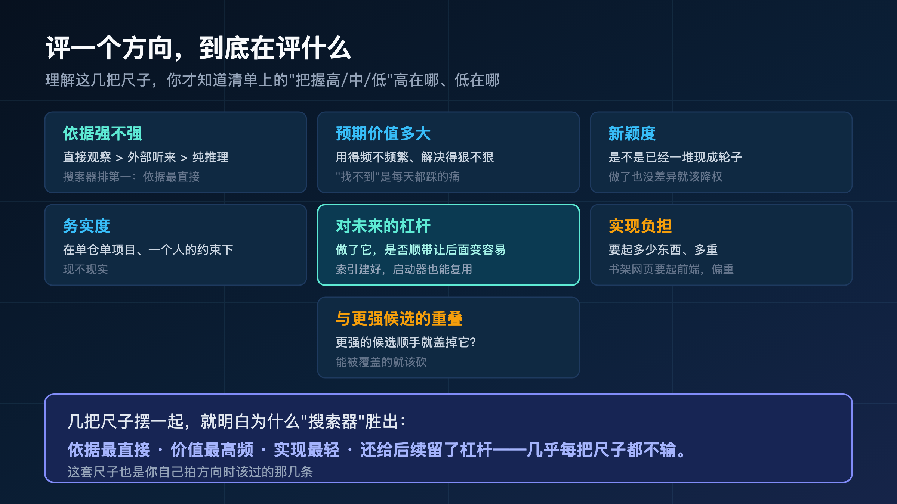
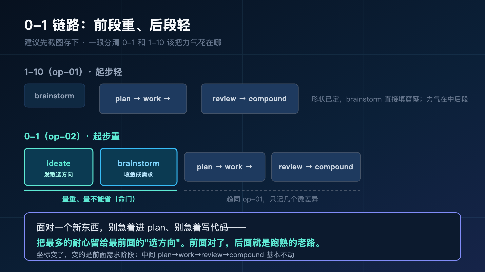
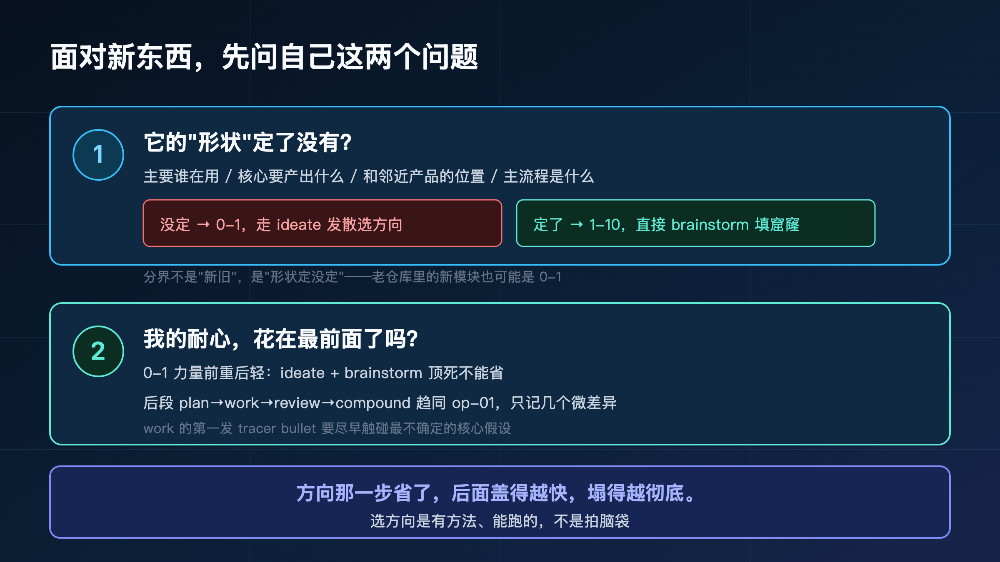

**方向都没定就让 AI 动手，等于在沙子上盖楼——楼盖得越快，塌得越彻底。**

> **导读**
> 这篇文章解决一个很具体的问题：手上是个全新的东西，连要做成什么样都没想清楚，spec-first 到底从哪一步开始帮你？
> 我的答案是：在你动手之前，先用 ideate 把"我大概想做点什么"摊成几个可比的方向候选，再用 brainstorm 把选中的那个收敛成能落地的需求。方向定了，后面就和上一篇一样跑。
> 没读过前面几篇也不影响——这一篇我会把 0-1 的起步段从头讲清楚。

上一篇（op-05）讲的是 AI 把代码改崩了怎么系统化收拾。这一篇往前挪一大步：**很多崩，根本不是改的时候崩的，是方向没定就动手、做到一半才发现整个方向错了。**

那种崩，收拾不了，只能全废。

第二季前面几篇，需求都是清楚的——给待办应用加个标签过滤（op-01），坐标明确、目标明确。这一篇换个场景：你手上是个**全新的东西**，脑子里只有一句模糊的话，连它最后长什么样都说不准。

这是 0-1。它和"加功能"是两种完全不同的起步方式。

---

## 01 先说清楚：这次的"东西"还没有形状

上一篇的案例我能用一句话说死：给待办应用加按标签过滤。这一篇不行。

这一篇我手上只有这么一句话：

> "我想做个帮我管理本地零散脚本的小东西。"

就这么一句。它听起来像个需求，其实什么都不是。

你品一下这句话里有多少没定的东西：

- 它是个**命令行工具**，还是个**带界面的小应用**，还是个**编辑器插件**？
- "管理"是指**搜索和运行**这些脚本，还是**整理归类**，还是**记录它们都干了啥**？
- 我最大的痛是**找不到**那些脚本，还是**记不住怎么调用**，还是**怕重复造轮子**？

这些问题，**一个都没有答案**。

这就是 0-1 和上一篇最根本的区别：

**op-01 的需求是"窟窿已知、形状已定"——我知道要做过滤，只是细节没填；op-02 的需求是"连形状都没有"——我连要做成什么都没想清楚。**

这种"还没有形状"的东西，最危险。因为它看起来也能直接甩给 AI——你敲一句"帮我做个管理本地脚本的工具"，AI 一样会麻溜地给你写出来。

问题是，它写出来的，是**它替你猜的那个方向**，不是你真正想要的那个。



---

## 02 案例定位：为什么我挑一个"全新且模糊"的东西

我故意挑这个案例，因为它把 0-1 的难处放到了最大。

先在第二季那两张地图上对一下坐标——总览篇（op-00）画过：一张是**需求模式**（0-1 全新 / 1-10 增量 / 10-100 存量），一张是**仓库拓扑**（单仓单项目 / 单仓多模块 / 多仓工作区）。

这次我们落在的交点是：**0-1 全新产品 × 单仓单项目。**

和上一篇比，只动了一个坐标：需求模式从 1-10 挪到了 0-1。仓库拓扑还是最简单的单仓单项目——一个 Git 仓库就是这一个小工具。

我特意只动这一个坐标，是想让你看清楚：**坐标里"0-1"这一个字的变化，到底给链路的起步段带来了什么不同。**

挑"管理本地脚本"这个案例，还有两个具体理由：

- 它**真的有多个方向**。命令行工具、TUI、编辑器插件、本地小网页……每个方向都说得通，没有一个是显然正确的。这才是真 0-1。
- 它**小到能跑完**。不是要做个 SaaS，就是个自己用的小工具，一篇文章能从模糊想法走到能动手。

这是 0-1 里最朴素的一种：一个人，一个新点子，一个空仓库。把这条路跑通，你以后任何"我想做个小东西"的念头，都知道第一步该干嘛。

下面我会用这句模糊的话，走 spec-first 的起步段。**核心动作集中在前段——ideate 发散、brainstorm 收敛；方向一旦定了，后面 plan、work、review、compound 和上一篇基本一样，我不重走，但每步会给你一句 0-1 视角下的微差异判断。**

---

## 03 不先定方向，这个东西会怎么翻车

在跑链路之前，老规矩，先看看不用任何方法、直接把这句话甩给 AI 会发生什么。

你打开 AI 助手，敲下：

> "帮我做个管理本地零散脚本的小工具。"

它不会卡壳。它会很自信地开干。大概率是这样：

它默默替你做了一连串决策，然后给你写出了**一个命令行工具**：能扫描某个目录下的 `.sh` 和 `.py`，列出来，让你选一个跑。看起来还挺像样，甚至能跑。

然后你看着它，心里有点不对劲：

- 它默认你要的是**"运行"脚本**，可你最大的痛其实是**"找不到"**——你记不清哪个脚本干哪个活，想要的是**带描述的搜索**，不是一个运行器。
- 它默认做成**命令行**，可你其实更想要个**能扫一眼全貌的界面**——CLI 每次还得敲命令，跟你想要的"一眼看全"正好相反。
- 它默认只管 `.sh` 和 `.py`，可你那堆脚本里还有一堆 `.js` 的 node 小工具和几个 AppleScript。

问题出在哪？

**不是 AI 不会写工具。这个命令行工具它写得很好，代码质量挑不出毛病。**

问题是它在**方向完全没定**的情况下，就替你把方向定了——而且定错了。

这比上一篇那种翻车严重得多。回想 op-01 的翻车，AI 是在"做什么已知"的前提下，把**细节**猜错了：多标签还是单标签、要不要保留分组。那种错，发现了改起来还不算太伤——主体方向是对的。

可这一次，**它把方向本身猜错了**。

- 它做的是"运行器"，你要的是"搜索器"——这俩从数据模型到交互全不一样。
- 它做的是 CLI，你要的是界面——技术栈、依赖、整个骨架都不同。

这意味着什么？**它写得越多，你要废的越多。**



更要命的是返工的时机。代码层面的错，review 能拦住；方向层面的错，常常要等到你**对着跑起来的成品**，才后知后觉"啊，这不是我想要的"。那时候计划写了、代码写了、甚至测试都写了——全是为错误方向服务的，全得推倒。

第一季那句话，在 0-1 场景下要再加重一层：

> **AI coding 的质量，受限于你给它的决策输入质量。而在 0-1，最关键的那个决策输入，是"方向"本身。**

方向这个输入缺了，后面填得再好都是白填——你在精装一栋盖在沙子上的楼。

---

## 04 0-1 和 1-10 的真正分界：不是"新旧"，是"方向定没定"

讲到这，得先纠正一个常见的误解，否则后面会一直对不上。

很多人以为 0-1 和 1-10 的分界是"**这东西是不是全新的**"——新建一个仓库就是 0-1，在老仓库里干活就是 1-10。

**这个理解是错的。**

真正的分界，是另一个问题：

> **你要做的东西，"形状"定了没有？**

我说的"形状"，是指这几样东西到底有没有答案：主要是谁在用？它最核心要产出什么结果？它和旁边那些类似工具比，站在什么位置？主要的从头到尾的流程是什么？

- 这几样**都还没答案**——你是在"定义一个东西"——那就是 0-1，哪怕你是往一个老仓库里加。
- 这几样**已经有答案**，你只是在已有的形状上补一块——那就是 1-10，哪怕你是新建仓库。

举两个例子你立刻就懂：

- 我在一个跑了三年的老系统里，要"加一个全新的、谁都没想清楚要怎么做的智能推荐模块"——仓库是老的，但这个模块的**形状没定**，actor、核心结果、流程全是空的。**这是 0-1。**
- 我新建一个空仓库，但要做的是"又一个待办应用，就照市面上那种来"——仓库是新的，但形状早就定死了，谁都知道待办应用长什么样。**这其实更接近 1-10。**

所以请记住这个自检问题，它是这一篇最该带走的判断之一：

> **不要问"这是不是新项目"，要问"它的形状定了没有"。形状没定，就走 0-1 的起步段；形状定了，直接从需求收敛开始。**

### 04.1 这个分界，源码里是真的画了线

这不是我编的判断。spec-first 在工具设计上就把这条线画死了。

它有一个专门处理**存量改造**的入口（spec-prd）——但这个入口**明确拒绝 0-1**。你拿一个"方向还没定的全新产品"去找它，它不接，会把你**路由到 brainstorm**。

而 brainstorm 里专门有一个处理 0-1 的子模式，它的原则一句话说透：

> **这个产品的形状，必须靠这一轮"建立"出来，而不是从已有的东西里"继承"过来。**

换句话说，工具自己很清楚：存量改造和 0-1 探索，是两种活，得用两套起步方式。你站错了队，它会把你领回正确的那条路。

这也解释了为什么上一篇（加标签过滤）我**跳过了** ideate 直接 brainstorm——因为那个需求形状是定的。而这一篇不能跳，因为形状没定。**跳不跳 ideate，看的就是这条线。**

---

## 05 第零步：先让环境就绪（和 op-01 完全一样）

正式起步前，环境得先就绪。这一步 0-1 和 1-10 没有任何区别，我一笔带过，完整说明看 op-01 第 03 节。

简单说就是三件事，有顺序、一次性、每个项目装一次：

```bash
npm install -g spec-first
spec-first doctor
spec-first init --claude -u yourname --lang zh
```

跑完 `init` 重启宿主，再在宿主里跑一次 setup，把当前环境有哪些能力可用这件事写成事实文件：

```text
/spec:mcp-setup          # Claude Code
$spec-mcp-setup          # Codex
```

> **这一步永远别跳，0-1 也一样。** 它是所有 workflow 的地基，和需求是新是旧无关。

为什么 0-1 也强调它？因为新东西往往意味着**新仓库、新依赖、新环境**——恰恰是最容易"还没装好就开始跑"的时候。地基没打好，后面 ideate、brainstorm 拿到的环境事实就是错的。

环境就绪了。从这里开始，才进入 0-1 真正不一样的地方——**起步段。**

---

## 06 第一步：方向都不确定时，先发散 —— ideate

回到那句话："我想做个帮我管理本地零散脚本的小东西。"

上一篇这个位置，我直接进了 brainstorm。这一篇不行——**brainstorm 是来"收敛"的，可现在我连"收敛到哪个方向"都不知道。** 你不能收敛一个还不存在的东西。

所以 0-1 多了一步，在 brainstorm **之前**：

```text
/spec:ideate "想做个帮我管理本地零散脚本的小工具"
$spec-ideate "想做个帮我管理本地零散脚本的小工具"
```

`ideate` 干的事，和你直觉里"AI 帮我想想"完全不同。

你直觉里的"帮我想想"，是 AI 顺着你那句话，给你一个它觉得最好的方案。那还是在替你定方向，只不过包装成了建议。

`ideate` 反过来：**它先逼自己把方向摊开成一大堆候选，再挨个批判筛掉不行的，最后只留下几个真正值得你认真考虑的，每个都带着评分和复杂度估计交给你选。**

它的内核可以浓缩成一句话：

> **先尽量多地生成，再批判性地全部筛一遍，最后只解释活下来的那几个。**

### 06.1 它怎么"发散"：从好几个角度逼出候选

ideate 不是漫无目的地瞎想。它会从好几个不同的角度去逼出方向，免得所有候选都长一个样。

具体到"管理本地脚本"，它逼出来的候选可能是这样几个方向：

- **从"最痛的摩擦"出发**：你最烦的是找不到脚本 → 做一个**带描述和标签的脚本搜索器**，敲个关键词就能定位。
- **从"把手动变自动"出发**：你每次都要回忆调用方式 → 做一个**统一的脚本启动器**，记住每个脚本怎么跑、要什么参数。
- **从"打破一个假设"出发**：谁说脚本一定要自己记？→ 做一个**自动扫描 + 自动提取注释当描述**的索引器，你啥都不用录。
- **从"跨域类比"出发**：把脚本当成"书" → 做一个**像书架一样的本地小网页**，可视化浏览、分类、点一下就跑。

你看，这四个候选，**不是一个方案的四种皮肤，是四个真的不一样的产品**——搜索器、启动器、索引器、书架式网页。它们的核心结果、交互、技术栈都不同。

这才是发散的意义：**在你还没爱上某一个方向之前，先把"原来还能这么做"的可能性都摆到桌面上。**

### 06.2 它怎么"收"：批判 + 评分，不是平铺一堆点子

光发散没用——给你二十个点子，你照样懵。ideate 的关键在于发散完之后那一刀：**它会用一套统一的尺子，把这些候选挨个评一遍，砍掉不合格的，最后只留下 5 到 7 个打过分的。**

这套尺子量的东西，包括但不限于：

- 这个想法在你这个具体场景里**站不站得住**（有没有真实依据，是直接观察到的痛、还是只是推理出来的）。
- 它**预期能带来多大价值**。
- 它**有多新**、有多**务实可行**。
- 它对**以后的工作有没有杠杆**（做了它，是不是顺带让别的事也变容易）。
- 它的**实现负担**有多重。

每个活下来的候选，都会带着一个**"我对它多有把握"的评分**，外加一个**复杂度估计**。

这一步特别重要，我要强调一下：**ideate 不是只负责发散，它是带着评分和淘汰的。** 很多人误以为"发散工具"就是帮你多想几个点子，那只做了一半。ideate 真正的价值在后半段——它替你把明显不行的砍了，把剩下的排好序、标好把握度，让你**在一个收窄过、且可比**的清单上做选择，而不是在二十个杂乱点子里抓瞎。

---

## 07 ideate 产出长什么样：帮你"选方向"，不是"做方案"

跑完 ideate，你拿到的不是代码，不是计划，也不是需求文档。

**你拿到的是一份排过序的"方向候选清单"。**

它落在这里：

```text
docs/ideation/2026-06-15-local-script-manager-ideation.md
```

具体到我们这个案例，这份清单大概长这样（我把它简化了，真实的会更细）：

```text
【场景】本地散落一堆脚本，记不清在哪、怎么跑，怕重复造。

【候选方向（按把握度排序）】

#1 带描述的脚本搜索器  · 把握度高 · 复杂度低
   - 依据：直接命中"找不到"这个最强痛点（直接观察）
   - 价值：用得最频繁，每天都在找
   - 实现负担：轻，本质是索引 + 模糊搜索

#2 自动扫描+注释提取索引器  · 把握度中 · 复杂度中
   - 依据：免去手动录入，降低长期维护成本
   - 杠杆：索引建好了，搜索/启动都能复用
   - 风险：注释质量参差，提取效果不稳定

#3 书架式本地小网页  · 把握度中 · 复杂度偏高
   - 依据：可视化浏览体验最好
   - 实现负担：要起前端，单仓单项目变重
   - 重叠：浏览能力和 #1 的搜索有部分重合

#4 统一脚本启动器  · 把握度偏低 · 复杂度中
   - 依据：解决"记不住怎么跑"，但这不是最痛的
   - 备注：可作为 #1 之上的后续增量，不必首发
```

看这份清单，你会发现它在帮你做一件很具体的事：**把"我大概想做点啥"这种焦虑，变成了"在这 4 个里挑一个"这种可决策的局面。**

而且它给的信息刚好够你做选择——哪个最戳痛点、哪个最轻、哪个有隐患、哪个可以放到以后。你不用自己在脑子里把这些维度过一遍，它替你过了，还标了把握度。

### 07.1 一条铁规则：ideate 不产出需求，也不能直接跳到 plan

这里有一条 spec-first 写死的规则，必须讲清楚，否则你很容易走错路。

**ideate 只负责"选方向"，它不产出 requirements，不产出 plan，更不产出 code。**

它给你的，是一个**带依据、排过序的方向清单**，仅此而已。

随之而来的是一条硬约束：

> **你不能拿着 ideation 的结果，直接跳到 plan。**

为什么？因为 plan 需要的是**收敛过、扎实的需求**，而 ideate 给的只是**一个被选中的方向种子**——它还很粗，只是"我们决定做带描述的脚本搜索器"，但搜什么、怎么搜、搜出来怎么展示，全没定。

拿这么粗的东西直接去 plan，等于跳过了"把方向收敛成需求"这一整步，plan 又只能猜了——你只是把 AI 猜方向的问题，往后挪成了 AI 猜需求。

所以选定方向之后，**必须先回到 brainstorm**，把这颗种子种成一份真正的需求，再去 plan。

这就引出了下一步。



---

## 08 第二步：方向选定后，交给 brainstorm 收敛 —— ideate → brainstorm 的交接

假设我看完那份清单，选了 **#1：带描述的脚本搜索器**。理由很实在——它把握度最高、复杂度最低、直接命中我最痛的"找不到"，而且 #4 的启动器可以以后再作为增量加上去。

方向定了。但你注意，我手里现在只有一句话："做一个带描述的脚本搜索器。"

这句话，**像不像上一篇开头那句"给 todo-app 加标签过滤"？**

对，它现在回到了一个和 op-01 类似的位置——**方向定了，但全是窟窿**：搜什么字段？描述从哪来，手动录还是自动提？搜出来怎么展示？匹配是模糊还是精确？

这正是 brainstorm 的活。把选中的方向种子，收敛成一份能落地的需求：

```text
/spec:brainstorm "做一个带描述的本地脚本搜索器"
$spec-brainstorm "做一个带描述的本地脚本搜索器"
```

注意这个交接的姿势：**ideate 选出的那个方向，是 brainstorm 的输入种子。** 你不是重新开一个话题，而是带着"我们决定做搜索器、以及为什么是它"这个上下文进来。

### 08.1 brainstorm 还是老规矩：一次只问一个

brainstorm 的交互方式，0-1 和 1-10 完全一样，我在 op-01 第 04 节讲过——**它一次只问你一个问题**，问完一个、根据你的回答再问下一个，像个有经验的同事坐在对面，而不是甩给你一张表。

这么做的原因还是那个：堆一堆问题给你，你只会给出稀释的、糊弄的答案；一次一个，逼你对每个真正影响实现的决策给个明确答复。

具体到脚本搜索器，它一问一答可能是这样：

- 先问："搜索是按文件名，还是也要能搜到你给脚本写的描述？" 你答："描述也要，那才是重点。"
- 接着问："那描述从哪来——你手动给每个脚本写一句，还是从脚本头部的注释里自动提？" 你答："先支持手动写，自动提以后再说。"
- 再问："搜出来之后，是只显示路径，还是要能直接看到那句描述、甚至一键复制运行命令？" 你答："显示路径 + 描述就够，运行先不做。"

你发现没有，**最后那个"运行先不做"——又是在划非目标。** 这正好把 ideate 清单里的 #4 启动器，明确推到了以后。

### 08.2 brainstorm 在 0-1 的不同：不是填窟窿，是先确认"到底要做什么"

虽然交互方式一样，但 brainstorm 在 0-1 和 1-10 担的责任，重量不一样。

> **1-10 的 brainstorm，是在一个已知形状上"填窟窿"；0-1 的 brainstorm，是先把"形状"本身确认下来。**

体会一下这个区别：

- op-01 加标签过滤时，brainstorm 问的是"多标签取交集还是并集""筛完保不保留分组"——产品形状是给定的（待办应用），它只在补细节。
- 这一篇做脚本搜索器时，brainstorm 要先确认一些更根本的事：**主要用的人就是我自己**（单用户，不用考虑多人）、**核心结果是"几秒内定位到想要的脚本"**、**它和系统自带的 `find`/`grep` 的区别在于"能搜人写的描述、不只是文件名"**、**主流程是"敲关键词 → 出匹配列表 → 看到描述"**。

这些不是细节，是**这个产品到底是什么**。在 1-10 里它们是默认给定的，在 0-1 里它们必须被这一轮显式建立出来。

所以 0-1 的 brainstorm，你会感觉它问的问题更"基础"、更"往源头去"——因为它在帮你把一个还没有形状的东西，第一次定出形状来。

### 08.3 产出：一份真正能落地的需求

brainstorm 跑完，产出和 op-01 一样，是一份 right-sized 的 requirements 文档：

```text
docs/brainstorms/2026-06-15-001-script-searcher-requirements.md
```

它的骨架大概是这样：

```text
【背景】
本地脚本散落多处，靠记忆和 find 很难快速定位到"那一个"。

【用户与场景】
单用户（我自己），脚本几十个，跨 .sh/.py/.js 多种类型。

【需求】
- 可按文件名 + 手写描述做模糊搜索
- 描述由用户手动维护（一句话即可）
- 搜索结果展示：路径 + 描述
- 支持跨多种脚本类型扫描

【范围边界（本轮不做）】
- 不做脚本的运行/启动（启动器是后续增量）
- 不做注释自动提取（先手动，验证价值后再说）
- 不做 GUI / 网页（先 CLI）

【成功标准】
- 敲一个关键词，几秒内出现匹配的脚本路径和描述
- 关键词能命中描述里的词，不只是文件名

【关键决策】
- 选搜索器而非启动器：因"找不到"是最强痛点（来自 ideate）
```

注意那个 **范围边界（本轮不做）**。在源码里，这一段对所有需求都是必填的——它把"运行""自动提取""GUI"全部明确推到了以后。

更关键的是，在 0-1 里这段边界还有一层特殊含义。spec-first 的 0-1 子模式会把"不做的事"分成两类：**一类是"以后会做、只是这轮先不做"**（比如启动器、自动提取），**另一类是"这根本就不是这个产品该是的样子"**（比如它就不该长成一个多人协作的云端服务）。

第二类边界，是在帮你守住**产品的身份**——别让一个"自己用的本地搜索小工具"，慢慢长成一个四不像。这是 0-1 特别容易失守、也特别值钱的一道闸。

到这里，那句模糊的"想做个管理脚本的小东西"，已经收敛成了一份**有用户、有边界、有成功标准、能直接拿去做计划**的需求。

**起步段到此结束。从这里往后，和 op-01 就趋同了。**

---

## 09 方向定了之后：plan → work → review 趋同，但有 0-1 的微差异

需求稳了，后面的链路——plan、work、code-review——和 op-01 跑法基本一样。**我不重走**，完整的每步动作、产物、判断，去看 op-01 第 05 到 09 节。

但"趋同"不等于"一模一样"。0-1 的未知数比 1-10 多，所以同一步在 0-1 场景下，判断的侧重会有微妙的差别。这一节我给每步点一句，你带着这个差别去看 op-01 就够了。

### 09.1 plan：0-1 更要给实现期留决策空间

plan 把需求翻译成"怎么落地的工程决策"——目标、非目标、改动区域、风险、验证方式。这套和 op-01 一样。

0-1 的微差异在于：

> **0-1 的 plan，要比 1-10 留更多"实现期再定"的空间。**

为什么？因为新东西的未知数多。op-01 加过滤时，技术栈、项目结构都是现成的，plan 能写得比较实。可这个脚本搜索器是从零起的——用什么做模糊匹配（自己写还是用库）、索引存内存还是落个小文件、CLI 用哪个框架，这些在没动手之前，很多是**拍不准**的。

硬要在 plan 里把它们写死，反而危险——一旦动手发现某个选择不合适，整张计划就得返工。所以 0-1 的 plan 更应该明确："这几个技术选型，留到 work 阶段，等手感出来了再定。"

留空间不是偷懒，是承认 0-1 的不确定，把决策放到信息更充分的时刻去做。

### 09.2 doc-review：0-1 尤其要审"方向和需求对不对得上"

plan 写完立刻审，这一步 op-01 第 06 节讲透了——在没写代码的时候纠错，成本几乎是零。

0-1 的微差异在于审查的重点。1-10 的 doc-review 多在查"计划和已知需求有没有缝"；0-1 还要多查一层：

> **这份 plan，有没有悄悄偏离 ideate 选定的那个方向？**

因为 0-1 链路长、起步段做了方向选择，plan 阶段很容易不知不觉"漂"回到一个别的方向去——比如需求明明定了"先 CLI、不做 GUI"，plan 里却开始规划前端结构。doc-review 在 0-1 要专门盯这条：计划有没有守住起步段定下的方向和边界。

### 09.3 write-tasks：这次同样跳过

要不要把 plan 编译成任务包，判断标准和 op-01 第 07 节完全一样——看实现单元数、跨不跨模块、有没有依赖。

我们这个脚本搜索器，拆开就是扫描、索引、搜索、CLI 展示几块，**不到 3 个有依赖关系的实现单元，单仓单项目里也没跨模块**。所以这次**同样跳过 write-tasks**。

0-1 这里没有特别的微差异——它不会因为"是新产品"就自动变成大任务。任务大不大，看的是实现复杂度，不是新旧。

### 09.4 work：0-1 的 tracer bullet 更早暴露"方向到底行不行"

work 在边界内受控写代码，那五个控制点（scope 验证、task identity、tracer bullet、review gate、handoff evidence）op-01 第 08 节讲过，0-1 一样适用。

最该划重点的是 **tracer bullet（先打通一条完整路径，再扩展）**，它在 0-1 的价值被放大了：

> **1-10 的 tracer bullet 是验证"这个功能能不能做对"；0-1 的 tracer bullet 是验证"这个方向到底是不是真的可行、真的是我要的"。**

具体到脚本搜索器，work 的第一发 tracer bullet 不该是把扫描、索引、模糊搜索全做了，而该是：**先让"扫一个目录 → 敲一个关键词 → 命中文件名 → 打印出来"这一条最细的路从头到尾通一次。**

这一发打通，你立刻就能体感到一件 0-1 里最重要的事——**这个方向到底对不对劲**。也许你一搜就发现"光搜文件名根本不够用，描述才是关键"，那这个早期信号千金难买，你可以马上调整，而不是等全做完了才发现方向偏了。

0-1 最怕的就是"埋头做完一大堆，抬头发现方向错了"。tracer bullet 就是你在 0-1 里最早、最便宜的那次"方向校验"。

所以：**在 0-1，请务必让第一发 tracer bullet 尽可能早地触碰到那个最不确定的核心假设。**

---

## 10 方向评估，到底在评什么

回头补一个很多人会卡住的地方：ideate 那份候选清单，它给每个方向打的分，到底是按什么维度打的？

我把它单拎出来讲，因为**理解这些维度，你才知道怎么看那份清单、怎么做选择**——否则你只看到一堆"把握度高/中/低"，不知道高在哪、低在哪。

ideate 评估一个方向候选，用的是一套一致的尺子。落到"管理脚本"这个案例上，这套尺子大致是这么量的：

- **依据强不强**：这个方向背后的痛，是你**直接观察到的**（"我天天找不到脚本"），还是**外部听来的**，还是**纯推理出来的**？直接观察 > 外部 > 推理。搜索器之所以排第一，就因为它的依据是最直接的痛。
- **预期价值多大**：做出来用得频不频繁、解决的问题狠不狠。
- **新颖度**：是不是已经有一堆现成的轮子，做了也没差异。
- **务实度**：在你这个单仓单项目、一个人的约束下，现不现实。
- **对未来的杠杆**：做了它，是不是顺带让后面的事变容易（比如索引建好了，启动器也能复用）。
- **实现负担**：要起多少东西、多重。书架式网页排不上前面，就因为要起前端，负担在单仓单项目里偏重。
- **和更强候选的重叠**：如果它能干的事，一个更强的候选顺手就覆盖了，那它就该被砍。

你把这几把尺子摆一起看，就明白为什么是"搜索器"胜出：**依据最直接、价值最高频、实现最轻、还给后续留了杠杆。** 它在几乎每把尺子上都不输。



理解这套尺子还有个附带好处：**它其实也是你自己拍方向时该想的那几件事。** 哪怕哪天你不用工具、自己在脑子里掂量几个方向，照着"依据强不强、价值多大、负担多重、有没有更强的能盖掉它"这几条过一遍，也比拍脑袋强得多。ideate 只是把这套你本该做、但常常嫌麻烦不做的评估，稳定地替你做了一遍。

---

## 11 compound 在 0-1 的特殊价值：把"为什么没选另几个方向"存下来

代码过了，需求闭环了。和 op-01 一样，多走一步——compound，把这次的经验沉淀成下次的输入。

compound 的机制、判断标准（"下次或别人很可能再遇到、且解法不显而易见，才值得记"）op-01 第 10 节讲过，这里不重复。

0-1 这里有一个**特别值钱、且只有 0-1 才有**的沉淀点。我得先把一个很容易混的地方掰清楚，否则你会把两件事当成一件。

### 11.1 先分清两层：方向候选是 ideate 产的，最终判断才是 compound 沉的

这是个很容易混的点，请认真区分：

- **那几个被淘汰的方向候选、以及它们为什么被淘汰**——这是 **ideate 阶段**就产出的东西，已经写在 `docs/ideation/` 那份清单里了。它是过程产物。
- **而 compound 要沉淀的，是另一层东西**：经过这一整轮（选了搜索器、做出来、跑通了）之后，你对"**为什么这个方向是对的、那几个为什么这次不合适**"形成的**最终判断**。它是结论，是被实践验证过的经验。

别把这两层混为一谈。ideate 的清单是"我们当时是这么想的"；compound 的沉淀是"我们做完之后，确认了当时那么选是对的，以及踩到的真实理由"。

### 11.2 为什么这层沉淀在 0-1 特别重要

因为 0-1 的方向选择，**特别容易反复**。

你今天选了搜索器、放弃了启动器和网页。但三个月后，当你（或团队里另一个人）又冒出"要不给它加个图形界面吧"的念头时，如果没有任何记录，你们会**从头再纠结一遍**——把当初已经掂量过的利弊，重新掂量一遍。

更糟的是换人：你离职了，接手的人完全不知道"为什么是 CLI 不是网页"，他很可能推翻重来，把你踩过的坑再踩一遍。

compound 在 0-1 沉淀的，就是这个：

```text
docs/solutions/architecture-decisions/script-tool-direction-2026-06-15.md
```

里面大概是：

```text
---
applies_when: 给"本地脚本管理"这类个人小工具定方向
tags: [cli, personal-tooling, direction-decision]
---

## 决策
做"带描述的搜索器"，不做启动器 / GUI 网页。

## 为什么
- 最强痛点是"找不到"（直接观察），不是"不会跑"
- 单用户 + 单仓单项目，CLI 负担最轻、最快可用
- 启动器/自动提取/GUI 价值未验证，留作后续增量

## 验证后的复盘
- 搜索器跑通后确认：搜描述确实比搜文件名有用得多
- 但发现关键词命中描述的排序需要调权，已记入
```

下次再起这个念头，先读到这条：**当初为什么这么选、做完之后验证的结论、以及一个新发现的小坑。** 你不用从头纠结，直接站在上次的判断上往前走。

> **这就是 compound 在 0-1 的独特价值：它把"方向决策"这种最容易被遗忘、又最贵的判断，固化成了仓库里读得到的事实。** 1-10 沉淀的多是技术坑，0-1 还多沉淀一类——方向判断。

---

## 12 0-1 链路的形状：前段重、后段轻

跑完整条，我想给你一张能记一辈子的图——**0-1 链路的"形状"。**

这张图建议你**先截图存下来**，它能帮你一眼分清 0-1 和 1-10 该把力气花在哪。

把 op-01（1-10）和这一篇（0-1）的链路并排放，形状很不一样：

```text
1-10（op-01）：
  brainstorm → plan → work → review → compound
  （起步轻：需求形状已定，brainstorm 直接填窟窿）

0-1（op-02）：
  ideate → brainstorm → plan → work → review → compound
  （起步重：先发散选方向，再收敛成需求）
```

差别就在最前面：

> **0-1 比 1-10，在起步段多了一个 ideate，而且这个起步段是整条链路里最重、最不能省的部分。**

更准确地说，0-1 链路的力量分布是**前重后轻**：

- **前段（ideate + brainstorm）重**：方向要发散、要评估、要选、再收敛成需求。这一段决定了你这栋楼盖在不在沙子上，是 0-1 成败的命门，**一步都不能省**。
- **后段（plan → work → review → compound）轻**：和 1-10 趋同，按 op-01 那套跑，只在几个点上注意 0-1 的微差异（plan 多留空间、work 早验方向）。

而 1-10 正相反——它起步轻（形状已定，brainstorm 直接上），力气主要花在中后段的落地上。



记住这个形状，你就知道**面对一个新东西，劲儿该往哪使**：别急着进 plan、别急着写代码，**把最多的耐心留给最前面的"选方向"**。前面方向选对了，后面就是一条已经跑熟的老路。

这也呼应了 op-01 那个判断：**坐标变了，需求阶段和边界规则跟着变，但中间的 plan → work → review → compound 基本不动。** 0-1 变的，正是前面"需求阶段"那一段——它从"填窟窿"变成了"发散选方向 + 收敛"。

---

## 13 你可能想问：全新的东西，我直接 vibe coding 不是更快？

走到这，0-1 场景下最大的那个反驳该出场了：

> "上一篇加功能你说要走链路也就算了。可这是个全新的小工具啊，我脑子一热想到啥做啥，边做边改，vibe coding 不香吗？非要 ideate、brainstorm 这一套，是不是把灵感都框死了？"

我直接回答：**恰恰是全新的东西、方向没定的时候，跳过选方向的代价最大。**

### 13.1 vibe coding 在 0-1 翻车，比在 1-10 惨

回到第 03 节那个翻车现场。

1-10 的 vibe coding 翻车，翻的是**细节**——多标签做成单标签、漏了分组。方向是对的，改起来还算可控。

0-1 的 vibe coding 翻车，翻的是**方向**——你兴冲冲做了个命令行运行器，做完才发现自己真正想要的是个搜索器。这不是改细节能救的，是**整个数据模型、交互、技术选型推倒重来**。

> **方向错的返工，是所有返工里最贵的一种。因为前面所有为这个错方向服务的工作——计划、代码、测试——全部清零。**

vibe coding 给你的"快"，是"立刻开始动手"的快感。但在 0-1，这种快感最危险——它让你在**还没想清楚要去哪**的时候，就一脚油门踩到底。开得越快，开错方向时离正确目的地就越远。

### 13.2 ideate 框的不是灵感，是"过早承诺"

至于"框死灵感"这个担心，正好说反了。

vibe coding 看着自由，其实是**最快地把你锁死在第一个念头上**——你想到运行器，就一头扎进去做运行器，再也没认真想过别的可能。**那才是真正的框死。**

ideate 干的事恰恰相反：它逼你在动手前，把搜索器、启动器、索引器、网页**都摆出来比一比**。它不是限制灵感，它是**保护你不被自己的第一个灵感绑架**——让你在还来得及的时候，看见"原来还能这么做"。

> **真正框死灵感的，不是 ideate，是"想到第一个就开干"。ideate 是在帮你的灵感多活几个回合，再让最好的那个胜出。**

### 13.3 0-1 反而最划算

把账算总：

- **直接 vibe**：开头爽，方向赌对了就赚，赌错了——而 0-1 方向本来就难赌对——整轮清零，从头再来。
- **走起步段**：开头多花点时间发散、收敛，但你是带着一个**被比较过、被验证过**的方向动手，方向错的概率被压到最低。

0-1 的不确定性越大，"先花时间选对方向"的回报就越高。**这套链路不是给确定的事降本，是给不确定的事降险**——而 0-1，正是最不确定、最该降险的场景。

---

## 14 收尾复盘：0-1 哪步最不能省，哪步可以轻

每篇结尾都做这个固定动作——把这一篇的链路裁剪判断，浓缩成一张能直接用的表。

0-1 场景下，哪步顶死不能省、哪步可以轻装上阵：

| 步骤 | 0-1 场景的态度 | 为什么 |
|---|---|---|
| 环境就绪 | **永远别省** | 所有 workflow 的地基，和新旧无关 |
| `ideate`（发散选方向） | **0-1 最不能省的一步** | 方向没定时跳过它，等于让 AI 替你赌方向 |
| `brainstorm`（收敛需求） | **别省** | 选定的方向还很粗，不收敛 plan 只能猜 |
| `plan` | 照常走，**多留实现期空间** | 0-1 未知数多，技术选型别过早写死 |
| `doc-review` | 照常走，**多盯方向有没有漂** | 计划容易悄悄偏离起步段定的方向 |
| `write-tasks` | 按实现复杂度判断，本例**跳过** | 新旧不决定任务大小，复杂度才决定 |
| `work` | 照常走，**tracer bullet 早验方向** | 让第一发尽早触碰最不确定的核心假设 |
| `code-review` | 照常走 | 和 op-01 一致 |
| `compound` | 别省，**多沉淀一类：方向判断** | 把"为什么这么选"存下来，免得反复纠结 |

一句话总结这张表：

> **0-1 的力气，要压在最前面的"选方向"上（ideate + brainstorm 顶死不能省）；后段和 1-10 趋同，照 op-01 跑，只在几个点上记住 0-1 的微差异。**

判断"这次该把劲儿使在哪"，比"会跑每一步"更重要——这一点 0-1 和 1-10 是相通的，只是 0-1 的重心明显更靠前。



---

## 15 本篇小结

我用一句最模糊的话——"想做个管理本地脚本的小东西"——把 spec-first 的 0-1 起步段跑了一遍。

回头看，这一篇和上一篇最大的不同，就一件事：

**1-10 是在一个已定的形状上填窟窿，所以直接 brainstorm；0-1 连形状都没有，所以要先 ideate 发散选方向，再 brainstorm 收敛成需求。**

把 0-1 起步段做的事拆开：

- ideate 把"我大概想做点啥"摊成几个可比的方向候选，评分、排序、淘汰，帮你**选方向**。
- 选定方向后回到 brainstorm，把那颗还很粗的种子，收敛成有用户、有边界、有成功标准的**需求**。
- 方向定了，plan → work → review → compound 和 op-01 趋同，只在几个点记住 0-1 的微差异。
- compound 多沉淀一类东西——**为什么是这个方向**，免得下次从头纠结。

第 03 节那个翻车的现场——AI 替你做了个运行器，你要的却是搜索器——它的根子，被起步段正面接住了：

| 翻车（第 03 节） | 被哪一步接住 |
|---|---|
| AI 替你默认了一个方向（运行器） | ideate 先摆出多个候选，由你选 |
| 选的方向其实不是最痛的 | ideate 按"依据强度/价值"评分排序 |
| 方向粗，细节全靠猜 | brainstorm 把方向收敛成明确需求 |
| 做到一半才发现方向错了 | work 的 tracer bullet 早早验证方向 |
| 下次又从头纠结同一个方向 | compound 沉淀方向判断 |

不是某一步单独解决了所有问题，是**整条起步段，把"让 AI 替你赌方向"换成了"你在收窄过的候选里做选择"。**

> **不是 spec-first 替你想出了好方向，是它逼你在动手之前，把方向当成一个要认真做的决策，而不是顺手一拍。**

如果这篇你只带走一件事，我希望是开头那个自检问题：

**面对一个新东西，先别问"这是不是新项目"，先问"它的形状定了没有"。没定，就把最多的耐心留给最前面的选方向——那一步省了，后面盖得越快，塌得越彻底。**

第二季后面还有几个真实场景——老系统改造、多仓协作、换人接力、上线把关——一篇一个。怕错过的话，关注一下不迷路。如果你身边也有人"一个新点子上来就 vibe coding、做到一半全废"，把这篇转给他——看一遍真实的选方向过程，比劝十遍"想清楚再动手"管用。

想上手的话，最低成本的第一步：挑一个你一直想做、但方向还没定的小东西，照这条起步段跑一遍 ideate → brainstorm。**spec-first 是开源的、装上就能用**，想直接看代码或装来试，文末「阅读原文」直达 GitHub。

下一篇，我们换一个几乎人人都中过招的场景：

> **Spec-First：换个 AI、换个人接手，怎么不用从头讲一遍**
>
> 换个会话 AI 就失忆，换个人接手又得把来龙去脉重讲一遍。这些上下文，到底怎么才能不用每次从头讲？

至于 ideate 和 brainstorm 内部那套发散、评分、收敛的机制本身怎么运转、0-1 用 brainstorm 而存量改造用 spec-prd 的边界具体怎么划——这些是第三季的活，我们到 s3-02、s3-03 再深挖。这一篇你只要记住：**0-1 的命门在选方向，而选方向是有方法、能跑的，不是拍脑袋。**

---

`spec-first` 是开源项目，已经能用，也欢迎你来提 issue、提建议、一起打磨。

**GitHub：** http://github.com/sunrain520/spec-first

**官网：** http://spec-first.cn/
