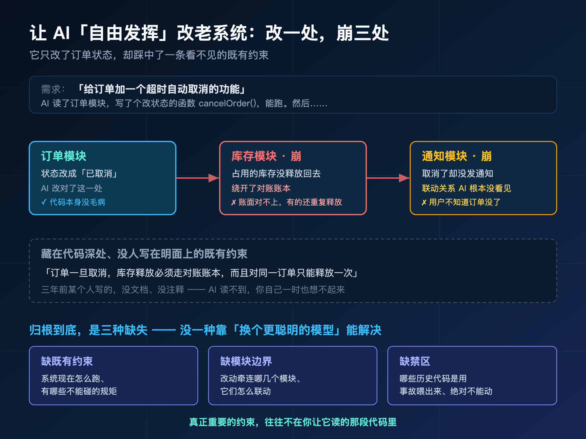
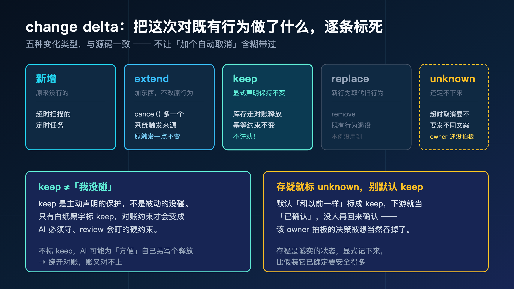
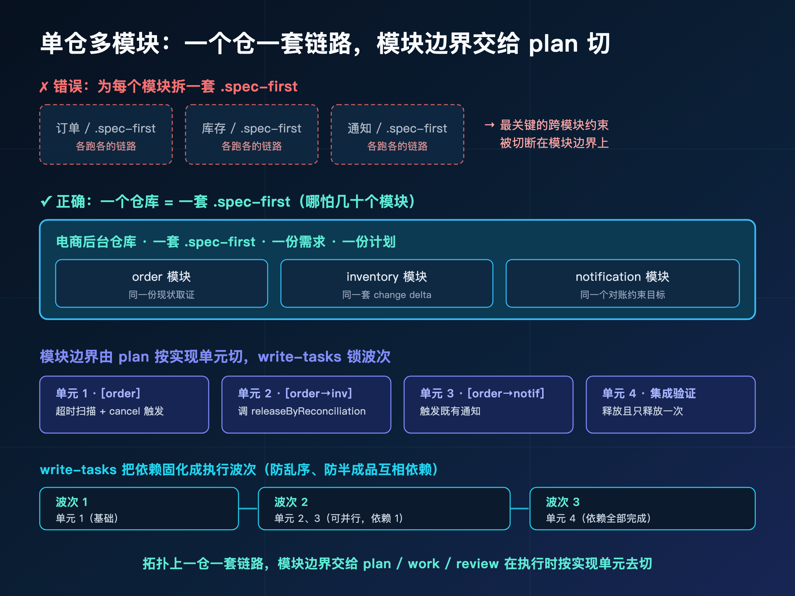
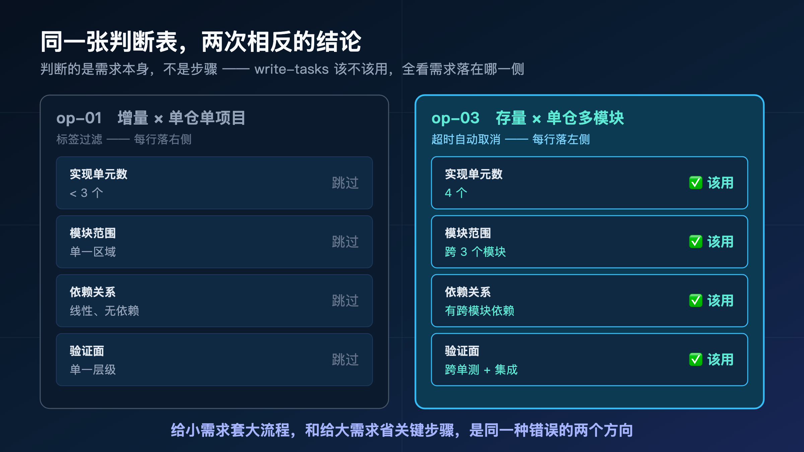
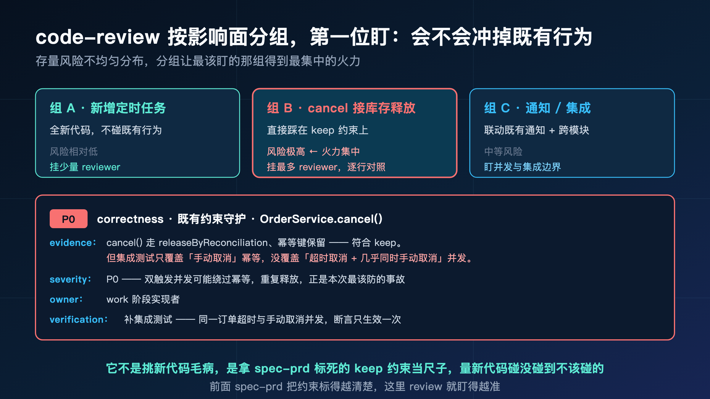
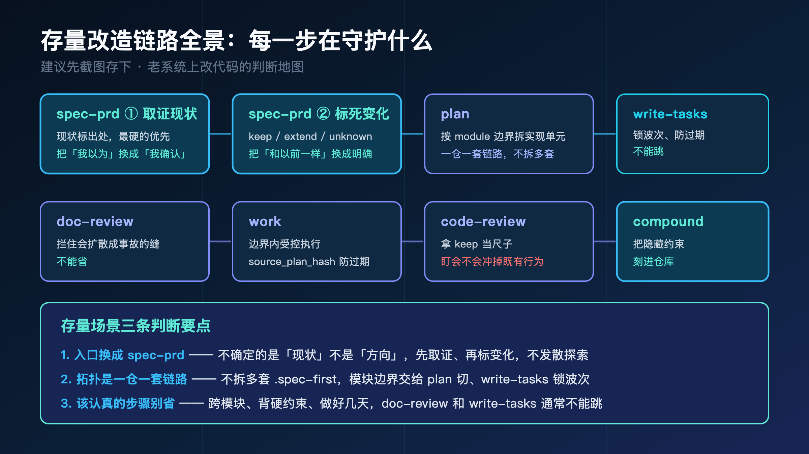

**老系统最可怕的不是难写，是你根本不知道，动了它会牵连到什么。**

先讲个画面。

你接手一个跑了三四年的后台，里面有订单、库存、通知三个模块。产品提了个不大的需求：订单超时没付款，自动取消掉。

听起来十分钟的活。你把需求甩给 AI，它很快写出一个 `cancelOrder`，把订单状态从"待支付"改成"已取消"，干净利落。你一跑，订单确实取消了。

第二天，对账的同事炸了：库存对不上了。

那批被自动取消的订单，占用的库存一直没释放回去——系统里显示卖光了，仓库里还堆着货。更糟的是，有几单因为重试，库存被释放了两次，账面上的库存比实际还多。

你回头看那段代码，AI 写得没毛病：它就是改了个订单状态。

**问题是，在这个老系统里，"改订单状态"从来就不只是改一个字段。** 它背后挂着一条没人写在明面上的规矩：订单一旦取消，必须走库存模块那条"对账释放"的老路径，而且不能重复释放。这条规矩藏在三年前某个人写的代码深处，没文档、没注释，AI 读不到，你自己一时也想不起来。

它没改错代码。它是在**不知道既有约束**的情况下，改了一处，崩了三处。

> **导读**
> 这篇解决一个很硬的问题：在一个有历史包袱、谁都不敢乱碰的老系统上，怎么让 AI 安全地改？
> 我的答案是：动手之前，先把"系统现在到底怎么跑"取证清楚，再把"这次要改的是什么、哪些既有行为绝对不能动"一条条标死，让 AI 不用猜。没读过前面几篇也不影响，这篇能独立读懂。

上一篇（op-06）讲了换人、换 AI 接手时，怎么靠 `docs/` 接力，不用从头口头讲一遍。

这一篇换个更硬的场景：你接手的不再是"自己人做的半成品"，而是一个**有年头、多模块、谁都不敢乱碰的老系统**。

前面几篇的案例，要么是从零做新东西，要么是给一个干净的小应用加功能——既有约束少，AI 猜错了代价也小。存量改造不一样：你面对的是几年积累下来的隐藏规则、模块耦合、历史决策，**改错一处的代价，可能是线上事故。**

这一篇就讲，spec-first 怎么在这种场景下，把"改一处崩三处"的风险，前移到动手之前消化掉。

---

## 01 先说清楚：这次要改的是什么

我把案例定得很具体，因为存量场景最忌讳抽象。

**一个跑了三四年的电商后台，单个 Git 仓库里有三个模块：订单（order）、库存（inventory）、通知（notification）。这次的需求是：给订单加一个"超时自动取消"——超过 30 分钟没付款的订单，系统自动取消。**

需求本身不大，但它有两个让人头疼的特征。

第一，它**跨模块**。取消订单这个动作，不只动订单模块：取消之后库存要释放回去（动库存模块），还要给用户发个"订单已取消"的通知（动通知模块）。一个动作，三个模块联动。

第二，它**必须保留一个既有约束**。这个系统里，订单状态变更和库存释放之间，有一条用了三年的"对账"逻辑——库存释放必须走对账账本（reconciliation ledger），而且对同一笔订单只能释放一次。这条约束你这次绝对不能破坏，否则就是开头那个对不上账的事故。

在 spec-first 的两张地图上，这个需求的坐标是：**10-100 存量系统 × 单仓多模块。**

第二季反复用这两张地图定位需求。一张是**需求模式**（0-1 全新 / 1-10 增量 / 10-100 存量改造），一张是**仓库拓扑**（单仓单项目 / 单仓多模块 / 多仓工作区）。

op-01 那个待办应用，落在最简单的交点：1-10 增量 × 单仓单项目。这一篇我们换到难度最高的一组之一：**10-100 存量 × 单仓多模块。**

坐标变了，意味着什么？

意味着 op-01 里那条"环境就绪 → brainstorm → plan → work → review → compound"的主干基本不动，**但需求阶段的入口换了，多模块的拆法也变了。** 这两个变化，正是这一篇要讲清楚的存量特有难点。

下面先看一眼，如果不管这些约束，直接让 AI 干，会崩成什么样。

---

## 02 让 AI 在老系统上"自由发挥"，会崩在哪

开头那个对不上账的事故，不是个例。它是存量场景的典型死法。

我们把它拆开看，AI 到底缺了什么。还是那句话甩给它：

> "给订单加一个超时自动取消的功能。"

它读了订单模块的代码，找到状态字段，写了个改状态的函数，能跑。然后呢？

- 它**看不见模块耦合**。它不知道取消订单要联动库存释放和通知，因为这条联动关系不在订单模块的代码里——它分散在三个模块的调用链深处。它只改了订单，库存和通知它根本没碰。
- 它**读不到既有约束**。"库存释放必须走对账账本、只能释放一次"这条规矩，藏在三年前的对账模块里，没有任何地方明确写着"取消订单时必须调它"。AI 扫了一遍订单模块，没看到，于是要么漏了释放，要么自己写了个直接改库存表的释放——绕开了对账，账自然对不上。
- 它**分不清哪些是禁区**。它顺手看到对账逻辑里有段它觉得"写得啰嗦"的代码，"优化"了一下。可那段啰嗦的代码，正是三年来用一个个线上 bug 喂出来的幂等保护。它一改，重复释放的老问题又回来了。

把这三条归一下类，本质上是三种缺失：

- **缺既有约束**：系统现在到底怎么跑、有哪些不能碰的隐藏规矩——它不知道。
- **缺模块边界**：这个改动会牵连哪几个模块、它们怎么联动——它看不见。
- **缺禁区**：哪些历史代码是用事故喂出来的、这次绝对不能动——没人告诉它。

注意，这三种缺失，**没有一种是"换个更聪明的模型"能解决的。**

再聪明的模型，没人把这个老系统的现状、约束、禁区喂给它，它也只能凭眼前这点代码猜。而存量系统最致命的地方就是：**真正重要的约束，往往不在你让它读的那段代码里。**



第一季那句话，在存量场景里应验得更狠：

> **AI coding 的质量，受限于你给它的决策输入质量。在老系统上，这个"决策输入"里最关键的一项，叫"系统现在到底是什么样"。**

而这一项，恰恰是 op-01 那条链路的起点 `brainstorm` 给不了的。下面说为什么。

---

## 03 为什么这次不从 brainstorm 起手

op-01 和 op-02 的起点都是 `brainstorm`（op-02 前面还多一步 `ideate`）。它们干的是同一件事：**把一个还很模糊的需求，往"做什么"的方向收敛。**

这对增量和 0-1 场景都对——因为那些场景里，最大的不确定性是"我到底要做什么、做到什么程度"。

但存量场景的不确定性，根本不在这。

我们这个需求"超时自动取消"，要做什么其实很清楚：超过 30 分钟没付款就取消。真正的不确定性是另一件事：

**这个系统现在到底怎么跑？取消订单这条路上，藏着哪些我不能破坏的既有行为？**

这不是一个"探索方向"的问题，是一个"描述现状"的问题。

`brainstorm` 是用来探索方向的，它帮不了你把一个跑了三年的系统的现状取证清楚。**你需要的不是发散，是取证。**

这就是 spec-first 给存量场景准备的专门入口：`spec-prd`。

它的定位很明确，我从源码里抄一句原话：

> Create, refine, or validate brownfield PRD-grade requirements for existing systems before implementation planning.

翻译过来：**为已有系统的存量增量，创建、精炼、校验 PRD 级的需求，给后面的 plan 用。**

注意 "brownfield" 这个词——它是软件工程里专指"在有历史包袱的存量系统上开发"的术语，对应的是 "greenfield"（从零的、没有历史负担的开发）。`spec-prd` 是 brownfield 专用的。

它甚至明确拒绝接 0-1 的活：如果你拿一个全新产品的探索去找它，它会把你路由回 `brainstorm`。**它只干一件事：在你动手改一个已有系统之前，把现状和变化说清楚。**

命令入口：

```text
/spec:prd          # Claude Code
$spec-prd          # Codex
```

那它具体怎么"把现状和变化说清楚"？核心就两件事：先把"系统现在是什么样"取证清楚（current-state evidence），再把"这次要改的是什么"标死（change delta）。下面两节分别讲。

---

## 04 第零步还是环境就绪（这里不复述）

进 `spec-prd` 之前，环境就绪那三件事一样要先办好：装好初始化、跑 `spec:mcp-setup` 把 MCP / provider 装齐、把项目事实写进 `.spec-first/config/`。

这一步在 op-01 第 03 节讲透了，存量场景没有任何不同，我不重复。只提醒一句：

**存量场景里，环境就绪那一步装的代码图谱 provider，比小项目更值钱。** 因为老系统的模块耦合藏得深，后面取证现状、定位影响面时，如果有图谱事实可用，AI 就能更快看清"取消订单这条调用链都牵连到谁"，而不是靠一段段读源码硬猜。没装也不要紧，它会诚实降级到直接读源码——只是慢一点。

环境就绪了，进入存量场景真正的主角：`spec-prd`。

---

## 05 spec-prd 第一件事：把现状取证清楚

`spec-prd` 跑起来，第一阶段干的事叫 **current-state evidence**——当前状态取证。

一句话说清它要解决什么：**在你改一个老系统之前，先把"这次动到的地方，现在到底怎么跑"搞清楚，而且是取证，不是凭记忆。**

回到我们的案例。这次要加"超时自动取消"，动到的核心是订单状态变更，以及它联动的库存释放。那 `spec-prd` 会逼着我们把下面这些现状问清楚：

- 订单现在有哪几种状态？"待支付 → 已取消"这条状态流转，现在是怎么触发的？
- 取消订单时，库存是怎么释放的？走的是哪条代码路径？
- 那条"对账释放、只释放一次"的约束，到底在哪个文件、哪个函数里实现的？

注意，这些问题的答案，**不能靠你拍脑袋回答。** 存量系统最大的陷阱就是"我记得它是这么跑的"——你记的往往是三年前的版本，或者干脆记错了。

`spec-prd` 要的是**取证**：要么去仓库里把那段代码、那个测试、那份契约直接翻出来确认，要么明确标注"这条是产品 owner 口头说的，还没在代码里核实"。

举个我们案例里最关键的取证。关于那条对账约束，取证的结果大概长这样：

```text
现状（取消订单时的库存释放）：
- 取消订单走 OrderService.cancel()，它会调用
  InventoryService.releaseByReconciliation(orderId)
- 释放逻辑在 inventory/reconciliation.js，
  内部用 orderId 做幂等键，重复调用只释放一次
- 证据：已直接读到该函数源码 + 对应单测
  inventory/__tests__/reconciliation.idempotent.test.js
```

看到关键了吗？最后那行——**"证据：已直接读到源码 + 单测"**。

这条现状不是"我记得库存是这么释放的"，是"我把那个函数和它的幂等单测翻出来确认过了"。这个区别，在存量场景里就是事故和安全的区别。

因为正是这条被坐实的现状，下一步才能变成一条铁律：这次的新功能，取消订单时**必须**调 `releaseByReconciliation`，不许自己另写一个释放。AI 不用猜，因为现状已经把那条不能碰的路径，明明白白摆在它面前了。

> **存量场景的第一性原理：你不能安全地改一个你没看清的系统。** current-state evidence 干的，就是在动手前，把"系统现在是什么样"从你脑子里模糊的记忆，变成仓库里查得到的证据。

---

## 06 同样是"现状"，可信度天差地别

上一节那条对账约束，我们能拍胸脯当铁律用，是因为它后面挂着一行"已读到源码 + 单测"。

但不是每条现状都这么硬。`spec-prd` 取证时，会给每条现状标明**它从哪来**——这是 current-state evidence 最关键的纪律：**现状要标出处，不同出处可信度不同，永远优先用最硬的那条。**

注意这里说的是"出处不同"，不是"重要性打分"。同一条现状，是你从源码里翻出来的，还是产品 owner 口头说的，还是你自己推断的——可信度天差地别，处理方式也得不一样。

拿我们案例里三条不同出处的现状对照一下，体感最直接：

**第一条，从源码坐实的。** 上一节那条对账约束——直接读到了函数源码和幂等单测。这种现状最硬，可以直接当作"绝对不能破坏"的约束往下传。

**第二条，产品 owner 口头说的。** owner 告诉你："超时时间业务上定的是 30 分钟。"这条现状重要，但它只是口述——代码里那个 30 分钟到底是写死的常量、还是读配置的、还是压根没有需要你新建，你还没核实。它该被记下来，但要明确标着"这是 owner 说的，待代码核实"，不能当成"代码里就是这么实现的"。

**第三条，你自己推断的。** 你看了一圈代码，推断"通知模块应该是异步发的，取消通知失败大概不会阻塞主流程"。这条最弱——它是个假设，没有任何源码或人证支撑。它也该被记下来（因为它影响后面怎么处理通知失败），但必须老老实实标成"假设"，让后面的人能复查、能推翻。

为什么要这么较真地区分出处？

因为存量场景最贵的错，是**把"我以为"当成"我确认"往下传**。

你一旦把一条口述、甚至一条假设，当成"代码里就是这样"丢给 plan，plan 就会基于一个没坐实的前提去设计，AI 再基于这个设计去改——错误就这样一层层被放大，最后撞在线上。

`spec-prd` 的规矩很硬：**没有出处标签的现状，不许当成已确认的事实对待。** 你可以带着假设往下走（很多时候不得不带），但假设必须以"它是假设"的身份往下走，而不是伪装成事实。

> **存量取证的纪律：用你能拿到的最硬的证据。** 拿不到硬的，就老实标明这条是口述、还是假设——带着已知的不确定往下走，远比揣着一个伪装成事实的猜测往下走安全。


至于证据出处具体分几类、每一类的准确定义和判定规则——那是机制层面的事，第三季 s3-03 会把 `spec-prd` 的完整证据模型摊开讲。这一篇你只要记住一个判断习惯：**现状要标出处，最硬的优先，没坐实的别伪装成坐实的。**

---

## 07 spec-prd 第二件事：把这次的变化标死

现状取证清楚了，`spec-prd` 进入第二阶段：**change delta**——这次到底要对既有行为做什么改变。

current-state 回答的是"系统现在是什么样"，change delta 回答的是"这次把它改成什么样、哪些保持不动"。

存量场景里，这一步比"要做什么"更重要。因为新功能本身可能很简单，真正的风险全在"它对既有行为动了什么手脚"。

`spec-prd` 不让你含糊地说"加个自动取消"，它逼你把每一处对既有行为的影响，标成一个明确的变化类型。我们这个需求，标完大概是这样：

```text
change delta（超时自动取消）：

- [新增] 一个定时任务，扫描超过 30 分钟未支付的订单
- [extend 扩展] OrderService.cancel() 现在多一个触发来源
  （原来只有用户手动取消，现在加上系统超时取消）
- [keep 保留] 取消时的库存释放，仍走
  releaseByReconciliation，幂等约束不变——显式保留，不许动
- [keep 保留] 取消订单发通知的既有行为不变
- [unknown 待定] 超时取消是否要和"用户手动取消"
  发不同的通知文案？owner 还没确认
```

每一条前面那个方括号里的词，就是这次变化的类型。它们不是我随手写的形容词，是 `spec-prd` 里一套固定的变化词汇，和源码里的定义完全一致。

我用案例把最关键的几种说清楚：

- **新增**：系统里原来没有、这次全新加的。比如那个超时扫描的定时任务。
- **extend（扩展）**：在一个既有能力上加东西，但不改它原来的行为。比如 `cancel()` 原来只能被用户手动触发，现在**多**一个系统触发来源——老的触发方式一点不变，只是多了一条路进来。
- **keep（保留）**：这个行为这次**显式保持不动**。比如那条对账释放，我明确写"keep、不许动"。
- **unknown（待定）**：这个变化现在还定不下来。比如超时取消要不要发不同文案，owner 还没拍板。



这里有个特别要命的细节，单独拎出来讲。

---

## 08 最危险的两个词：keep 和 unknown

在 change delta 这套词汇里，最容易被用错、也最致命的是 keep 和 unknown 这两个。

先说 **keep**。

keep 的意思不是"这块我没动，所以默认它还是老样子"。keep 的意思是"**我显式声明这个行为必须保持不变，这是一条要被守护的约束**"。

这个区别在我们的案例里就是生死线。

那条"库存走对账释放、只释放一次"的逻辑，如果我只是心里想着"那块我不碰就行"，没把它写成一条显式的 keep——那 AI 在写超时取消时，完全可能为了"方便"，自己另写一个直接改库存表的释放逻辑。它觉得自己在帮你简化，实际上绕开了对账，账又对不上了。

只有当这条约束被显式标成 keep、白纸黑字写进需求里，它才会变成一条 AI 必须遵守、review 会盯着查的硬约束。**keep 是主动声明的保护，不是被动的"我没碰"。**

再说 **unknown**。

unknown 是给"现在还定不下来"的变化用的。它最大的价值，是对抗一个特别隐蔽的坏习惯：**存疑的时候，默认按"和以前一样"处理。**

比如超时取消要不要发不同的通知文案，owner 还没确认。这时候有两种处理：

- 坏的处理：默认它"和手动取消一样"，标成 keep，往下走。
- 对的处理：老实标成 unknown，留个待确认的口子。

为什么默认 keep 是危险的？因为你一旦标了 keep，下游就把它当成"已经确认要保持一致"的约束了，没人会再回来确认——那个本该被 owner 拍板的决策，就这么被你一个想当然的默认给悄悄吞掉了。

`spec-prd` 的规矩很明确：**该标 unknown 的地方就标 unknown，不要因为存疑就默认 keep。** 存疑是一种诚实的状态，把它显式记下来，比假装它已经确定了要安全得多。

> **change delta 的纪律：keep 必须是显式声明的保护，unknown 必须诚实地保留疑问。** 存量场景里，被"和以前一样"这种想当然吞掉的决策，是最难追查的事故源头。

---

## 09 "和以前一样""复用原逻辑"，是存量场景的两个危险词

接着上一节往下挖一层。`spec-prd` 里有一条专门的规矩，我觉得是整个 brownfield 流程里最值钱的一句：

> 除非既有行为和这次的变化都写明确了，否则不要用"和以前一样""复用原有逻辑"这种话。

第一次看到这条规矩，你可能觉得有点苛刻——"复用原逻辑"不是挺好的吗，省事又稳妥。

恰恰相反。在存量场景里，**"和以前一样""复用原逻辑"是两个最危险的词。**

为什么？因为这两句话，是把"我没想清楚"伪装成"我有明确方案"的最佳话术。

你写"取消订单的库存处理，复用原逻辑就行"——这句话看起来给了 plan 一个明确指令，实际上它什么都没说清：

- "原逻辑"到底是哪段逻辑？在哪个文件？
- 它现在的行为，是不是真的就是你以为的那样？（还记得吗，你以为的往往是三年前的版本）
- 这次"复用"，是一点不改地用（keep），还是要在它基础上加东西（extend）？

这三个问题，"复用原逻辑"一个都没回答。它把这些问题**全留给了 plan 去猜**，而 plan 猜不准，就接着往下传给 work，work 再猜——你看，又回到了第 02 节那个"层层猜测、最后撞线上"的老路。

`spec-prd` 那套词汇——keep / extend / replace / remove / unknown——存在的意义，就是逼你把"复用原逻辑"这种模糊话，翻译成一个明确的、不留猜测空间的变化声明：

- 不说"复用原逻辑"，说"**keep**：库存释放走 `releaseByReconciliation`，幂等约束不变"。
- 不说"和通知差不多"，说"**extend**：`cancel()` 多一个系统触发来源，原触发行为不变"。

差别在哪？前者，plan 要猜你指的是什么；后者，plan 拿到的是一条可以直接执行、review 可以直接核对的明确约束。

> **存量场景里，每一句"和以前一样"背后，都藏着一个没被验证的假设。** spec-prd 的 change delta，就是把这些假设逼出来、标明确，不让它们伪装成方案蒙混过下游。

到这里，`spec-prd` 的两件核心工作就说完了：取证现状、标死变化。它的产出，是一份落在仓库里的需求文档：

```text
docs/brainstorms/2026-06-15-001-order-auto-cancel-requirements.md
```

注意这个路径和它的身份：

- 它落在 `docs/brainstorms/` 下，文件名带 `-requirements` 后缀。
- 它的 `artifact_kind` 是 **`prd-requirements`**（带连字符）。
- `spec-prd` **不会**去建一个 `docs/prds/` 目录——别被 "prd" 这个名字误导，它的产物和 brainstorm 的需求文档放在同一个地方，只是身份标签不同。

这份文档干的事，和 op-01 里 brainstorm 产出的 requirements 是同一类——回答 **WHAT**，给后面的 plan 用。区别只是：brainstorm 的 WHAT 是"探索出来的"，`spec-prd` 的 WHAT 是"从存量系统里取证 + 标变化得出来的"。

---

## 10 单仓多模块，怎么拆才不乱

现状清楚了、变化标死了，需求文档也有了。下一步进 `plan`，把 WHAT 翻译成 HOW。

但在跑 plan 之前，得先解决一个存量场景特有的拓扑问题：**这个需求跨了订单、库存、通知三个模块，它们在同一个 Git 仓库里。这种"单仓多模块"，到底怎么拆？**

先说一个最常见、也最该避免的错误拆法。

### 10.1 不要为每个模块拆一套 .spec-first

很多人第一反应是：三个模块嘛，那就给订单、库存、通知各建一套 `.spec-first`，各跑各的链路。

**不要这么做。** 这是 spec-first 在单仓多模块场景下一条明确的规矩，我从 README 里抄原话：

> In a single Git repo with many modules, do not create one .spec-first per module.

为什么不能拆？

因为我们这个需求，本质上是**一个跨模块的完整动作**——"超时自动取消"这件事，订单、库存、通知是协同完成的，它们共享同一份现状取证、同一套 change delta、同一个"对账约束不能破坏"的目标。

如果你硬拆成三套 `.spec-first`，每套各自维护一份需求、各跑各的链路，那个最关键的跨模块约束（取消时库存必须走对账）就被切断在了模块边界上——订单那套不知道库存那套的约束，库存那套不知道自己是被订单的什么动作触发的。你为了"模块清晰"，亲手把最该串起来的上下文给切断了。

**一个仓库，就是一套 `.spec-first`。** 哪怕里面有几十个模块。

### 10.2 模块边界由 plan 来拆，不由目录来拆

那模块边界就不管了吗？当然要管。只是**拆分发生在 plan 阶段，按实现单元（implementation unit）拆，而不是按目录拆出多套配置。**

跑 plan：

```text
/spec:plan          # Claude Code
$spec-plan          # Codex
```

plan 读 `spec-prd` 那份带着现状和 delta 的需求，它会识别出这是个单仓多模块的需求，然后把这一个需求，拆成几个落在不同模块边界上的实现单元。我们这个案例，plan 大概会拆成：

```text
实现单元（按模块边界）：

1. [order] 新增超时扫描定时任务 + 接入 cancel() 系统触发
2. [order→inventory] cancel() 调用既有 releaseByReconciliation
   （keep 约束：走对账、幂等）
3. [order→notification] 取消后触发既有通知
4. 跨模块集成验证：超时取消后，库存正确释放且只释放一次

依赖：单元 1 是基础，2/3 依赖 1，4 依赖 1/2/3 全部完成
```

看出来了吗？模块边界一条都没丢——plan 清清楚楚地按 order / inventory / notification 把工作切开了，还标出了它们之间的依赖。**但这些边界是在"一个需求、一套链路、一份计划"内部表达的，不是靠拆成三套独立配置实现的。**

这就是单仓多模块的正确姿势：**拓扑上是一个仓一套链路，模块边界交给 plan / work / review 在执行时按实现单元去切。**



plan 拆完，按 op-01 的主干，下一步本该考虑 doc-review 和 write-tasks。而这两步，在存量多模块场景下，和 op-01 那个小需求的判断，正好相反。

---

## 11 这次，write-tasks 不能跳

还记得 op-01 那个待办应用加标签过滤吗？讲到 `write-tasks` 时，我说"这次跳过"。

这一篇，结论反过来：**这次不能跳。**

为什么同一个步骤，两次判断相反？因为 `write-tasks` 该不该用，从来不看你喜不喜欢，只看需求本身落在判断表的哪一侧。我把 op-01 那张表原样搬过来，用这次的需求对一遍：

| 信号 | 该用 write-tasks | 跳过 | 本例 |
|---|---|---|---|
| 实现单元数 | ≥ 3 个 | < 3 个 | **4 个** ✅ 该用 |
| 模块范围 | 跨多个模块 | 单一区域 | **跨 3 模块** ✅ 该用 |
| 依赖关系 | 有明确依赖或并行机会 | 线性、无依赖 | **有跨模块依赖** ✅ 该用 |
| 验证面 | 跨 unit / 集成 / 冒烟 | 单一层级 | **跨单测+集成** ✅ 该用 |

op-01 那个需求，每一行都落在右边"跳过"列，所以跳。

这一篇这个需求，每一行都落在左边"该用"列——4 个实现单元、跨 3 个模块、有明确的跨模块依赖、验证要跨单测和集成。它**整整齐齐地落在"该用 write-tasks"那一侧**，没有一行例外。

这就是同一个判断表，给出两个相反结论的原因。**判断的是需求，不是步骤本身。**

### 11.1 write-tasks 在存量场景到底防什么

`write-tasks` 把 plan 编译成一个"任务包"——记录它从哪个 plan 来、plan 的 hash、任务图、执行波次和验证信号。它是个独立安装的 standalone skill，不走 `/spec:` 路由，按你宿主里的安装说明触发。

它带着两个关键字段：`spec_id` 和 `source_plan_hash`。

`source_plan_hash` 这个东西，在存量多模块场景下的价值，比在小需求里大得多。

我们这个需求有 4 个实现单元、跨 3 个模块、有依赖关系——它**不可能一口气做完**。你很可能今天做订单的定时任务，明天接库存联动，后天处理通知和集成验证。这一摊就是好几天。

危险就在这"好几天"里：**万一中途你回头改了 plan 呢？**

比如做到第二天，你发现对账约束需要补一个新的边界条件，回去改了 plan。这时候如果任务包还在按昨天那版旧 plan 往下执行，就会出现存量场景最难发现的错——**代码做的是上一版的计划，而你以为它在做新版。**

`source_plan_hash` 就是来防这个的。plan 一改，hash 对不上，任务包就不往下跑，逼你重新对齐。它把"我手上这条链路是不是还新鲜"这件事，从靠人记，变成了一个可检查的事实。

跨模块、做好几天的存量需求，正是"链路过期"这种错最容易发生的地方。所以这次的任务包不是仪式感，是**给一个会持续好几天的多模块改动，上一道防过期的锁。**

### 11.2 任务包还帮你锁住"执行波次"

除了防过期，任务包对多模块需求还有一个实在的好处：**它把那个依赖关系，固化成了明确的执行波次。**

我们这个需求的依赖是"单元 1 是基础，2/3 依赖 1，4 依赖全部"。任务包会把它编排成：

```text
波次 1：单元 1（order 定时任务 + cancel 触发）
波次 2：单元 2、3（库存联动、通知联动，可并行）
波次 3：单元 4（跨模块集成验证）
```

有了这个波次，work 阶段就不会乱序下手——不会在订单的触发还没打通时，就先去接库存。**多模块改动最怕的就是顺序乱、半成品互相依赖，任务包把这个顺序锁死了。**

---

## 12 doc-review 在存量场景，更不能省

op-01 里我说，小需求的 doc-review 可以轻量化、快速扫一眼没硬伤就过。

存量多模块场景，结论同样反过来：**doc-review 绝对不能省，而且要认真审。**

道理 op-01 其实已经讲过——计划层的错，比代码层的错贵得多。这个道理在存量场景里被放大了好几倍。

想想看：我们这个 plan 跨了三个模块、有跨模块依赖、还背着一条"不能破坏对账"的硬约束。如果这个 plan 里有一处错——比如漏标了一个既有约束、或者把某个 extend 错当成了新增——这个错会顺着 4 个实现单元、3 个模块扩散出去。等你写完代码、跑集成测试才发现，返工的就不是一个文件，是一整条跨模块的链路。

跑 doc-review：

```text
/spec:doc-review          # Claude Code
$spec-doc-review          # Codex
```

它会从 coherence（计划和需求一致吗）、feasibility（可行吗）、scope（范围对吗）、adversarial（有什么盲点）几个角度审 plan。

在存量场景，它最该帮你抓的是这一类缝：

```text
[adversarial] 计划单元 2 写"cancel() 调用 releaseByReconciliation"，
        但没说清：系统超时取消触发的 cancel()，
        和用户手动取消触发的 cancel()，
        走的是不是同一条库存释放路径？
        如果不是，幂等键 orderId 会不会在两条路径下冲突？
建议：在 plan 明确两条触发路径是否共用同一释放逻辑，
      并补一条"同一订单不会被两条路径重复释放"的验证。
```

看这条 finding 的份量——它抓的不是代码 bug，代码还没写。它抓的是计划里一条藏在"既有约束"和"新触发来源"交界处的缝。这条缝要是留到 work 阶段才暴露，那又是一次对不上账的事故。现在，在计划纸面上补一句话就解决了。

> **doc-review 的价值，在存量场景里被放大：计划错一处，会顺着模块依赖扩散成一片。** 改动越大、模块越多、约束越硬，越不能省这一步。它是你在最便宜的时候，拦住事故的最后一道纸面关卡。



---

## 13 work 受控执行，code-review 按影响面盯既有行为

到这里，现状取证清楚了、变化标死了、计划审过了、任务包把波次和过期锁锁好了。现在才动代码。

`work` 这一步的五个控制点（scope 验证、task identity、tracer bullet、review gate、handoff evidence），op-01 第 08 节讲透了，机制完全一样，我不重复。只点一个存量场景的关键差异。

走了 write-tasks 的需求，work 阶段多了一道校验：它会用 `source_plan_hash` 核对手上的任务包和计划还对不对得上。op-01 那个小需求没走任务包，work 直接从 plan 跑、靠 `spec_id` 锚定就够了；这次跨模块、做好几天，那道 `source_plan_hash` 校验就是真正派上用场的时候——它保证你第三天接着写的代码，做的是第三天那版计划，不是第一天的。

work 跑完，重点看 code-review。存量场景的 code-review，和小需求最大的不同，是它的**分组方式**和**审查焦点**。

```text
/spec:code-review          # Claude Code
$spec-code-review          # Codex
```

### 13.1 按变更文件和影响面分组

op-01 那个三文件的小改动，几个核心 reviewer 一起扫一遍就够了。

我们这次跨了三个模块、改了一串文件，code-review 会先算出这次 diff 的范围，然后**按变更文件和影响面分组**来审——订单模块的改动一组、库存联动一组、通知一组、跨模块集成一组。改动越大、影响面越广，它挂的 reviewer 越多，分组也越细。

为什么要分组？因为存量改动的风险，是不均匀分布的。新增的那个定时任务，风险相对低（它是全新的，不碰既有行为）；但 `cancel()` 接库存释放那一组，风险极高——因为它直接踩在"不能破坏对账"那条 keep 约束上。分组审，就是让最该被盯的那组，得到最集中的火力。

### 13.2 焦点只有一个：会不会冲掉既有行为

存量 code-review 和增量 code-review，焦点不一样。

增量场景，review 主要盯"新代码写得对不对"。存量场景，review 第一位要盯的是另一件事：**这次的改动，会不会冲掉某个既有行为？**

具体到我们的案例，review 会拿着 `spec-prd` 里那条 keep 约束，逐行对照新代码：

```text
[P0] correctness · 既有约束守护 · OrderService.cancel()
evidence: 超时取消新增的调用链里，cancel() 走的是
         releaseByReconciliation，幂等键 orderId 保留 —— 符合 keep 约束。
         但集成测试只覆盖了"手动取消"路径下的幂等，
         没覆盖"超时取消 + 用户几乎同时手动取消"的并发场景。
severity: P0（双触发并发可能绕过幂等，导致重复释放——正是本次最该防的事故）
owner: work 阶段实现者
verification: 补集成测试：同一订单超时取消与手动取消并发，
            断言 releaseByReconciliation 只生效一次
```

看到这条 finding 的着力点了吗？它不是在挑新代码的毛病，它是在**守护那条被标了 keep 的既有约束**——而且它精准地指出了一个连 plan 都没完全覆盖的并发盲点。

这就是存量 code-review 的价值所在：它拿着前面取证的现状和标死的 delta 当尺子，一寸寸量新代码有没有碰到不该碰的东西。**前面 spec-prd 把约束标得越清楚，这里 review 就盯得越准。**

而且别忘了 op-01 讲过的：code-review 审的是你**仓库里已经写下的规则**——`CLAUDE.md`、`docs/contracts`、测试、已沉淀的解法。所以下一步把这次的约束沉淀下来，就直接变成了下次 review 的尺子。

---

## 14 compound：把"这块有个不能动的约束"刻进仓库

代码过了，需求闭环。op-01 讲过，大多数人到这里就关编辑器了，但 spec-first 多走一步：

```text
/spec:compound          # Claude Code
$spec-compound          # Codex
```

`compound` 的机制 op-01 第 10 节讲过了，判断标准也一样：**这次解决的问题，如果下次（或别人）很可能再遇到、而且当时的解法不显而易见，就值得记。**

存量场景里，最值得记的是什么？

不是"我怎么写了个定时任务"——那种查文档就会。最值得记的，是那条**用一次事故喂出来、藏在代码深处、谁都说不清的既有约束。**

我们这次踩到的就是这种：**"取消订单时，库存释放必须走对账账本、且对同一订单只能释放一次"——这是个隐藏约束，绕开它就会对不上账。**

这条约束，正是开头那个事故的根源，也是这次我们费了大力气取证、标 keep、写集成测试守护的东西。如果它就这么留在这次的代码里，下一个来改订单模块的人（哪怕是半年后的你），还得从头踩一遍同样的坑。

所以把它沉淀下来：

```text
docs/solutions/architecture-patterns/order-cancel-inventory-reconciliation-2026-06-15.md
```

里面大概是：

```text
---
applies_when: 任何会触发"取消订单"的新功能（超时取消、批量取消、风控取消等）
tags: [order, inventory, reconciliation, idempotency]
module: order, inventory
constraint_origin: 三年前重复释放导致对账事故，幂等保护是事故喂出来的
---

## 约束
取消订单时，库存释放必须走 InventoryService.releaseByReconciliation，
以 orderId 为幂等键，同一订单只释放一次。
不要自己写直接改库存表的释放逻辑——会绕开对账，导致账面对不上。

## 易踩的坑
新增的取消触发来源（超时/批量/风控）容易各自实现释放，
绕开既有对账路径。任何新触发来源都必须复用 releaseByReconciliation。

## 验证
多触发来源并发取消同一订单时，releaseByReconciliation 仍只生效一次。
```

下次任何人（或任何 AI）再做一个会触发"取消订单"的功能——批量取消、风控取消、退款取消——`spec-prd` 取证现状时就会先检索到这条解法，**一上来就知道"这里有条不能动的对账约束"，不用再从一次新事故里把它重新学一遍。**

这就是存量场景里 compound 最大的价值：

> **老系统最贵的资产，是那些"谁都说不清、但碰了就出事"的隐藏约束。** compound 把它们从某个老员工的记忆里、从一次次事故的教训里，固化成仓库里查得到的事实。下一个接手的人，不必再用一次新事故去重新学它。



---

## 15 存量场景为什么 doc-review 和 write-tasks 通常不能省

走完整条，回头做个复盘——这是全季的固定动作。这一篇最该带走的判断，是和 op-01 的对照。

op-01 那个待办应用加标签过滤，我跳过了 write-tasks、轻量化了 doc-review。这一篇这个存量多模块需求，两步都认真走了。

同样的两个步骤，两次相反的判断。差别不在我心情，在需求本身：

| 步骤 | op-01（增量 × 单仓单项目） | op-03（存量 × 单仓多模块） |
|---|---|---|
| `write-tasks` | 跳过（< 3 单元、无跨模块依赖） | **不能跳**（4 单元、跨 3 模块、有依赖、做好几天） |
| `doc-review` | 轻量化（改动小、计划简单） | **认真审**（计划错会顺模块依赖扩散成事故） |
| 既有约束取证 | 一两条，brainstorm 顺带问到 | **核心动作**，spec-prd 专门取证 + 标 keep |

这张表想说的，和 op-01 那句话是同一个内核：**判断"这次走几步"的能力，比"会跑每一步"更重要。**

给小需求套大流程，和给大需求省关键步骤，是同一种错误的两个方向。op-01 那个小需求，套上任务包是徒增仪式；这一篇这个存量需求，省掉 doc-review 和 write-tasks，就是给事故留门。

存量场景的判断要点，浓缩成三条：

- **入口换成 spec-prd**：存量改造的不确定性是"现状"，不是"方向"，所以先取证、再标变化，而不是发散探索。
- **拓扑是一仓一套链路**：单仓多模块不拆多套 `.spec-first`，模块边界交给 plan 按实现单元切、write-tasks 锁波次。
- **该认真的步骤别省**：跨模块、背着硬约束、做好几天的需求，doc-review 和 write-tasks 通常不能跳——计划层和执行链路上的错，在存量场景里代价被放大。



---

## 16 本篇小结

我用一个存量场景最典型的需求——给一个多模块老系统加"超时自动取消"，跑了一遍 brownfield 链路。

回头看，这条链路在存量场景里，只多做了一件 op-01 没怎么强调的事：

**在动手之前，先把"系统现在到底怎么跑、哪些既有行为绝对不能碰"取证清楚、标明确，让 AI 不用猜。**

- `spec-prd` 取证现状（current-state evidence），把"我以为"换成"我确认"。
- `spec-prd` 标死变化（change delta），把"和以前一样"换成明确的 keep / extend / unknown。
- plan 按模块边界拆实现单元，一仓一套链路，不拆多套配置。
- write-tasks 给多模块、做好几天的改动，上一道防过期、锁波次的锁。
- doc-review 在计划纸面上，拦住会扩散成事故的缝。
- code-review 拿 keep 约束当尺子，盯新代码会不会冲掉既有行为。
- compound 把"碰了就出事"的隐藏约束，刻进仓库。

开头那个"改订单状态、库存对不上账"的事故，每一类风险，链路里都有一个节点正面接住了它：

| 翻车（第 02 节） | 被哪一步接住 |
|---|---|
| 缺既有约束：绕开对账、账对不上 | spec-prd 取证现状 + 标 keep，compound 沉淀这条约束 |
| 缺模块边界：只改订单、漏了库存通知联动 | plan 按 module 边界拆实现单元 |
| 缺禁区：顺手"优化"了幂等保护代码 | spec-prd 标 keep + code-review 盯既有行为 |
| 跨模块改到一半、链路过期 | write-tasks 的 source_plan_hash 防过期 |

不是某一步单独解决了所有问题，是**整条链路在不同位置，把存量场景里的"猜"换成了"取证 + 标死"**。

> **在老系统上，不是 spec-first 让 AI 变胆大了，是它让 AI 在动手前，先看清了脚下有哪些不能踩的雷。**

如果这篇你只记住一件事，我希望是这个：**老系统上改代码，最大的风险从来不是"代码写得对不对"，是"你有没有先把它现在怎么跑、哪些不能动，搞清楚"。** 先取证，再动手——这一个顺序，就隔开了"安全增量"和"连环事故"。

**第二季还在继续往下走——多仓协作、上线把关都还没讲，怕错过的话，关注一下不迷路。** 如果你身边也有人正对着一个"谁都不敢乱碰的老系统"发怵、或者刚被一次"改一处崩三处"坑过，把这篇转给他——看一遍存量改造的真实链路，比讲十遍"小心点改"管用。

存量改造这套链路，最值得你上手试的就是挑一个你手上"最怕动"的老模块，让 spec-prd 先帮你把它的现状取证一遍——光是这一步，你大概率就会发现几条自己都记错了的"既有行为"。spec-first 是开源的、装上就能用，想直接看代码或装来试，文末「阅读原文」直达 GitHub。

下一篇，我们再换一个让人头疼的场景：前面都是在一个仓库里折腾，但如果你手上同时管着好几个仓库呢？

> **Spec-First：管着好几个仓库，怎么不让 AI 把代码写错地方**
>
> 多仓工作区里，AI 代码写得没毛病，却落进了错误的 repo、错误的分支。怎么在动手前就把"这次改的是哪个仓"锁死，不让一次正确的改动毁在投递地址上？

---

`spec-first` 是开源项目，已经能用，也欢迎你来提 issue、提建议、一起打磨。

**GitHub：** http://github.com/sunrain520/spec-first

**官网：** http://spec-first.cn/
