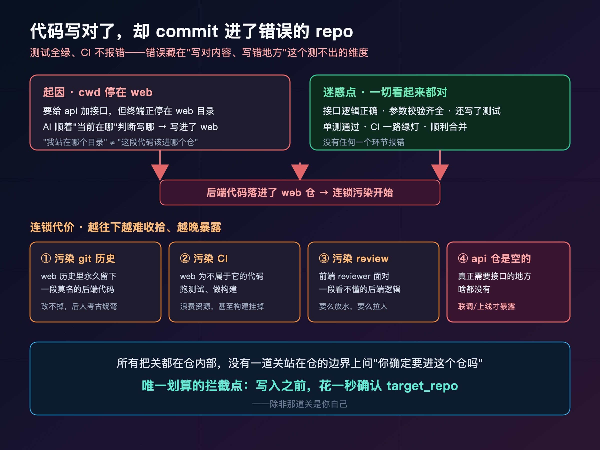
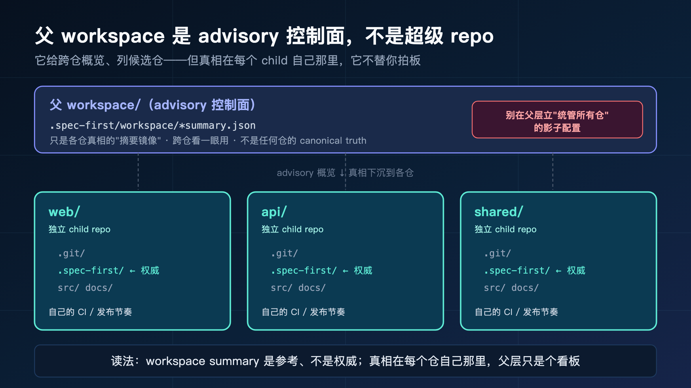
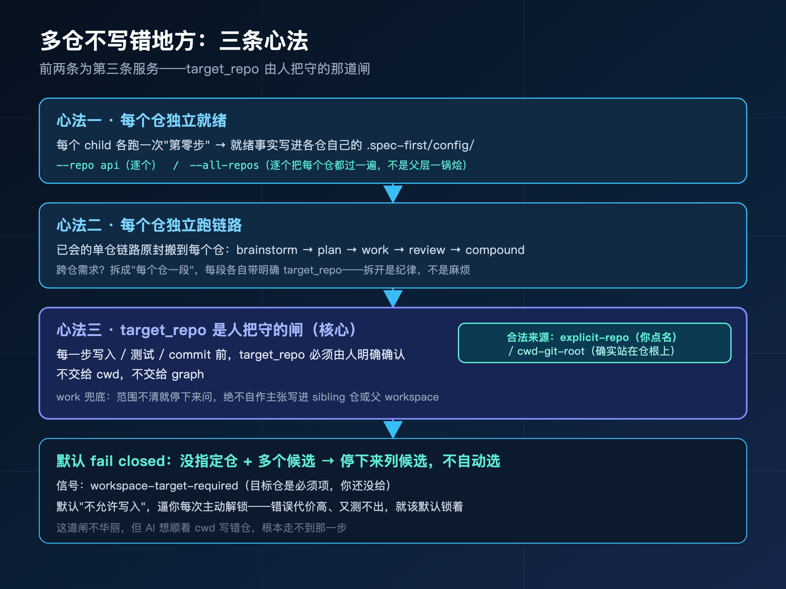
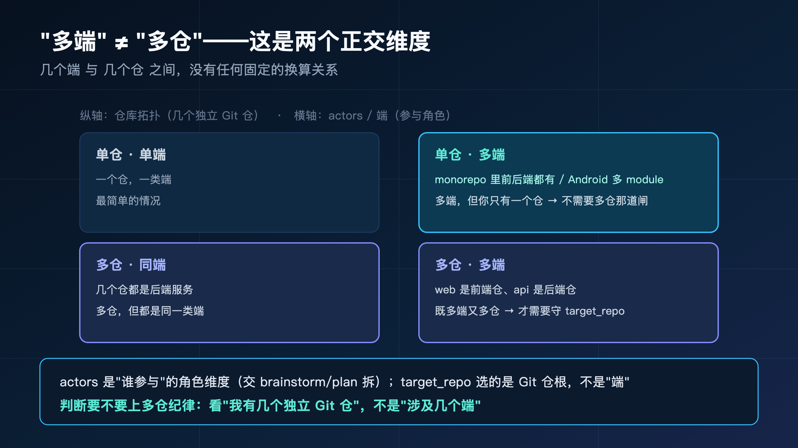
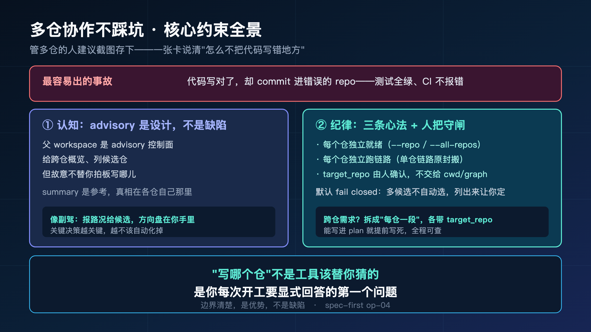

**管多仓的人都懂一种恐惧：代码写对了，测试全绿，可它 commit 进了错误的那个 repo。**

> **导读**
> 这篇文章解决一个很具体的问题：一个父目录下挂着好几个独立仓库，跨仓协作时，怎么不让 AI 把代码写到错误的 repo 里去？
> 我的答案不是"等一个全自动多仓功能"，而是一套老手都在用的避坑纪律：每个仓独立就绪、独立跑链路，每一步写入前显式把守 target_repo。多仓最容易写错地方，正因为这样，把决定权握在自己手里才是聪明做法。没读过前面几篇也不影响看这一篇。

上一篇（op-03），我们在一个有历史包袱的老系统里小心翼翼地改——那里最怕的是"改错了一行、牵连一大片"。

这一篇，我们把场景再放大一档：从一个仓库，放大到好几个仓库。

错的东西也跟着升级了。在单仓里，最坏的情况是"改错了哪一行"；在多仓里，最坏的情况变成了"**改对了内容，却改错了哪一个仓**"。

这两种错，严重程度不是一个量级。改错一行，测试大概率会红，你当场就发现。改错仓库——代码逻辑没毛病，单测全过，CI 一路绿灯，你心满意足地合并，结果功能跑在了一个根本不该有它的地方。等到某天另一个仓的同事问你"这段代码怎么跑我这儿来了"，你才意识到出事了。

而且越是熟练、越是把流程跑顺了的人，越容易栽在这上面。新手会犹豫、会反复确认；老手手快，一句话甩给 AI、看一眼绿灯就合并，恰恰是这套丝滑的肌肉记忆，让"写错仓"这种不报错的错误有了可乘之机。这一篇要给的，正是一条能插进这套肌肉记忆里的纪律——让"确认写哪个仓"变成你出手前的本能动作。

这一篇就是来防这件事的。

---

## 01 先讲个画面：代码写对了，却写错了仓

先不讲方法，讲个场景。管多仓的人应该会觉得眼熟。

你手上是这么一个工作区：一个父目录，底下挂着三个独立的 Git 仓库——`web`（前端）、`api`（后端）、`shared`（公共库）。三个仓各自有自己的 `.git`、自己的 CI、自己的发布节奏。你今天要给 `api` 加一个接口。

你打开 AI 助手，当时终端正好停在 `web` 目录里（上一个活儿还没切回来）。你敲下需求，AI 风风火火地开干，代码写得很漂亮——接口逻辑完全正确，参数校验、错误处理一应俱全，还顺手写了测试。

测试跑过了。你一看绿灯，提交、推送、合并，一气呵成。

问题是，这一整套漂亮的代码，落在了 `web` 仓里。

因为 AI 是顺着"当前在哪个目录"去判断写哪儿的，而你当时的 cwd 停在 `web`。它没问你一句"这个接口应该进哪个仓"，就默认你在哪儿、就往哪儿写。

后果是一连串的：

- `web` 仓的 git 历史里，凭空多了一段后端接口代码——和它的职责完全不搭。
- `web` 的 CI 开始跑一些它根本不该跑的测试。
- 真正需要这个接口的 `api` 仓，啥都没有。
- 等 code review 的人看到 `web` 的这个 PR，一脸问号：这是什么？

最坑的是，**整个过程没有任何一个环节报错**。代码是对的，测试是过的，CI 是绿的。错误藏在"写对了内容、写错了地方"这个维度里，而这个维度，恰恰是测试和 CI 都覆盖不到的。

为什么测试和 CI 拦不住？因为它们检查的是"代码本身对不对"——逻辑、边界、回归，全是在**单个仓内部**回答的问题。而"这段代码该不该在这个仓"是一个**跨仓的归属问题**，它发生在比单仓测试更高的一层。你给 `web` 写的那段后端代码，在 `web` 的测试体系里可能完全自洽、跑得通；测试根本不知道"它本不该在这儿"。**所有把关都在仓内部，没有一道关站在仓的边界上问一句"你确定要进这个仓吗"——除非那道关是你自己。**



被这种事坑过的人，看到这里应该已经手心冒汗了。下面我们就来拆：这种错为什么会发生，以及 spec-first 是怎么从设计上把它挡在门外的。

---

## 02 案例定位：一个父目录，挂着几个独立仓

先把这次的场景在地图上钉死。

第二季反复用两张地图给需求定位：一张是**需求模式**（0-1 全新 / 1-10 增量 / 10-100 存量），一张是**仓库拓扑**（单仓单项目 / 单仓多模块 / 多仓工作区）。

前面几篇，我们走过了单仓单项目（op-01 的标签过滤）、单仓多模块（op-03 的老系统改造）。这一篇，落在第二张地图最右边那个、也是最容易翻车的坐标：**多仓工作区**。

而需求模式这一维，这篇故意不锁死——因为多仓的核心难点和"需求是新做还是改存量"几乎无关，**它只和"你有好几个独立的仓"这件事有关**。不管你这次是给某个仓加新功能，还是改老代码，"别写错仓"这条纪律都一样适用。

什么叫"多仓工作区"？把它和另外两种拓扑对比一下就清楚了：

- **单仓单项目**：一个 Git 仓库就是一个完整应用。范围就是整个仓，不用纠结写哪儿。
- **单仓多模块**：一个仓里装着多个模块（比如一个 monorepo 里有 `web`、`api`、`core` 几个 package）。它们共享同一个 `.git`、同一套权威配置，只是按模块划分边界。
- **多仓工作区**：一个父目录底下，挂着**多个各自独立的 Git 仓库**——每个都有自己的 `.git`、自己的 CI、自己的发布。它们物理上放在一起方便协作，但**逻辑上是彼此独立的项目**。

注意中间和右边这两个的关键区别：单仓多模块是"一个仓，内部分模块"；多仓工作区是"好几个仓，物理上凑在一起"。前者写错模块，至少还在同一个 git 历史里；后者写错仓，是污染了另一个独立项目的历史。

这次的案例，就用开头那个工作区：父目录下挂 `web` / `api` / `shared` 三个独立仓，你要给其中一个加东西。

为什么多仓最容易翻车？因为它把"边界"这件事从"看得见"变成了"看不见"。单仓里，边界就是那个文件夹，你一眼能看到自己在哪、能改什么。多仓里，几个仓物理上挨着、长得又像，你的注意力很容易在它们之间滑来滑去——尤其是 AI，它没有"我现在心理上属于哪个项目"这种感觉，它只有冷冰冰的 cwd 和文件路径。**人靠直觉守边界，在多仓里直觉会骗你；所以多仓的边界，必须靠显式声明来守，不能靠感觉。**



定位清楚了，我们先看最常见的误解——很多人以为多仓是"自动"的。

---

## 03 最大的误解：以为多仓是"自动"的

写错仓这件事，根子上是一个错误预期：**以为工具会自动帮你判断该写哪个仓。**

这个预期很自然。你都把几个仓放一个父目录下了，工具肯定能看出来它们是一伙的，那它替我决定写哪个，不是顺理成章吗？

恰恰相反。让工具"自动"替你选仓，正是写错仓的头号原因。我们看看"自动"通常是怎么个自动法：

- **靠当前目录（cwd）猜**：你终端停在哪个仓，就往哪个仓写。开头那个事故就是这么来的——你人停在 `web`，它就把后端代码写进了 `web`。可"我现在站在哪个目录"和"这段代码该进哪个仓"，根本是两回事。
- **靠代码图谱（graph）猜**：让某个跨仓的依赖图谱来推断"这个改动大概属于哪儿"。听起来智能，但图谱是个 advisory 的参考，它给的是"看起来相关"，不是"你确认要写这里"。拿一个推测当权威决策，迟早出事。

这两种"自动"，共同的毛病是：**它们都在用一个间接信号（你站哪儿、依赖像啥）去替代一个本该由人明确给出的决策（写哪个仓）。**

间接信号在单仓里没问题——反正只有一个仓，猜不错。但到了多仓，间接信号和真实意图之间就有了缝，而这条缝，就是代码漏进错误仓库的入口。

再说深一层：间接信号最坑的地方，不是它"经常错"，而是它"**大部分时候对、偶尔错**"。如果它次次都错，你早就不信它了；正因为十次有九次蒙对，你慢慢放松了警惕，等到第十次它把后端代码写进了前端仓，你已经习惯性地不再确认、闭眼就合并了。**一个偶尔出错、又默默替你做高代价决策的机制，比一个明显不靠谱的机制危险得多。**

所以 spec-first 的态度很明确：

> **多仓场景下，"写哪个仓"是一个必须由人显式给出的决策，工具不替你猜。**

这不是工具偷懒，是工具知道分寸——这种代价高、又测不出来的决策，交给一个间接信号去赌，是不负责任的。

那有人就要问了：工具什么都不替我做，那它在多仓里到底还有啥用？这就要讲清楚 spec-first 在多仓里真正的角色——advisory 控制面。

---

## 04 "不替你做权威"不等于"不能用"

听到"工具不自动选仓、什么都要你自己定"，你可能心里咯噔一下：那这多仓不就是个半成品、不能用吗？

不是。这里要把一个关键概念讲清楚：**advisory（建议性）控制面**。

spec-first 在多仓工作区里的角色，是一个 advisory 控制面。这个词拆开看：

- **它是个控制面**：站在父 workspace 这一层，它能帮你跨仓做一些**概览性、协调性**的事——比如看看这几个仓各自的就绪状态、列出工作区里有哪些候选仓、给你一个跨仓的全局视角。
- **但它只提供 advisory**：它给的是参考信息和候选清单，**故意不替你拍板**。要写哪个仓、要在哪个仓动手，这个权威决策，它留给你。

换句话说，父 workspace 能告诉你"这里有 `web` / `api` / `shared` 三个仓可选"，但它不会替你勾"就是 `api`"——那一勾，必须你自己来。

这是一个**刻意的设计取舍，不是功能没做完**。理由前面已经讲透了：多仓里"写哪个仓"这个决策一旦错了，代价高、又躲过所有自动检查。对这种决策，把决定权强行收到人手里，是最稳的。

打个比方：advisory 控制面像一个称职的副驾。它帮你看地图、报路况、提示"前面三个路口都能拐"，但**方向盘始终在你手里**。它不会趁你不注意自己打方向——因为在多仓这种"拐错一个路口就上错高速、还半天发现不了"的路况下，让副驾自作主张才是真正危险的。

所以"advisory 现状"的正确理解是：**spec-first 把多仓里最危险的那个决策，郑重地交还给了你**。理解了这一点，下面三条心法就顺理成章了。

---

## 05 advisory facts 怎么读：参考，不是权威

进入三条心法之前，先解决一个具体问题：父 workspace 那一层，到底会留下什么？这些东西该怎么看？

在多仓工作区里，父 workspace 这一层会写下一些文件，放在 `.spec-first/workspace/` 目录下。它们大多是各种 summary——工作区初始化的摘要、各仓就绪情况的概览之类。

关于这些文件，记住一句话就够：

> **`.spec-first/workspace/` 下的东西，全是 advisory summary——是参考，不是任何一个 child repo 的权威事实（canonical truth）。**

这句话有两层意思，都很重要：

**第一层：父 workspace 不拥有任何仓的"真相"。**

每个 child repo 的权威事实——它的就绪配置、它的需求、它的计划——都存在那个仓**自己**的 `.spec-first/` 里。父 workspace 那层的 summary，只是把各仓的情况汇总了个概览，方便你跨仓看一眼。它是各仓真相的"摘要镜像"，不是真相本身。

**第二层：所以你不能拿父层的 summary 当决策依据去改某个仓。**

举个例子：你在父层 summary 里看到"`api` 仓好像还没就绪"。这条信息的正确用法是——它提示你"去 `api` 仓里确认一下、需要的话补就绪"，而不是"在父层直接动手把 `api` 修好"。父层那条记录只是个 advisory 提示，真正的动作得回到 `api` 仓自己那一层去做。

为什么要强调这个？因为一旦你把父层的概览当成了权威，就又回到了"靠间接信号决策"的老毛病——summary 是二手的、可能滞后的，拿它拍板，和拿 cwd 拍板没本质区别。

记住这个读法，三条心法就有了共同的地基：**真相在每个仓自己那里，父层只是个看板。**

### 05.1 一个具体的反例：别在父层"统一管理"

为了让这条读法落地，举个很多人会犯的具体错误。

你管着三个仓，觉得"分散维护太麻烦了，我在父层建一个统一配置、统一管所有仓不就好了"。这个念头很自然，但它正好踩在 advisory 边界的反面。

父 workspace 那层**没有**、也**不该有**一份能统管所有仓的权威配置。它只有 advisory summary。你真要在父层塞一份"统管配置"，会发生两件事：一是各仓自己的 `.spec-first/` 才是工具真正认的权威，你父层那份根本不会被当真；二是你给自己造了一个"看起来是真相、其实没人听"的影子配置，下次出了不一致，排查起来格外痛苦。

正确的做法永远是：**配置和真相，下沉到每个仓自己那里；父层只保留"汇总看一眼"的概览。** 想统一调整三个仓的某项设置，就用 `--all-repos` 逐个进去调，而不是在父层立一个总开关。

---

## 06 心法一：每个仓，独立就绪

现在进入正题。多仓不写错地方的工作方式，浓缩成三条心法。

第一条：**每个 child repo，独立完成环境就绪。**

回忆一下 op-01 讲过的"第零步环境就绪"——任何一个项目，开工前都要先跑一次 setup，把 MCP server、graph provider 这些装好、验证好，把项目事实写进 `.spec-first/config/`。

多仓的关键认知是：**这个"第零步"，每个仓都要各跑一次，不能指望在父层跑一次就覆盖所有仓。**

因为前面说了，每个 child repo 的权威就绪事实存在它自己的 `.spec-first/` 里。`web` 就绪不等于 `api` 就绪，`api` 装了 graph provider 不等于 `shared` 也装了。它们是独立项目，就绪状态各管各的。

具体怎么做？两种方式：

**逐个就绪——用 `--repo` 指定单个仓：**

```text
/spec:mcp-setup --repo api          # Claude Code
$spec-mcp-setup --repo api          # Codex
spec-first update --repo api        # 终端
```

`--repo` 显式指定工作区里的某一个 child 仓，工具会把路径规范化、做边界检查，然后**只在这一个仓里**写就绪事实。你想先把 `api` 弄好，就 `--repo api`，清清楚楚。

**批量就绪——用 `--all-repos` 把每个仓都过一遍：**

```text
/spec:mcp-setup --all-repos
$spec-mcp-setup --all-repos
spec-first update --all-repos
```

`--all-repos` 是父 workspace 维护所有 child 仓的显式入口。它会**逐个**进每个 child 仓执行就绪，把 repo-local 的就绪事实写回各仓自己的 `.spec-first/`。

这里有个容易误会的点，必须点破：

> **`--all-repos` 是"逐个把每个仓都就绪一遍"，不是"在父层一锅烩、跨仓乱写"。** 它的产出仍然分别落在各个仓自己那里，父层只多一份 advisory summary。

也就是说，哪怕你用了批量的 `--all-repos`，它干的也是"挨个仓认真就绪"的活，绝不会出现"一个父层配置统管所有仓"这种破坏边界的事。批量只是省了你一个个敲命令的力气，边界一点没松。

记住这条心法的内核：**就绪是 per-repo 的，每个仓的真相在自己手里。**

---

## 07 心法二：每个仓，独立跑链路

第二条心法，是第一条的自然延伸：**plan / work / review 这些链路，也各自以 repo root 为边界，独立跑。**

就绪是 per-repo 的，那链路当然也是 per-repo 的。你给 `api` 加接口，就在 `api` 这个仓里跑它的 plan、work、review——读 `api` 的代码、`api` 的需求、`api` 的项目规则，产出落进 `api` 的 `docs/`。

这意味着什么？意味着多仓并不需要你学一套全新的"多仓链路"。**你已经会的单仓链路，原封不动搬到每个仓里用就行。** op-01 跑通的那条 `brainstorm → plan → work → review → compound`，在 `api` 里照跑，在 `web` 里照跑，互不干扰。

多仓没有把链路变复杂，它只是让你**多了一个开工前的动作：先确认这一轮的活儿，归哪个仓。**

确认完，剩下的事和单仓一模一样。

这里值得停一下，澄清一个常见的焦虑：**"那一个需求要同时改好几个仓怎么办？"**

答案不是"找一个能同时改多仓的魔法命令"，而是**把它拆开**。一个"前端加按钮、后端加接口"的需求，本质是两段活：一段属于 `web`，一段属于 `api`。正确的做法是把它拆成两段，每段各自带明确的 target_repo，分别在各自的仓里跑链路。

这听起来比"一键改两个仓"麻烦，但它恰恰是对的——因为这两段改动，本来就该分别经过各自仓的需求收敛、计划、审查。硬要"一键"同时改两个仓，等于让两个独立项目的改动绕过了各自的把关，这正是混乱的开始。**多仓里，"拆开、各自负责"不是麻烦，是纪律。**

确认归属、各自跑链路——这条心法里，`work` 这一步有个专门为多仓设的安全机制，值得单独拎出来讲——它就是第三条心法的主角。

### 07.1 work 的 guardrail：不靠 cwd 猜写哪儿

还记得开头那个事故吗？AI 顺着 cwd 把后端代码写进了 `web`。spec-first 的 `work` 阶段，专门有一条纪律防这个：

> **不要单凭"当前在哪个目录"去推断写入目标。** 在编辑代码、跑测试、写 changelog、提交之前，计划或任务包里必须声明一个明确的 target_repo（或者每个任务各自标好自己的 target_repo）。

更关键的是它的兜底行为：

> **如果 repo 范围缺失或含糊，work 不会硬着头皮往某个仓写，而是退回去——要么回到 plan 阶段补清楚，要么直接问你"这一轮的活动仓是哪个"。它绝不会自作主张写进某个 sibling 仓或父 workspace。**

对比一下就看出区别了。开头那个翻车的 AI，是"目录在哪写哪、不问不停"；而 work 的纪律是"范围不清就停下来问、绝不瞎写"。同样面对"目标不明确"，一个选择赌，一个选择停。多仓里，"停下来问"几乎总是对的。

这就引出了核心的第三条心法。

---

## 08 心法三：target_repo 是人把守的那道闸

三条心法里，这一条是核心，前两条都是为它服务的：

> **每一步写入、测试、commit 之前，target_repo 必须由人明确确认。这道闸，由人把守，不交给 cwd，不交给 graph。**

把前面所有的讨论收束一下，其实就是这一个动作：在 AI 动手碰任何一个仓之前，先有一个明确的、人确认过的答案——**"这一轮，写 `api`"**。

这个答案从哪来？spec-first 提供了几种明确的来源，而且只认这几种：

- **你用 `--repo` 显式指定了**：来源清清楚楚是"explicit-repo"，工具确认这是你点名的，允许写入。
- **你确实就站在某个仓的根目录、且意图明确**：来源是"cwd-git-root"——注意这和"瞎猜 cwd"不是一回事，它要求你确实在一个 Git 仓的根上，是一个明确的就位，不是模糊的"我大概在附近"。

而当你**没指定 `--repo`、工作区里又有好几个候选仓**时，会发生什么？

工具不会替你挑一个。它会 **fail closed**——直接停下来，把所有候选仓列给你看，告诉你"目标没定，请明确指定一个"。这个状态有个明确的信号叫 `workspace-target-required`，意思就是"workspace 模式下，目标仓是必须项，你还没给"。

> **默认状态下，多仓工作区是"不允许写入"的。只有当目标仓的来源是明确的（你点名了，或你确实站在某个仓根上），写入才被放开。**

体会一下这个设计的味道：它把"允许写入"设成了需要你主动解锁的状态，而不是默认敞开。多仓里写错的代价太高，所以默认是"锁着的"，逼你每次都明确一下写哪儿。这点麻烦，换的是"绝不会在你没确认时把代码漏进错误的仓"。

可能有人觉得：每次都要确认一下写哪个仓，不嫌烦吗？其实一点不烦。你想想，"确认 target_repo"这个动作，本质上就是回答一句"这一轮我在哪个仓干活"——这是你脑子里本来就有答案的事，只是以前没说出口、全靠默契。现在把它显式说一句，花的是一两秒，挡掉的是前面那四层连锁代价。**真正烦的从来不是"动手前确认一下"，是"写错之后善后"。** 这道闸把那一两秒的小麻烦，换成了避开几小时返工的大省心。

这种"默认拒绝、显式放开"的设计，安全领域有个名字叫 **fail closed**——出问题或信息不足时，系统倒向"不动作"那一侧，而不是"先干了再说"。它的反面是 fail open：拿不准就先放行。对多仓来说，fail open 意味着"目标不清就随便挑个仓写"，那正是灾难；fail closed 意味着"目标不清就停下来问你"，这才是稳的。**凡是错误代价高、又难发现的场景，都该 fail closed——多仓写入正是教科书级的例子。**

这就是那道闸。它不华丽，但它正面挡住了开头那个事故——AI 想顺着 cwd 往 `web` 写后端代码？在多候选的工作区里，它根本走不到那一步，会先被这道闸拦下来，让你确认。



---

## 09 三个 flag：--repo / --all-repos / --folder

心法讲完，把工具层面的几个 flag 用法和边界一次说清。它们都是围绕"显式指定目标"这件事设计的。

### 09.1 --repo：点名一个 child 仓

```text
spec-first update --repo api
```

最常用的一个。显式选工作区里的**一个** child Git 仓作为目标。工具会把路径规范化、做边界检查，确认它确实是工作区内一个合法的 Git 仓根，然后放开对这个仓的写入。

什么时候用：你这一轮就专注一个仓，最干净的方式就是 `--repo` 点名它。

### 09.2 --all-repos：逐个维护所有 child 仓

```text
spec-first update --all-repos
```

父 workspace 维护所有 child 仓的显式入口。前面强调过了：它是**逐个**进每个 child 仓执行，repo-local 的事实分别写回各仓，父层只多一份 advisory summary。它**不会**跨仓乱写、不会一锅烩。

什么时候用：批量就绪、批量更新这种"想把每个仓都过一遍"的维护性操作。注意它适合**就绪/维护**类动作，不适合"批量写业务代码"——业务代码该一个仓一个仓地、带着明确 plan 去写。

### 09.3 --folder：处理父级里的非 Git 普通目录

```text
spec-first update --folder ./docs-site
```

有时父目录下不只有 Git 仓，还混着一些**普通文件夹**（不是 Git 仓的那种）。这时用 `--folder` 显式把某个非 Git 普通目录作为目标，工具会把它标成 `non-git-folder` 类型来处理。

`--folder` 和 `--repo` 是**互斥**的——一个针对 Git 仓，一个针对非 Git 普通目录，你得明确告诉工具这次面对的是哪种，不能既要又要。

什么时候用：工作区里有个不是 Git 仓、但你也想纳入处理的普通目录（比如一个纯文档站、一份资料目录）。

### 09.4 一个共同的潜规则


把这三个 flag 串起来看，它们传达的是同一件事：**目标是什么类型、是哪一个，都要你明确说出来。** 工具不在"Git 仓还是普通目录""哪一个仓"这些问题上替你猜。

还有一个共同的潜规则，值得记住：**这些 flag 之间是互斥或分工明确的，工具不允许你含糊。** `--repo` 和 `--folder` 互斥，逼你说清面对的是 Git 仓还是普通目录；不带任何 flag 又有多个候选时直接 fail closed。这种"处处逼你明确"的设计不是为了刁难你，而是在多仓这种最容易出现"我以为它懂我"的场景里，把每一个可能被误解的点，都改成必须显式说明的点。含糊的代价太高，所以工具宁可多问你一句。

---

## 10 顺带说说"多端"：它和多仓是两回事

讲多仓，绕不开一个高频混淆，必须单独花一节说清，否则后面你会一直拧着：**"多端"和"多仓"，不是一回事。**

很多人一听"多个端"——Web、iOS、Android、后端——下意识就觉得"那肯定是多个仓嘛"。这个等号，是错的。

先把"多端"这个概念放回它该在的地方。在 spec-first 里，brainstorm 和 PRD 模板有一个标准字段叫 **actors**——指一个需求的**参与者、利益相关方角色**。

注意，actors 说的是"谁参与、谁受影响"这个**角色维度**，它**不是** iOS / Android / Web / backend 这种**技术端**。一个需求的 actors 可能是"普通用户、管理员、审核员"，也可能在某些语境下确实包含"前端、后端"这种实现侧的参与方——但无论如何，actors 是在描述**需求的参与角色**，不是在描述**你的代码放在几个仓里**。

关键来了：**仓库拓扑和 actors（包括所谓的"端"），是两个正交的维度。** 它们各说各的，互不决定：

- **一个仓里，可以有多个端。** 一个 monorepo 里同时放着后端和前端，一个 Android 仓里有好几个 module——这是"多端，但单仓"。
- **多个仓里，每个仓可以是任何端。** 多仓工作区里，`web` 是前端仓、`api` 是后端仓——这是"多端，且多仓"，但也完全可以是"几个仓都是后端服务"的"多仓、同端"。

看出来了吗？"几个端"和"几个仓"之间，没有任何固定的换算关系。

而 spec-first 的 target_repo，选的是什么？**它选的是一个 Git 仓的根（repo root），不是"一个端"。** 你跟工具说的是"写 `api` 这个仓"，不是"写后端这个端"。仓是物理边界，端是角色维度，target_repo 站在物理边界这边。



所以请把这两件事彻底拆开：

> **"我的需求涉及好几个端"是 actors 维度的事，交给 brainstorm / plan 去拆各端的职责和文件边界；"我的代码分散在好几个仓"才是拓扑维度的事，对应 target_repo 要不要显式把守。别让"多端"这个词把你诱导进"所以我得搞多仓那套"的误区。**

你完全可能是"单仓多端"——一个 monorepo 里前后端都有。那你压根不需要操心 target_repo 那道多仓的闸，按 op-03 单仓多模块的方式、用模块边界拆 plan 就行。

把这一节记牢：**判断要不要上多仓那套纪律，看的是"我有几个独立 Git 仓"，不是"我的需求涉及几个端"。** 把这两个维度搅在一起，要么是单仓非要套多仓的闸（白白增加心智负担），要么是真多仓却以为"反正都是一个需求"而不设防（正好掉进写错仓的坑）。先分清自己站在哪个维度，再决定要不要守那道闸。

---

## 11 写错 repo 的连锁代价：所以闸要前置

回到多仓主线。前面反复说"写错仓代价高"，这一节把代价摊开，你就明白为什么那道闸值得每次都守。

写错仓，从来不只是"文件放错了文件夹、挪回来就行"那么轻。它是往一个**独立项目**里掺了不属于它的东西，连锁反应有好几层：

而且要注意，"挪回来"本身就比你想的难。代码已经进了 `web` 的 commit、可能还连着几次后续提交和 merge，你要把它干净地摘出来再种到 `api` 去，往往得动 git 历史、解依赖、重跑两边的 CI——这套善后，常常比当初好好确认一下 target_repo 贵几十倍。下面这几层代价，每一层都在加重这笔善后账：

**第一层，污染 git 历史。** 那段代码进了 `web` 仓的 commit 历史。git 历史是改不掉的（至少不能轻易改），从此 `web` 的历史里就永久留了一笔"莫名其妙的后端接口"。后面谁来考古这段历史，都得多绕一个弯。

**第二层，污染 CI。** `web` 的 CI 流水线开始为这段不属于它的代码跑测试、做构建。轻则浪费资源、拖慢流水线，重则这段代码的依赖把 `web` 的构建搞挂——一个仓的 CI 被另一个仓的代码连累。

**第三层，污染 review 范围。** review `web` 这个 PR 的人，本来只该关心前端的事，现在却要面对一段后端逻辑。要么他看不懂、稀里糊涂放过去（质量失守），要么他得拉一个后端的人来一起看（协作成本凭空增加）。无论哪种，review 这道关都被搅浑了。

**第四层，也是最隐蔽的——真正该有这段代码的 `api` 仓，是空的。** 你以为接口加好了，实际上需要它的地方啥都没有。这个"以为做了、其实没做"的状态，可能要等到联调、甚至上线才暴露。

四层代价叠起来，再回头看那道"写入前确认 target_repo"的闸，你就懂它为什么必须**前置**了：

> **写错仓的代价是在下游一层层放大的，而且越往下越难收拾、越晚才暴露。唯一划算的拦截点，是在写入之前——在最便宜的那一刻，花一秒确认一下"写哪个仓"。**

这和第二季反复讲的那个道理是同一个：**把成本挡在最便宜的上游，别让它漏到最贵的下游。** 在多仓里，最便宜的上游，就是动手前确认 target_repo 这一下。

---

## 12 跨仓协作的现实建议：什么能靠、什么先别指望

讲到这儿，给一个诚实的现实判断——什么现在就能稳稳地用，什么先别抱不切实际的期待。这不是泼冷水，是帮你少踩坑。

### 12.1 现在就能稳的工作流

多仓协作，按下面这个工作流走，现在就很稳：

```text
1. 开工前，先回答一个问题：这一轮的活儿，归哪个仓？
2. 用 --repo 显式指定那个仓，或确认自己确实在那个仓根目录。
3. 在那个仓里，照单仓链路跑：brainstorm → plan → work → review → compound。
4. 涉及多个仓的需求，拆成"每个仓一段"，每段各自带明确的 target_repo。
5. 父层的 workspace summary 只当概览看，不拿它当决策依据。
```

这套流程的精髓，就一句话：**把"写哪个仓"变成每次开工的第一个、显式回答的问题。** 它不依赖任何"自动多仓"能力，纯靠纪律，所以现在就完全可用、而且可靠。

### 12.2 先别指望的事

反过来，这几件事，现在先别指望工具替你自动搞定：

- **别指望工具自动判断"这个改动该进哪个仓"。** 这是你的决策，每次显式给。
- **别指望在父层"一键改所有仓的业务代码"。** 父层是 advisory 概览面，不是统管所有仓的超级仓。批量动作（`--all-repos`）只适合就绪/维护，业务代码要一个仓一个仓地带着 plan 写。
- **别指望跨仓的依赖图谱替你拍板写哪儿。** 图谱是 advisory 参考，帮你看相关性可以，当权威决策不行。

承认这些边界，不是说多仓不能用，而是说：**多仓现在的正确用法，是"人显式把守边界 + 每个仓独立跑成熟的单仓链路"，而不是"等一个全自动多仓魔法"。** 前者今天就能让你稳稳协作，后者会让你撞上 advisory 现状然后失望。

聪明的做法，是用好今天就稳的那套，而不是赌一个还没到的未来。

### 12.3 多仓协作的一个加分项：把归属写进文档

最后给一个能让多仓协作更顺的小习惯。

既然每个仓独立跑链路、每个仓的 `docs/` 里都会沉淀自己的需求和计划，那就**在跨仓需求拆开时，在每一段的计划里显式写一句它属于哪个仓**。比如同一个"加按钮+加接口"的需求，`web` 那段的 plan 开头写明"本计划 target_repo = web"，`api` 那段写明"target_repo = api"。

这句话看着多余，价值却很实在：

- 它把"这段活归哪个仓"从你脑子里的临时判断，变成了仓库里读得到的事实。
- 几天后你回来接着干、或者换个人接手，不用重新猜这段计划是给哪个仓的——文档里白纸黑字写着。
- 它和 work 阶段"动手前确认 target_repo"形成呼应：计划里既然写明了，work 就有了一个明确的、可核对的归属来源，而不是临场靠 cwd。

这个习惯不需要任何额外工具，纯靠你在写计划时多写一行。但它把"target_repo 由人把守"这条纪律，从"每次临场确认"升级成了"提前写死、全程可查"——多仓协作里，越是把归属显式化、文档化，越不容易出岔子。

---

## 13 收尾复盘：多仓最容易出的事，怎么被挡住

按全季的惯例，收尾复盘一下。

多仓工作区最容易出的那个事故，从头到尾就一个：

> **代码写对了，却 commit 进了错误的 repo——测试全绿、CI 不报错，等你发现时，已经污染了一个不相干的仓。**

而 spec-first 在 advisory 现状下，是靠两样东西把它挡住的，都不靠"自动"，全靠"显式 + 人把守"：

**第一样，认知：理解 advisory 现状不是缺陷，是设计。** 父 workspace 是个 advisory 控制面——给你跨仓概览、列候选仓，但故意不替你拍板写哪儿。理解了这一点，你就不会带着"全自动多仓"的错误预期上手，也就不会撞上落差。

**第二样，纪律：每一步写入前，显式把守 target_repo。** 三条心法——每仓独立就绪、每仓独立跑链路、target_repo 由人确认——合起来，就是把"写哪个仓"这个高代价决策，牢牢握在人手里。配上工具默认 fail closed（目标不明确就停下来列候选、不瞎写），这道闸就站住了。

把这次的多仓事故，和每一步是怎么被接住的，对一下：

| 多仓翻车风险 | 被什么挡住 |
|---|---|
| cwd 在哪写哪，写进错误仓 | work 纪律：不靠 cwd 猜，范围不清就停下来问 |
| 没指定仓、工具替你挑一个 | 默认 fail closed + `workspace-target-required`，列候选不自动选 |
| 拿父层 summary 当权威去改仓 | advisory facts 读法：summary 是参考，真相在各仓自己那里 |
| 把"多端"误当"多仓"上错纪律 | actors 与拓扑正交，看的是几个独立 Git 仓 |
| 写错仓污染 git/CI/review | target_repo 闸前置，在最便宜的上游拦截 |



不是某一条单独解决了所有问题，是**认知 + 纪律合起来，把"赌一个间接信号"换成了"人显式确认"**。

回头看这张表你会发现一个规律：每一道防线，本质上都是同一个动作的不同侧面——**在工具想替你猜的地方，插进一次人的明确确认**。cwd 想替你猜，work 让你停下来确认；多候选想被自动选，fail closed 让你确认；父层 summary 想被当权威，读法纪律让你回各仓确认。把这些确认动作养成习惯，写错仓这件事就基本绝迹了。

---

## 14 本篇小结

这一篇，主受众很明确：**一个父目录下挂着好几个独立仓、经常跨仓协作的你。**

我们没讲一个"全自动多仓功能"，因为它现在不存在——而且我想说服你，它现在不存在，是件好事。

多仓最容易出的事故，是"代码写对了却写错了仓"，而这种错，测试和 CI 都拦不住。对这种高代价、又测不出来的决策，**把决定权交给一个间接信号去赌，远不如把它握在自己手里。**

所以这一篇真正卖给你的，是一套老手都在用的避坑纪律：

- **理解 advisory 现状**：父 workspace 是副驾，给你概览和候选，但方向盘在你手里。
- **每个仓独立就绪、独立跑链路**：你已经会的单仓链路，原封搬到每个仓里用。
- **target_repo 由人把守**：每一步写入前，显式确认写哪个仓；目标不明确，工具宁可停下来问。

如果这篇看完你只记住一件事，我希望是这个：

> **多仓里，"写哪个仓"不是工具该替你猜的，是你每次开工要显式回答的第一个问题。边界清楚，是优势，不是缺陷。**

再把这层意思说透一点：很多人下意识觉得"工具越自动、越省心、就越高级"。但在多仓这种"错一次代价极高、又难发现"的场景里，**越是关键的决策，越不该自动化掉**。一个会替你做高风险决策的工具，省的是你按键盘的力气，赌的是你的项目历史。spec-first 选择把这个决策郑重地还给你，不是能力不足，是想清楚了"什么该自动、什么不该"——这恰恰是成熟的标志。

关于多仓更深的机制——三种开发模式到底怎么运作、多仓的 plan 怎么标注每个任务的 target_repo——那是第三季的活儿，会在 development-modes 专题和 s3-04 里讲透。这一篇只管一件事：**在现状下，怎么稳稳地不写错地方。**

下一篇，是第二季的压轴。前面我们把代码写对了、放对了地方、还能换人接力，但还剩最后、也最让人手心冒汗的一关——

> **Spec-First：AI 写的代码，你凭什么敢按下上线**
>
> 代码看着没问题，测试也过了，可上线前那一下犹豫——你到底凭什么相信它真的能上？这一篇讲怎么把"我觉得行"变成"我有底气"。

怕错过压轴篇的话，关注一下不迷路。

如果你身边也有人管着好几个仓、被"代码写错地方"坑过，把这篇转给他——这套"显式把守 target_repo"的纪律，比讲十遍"小心点"管用。

想直接看代码、或者装来在自己的多仓工作区里试试，spec-first 是开源的、装上就能用，文末「阅读原文」直达 GitHub。

---

`spec-first` 是开源项目，已经能用，也欢迎你来提 issue、提建议、一起打磨。

**GitHub：** http://github.com/sunrain520/spec-first

**官网：** http://spec-first.cn/
