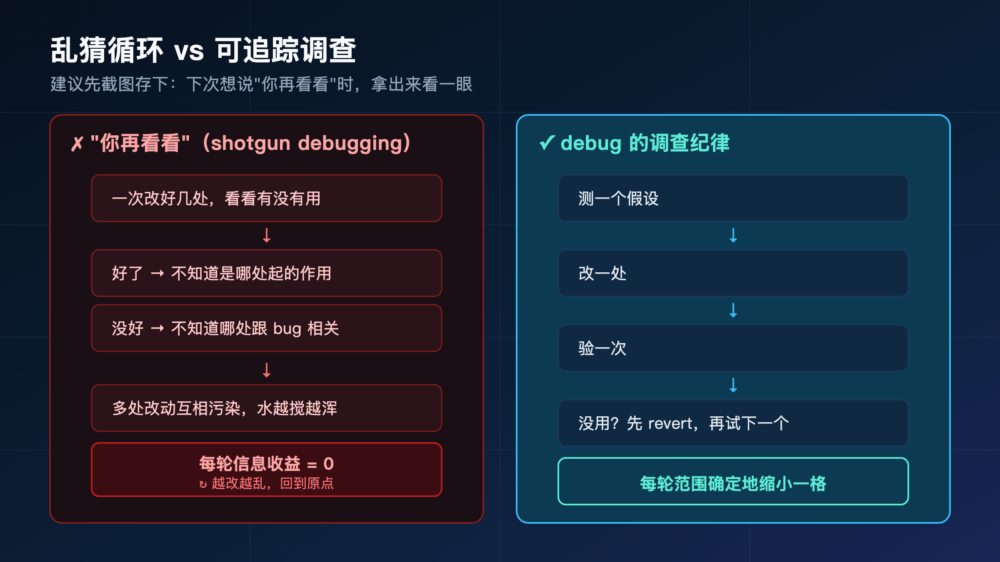
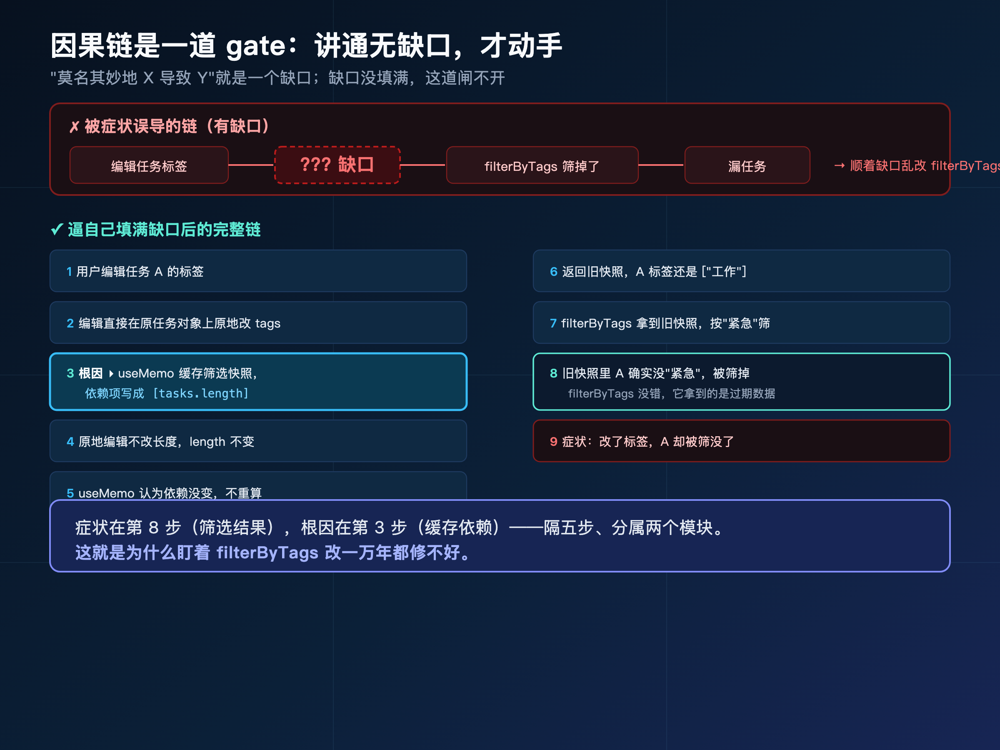
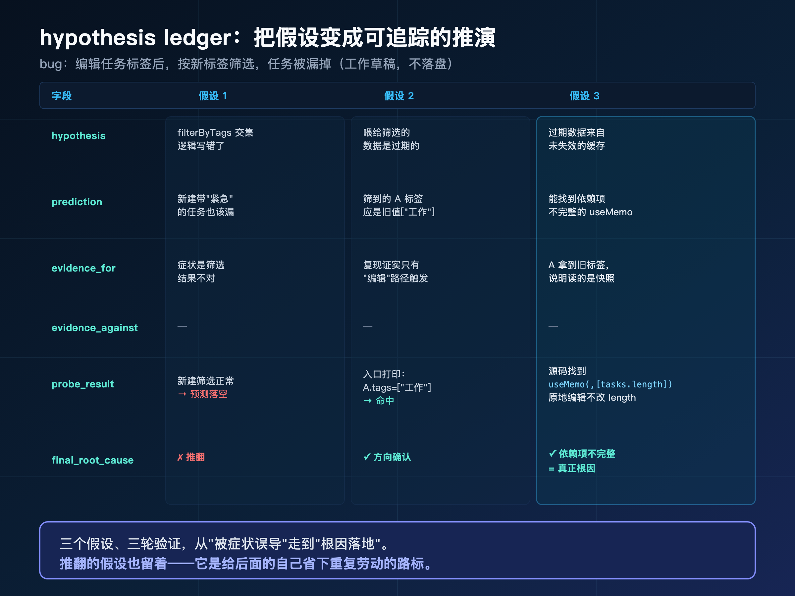
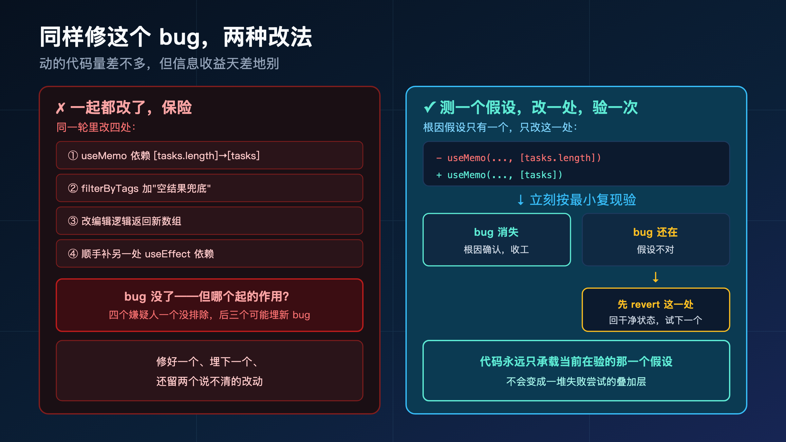
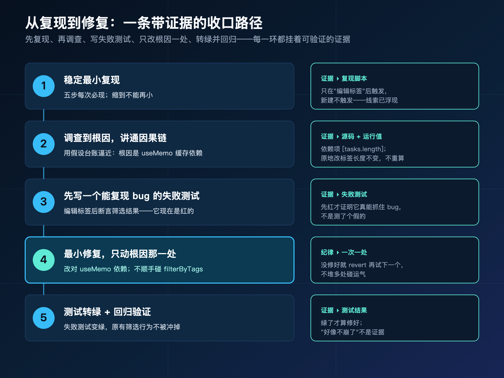
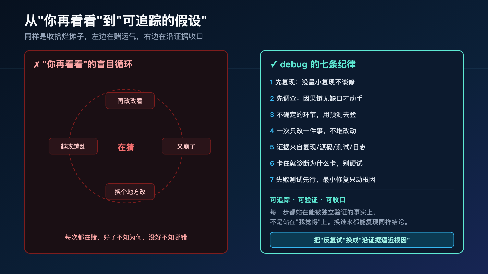

**每个用 AI 写代码的人都经历过这一幕：它信誓旦旦说"已修复"，你一跑还是崩，来回十几轮，越改越乱。**

> **导读**
> 这篇文章解决一个很具体的问题：当 AI 把代码改崩了、bug 反复出现，你除了一句"你再看看"，到底还能做什么？
> 我的答案是：别再让它猜。用 debug 的一套调查纪律，把"反复试"换成"可追踪的假设和证据"——从能稳定复现，到讲清完整因果链，再到只改根因那一处。看完你会知道，收拾烂摊子是有章法的，不是靠运气。

先说一句承接。上一篇（op-01）我带你把一个真实功能——给待办应用加标签过滤——从一句话需求，从头跑到了经验沉淀。按原计划，下一站本该是从 0 到 1 做新产品。

但我临时插了这一篇。

因为第一篇发出去之后，后台问得最多、最急的，不是"怎么从头跑通"，而是另一个更狼狈的处境：**AI 已经在帮我写了，可它一改就崩，我陷在"你再改改→又崩→再改"的循环里出不来。** 从 0 到 1 不急，这一篇你更想要。下一篇我再把"从 0 到 1"交回去。

这一篇，专门写给你——那个正被 AI 反复改崩、改到开始怀疑人生的人。

---

## 01 那个让你抓狂的循环，长什么样

我先把那个画面还原出来，你大概率认得。

你发现一个 bug，丢给 AI："这里有问题，帮我修一下。"

它很快回你一段，语气笃定："问题在于 XXX，已修复。"你满怀希望跑一遍——还是崩。你说："不对，还是有问题。"它又改一版："抱歉，这次应该好了。"你再跑——换了个地方崩。

于是你开始那句万能的话：**"你再看看。"**

它再看看。改了第三处。又崩。你已经不知道它现在到底改了什么、哪些是它上一轮加的、哪些是它这轮删的。代码越来越乱，你越来越没底，最后干脆 `git checkout .` 全部回滚，回到原点——半小时没了，bug 还在。

这个循环最折磨人的地方，不是它慢，是它**没有方向感**。

你不知道离真相是更近了还是更远了。每一轮都像在赌：这次猜中了吗？猜中了你也不知道为什么中，猜不中你也不知道为什么不中。

**这不是 AI 不行，是它和你都在做一件注定没结果的事——在没搞清楚 bug 为什么发生之前，就开始修。**

这一篇要讲的，就是怎么跳出这个循环。不靠更聪明的模型，靠一套调查纪律。

它在 spec-first 里有个明确的入口：

```text
/spec:debug          # Claude Code
$spec-debug          # Codex
```

`debug` 干的事，一句话概括：**先找到根因，再修；不许在讲清楚"从触发到症状"的完整因果链之前动手。** 听起来朴素，但你回头看那个循环，你和 AI 恰恰跳过了"讲清楚为什么"这一步，直接冲到了"动手改"。

---

## 02 先解剖："你再看看"为什么永远修不好

在讲怎么做对之前，先把"你再看看"为什么没用拆开。因为不理解它为什么错，你换个工具还会用同样的姿势犯同样的错。

"你再看看"的本质，是**让 AI 一次改好几个地方，看看有没有用。**

这有个名字，叫 **shotgun debugging**（霰弹枪式调试）——像拿霰弹枪打靶，一枪撒出去一片，指望蒙中一颗。

### 02.1 霰弹枪式调试的两个死结

它必然失败，因为它有两个解不开的死结。

**死结一：好了，你不知道是哪个改动起的作用。**

假设你让 AI 同时改了三个地方，然后 bug 不见了。恭喜——但你完全不知道是哪一处修好的。另外两处可能是无用改动，甚至可能引入了新的、暂时还没触发的 bug。你"修好了"，但你没有理解。下次类似问题，你还得从头猜。

**死结二：没好，你不知道哪个改动跟 bug 相关。**

三处一起改，bug 还在。那这三处到底哪个方向是对的？你不知道。你甚至不知道是不是改对了方向但改得不够，还是方向全错。信息量是零——你花了三次改动的成本，没换到任何能缩小范围的信息。

更糟的是，多处改动会**互相污染**。这一处的改动可能掩盖了那一处的效果，你看到的"现象"已经不是原始 bug 的现象了，而是"原始 bug + 三处改动"叠加出来的新现象。你在一个被自己搅浑的水里捞针。

### 02.2 正解：一次一个假设，一次一个改动，一次一个验证

debug 的纪律和霰弹枪完全相反：

> **测一个假设，改一处，验一次。第一个改动没用，先 revert，再试下一个。**

这叫 one hypothesis / one change / one test。每一轮你只动一个变量，所以无论结果是好是坏，你都拿到了**确定的信息**——这个假设成立或不成立，这个方向对或不对。范围在每一轮稳定地缩小，而不是越搅越浑。

这张图把两条路摆在一起，建议你**先截图存下来**——下次又想说"你再看看"的时候，拿出来看一眼。



左边那个循环你已经太熟了。这一篇剩下的篇幅，都在讲右边那条路具体怎么走。

我不空讲。我拿一个真实的 bug，从头走一遍给你看。

---

## 03 案例登场：一个"看起来对、其实错"的 bug

我接着用 op-01 那个待办应用。标签过滤功能上线了，跑得好好的。直到有一天，用户报了一个 bug。

**用户说：给某个任务改了标签之后，按标签筛选时，这个任务明明带着那个标签，却被筛掉了——筛选结果漏任务。**

你打开代码，第一反应一定是：**筛选逻辑出问题了。**

这太自然了。症状就是"筛选筛错了"，那不就是 `filterByTags` 这个过滤函数的锅吗？十有八九是多标签取交集那段逻辑没写对。

于是你（或者你指挥的 AI）一头扎进 `filterByTags`，开始盯着它的交集判断、去重、边界——准备开修。

**打住。这就是这个 bug 最阴险的地方：症状出现在 A 处（筛选结果），但根因根本不在 A。**

这种 bug，我叫它"看起来对、其实错"——表面症状像一块磁铁，把你所有的注意力都吸到错误的地方。你越是"经验丰富"，越容易一眼"看出"是筛选逻辑的问题，然后在那里耗上半天，怎么改都不对，因为那里压根没错。

霰弹枪式调试在这种 bug 面前死得最惨：症状误导你，你顺着误导一通乱改 `filterByTags`，改坏了真正正确的代码，bug 还在，你还更乱了。

接下来 §04 到 §11，我就在这一个 bug 上，一节一节地走 debug 的纪律——你会看到，每一条原则不是抽象口号，而是**在这个具体的 bug 上，逼着你别走那条误导的路。**

---

## 04 第一纪律：先复现，没有最小复现就别谈修

debug 的第一步，永远不是"改"，是"复现"。

道理很简单：**你连稳定触发 bug 的方法都没有，怎么知道改完到底好了没有？** 没有复现，你"修好了"的唯一证据就是"刚才点了几下没崩"——这跟没修一样，下次它换个条件又冒出来。

所以第一纪律是：**先建立一个能稳定、最小地触发 bug 的复现路径。**

注意两个词。

**稳定**——每次按这个步骤都必然触发，不是"偶尔出现"。如果只是偶发，那第一项工作就是把"偶发"变成"必现"：找出它到底在什么条件下出现。

**最小**——把无关的步骤全部剥掉，只留下触发 bug 必需的那几步。步骤越少，干扰项越少，因果链越清晰。

回到我们这个 bug。用户的描述是模糊的："改了标签之后筛选漏任务。"我们要把它压成一条精确的最小复现：

```text
最小复现：
1. 新建任务 A，打标签 ["工作"]
2. 用筛选条选中标签 "紧急"——列表为空（正确，A 没有"紧急"标签）
3. 编辑任务 A，把标签改成 ["工作","紧急"]
4. 再次用筛选条选中 "紧急"
   → 期望：列表显示 A
   → 实际：列表为空，A 不见了
```

跑这五步，**每次必现。** 我们有了一个稳定的、最小的复现。

而且，光是建立这个最小复现，就已经挖出了第一条关键线索：bug **只在"编辑已有任务的标签"之后触发**。如果是新建一个带"紧急"标签的任务，筛选完全正常。

把这条线索记住——它后面会变成压垮真凶的最后一根稻草。

> **复现不只是"验证修复"的工具，它本身就是调查。** 你为了让 bug 稳定复现而摸索触发条件的过程，往往就已经在缩小根因的范围了。

很多人跳过复现，直接开改。结果就是：改完不知道好没好，"好像不崩了"，上线第二天用户又报同样的问题——因为他从来没真正搞清楚它什么时候崩。

---

## 05 investigate before fixing：因果链上不许有"莫名其妙"

有了复现，下一步还不是改。是**调查**。

这是 debug 最核心的一条原则，原文是 **investigate before fixing**——调查先于修复。它给了一条极其严格的标准：

> **在你能把"从触发到症状"的完整因果链一环一环讲清楚、中间没有任何缺口之前，不许提出修复方案。**

什么叫"缺口"？原话说得很直白：**"莫名其妙地 X 就导致了 Y"，这就是一个缺口。**

你有没有说过这种话："可能是缓存的问题吧""估计是哪里状态没更新""八成是异步时序"——这些全是缺口。它们听起来像解释，其实是用一个模糊的词盖住了你没搞懂的地方。你一旦接受了缺口，就等于在猜，而猜出来的修复，修的是你脑补的 bug，不是真的 bug。

### 05.1 把这个 bug 的因果链摊开

我们来给这个"漏任务"的 bug 画因果链。先看那条**错误的、有缺口的**链——也就是被症状误导后会画出来的：

```text
编辑任务标签 → ??? → filterByTags 把任务筛掉了 → 漏任务
```

中间那个 `???` 就是缺口。"编辑了标签，然后 filterByTags 就筛错了"——为什么？说不清。一旦你容忍这个缺口，就会跑去乱改 filterByTags，掉进陷阱。

正确的做法是逼自己把缺口填满。一步步追问"那一步具体怎么导致下一步"，最后得到的完整链是这样的：

```text
1. 用户编辑任务 A 的标签
2. 编辑操作直接在原任务对象上原地改了 tags 字段
3. 页面里有个 useMemo，把"供筛选用的任务快照 + 可选标签列表"
   缓存了起来，依赖项写的是 [tasks.length]
4. 原地编辑没有改变 tasks 数组的长度，length 还是原来的值
5. useMemo 认为依赖没变，于是不重新计算，返回旧的缓存快照
6. 这份旧快照里的任务 A，标签还是编辑前的 ["工作"]
7. filterByTags 拿到这份旧快照，按 "紧急" 去筛
8. 旧快照里的 A 确实没有"紧急"标签，于是被正确地筛掉
9. 症状：明明改了标签，A 却被筛没了
```

看清楚第 7、8 步了吗？**filterByTags 没有任何错。它忠实地、正确地筛了——只不过它拿到的是一份过期的数据。**

根因在第 3 步：那个 `useMemo` 的依赖项被人为写成了 `[tasks.length]`（多半是当初某次"性能优化"图省事），导致"原地编辑"这种不改变长度的操作，完全绕过了缓存失效。

症状在第 8 步（筛选结果），根因在第 3 步（缓存依赖）——隔了五步，分属两个完全不同的模块。这就是为什么盯着 filterByTags 改一万年都修不好。



> **因果链是一道 gate（闸门）。** 链路没讲通、缺口没填满，这道闸就不开，不许进入"修复"。这一条纪律，单独就能拦掉一大半的乱改。

但你可能会问：上面这条九步链，我是怎么一步步逼出来的？我又不是一开始就知道根因在 useMemo。

对，这正是下一节要讲的——**用假设和预测，把缺口一个个填上。**

---

## 06 把每个假设记下来：hypothesis ledger 登场

填缺口的过程，本质是不断地"提出假设 → 验证 → 留下或推翻"。

问题是，这个过程很容易乱。你脑子里同时转着三四个猜测："是不是 filterByTags 错了？""会不会是状态没更新？""标签数据存哪了？"——猜着猜着，你忘了哪个验过、哪个没验，哪个有证据、哪个纯靠感觉。然后你又开始在原地打转。

debug 给了一个轻量的工具来管住这件事：**hypothesis ledger**（假设台账）。

它不复杂，就是给每个非显然的假设，记下这么几件事：

- **hypothesis**：我猜问题是什么。
- **prediction**：如果这个猜测成立，那别处必然也会有某个现象。
- **evidence_for**：支持这个猜测的证据。
- **evidence_against**：反对它的证据。
- **probe_result**：我去探查（读代码、加日志、写测试）之后，实际看到了什么。
- **final_root_cause**：最终确认的根因。

先把一件事说在前头，免得你误解：

> **这个台账是"工作草稿"，不是要你写进 docs/ 的正式文档。** 它是调查过程中帮你理清思路的便签，调查完了它的使命就结束了。

它也不是一张要你逐字段填完的表格仪式。它的价值在于**逼你显式地记录"我现在在赌什么、凭什么、验没验"**，而不是让一堆猜测在脑子里互相打架。

我直接拿这个"漏任务"的 bug，演示我脑子里这个台账是怎么一行行长出来的。

**第一个假设（被症状牵着走的那个）：**

```text
hypothesis:   filterByTags 的多标签交集逻辑写错了
prediction:   如果是它错了，那"新建一个带紧急标签的任务"再筛选，
              也应该漏
evidence_for: 症状就是筛选结果不对
probe_result: 按最小复现的第 1 步直接新建带"紧急"标签的任务 → 筛选正常！
              → 预测落空，假设推翻
```

注意这里发生了什么：我没有去改 filterByTags，我先**做了一个预测**——"如果是它的错，新建任务也该漏"——然后用最小复现里那条线索一验，预测落空了。filterByTags 当场被排除。

我一行代码没改，就砍掉了那个最诱人、也最错误的方向。

**第二个假设（顺着第一个的反面想）：**

```text
hypothesis:   bug 只在"编辑已有任务"后出现，可能是编辑后数据没刷新
prediction:   如果是数据没刷新，那筛选拿到的任务 A，标签应该还是
              编辑前的旧值
evidence_for: 最小复现证实——只有"编辑标签"路径触发，新建不触发
probe_result: 在 filterByTags 入口打印它收到的任务 A → tags 是
              ["工作"]（旧值），不是 ["工作","紧急"]！
              → 预测命中，根因方向确认：是数据过期，不是筛选逻辑
```

到这一步，方向彻底反转了：不是筛选错，是**喂给筛选的数据是过期的**。

**第三个假设（顺着数据过期往上游追）：**

```text
hypothesis:   过期的快照来自某个缓存，且缓存没在编辑后失效
prediction:   如果是缓存依赖问题，那应该能在代码里找到一个
              依赖项不完整的 useMemo/useEffect
probe_result: 读源码 → 找到 useMemo(..., [tasks.length])；
              编辑是原地改、不改 length → 缓存不失效
final_root_cause: useMemo 依赖项写成 [tasks.length]，
                  原地编辑不触发重算，filterByTags 拿到旧快照
```

三个假设，三轮验证，根因落地。你回头看 §05 那条九步因果链——它不是我一开始就知道的，是这个台账一行行逼出来的。



这个台账长什么样、什么时候该建、字段怎么规范——这些机制细节，我留到第三季专门讲 debug 机制的那篇（s3-08）。这一篇你只要看懂一件事：**它把"在脑子里乱猜"变成了"在纸面上可追踪的推演"。**

---

## 07 "预测"为什么是关键，但又不是每次都要

上一节那三个假设，每一个我都先写了一行 `prediction`（预测）。这一步看起来多余，其实是整套方法里最锋利的一刀。我要单独讲清楚——包括它**什么时候该用、什么时候不该用**。

### 07.1 预测是用来对付"不确定环节"的

先看它锋利在哪。

普通的验证是："我猜是 A，我去看看 A 是不是错的。"问题是，人有 confirmation bias（确认偏误）——你一旦倾向于相信是 A，你去"看"的时候，会不自觉地只找支持 A 的证据，忽略反对的。你看着看着就把自己说服了，哪怕 A 是错的。

预测反过来用。它问的是：

> **如果我的假设成立，那么在另一个我还没看的地方，必然也会出现某个现象。**

这个"另一个地方"是关键。它把验证从"在我已经盯着的地方找支持"，挪到了"在一个独立的地方做一个会被推翻的预言"。

回看第一个假设：我猜 filterByTags 错了。如果我只是去"读 filterByTags 的代码找毛病"，我大概率能从那段交集逻辑里"看出"点可疑的东西，然后越看越像。但我没有。我做了一个预测：**"如果是它错了，新建任务也该漏。"** 这个预测指向了一个完全独立的路径（新建，而非编辑），我一验——没漏。假设当场死亡。

预测的威力就在这：**它给假设设了一个"必须为真否则就推翻我"的检验点。** 你没法对一个会公开打脸的预言自我欺骗。

这就引出 debug 里另一句要刻在脑子里的话：

> **宣布一个假设成立之前，先问自己：什么样的证据能推翻它？如果你说不出任何能让你改变想法的东西，你就不是在测试假设，你是在给它辩护。**

### 07.2 一个反直觉的陷阱：预测错了，但"修好了"

预测还能抓住一个特别隐蔽的错误，我必须专门点出来。

假设你做了个预测，结果**预测错了，可你随手改的那个地方，bug 居然不出现了。**

你会很高兴："管它呢，反正好了。"

**停。这恰恰是最危险的信号。**

预测错了，说明你对因果链的理解是错的。bug 不出现了，多半是你的改动**碰巧掩盖了症状**，而不是修掉了根因。根因还在那，它只是换了个条件、换个地方，等着以后某天用更难排查的方式再冒出来。

放到我们这个 bug 上想象一下：如果当初我没追到 useMemo，而是图省事在 filterByTags 里加了一句"如果结果为空就返回全部任务"——表面上"漏任务"的症状没了（至少这个场景没了），但根因（缓存返回过期数据）原封不动，而且我还引入了一个新 bug：真正该为空的筛选结果，现在会错误地显示全部。

> **预测错了但"好像修好了"，等于在原 bug 上又盖了一层新 bug。** 你修的是症状，不是根因。

### 07.3 但预测不是每个假设都要走的仪式

讲到这你可能以为：那我每个假设都得配一个预测。

不是。这是 debug 特意强调的一个边界，原话是：

> **预测是用来测试"不确定环节"的工具，不是每个假设都要走的仪式。**

什么意思？当因果链上的某一环**显而易见**时，把这一环讲清楚本身就够了，不需要再造一个预测。

举几个例子：

- 报错是 `Cannot read property 'x' of undefined`，堆栈直接指到某一行——这一环是确定的，读那行代码确认空引用即可，不用预测。
- 代码里少 import 了一个函数，运行直接报 `is not defined`——因果链一目了然，预测纯属多余。

什么时候才需要预测？当某一环**不确定、不显然**的时候。比如我们这个 bug 里"为什么编辑后数据是旧的"——这一环不显然，有好几种可能（没刷新？缓存？状态没同步？），这时候预测才上场，帮你在多个可能里精确地排除和确认。

记住这个判断：**链条显然，解释即可；链条不确定，才用预测去测。** 把预测当成每步必走的咒语，只会拖慢你；把它用在刀刃上（不确定的环节），它才锋利。

---

## 08 一次只改一件事：本案例的分叉

现在根因清楚了：`useMemo` 的依赖项 `[tasks.length]` 不完整。该修了。

但在动手之前，我要用这个 bug，把"一次只改一件事"这条纪律演示给你看——因为这正是霰弹枪和调查的分水岭。

### 08.1 霰弹枪会怎么改这个 bug

设想一个没有纪律的修法。根因虽然找到了，但手痒，干脆"一起都改了，保险"：

```text
同一轮里：
- 把 useMemo 依赖从 [tasks.length] 改成 [tasks]
- 顺手给 filterByTags 加了个"空结果兜底"
- 又改了编辑逻辑，让它返回一个新数组而不是原地改
- 再把另一处看着不顺眼的 useEffect 依赖也补了
```

跑一下——bug 没了。然后呢？

你完全不知道是哪个改动起的作用。是改对了 useMemo？还是那个"空结果兜底"碰巧盖住了？还是改了编辑逻辑让数组引用变了？**四个改动，四个嫌疑人，你一个都没排除。** 而且后三个改动里，任何一个都可能悄悄引入新 bug——比如那个"空结果兜底"，我们在 §07.2 刚说过，它会让真正该为空的筛选错误地显示全部。

你以为你修好了一个 bug，其实你可能修好了一个、埋下了一个、还留了两个说不清的改动。

### 08.2 调查会怎么改

debug 的纪律是：

> **测一个假设，改一处，验一次。**

我们的根因假设只有一个：useMemo 依赖不完整。那就**只改这一处**：

```text
- useMemo(..., [tasks.length])
+ useMemo(..., [tasks])
```

改完，立刻按最小复现验。如果 bug 消失——好，根因确认，收工。如果 bug 还在——**说明这个假设不对，立刻 revert 这一处改动**，回到台账，看下一个假设。

注意"revert"这个动作。第一个改动没用，不是在它上面再叠第二个改动，而是**先撤掉，回到干净状态，再试下一个**。这样你的代码永远只承载"当前正在验证的那一个假设"，不会变成一堆失败尝试的叠加层。



这两种改法，动的代码量可能差不多，但**信息收益天差地别**。霰弹枪每轮拿到零信息，调查每轮都让范围确定地缩小一格。

---

## 09 证据从哪来：不能来自"我觉得"

贯穿前面所有步骤的，还有一条底线纪律，我必须单独拎出来说，因为它最容易在不知不觉中破防。

那就是：**证据的来源。**

debug 对"什么算证据"有一条硬规定：

> **能用来确认因果链某一环的证据，必须来自复现、源码阅读、测试、日志、运行时的值、diff，或者用户提供的材料——在此之前，不算证据。**

换句话说，**"我觉得""应该是""一般来说"——这些都不是证据，是猜测。**

### 09.1 回看这个 bug 里，每一步的证据是什么

你重新看一遍前面的推演，会发现每一个结论都钉在一个具体的证据上，没有一个是"我觉得"：

- "filterByTags 没错"——证据是**复现**：新建带标签的任务，筛选正常。
- "数据是过期的"——证据是**运行时的值**：在 filterByTags 入口打印，看到 A 的 tags 是旧值 `["工作"]`。
- "根因是 useMemo 依赖"——证据是**源码阅读**：找到 `useMemo(..., [tasks.length])` 这一行，确认原地编辑不改 length。

每一步都站在一个能被别人独立验证的事实上。这就是为什么这条因果链是结实的——任何人拿着这三条证据，都能复现出同样的结论。

### 09.2 "我觉得"是怎么混进来的

危险在于，"我觉得"特别擅长伪装成"分析"。

"这个 bug 一看就是缓存问题"——听起来像经验判断，其实是没有证据的猜测。哪怕你**最后猜对了**是缓存，你在猜中它的那一刻也并不知道自己对，你只是赌运气赌赢了。下一个 bug 你赌输，就又掉回循环里。

经验的正确用法，不是替代证据，而是**帮你更快地提出值得验证的假设**。经验让你优先想到"可能是缓存"，但"是不是缓存"这个结论，仍然必须由日志、源码、运行值来盖章。**经验提出假设，证据确认假设——两者分工，缺一不可。**

这一条对 AI 尤其重要。AI 天生擅长生成听起来很有道理的解释，它能给你一段无比流畅的"这个 bug 的原因分析"。但流畅不等于正确。你要做的，是逼它（和你自己）给每一个论断配一条可验证的证据——读了哪段源码、打了什么日志、跑了什么测试。没有证据的"原因分析"，再流畅也只是高级版的"我觉得"。

---

## 10 卡住时：诊断为什么卡住，而不是更用力地试

前面走得很顺，三个假设就锁定了根因。但真实调试不总这么顺。你会遇到假设全部验完、根因还没浮现的时刻。

这时候人的本能是：**再试一个！再改改看！**

debug 的纪律恰恰相反：

> **卡住的时候，去诊断为什么卡住，而不是更用力地试。**

### 10.1 给"卡住"一个明确的阈值

"再试一个"最大的问题是没有刹车——你可以无限地试下去，越试越烦躁，越烦躁越退回霰弹枪。

所以 debug 给了一个具体的停下来的阈值：

- **2-3 个假设都验完了还没确认根因 → 停，诊断为什么。**
- **修复尝试失败了 3 次 → 停，这是该升级处理的信号，不是该再猛干一次的信号。**

这个数字不是教条，是个提醒：当你发现自己在反复试而没有进展时，问题往往不在"还没试到对的那个假设"，而在**你思考问题的框架本身错了。**

### 10.2 卡住通常意味着什么

诊断"为什么卡住"，常见的发现有这么几种：

- **复现本身不可靠**——你以为稳定复现了，其实它是偶发的，你前面几轮的"验证结果"全是噪声。回到 §04 重建复现。
- **因果链的起点就错了**——你假设 bug 从 X 开始，但真正的触发点在更上游。你所有假设都建在错误的地基上。
- **信息不足**——你手上的日志/源码根本不足以分辨几个假设，需要先补探针（加日志、加断点），而不是继续盲猜。
- **这根本是两个 bug 叠在一起**——你一直当成一个 bug 在追，所以怎么都对不上。

你看，这几种情况，**没有一种是"再试一个假设"能解决的**。它们都需要你跳出来，重新看问题本身。更用力地试，只会让你在错误的框架里陷得更深。

放到我们这个 bug 上：假设我前两个假设没像实际那样顺利命中，而是都验空了。这时候正确的反应不是慌忙再猜第三个，而是停下来想——我那条"最小复现"靠谱吗？我假设的触发点（编辑标签）真的是起点吗？这一停，往往就把卡住的真正原因照出来了。

> **卡住不是让你更努力的信号，是让你换层思考的信号。** 在错的框架里再勤奋，也到不了对的答案。

---

## 11 修复纪律：失败测试先行，只改根因

根因锁定了，卡点也过了，现在终于到"修"。但 debug 连"修"都有纪律，不是改完拉倒。

修复分三步，顺序不能乱：

### 11.1 先写一个会失败的测试

动修复代码之前，**先写一个能复现这个 bug 的测试，并且确认它现在是红的（失败的）。**

为什么先写测试、而且要先看它失败？

因为一个**会失败的测试**，是你"真正理解了 bug"的硬证明。如果你能写出一个稳定失败的测试，说明你对"什么条件触发、期望什么、实际什么"已经完全清楚了。反过来，如果你写不出这个测试，那你根本还没搞懂这个 bug——别急着改。

放到我们这个 bug：

```text
test('编辑任务标签后，按新标签筛选应能筛到该任务', () => {
  // 1. 建任务 A，标签 ["工作"]
  // 2. 原地编辑 A，标签改为 ["工作","紧急"]
  // 3. 按 "紧急" 筛选
  // 期望：结果包含 A
  expect(filtered).toContain(taskA);
});
```

跑它——**红的**。它精确地复现了用户报的 bug。现在这个测试成了你的标尺：修对了，它会变绿；没变绿，就是没修对。

### 11.2 再写最小修复，只动根因

测试红了，现在改。改哪？**只改根因那一处**，就是 §08 说的：

```text
- useMemo(..., [tasks.length])
+ useMemo(..., [tasks])
```

一行。不顺手优化 filterByTags，不重构编辑逻辑，不补别处的 useEffect。**只动导致这个 bug 的那一处。**

跑测试——**绿了。** 再跑一遍最小复现手测——A 正常显示了。根因修复确认。

### 11.3 这一步对应着前面所有的纪律

回头看，"失败测试先行 + 只改根因"不是孤立的规矩，它是前面所有纪律的收口：

- 你能写出失败测试，因为你**复现**过（§04）。
- 你敢只改一处，因为你**讲通了因果链**（§05）、**用假设排除了其他方向**（§06-07）。
- 你不顺手多改，因为你守着**一次只改一件事**（§08）。
- 你信这一处是根因，因为每一步都有**证据**（§09）。



> **失败测试先行，逼你证明自己真懂了；只改根因，逼你不把"修 bug"变成"顺手大改一通"。** 两条加起来，修复才是干净、可验证、能追溯的。

修完，这个 bug 的调查就闭环了。但调查留下的东西，还能再用一次。

---

## 12 把这个案例的 ledger 完整摊开

前面几节是把推演拆开一节一节讲的。现在我把这个 bug 完整的 hypothesis ledger 一次性摊在你面前——不是给你一个通用模板背，是让你看清，一次真实的调查，落在台账上到底长什么样。

```text
bug：编辑任务标签后，按新标签筛选，任务被漏掉

──────────────────────────────────────────────
假设 1
hypothesis:       filterByTags 多标签交集逻辑错了
prediction:       若成立，新建带"紧急"标签的任务筛选也应漏
evidence_for:     症状是筛选结果不对
evidence_against: —
probe_result:     新建任务筛选正常 → 预测落空
final_root_cause: ✗ 推翻
──────────────────────────────────────────────
假设 2
hypothesis:       编辑后喂给筛选的数据是过期的
prediction:       若成立，筛选拿到的 A，标签应是旧值 ["工作"]
evidence_for:     最小复现证实只有"编辑"路径触发
evidence_against: —
probe_result:     filterByTags 入口打印，A.tags = ["工作"]（旧值）
final_root_cause: ✓ 方向确认：数据过期，非筛选逻辑
──────────────────────────────────────────────
假设 3
hypothesis:       过期数据来自某个未失效的缓存
prediction:       若成立，能找到一个依赖项不完整的 useMemo
evidence_for:     A 拿到旧标签，说明读的是缓存快照
evidence_against: —
probe_result:     源码找到 useMemo(..., [tasks.length])，
                  原地编辑不改 length，缓存不失效
final_root_cause: ✓ useMemo 依赖项 [tasks.length] 不完整
──────────────────────────────────────────────
```

你盯着这张台账看，会发现几件事。

第一，**推翻的假设也留着，没删。** 假设 1 错了，但它留在台账上——它告诉你"filterByTags 这条路已经排除过了"，防止你后面又绕回去。被推翻的假设不是浪费，是给后面的自己（和别人）省下重复劳动的路标。

第二，**每一行 probe_result 都是一个具体动作的结果**——新建任务试一下、入口打印、读源码。没有一行写着"我觉得"。

第三，**整张台账从"被症状误导"走到"根因落地"，路径清清楚楚。** 哪怕你中途被打断，回来看一眼台账，立刻知道自己走到哪了——这正是它对抗"原地打转"的地方。

再说一遍那个边界：**这张台账是调查时的工作草稿，闭环后它就可以扔了。** 它不进 Git、不落 docs/。真正值得沉淀进 docs/solutions 的，是从这次调查里提炼出的那条可复用教训（下一节讲）——而不是这张过程便签本身。台账机制的更多细节，第三季 s3-08 会专门讲，这里不展开。

---

## 13 复盘：如果一开始就用 ledger，省下的是什么

每个案例结尾，我都会做一次复盘。这次的复盘问题是：**如果一开始就走 debug 的纪律，而不是"你再看看"，这个 bug 的成本会差多少？**

我把两条路并排算一遍。

**"你再看看"那条路：**

你被症状牵着，一头扎进 filterByTags。改交集逻辑——没用。改去重——没用。让 AI"再看看"——它又改了三处，bug 换了个样子。你回滚，重来。两个小时过去，你在一个**根本没错的函数**上耗了两个小时，因为没人逼你先问"凭什么是它"。最后可能是某次乱改碰巧盖住了症状，你"修好了"，但 useMemo 那个真根因还埋在那，下次原地编辑别的字段，它换个马甲再来一次。

**debug 那条路：**

三个假设、三次验证锁定根因，一行修复。期间你一次只动一个变量，每一步都有证据，没有一次盲改。从复现到修复闭环，可能就二十分钟。更重要的是——你**真的理解了**这个 bug，所以你顺手就发现了：项目里凡是用 `[xxx.length]` 当依赖的 useMemo，都有同样的隐患。

差的不只是时间，是**确定性**。第一条路你最后也不知道自己到底修没修对；第二条路你拿着失败测试转绿的证据，确定地知道修好了。

> **真正的成本，从来不在"改代码"，在"对着一个看错了的方向反复改"。** debug 把成本砸在"调查"上，省下的是后面无数轮无效返工。

而且这次调查的收获，不该随着 bug 关闭就蒸发。"`[xxx.length]` 当 useMemo 依赖会漏掉原地修改"——这是一条典型的、下次很可能再踩的坑。大修留给 spec-work 接手，**这种可复用的教训，交给 spec-compound 沉淀进 `docs/solutions/`**，下次任何人（或 AI）做类似的缓存优化，先读到它，直接绕过。debug 本身只在收尾时给一份 Debug Summary，把根因、修复和这条教训交接出去——它不抢沉淀的活，但它负责把值得沉淀的东西，干净地递到下一棒手里。

---

## 14 可带走的判断：从"再看看"到"可追踪的假设"

如果这篇你只带走一件事，我希望是这个对比。

**"你再看看"的世界里**，你和 AI 共享同一种无力感：不知道离真相多远，每一轮都在赌，好了不知道为什么好，坏了不知道为什么坏。

**debug 的世界里**，每一步都落在地上：

- 先有**稳定的最小复现**，才谈修。
- 讲通**无缺口的因果链**，才动手。
- 用**假设 + 预测**，在不确定的环节精确排除。
- **一次只改一件事**，每轮都让范围缩小。
- 每个结论都钉在**可验证的证据**上，不靠"我觉得"。
- 卡住了**诊断为什么卡**，而不是更用力地试。
- 修复**失败测试先行、只改根因**。



这七条没有一条依赖"更聪明的模型"。它们依赖的是**你愿不愿意在动手之前，先把"为什么"搞清楚。**

回到开头那个抓狂的循环。它之所以让你抓狂，根子就一个：**你和 AI 在还没理解 bug 之前，就开始修 bug。** debug 做的全部事情，就是在"理解"和"修复"之间，立了一道不许跳过的闸。

> **不是 spec-first 让 AI 更会修 bug，是它逼着 AI（和你）在动手前先讲清楚为什么。** 一旦"为什么"清楚了，"怎么修"往往只是一行代码。

下次 AI 又给你"已修复"、你一跑还是崩的时候，别再说"你再看看"了。换一句：

**"先别改。把从触发到症状的完整链路讲给我听，中间不许有'莫名其妙'。"**

这一句话，就足以把它从霰弹枪拽回到调查台上。

---

## 15 本篇小结

这一篇，我没有重走 spec-first 的全链路，只放大了其中 work/debug 那一段——因为"改崩了怎么办"，是你此刻最急的问题。

我用一个"看起来对、其实错"的 bug 走了一遍：症状在筛选结果，根因在一个被随手写坏的 `useMemo` 依赖，中间隔着五步因果链和一个会骗人的表象。

收拾这种烂摊子，靠的不是运气，是纪律：

- 先复现，再调查，最后才修。
- 把假设记进 ledger，用预测在不确定处精确排除。
- 一次只改一件事，证据只认复现/源码/测试/日志/运行值。
- 卡住了诊断为什么卡，修复时失败测试先行、只动根因。

这套纪律的内核，和前面几篇其实是同一句话：**在动手之前，把决策输入（这里是"为什么"）搞清楚。** op-01 是在写代码前搞清楚需求边界，这一篇是在修代码前搞清楚因果根因——位置不同，逻辑一致。

**第二季还有几个真实场景在路上——从 0 到 1 新产品、老系统改造、多仓协作、换人接手、上线把关，一篇一个，怕错过的话关注一下不迷路。** 如果你身边也有人正陷在"你再改改→又崩→再改"的循环里，被 AI 反复改崩折磨着——把这篇转给他，看一遍真实的调查路径，比说十遍"要冷静分析"管用。

想直接上手的话，挑一个你手上现在就卡着的 bug，照这条路走一遍：先写一个能稳定复现它的最小步骤，再逼自己讲通因果链。spec-first 是开源的、装上就能用，想直接看代码或装来试，文末「阅读原文」直达 GitHub。

下一篇，我们把场景换回原定的那一站——不是给已有产品加功能，也不是收拾 bug，而是从 0 到 1 做一个连方向都还没定的新东西，spec-first 怎么帮你从一个模糊的念头，收敛到能动手：

> **Spec-First：方向都还没想清楚，怎么让 AI 别瞎跑**
>
> 从一个连形态都没定的模糊想法出发，用 ideate→brainstorm 把"我想做点什么"收敛成能动手的需求。

如果你不满足于"会用"，还想搞懂 hypothesis ledger 的字段规范、什么时候该建台账、它和整套调查机制怎么咬合——这些机制纵深，第三季讲 debug 机制的那一篇（s3-08）会专门拆开，那是给想懂原理的人准备的。

---

`spec-first` 是开源项目，已经能用，也欢迎你来提 issue、提建议、一起打磨。

**GitHub：** http://github.com/sunrain520/spec-first

**官网：** http://spec-first.cn/
