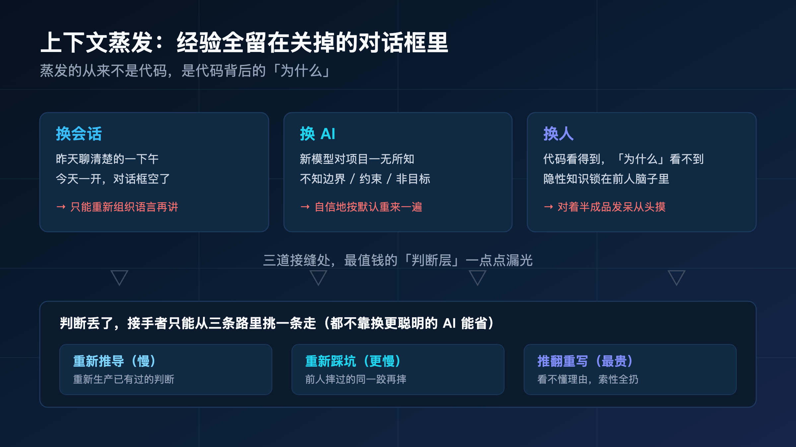
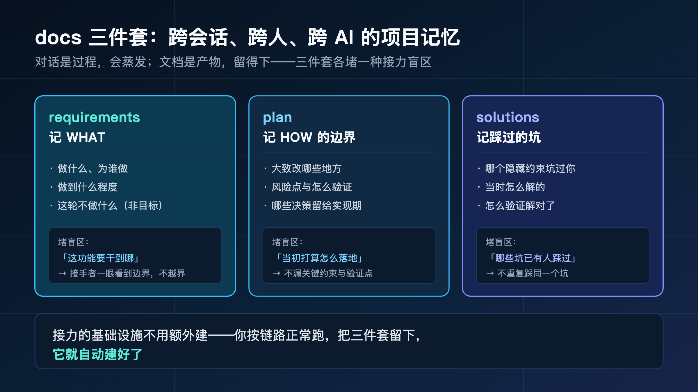
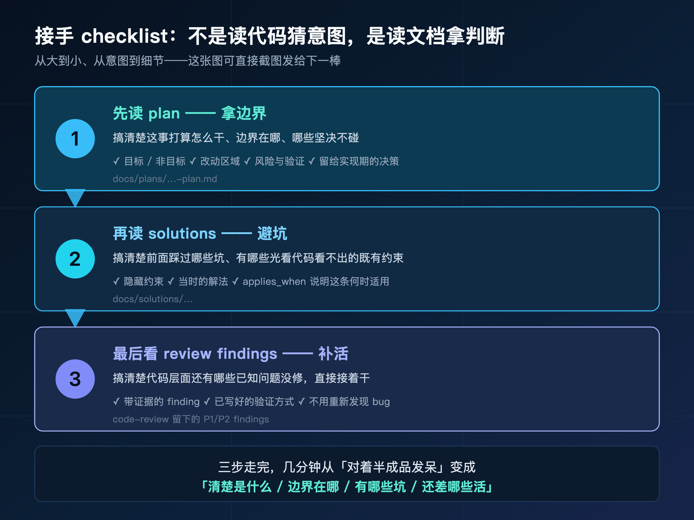
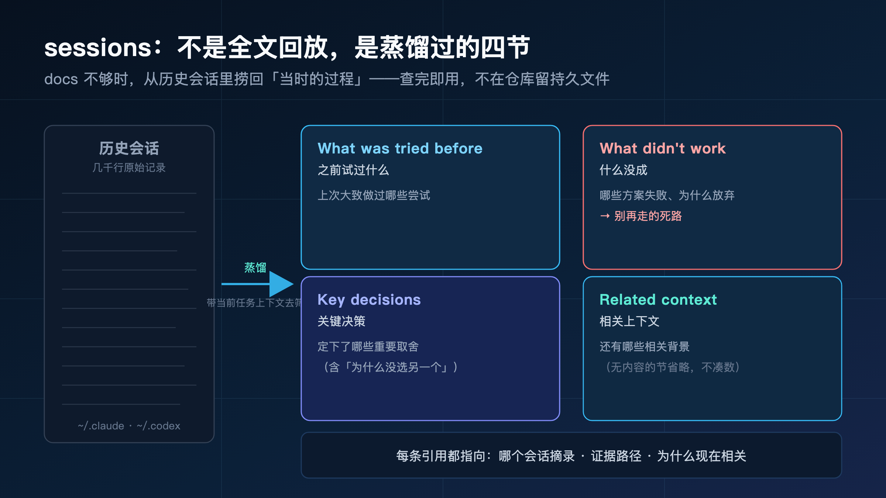
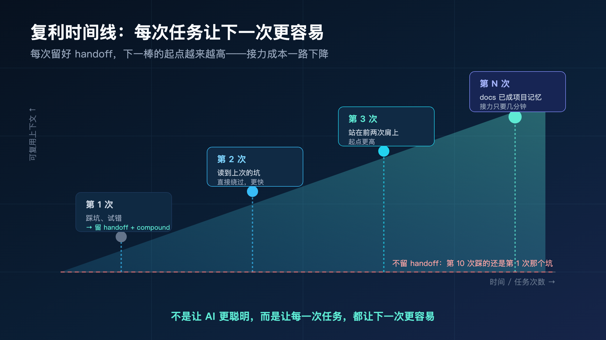
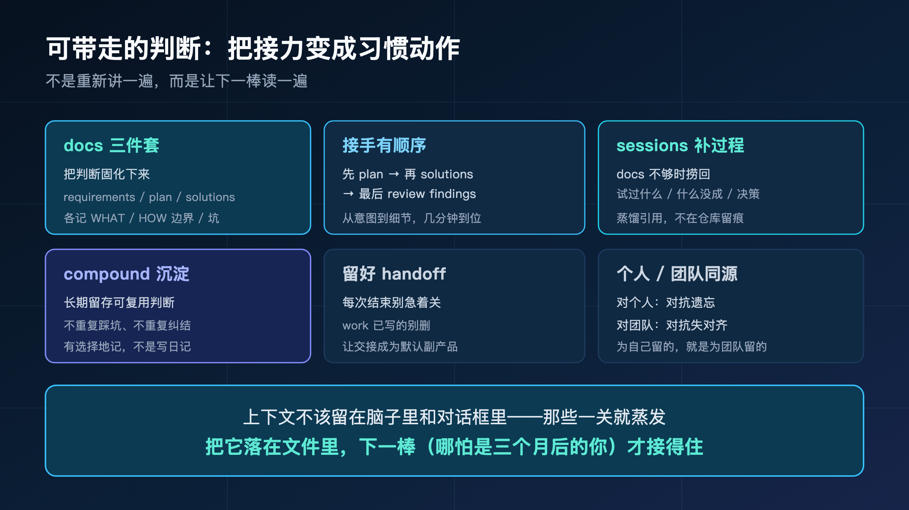

**换个会话，AI 就失忆；换个人接手，又得从头口头讲一遍历史。你每天都在交这笔"重新理解"的学费。**

你大概有过这个体验：昨天和 AI 聊了一下午，把一个功能的来龙去脉、踩过的坑、定下的取舍都捋清楚了。今天打开一看，对话框关了，那一下午的上下文一起没了。你只能重新组织语言，把昨天讲过的再讲一遍。

或者更糟：同事把一个做了一半的功能甩给你，丢下一句"差不多了，你接着弄"。你对着一堆半成品代码发呆——它为什么这么写？哪些是故意的、哪些是没做完的？哪个方案是试过失败被放弃的？你一个都不知道，只能从头摸。

这就是 AI coding 里最隐蔽、也最贵的一笔账：**上下文蒸发**。它不在某一次任务里爆发，而是散落在每一次"换会话、换 AI、换人"的接缝处，一点点把你前面攒的判断漏光。

上一篇（op-02）我们从 0 到 1 做了个全新小工具，一路攒下了 requirements 和 plan。这一篇就用它们来证明一件事：**换个人、换个 AI 接着干，靠的就是这些落在文件里的东西，不是某个对话框里会蒸发的记忆。**

> **导读**
> 这篇不重走完整链路，只切一段——"接力"。
> 我会用大家已经熟悉的那个例子（op-01 给待办应用加标签过滤），演一遍"两周后回来接手、换个 AI 继续做"的真实动作：接手时先读什么、屏幕上到底出现什么、几分钟回到状态靠的是哪几份文件。没读过前面几篇也不影响，这篇能独立看懂。

---

## 01 先把场景说清楚：什么叫"接力"

我们说的"接力"，不是什么高大上的协作概念。它就是你每天都在经历的几个再普通不过的时刻：

- 你昨天开的会话，今天关了重开——**换会话**。
- 你今天想换个模型试试，从 Claude 切到 Codex，或者反过来——**换 AI**。
- 同事休假了，把一个没做完的功能交给你——**换人**。

这三种情况，本质是同一件事：**接力的下一棒，拿不到上一棒脑子里的东西。**

为什么这是个真问题？因为 AI coding 的质量，第一季我们就说透了——**取决于你给它的决策输入质量**。而"接力"恰恰是决策输入最容易断档的地方。

上一棒花了一下午想清楚的边界、试错、取舍，如果只活在对话框里，那么下一棒（无论是明天的你、换的 AI、还是接手的同事）就只能从零开始猜。猜，就是我们整个第二季一直在对抗的东西。

所以这一篇的核心问题只有一个：

> **怎么让接力的下一棒，不用从头再来一遍？**

答案不复杂，但需要你换个习惯：**别把上下文留在脑子里和对话框里，把它落在文件里。** 下面我们一步步看，落在哪些文件、接手时怎么读、读不够时还能怎么补。

这里先把一个常见的误解点掉：很多人觉得"接力丢上下文"是个协作问题，只有团队才有。不是。**最高频的接力发生在你一个人身上——每一次关掉会话再打开、每一次换模型重开，都是一次接力。** 团队接力反而是低频的那种。所以这一篇我从"个人接力"讲起，对你说话，因为那才是你每天都在交学费的地方；团队场景放到后面（§11）作为自然外推。

---

## 02 上下文蒸发的真相：经验全留在了关掉的对话框里

先把"蒸发"这件事看清楚，你才会重视后面的解法。

想象你两周前做完了那个标签过滤功能。当时你脑子里装着一大堆判断：

- 多标签为什么取交集而不是并集（你当时纠结过，最后定了交集）。
- 为什么过滤逻辑必须和"按完成态分组"协同（你踩过坑，筛完一乱才发现的）。
- 为什么没做筛选状态持久化（你当时判断这轮不值得，留到下次）。

这些判断，每一个都花了你真实的时间和脑力。但它们存在哪里？

**绝大多数情况下，它们只存在三个地方：你的短期记忆、那个已经关掉的对话框、还有 AI 那个一关就清空的会话。**

两周后你回来修个 bug，这三个地方全空了。你看着自己写的 `filterByTags`，第一反应是："我当时为什么这么写来着？"



更扎心的是换 AI 和换人的场景。

换 AI：你换了个模型继续做，新模型对你这个项目一无所知。它不知道你定过交集、不知道分组那个坑、不知道哪些是非目标。它会很"自信"地按自己的默认重来一遍——又开始猜。

换人：同事接手，他面对的不只是代码，还有一堆"为什么"。代码能看到，但代码不会告诉你"这里曾经试过另一种写法，因为 XX 原因放弃了"。这些隐性知识，全锁在前一个人的脑子里。

**蒸发的从来不是代码，是代码背后的判断。** 代码还在仓库里躺着，但"为什么是这样"那一层，一关对话框就没了。

而这恰恰是最值钱的那一层——没有它，接手者要么重新推导（慢），要么重新踩坑（更慢），要么干脆推翻重写（最贵）。

我专门把这三种代价拆开看，因为它们的隐蔽程度不一样：

- **重新推导**最不起眼。接手者对着代码慢慢琢磨"应该是这个意思吧"，看起来在干活，其实是在重新生产已经有过的判断。时间花了，价值是零——因为这判断上一棒已经做过一遍了。
- **重新踩坑**更亏。上一棒摔过的那一跤，接手者一无所知，兴致勃勃地照直觉走，结果摔在同一个地方。问题不难，纯粹是经验没传下来。
- **推翻重写**最贵也最常见。接手者看不懂为什么这么写，索性"我重写一个干净的"——把上一棒所有隐性判断连同代码一起扔了，从头来过。这往往不是因为原方案差，是因为**原方案的理由没留下来**，看起来就像没理由。

这三种代价，没有一种是"换个更聪明的 AI"能省掉的。再聪明的模型，接手时拿不到上一棒的判断，也只能从这三条里挑一条走。

---

## 03 为什么 docs/ 是解药：把会蒸发的，变成读得到的

蒸发的根源很清楚：**判断只存在易失的地方（脑子、对话框）。**

那解药也很清楚：**把判断挪到不会蒸发的地方——仓库里的文件。**

这正是 spec-first 那套 `docs/` 三件套在做的事。前面几篇你一路跑下来攒的那些文档，到这里终于兑现它们真正的价值——它们不是流程负担，是**跨会话、跨人、跨 AI 都读得到的项目记忆**。

三件套各记一层，分工很清楚：

- **requirements 记 WHAT**：做什么、为谁做、做到什么程度、这轮**不做**什么。接手者读它，就知道这个功能的边界在哪。
- **plan 记 HOW 的边界**：大致改哪些地方、有什么风险、怎么验证、哪些决策留给实现期。接手者读它，就知道当初是怎么打算落地的。
- **solutions 记踩过的坑**：哪个隐藏约束坑过你、当时怎么解的、怎么验证解对了。接手者读它，就不用再踩同一个坑。



注意这三件套的一个共同特征：**它们都是产物，不是过程。**

对话是过程，会蒸发。文档是产物，留得下。你跟 AI 聊了多少轮不重要，重要的是最后沉淀下来的那几份文件——它们才是接力的下一棒真正能拿到手的东西。

所以"对抗蒸发"这件事，不需要你额外做什么。**你只要在跑链路的时候，正常把这三件套留下来，接力的基础设施就自动建好了。**

这也是为什么我一直说：spec-first 的文档不是写给评审看的官僚材料，是写给"下一个接手的人或 AI"看的记忆。包括三个月后的你自己。

### 03.1 三件套的边界，恰好对应接力的三种盲区

再往细里说一层：这三件套不是随便分的，它们各自堵住接力时的一种典型盲区。

- 接手时第一个盲区是"**这功能到底要干到哪**"——容易越界，把不该做的也做了。requirements 的 WHAT 和非目标正好堵它：边界写在纸上，接手者一眼看到"这轮不做什么"。
- 第二个盲区是"**当初打算怎么落地、风险在哪**"——容易漏掉一个关键约束或验证点。plan 的 HOW 边界和风险验证正好堵它。
- 第三个盲区是"**有哪些坑已经有人踩过了**"——容易重复踩。solutions 正好堵它。

你会发现这三种盲区，恰好就是第 02 节那笔账里"重新推导、重新踩坑、推翻重写"的来源。**三件套不是为了写而写，是每一件都在正面接住一种接力损耗。**

所以当你纠结"这份文档值不值得留"的时候，换个问法就清楚了：**如果下一棒（包括未来的你）少了这份文档，会掉进哪个盲区？** 答得上来，就该留。

---

## 04 接手一个半成品的正确顺序：先读什么，屏幕上到底出现什么

光说"读文档"太空了。我们来演一遍真实的接手动作——这是这一篇最核心的部分。

假设你（或一个全新的 AI）现在要接手那个标签过滤功能，它做到一半。**接手不是从读代码开始的，是从读文档开始的，而且有顺序。**

正确的顺序是：

1. **先读 plan**——搞清楚这事打算怎么干、边界在哪。
2. **再读 solutions**——搞清楚前面踩过哪些坑、有哪些既有约束。
3. **最后看最近的 review findings**——搞清楚代码层面还有哪些已知问题没修。

为什么是这个顺序？因为它是**从大到小、从意图到细节**：先建立"这是什么、边界在哪"的全局认知，再补"有哪些坑要避开"的约束，最后才落到"还差哪些活"的执行细节。反过来先扎进代码，你会淹死在 diff 里，完全不知道哪些是有意的、哪些是没做完的。

### 04.1 第一步：打开 plan，屏幕上出现的是这个

你接手时打开 `docs/plans/2026-06-14-001-feat-tag-filter-plan.md`，屏幕上真实出现的是这样一份东西：

```text
【目标】
在任务列表上层加一个标签筛选，支持多标签取交集，结果实时更新。

【非目标】
- 标签增删改
- 筛选状态持久化

【改动区域（大致）】
- 过滤逻辑层：新增按标签集合过滤的纯函数
- 状态管理：新增"当前选中标签"状态
- 列表组件：接入筛选状态，保留完成态分组
- 标签选择 UI：从现有任务的标签集合渲染可选项

【风险与验证】
- 多标签交集去重 → 单测覆盖
- 空结果 → 明确空状态 UI
- 完成态分组不能被筛选破坏 → 重点回归
- 任务量大时筛选性能 → 大数据量手测

【留给实现期】
- 筛选 UI 的具体交互形态（下拉 / 标签条）由 work 阶段定
```

看清楚你**几秒钟内就拿到了什么**：

- 这功能到底做什么（多标签取交集、实时更新）。
- 哪些**坚决不碰**（标签增删改、持久化）——这条最关键，它直接告诉你接手时别手痒去做这些。
- 改动落在哪几个区域，它们之间什么关系。
- 每个风险点该怎么验证。

这份 plan 没有一行代码，但它把"接手者最需要的全局图"在半屏之内交给了你。换成一个全新的 AI 来读，效果一样——它读完就知道边界，不会去碰非目标。

### 04.2 第二步：打开 solutions，看到那条最值钱的坑

接着读 `docs/solutions/`。如果上一棒认真做了 compound，你会读到这样一条：

```text
---
applies_when: 给已有列表加筛选，且列表本身有分组/排序规则
tags: [frontend, filter, state-management]
component: task-list
---

## 问题
给任务列表加标签过滤时，过滤逻辑独立实现会破坏既有的完成态分组。

## 解法
过滤作为分组的上游：先按标签筛出子集，再交给原分组逻辑，
不要在分组之后过滤。

## 验证
清空筛选 === 显示全部；筛选结果仍保持完成态分组。
```

这条解法的价值，接手时才真正显现。

它告诉你一个**光看代码绝对看不出来的隐藏约束**：过滤必须在分组上游做。如果没有这条记录，你（或新 AI）接手后很可能照直觉把过滤写在分组之后——然后筛完一乱，重新踩一遍上一棒已经踩过的坑。

`applies_when` 这一行尤其关键：它说"给已有列表加筛选，且列表本身有分组/排序规则"。这意味着哪怕你接手的不是这个功能、而是另一个类似的筛选，这条经验照样适用。

**这就是 solutions 的接力价值：它把"一个人踩过的坑"变成了"所有后来者都能绕过的弯"。**

### 04.3 第三步：扫一眼最近的 review findings

最后看代码审查留下的东西。比如上一棒的 code-review 留了一条没修完的：

```text
[P1] correctness · filterByTags
evidence: filterByTags 在 selectedTags 为空数组时返回 []，
         导致"清空所有筛选"后列表变空，而非显示全部任务。
verification: 补单测 filterByTags(tasks, []) === tasks，并手测清空筛选
```

读到这条，你立刻知道：**这个半成品还差一个明确的活——空数组的边界没处理对，而且已经有人指出来了，连怎么验证都写好了。**

你不用自己重新发现这个 bug，直接接着修就行。



三步走完，前后不过几分钟，你已经从"对着半成品发呆"变成"清楚知道这是什么、边界在哪、有哪些坑、还差哪些活"。

这就是接手的正确姿势：**不是读代码猜意图，是读文档拿判断。** 代码只是判断的结果，文档才是判断本身。

### 04.4 为什么这个顺序天然适合"截图发给下一个人"

顺便说一个实用的点：这套"先 plan、再 solutions、再 findings"的接手顺序，本身就是一份**可以直接截图发出去的 checklist**。

团队里交接半成品时，最常见的废话是"你看下代码就懂了"——可代码恰恰是最难一眼看懂意图的东西。换成这套顺序，你交接时只要说一句："按 plan → solutions → findings 的顺序读这三份文件，读完你就接得上。"

接手者照着读，几分钟建立全局认知；你也不用陪着他从头讲。**一个清单，省掉一场口头交接会。** 这就是为什么我把它单独画成一张图——它不光是给你看的方法，也是你能直接复用、直接转发的交接工具。

---

## 05 当 docs 还不够时：sessions 帮你回头查"上次到底试了什么"

docs 三件套能接住大部分接力。但有一种东西，它常常接不住——

**那些没有写进文档的过程性信息。** 比如："上次我们到底试过哪几种写法？哪个试了失败被放弃了？某个决策当时是怎么聊出来的？"

这些东西，requirements 和 plan 通常不会记（它们记的是结论，不是过程），solutions 也只记"值得长期留存"的那条。但接手时，你偏偏需要它们——尤其是想知道"前面有没有走过弯路、别再走一遍"的时候。

这时候 `sessions` 能力登场。

```text
/spec:sessions          # Claude Code
$spec-sessions          # Codex
```

它干的事，简单说就是：**回头去查你过去和 AI 的会话历史，把"之前做过什么、试过什么、决定了什么、学到什么"给你综合出来。**

注意它的定位——它不是给 docs 三件套打补丁，而是补一个不同的维度：**docs 记的是"沉淀下来的结论"，sessions 帮你找回"当时的过程"。** 两者配合，接力的盲区就基本补齐了。

什么时候用它？我的经验是这几个时刻：

- 读完 docs 还是不确定"某个方案当时为什么没选"。
- 想知道"这个功能之前有没有试过别的路、结果如何"。
- 换了 AI，想让新 AI 快速了解"上一个会话里到底发生了什么"。

它的检索机制——怎么找会话、怎么匹配、怎么过滤——这一篇我不展开（那是第三季 sessions 专题的事）。这一篇你只需要记住它在接力时**能帮你做什么**：把散落在历史会话里的过程信息，重新捞回来。

### 05.1 sessions 和 docs 的分工，一句话记住

很多人一听 sessions 能"回顾过去做了什么"，会本能地问：那它和 docs 不是重了吗？都是记历史。

不重，而且差别很关键：

- **docs 是你主动留下的**。你在 plan、solutions 里写下的，是你**判断"值得留"**之后筛选过的结论。它干净、稳定、长期有效，但也因此**漏掉了大量过程**——你不会把每一次试错都写进 plan。
- **sessions 是从原始会话里捞的**。它不需要你提前留，它去翻你和 AI 实际聊过的那些记录，把当时的过程蒸馏出来。它能捞到 docs 里根本没记的东西——比如某个中途放弃的尝试。

打个比方：docs 像是你整理好、归档进柜子的**正式文件**；sessions 像是帮你翻**当时的草稿和便签**。接手时你先看正式文件（快、准），正式文件没覆盖到的，再去翻草稿（补过程）。

所以它俩不是二选一，是**接力时的两道工序**：docs 给你结论，sessions 给你结论背后那段没被记下来的过程。

---

## 06 sessions 给你的不是全文回放，是蒸馏过的四节

这里有个很重要的认知，必须先纠正，否则你会误解 sessions 的价值。

**sessions 不会把你过去的对话原封不动倒一遍给你看。** 那样毫无用处——谁要重读几千行聊天记录？

它给你的，是**蒸馏过的回放引用**（用它自己的话说：distilled replay references, not full session replays）。也就是说，它读完那些历史会话之后，提炼出对你"现在"有用的几条，按一个固定结构交给你：

- **What was tried before（之前试过什么）**：上次大致做过哪些尝试。
- **What didn't work（什么没成）**：哪些方案试了、失败了、为什么放弃。
- **Key decisions（关键决策）**：定下了哪些重要取舍。
- **Related context（相关上下文）**：还有哪些和当前任务相关的背景。

（哪一节没有内容，就省略哪一节——它不凑数。）



每一条蒸馏出来的引用，都会指向具体的东西：是哪个会话或草稿里的摘录、对应哪个决策或失败的尝试、证据在哪个路径、以及——**为什么这条和你现在做的事有关**。

最后一点尤其重要。它不是把所有历史一股脑塞给你，而是带着"你现在要干什么"这个上下文去筛，只捞相关的。

举个接力场景：你接手标签过滤，想确认"多标签到底为什么选交集"。你用 sessions 一查，它可能给你：

```text
Key decisions:
- 多标签过滤定为"交集"（同时含选中标签），不是并集。
  理由：用户场景是"缩小范围找任务"，交集更符合直觉。
  证据：2026-06-14 brainstorm 会话讨论摘录。

What didn't work:
- 试过"并集 + 高亮匹配标签"，但 UI 反馈过滤效果不明显，放弃。
```

看到没有？这两条，docs 里不一定记得这么细（plan 只会写"多标签取交集"这个结论，不会记"并集试过但放弃了"这个过程）。sessions 正好把这块过程补上了。

还有一个边界你得清楚：**sessions 只产临时的草稿摘录，它不会在你仓库里建什么持久文件。** 它不创建回放索引、不导出全文、不写工作流状态。它是个"查询 + 蒸馏"的能力，查完即用，不留痕迹。需要长期留存的，那是 compound 的活，不是它的。

所以接力时 sessions 和 compound 的分工是：**sessions 帮你临时捞回过程，compound 帮你长期沉淀结论。** 一个补当下，一个攒未来。

---

## 07 一个真实接力动作：换 AI 后，几分钟回到状态

现在把前面所有东西串起来，演一个完整的真实接力——这是这一篇的高潮。

场景：标签过滤做到一半，你决定换个 AI 接着做。新 AI 对这个项目一无所知。我们对比一下两种接法。

### 07.1 不靠文档的接法：又开始猜

你直接跟新 AI 说："接着做 todo-app 的标签过滤，做到一半了。"

然后会发生什么？

新 AI 没有任何上下文。它会问你一堆你两周前已经回答过的问题，或者更糟——它不问，直接按自己的默认开干：

- 它不知道多标签要取交集，可能给你写成并集。
- 它不知道过滤要在分组上游，大概率把过滤写在分组之后，又把完成态分组冲乱。
- 它不知道"标签增删改"是非目标，可能顺手给你加个标签管理面板。
- 它不知道空数组那个 bug 已经被发现，可能重新踩一遍。

你又回到了第二季开篇那个翻车现场——**信息严重不足就开干，全靠猜。** 你得花大量时间来回纠正，把两周前讲过的再讲一遍。

### 07.2 靠文档的接法：先喂 plan + solutions，再用 sessions 补过程

正确的接法是这样，整个过程不超过几分钟：

**第一步，让新 AI 先读 plan 和 solutions。**

你不用口头复述，直接让它读那两份文件就行。它读完 plan，立刻拿到了边界——多标签取交集、保留完成态分组、不碰标签增删改和持久化。它读完 solutions 那条"过滤要在分组上游"，立刻避开了最大的坑。

仅这一步，新 AI 就从"一无所知"变成了"知道边界、知道禁区、知道关键约束"。它现在的决策输入质量，和当初做这功能的那个 AI 几乎一样。

**第二步，用 sessions 补"上次失败的尝试"。**

plan 和 solutions 给的是结论，但你还想让新 AI 知道"哪些路别再走"。你跑一次 sessions，把它蒸馏出来的"What didn't work"喂给新 AI：

```text
What didn't work:
- 多标签试过"并集"，UI 反馈过滤效果不明显，已放弃 → 别再回到并集。
- 过滤逻辑独立实现破坏过完成态分组 → 必须走分组上游。
```

现在新 AI 不光知道该往哪走，还知道**哪几条死路别再撞**。

**第三步，让它接着干。**

到这里，新 AI 拿到的上下文，和当初那个连续工作的 AI 已经没有本质区别。它知道做什么、边界在哪、坑在哪、哪些试过失败了。它可以直接从"空数组那个 P1 bug"接着修，而不是从零重来。

对比一下两种接法的"回到状态"耗时：

| | 不靠文档 | 靠 plan + solutions + sessions |
|---|---|---|
| 边界对齐 | 来回问答，反复纠正 | 读 plan，几秒到位 |
| 避开已知坑 | 重新踩一遍 | 读 solutions，直接绕过 |
| 不走回头路 | 可能重试失败方案 | sessions 给出"别再走的死路" |
| 回到状态总耗时 | 几十分钟到几小时 | 几分钟 |

差别不在 AI 聪不聪明，**在你有没有把上一棒的判断落成它读得到的文件。**

这就是"接力"的全部秘密：**你不是在重新讲一遍，你是在让下一棒读一遍。** 讲一遍要几十分钟还会漏，读一遍只要几分钟还不漏。

### 07.3 换 AI 时，这套接法尤其值钱

我想专门强调"换 AI"这个场景，因为它越来越高频，而且最容易被低估。

很多人换模型时的习惯是：开个新会话，凭记忆把背景敲一遍。这有两个问题——一是你记忆里的背景已经残缺了（两周前的细节早忘了），二是你敲的是"你以为重要的"，而不是"AI 实际需要的决策输入"。

换成"让 AI 自己读 plan + solutions"，这两个问题一起解决：

- 文件里的边界是**完整的**，不依赖你的记忆有没有漏。
- AI 读到的是**结构化的决策输入**（边界、约束、坑、验证点），正好是它做判断需要的，而不是你随口讲的一段流水账。

更妙的是，这套接法对任何 AI 都通用。今天用 Claude、明天换 Codex、后天换别的——它们都能读同一份 `docs/`。**你的上下文不绑定在某一个模型的会话里，而是沉淀在仓库里，谁来都能接。** 这是"把上下文落在文件里"最实在的一个好处：它让你换 AI 的成本，从"重新建立上下文"降到"让新 AI 读几份文件"。

---

## 08 为什么"边界 + 证据 + 沉淀"天然适合交接

你可能会问：为什么 spec-first 跑下来的东西，接力起来这么顺？是特意为交接设计的吗？

某种程度上是，但更准确地说——**它是"副产品恰好就是交接物"。**

回想一下整条链路每一步留下的东西：

- brainstorm 留下 requirements——边界。
- plan 留下计划——HOW 的边界 + 风险 + 验证。
- work 留下 handoff evidence——改了什么、验证了什么、还剩什么。
- code-review 留下带证据的 findings——哪里有问题、怎么验证。
- compound 留下 solutions——可复用的经验。

发现没有？**这条链路的每一步，输入和输出都落在文件里。** 不是"做完就忘"，而是"做的过程本身就在生产交接物"。

所以接手者要的东西——边界、证据、坑、剩余风险——**全都是现成的，不需要上一棒额外为交接做什么。**

这跟"直接甩需求给 AI"的方式形成鲜明对比：那种方式里，所有上下文都活在对话流里，做完一关，什么交接物都没留下。下一棒只能对着结果（代码）反推过程（判断），而过程恰恰是反推不出来的。

> **可交接，不是 spec-first 额外加的功能，是"每一步都留证据"这个习惯的自然结果。** 你按链路正常跑，交接能力是白送的。

这也解释了为什么前面几篇我反复强调"留下产物"——当时看像是流程要求，到这一篇你才看到它真正的回报：**它让你的工作天然可交接、可接力、可复用。**

反过来想这件事可能更清楚：如果你想专门设计一套"最难交接"的工作方式，会是什么样？大概就是——所有决策只在对话里说、不落文件，做完即关，代码里不留任何"为什么"的痕迹。**这恰好就是"直接甩需求给 AI"的默认形态。** 它不是不想交接，是它的工作方式从根上就没生产任何交接物。

spec-first 只是把这件事反过来：**让"留下交接物"成为每一步的默认副产品，而不是结束后额外补的一道工序。** 你不需要为交接专门做什么，你只要按链路正常跑，交接能力就自动长出来了。这就是"边界 + 证据 + 沉淀"这套结构的隐藏红利——它顺手解决了 AI coding 里最贵的那个接缝问题。

---

## 09 跨会话最容易丢的两样东西，sessions + compound 正好接住

接力时丢东西很常见，但有两样东西丢了**代价特别大**，值得单独拎出来说。

**第一样：失败的尝试。**

上一棒试过 A 方案、失败了，放弃改用 B。但"A 失败了"这件事，如果没人记下来，下一棒很可能又去试一遍 A——因为 A 看起来是个挺自然的思路。

这就是重复踩坑。最冤的那种：不是因为问题难，是因为**前人踩过的坑没传下来**。

**第二样：被否决的方案。**

上一棒认真比较过 A 和 B，权衡之后选了 B。但"为什么否决 A"这个推理，如果没记下来，下一棒看到 B 会忍不住想："为什么不用 A 啊，A 不是更简单吗？"——然后又把那场已经吵过的架重吵一遍。

这就是重复纠结。同一个决策，被反复拿出来质疑、推翻、再确认，每一轮都在烧时间。

这两样东西有个共同点：**它们都是"过程"，不是"结论"。** 而结论容易记（写进 plan 就行），过程容易丢。

好在它们正好被 spec-first 的两个能力接住：

- **被否决方案、关键决策的理由** → compound 沉淀进 solutions（值得长期留存的那种）。
- **临时的、过程性的失败尝试** → sessions 随时从历史会话里捞回来。

所以接力时，你对付"重复踩坑"和"重复纠结"的武器很明确：**长期的判断查 solutions，临时的过程查 sessions。** 两条腿走路，过程信息就不会全丢。

记住一句话：**接手时最危险的不是"不知道怎么做"，而是"不知道前面已经试过、已经否决过什么"——然后兴致勃勃地重走一遍弯路。**

值得一提的是，这两样东西丢失时，损失是"隐形"的——你根本不知道自己在重复劳动。重新踩坑时你以为自己在解决新问题，重新纠结时你以为自己在做深度思考。**正因为它隐形，它才特别贵：你连"我在浪费时间"这个意识都没有。** 而 sessions 和 compound 接住它们之后，这部分隐形损耗才第一次变得可见、可避开。

---

## 10 把接力变成习惯：每次任务结束，留好下一棒

前面讲的都是"接手别人"，现在换个视角——**怎么让别人（或未来的你）接手你的活时更轻松？**

答案就一句：**每次任务结束，别急着关编辑器，留好 handoff。**

这不是额外的负担，因为 spec-first 链路本来就在帮你留。你要做的只是别把最后一步省了：

- work 结束时，handoff evidence 已经写好了（改了什么、验证了什么、还剩什么）——别删它。
- 任务闭环时，花一分钟想想：这次有没有踩到值得 compound 的坑？有就记下来。
- 半成品交出去前，确认 plan 里的非目标、留给实现期的决策都还在文件里。



这里要特别说一下 compound 的判断标准，因为很多人会滥用它，反而稀释了它的价值。

**不是什么都值得记。** compound 该记的是：刚解决了一个**真问题**、解法**已经验证**过、而且**非平凡**（不是 typo、不是显而易见的改动），同时这个教训**未来很可能再用上**。

反过来，这些情况不该记：

- 还在调试中、问题没解决的——别记，那是半成品。
- 一次性的、查文档就能解决的——别记，没有复用价值。
- 纯装饰性改动（调个颜色、改个文案）——别记，占地方。
- 想拿它当"任务完成的强制打卡"——别这么用，它不是闸。

> **compound 是有选择地沉淀"可复用的判断"，不是写日记。** 记太多，真正值钱的那几条反而被淹没了。

把这个习惯养成，你的项目会慢慢长出一层"记忆"。半年后回头看，`docs/` 下沉淀的需求、计划、解法，本身就是这个项目最值钱的资产之一——它让任何人（或任何 AI）接手时，都不必从零理解。

我见过一个反面案例可以对照：有人觉得 handoff、compound 这些都是"做完之后的麻烦事"，每次都省掉，只留代码。短期看他很快——少写文档嘛。但三个月后他自己回来改 bug，对着代码完全想不起来当初为什么那么写，又花了大半天重新理解。**他省下的那点写文档的时间，在第一次接力时就连本带利赔回去了。** 而且越往后，他的项目越像一个"谁都不敢碰的黑盒"——包括他自己。

这就是那句口号落地的样子：**不是让 AI 更聪明，而是让每一次任务，都让下一次任务更容易。** 接力，就是"下一次"的具体形态。

---

## 11 延伸一节：同一套东西，在团队里也成立

到这里你可能发现了：前面讲的全是"个人接力"——换会话、换 AI、未来的你接手过去的你。

但同一套机制，**换成团队场景，一字不改地成立。** 它只是从"对抗遗忘"升级成了"对抗失对齐"。

团队接力无非也是三种情况，和个人接力一一对应：

- 新人入职接手老功能 → 对应"未来的你接手过去的你"，只是换了个人。
- 同事休假，活交给你 → 对应"换人继续做半成品"。
- 两三个人协作同一个功能 → 多个"棒"同时在跑，更需要共享的边界。

解法完全一样：**别靠老人口头讲历史，让新人直接读 docs。**

- 新人接手，先读 `docs/plans` 和 `docs/solutions`——和你接手半成品的顺序一模一样，先拿边界、再避坑。
- 协作时，requirements、plan、review findings 都提交进 Git，大家看的是**同一份边界**，不会各做各的。
- review 按团队 `CLAUDE.md` 里写下的规则来，不是每个人凭自己的审美——规则也是落在文件里的，不靠人记。

> **对个人，这套链路对抗的是遗忘；对团队，它对抗的是失对齐。** 两者都是 AI coding 规模化之后，比"写得快"更致命的问题。

我把团队场景放在延伸一节，是因为它不是另一条主线——它就是个人接力的自然外推。**你为"未来的自己"留的文档，恰好就是为"团队同事"留的文档。** 同一份 plan，明天的你能读，旁边工位的同事也能读。一份投入，两头受益。

所以哪怕你现在是一个人写代码，也别觉得"留文档是给团队用的，跟我没关系"。**你最大的协作对象，是三个月后那个已经忘光了的自己。** 而且当你哪天真的需要找人搭把手、或者把项目交出去时，你会发现自己什么准备都不用做——那套你为自己留的 docs，原封不动就是给别人的交接包。**为自己留的，恰好就是为团队留的；这件事你越早开始做，复利攒得越厚。**

---

## 12 收尾复盘：如果没有 docs/sessions，要多花多少"重新理解"的时间

每篇结尾我都做一个固定动作——算一笔账。这一篇算的是：**接力这件事，没有 docs 和 sessions，要多花多少成本？**

我们就拿第 07 节那个"换 AI 接手标签过滤"来对照。

没有 docs/sessions 的接力，成本是这样累积的：

- **重新讲一遍边界**：你得回忆并口头复述多标签取交集、保留分组、非目标……几十分钟，还容易漏。
- **重新踩一遍坑**：新 AI 不知道过滤要在分组上游，写错、筛乱、你发现、再纠正——一个来回。
- **重新吵一遍架**：新 AI 质疑"为什么不用并集"，你得重新解释一遍当初的取舍。
- **重新发现一遍 bug**：空数组那个 P1，没人记，可能要重新测一遍才发现。

把这些加起来，一次接力轻松吃掉几十分钟到几个小时，而且**每换一次会话/AI/人，就重来一次**。一个活跃项目，一年下来这种损耗是惊人的。

有了 docs/sessions 的接力，成本是这样的：

- 读 plan：几秒拿到边界。
- 读 solutions：几秒避开坑。
- 跑 sessions：捞回失败尝试，不走回头路。
- 总计：几分钟回到状态。

差距不是百分之几十，是**数量级**。而且这个差距会随着"接力次数"线性放大——你换会话越频繁、团队越大、项目活得越久，docs/sessions 省下的就越多。

> **真正的成本从来不在"写代码"，在"每次接力时重新理解"。** docs 把理解一次性固化下来，sessions 把过程随时捞回来，两者合起来把"重新理解"的成本压到了几分钟。

这就是为什么我说前面几篇攒的 `docs/` 不是负担——**它是一笔会在每一次接力时反复兑现的投资。**

换个角度看这笔账还有个隐藏项：**你算的只是"省下的时间"，但接力质量的提升是算不进去的。** 靠记忆口头交接，再认真也会漏；漏掉的那条边界、那个坑，可能要到上线后才以 bug 的形式暴露出来——那才是最贵的。而读文档接力，边界和坑是**完整地、不打折扣地**传给下一棒的。所以 docs/sessions 省的不只是时间，还有"接力时漏传关键信息"导致的后续返工和事故。这部分省下的，往往比时间本身更值钱。

---

## 13 这一篇只示范用法，机制深挖在第三季

按惯例说清楚边界：**这一篇只示范了 sessions 和 compound 在"接力"场景里怎么用、带来什么价值，没有讲它们的机制本身。**

- sessions 到底**怎么**检索会话历史、怎么匹配仓库、怎么过滤蒸馏——这一篇我只说了它"能帮你捞回过程"，没展开内部机制。
- compound 到底**怎么**判断该不该记、frontmatter 的字段体系怎么设计、检索时怎么命中——这一篇我只说了它"有选择地沉淀可复用判断"，没展开。

这是有意的。机制深挖是**第三季细节篇**的事：

- sessions 的检索机制，第三季有专门一篇讲透。
- compound 的沉淀机制（s3-10），第三季也会单独讲。

这一篇的定位很清楚：**在真实接力场景里跑一遍交接动作，让你看到价值，知道什么时候该用。** 至于"它内部怎么实现的"，等你想用深、用稳的时候，第三季再带你下钻。

先会用，再懂原理——对大多数人来说，这个顺序更实用。你在真实接力里用过几次、尝到甜头之后，再去看第三季的机制，会带着"我知道它解决什么问题"的视角，理解得更深、也更愿意用深。反过来一上来就啃机制，很容易因为"还没体会到价值"而半途放弃。

---

## 14 本篇小结

这一篇我们只切了一段：**接力。**

核心就一句话：**换个会话、换个 AI、换个人接手，靠的不是重新讲一遍，而是让下一棒读一遍——读那些落在文件里、不会蒸发的判断。**

回头看，对抗"上下文蒸发"的整套打法其实很简单：

- **docs 三件套**把判断固化下来：requirements 记 WHAT、plan 记 HOW 的边界、solutions 记踩过的坑。
- **接手有顺序**：先读 plan 拿边界、再读 solutions 避坑、最后看 review findings 补活。
- **sessions** 在 docs 不够时，帮你捞回"试过什么、什么没成、关键决策"的过程信息。
- **compound** 把值得长期留存的判断沉淀下来，让下次（和别人）不重复踩坑、不重复纠结。
- **留好 handoff** 成为习惯，每次任务就在为下一棒铺路。



如果这篇只让你记住一件事，我希望是这个：

> **上下文不该留在脑子里和对话框里——那些一关就蒸发。把它落在文件里，接力的下一棒（哪怕是三个月后的你）才接得住。**

接力顺不顺，差别不在 AI 多聪明、同事多默契，**在你有没有在上一棒结束时，留下一份下一棒读得懂的东西。**

第二季前面几篇你一路攒的 `docs/`，到这一篇终于证明了它的身价——它不是流程负担，是这个项目最值钱的记忆。

**怕错过后面几篇的话，关注一下不迷路。** 如果你身边也有人正被"换个 AI 就得从头讲一遍""接手同事的活两眼一抹黑"折磨，把这篇转给他——看一遍真实接力动作，比讲十遍"记得写文档"管用。

想直接看代码、或者装来在自己项目里试试这套接力，spec-first 是开源的、装上就能用，文末「阅读原文」直达 GitHub。

下一篇，我们换个更硬的场景：前面接手的还只是个"自己人做的半成品"，但如果你接手的是一个**有年头、谁都不敢乱碰的老系统**呢？

> **Spec-First：在有历史包袱的老系统上改代码，怎么不改崩**
>
> 接手的是一个改一处崩三处的老系统，既有约束全藏在代码深处、没人说得清。怎么让 AI 先看清现状、再安全地动手，而不是一改就连环崩？

---

`spec-first` 是开源项目，已经能用，也欢迎你来提 issue、提建议、一起打磨。

**GitHub：** http://github.com/sunrain520/spec-first

**官网：** http://spec-first.cn/
