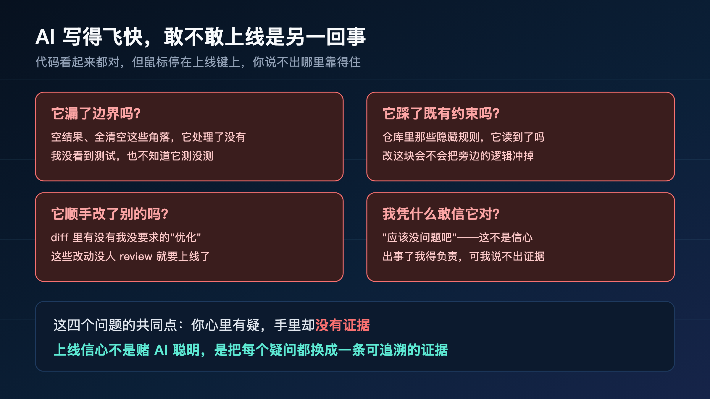
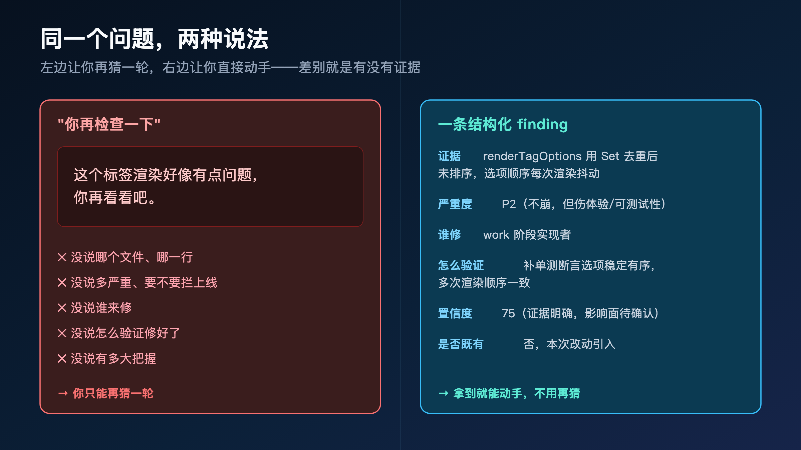
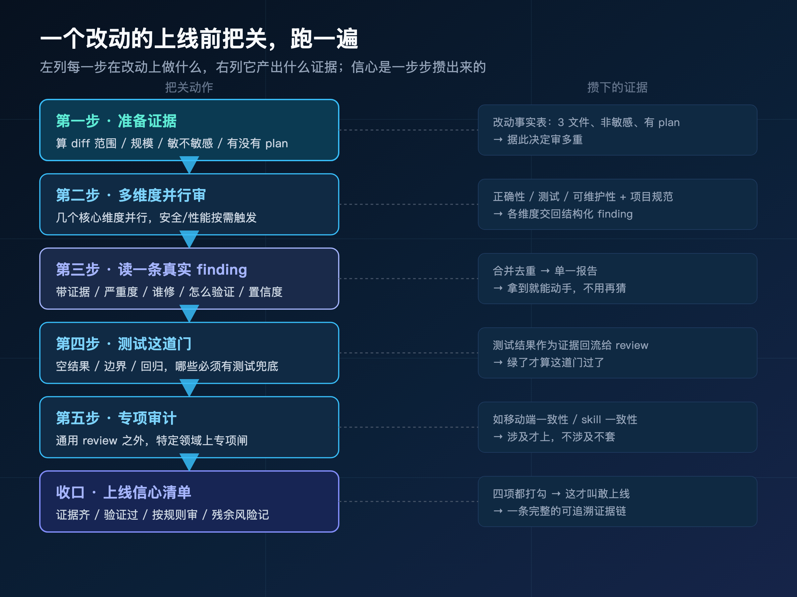
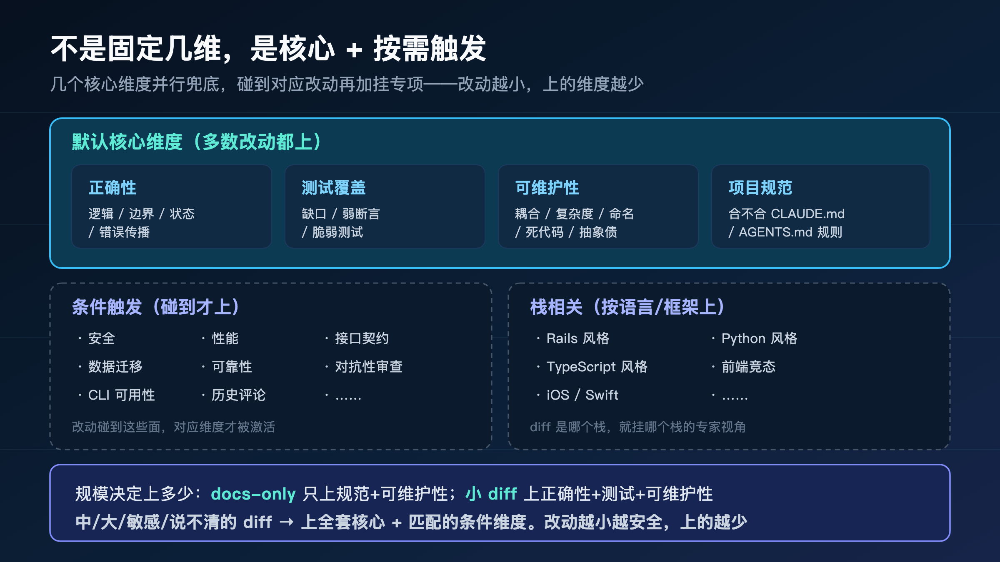
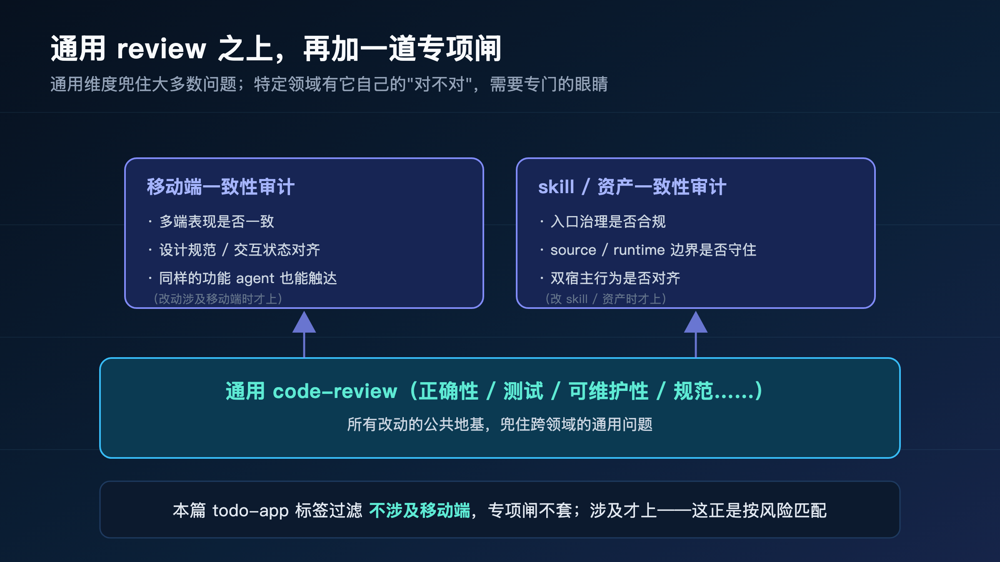
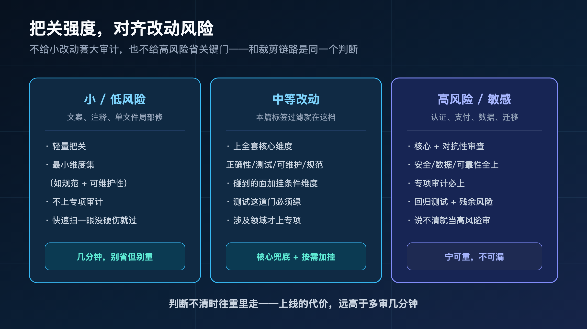
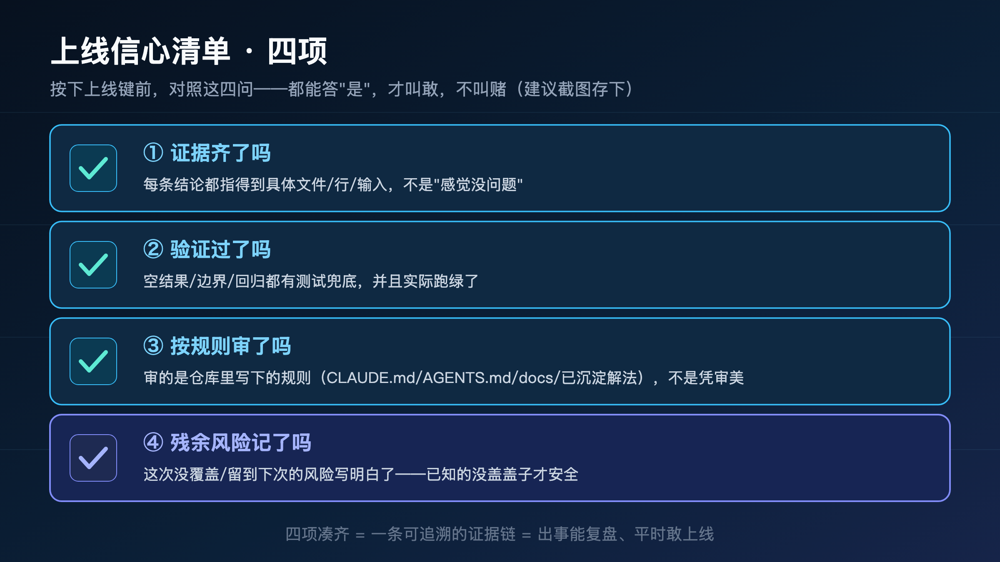
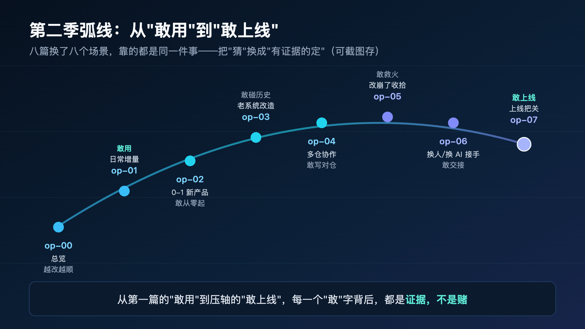

**AI 写得飞快，但飞快写出来的东西，敢不敢上线是另一回事。**

> **导读**
> 这篇不重走完整链路，只切最后一段：代码已经写完了，鼠标停在上线键上，你凭什么敢按下去？
> 我的答案是：跟着一个真实改动，跑一遍上线前的把关——准备证据、按维度审、读一条带证据的 finding、过测试、再看要不要上专项审计。读完你会发现，上线信心不是一种感觉，是一条能摆出来的证据链。没读过前面几篇也不影响，这一篇自己就能读完。

先说个场景，你大概率经历过。

AI 几分钟就把功能写好了，代码读起来也挺顺，测试好像也跑过了。你把鼠标移到"合并""部署"那个按钮上——然后停住了。

你说不出哪里不对，但就是不敢点。

脑子里转的是这些：它有没有漏掉什么边界？会不会把旁边某段我没注意的逻辑冲掉？diff 里那几行我没要求的改动是怎么回事？万一上线后炸了，我拿什么跟人解释——"我以为 AI 写对了"？

这种"写完了，但不敢上"的卡顿，才是 AI coding 真正费心力的地方。模型把"写代码"这件事变快了，却没顺便把"敢为它负责"这件事也变简单。恰恰相反——它写得越快、量越大，你越没法逐行盯，那道"敢不敢上"的坎反而更高了。



上一篇（op-04）讲的是"别把代码写错仓库"——在管着好几个仓的时候，怎么让 AI 把改动落在对的地方。那解决的是"写对了地方"。

这一篇是按下上线键前的最后一关：**写对了地方，还得敢信它对。**

这是第二季的压轴。前面六篇带你跑通了日常增量、从零起步、老系统改造、多仓协作、改崩了收拾、换人接手——每一篇都在回答"这个场景怎么跑"。到这最后一篇，我们收口全季都绕不开的那一问：**这一切跑完了，你凭什么敢上线？**

我的回答很直接：上线信心不是"相信 AI 很聪明"，是**每一步都有证据、有验证、有可追溯的把关**。下面我用一个真实改动，把这套把关从头到尾跑一遍给你看。

---

## 01 先把话说死：上线信心不是一种感觉

在跑把关之前，先把"信心"这个词拆开。

很多人理解的上线信心，是一种心理状态：代码看着没问题，测试好像过了，"应该没事吧"，然后点下去。

这不是信心，这是**赌**。赌 AI 这次没犯错，赌那些你没检查的角落正好没问题，赌上线后不会有人触发你没想到的路径。

赌赢了，你松口气；赌输了，你回头骨牌式地查——查到最后往往发现，是某个边界没覆盖、某条既有约束被冲掉了，而这些，本来在上线前就能查出来。

真正的上线信心是另一回事。它是这样一种状态：

**对于"这个改动为什么能上"，你能摆出一条具体的、可追溯的理由——而不是一句"我觉得行"。**

具体到能这样回答：哪几个维度审过了、每条问题的证据在哪、测试覆盖了哪些边界、按什么规则审的、还剩什么没盖的风险、记在哪了。

这两种状态的差别，不在 AI，在你手里**有没有证据**。

> **赌，是把宝压在"AI 没出错"上；信心，是把每一个疑问都换成一条能摆出来的证据。**

这一篇要做的，就是带你把"我觉得行"这种感觉，一步步换成"我能摆出证据"这种状态。换的过程，就是一次上线前把关的 walkthrough。

---

## 02 "你再检查一下"，为什么根本不算审

跑把关之前，先解剖一个大多数人默认在用、但其实没用的"审法"——这一段 op-01 第 09 节提过，这里快速带过，因为它是后面所有把关的反面参照。

代码写完，你最常做的事是什么？大概是自己再扫一眼，或者丢给同事一句"你帮我看看"，或者干脆回头问 AI："这段你再检查一下有没有问题。"

这三种，本质是同一种：**无结构的二次确认。** 它们听起来像审查，但缺了让审查之所以是审查的三样东西。

**第一，没有维度。** "你再看看"——看什么？看正确性？看测试够不够？看有没有踩既有约束？没说。于是看的人凭直觉扫，扫到哪算哪，盲区全凭运气。

**第二，没有证据。** 就算扫出点什么，给你的也是"这里好像怪怪的""这块我不太放心"。怪在哪？哪一行？什么输入会触发？没有。你拿到这种反馈，只能再猜一轮，回到原点。

**第三，没有可追溯。** "你再检查一下"过了，等于什么都没留下。上线后真出了事，你没法回头说"当时这一项是审过的、证据在这"。它不进证据链，所以它不构成信心。



把这三样缺失合起来看，结论很冷酷：

> **没有维度、没有证据、没有可追溯的"再看看"，约等于没审——它给你的是"看过了"的心理安慰，不是"能负责"的证据。**

所以这一篇讲的把关，跟"你再检查一下"是两件事。它要补的，正好是这缺的三样：**有明确的维度、每条结论带证据、整个过程可追溯。** 下面把这个改动摆上台，我们就着它一项项补。

---

## 03 把这次要上线的改动，摆上台

为了让后面每个概念都落在具体的东西上，我得先把这次的 walkthrough 主角请出来。

我故意复用第二季一直在跑的那个案例——**给待办应用（todo-app）加"按标签过滤任务"的功能。**

如果你读过 op-01，这个改动你熟：单仓单项目、1-10 增量功能，已经走完了 brainstorm 收敛需求、plan 定方案、work 写代码。现在代码写完了，handoff 大概是这样：

```text
改动（3 个文件）：
- 新增 filterByTags(tasks, selectedTags) 纯函数 + 单测
- 状态层新增 selectedTags，列表组件接入
- 新增标签选择 UI：从现有任务的标签集合渲染可选项

验证（work 阶段自查）：
- 单测：单标签 / 多标签交集 / 空结果 / 全清空 通过
- 手测：50+ 任务量下筛选无明显延迟

残余风险：
- 标签极多（>100）时选择 UI 可用性未优化
```

代码在那儿了，测试 work 阶段也跑过了。按很多人的习惯，到这一步就该点上线了。

但我们不急。**现在正是建立上线信心的时刻**——代码刚写完，上下文最新鲜，改了哪儿、为什么这么改，都还记得清清楚楚。这时候把关，质量最高；等过两天再回来审，你已经忘了一半。

接下来，我用 `/spec:code-review`（Codex 里是 `$spec-code-review`）对这个改动跑一遍上线前把关。

```text
/spec:code-review
$spec-code-review
```

但请注意——这一篇我不是来教你"code-review 命令有哪些参数、内部分几步"的。那是机制，留给第三季逐篇拆。**这一篇只关心一件事：怎么用这套把关，把"我觉得行"换成"我能摆出证据"。**

下面这一整套把关，我拆成五步走，每一步都在这个标签过滤的改动上发生。先给你一张全景图，跑的时候心里有数。



---

## 04 第一步：先准备证据，再决定审多重

把关的第一步，不是急着挑毛病，是先**把这个改动的事实摆清楚**。

这一步在 spec-first 里有个名字叫 review-pre-facts，但你不用记名字，记住它在干什么就行：在动任何审查之前，先确定性地算出几件事实，作为后面所有判断的地基。

对我们这个标签过滤，它要先算清楚：

- **这次 diff 的范围有多大？** —— 3 个文件，过滤逻辑、状态层、列表组件加一小块 UI。
- **改动规模算什么级别？** —— 中等偏小，不是单行文案，也不是跨模块大重构。
- **碰没碰敏感面？** —— 没碰认证、没碰支付、没碰数据库迁移、没碰对外接口。纯前端的列表过滤。
- **有没有上游 artifact 撑着？** —— 有。它从 plan 来，plan 又从 requirements 来，前面的边界都定过了。
- **运行时就绪吗、测试结果在不在？** —— 跑一遍 runtime/readiness 预检，把 work 阶段的测试结果收进来当证据。

这几件事不是 LLM"觉得"出来的，是脚本确定性地算出来的——diff 范围、文件数、有没有 plan 文件、测试退出码，这些都是事实，不是判断。

**为什么第一步是这个，而不是直接审？**

因为这些事实直接决定了**这次该审多重**。

> **改动越小越安全，上的把关就越少；改动越大、越敏感、越说不清，上的把关就越多。** 这个判断的依据，就是第一步算出来的那几条事实。

举个对比你就懂了：

- 如果这次只是改了 README 里一句文案（docs-only），那它根本不需要上正确性、测试这些维度——扫一下规范和可维护性就够了。
- 如果这次是改支付回调的金额计算，那哪怕只改了三行，也得把安全、正确性、对抗性审查、回归测试全压上去。

我们这个标签过滤落在中间：中等改动、非敏感、有 plan 兜底。所以它该走的是"全套核心维度 + 没碰到的条件维度不上"。

这一步产出的，是一张**改动事实表**：3 文件、非敏感、有 plan、测试已跑。这张表本身就是证据链的第一环——它记下了"我们是基于什么事实，决定这么审的"。

> **把关的第一份证据，不是某条 finding，是"我凭什么这么审"这个判断本身有据可查。**

### 04.1 为什么这些事实必须是"算"出来的

这里藏着一个容易被略过、但很关键的分工。

第一步那几条事实——diff 多少文件、改动多大、碰没碰敏感面、有没有 plan、测试退出码是几——**全部是脚本确定性地算出来的，不是 AI"判断"出来的。**

这个分工不是吹毛求疵。它直接关系到整条证据链的可信度。

设想一下相反的做法：让 AI 自己"估计"这次改动大不大、敏不敏感。那会发生什么？它可能把一个碰了认证的改动"觉得"成小改动，于是该上的安全维度没上；也可能把一个纯文案改动"想象"成高风险，平白上一堆没必要的审查。**判断的地基一旦是猜的，上面建的整座把关就都不可信了。**

所以 spec-first 把这条线划得很清楚：

> **确定性的事实（范围、规模、敏感面、测试结果）交给脚本算；语义的判断（这条 finding 严不严重、该不该拦上线）交给 LLM 做。** 脚本不假装会判断，LLM 不假装跑过了它没跑的检查。

第一步的价值，正是先把"事实"这块地基钉死，后面的语义判断才有立足之处。事实是算出来的，判断才敢信。

事实摆清了，知道该审多重了，现在才进入真正的审查。

---

## 05 第二步：几个核心维度，并行地审

第二步，是这套把关的主体：**从几个核心维度，并行地审这个改动。**

这里我要特别说清楚一件事，免得你后面较真——**不是"恰好六个固定维度"。** 它是"核心维度兜底 + 按需触发"的分层结构，具体上几个，由第一步算出的事实决定。

对我们这个中等、非敏感的改动，并行上的核心维度大致是这几个：

- **正确性**：逻辑对不对、边界处理了没、状态管理有没有坑、错误有没有正确传播。
- **测试覆盖**：该测的测了没、有没有弱断言、有没有那种"改一点就崩"的脆弱测试。
- **可维护性**：耦合重不重、复杂度高不高、命名清不清楚、有没有留下死代码或不必要的抽象。
- **项目规范**：合不合你 `CLAUDE.md`、`AGENTS.md` 里写下的规则。

这几个是"默认核心"——多数有实质代码的改动都会上。除此之外，spec-first 还有两个常驻视角：一个盯"新加的功能 agent 能不能也触达"，一个去 `docs/solutions/` 里翻有没有相关的过往解法可以对照。

然后是**按需触发**的部分。我们这个改动没碰安全、没碰性能敏感路径、没碰对外接口，所以安全、性能、接口契约这些条件维度**这次不上**。但如果这次改的是筛选大数据量的算法，性能维度就会被激活；如果改的是对外 API 的返回结构，接口契约维度就会被激活。



所以你看，**维度不是一张固定清单，是一套"按改动长相动态组装"的机制。** 这也是为什么我从头到尾说"几个核心维度"，而不给你一个写死的数字——你较真去数，会发现每次改动上的维度都不一样，这恰恰是它对的地方。

> **维度全集和每个维度具体怎么审，是机制层的事，第三季 s3-09 会逐个拆。这一篇你只需要知道：审是分维度的、维度是按改动选的、几个核心维度并行兜底。**

这跟 op-01 第 09 节讲的是同一件事，这里放大一点的是：**这些维度是怎么"并行"的。** 当你的宿主支持时，这几个维度不是一个挨一个串着审，而是各自作为独立的 reviewer 同时审同一份 diff，每个交回自己维度的结构化结果，最后合并、去重，汇成一份单一报告。

并行的好处不只是快。更重要的是**每个维度都带着自己的专注视角全程审完**，不会出现"扫正确性的时候顺带瞄了一眼测试，结果两个都没看透"的情况。各审各的，再汇总——这就比一个人凭直觉从头扫到尾，覆盖得严实得多。

维度审完，交回来的不是"我觉得还行"，是一条条带结构的 finding。下一步，我们挑一条出来，看它到底长什么样。

---

## 06 第三步：读一条真实的 finding

这是整套把关里，最能体现"证据"二字的地方。

各维度审完，汇总成一份报告，里面是一条条 finding。我挑这次审出来的一条——注意，**我换了一条新的，不用 op-01 那条 `filterByTags` 空数组的老例子**，因为那条 op-01 已经讲透了。这次这条，出在新加的标签选择 UI 上：

```text
[P2] correctness · renderTagOptions
证据：renderTagOptions 从所有任务收集标签后用 Set 去重，
     但去重后直接渲染，未做排序。Set 的迭代顺序依赖插入顺序，
     新增/删除任务会让标签选项的排列每次渲染都在抖动。
严重度：P2（不会崩，但选项乱跳伤体验，且让 UI 无法稳定测试）
谁修：work 阶段实现者
怎么验证：补单测断言 renderTagOptions 返回稳定有序的标签列表，
        多次调用顺序一致；手测增删任务后选项位置不乱跳
置信度：75（证据明确，对真实用户的影响程度待确认）
是否既有问题：否，本次改动新引入
```

把它和"这个标签渲染好像有点问题，你再看看"放一起对比，差别一目了然。这条 finding 给了你六样东西：

- **证据**：具体到哪个函数（`renderTagOptions`）、什么机制（`Set` 去重后没排序）、什么场景触发（增删任务）。你不用再去复现，它已经把现场摆给你了。
- **严重度**：P2。它告诉你这条值不值得拦上线——不会崩，但伤体验、还卡住了可测试性，该修但不是 P0 那种"不修不能上"。
- **谁修**：work 阶段实现者。责任落到了人，不会变成"大家都看到了，但没人认领"。
- **怎么验证**：补一个断言顺序稳定的单测，再手测增删任务。它连"怎么算修好了"都给你定义清楚了。
- **置信度**：75。这是个很诚实的字段——它告诉你"我对这条有多大把握"。75 的意思是证据扎实，但对真实影响程度还留了余地，不是 100% 笃定。它不假装自己永远正确。
- **是否既有问题**：否，本次引入。这一条很关键——它把"这次改出来的"和"仓库里本来就有的"分开了，免得你为历史债买单，也免得把历史债算成这次的过。

看到区别了吗？

> **"你再检查一下"给你的是一句焦虑；一条结构化 finding 给你的是一份可以直接动手的工单。** 前者让你再猜一轮，后者让你直接修、并且知道怎么算修完。

你不需要记住这些字段叫什么名字——那是 finding 的 schema，机制层的事。**你需要的是这个体感：一条值得信的把关结论，长这样，而不是"我觉得这里怪怪的"那样。**

而且这套把关有个分寸：它只会自动应用那些明确安全的修复（比如格式、明显笔误），像这条涉及行为的，它只给你结论和建议，**不替你擅自改逻辑**。该不该修、怎么修，决定权还在你和实现者手里。证据它给足，判断留给人。

### 06.1 置信度这个字段，为什么反而让我更信它

六样东西里，最值得单独说的是**置信度**。

很多人第一次看到 finding 带一个"置信度 75"会愣一下：审查结论还能"没把握"？那我还信它干嘛？

恰恰相反——**一个会标注自己置信度的把关，比一个永远斩钉截铁的把关更值得信。**

想想"你再检查一下"那种反馈，它从来不告诉你它有多大把握，它要么不说，要么说得像绝对真理。而真实世界里，审查结论的确定性本来就有高有低：有的证据铁证如山（比如空数组返回空列表，一跑就知道），有的是"看起来有风险但要看实际用法"。把这个差异显式标出来，是诚实，不是心虚。

置信度 75 在这条 finding 里的意思很具体：**机制层面的证据是扎实的**（`Set` 去重后没排序，这是事实），**但对真实用户的影响程度还留了余地**（也许这个 app 的标签很少、顺序抖动用户根本无感）。它没有把"机制上有问题"夸大成"这一定是个严重 bug"。

这个字段对上线信心的价值在于：**它帮你分配注意力。** 置信度高的 finding 你可以直接照做；置信度中等的，你知道要自己再判断一下实际影响——而不是对所有结论一视同仁地照单全收，或者一视同仁地怀疑。

> **一个敢说"我这条只有七成把握"的把关，比一个对什么都打包票的把关，可信得多。** 诚实标注不确定性，本身就是一种证据质量。

这条 finding，就是证据链里最实的一环。下一节我们换个角度问：它凭什么能审出这条？它拿的是哪来的标准？

---

## 07 它审的，是你仓库里已经写下的规则

这是上线信心里最容易被忽略、但其实最关键的一点。

很多人下意识以为，code-review 是拿一套"放之四海皆准的通用规范"来套你的代码——所以总担心它会跑出一堆不痛不痒的通用建议，或者拿着别的项目的规矩来挑你的刺。

不是这样。

> **它审的是你仓库里已经写下的规则**——`CLAUDE.md`、`AGENTS.md`、`docs/contracts`、你的测试、以及 `docs/solutions/` 里沉淀过的解法。规范从哪来，它就按哪审。

这句话值得展开，因为它直接决定了前面那条 finding 的可信度从哪来。

回到那条 `renderTagOptions` 的 finding。它为什么会盯上"标签选项顺序不稳定"这件事？因为审"项目规范"这个维度时，它读的是你 `CLAUDE.md` 里的约定；审"可维护性"和"测试"时，它对照的是你仓库里"纯函数/渲染函数要可测试"这类已有标准。如果你的 `docs/solutions/` 里恰好有一条"列表类 UI 的选项要稳定排序，否则没法快照测试"的过往解法，它会直接检索到，拿它来对照这次的实现。

这意味着两件事：

**第一，你的规则越清晰，把关就越准。** 你在 `CLAUDE.md` 里写了"所有纯函数必须有单测"，review 就会盯着每个纯函数有没有测试；你什么都没写，它就只能用通用常识审，针对性自然弱。**review 的质量，是你项目约定质量的镜子。**

**第二——这是最妙的一点——这正是前几篇 compound 沉淀的兑现。**

还记得 op-01 最后那一步 `compound` 吗？它把"过滤逻辑要和完成态分组协同"这个坑，写进了 `docs/solutions/`。当时我说"你今天沉淀的判断，就是明天 review 的标准"——现在这句话兑现了。

你前几篇辛辛苦苦沉淀下来的每一条解法、每一条约定，到了上线把关这一刻，**都变成了 review 手里的尺子**。它不是凭空给你挑毛病，它是拿着你自己定下的规矩，来量这次 AI 写的代码合不合规。



这就形成了一个闭环，也是 spec-first 复利的又一次体现：

```text
你定的规则（CLAUDE.md / docs/solutions）
   → review 拿它当审查标准
   → 审出的 finding 让这次改动更可信
   → 这次的新经验再沉淀回 docs/solutions
   → 下次 review 的尺子又多一把
```

> **review 不是一个外来的裁判，是你项目自己长出来的免疫系统。** 你喂给它的规则越多越清晰，它替你挡住的问题就越多越准。

所以"上线信心"里有很关键的一条，是这个：**这次改动，是按我自己仓库里写下的规则审过的，不是按某个 AI 的临时审美。** 这一条，让把关结果可追溯、可解释，也可复盘。

理解了它按什么审，我们继续往下走把关的下一道门——测试。

---

## 08 第四步：测试，是不能用嘴过的那道门

前面几步，审的是"代码读起来对不对"。但有一道门，光读是过不去的，必须真跑——那就是测试。

为什么单独把测试拎出来当一道门？因为它是上线信心里**唯一不靠判断、只靠事实**的一环。维度审查再细，给的还是"我认为这里有问题"；测试给的是"我跑了，它绿了/它红了"，没有模糊空间。

对我们这个标签过滤的改动，哪些是测试这道门必须兜住的？

- **空结果**：选了一个没有任何任务匹配的标签，列表该显示"无匹配"的空状态，而不是报错或者白屏。
- **边界**：全部清空筛选时，列表要恢复显示全部任务（这正是 op-01 那条经典 finding 防的坑）；多标签取交集时，去重和组合要对。
- **回归**：这是重点中的重点——筛选之后，**原本"按完成态分组"的显示规则不能被冲掉**。这是 op-01 沉淀进 `docs/solutions` 的那个隐藏约束，这次必须有一条回归测试专门盯着它。
- **本次新引入的**：第 06 节那条 finding 要求补的"标签选项顺序稳定"，也得落成一个断言。

注意这里的关键动作：**这些测试的结果，会作为证据回流给 review。** 不是测试归测试、审查归审查两张皮——第一步 review-pre-facts 就把测试结果收进来了，哪些测试存在、跑没跑、过没过，都是 review 判断时手里的事实。

这就引出测试这道门的纪律：

> **测试不是"写了就算"，是"跑绿了才算"。** 一个没运行过的测试，和一句"我觉得没问题"是一个等级的——都不是证据。

我见过太多"有测试但没跑"的假信心：测试文件躺在那儿，但要么根本没纳入 CI、要么本地从来没绿过、要么断言弱到测了等于没测（比如只断言"函数不报错"，不断言"返回值对不对"）。这种测试给你的是"我有测试"的错觉，不是"它真的对"的证据。

所以测试这道门，要过的是两关：

1. **该有的测试在不在**——空结果、边界、回归、新引入的问题，每一类都有对应的测试。
2. **这些测试真的跑绿了**——退出码是 0，不是"应该会过"。

我们这个改动，work 阶段已经跑过单测（单标签、多标签交集、空结果、全清空都过），review 这一步要做的是**确认覆盖没有缺口**：完成态分组的回归测试有没有？标签选项顺序的新断言补了没？缺的，现在补上、跑绿，再往下。

测试这道门过了，你手里就多了一份最硬的证据：**不是"我认为它对"，是"我跑了，它确实对"。** 这是证据链里分量最重的一环。

### 08.1 回归测试，是 compound 在上线这关的兑现

测试这道门里，我想单独把**回归测试**拎出来，因为它把第二季的一条暗线收上了。

完成态分组那条回归测试——盯着"筛选之后分组不能乱"的那条——它不是凭空冒出来的。它的来历是：op-01 第一次做这个功能时踩了这个坑，然后 `compound` 把它写进了 `docs/solutions`。

现在到了上线把关这一刻，这条沉淀以两种身份同时发挥作用：

- 它是 review 第 07 节说的"审查标准"——`docs/solutions` 里那条解法，让 review 知道要盯着分组。
- 它是这里测试门的"必测项"——那条回归测试，专门防它复发。

> **同一条 compound 沉淀，在上线把关里既当尺子（审查标准）又当门栓（回归测试）。** 你那次多花的几分钟沉淀，在这一刻替你挡了两道。

这就是为什么我从 op-01 开始反复强调 compound 不是写日记。它沉淀的每一条，最后都会在某次上线把关里，变成一道实实在在的防线。没有那次沉淀，今天这道回归门就是空的——你只能祈祷 AI 这次没再踩那个坑。

---

## 09 第五步：要不要再上一道专项审计

通用维度审完了、测试过了，对我们这个标签过滤来说，把关其实已经足够建立上线信心了。但我要专门讲一下第五步——**专项审计**——因为它教你一个判断：**什么时候，通用 review 还不够。**

通用 code-review 那几个维度，兜的是跨领域的通用问题：正确性、测试、可维护性、规范。它们对绝大多数改动都适用。

但有些领域，有它自己的"对不对"，是通用维度照不到的。这时候就需要在通用 review 之上，再叠一道**专项审计闸**。

最典型的例子是**移动端一致性审计**。

假设这次的标签过滤不是做在 web 上，而是要同时上 iOS 和 Android。那它就多出一整类通用维度管不着的问题：

- 同一个筛选功能，在两个端上的表现一致吗？还是 iOS 上是底部弹层、Android 上变成了顶部下拉？
- 交互状态（加载中、空结果、选中态）在多端的设计规范都对齐了吗？
- 这个功能，用户能用，那 agent 能不能也触达到？（这是 spec-first 一条常驻的红线——能给用户的能力，也得能给 agent。）

这些问题，正确性维度看不出来（每个端单独看都"对"），可维护性维度也看不出来。它需要一个**专门盯多端一致性的视角**，单独跑一道审计。

类似的还有针对 skill / 资产一致性的专项审计——改了 skill 就检查入口治理合不合规、source/runtime 边界守没守住、双宿主行为对没对齐。



那我们这次的 todo-app 标签过滤要不要上专项审计？

**不用。** 它是纯 web 的单端改动，不涉及移动端多端一致，也不涉及 skill 资产。给它套一道移动端一致性审计，就是凭空增加仪式感，没有收益——这跟 op-01 里"给小需求别套 write-tasks 任务包"是同一个判断。

> **专项审计的纪律很简单：改动涉及那个领域，才上对应的专项闸；不涉及，就不套。** 不给纯 web 改动套移动端审计，也不给真正的多端改动省掉它。

至于这些专项审计内部具体怎么跑、有哪些专项闸（移动端一致性、skill 一致性等等），那是机制全集，第三季的审计专题会专门讲。**这一篇你只需要建立这个判断：通用 review 之外，特定领域要上专项把关，而上不上，看改动碰没碰那个领域。**

到这里，五步把关在我们这个改动上跑完了。下一节，把"该轻该重"这个贯穿全程的判断单独拎出来说透。

---

## 10 该轻该重：把关强度要对齐改动风险

跑完这一遍，你可能担心：每次上线都要这么审一通，是不是太重了？

不会。因为这套把关跟前几篇讲的链路一样，**不是固定流水线，是按风险伸缩的。** 这个伸缩判断，其实从第一步"准备证据"就开始了——算出改动的规模和敏感度，就是为了决定这一整套该上多重。

把它拆成三档，你就有了一把尺：

**小改动 / 低风险**——文案、注释、单文件局部修复。这种就轻量化：上最小维度集（比如规范 + 可维护性），不上专项审计，快速扫一眼没硬伤就过。别省，但也别重。

**中等改动**——我们这个标签过滤就在这档。上全套核心维度（正确性、测试、可维护性、规范），碰到的面加挂对应的条件维度，测试这道门必须绿，涉及的领域才上专项。

**高风险 / 敏感改动**——认证、支付、数据处理、数据迁移、对外接口。这种要往重里走：核心维度全上、加对抗性审查、安全和数据相关维度激活、专项审计必上、回归测试和残余风险一个都不能少。哪怕只改了三行，只要碰了这些面，就按高风险审。

这把尺的两端，对应着两种相反的错误：

- 给小改动套重型把关 → 把关变成仪式，团队嫌烦，最后干脆都不审了。
- 给高风险改动省关键门 → 信心建在沙子上，上线就是赌。

> **不给小改动套大审计，也不给高风险省关键门——这跟 op-01 里"按需求规模裁剪链路"是同一个判断，只是换到了上线把关这一关。**

还有一条压舱的原则：**判断不清该轻该重时，往重里走。** 因为天平两端的代价不对等——多审几分钟的成本，远低于一个本可拦住的问题溜上线的代价。说不清算不算敏感，就当敏感审。

这种"按风险匹配强度"的能力，比"会跑每一步把关"更重要。它让把关变成一件**可持续**的事——不会因为太重被放弃，也不会因为太松失去意义。

---

## 11 把"上线信心"拆成四个能打勾的问题

跑完五步、想清楚该轻该重，现在我们把这一整趟把关**收口成一张清单**。

这一篇开头我说"上线信心不是感觉，是能摆出来的证据链"。那这条证据链，到底由什么构成？拆开就是四个你必须能答"是"的问题：

**① 证据齐了吗？**
每一条结论，都指得到具体的文件、行、输入或场景吗？还是停留在"感觉没问题"？——能指到，第一项打勾。

**② 验证过了吗？**
空结果、边界、回归这些该测的，都有测试兜底，并且**实际跑绿了**吗？还是测试躺在那儿没运行？——真跑绿了，第二项打勾。

**③ 按规则审了吗？**
这次是按你仓库里写下的规则（`CLAUDE.md`、`AGENTS.md`、`docs/solutions` 里的解法）审的，而不是按某个 AI 的临时审美吗？——是，第三项打勾。

**④ 残余风险记了吗？**
这次没覆盖的、留到下次的风险（比如标签 >100 时的 UI 可用性），写明白、记下来了吗？——记了，第四项打勾。



这四项凑齐，就是一条完整的、可追溯的证据链。

回看我们这个标签过滤：证据有（那条 `renderTagOptions` 的 finding 指到了函数和场景）、验证有（空结果/边界/回归/新断言都跑绿）、规则有（按 `CLAUDE.md` 和 `docs/solutions` 的解法审）、残余风险有（标签极多的 UI 问题记进了下次）。四项齐了——**现在这个改动，可以按下上线键了。**

注意第四项特别容易被忽略，但它恰恰是成熟把关的标志。

> **没有"零风险"的上线，只有"已知风险有没有盖盖子"的上线。** 把残余风险写下来，不是承认失败，是把"未知的雷"变成"已知的、被记录的、有人盯着的风险"。已知的风险不可怕，可怕的是你以为没有风险。

这张四项清单，我建议你截图存下——下次任何一个改动要上线前，对着它过一遍。四项都能答"是"，你按下去的就是信心；有一项答不上来，那一项就是你该补的证据。

### 11.1 这张清单，单人和团队都用得上

这张四项清单看着像给团队做合规用的，其实单人开发同样受用，只是受益的点不一样。

**对团队，它对抗的是"失对齐"。** 几个人协作时，每个人对"算不算审过了"的标准不一样——有人觉得跑了测试就行，有人觉得读一遍就够。这张清单把标准统一成四个可打勾的事实，谁来都按同一把尺。而且四项的证据（finding、测试结果、残余风险）都落在仓库里，提交进 Git，评审时大家看的是同一份证据，不靠"我口头跟你说过"。

**对单人，它对抗的是"自我宽容"。** 一个人写代码，最容易的就是对自己放水——"我自己写的我还不清楚吗""这点小改动不至于"。这张清单的作用，是逼着你把"我觉得"换成"我能不能打勾"。第④项尤其重要：单人开发最容易把残余风险留在脑子里，然后三个月后自己忘了，亲手引爆。写下来，是写给三个月后那个失忆的自己看的。

> **清单不是给别人看的合规文件，是给"会偷懒、会遗忘、会对自己放水"的人性，加的一道外部约束。** 它对团队挡失对齐，对单人挡自我宽容。

这跟 op-01 结尾讲的那个道理一脉相承：对个人，这套方法对抗的是遗忘；对团队，对抗的是失对齐。到了上线把关这一关，它收口成了这张四项清单。

---

## 12 信任的本质：不是赌 AI 不出错

跑到这里，可以回答标题那个问题了：**AI 写的代码，你凭什么敢按下上线？**

不是因为你相信这次 AI 没出错。

恰恰相反——**这套把关的整个前提，就是假设 AI 会出错。** 它会漏边界、会踩既有约束、会顺手改不该碰的东西。第 02 节那个不敢上线的焦虑，每一条都是 AI 真实会犯的错。

如果信任建立在"赌 AI 不犯错"上，那它迟早会塌——因为 AI 一定会犯错，人也一样。

真正的信任建立在另一件事上：

> **不是赌每一步都不出错，而是让每一步都留下可追溯的证据——这样即便出了错，也能被某一道门接住、被记录下来、被复盘。**

这是两种完全不同的信任观。

一种是**对人/对 AI 的信任**："我相信他写对了。"——这种信任很脆，因为人会累、会疏忽，AI 会幻觉、会想当然。它经不起规模化：改动一多、节奏一快，你根本盯不过来。

另一种是**对过程的信任**："我不需要相信他永远对，我只需要每一步都有证据、有验证、有可追溯的把关。"——这种信任很稳，因为它不依赖任何单点不犯错，它依赖的是一套会接住错误的机制。

这正是 spec-first 从第一篇到这一篇一直在做的事：**把信任从"赌某个环节不出错"，挪到"每个环节都留下能复盘的证据"。**

证据链的价值，在出事的那一刻才完全显现。上线后真有人触发了一个没料到的路径——这时候，有证据链的你能立刻回溯："这一项当时审过、证据在这、测试覆盖到这、残余风险记了这一条"，迅速定位是哪一环没盖住、补上它。而赌出来的上线，出事时你只有一句"我以为没问题"，然后从零开始查。

> **可追溯，才是上线信心真正的地基。** 它让"出错"从一场灾难，变成一次能被定位、能被修复、能被沉淀的事件。

---

## 13 收尾复盘：跳过把关直接上，最可能在哪炸

每一篇结尾我都做这个动作——假设这次**不走把关、代码写完直接上线**，最可能在哪炸？拿我们这个标签过滤推演一遍。

**最可能炸的第一处：完成态分组被冲掉。** 这是 op-01 沉淀进 `docs/solutions` 的那个隐藏约束。如果跳过把关，没有那条回归测试盯着，AI 很可能在加过滤时把原本的分组显示弄乱了——而你上线前根本不会注意，直到用户筛选完发现已完成和未完成混成一团。把关里第 08 节那道回归门，专门接的就是这个。

**第二处：标签选项乱跳。** 就是第 06 节那条 P2 finding。不审，它不会让你崩，所以最隐蔽——上线后用户每次增删任务，筛选器里的标签顺序就抖一下，体验廉价，还让这块 UI 没法稳定测试。这种"不崩但伤"的问题，正是"你再检查一下"最容易放过、而带证据的维度审专门抓的。

**第三处：空结果和全清空的边界。** 选了个没有匹配任务的标签，是优雅的空状态，还是白屏报错？全部清空筛选，是恢复全部任务，还是列表空了？这些边界跳过测试这道门，就成了上线后的随机雷。

**第四处：那些你没记下来的残余风险。** 标签 >100 时的 UI 可用性——如果不在第 11 节那一步把它记进"下次"，它就变成一颗谁都不知道的雷，等哪个重度用户标签建多了，才突然引爆。

你看，这四处，没有一处是"AI 太笨写错了"。每一处都是**信息或验证缺失**导致的——而把关的每一道门，正好对着接住其中一类。

> **跳过把关省下的那几分钟，赌的是这四颗雷一颗都不触发。** 而把关做的，是把"赌它们不炸"换成"逐一确认它们不炸，确认不了的就记下来盯着"。

这就是这个改动，敢不敢上线的全部分野。

---

## 14 全季收口：从"敢用"到"敢上线"

这是第二季的最后一篇，请允许我把整季收个口。

第二季七篇，换了七个场景：

- op-01 日常增量——让你**敢用**。
- op-02 从零起步——让你敢从一个模糊想法**敢开工**。
- op-03 老系统改造——让你在历史包袱上**敢动手**。
- op-04 多仓协作——让你在好几个仓之间**敢写对地方**。
- op-05 改崩了收拾——让你出错时**敢救火**。
- op-06 换人换 AI 接手——让你交接时**敢放手**。
- op-07 上线把关（这一篇）——让你最后**敢上线**。



七个场景、七个"敢"字，背后靠的是**同一件事**：

> **把"猜"换成"有证据的定"。**

- 敢用，是因为需求、计划、边界都定下来了，AI 不用猜。
- 敢开工，是因为模糊想法被收敛成了能动手的需求。
- 敢动手，是因为历史约束被读进来、画成了护栏。
- 敢写对地方，是因为每个改动都有明确的目标仓库。
- 敢救火，是因为出错时有证据可以回溯，而不是"你再看看"。
- 敢放手，是因为上下文沉淀在仓库里，接手的人/AI 读得到。
- 敢上线，是因为每一步把关都留下了可追溯的证据链。

这条主线，第一季就埋下了：**AI coding 的质量，受限于你给它的决策输入质量，而不是模型的智商。** 第二季用七个真实场景，把这句话落到了地面——你给 AI 的每一份证据、每一条边界、每一次沉淀，最后都变成了你"敢"的底气。

如果第二季你只带走一句话，我希望是这个：

> **你敢不敢，从来不取决于 AI 有多聪明，取决于你手里有没有证据。** 把证据攒齐，"敢"就是水到渠成的事。

---

## 15 写在第二季最后

第二季到这里就收尾了。从"道理我懂了但不敢用"，到"七个场景我都敢上手、敢上线"，我们用七篇走完了这段距离。

但你可能也发现了——这一篇我一直在"点到为止"。维度具体怎么定义、finding 那些字段凭什么可信、专项审计内部到底怎么跑、并行的 reviewer 怎么合并去重……这些我都说"机制层的事，第三季讲"。

这不是藏着掖着。第二季的任务是**带你跑通场景、建立体感**；这些机制的纵深，值得第三季逐篇拆开讲透。第二季让你"会用、敢用、敢上线"，第三季让你"懂它为什么可信、能自己调"。

所以——

**如果你想真正搞懂"review 的维度到底怎么定义、一条 finding 凭什么值得信、上线把关这套机制是怎么运转的"，关注一下，第三季逐篇给你拆开。** 这一篇你看到的是"怎么用证据建立信心"，第三季给你的是"这些证据本身凭什么可信"——想把 AI coding 用深、用稳的人，这是不该错过的那一季。

如果这篇对你有用，**把它转给那个"代码 AI 写的、但要为上线结果负责"的人**——可能是你的同事，也可能是天天点上线键、心里却没底的你自己。看一遍带证据的把关长什么样，比听十遍"上线前要小心"管用。

`spec-first` 是开源的、装上就能用。**想直接看这套把关的代码怎么实现、或者装来在自己项目上跑一遍，文末「阅读原文」直达 GitHub。**

> **第三季预告 · Spec-First：一条 finding 凭什么让你敢信**
>
> review 到底从几个维度审、每个维度在看什么、一条 finding 的证据和置信度是怎么来的、它凭什么不是又一句"你再检查一下"——第二季你看了怎么用，第三季我们把它拆开，看它为什么可信。

---

`spec-first` 是开源项目，已经能用，也欢迎你来提 issue、提建议、一起打磨。

**GitHub：** http://github.com/sunrain520/spec-first

**官网：** http://spec-first.cn/
