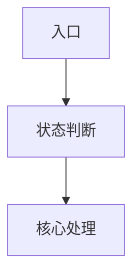

下面是一份 **`hszq-app` 使用 RepoWiki 做高质量 App 代码分析的完整方案**。核心思路是：**不要直接扫单个模块，而是按分析目标构造“上下文分析包”，再让 RepoWiki 生成 Markdown Wiki**。

# hszq-app App 代码分析完整方案：基于 RepoWiki 生成高质量 Markdown 知识库

## 一、目标

对 `/Users/kuang/xiaobu/hszq-app` 这个 Android 多模块 App 大仓进行分层、分域、可追溯的代码分析，最终沉淀出 Markdown 形式的 App 工程知识库。

目标产物包括：

1. App 整体架构说明
2. Gradle 多模块结构说明
3. App 基座能力说明
4. 核心业务域说明：交易、行情、资讯、财富、用户、搜索、自选等
5. 模块职责表
6. 分层架构图
7. 关键调用链路
8. 阅读路径
9. 后续可进入知识库的 Markdown 文档

---

## 二、为什么不能直接扫单模块

之前执行：

```bash
repowiki scan ./app-core -l zh -f markdown -o ./wiki-md/app-core
```

生成质量不高，原因是：

1. `app-core` 缺少根工程上下文
   它看不到 `settings.gradle`、`build.gradle`、`huasheng-stock/build.gradle`、`hszq-version`、`app-gradle`、脱敏后的模块映射事实，因此无法理解它在整个 App 工程里的位置。

2. 缺少依赖模块
   `app-core` 通常依赖 `core`、`common`、`platformcomm`、`platformview`、`uikit`、`hsconfig` 等模块，单扫会导致上下文断裂。

3. 缺少明确分析目标
   RepoWiki 默认更像“代码 Wiki 生成器”，如果不告诉它“要分析 App 架构、启动链路、模块依赖、业务支撑关系”，它容易生成泛泛的目录摘要。

4. Android 多模块 App 需要组合分析
   对金融 App 大仓，应按“基座能力 + 业务域 + 全仓总览”的方式分批分析，而不是简单按目录逐个扫描。

5. 本地工程的真实依赖入口不是单一 `settings.gradle`
   当前 `settings.gradle` 只显式 `include ':huasheng-stock'`，大量业务模块依赖通过 `huasheng-stock/build.gradle` 中的 `Deps.Business.*` 和 `Deps.Lib.*` 引入，具体坐标定义在 `hszq-version/src/main/java/hszq/version/Deps.kt`。因此每个分析包都必须带上 `huasheng-stock` 和 `hszq-version`，否则 RepoWiki 容易误判 Gradle 结构。

---

## 三、总体方案

采用四层分析法：

```text
第一层：App 基座分析
分析 huasheng-stock、app-core、core/core-ui-kit、common 外部依赖入口、platformcomm、platformview、uikit、app-gradle、hsconfig 等模块。

第二层：核心业务域分析
按交易、行情、资讯、用户、财富、搜索、自选等业务域构造分析包。

第三层：关键链路深挖
在业务域全貌之上，对登录、下单、开户、权限、行情切换、搜索、资讯详情等高风险链路单独构造文件级 allowlist 包，输出接近代码审查报告的链路级知识。

第四层：全仓总览分析
基于根工程配置、huasheng-stock 壳工程、hszq-version 依赖坐标和核心模块，生成 App 全局模块地图、依赖关系和阅读路径。
```

目录规划：

```text
hszq-app/
  _repowiki_input/
    app-foundation/
    trade-domain/
    flow-deep-dive-sample/
    quotes-domain/
    news-domain/
    user-domain/
    wealth-domain/
    search-domain/
    full-app/
  wiki-md-v2/
    app-foundation/
    trade-domain/
    flow-deep-dive-sample/
    quotes-domain/
    news-domain/
    user-domain/
    wealth-domain/
    search-domain/
    full-app/
```

`_repowiki_input` 是给 RepoWiki 的高质量输入包。
`wiki-md-v2` 是最终生成的 Markdown 文档目录。

其中 `trade-domain`、`quotes-domain` 是业务域候选模板；按当前文件量不能作为默认安全包直接扫描，必须先拆成子域包或关键链路包。

本方案已按本地 `/Users/kuang/xiaobu/hszq-app` 校准以下事实：

```text
1. settings.gradle 只显式 includeBuild hszq-version 和 include :huasheng-stock；大量模块 include 行是注释。
2. huasheng-stock/build.gradle 通过 Deps.Business.* 聚合业务模块，是理解 App 依赖的关键入口。
3. hszq-version/src/main/java/hszq/version/Deps.kt 定义 Lib / Business 依赖坐标，是模块地图的关键来源。
4. common 是 MODULES_FACTS.md 指向的外部仓入口；若本地未拉完整源码，只能做引用关系分析，不能下源码级结论。
5. core 当前实际可分析的是 core/core-ui-kit，不应把顶层 core 误判为完整基础库模块。
6. trade2 是子模块集合，例如 trade-core、trade-account、trade-order、trade-condition，不是单个普通 Gradle module。
7. `交易登录流程代码审查报告.md` 只是颗粒度样板，不是本方案的唯一聚焦对象。它要被提炼成“关键链路深挖模式”：任何高风险链路都不能只跑业务域包，必须额外构造文件级 allowlist 包，并在 ANALYSIS_GOAL.md 中强制输出入口分叉、运行时路由、关键类行号锚点、接口清单、时序图、误判澄清和不确定边界。
```

关键链路深挖模式可复用到以下主题：

```text
交易：登录 / 解锁 / 下单 / 撤单 / 持仓刷新 / 交易设置
行情：权限判断 / LV2 切换 / 行情详情刷新 / 自选同步
用户：登录态 / 账号中心 / 实名认证 / 设备绑定
财富：产品详情 / 购买流程 / 风险测评 / 资产同步
资讯：列表刷新 / 详情打开 / 分享 / 推荐流
搜索：搜索入口 / 联想词 / 结果聚合 / 历史记录
```

---

## 四、执行前准备

进入项目根目录：

```bash
cd /Users/kuang/xiaobu/hszq-app
source ~/.venvs/repowiki/bin/activate
```

确认配置：

```bash
repowiki config list
```

建议配置：

```bash
repowiki config set language zh
repowiki config set max_files 3000
repowiki config set max_file_size 524288
repowiki config set concurrency 6
```

说明：

```text
language = zh
生成中文文档。

max_files = 3000
App 多模块分析包文件较多，1000 可能不够。

注意：业务域包（trade-domain、quotes-domain 等）当前用 `copy_dir_if_exists`
整目录复制，文件数很容易超过 max_files=3000 而被 RepoWiki 静默截断，输出退化为泛泛模块摘要
（与第九.6 节对单链路包的告警同因）。两种应对：要么把域包也改成第九.6 节的文件级 allowlist
模式，要么按实际文件量调高 max_files 并接受更高的 token 成本与超时风险——不要默认 3000 能装下整域。
`full-app` 已在脚本里改成 facts-only 总览包，不复制全业务源码。

max_file_size = 524288
允许较大的 Gradle / 配置 / Kotlin / Java 文件进入上下文。

concurrency = 6
在当前网关可承受的前提下提高分析吞吐；若遇到限流或超时，再降到 3。
```

---

## 五、创建全局忽略规则

在项目根目录创建 `.repowikiignore`：

```bash
cat > .repowikiignore <<'EOF'
.git/
.idea/
.vscode/
.DS_Store

.gradle/
build/
*/build/
out/
outputs/
captures/

*.apk
*.aab
*.aar
*.dex
*.class
*.so
*.jar

jacocoreport/
graphify-out/
repo_child_temp.json
repo_child_git.json
repo.xml
repoproject.json

*.log
*.tmp
*.bak

*.png
*.jpg
*.jpeg
*.gif
*.webp
*.mp4
*.mov
*.zip
*.tar
*.gz
*.gzip
*.json
*.docx
*.pdf

local.properties
*.keystore
*.jks
*.p12
.env
.env.*
gradle.properties
agconnect-services.json
google-services.json
HSAPPCONFIG
INDEX_MODULE_CONFIG
livedetect_config.xml
*.cer
*.pem
id_rsa
.npmrc
EOF
```

注意不要忽略：

```text
settings.gradle
build.gradle
BUILD_FACTS.md
MODULES_FACTS.md
GRAPHIFY_FACTS.md
CODEGRAPH_FACTS.md
```

这些文件对理解工程结构很重要。原始 `gradle.properties`、`modules.properties`、`repo_child_git.json`、`CLAUDE.md`、`AGENTS.md`、`*.skill.md` 默认不入包；需要的信息由脚本生成脱敏事实文件承载。

安全提示：**不要**把以下文件放进任何分析包，它们会随源码一起外传给模型网关：

```text
gradle.properties        # 含明文签名口令 RELEASE_KEY_PASSWORD / RELEASE_STORE_PASSWORD
agconnect-services.json  # 华为 HMS 应用密钥（位于 huasheng-stock/）
google-services.json     # GCP/Firebase 配置
HSAPPCONFIG / INDEX_MODULE_CONFIG / livedetect_config.xml  # App 运行时配置、SDK 配置
*.gzip                   # 压缩资产，例如 stock_list.gzip，体积大且对架构分析无价值
modules.properties / repo_child_git.json 中的内网地址（见第六节脱敏说明）
```

`modules.properties` 不直接入包；如确需人工补充模块映射，只能另建已剥离 `*_url`（内网 GitLab 地址）的脱敏副本。脚本默认生成 `MODULES_FACTS.md` 承载这部分事实。`CLAUDE.md` / `AGENTS.md` 含内部 AI 工作流约定，默认不入包，确需时人工脱敏。

---

## 六、完整执行脚本

在 `hszq-app` 根目录创建脚本：

```bash
cat > run_repowiki_hszq_app_v2.sh <<'EOF'
#!/bin/bash
set -euo pipefail

# ============================================================
# 合规前置闸（数据出境确认）
# 本脚本会把 hszq-app 专有源码经 _repowiki_input/ 发送给 repowiki 配置的模型网关。
# 实测默认网关 api_base 为第三方云端（https://fast.qianxing-ai.cc.cd/v1），
# 对持牌券商而言，未经授权的源码外传可能违反数据安全/网络安全/监管合规要求。
# 执行前必须确认：网关部署位置、信息安全/合规审批、网关是否存储或用于训练。
# 确认后将下面一行改为 REPOWIKI_EGRESS_APPROVED=1（或在环境变量中导出）。
: "${REPOWIKI_EGRESS_APPROVED:=0}"
if [ "$REPOWIKI_EGRESS_APPROVED" != "1" ]; then
  echo "ERROR: 源码外传未获确认。请先完成数据出境合规确认，再设置 REPOWIKI_EGRESS_APPROVED=1。" >&2
  exit 1
fi
# ============================================================

cd /Users/kuang/xiaobu/hszq-app
source ~/.venvs/repowiki/bin/activate

echo "==== RepoWiki 配置 ===="
repowiki config set language zh
repowiki config set max_files 3000
repowiki config set max_file_size 524288
repowiki config set concurrency 6
repowiki config list

INPUT_ROOT="./_repowiki_input"
OUTPUT_ROOT="./wiki-md-v2"
MAX_PACKAGE_FILES=3000

rm -rf "$INPUT_ROOT"
mkdir -p "$INPUT_ROOT"
mkdir -p "$OUTPUT_ROOT"

copy_file_if_exists() {
  FILE=$1
  TARGET=$2

  if [ -f "$FILE" ]; then
    cp "$FILE" "$TARGET/"
  fi
}

copy_dir_if_exists() {
  DIR=$1
  TARGET=$2

  if [ -d "$DIR" ]; then
    rsync -a \
      --exclude build \
      --exclude .git \
      --exclude .gradle \
      --exclude .idea \
      --exclude .vscode \
      --exclude ".DS_Store" \
      --exclude "*.class" \
      --exclude "*.apk" \
      --exclude "*.aab" \
      --exclude "*.aar" \
      --exclude "*.so" \
      --exclude "*.jar" \
      --exclude "*.png" \
      --exclude "*.jpg" \
      --exclude "*.jpeg" \
      --exclude "*.gif" \
      --exclude "*.webp" \
      --exclude "*.mp4" \
      --exclude "*.mov" \
      --exclude "*.zip" \
      --exclude "*.tar" \
      --exclude "*.gz" \
      --exclude "*.gzip" \
      --exclude "*.json" \
      --exclude "*.docx" \
      --exclude "*.pdf" \
      --exclude "local.properties" \
      --exclude "*.keystore" \
      --exclude "*.jks" \
      --exclude "*.p12" \
      --exclude ".env" \
      --exclude ".env.*" \
      --exclude "gradle.properties" \
      --exclude "agconnect-services.json" \
      --exclude "google-services.json" \
      --exclude "HSAPPCONFIG" \
      --exclude "INDEX_MODULE_CONFIG" \
      --exclude "livedetect_config.xml" \
      --exclude "*.cer" \
      --exclude "*.pem" \
      --exclude "id_rsa" \
      --exclude ".npmrc" \
      "$DIR" "$TARGET/"
  fi
}

copy_path_if_exists() {
  PATH_TO_COPY=$1
  TARGET=$2

  if [ -f "$PATH_TO_COPY" ]; then
    mkdir -p "$TARGET/$(dirname "$PATH_TO_COPY")"
    cp "$PATH_TO_COPY" "$TARGET/$PATH_TO_COPY"
  fi
}

copy_tree_preserve_if_exists() {
  DIR=$1
  TARGET=$2

  if [ -d "$DIR" ]; then
    mkdir -p "$TARGET/$DIR"
    rsync -a \
      --exclude build \
      --exclude .git \
      --exclude .gradle \
      --exclude .idea \
      --exclude .vscode \
      --exclude ".DS_Store" \
      --exclude "*.class" \
      --exclude "*.apk" \
      --exclude "*.aab" \
      --exclude "*.aar" \
      --exclude "*.so" \
      --exclude "*.jar" \
      --exclude "*.png" \
      --exclude "*.jpg" \
      --exclude "*.jpeg" \
      --exclude "*.gif" \
      --exclude "*.webp" \
      --exclude "*.mp4" \
      --exclude "*.mov" \
      --exclude "*.zip" \
      --exclude "*.tar" \
      --exclude "*.gz" \
      --exclude "*.gzip" \
      --exclude "*.json" \
      --exclude "*.docx" \
      --exclude "*.pdf" \
      --exclude "local.properties" \
      --exclude "*.keystore" \
      --exclude "*.jks" \
      --exclude "*.p12" \
      --exclude ".env" \
      --exclude ".env.*" \
      --exclude "gradle.properties" \
      --exclude "agconnect-services.json" \
      --exclude "google-services.json" \
      --exclude "HSAPPCONFIG" \
      --exclude "INDEX_MODULE_CONFIG" \
      --exclude "livedetect_config.xml" \
      --exclude "*.cer" \
      --exclude "*.pem" \
      --exclude "id_rsa" \
      --exclude ".npmrc" \
      "$DIR/" "$TARGET/$DIR/"
  fi
}

write_context_facts() {
  TARGET=$1

  cat > "$TARGET/BUILD_FACTS.md" <<'FACTS'
# Build Facts

这些事实由 `run_repowiki_hszq_app_v2.sh` 从本地工程生成，用于替代不能外传的原始配置文件。

## 安全边界
- 未复制 `gradle.properties`：该文件可能包含签名口令、token、secret。
- 未复制 `modules.properties` / `repo_child_git.json`：这些文件可能包含内网 GitLab 地址。
- 未复制 `CLAUDE.md` / `AGENTS.md` / `*.skill.md`：这些文件属于内部 AI 工作流约定。
FACTS

  {
    echo
    echo "## Root Gradle Entrypoints"
    [ -f settings.gradle ] && echo "- settings.gradle: present"
    [ -f build.gradle ] && echo "- build.gradle: present"
    [ -f huasheng-stock/build.gradle ] && echo "- huasheng-stock/build.gradle: present"
    [ -f hszq-version/src/main/java/hszq/version/Deps.kt ] && echo "- hszq-version/src/main/java/hszq/version/Deps.kt: present"
    [ -d app-gradle ] && echo "- app-gradle/: present"
    echo
    echo "## Sanitized Gradle Properties"
    if [ -f gradle.properties ]; then
      awk -F= '
        /^[[:space:]]*#/ { next }
        /^[[:space:]]*$/ { next }
        {
          key=$1
          gsub(/^[[:space:]]+|[[:space:]]+$/, "", key)
          if (key ~ /(PASSWORD|SECRET|TOKEN|KEY|STORE_FILE|ALIAS)/) {
            print "- " key ": <redacted>"
          } else {
            print "- " key ": " $2
          }
        }
      ' gradle.properties
    else
      echo "- gradle.properties: missing"
    fi
    echo
    echo "## huasheng-stock Dependencies"
    if [ -f huasheng-stock/build.gradle ]; then
      rg -n "Deps\\.(Business|Lib)\\." huasheng-stock/build.gradle | sed 's/^/- /' || true
    fi
  } >> "$TARGET/BUILD_FACTS.md"

  cat > "$TARGET/MODULES_FACTS.md" <<'FACTS'
# Modules Facts

这些事实替代原始 `modules.properties`。原始文件中的 `*_url` 内网地址不会进入 RepoWiki 输入包。

## Sanitized Modules
FACTS

  if [ -f modules.properties ]; then
    awk -F= '
      /^[[:space:]]*#/ { next }
      /^[[:space:]]*$/ { next }
      $1 ~ /_url$/ { next }
      {
        key=$1
        value=$2
        gsub(/^[[:space:]]+|[[:space:]]+$/, "", key)
        gsub(/^[[:space:]]+|[[:space:]]+$/, "", value)
        print "- " key ": " value
      }
    ' modules.properties >> "$TARGET/MODULES_FACTS.md"
  else
    echo "- modules.properties: missing" >> "$TARGET/MODULES_FACTS.md"
  fi
}

copy_package_facts_if_exists() {
  PACKAGE=$1
  TARGET=$2
  FACTS_DIR="_repowiki_facts/$PACKAGE"

  if [ -f "$FACTS_DIR/CODEGRAPH_FACTS.md" ]; then
    cp "$FACTS_DIR/CODEGRAPH_FACTS.md" "$TARGET/CODEGRAPH_FACTS.md"
  fi

  if [ -f "$FACTS_DIR/GRAPHIFY_FACTS.md" ]; then
    cp "$FACTS_DIR/GRAPHIFY_FACTS.md" "$TARGET/GRAPHIFY_FACTS.md"
  fi
}

require_codegraph_facts_if_missing() {
  TARGET=$1

  if [ ! -f "$TARGET/CODEGRAPH_FACTS.md" ]; then
    cat > "$TARGET/CODEGRAPH_FACTS_REQUIRED.md" <<'FACTS'
# Codegraph Facts Missing

当前包没有提供 `CODEGRAPH_FACTS.md`。关键链路深挖仍可运行，但调用链、入口覆盖和 allowlist 校准质量会降级。

请先用 codegraph 查询链路关键词、核心类、入口类，把入口列表、调用链、关键文件、动态边界和未确认点整理为 `_repowiki_facts/<package>/CODEGRAPH_FACTS.md` 后再重跑。
FACTS
  fi
}

write_graphify_facts() {
  TARGET=$1

  if [ -f "$TARGET/GRAPHIFY_FACTS.md" ]; then
    return
  fi

  if [ ! -f "graphify-out/GRAPH_REPORT.md" ]; then
    return
  fi

  {
    echo "# Graphify Facts"
    echo
    echo "这些事实是从 graphify 输出裁剪出来的小摘要。不要把 graphify-out/graph.json、完整 GRAPH_REPORT.md 或 manifest.json 直接塞入 RepoWiki 输入包。"
    echo
    echo "## Report Summary"
    awk '
      /^## Community Hubs/ { exit }
      { print }
    ' graphify-out/GRAPH_REPORT.md
    echo
    echo "## Top Community Hubs"
    awk '
      /^## Community Hubs/ { flag=1; next }
      flag && /^- \\[\\[/ {
        print
        count++
        if (count >= 40) exit
      }
    ' graphify-out/GRAPH_REPORT.md
    echo
    echo
    echo "## Source File Sizes"
    wc -c graphify-out/GRAPH_REPORT.md graphify-out/manifest.json graphify-out/graph.json 2>/dev/null | sed "s/^/- /" || true
  } > "$TARGET/GRAPHIFY_FACTS.md"
}

copy_root_context() {
  TARGET=$1

  copy_file_if_exists settings.gradle "$TARGET"
  copy_file_if_exists build.gradle "$TARGET"
  # 安全：不复制 gradle.properties。本仓 gradle.properties 含明文签名口令
  # （RELEASE_KEY_PASSWORD / RELEASE_STORE_PASSWORD 等），严禁随源码外传给模型网关。
  # 如需工程结构信息，请改为复制剥离 RELEASE_* / *PASSWORD / *SECRET / *TOKEN 字段的脱敏副本。
  #
  # 安全：以下文件默认不复制，避免把内网拓扑与内部 AI 工作流外传给模型网关：
  #   modules.properties / repo_child_git.json —— 含内网 GitLab 地址 git@gitlab.inzwc.com
  #   CLAUDE.md / AGENTS.md / *.skill.md / repoproject.json / repo_child_temp.json —— 内部约定
  # 若 RepoWiki 确需模块映射，请使用 write_context_facts 生成的 MODULES_FACTS.md。
  write_context_facts "$TARGET"

  copy_dir_if_exists huasheng-stock "$TARGET"
  copy_dir_if_exists hszq-version "$TARGET"
  copy_dir_if_exists app-gradle "$TARGET"
}

write_ignore() {
  TARGET=$1

  cat > "$TARGET/.repowikiignore" <<'IGNORE'
.git/
.idea/
.vscode/
.DS_Store

.gradle/
build/
*/build/
out/
outputs/
captures/

*.apk
*.aab
*.aar
*.dex
*.class
*.so
*.jar

jacocoreport/
graphify-out/
repo_child_temp.json
repo_child_git.json
repo.xml
repoproject.json

*.log
*.tmp
*.bak

*.png
*.jpg
*.jpeg
*.gif
*.webp
*.mp4
*.mov
*.zip
*.tar
*.gz
*.gzip
*.json
*.docx
*.pdf

local.properties
*.keystore
*.jks
*.p12
.env
.env.*
gradle.properties
agconnect-services.json
google-services.json
HSAPPCONFIG
INDEX_MODULE_CONFIG
livedetect_config.xml
*.cer
*.pem
id_rsa
.npmrc
IGNORE
}

count_package_files() {
  TARGET=$1

  find "$TARGET" -type f \
    | grep -Ev '(^|/)(build|\.git|\.gradle|\.idea|\.vscode|out|outputs|captures)(/|$)|(^|/)\.DS_Store$|\.(class|apk|aab|aar|so|jar|png|jpg|jpeg|gif|webp|mp4|mov|zip|tar|gz|gzip|log|tmp|bak|keystore|jks|p12|cer|pem|docx|pdf|json)$|(^|/)local\.properties$|(^|/)\.env(\..*)?$|(^|/)gradle\.properties$|(^|/)agconnect-services\.json$|(^|/)google-services\.json$|(^|/)HSAPPCONFIG$|(^|/)INDEX_MODULE_CONFIG$|(^|/)livedetect_config\.xml$|(^|/)id_rsa$|(^|/)\.npmrc$' \
    | wc -l \
    | tr -d ' '
}

check_package_budget() {
  PACKAGE=$1
  TARGET="$INPUT_ROOT/$PACKAGE"
  COUNT=$(count_package_files "$TARGET")

  {
    echo "# Package Budget"
    echo
    echo "- package: $PACKAGE"
    echo "- counted_files: $COUNT"
    echo "- max_files: $MAX_PACKAGE_FILES"
  } > "$TARGET/PACKAGE_BUDGET.md"

  if [ "$COUNT" -gt "$MAX_PACKAGE_FILES" ]; then
    {
      echo
      echo "## Result"
      echo
      echo "当前包超过 RepoWiki max_files 上限，不应直接扫描。请先拆成子域包、关键链路包，或改为只输入 facts 摘要。"
    } >> "$TARGET/PACKAGE_BUDGET.md"
    echo "ERROR: $PACKAGE has $COUNT files, above max_files=$MAX_PACKAGE_FILES. Split it before scanning." >&2
    return 1
  fi
}

scan_package() {
  PACKAGE=$1

  echo "========================================"
  echo "开始生成 Wiki: $PACKAGE"
  echo "输入目录: $INPUT_ROOT/$PACKAGE"
  echo "输出目录: $OUTPUT_ROOT/$PACKAGE"
  echo "========================================"

  check_package_budget "$PACKAGE" || return 1

  repowiki scan "$INPUT_ROOT/$PACKAGE" \
    -l zh \
    -f markdown \
    -m gpt-5.5 \
    -o "$OUTPUT_ROOT/$PACKAGE"
}

make_app_foundation() {
  PACKAGE="app-foundation"
  TARGET="$INPUT_ROOT/$PACKAGE"
  mkdir -p "$TARGET"

  copy_root_context "$TARGET"

  for d in \
    app-core \
    core \
    common \
    platformcomm \
    platformview \
    uikit \
    hsconfig \
    annotation \
    annotationprocessor
  do
    copy_dir_if_exists "$d" "$TARGET"
  done

  cat > "$TARGET/ANALYSIS_GOAL.md" <<'GOAL'
# 分析目标：华盛证券 Android App 基座架构分析

请基于当前代码包，重点分析 Android 多模块 App 的工程架构，而不是只做文件目录摘要。

请重点输出：

1. 结论先行
   - 这个 App 基座整体采用什么工程架构
   - 基座模块如何支撑交易、行情、资讯、财富等业务模块
   - 当前代码组织的主要特点和潜在风险

2. 模块职责表
   - huasheng-stock、app-core、core/core-ui-kit、common、platformcomm、platformview、uikit、app-gradle、hsconfig、annotation、annotationprocessor 分别承担什么职责
   - 明确区分源码模块、外部依赖入口、配置目录和构建脚本目录
   - common 若当前包内缺少完整源码，只能根据 MODULES_FACTS.md、Deps.Lib.common 和引用点推断，不能做源码级确定结论
   - 哪些属于运行时基础能力
   - 哪些属于 UI 基座
   - 哪些属于构建配置
   - 哪些属于跨模块通信或编译期能力

3. 分层架构
   - App 壳层
   - 基础能力层
   - 平台公共层
   - UI 组件层
   - 业务模块层
   - 构建配置层
   - 编译期工具层

4. 启动与初始化链路
   - Application
   - 初始化任务
   - 配置加载
   - SDK 初始化
   - 路由初始化
   - 日志、网络、缓存初始化

5. 页面与 UI 基座
   - Activity / Fragment / ViewBinding / 页面基类
   - platformview 与 uikit 的边界
   - 公共控件如何被业务模块复用

6. 跨模块通信机制
   - Router
   - EventBus
   - Service Locator
   - 接口下沉
   - 注解处理
   - 公共协议

7. 网络、缓存、配置、日志等基础能力
   - 网络请求封装
   - 用户态 / 登录态
   - 配置中心 / 本地配置
   - 日志、埋点、异常处理

8. 对业务模块的支撑关系
   - 交易模块如何依赖基座能力
   - 行情模块如何依赖基座能力
   - 资讯模块如何依赖基座能力
   - 财富模块如何依赖基座能力

9. 输出要求
   - 不要只列文件名
   - 必须说明关键类和文件在架构中的作用
   - 必须输出模块依赖关系
   - 必须结合 huasheng-stock/build.gradle 和 hszq-version/Deps.kt 说明依赖来源
   - 必须输出建议阅读路径
   - 对不确定的地方请明确标记为“需要结合更多业务模块确认”
GOAL

  write_ignore "$TARGET"
}

make_trade_domain() {
  PACKAGE="trade-domain"
  TARGET="$INPUT_ROOT/$PACKAGE"
  mkdir -p "$TARGET"

  copy_root_context "$TARGET"

  for d in \
    app-core \
    core \
    common \
    platformcomm \
    platformview \
    uikit \
    hsconfig \
    trade \
    trade2 \
    trade-analysis \
    real-trades \
    position-change
  do
    copy_dir_if_exists "$d" "$TARGET"
  done

  cat > "$TARGET/ANALYSIS_GOAL.md" <<'GOAL'
# 分析目标：交易业务域代码分析

请基于当前代码包，重点分析交易业务域，而不是只做目录摘要。

注意：`common` 是 MODULES_FACTS.md 指向的外部仓，本包内可能为空或不完整；只能据 MODULES_FACTS.md / Deps.Lib.common / 引用点推断，不得对 common 下源码级结论。

请重点输出：

1. 结论先行
   - 交易域整体架构
   - trade、trade2/* 子模块、trade-analysis、real-trades、position-change 的职责边界
   - 是否存在新旧交易模块并存、迁移或重构迹象
   - 重点确认 trade 与 trade2/trade-core 的关系，不要把 trade2 误判为单一模块

2. 交易模块职责表
   - 每个交易相关模块的职责
   - trade2/trade-core、trade2/trade-account、trade2/trade-order、trade2/trade-condition 等子模块分别承担什么职责
   - 页面层、业务逻辑层、接口层、模型层、公共能力依赖

3. 交易核心链路
   - 交易入口
   - 账户状态
   - 下单流程
   - 委托流程
   - 成交流程
   - 持仓流程
   - 交易分析流程
   - 实时交易数据刷新

4. 接口调用链
   - API Client
   - Service / Repository
   - Request / Response / DTO / Model
   - 错误码和异常处理

5. 状态流转
   - 登录态
   - 账户态
   - 交易权限
   - 下单状态
   - 委托状态
   - 成交状态
   - 持仓状态

6. 页面与路由
   - 交易相关 Activity / Fragment / 页面入口
   - 页面跳转关系
   - DeepLink / Router 使用情况

7. 与 App 基座的关系
   - 依赖哪些公共模块
   - 依赖哪些 UI 组件
   - 依赖哪些网络、缓存、配置、日志能力

8. 风险与改进建议
   - 模块边界是否清晰
   - 是否存在重复代码
   - 是否存在历史包袱
   - 是否适合进一步沉淀为交易领域知识库

9. 输出要求
   - 必须先给结论
   - 必须输出交易链路图
   - 必须输出关键类清单
   - 必须标出哪些交易能力来自本地源码，哪些只能从 Deps.Business / Maven 坐标推断
   - 必须输出阅读路径
GOAL

  write_ignore "$TARGET"
}

make_flow_deep_dive_sample() {
  PACKAGE="flow-deep-dive-sample"
  TARGET="$INPUT_ROOT/$PACKAGE"
  mkdir -p "$TARGET"

  copy_root_context "$TARGET"

  # 关键链路深挖样例包必须控制输入规模：只复制样例链路核心目录、明确入口和少量跨域依赖。
  # 当前样例使用交易登录链路；迁移到下单、开户、权限、搜索等链路时，替换下面的 allowlist 即可。
  copy_tree_preserve_if_exists trade/src/main/java/com/hstong/trade/tradelogin "$TARGET"

  for f in \
    trade/build.gradle \
    trade/src/main/AndroidManifest.xml \
    trade/src/main/java/com/hstong/trade/TradeApplication.kt \
    trade/src/main/java/com/hstong/trade/TradeApplication.java \
    trade/src/main/java/com/hstong/trade/common/router/TransLoginInterceptor.java \
    trade/src/main/java/com/hstong/trade/common/router/TradeRouter.java \
    trade/src/main/java/com/hstong/trade/common/router/TradeRouterKt.kt \
    trade/src/main/java/com/hstong/trade/common/baseactivity/TransCommonActivity.java \
    trade/src/main/java/com/hstong/trade/placeorder/main/ui/PlaceOrderFragment.kt \
    trade/src/main/java/com/hstong/trade/tradetab/TradeContainerFragment.kt \
    trade/src/main/java/com/hstong/trade/stockdetail/StockDetailNotLoginFragment.kt \
    trade/src/main/java/com/hstong/trade/floatball/TransFloatBallManager.kt \
    trade/src/main/java/com/hstong/trade/floatball/TodayEntrustDialog.kt \
    trade/src/main/java/com/hstong/trade/setting/PreferencesSettingViewModel.kt \
    trade/src/main/java/com/hstong/trade/setting/trade/TradeUnlockSettingPresenter.java \
    trade/src/main/java/com/hstong/trade/setting/trade/MeTradeSettingFragment.kt \
    trade/src/main/java/com/hstong/trade/account/accountoverview/ui/AccountOverviewNewFragment.kt \
    trade/src/main/java/com/hstong/trade/account/assetinfo/ui/StockAccountFragment.kt \
    trade/src/main/res/layout/trans_login.xml \
    trade/src/main/res/layout/trans_login_fingerprint_item.xml \
    trade/src/main/res/layout/trans_login_input_pwd_item.xml \
    trade/src/main/res/layout/trans_login_title_leftviw.xml \
    trade/src/main/res/layout/ts_fragment_trans_set_init_password_or_login.xml \
    trade/src/main/res/values/trade_styles.xml \
    app-core/build.gradle \
    app-core/src/main/AndroidManifest.xml \
    app-core/src/main/java/com/hstong/app_core/utils/PageHelper.java \
    app-core/src/main/java/com/hstong/app_core/main/AnalysisClipBoardHelper.kt \
    trade2/trade-core/build.gradle \
    trade2/trade-core/src/main/java/com/hstong/trade/core/openaccount/TransManager.java \
    trade2/trade-account/src/main/java/com/hstong/trade/account/tradecontainer/ui/TradeContainerFragment.kt \
    quotes-common/build.gradle \
    quotes-common/src/main/java/com/hs/quotes/common/exchange/SwitchLV2Util.kt \
    quotes-common/src/main/java/com/hs/quotes/common/exchange/SwitchView.kt \
    quotes-common/src/main/java/com/hs/quotes/common/util/KmpQuotesPermissionUtil.kt \
    quotes-common/src/main/java/com/hs/quotes/common/util/QuotesPermissionUtil.kt
  do
    copy_path_if_exists "$f" "$TARGET"
  done

  REFERENCE_REPORT="/Users/kuang/xiaobu/spec-first-doc/知识库/app知识库/交易登录流程代码审查报告.md"
  if [ -f "$REFERENCE_REPORT" ]; then
    cp "$REFERENCE_REPORT" "$TARGET/REFERENCE_GRANULARITY.md"
  fi

  copy_package_facts_if_exists "$PACKAGE" "$TARGET"
  write_graphify_facts "$TARGET"
  require_codegraph_facts_if_missing "$TARGET"

  cat > "$TARGET/FLOW_DEEP_DIVE_TEMPLATE.md" <<'TEMPLATE'
# 关键链路深挖通用模板

复制本模板到新的链路包时，只替换链路名、核心类、入口文件和 allowlist。不要继承交易登录样例里的登录/解锁/指纹等特定词。

## 必须输出

1. 结论先行：链路职责、主路径、主要风险、可信度边界。
2. 入口分叉表：页面入口、路由入口、拦截器入口、回调入口、后台/事件入口。
3. Mermaid 架构图：标出 UI、业务层、公共/KMP 层、网络/接口层、状态/副作用层。
4. Mermaid 时序图：主路径、关键分支、成功后处理、失败/异常路径。
5. 关键类清单：文件路径、方法、职责、行号锚点。
6. 接口清单：接口语义、调用入口、触发时机、源码证据、源码可证/推断/不确定。
7. 状态与副作用：业务状态、缓存、路由、事件、埋点、toast、页面跳转。
8. 误判澄清：主动列出容易误读的路径，并给源码证据。
9. 风险项：编号、严重级别、触发路径、影响范围、修复建议、验证建议。

## 前置证据

- 必须先用 codegraph 生成 `CODEGRAPH_FACTS.md`，再校准 allowlist。
- graphify 只提供模块/社区背景，必须通过小型 `GRAPHIFY_FACTS.md` 进入包。
TEMPLATE

  cat > "$TARGET/ANALYSIS_GOAL.md" <<'GOAL'
# 分析目标：关键链路深度代码审查样例（交易登录）

请基于当前代码包，输出接近“交易登录流程代码审查报告”颗粒度的深度链路分析，而不是普通模块 Wiki。

如果当前包内存在 `REFERENCE_GRANULARITY.md`，它只作为输出颗粒度和报告结构参考；请提炼其结构模式，不要把分析目标限定为交易登录，也不要照抄旧结论。事实依据必须来自当前代码包中的源码、`CODEGRAPH_FACTS.md`、`GRAPHIFY_FACTS.md` 或明确标注的推断。

当前 `ANALYSIS_GOAL.md` 是“交易登录”样例。迁移到下单、开户、行情权限、搜索、资讯详情或财富购买流程时，请以 `FLOW_DEEP_DIVE_TEMPLATE.md` 为模板，替换 allowlist、核心类、入口和主分支。

本包是文件级 allowlist，不是完整交易域源码。请按“层层拆解、渐进明细、分层深入”的方式输出：

```text
第一层：链路地图
先说明有哪些入口、核心类、跨层边界和主路径，避免陷入局部细节。

第二层：核心机制
深挖当前链路的核心 UI、Presenter/ViewModel/Manager、Repository/Service、KMP/公共层桥接、错误处理、权限/token/缓存组件的职责和调用关系。

第三层：入口覆盖
补充所有业务入口如何进入当前链路，必须覆盖页面入口、路由入口、拦截器入口、回调入口、后台/事件触发入口。

第四层：副作用与外部依赖
分析 EventBus、Router、LV2 权限切换、KMP TradeLoginHelper / PermissionManager 调用点、本地 token / preference / 埋点等。

第五层：风险审查
只在前四层证据充分后输出问题清单，要求每个问题都有触发路径、源码证据、影响范围、修复建议和验证建议。
```

请重点输出：

1. 完整调用链路
   - 从业务入口到状态判断、UI 展示、用户输入/自动分支、请求发起、结果处理、后续副作用的完整链路
   - 必须区分 Android UI 层、KMP/公共业务层、网络/接口层、状态广播/副作用层
   - 必须说明调用方向：是 Android 主动调用 KMP，还是 KMP 回调/反向驱动 Android

2. 架构分层图
   - 输出 Mermaid 图，不要输出 ASCII 框图
   - 图中标出关键类、职责、方向、同步/异步边界
   - 对未检出源码的层必须标记“未检出，仅从调用点推断”

3. 运行时分叉与路由
   - 列出所有登录入口
   - 说明不同入口最终走哪条路径
   - 找出分叉条件，例如静态字段、Intent 参数、callback 是否为空、style 类型、登录态/解锁态判断
   - 明确是否存在新旧机制并存、未完成迁移、无灰度开关等现象

4. 关键类清单
   - 每个关键类必须说明职责、所在文件、关键方法
   - 尽量给出文件路径和行号锚点，例如 `TradeLoginFragment.kt:373`
   - 至少覆盖 UI、Presenter/Manager、桥接类、错误处理、指纹/token、本地状态、接口调用、登录后处理

5. 后端 / KMP / 本地接口清单
   - 输出表格：接口语义、调用入口、精确路径或推断路径、触发时机、源码证据
   - KMP 内部未检出时必须标注“不确定：KMP 源码未检出”

6. 主流程时序图
   - 输出主路径时序
   - 输出关键分支时序
   - 输出成功后处理时序
   - 输出失败 / 错误码 / 异常处理路径

7. 状态与副作用
   - 当前链路涉及的登录态、账户态、权限态、业务态如何变化
   - EventBus / Router / 本地缓存 / token / 权限 / 埋点 / toast / activity 跳转等副作用

8. 误判澄清
   - 主动指出容易误判的点
   - 例如“看似直接打开页面，实际先进 KMP/公共层判断状态”这种结论必须给源码证据

9. 风险与问题清单
   - 输出问题编号，例如 I-01、I-02
   - 每个问题包含：严重级别、影响路径、触发条件、源码证据、为什么会发生、修复建议、验证建议
   - 不要只写泛泛风险，必须能落到具体类/方法/分支

10. 可信度边界
   - 明确哪些结论由本地源码直接证明
   - 哪些结论来自 Gradle 依赖 / Maven 坐标 / KMP 调用点推断
   - 哪些需要补充仓库或运行日志才能确认

输出要求：

- 必须结论先行
- 必须有完整链路图
- 必须使用 Mermaid 输出架构图、入口分叉图和关键时序图
- 必须有入口分叉表
- 必须有接口清单
- 必须有主流程时序图
- 必须有关键类/方法/文件路径/行号锚点
- 必须有误判澄清
- 如存在 `CODEGRAPH_FACTS.md`，必须用它校准调用链和文件 allowlist；如与源码不一致，以源码为准并说明差异
- 如存在 `GRAPHIFY_FACTS.md`，只用于全局模块/社区背景，不得把 graphify 原始图谱当作源码结论
- 必须有“源码可证 / 推断 / 不确定”标记
- 不允许只输出模块目录摘要
GOAL

  write_ignore "$TARGET"
}

make_quotes_domain() {
  PACKAGE="quotes-domain"
  TARGET="$INPUT_ROOT/$PACKAGE"
  mkdir -p "$TARGET"

  copy_root_context "$TARGET"

  for d in \
    app-core \
    core \
    common \
    platformcomm \
    platformview \
    uikit \
    quotes \
    quotes-common \
    quotes-detail \
    quotes-rankings \
    quotes-watchlist \
    quotes-option \
    watchlist-core \
    market_status \
    market-crypto \
    market-monitor \
    hs-capitalflow \
    kchartbiz
  do
    copy_dir_if_exists "$d" "$TARGET"
  done

  cat > "$TARGET/ANALYSIS_GOAL.md" <<'GOAL'
# 分析目标：行情业务域代码分析

请基于当前代码包，重点分析行情业务域。

注意：`common` 是 MODULES_FACTS.md 指向的外部仓，本包内可能为空或不完整；只能据 MODULES_FACTS.md / Deps.Lib.common / 引用点推断，不得对 common 下源码级结论。

请重点输出：

1. 结论先行
   - 行情域整体架构
   - quotes、quotes-common、quotes-detail、quotes-rankings、quotes-watchlist、quotes-option 的职责边界
   - 行情数据如何被页面、图表、自选、排行榜复用

2. 模块职责表
   - 行情首页
   - 个股详情
   - 自选股行情
   - 排行榜
   - 期权行情
   - K 线 / 图表
   - 市场状态
   - 加密市场
   - 资金流

3. 行情数据链路
   - 数据源
   - 接口请求
   - WebSocket / 轮询 / 推送
   - 缓存
   - UI 刷新
   - 异常和降级

4. 页面链路
   - 行情首页
   - 个股详情
   - 自选列表
   - 排行榜
   - K 线页面
   - 期权页面

5. 状态和刷新机制
   - 行情刷新周期
   - 页面生命周期与刷新
   - 市场开闭市状态
   - 自选股状态
   - 缓存状态

6. 与 App 基座的关系
   - 依赖哪些公共网络能力
   - 依赖哪些 UI 组件
   - 依赖哪些配置能力

7. 输出要求
   - 必须输出行情数据流图
   - 必须输出核心类清单
   - 必须输出阅读路径
   - 对无法确认的调用链明确标记“不确定”
GOAL

  write_ignore "$TARGET"
}

make_news_domain() {
  PACKAGE="news-domain"
  TARGET="$INPUT_ROOT/$PACKAGE"
  mkdir -p "$TARGET"

  copy_root_context "$TARGET"

  for d in \
    app-core \
    core \
    common \
    platformcomm \
    platformview \
    uikit \
    news \
    news-other-channel \
    news-watchlists \
    headlines \
    expressnews \
    feed \
    topic \
    post
  do
    copy_dir_if_exists "$d" "$TARGET"
  done

  cat > "$TARGET/ANALYSIS_GOAL.md" <<'GOAL'
# 分析目标：资讯业务域代码分析

请基于当前代码包，重点分析资讯业务域。

注意：`common` 是 MODULES_FACTS.md 指向的外部仓，本包内可能为空或不完整；只能据 MODULES_FACTS.md / Deps.Lib.common / 引用点推断，不得对 common 下源码级结论。

请重点输出：

1. 结论先行
   - 资讯域整体架构
   - news、headlines、expressnews、feed、topic、post 的职责边界
   - 资讯流、快讯、头条、话题、帖子之间的关系

2. 模块职责表
   - 资讯首页
   - 资讯频道
   - 快讯
   - 头条
   - 资讯详情
   - 自选资讯
   - Feed
   - 话题
   - 帖子

3. 资讯数据链路
   - 频道加载
   - 列表分页
   - 详情加载
   - 推荐 / 关注 / 自选联动
   - 缓存和刷新

4. 页面链路
   - 资讯首页
   - 频道页
   - 详情页
   - 快讯页
   - 话题页
   - 帖子页

5. 与行情 / 自选的联动
   - 自选股资讯
   - 股票相关资讯
   - 行情详情页跳转资讯

6. 与 App 基座的关系
   - 网络
   - 路由
   - UI 组件
   - 图片加载
   - 埋点

7. 输出要求
   - 必须输出资讯业务流程图
   - 必须输出关键类清单
   - 必须输出阅读路径
GOAL

  write_ignore "$TARGET"
}

make_user_domain() {
  PACKAGE="user-domain"
  TARGET="$INPUT_ROOT/$PACKAGE"
  mkdir -p "$TARGET"

  copy_root_context "$TARGET"

  for d in \
    app-core \
    core \
    common \
    platformcomm \
    platformview \
    uikit \
    me \
    settings \
    message-center \
    hsconfig \
    share-business
  do
    copy_dir_if_exists "$d" "$TARGET"
  done

  cat > "$TARGET/ANALYSIS_GOAL.md" <<'GOAL'
# 分析目标：用户、设置、消息业务域代码分析

请基于当前代码包，重点分析用户中心、设置、消息中心相关代码。

注意：`common` 是 MODULES_FACTS.md 指向的外部仓，本包内可能为空或不完整；只能据 MODULES_FACTS.md / Deps.Lib.common / 引用点推断，不得对 common 下源码级结论。

请重点输出：

1. 结论先行
   - 用户域整体架构
   - me、settings、message-center 的职责边界
   - 用户态、登录态、设置项、消息中心之间的关系

2. 模块职责表
   - 我的页面
   - 设置页面
   - 消息中心
   - 分享业务
   - 用户配置

3. 用户状态链路
   - 登录态
   - 用户信息
   - 账户状态
   - 本地配置
   - 消息未读状态

4. 页面链路
   - 我的首页
   - 设置页
   - 消息中心
   - 分享入口

5. 与 App 基座的关系
   - 用户态如何被其他业务模块依赖
   - 设置项如何影响全局能力
   - 消息中心如何与推送 / 通知 / 站内信关联

6. 输出要求
   - 必须输出用户状态流转图
   - 必须输出关键类清单
   - 必须输出阅读路径
GOAL

  write_ignore "$TARGET"
}

make_wealth_domain() {
  PACKAGE="wealth-domain"
  TARGET="$INPUT_ROOT/$PACKAGE"
  mkdir -p "$TARGET"

  copy_root_context "$TARGET"

  for d in \
    app-core \
    core \
    common \
    platformcomm \
    platformview \
    uikit \
    wealth \
    ipos \
    hs-etf \
    warrant \
    valuation \
    broker-ranking
  do
    copy_dir_if_exists "$d" "$TARGET"
  done

  cat > "$TARGET/ANALYSIS_GOAL.md" <<'GOAL'
# 分析目标：财富、IPO、ETF、权证等金融业务域代码分析

请基于当前代码包，重点分析财富和金融产品相关业务。

注意：`common` 是 MODULES_FACTS.md 指向的外部仓，本包内可能为空或不完整；只能据 MODULES_FACTS.md / Deps.Lib.common / 引用点推断，不得对 common 下源码级结论。

请重点输出：

1. 结论先行
   - 财富域整体架构
   - wealth、ipos、hs-etf、warrant、valuation、broker-ranking 的职责边界

2. 模块职责表
   - 财富业务
   - IPO
   - ETF
   - 权证
   - 估值
   - 券商排行

3. 业务流程
   - 产品列表
   - 产品详情
   - 申购 / 交易 / 查看
   - 数据刷新
   - 状态流转

4. 与交易 / 行情的关系
   - 是否复用行情能力
   - 是否跳转交易
   - 是否依赖账户状态

5. 与 App 基座的关系
   - 网络
   - 路由
   - UI
   - 配置
   - 登录态

6. 输出要求
   - 必须输出金融产品业务地图
   - 必须输出关键类清单
   - 必须输出阅读路径
GOAL

  write_ignore "$TARGET"
}

make_search_domain() {
  PACKAGE="search-domain"
  TARGET="$INPUT_ROOT/$PACKAGE"
  mkdir -p "$TARGET"

  copy_root_context "$TARGET"

  for d in \
    app-core \
    core \
    common \
    platformcomm \
    platformview \
    uikit \
    search \
    searchbase \
    screener \
    watchlist-core \
    quotes-watchlist
  do
    copy_dir_if_exists "$d" "$TARGET"
  done

  cat > "$TARGET/ANALYSIS_GOAL.md" <<'GOAL'
# 分析目标：搜索、筛选、自选业务域代码分析

请基于当前代码包，重点分析搜索、筛选、自选相关能力。

注意：`common` 是 MODULES_FACTS.md 指向的外部仓，本包内可能为空或不完整；只能据 MODULES_FACTS.md / Deps.Lib.common / 引用点推断，不得对 common 下源码级结论。

请重点输出：

1. 结论先行
   - 搜索域整体架构
   - search、searchbase、screener、watchlist-core、quotes-watchlist 的职责边界

2. 模块职责表
   - 搜索入口
   - 搜索基础能力
   - 筛选器
   - 自选核心
   - 自选行情

3. 搜索链路
   - 输入
   - 联想
   - 搜索请求
   - 结果展示
   - 跳转详情

4. 自选链路
   - 添加自选
   - 删除自选
   - 自选列表
   - 自选行情刷新
   - 自选资讯联动

5. 与行情的关系
   - 搜索结果如何进入行情详情
   - 自选如何依赖行情数据

6. 输出要求
   - 必须输出搜索 / 自选流程图
   - 必须输出关键类清单
   - 必须输出阅读路径
GOAL

  write_ignore "$TARGET"
}

make_full_app() {
  PACKAGE="full-app"
  TARGET="$INPUT_ROOT/$PACKAGE"
  mkdir -p "$TARGET"

  copy_root_context "$TARGET"
  write_graphify_facts "$TARGET"

  cat > "$TARGET/ANALYSIS_GOAL.md" <<'GOAL'
# 分析目标：华盛证券 Android App 全仓总览分析

请基于当前 facts-only 代码包，输出 App 全局架构总览。此包不复制完整业务源码，只用于模块地图、依赖关系、阅读路径和后续深挖主题规划；不要输出源码级调用链结论。

请重点输出：

1. 结论先行
   - 当前 App 的总体工程架构
   - 主要业务域划分
   - 基座能力如何支撑业务模块
   - 多模块工程的优势与风险

2. 全局模块地图
   - App 基座模块
   - 平台公共模块
   - UI 组件模块
   - 交易业务模块
   - 行情业务模块
   - 资讯业务模块
   - 财富业务模块
   - 用户 / 设置 / 消息模块
   - 搜索 / 自选模块
   - 构建 / 注解 / 配置模块

3. 分层架构图
   - App 壳层
   - 基础能力层
   - 平台公共层
   - UI 组件层
   - 业务域层
   - 构建配置层

4. 核心业务域说明
   - 交易
   - 行情
   - 资讯
   - 财富
   - 用户
   - 搜索
   - 自选

5. 关键依赖关系
   - 业务模块依赖哪些公共能力
   - UI 层如何复用
   - 跨模块通信方式
   - Gradle 模块组织方式
   - settings.gradle、huasheng-stock/build.gradle、hszq-version/Deps.kt、MODULES_FACTS.md 四者之间的关系
   - 哪些模块是本地源码可证，哪些是远程 Maven 坐标或外部仓入口

6. 建议阅读路径
   - 新人理解 App 的阅读顺序
   - 架构师 review 的阅读顺序
   - 业务开发排查问题的阅读顺序

7. 风险与改进建议
   - 模块边界
   - 历史模块
   - 重复能力
   - 文档缺口
   - 适合知识库沉淀的主题

8. 输出要求
   - 必须给结论
   - 必须输出模块职责表
   - 必须输出 Mermaid 架构图
   - 必须输出阅读路径
   - 不要仅凭 settings.gradle 的 include 注释判断模块启用状态；必须以 huasheng-stock/build.gradle 的 Deps.Business.* 和 Deps.Lib.* 为主要依赖证据
   - 必须结合 BUILD_FACTS.md、MODULES_FACTS.md、GRAPHIFY_FACTS.md 标注事实来源
   - 不允许声称完整源码级覆盖；需要源码证明的结论必须指向对应业务域包或关键链路包
   - 不确定处必须标记为“不确定”
GOAL

  write_ignore "$TARGET"
}

if [ "$#" -gt 0 ]; then
  PACKAGES=("$@")
else
  PACKAGES=(
    app-foundation
    flow-deep-dive-sample
    news-domain
    user-domain
    wealth-domain
    search-domain
    full-app
  )
fi

echo "==== 构造分析输入包（仅构造将要扫描的包）===="
# 只为本次将扫描的包构造输入，避免单参数运行仍重建全部候选包。
# 包名（连字符）映射到 make 函数名（下划线）：flow-deep-dive-sample -> make_flow_deep_dive_sample
for package in "${PACKAGES[@]}"; do
  "make_${package//-/_}"
  copy_package_facts_if_exists "$package" "$INPUT_ROOT/$package"
  if [ "$package" = "full-app" ] || [[ "$package" == flow-* ]]; then
    write_graphify_facts "$INPUT_ROOT/$package"
  fi
done

echo "==== 开始 RepoWiki 分析 ===="
# 关闭 set -e 对扫描循环的影响：单包失败（限流/超时/网关错误）不应中断其余包。
FAILED_PACKAGES=()
for package in "${PACKAGES[@]}"
do
  if ! scan_package "$package"; then
    echo "[WARN] 扫描失败，跳过并继续：$package" >&2
    FAILED_PACKAGES+=("$package")
  fi
done

echo "==== 全部完成 ===="
echo "Markdown 产物目录：$OUTPUT_ROOT"
find "$OUTPUT_ROOT" -type f | sort
if [ "${#FAILED_PACKAGES[@]}" -gt 0 ]; then
  echo "以下包扫描失败，可单独重跑：./run_repowiki_hszq_app_v2.sh ${FAILED_PACKAGES[*]}" >&2
fi
EOF

chmod +x run_repowiki_hszq_app_v2.sh
```

执行：

```bash
./run_repowiki_hszq_app_v2.sh app-foundation
```

---

## 七、推荐分步执行方式

不建议第一次直接跑完整脚本。推荐先跑基座包验证质量。

### 1. 只构造并扫描 App 基座

脚本支持把包名作为位置参数，只构造并扫描指定的包。不传参数时只跑当前规模安全的默认包；`trade-domain`、`quotes-domain` 需要拆分后显式运行：

```bash
./run_repowiki_hszq_app_v2.sh app-foundation
```

无需手动编辑脚本——位置参数同时控制「构造哪些输入包」和「扫描哪些包」，单包运行不会再重建全部候选包。

### 2. 查看 App 基座产物

```bash
find ./wiki-md-v2/app-foundation -type f | sort
```

重点查看：

```bash
sed -n '1,180p' ./wiki-md-v2/app-foundation/index.md
sed -n '1,260p' ./wiki-md-v2/app-foundation/architecture.md
sed -n '1,180p' ./wiki-md-v2/app-foundation/reading-guide.md
```

### 3. 判断质量

合格标准：

```text
1. 是否能明确说出 app-core、core、common、platformcomm、platformview、uikit 的职责差异
2. 是否有分层架构，而不是只列目录
3. 是否能说明业务模块如何依赖基座
4. 是否有关键类 / 关键文件说明
5. 是否有阅读路径
6. 是否明确标记不确定内容
```

如果仍然泛泛，优先更换更强模型，而不是继续扫更多模块。

---

## 八、产物目录说明

最终产物目录：

```text
/Users/kuang/xiaobu/hszq-app/wiki-md-v2
```

候选结构如下；其中 `trade-domain`、`quotes-domain` 代表拆分后的目标域产物，不在默认安全扫描列表中直接生成：

```text
wiki-md-v2/
  app-foundation/
    index.md
    architecture.md
    reading-guide.md
    modules/
    _sidebar.md

  flow-deep-dive-sample/
    index.md
    architecture.md
    reading-guide.md
    modules/
    _sidebar.md

  news-domain/
    index.md
    architecture.md
    reading-guide.md
    modules/
    _sidebar.md

  user-domain/
    index.md
    architecture.md
    reading-guide.md
    modules/
    _sidebar.md

  wealth-domain/
    index.md
    architecture.md
    reading-guide.md
    modules/
    _sidebar.md

  search-domain/
    index.md
    architecture.md
    reading-guide.md
    modules/
    _sidebar.md

  full-app/
    index.md
    architecture.md
    reading-guide.md
    modules/
    _sidebar.md

  # 拆分后再生成，例如：
  trade-account/
  trade-order/
  trade-condition/
  quotes-home/
  quotes-detail/
  quotes-watchlist/
```

查看所有 Markdown：

```bash
find ./wiki-md-v2 -name "*.md" -type f | sort
```

---

## 九、质量提升关键点

### 1. 必须有 ANALYSIS_GOAL.md

这是提升质量最关键的一步。

没有它，RepoWiki 容易输出：

```text
这是一个 Android 模块
包含若干 Java/Kotlin 文件
主要提供基础功能
```

有了它，RepoWiki 更容易输出：

```text
该模块处于 App 基座层，负责 xxx。
它向交易、行情、资讯模块提供 xxx 能力。
其关键类 xxx 承担初始化 / 路由 / 通信 / UI 复用职责。
```

### 2. 必须带真实依赖入口上下文

每个分析包都要带：

```text
settings.gradle
build.gradle
BUILD_FACTS.md
MODULES_FACTS.md
huasheng-stock/
hszq-version/
app-gradle/
```

其中 `huasheng-stock/build.gradle` 是 App 壳工程和业务依赖聚合入口，`hszq-version/src/main/java/hszq/version/Deps.kt` 是 `Deps.Business.*` / `Deps.Lib.*` 的坐标来源，`app-gradle/` 是构建公共脚本入口。只带 `settings.gradle` 不够，因为本地大量 `include` 行是注释状态。

注意：不要把原始 `gradle.properties`、`modules.properties`、`repo_child_git.json` 直接放入输入包。脚本会生成 `BUILD_FACTS.md` 和 `MODULES_FACTS.md`，保留工程理解所需事实，同时剥离签名口令、内网地址和内部工作流约定。

### 3. 业务域分析包必须包含基座模块

例如交易域不要只放：

```text
trade/
trade2/
```

而要放：

```text
app-core/
core/core-ui-kit/
common/  # 外部仓入口；若本地没有完整源码，只能做引用级分析
platformcomm/
platformview/
uikit/
huasheng-stock/
hszq-version/
app-gradle/
trade/
trade2/
trade-analysis/
```

这样模型才能理解交易模块依赖哪些公共能力。

### 4. 不要一次扫全仓

全仓只用于最后生成总览，不适合第一次分析。

默认推荐顺序只包含当前文件规模安全的包：

```text
app-foundation
flow-deep-dive-sample
news-domain
user-domain
wealth-domain
search-domain
full-app
```

以下包不能直接按整域扫描，必须先拆分或改为 facts 摘要包：

```text
trade-domain   约 4100 文件，超过 max_files=3000
quotes-domain  约 4620 文件，超过 max_files=3000
```

推荐拆分方向：

```text
trade-domain:
  trade-account / trade-order / trade-condition / trade-setting / trade-analysis

quotes-domain:
  quotes-home / quotes-detail / quotes-watchlist / quotes-rankings / quotes-permission

full-app:
  当前脚本已改为 facts-only 总览包，只保留 BUILD_FACTS.md、MODULES_FACTS.md、GRAPHIFY_FACTS.md，以及 huasheng-stock、hszq-version、app-gradle 中少量 Gradle / Manifest / 入口类上下文；不复制交易、行情等完整业务域源码
```

### 5. 使用强模型跑深度分析

你当前模型建议使用：

```text
gpt-5.5
```

注意：`gpt-5.5` 是当前网关（`api_base = https://fast.qianxing-ai.cc.cd/v1`）的自定义别名，
不是 OpenAI 官方模型名。换用官方端点或其他代理时该名会报 invalid model；切换前先用
`repowiki config list` 确认 `api_base`，再按该网关文档取有效 model 名。

如果需要在命令行显式指定模型，可以这样跑：

```bash
repowiki scan ./_repowiki_input/app-foundation \
  -l zh \
  -f markdown \
  -o ./wiki-md-v2/app-foundation \
  -m gpt-5.5
```

如果生成结果仍然浅，优先换网关支持的更强模型，而不是继续扩大输入包。

### 6. 链路深挖必须单独建包

如果目标是类似 `交易登录流程代码审查报告.md` 的颗粒度，推荐不要直接期待 `trade-domain`、`quotes-domain` 这类业务域包输出同等深度，而是为具体链路运行单链路包。`交易登录流程代码审查报告.md` 在这里不是分析对象，而是最小样本，用来提炼报告结构和颗粒度。

```bash
./run_repowiki_hszq_app_v2.sh flow-deep-dive-sample
```

该类包必须把范围压窄到一个业务链路，并在 `ANALYSIS_GOAL.md` 中强制要求：

```text
完整调用链路
入口分叉表
运行时路由
关键类 / 方法 / 文件路径 / 行号锚点
后端或 KMP 接口清单
主路径 / 关键分支 / 成功 / 失败时序图
状态与副作用
误判澄清
源码可证 / 推断 / 不确定边界
问题编号 + 触发条件 + 修复建议 + 验证建议
```

输入规模建议控制在 `100-300` 个文件。不要复制完整 `trade/`、`quotes/`、`app-core/` 模块；应使用文件级 allowlist，只保留核心实现、入口文件、少量跨域依赖和必要的 `build.gradle` / `AndroidManifest.xml` / layout。超过 `max_files` 的大包会被截断，输出会退化成泛泛模块摘要。

普通领域包负责“理解交易域全貌”，单链路包负责“审清一个高风险链路”。两者不能互相替代。

从参考报告提炼出的可复用颗粒度是：

```text
1. 先给结论和风险等级，不先铺目录。
2. 画出入口分叉、主流程、跨层调用和副作用边界。
3. 对每个关键结论给源码文件、方法、行号或事实摘要来源。
4. 明确 Android UI、业务层、KMP/公共层、网络/接口层、状态广播层的边界。
5. 对动态路由、静态字段、callback、Intent 参数、feature flag、登录态/权限态等分叉逐项展开。
6. 接口清单必须标注“源码可证 / 坐标推断 / 外部仓缺失 / 运行时待验证”。
7. 风险项必须有编号、触发路径、影响范围、修复建议和验证建议。
8. 最后主动写可信度边界，避免把未检出源码说成确定事实。
```

落到其他链路时，只替换三件事：

```text
1. allowlist 文件清单
2. ANALYSIS_GOAL.md 里的链路名、核心类和主分支
3. _repowiki_facts/<package>/CODEGRAPH_FACTS.md 中的调用链事实
```

### 7. 用 codegraph / graphify 做前置收敛

当前 app 目录已经执行过 codegraph 和 graphify，它们可以辅助 RepoWiki，但使用方式不同：

```text
codegraph：
适合单链路深挖。先用 codegraph_explore 找入口、调用者、被调者、动态边界、关键文件和 blast radius，再把结果整理成 CODEGRAPH_FACTS.md 放入输入包。

graphify：
适合全仓模块地图和社区结构理解。只引用裁剪后的 `GRAPHIFY_FACTS.md`，不把完整 `GRAPH_REPORT.md`、`manifest.json`、`graph.json` 原样塞给 RepoWiki。
```

本地 `hszq-app` 的交易登录链路已能被 codegraph 查到有效边界：例如 `executeIfUnlocked` 在 `trade/src/main/java/com/hstong/trade/tradelogin/login/vm/LoginHelper.kt` 有 16 个调用者，`TransLoginHelp` 有多个入口调用者，`TransLoginInterceptor` 由 `TradeApplication.kt` 注册，且这些入口跨越条件单、资产、交易设置、路由拦截等目录。这说明深挖包的 allowlist 不能只复制 `trade/tradelogin/`，必须先用 codegraph caller set 校准入口覆盖，再补少量跨域依赖。

关键链路建议流程：

```text
第一步：用 codegraph_explore 查询链路关键词、核心类、入口类。
第二步：从结果中整理入口列表、调用链、关键文件、动态边界、未检出源码边界。
第三步：按这些事实修正 allowlist，只保留必要源码和少量跨域依赖。
第四步：把摘要保存到 _repowiki_facts/<package>/CODEGRAPH_FACTS.md。
第五步：再运行 RepoWiki，让它基于收敛后的证据生成报告。
```

`CODEGRAPH_FACTS.md` 建议结构：

````markdown
# Codegraph Facts

## Scope
- 链路名：
- 查询时间：
- 代码版本：

## Entrypoints
| 入口 | 文件 | 方法 | 证据 |
| --- | --- | --- | --- |

## Call Chain


## Key Files
| 文件 | 角色 | 是否必须进入 allowlist |
| --- | --- | --- |

## Dynamic Boundaries
- Router / callback / EventBus / KMP / 反射 / 静态字段等动态边界。

## Unresolved
- codegraph 无法证明、需要源码补充或运行日志确认的点。
````

这样做的收益是：RepoWiki 负责组织、解释和生成 Wiki，codegraph 负责把链路证据提前收窄，graphify 负责提供全局模块背景。三者不要混用成“把所有图谱文件都丢进模型”。`GRAPHIFY_FACTS.md` 建议控制在 `50KB` 以内，避免超过 `max_file_size=524288` 或挤占关键源码上下文。

---

## 十、后处理建议

RepoWiki 生成后，不建议直接作为最终知识库发布。建议再做一次二次整理：

### 1. 合并总览

从这些文件抽取结论：

```text
wiki-md-v2/app-foundation/index.md
wiki-md-v2/app-foundation/architecture.md
wiki-md-v2/flow-deep-dive-sample/index.md
wiki-md-v2/news-domain/index.md
wiki-md-v2/full-app/index.md
```

`trade-domain`、`quotes-domain` 不建议作为整域产物直接进入这一步；应先按第九.4 节拆成 `trade-account`、`trade-order`、`quotes-detail`、`quotes-watchlist` 等小包，再把对应 `index.md` 纳入二次整理。

整理成：

```text
docs/app-analysis/00-整体架构总览.md
docs/app-analysis/01-App基座能力.md
docs/app-analysis/02-交易业务域.md
docs/app-analysis/03-关键链路深挖样例.md
docs/app-analysis/04-行情业务域.md
docs/app-analysis/05-资讯业务域.md
docs/app-analysis/06-用户与设置.md
docs/app-analysis/07-财富业务域.md
docs/app-analysis/08-搜索与自选.md
docs/app-analysis/09-新人阅读路径.md
```

### 2. 对关键结论做人工校准

重点校准：

```text
模块职责是否准确
调用链是否真实存在
类名是否存在
接口路径是否正确
新旧模块关系是否判断准确
是否把历史模块误判为主链路
```

### 3. 进入知识库

最终建议知识库结构：

```text
研发知识库/
  hszq-app/
    00-项目总览/
    01-工程架构/
    02-App基座/
    03-交易业务域/
    04-行情业务域/
    05-资讯业务域/
    06-用户与设置/
    07-财富业务域/
    08-搜索与自选/
    09-构建与发布/
    10-问题排查/
```

---

## 十一、最终推荐执行顺序

第一步，只跑 App 基座：

```bash
./run_repowiki_hszq_app_v2.sh app-foundation
```

生成后先看：

```bash
cat ./wiki-md-v2/app-foundation/index.md
cat ./wiki-md-v2/app-foundation/architecture.md
cat ./wiki-md-v2/app-foundation/reading-guide.md
```

第二步，确认质量后看业务域：

```bash
./run_repowiki_hszq_app_v2.sh flow-deep-dive-sample
./run_repowiki_hszq_app_v2.sh news-domain user-domain wealth-domain search-domain
cat ./wiki-md-v2/flow-deep-dive-sample/index.md
cat ./wiki-md-v2/news-domain/index.md
cat ./wiki-md-v2/user-domain/index.md
cat ./wiki-md-v2/wealth-domain/index.md
cat ./wiki-md-v2/search-domain/index.md
```

交易和行情不要直接看整域包；先拆小包或链路包，再跑：

```bash
# 示例：先在脚本中新增 make_trade_order / make_quotes_detail 等 allowlist 构包函数，再扫描
./run_repowiki_hszq_app_v2.sh trade-order
./run_repowiki_hszq_app_v2.sh quotes-detail
```

第三步，看全仓总览：

```bash
./run_repowiki_hszq_app_v2.sh full-app
cat ./wiki-md-v2/full-app/index.md
cat ./wiki-md-v2/full-app/architecture.md
```

最终结论：
对于 `hszq-app` 这种 Android 金融 App 多模块大仓，最佳实践不是“逐模块直接 scan”，而是“构造分析上下文包 + 明确分析目标 + 按基座/业务域/全仓分层生成 Markdown Wiki”。这样生成的文档才会从“目录摘要”升级为“可用于研发知识库沉淀的工程架构分析”。
