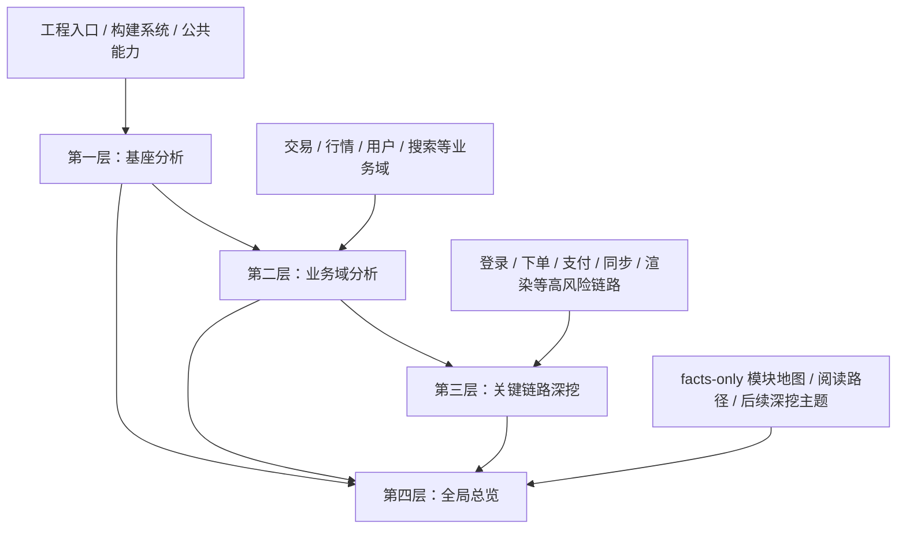
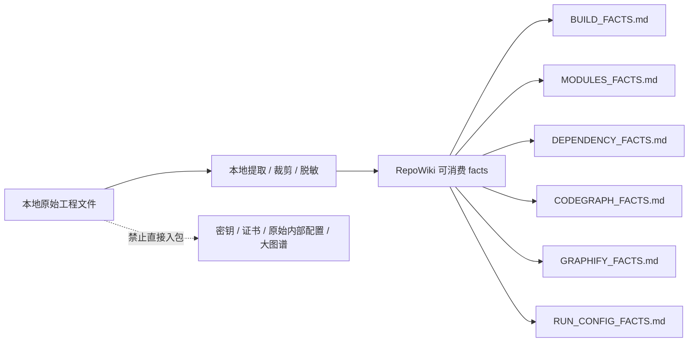
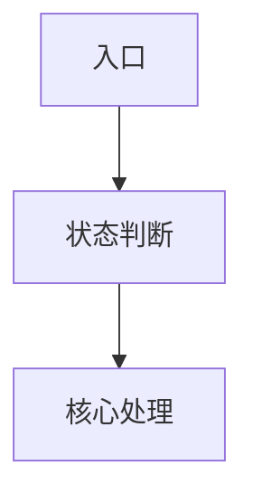
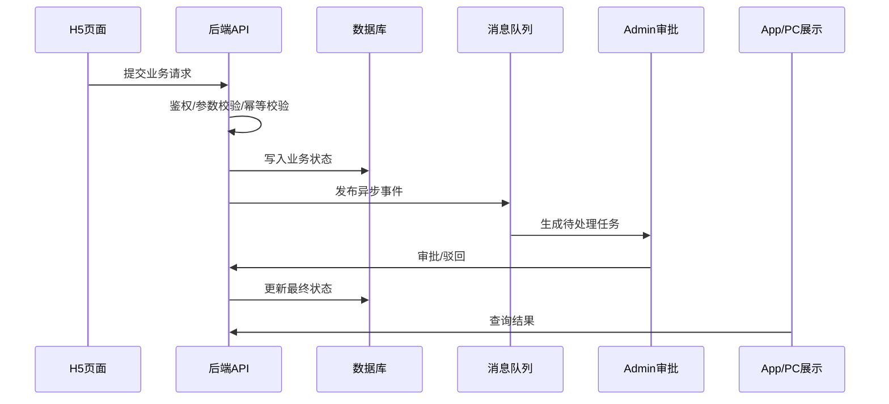

# 跨端代码知识库生成方法论：基于 RepoWiki / codegraph / graphify 的分层分析模式

本文从 `hszq-app` Android 方案中抽象一套可复用方法，用于后续分析 Android、iOS、H5、Admin、PC、后端服务、跨端公共库或多仓工程。

核心结论：**不要直接把仓库、单模块或大图谱丢给 RepoWiki。先按分析目标构造“上下文输入包”，把工程事实、依赖事实、图谱事实、源码 allowlist 和分析目标分层组织，再生成可校准的 Markdown 知识库。**

---

## 一、适用范围

适用对象：

1. Android 多模块 App
2. iOS 多 target / 多 framework 工程
3. H5 / Web 前台，例如 Vue、React、Next.js、Nuxt、微前端
4. Admin / 管理后台，例如权限后台、运营后台、CRM、风控后台
5. PC 客户端，例如 Electron、Qt、WPF、WinForms、C++/C# 混合工程
6. 后端服务，例如 Java、Go、Node.js、Python、Ruby、.NET、微服务、BFF、网关
7. 跨端公共库、KMP / C++ core / SDK / Native Bridge
8. 多仓组合工程，例如 App 壳工程 + 业务模块仓 + H5 仓 + Admin 仓 + 后端服务仓 + 公共组件仓

不适用的做法：

1. 直接 `repowiki scan ./repo`
2. 直接扫描单个看似核心的模块
3. 把密钥、证书、环境配置、压缩资产、完整 graph 文件放进输入包
4. 期待一个业务域大包输出代码审查级调用链
5. 把 graphify / codegraph 的输出当成源码事实，不做源码校准

---

## 二、总方法：四层分析 + 两类 facts

### 1. 四层分析



四层职责：

1. **基座分析**
   - 识别 App 壳、构建入口、公共组件、网络、路由、存储、日志、埋点、UI 基类。
   - 目标是回答“业务模块依赖哪些基础能力”。

2. **业务域分析**
   - 按业务目标构造包，而不是按物理目录机械扫描。
   - 目标是回答“这个业务域有哪些模块、页面、接口、状态、依赖关系”。

3. **关键链路深挖**
   - 对高风险链路单独建立文件级 allowlist 包。
   - 目标是输出接近代码审查报告的颗粒度：入口分叉、调用链、接口清单、时序图、状态副作用、风险项、可信度边界。

4. **全局总览**
   - 使用 facts-only 输入包，不复制全业务源码。
   - 目标是生成模块地图、依赖结构、阅读路径和后续深挖计划。

### 2. 两类 facts



必备 facts：

1. `BUILD_FACTS.md`
   - 构建入口、target/module/project、核心依赖声明、构建脚本关系。

2. `MODULES_FACTS.md`
   - 模块清单、模块来源、本地源码可证 / 远程依赖 / 外部仓入口。

3. `DEPENDENCY_FACTS.md`
   - CocoaPods / SwiftPM / Gradle / npm / pnpm / yarn / Maven / Gradle / Go modules / pip / Poetry / Bundler / NuGet / CMake / Visual Studio 依赖摘要。

4. `CONTRACT_FACTS.md`
   - API、路由、RPC、GraphQL、OpenAPI、数据库表、消息 topic、事件 schema、权限点、菜单路由等跨模块契约摘要。

5. `CODEGRAPH_FACTS.md`
   - 关键链路入口、调用者、被调者、动态边界、必须进入 allowlist 的文件。

6. `GRAPHIFY_FACTS.md`
   - 全局模块社区、依赖背景、重点 hub。必须裁剪成小摘要，不能直接输入完整 graph。

7. `RUN_CONFIG_FACTS.md`
   - 本次 RepoWiki / LLM 网关运行配置摘要，包括 `language`、`max_files`、`max_file_size`、`concurrency`、`model`、`api_base`、模型名校验结果、限流降级策略。
   - 模型名必须按当前网关实际可用配置验证；如果使用 `gpt-5.5` 这类网关别名，要明确标注为 `gateway_alias`，不要写成官方模型承诺。
   - `api_base` 如包含内网域名、租户标识或访问参数，知识库中只记录已脱敏 host、部署类型和审批状态，不记录 token、key 或完整私有 URL。

---

## 三、标准输入包结构

推荐所有端统一使用这个结构：

```text
<project>/
  _repowiki_input/
    <platform>-foundation/
    <platform>-domain-<name>/
    <platform>-flow-<name>/
    <platform>-full-app/
  _repowiki_facts/
    <platform>-domain-<name>/
      CODEGRAPH_FACTS.md
      GRAPHIFY_FACTS.md
  wiki-md/
    <platform>-foundation/
    <platform>-domain-<name>/
    <platform>-flow-<name>/
    <platform>-full-app/
```

命名示例：

```text
android-foundation
android-domain-trade
android-flow-trade-login
android-full-app

ios-foundation
ios-domain-trade
ios-flow-order-submit
ios-full-app

pc-foundation
pc-domain-quotes
pc-flow-login
pc-full-app

h5-foundation
h5-domain-trade
h5-flow-login
h5-full-app

admin-foundation
admin-domain-permission
admin-flow-approval
admin-full-app

backend-foundation
backend-domain-account
backend-flow-order-submit
backend-full-system
```

每个输入包至少包含：

```text
ANALYSIS_GOAL.md
RUN_CONFIG_FACTS.md
PACKAGE_BUDGET.md
BUILD_FACTS.md
MODULES_FACTS.md
DEPENDENCY_FACTS.md
CONTRACT_FACTS.md
.repowikiignore
少量必要源码 / 配置入口 / 构建入口
```

关键链路包额外包含：

```text
CODEGRAPH_FACTS.md
FLOW_DEEP_DIVE_TEMPLATE.md
文件级 allowlist 源码
少量跨域依赖源码
必要 UI 布局 / 资源声明 / manifest / route 声明
```

全局总览包只包含：

```text
RUN_CONFIG_FACTS.md
PACKAGE_BUDGET.md
BUILD_FACTS.md
MODULES_FACTS.md
DEPENDENCY_FACTS.md
CONTRACT_FACTS.md
GRAPHIFY_FACTS.md
少量工程入口文件
少量壳工程 / target / manifest / project 配置
```

全局总览包不应包含完整业务源码。

默认执行策略：

1. 默认只扫描规模安全包，例如 foundation、拆细后的 domain、flow deep dive、facts-only full-app / full-system。
2. 候选超限包只用于本地盘点和拆包决策，不直接进入 RepoWiki。
3. 超限业务域必须拆成子域包、关键链路 allowlist 包，或改为 facts-only 摘要包。
4. 原始配置文件只在本地读取并提取 facts，不能为了“补上下文”直接放入输入包。

---

## 四、通用执行流程

### 步骤 0：执行前治理闸

凡是会把专有源码、契约、配置摘要或业务事实发送到 LLM 网关的执行，都必须先过治理闸。这个步骤对 Android、iOS、H5、Admin、PC、后端和端到端链路一致适用。

最低确认项：

```text
DATA_EGRESS_APPROVED / REPOWIKI_EGRESS_APPROVED = 1
api_base 已确认部署位置
源码 / 契约 / 业务数据是否出境已确认
网关是否存储请求内容已确认
网关是否用于训练已确认
信息安全 / 合规审批已确认
敏感文件排除规则已确认
```

`RUN_CONFIG_FACTS.md` 建议结构：

````markdown
# Run Config Facts

## RepoWiki
- language: zh
- max_files: 3000
- max_file_size: 524288
- concurrency: 6
- rate_limit_fallback: concurrency 降到 3 后重试

## Model Gateway
- api_base:
- model:
- model_name_status: official | gateway_alias | unverified
- model_validation:
- sensitive_endpoint_redaction:

## Data Governance
- egress_approved: yes | no
- approval_source:
- excluded_sensitive_patterns:
````

如果治理闸或模型名校验未通过，只能做本地事实盘点，不能执行 `repowiki scan`。

### 步骤 1：先做工程盘点

目标是回答：

1. 工程入口在哪里？
2. 构建系统是什么？
3. 模块 / target / project 如何声明？
4. 哪些模块是本地源码？
5. 哪些模块来自远程依赖或外部仓？
6. 哪些配置不能外传？
7. 哪些目录是生成产物、压缩资产、二进制或大文件？
8. 对外接口、内部 RPC、页面路由、菜单权限、数据库表、消息 topic、定时任务分别在哪里声明？

输出：

```text
BUILD_FACTS.md
MODULES_FACTS.md
DEPENDENCY_FACTS.md
CONTRACT_FACTS.md
```

### 步骤 2：定义分析目标

每个包都必须有 `ANALYSIS_GOAL.md`。

最低要求：

```text
1. 结论先行
2. 模块职责表
3. 分层架构图
4. 关键类 / 文件清单
5. 调用链或数据流
6. 接口 / 路由 / 数据契约
7. 阅读路径
8. 风险与不确定边界
9. Mermaid 图，不要 ASCII 框图
```

如果没有 `ANALYSIS_GOAL.md`，RepoWiki 很容易退化为目录摘要。

### 步骤 3：构造输入包

构包原则：

1. 基座包带工程入口和公共能力。
2. 业务域包带业务模块和它依赖的基座能力。
3. 链路深挖包只带文件级 allowlist。
4. 全局总览包只带 facts 和少量入口。
5. 文件数超过上限就拆分，不继续扩大输入。
6. 每个包生成 `PACKAGE_BUDGET.md`，并把结果放入输入包。

预算闸：

```text
counted_files <= max_files
single_file_size <= max_file_size
graph facts <= 50KB
flow deep dive input ~= 100-300 files
```

`PACKAGE_BUDGET.md` 最低字段：

```text
package:
counted_files:
max_files:
max_file_size:
largest_file:
graph_facts_size:
result: pass | blocked
blocked_reason:
```

阻断规则：

1. `counted_files > max_files` 时必须中止扫描，不能依赖 RepoWiki 静默截断。
2. 单文件超过 `max_file_size` 时必须裁剪、摘要化或排除。
3. `GRAPHIFY_FACTS.md` 超过 50KB 时必须继续裁剪，不能改名绕过预算。
4. 关键链路包超过 300 文件时，应先用 codegraph caller set / route set / API set 收窄 allowlist。
5. 不允许用“直接提高 `max_files`”替代拆包；调大上限只能作为明确成本和超时风险后的例外。

### 步骤 4：用 codegraph 校准关键链路

适合问题：

1. 入口在哪里？
2. 谁调用这个方法？
3. 这个链路跨了哪些模块？
4. 动态边界在哪里？
5. allowlist 少了哪些关键文件？

`CODEGRAPH_FACTS.md` 建议结构：

````markdown
# Codegraph Facts

## Scope
- 链路名：
- 查询时间：
- 代码版本：

## Entrypoints
| 入口 | 文件 | 方法 | 证据 |
| --- | --- | --- | --- |

## Call Chain


## Key Files
| 文件 | 角色 | 是否必须进入 allowlist |
| --- | --- | --- |

## Dynamic Boundaries
- Router / callback / notification / delegate / bridge / reflection / EventBus / KMP / native bridge

## Unresolved
- 需要源码补充或运行日志确认的点
````

关键链路深挖若缺少 `CODEGRAPH_FACTS.md`，必须二选一：

1. 先补 codegraph 查询结果，再执行 RepoWiki。
2. 生成 `CODEGRAPH_FACTS_REQUIRED.md`，并在 `ANALYSIS_GOAL.md` 与最终报告中标记“调用链质量降级”。

如果目标是接近代码审查报告颗粒度，缺少 `CODEGRAPH_FACTS.md` 应视为阻断，而不是普通 warning。codegraph 只能帮助收敛 caller set 和 allowlist，最终结论仍要回到源码、契约或运行证据校准。

### 步骤 5：用 graphify 生成全局背景

适合问题：

1. 哪些模块是 hub？
2. 模块社区如何聚类？
3. 哪些目录可能是核心基础设施？
4. 后续应该优先深挖哪些链路？

边界：

1. 不直接输入完整 `graph.json`。
2. 不直接输入大型 `manifest.json`。
3. 不直接输入完整 `GRAPH_REPORT.md`。
4. 只输入裁剪后的 `GRAPHIFY_FACTS.md`。
5. graphify 只能做背景，不能替代源码证据。
6. `GRAPHIFY_FACTS.md` 建议控制在 50KB 内；完整图谱通常会超过 `max_file_size` 或挤占源码上下文，降低链路分析质量。

### 步骤 6：RepoWiki 生成后再校准

必须人工校准：

1. 类名和文件是否真实存在。
2. 调用链是否由源码证明。
3. 是否把远程依赖当成本地源码。
4. 是否把历史模块误判为主路径。
5. 是否把 graph facts 当成确定结论。
6. 是否标记了“源码可证 / 推断 / 不确定”。
7. 是否把样板报告的主题或结论误套到当前链路。
8. 是否有 `PACKAGE_BUDGET.md`、`RUN_CONFIG_FACTS.md` 和治理闸记录。

---

## 五、平台适配：Android

Android facts 来源：

```text
settings.gradle
build.gradle
build.gradle.kts
gradle/libs.versions.toml
buildSrc/
version catalog
app/build.gradle
壳工程 build.gradle
自研 Deps.kt / Versions.kt
modules.properties 的脱敏摘要
```

典型输入包：

```text
android-foundation
android-domain-trade
android-domain-quotes
android-domain-user
android-flow-login
android-flow-order
android-full-app
```

必须识别：

1. Application / Activity / Fragment / ViewModel / Repository。
2. Router / DeepLink / Interceptor。
3. 网络、缓存、登录态、权限态。
4. Gradle include 与真实依赖入口的差异。
5. 本地源码模块、Maven 坐标、外部仓入口的边界。

高风险链路：

```text
登录 / 解锁 / 下单 / 支付 / 开户 / 权限 / 推送 / 行情订阅 / 搜索 / WebView 跳转
```

---

## 六、平台适配：iOS

iOS facts 来源：

```text
*.xcworkspace
*.xcodeproj/project.pbxproj
Podfile
Podfile.lock
Package.swift
Cartfile
*.entitlements
Info.plist
Build Settings 摘要
targets / schemes / build phases 摘要
```

建议生成：

```text
PROJECT_FACTS.md
TARGETS_FACTS.md
DEPENDENCY_FACTS.md
MODULES_FACTS.md
CODEGRAPH_FACTS.md
GRAPHIFY_FACTS.md
```

iOS 输入包：

```text
ios-foundation
ios-domain-trade
ios-domain-quotes
ios-domain-user
ios-flow-login
ios-flow-order-submit
ios-flow-deeplink
ios-full-app
```

基座包应包含：

```text
AppDelegate / SceneDelegate
DI / Service Locator / Router / Coordinator
Network layer
Storage / Keychain
Analytics / Logger
BaseViewController / BaseViewModel
Common UI components
```

业务域包应包含：

```text
ViewController / View / ViewModel / Presenter
Service / Repository / UseCase
Model / DTO
Route / Coordinator
Resource bundle
必要 plist / entitlement / target 配置 facts
```

关键链路深挖要重点识别：

1. AppDelegate / SceneDelegate 入口。
2. URL Scheme / Universal Link / Push Notification 入口。
3. Coordinator / Router 分叉。
4. Delegate / Closure / Combine / RxSwift / async-await 边界。
5. Keychain / UserDefaults / local database 副作用。
6. Native SDK / WebView / JSBridge 边界。

iOS 安全排除：

```text
*.mobileprovision
*.cer
*.p12
*.pem
*.key
GoogleService-Info.plist
*.xcuserstate
xcuserdata/
DerivedData/
Pods/Build/
*.ipa
*.dSYM
```

注意：`Info.plist` 可以作为工程事实来源，但包含密钥、域名或第三方配置时应先生成脱敏 facts，不要整文件入包。

---

## 七、平台适配：H5 / Web 前台

H5 的核心不是“组件目录摘要”，而是路由、页面、状态、接口、埋点、运行时配置和构建发布链路的组合分析。

facts 来源：

```text
package.json
pnpm-lock.yaml / package-lock.json / yarn.lock
vite.config.* / webpack.config.* / next.config.* / nuxt.config.*
tsconfig.json
src/router / pages / app routes
src/store / redux / zustand / pinia / vuex
src/api / services / request client
env schema / runtime config 摘要
OpenAPI / GraphQL schema / proto / API type definitions
微前端 manifest / module federation 配置
```

建议生成：

```text
BUILD_FACTS.md
ROUTE_FACTS.md
MODULES_FACTS.md
DEPENDENCY_FACTS.md
CONTRACT_FACTS.md
CODEGRAPH_FACTS.md
GRAPHIFY_FACTS.md
```

H5 输入包：

```text
h5-foundation
h5-domain-trade
h5-domain-quotes
h5-domain-user
h5-flow-login
h5-flow-order-submit
h5-flow-payment
h5-flow-search
h5-full-app
```

基座包应包含：

```text
应用入口
路由定义
请求封装
鉴权 / token / refresh
全局状态管理
错误处理 / toast / modal
埋点 / 日志 / 监控
组件库入口
构建与部署配置 facts
```

业务域包应包含：

```text
页面 / 路由
业务组件
store / hooks / composables
api client
类型定义
表单校验
权限点
埋点事件
```

关键链路深挖要重点识别：

1. 路由入口：URL、动态路由、query、hash、redirect。
2. 权限入口：登录态、菜单权限、按钮权限、灰度开关。
3. API 链路：request wrapper、interceptor、error handler、retry、mock。
4. 状态副作用：store、localStorage、sessionStorage、cookie、IndexedDB。
5. UI 副作用：toast、modal、router push、刷新、埋点。
6. 动态边界：lazy route、dynamic import、micro frontend、iframe、postMessage。

H5 安全排除：

```text
node_modules/
dist/
build/
.next/
.nuxt/
coverage/
.env
.env.*
.npmrc
*.map
*.pem
*.pfx
runtime config 中的 token / app secret / private endpoint
```

注意：`.env.example` 可以作为配置 schema 事实来源，但真实 `.env*` 不入包。

---

## 八、平台适配：Admin / 管理后台

Admin 和普通 H5 最大差异在于：**权限、菜单、表格查询、审批流、运营配置、数据导入导出、审计日志**是核心知识，不是附属细节。

facts 来源：

```text
package.json
router / menu config
permission / RBAC / ACL config
layout / shell
api client
table schema / form schema
dictionary / enum / option source
workflow / approval config
OpenAPI / backend API types
```

建议生成：

```text
ADMIN_ROUTE_FACTS.md
PERMISSION_FACTS.md
MENU_FACTS.md
FORM_TABLE_FACTS.md
CONTRACT_FACTS.md
```

Admin 输入包：

```text
admin-foundation
admin-domain-permission
admin-domain-user-management
admin-domain-risk-control
admin-domain-operation
admin-flow-login
admin-flow-permission-check
admin-flow-approval
admin-flow-import-export
admin-full-app
```

基座包应包含：

```text
登录 / SSO / session
菜单与路由生成
权限守卫
layout / tab / breadcrumb
请求封装
全局错误处理
字典 / 枚举 / 配置中心
表格 / 表单 / 弹窗通用组件
```

业务域包应包含：

```text
菜单入口
页面路由
查询表单
结果表格
详情页
新增 / 编辑 / 删除
审批 / 状态流转
导入 / 导出
权限点
API 契约
```

关键链路深挖要重点识别：

1. 菜单如何映射到页面。
2. 权限点如何控制路由、按钮、字段、数据范围。
3. 查询条件如何映射到 API 参数。
4. 表格列、字典、枚举从哪里来。
5. 新增 / 编辑 / 审批如何处理校验、提交、状态刷新。
6. 导入导出是否有异步任务、轮询、文件下载、失败回执。
7. 操作是否写审计日志，前端是否展示可追溯信息。

Admin 安全排除：

```text
node_modules/
dist/
build/
.env
.env.*
.npmrc
导出的业务数据样例
真实用户 / 客户 / 账户数据
含内网域名和 token 的运行时配置
```

Admin 质量闸：

```text
1. 必须输出菜单-路由-权限-页面映射表。
2. 必须标注按钮权限、字段权限、数据权限是否源码可证。
3. 必须输出关键 CRUD / 审批 / 导入导出链路。
4. 必须区分前端校验、后端校验、权限后端兜底。
5. 不允许只输出组件目录摘要。
```

---

## 九、平台适配：后端服务

后端知识库的重点不是“Controller 列表”，而是服务边界、API 契约、领域模型、数据一致性、权限、异步任务、外部依赖和运行时治理。

facts 来源：

```text
pom.xml / build.gradle / settings.gradle
go.mod / go.sum
package.json / pnpm-lock.yaml
pyproject.toml / requirements.txt / Pipfile
Gemfile / Gemfile.lock
*.sln / *.csproj
Dockerfile / docker-compose.yml
Kubernetes / Helm / deployment yaml 摘要
OpenAPI / Swagger / proto / GraphQL schema
数据库 migration / schema
消息 topic / queue / stream 配置
定时任务 / job 配置
```

建议生成：

```text
SERVICE_FACTS.md
API_FACTS.md
DATABASE_FACTS.md
MESSAGE_FACTS.md
JOB_FACTS.md
PERMISSION_FACTS.md
DEPENDENCY_FACTS.md
CONTRACT_FACTS.md
```

后端输入包：

```text
backend-foundation
backend-domain-account
backend-domain-trade
backend-domain-quotes
backend-domain-risk
backend-flow-login
backend-flow-order-submit
backend-flow-settlement
backend-flow-async-job
backend-full-system
```

基座包应包含：

```text
应用启动入口
路由 / Controller / Handler 注册
中间件 / Filter / Interceptor
认证 / 鉴权
配置加载
数据库连接
事务管理
缓存
消息队列
定时任务
日志 / tracing / metrics
错误码 / 异常处理
```

业务域包应包含：

```text
Controller / Handler
Service / UseCase
Repository / DAO
Domain model
DTO / VO / request / response
数据库表 / migration
外部服务 client
消息生产 / 消费
权限点 / 审计点
测试或契约样例
```

关键链路深挖要重点识别：

1. API 入口：HTTP route、RPC method、GraphQL resolver、message consumer、job handler。
2. 认证鉴权：token、session、role、tenant、data scope。
3. 参数校验：schema、annotation、manual validation。
4. 事务边界：事务开启、提交、回滚、幂等。
5. 数据流：DB、cache、message、external API。
6. 异步边界：queue、event、job、retry、dead letter。
7. 错误策略：错误码、异常转换、降级、补偿。
8. 观测性：log、trace id、metrics、audit log。

后端安全排除：

```text
target/
build/
dist/
node_modules/
vendor/
.env
.env.*
application-prod.yml
application-secret.yml
*.pem
*.key
*.p12
*.jks
数据库 dump
真实日志
真实请求响应样本
含 token / password / secret 的配置
```

后端质量闸：

```text
1. 必须输出 API-Controller-Service-Repository-DB 映射。
2. 必须输出认证鉴权和权限兜底位置。
3. 必须标注事务边界和幂等策略。
4. 必须标注同步 / 异步 / 定时任务边界。
5. 必须区分源码可证、契约可证、运行时待验证。
6. 不允许只输出接口列表或目录摘要。
```

---

## 十、跨系统端到端链路

当一个业务链路横跨 H5、Admin、PC、App 和后端时，不要分别生成几份互相孤立的 Wiki。应先做端到端事实收敛，再拆端内深挖。

典型场景：

```text
H5 下单 -> Backend 校验/落库/发消息 -> Admin 审批/风控 -> Backend 状态流转 -> H5/PC/App 展示结果
Admin 配置活动 -> Backend 发布配置 -> H5/App 生效 -> 埋点/监控回流
App 登录 -> Backend token/session -> H5 WebView 免登 -> Admin 风控查询
```

端到端输入包：

```text
e2e-flow-login
e2e-flow-order-submit
e2e-flow-approval
e2e-flow-config-publish
e2e-flow-risk-control
```

端到端 facts：

```text
E2E_CONTRACT_FACTS.md
E2E_ENTRYPOINT_FACTS.md
E2E_STATE_FACTS.md
E2E_PERMISSION_FACTS.md
E2E_OBSERVABILITY_FACTS.md
```

`E2E_CONTRACT_FACTS.md` 必须说明：

```text
前端页面 / 路由
Admin 页面 / 菜单
后端 API / RPC / message
数据库表 / 状态字段
权限点
错误码
埋点 / 日志 / trace id
```

端到端深挖输出要求：

1. 先给端到端 Mermaid 时序图。
2. 再按端拆分：H5 / Admin / Backend / App / PC。
3. 每一跳必须有契约证据：API、DTO、schema、事件、DB 字段或源码调用点。
4. 每个状态必须标注 owner：前端临时态、后端持久态、Admin 审批态、消息异步态。
5. 每个权限判断必须标注兜底位置：前端展示控制、Admin 按钮控制、后端强校验。
6. 异步链路必须标注 retry、幂等、补偿、死信或人工处理路径。
7. 最后输出“跨端不一致风险”：字段命名、状态枚举、错误码、权限点、埋点口径、缓存刷新。

端到端 Mermaid 示例：



端到端包只放契约与入口摘要，不复制所有端的完整源码。真正需要源码级审查时，再进入对应端的 `h5-flow-*`、`admin-flow-*`、`backend-flow-*`、`android-flow-*` 或 `ios-flow-*` 包。

---

## 十一、平台适配：PC 客户端

PC 要先确认技术栈，不同技术栈的 facts 不一样。

### 1. Electron / Web 桌面

facts 来源：

```text
package.json
pnpm-lock.yaml / package-lock.json / yarn.lock
electron-builder.yml
vite.config.ts / webpack.config.js
src/main
src/renderer
preload
IPC route / bridge 摘要
```

输入包：

```text
pc-foundation
pc-domain-quotes
pc-domain-trade
pc-flow-login
pc-flow-ipc-bridge
pc-flow-update
pc-full-app
```

重点识别：

1. main process / renderer process / preload 的边界。
2. IPC 调用链。
3. 本地文件、缓存、数据库、副作用。
4. 自动更新、签名、安装包配置。
5. WebView / BrowserWindow / Native module 边界。

安全排除：

```text
dist/
out/
node_modules/
*.asar
*.exe
*.dmg
*.zip
*.pem
*.pfx
.env
.npmrc
```

### 2. C++ / Qt 客户端

facts 来源：

```text
CMakeLists.txt
*.pro / *.pri
vcpkg.json
conanfile.py / conanfile.txt
src/main.cpp
资源文件 qrc
模块 target 摘要
```

重点识别：

1. main / QApplication 入口。
2. QObject signal / slot 链路。
3. UI / service / native core 分层。
4. 网络、线程、定时器、缓存、数据库。
5. C++ core 与平台 UI 的边界。

### 3. .NET / WPF / WinForms

facts 来源：

```text
*.sln
*.csproj
Directory.Build.props
packages.lock.json
App.xaml / Program.cs
NuGet 依赖摘要
```

重点识别：

1. App / Window / Page / ViewModel。
2. MVVM binding。
3. Service / Repository / DI container。
4. Native interop / COM / WebView2。
5. 本地数据库、配置、自动更新。

---

## 十二、关键链路报告颗粒度标准

所有端的关键链路深挖都按同一标准输出。

如果使用既有代码审查报告作为参考，只能提炼它的结构、颗粒度和证据密度，不能照抄它的业务结论，也不能把样板主题强行变成当前深挖目标。建议把样板抽象成 `REFERENCE_GRANULARITY.md`：

```text
reference_report:
reference_use: structure_only | granularity_only | evidence_density_only
not_scope:
  - 不继承样板业务主题
  - 不继承样板结论
  - 不继承样板风险项
required_sections:
  - 入口分叉表
  - Mermaid 架构图
  - Mermaid 时序图
  - 关键文件行号锚点
  - 接口 / 契约清单
  - 状态与副作用
  - 误判澄清
  - 可信度边界
```

必须包含：

1. 结论先行。
2. 入口分叉表。
3. Mermaid 架构图。
4. Mermaid 主流程时序图。
5. Mermaid 关键分支图。
6. 关键类 / 方法 / 文件路径 / 行号锚点。
7. 接口清单。
8. 状态与副作用。
9. 动态边界。
10. 误判澄清。
11. 风险项。
12. 可信度边界。

风险项格式：

```text
I-01
严重级别：
影响路径：
触发条件：
源码证据：
为什么会发生：
修复建议：
验证建议：
可信度：
```

可信度标记：

```text
源码可证：本地源码直接证明。
事实摘要可证：来自 BUILD_FACTS / MODULES_FACTS / DEPENDENCY_FACTS。
调用图辅助：来自 CODEGRAPH_FACTS，但已被源码抽样校准。
图谱背景：来自 GRAPHIFY_FACTS，只作背景。
推断：根据依赖坐标、命名或调用点推断。
不确定：需要补仓、日志或运行验证。
```

---

## 十三、质量闸

生成前检查：

```text
1. 是否完成数据外传合规确认，治理闸是否通过。
2. 是否完成敏感文件排除。
3. 是否生成脱敏 facts，原始配置是否未直接入包。
4. 是否有 ANALYSIS_GOAL.md。
5. 是否有 RUN_CONFIG_FACTS.md，且模型名、api_base、并发和限流降级已记录。
6. 是否有 PACKAGE_BUDGET.md，且 counted_files / max_files / max_file_size 通过。
7. 是否只扫描规模安全包，超限域包是否已拆分或改为 facts-only。
8. 关键链路是否先跑 codegraph；缺失时是否阻断或显式降级。
9. graphify 是否裁剪为小 facts，且没有输入完整 graph / manifest / report。
10. 参考报告是否只作为颗粒度样板，没有继承样板主题和结论。
```

生成后检查：

```text
1. 是否结论先行。
2. 是否输出 Mermaid 图。
3. 是否有模块职责表。
4. 是否有关键类和文件路径。
5. 是否有阅读路径。
6. 是否标注源码可证 / 推断 / 不确定。
7. 是否出现不存在的类名、目录或接口。
8. 是否把外部依赖误写成本地源码。
9. 是否把大域包误当链路深挖。
10. 是否能沉淀进最终知识库。
```

不合格时优先修：

1. 收窄输入包。
2. 补 `ANALYSIS_GOAL.md`。
3. 补 `CODEGRAPH_FACTS.md`。
4. 调整业务域拆分。
5. 补 `PACKAGE_BUDGET.md` / `RUN_CONFIG_FACTS.md`。
6. 换更强模型。

不要优先做：

1. 继续扩大输入包。
2. 直接提高 `max_files` 逃避拆分。
3. 把完整图谱或完整配置塞给模型。

---

## 十四、最终知识库结构

推荐跨端统一沉淀为：

```text
研发知识库/
  clients/
    00-跨端总览/
    01-Android/
      00-项目总览/
      01-工程架构/
      02-基座能力/
      03-业务域/
      04-关键链路/
      05-问题排查/
    02-iOS/
      00-项目总览/
      01-工程架构/
      02-基座能力/
      03-业务域/
      04-关键链路/
      05-问题排查/
    03-H5/
      00-项目总览/
      01-工程架构/
      02-基座能力/
      03-页面与业务域/
      04-关键链路/
      05-问题排查/
    04-Admin/
      00-项目总览/
      01-工程架构/
      02-基座能力/
      03-菜单权限与业务域/
      04-关键链路/
      05-问题排查/
    05-PC/
      00-项目总览/
      01-工程架构/
      02-基座能力/
      03-业务域/
      04-关键链路/
      05-问题排查/
    06-Backend/
      00-项目总览/
      01-服务架构/
      02-基础设施能力/
      03-业务域/
      04-API与数据契约/
      05-关键链路/
      06-问题排查/
    80-端到端业务链路/
      登录与免登/
      下单与审批/
      配置发布与生效/
      风控与拦截/
      导入导出/
      消息通知/
    90-跨端公共能力/
      登录态/
      交易链路/
      行情链路/
      搜索链路/
      推送与通知/
      WebView与Bridge/
      API契约/
      权限体系/
      数据一致性/
      观测与排障/
```

跨端对齐时不要强行要求所有端目录完全同构。统一的是方法和证据标准，不是模块命名。

---

## 十五、最小可复用模板

每次接入新端，先复制这个模板：

```text
0. 治理与运行配置
   - DATA_EGRESS_APPROVED / REPOWIKI_EGRESS_APPROVED：
   - api_base：
   - model：
   - model_name_status：
   - language：
   - max_files：
   - max_file_size：
   - concurrency：
   - 限流降级策略：

1. 工程入口
   - 构建系统：
   - 壳工程：
   - target/module/project：
   - 依赖声明：

2. 输入包
   - foundation：
   - domain：
   - flow：
   - full-app：
   - e2e-flow：

3. facts
   - RUN_CONFIG_FACTS.md：
   - PACKAGE_BUDGET.md：
   - BUILD_FACTS.md：
   - MODULES_FACTS.md：
   - DEPENDENCY_FACTS.md：
   - CONTRACT_FACTS.md：
   - CODEGRAPH_FACTS.md：
   - GRAPHIFY_FACTS.md：

4. 排除规则
   - 密钥：
   - 证书：
   - 大文件：
   - 二进制：
   - 生成产物：
   - 内部配置：
   - 真实业务数据：

5. 深挖链路优先级
   - P0：
   - P1：
   - P2：

6. 端到端关系
   - 上游系统：
   - 下游系统：
   - API / RPC / message：
   - 数据状态 owner：
   - 权限兜底：
   - 观测入口：

7. 验收标准
   - Mermaid 图：
   - 关键类路径：
   - 接口清单：
   - 契约 / 权限 / 数据边界：
   - 时序图：
   - 风险项：
   - 可信度边界：
   - REFERENCE_GRANULARITY.md：
```

---

## 十六、一句话原则

```text
先提取事实，再构造输入包；
大域看全貌，小链路深挖；
图谱只做前置收敛，源码才是最终证据；
RepoWiki 负责组织输出，人工负责校准入库。
```
